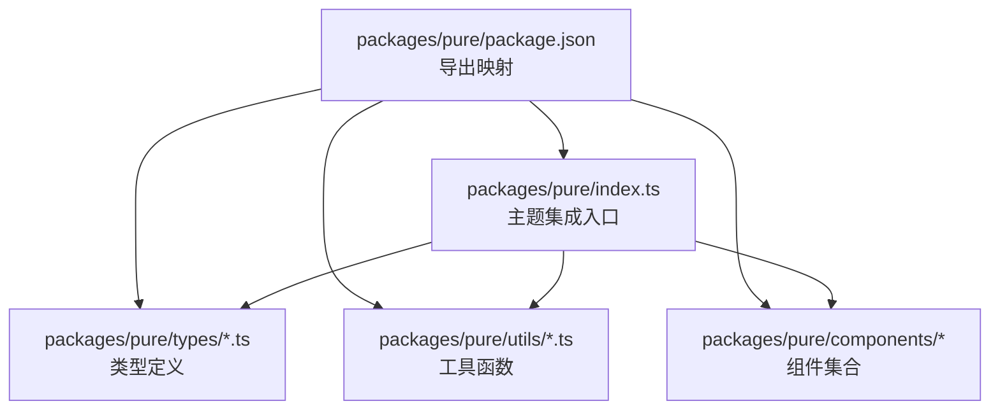
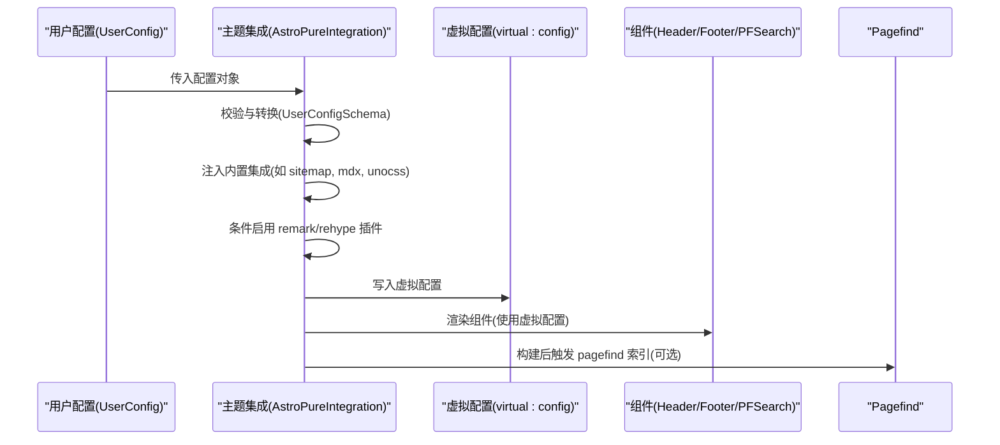
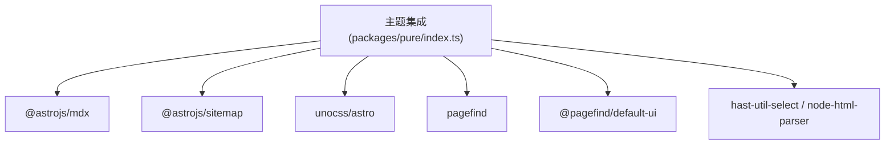

# API参考

<cite>
**本文引用的文件**
- [packages/pure/package.json](file://packages/pure/package.json)
- [packages/pure/index.ts](file://packages/pure/index.ts)
- [packages/pure/types/user-config.ts](file://packages/pure/types/user-config.ts)
- [packages/pure/types/theme-config.ts](file://packages/pure/types/theme-config.ts)
- [packages/pure/types/integrations-config.ts](file://packages/pure/types/integrations-config.ts)
- [packages/pure/utils/index.ts](file://packages/pure/utils/index.ts)
- [packages/pure/utils/class-merge.ts](file://packages/pure/utils/class-merge.ts)
- [packages/pure/utils/clsx.ts](file://packages/pure/utils/clsx.ts)
- [packages/pure/utils/date.ts](file://packages/pure/utils/date.ts)
- [packages/pure/utils/reading-time.ts](file://packages/pure/utils/reading-time.ts)
- [packages/pure/utils/theme.ts](file://packages/pure/utils/theme.ts)
- [packages/pure/utils/toast.ts](file://packages/pure/utils/toast.ts)
- [packages/pure/components/basic/Header.astro](file://packages/pure/components/basic/Header.astro)
- [packages/pure/components/basic/Footer.astro](file://packages/pure/components/basic/Footer.astro)
- [packages/pure/components/pages/PFSearch.astro](file://packages/pure/components/pages/PFSearch.astro)
- [packages/pure/components/user/Button.astro](file://packages/pure/components/user/Button.astro)
- [packages/pure/components/user/Card.astro](file://packages/pure/components/user/Card.astro)
- [packages/pure/components/advanced/Quote.astro](file://packages/pure/components/advanced/Quote.astro)
</cite>

## 目录
1. [简介](#简介)
2. [项目结构](#项目结构)
3. [核心组件](#核心组件)
4. [架构总览](#架构总览)
5. [详细组件分析](#详细组件分析)
6. [依赖关系分析](#依赖关系分析)
7. [性能考量](#性能考量)
8. [故障排查指南](#故障排查指南)
9. [结论](#结论)
10. [附录](#附录)

## 简介
本文件为 Astro 主题 Pure 的完整 API 参考，覆盖以下方面：
- 主题配置 API：包括站点配置、用户配置、集成配置的参数说明与使用要点
- 组件 API：各组件的 props、事件与插槽定义
- 工具函数 API：utils 目录下各类工具函数的参数、返回值与使用场景
- 类型定义 API：TypeScript 类型声明与接口定义
- 集成 API：第三方服务（如 Pagefind、Waline、UnoCSS）的集成接口规范
- 版本兼容性与迁移指南：版本演进与迁移建议
- 实时更新与准确性保障：基于仓库源码的权威说明

## 项目结构
Pure 主题以 Astro 集成形式提供，核心导出通过包的 exports 字段暴露：
- 根入口：主题集成函数
- 子模块导出：组件集合、工具函数、类型、服务端工具等

图表来源
- [packages/pure/package.json](file://packages/pure/package.json#L28-L38)
- [packages/pure/index.ts](file://packages/pure/index.ts#L1-L114)

章节来源
- [packages/pure/package.json](file://packages/pure/package.json#L1-L51)
- [packages/pure/index.ts](file://packages/pure/index.ts#L1-L114)

## 核心组件
本节概述主题提供的核心能力与对外 API。

- 主题集成函数
  - 入口：默认导出为主题集成函数，接收用户配置对象，内部进行校验与插件注入
  - 关键行为：自动注入 sitemap、MDX、UnoCSS；根据配置启用 mediumZoom、阅读时长统计、外部链接标记、表格滚动支持；在构建完成后可调用 pagefind 进行索引
- 配置体系
  - 用户配置：合并主题配置与集成配置，内置默认值与约束（如 pagefind 仅在预渲染开启时可用）
  - 主题配置：站点元数据、头像、语言、标题分隔符、预渲染策略、CDN、页眉/页脚、内容策略等
  - 集成配置：Pagefind 搜索、随机语录、UnoCSS 排版风格、mediumZoom、Waline 评论系统等
- 工具函数
  - 样式类合并：clsx、simpleMerge、cn
  - 文本处理：mdast 转字符串
  - 阅读时长：按中日韩字符规则计算
  - 日期格式化：基于虚拟配置中的 locale
  - 主题切换：本地存储、系统偏好监听、主题色 meta 更新
  - 通知提示：自定义事件派发
- 组件
  - 基础组件：Header、Footer
  - 页面组件：PFSearch（Pagefind 默认 UI）
  - 用户组件：Button、Card 等
  - 高级组件：Quote（从远端服务拉取语录）

章节来源
- [packages/pure/index.ts](file://packages/pure/index.ts#L19-L114)
- [packages/pure/types/user-config.ts](file://packages/pure/types/user-config.ts#L1-L27)
- [packages/pure/types/theme-config.ts](file://packages/pure/types/theme-config.ts#L1-L193)
- [packages/pure/types/integrations-config.ts](file://packages/pure/types/integrations-config.ts#L1-L66)
- [packages/pure/utils/index.ts](file://packages/pure/utils/index.ts#L1-L18)

## 架构总览
主题集成在 Astro 配置阶段完成插件与配置注入，运行时通过虚拟配置与组件协作实现功能。

图表来源
- [packages/pure/index.ts](file://packages/pure/index.ts#L32-L96)
- [packages/pure/components/basic/Header.astro](file://packages/pure/components/basic/Header.astro#L74-L108)
- [packages/pure/components/pages/PFSearch.astro](file://packages/pure/components/pages/PFSearch.astro#L19-L53)

章节来源
- [packages/pure/index.ts](file://packages/pure/index.ts#L19-L114)

## 详细组件分析

### 主题配置 API

- 用户配置 UserConfig
  - 来源：主题配置与集成配置的合并，内置默认值与约束
  - 关键点：
    - pagefind 仅在 prerender 为 true 时默认启用，且禁用 prerender 时不支持 pagefind
    - 提供严格的输入校验与友好错误映射
  - 使用示例路径：
    - [packages/pure/types/user-config.ts](file://packages/pure/types/user-config.ts#L1-L27)
    - [packages/pure/index.ts](file://packages/pure/index.ts#L33-L37)

- 主题配置 ThemeConfig
  - 字段概览：
    - title、author、description、favicon、socialCard、logo、tagline
    - locale、head、customCss、titleDelimiter、prerender、npmCDN
    - header.menu、footer.year、footer.links、footer.credits、footer.social
    - content.externalLinks、content.blogPageSize、content.share
  - 使用示例路径：
    - [packages/pure/types/theme-config.ts](file://packages/pure/types/theme-config.ts#L11-L193)

- 集成配置 IntegrationConfig
  - 字段概览：
    - links（友链）
    - pagefind（是否启用 Pagefind）
    - quote（远端语录服务：server、target）
    - typography（排版样式：class、blockquoteStyle、inlineCodeBlockStyle）
    - mediumZoom（启用、选择器、选项）
    - waline（启用、server、showMeta、emoji、additionalConfigs）
  - 使用示例路径：
    - [packages/pure/types/integrations-config.ts](file://packages/pure/types/integrations-config.ts#L5-L66)

章节来源
- [packages/pure/types/user-config.ts](file://packages/pure/types/user-config.ts#L1-L27)
- [packages/pure/types/theme-config.ts](file://packages/pure/types/theme-config.ts#L1-L193)
- [packages/pure/types/integrations-config.ts](file://packages/pure/types/integrations-config.ts#L1-L66)
- [packages/pure/index.ts](file://packages/pure/index.ts#L32-L96)

### 组件 API

- Header（页眉）
  - 功能：展示站点标题、菜单项、搜索入口、深色模式切换、移动端菜单展开
  - 事件与交互：
    - 滚动时调整样式与显示状态
    - 点击深色模式按钮：切换主题并派发提示
    - 点击菜单按钮：切换展开状态
  - 使用示例路径：
    - [packages/pure/components/basic/Header.astro](file://packages/pure/components/basic/Header.astro#L1-L209)

- Footer（页脚）
  - 功能：展示版权年份、作者、链接列表（按位置分组）、“Powered by”、社交图标
  - 事件与交互：无显式事件，主要为静态渲染
  - 使用示例路径：
    - [packages/pure/components/basic/Footer.astro](file://packages/pure/components/basic/Footer.astro#L1-L91)

- PFSearch（站点搜索）
  - 功能：在生产环境加载 Pagefind 默认 UI，开发环境提示不可用
  - 事件与交互：页面空闲时初始化 PagefindUI，格式化结果 URL
  - 使用示例路径：
    - [packages/pure/components/pages/PFSearch.astro](file://packages/pure/components/pages/PFSearch.astro#L1-L70)

- Button（按钮）
  - Props：
    - as：HTML 标签或组件（多态）
    - title：按钮文本
    - href：跳转链接
    - variant：button、pill、back、ahead
    - target：链接目标
    - class：自定义样式类
  - 插槽：before、after（用于前后图标）
  - 使用示例路径：
    - [packages/pure/components/user/Button.astro](file://packages/pure/components/user/Button.astro#L1-L91)

- Card（卡片）
  - Props：
    - as：HTML 标签或组件（多态）
    - heading：主标题
    - subheading：副标题
    - date：日期
    - class：自定义样式类
  - 插槽：默认插槽用于承载内容
  - 使用示例路径：
    - [packages/pure/components/user/Card.astro](file://packages/pure/components/user/Card.astro#L1-L33)

- Quote（语录）
  - 功能：从远端服务拉取语录，按配置的 target 函数渲染到组件
  - 使用示例路径：
    - [packages/pure/components/advanced/Quote.astro](file://packages/pure/components/advanced/Quote.astro#L1-L41)

章节来源
- [packages/pure/components/basic/Header.astro](file://packages/pure/components/basic/Header.astro#L1-L209)
- [packages/pure/components/basic/Footer.astro](file://packages/pure/components/basic/Footer.astro#L1-L91)
- [packages/pure/components/pages/PFSearch.astro](file://packages/pure/components/pages/PFSearch.astro#L1-L70)
- [packages/pure/components/user/Button.astro](file://packages/pure/components/user/Button.astro#L1-L91)
- [packages/pure/components/user/Card.astro](file://packages/pure/components/user/Card.astro#L1-L33)
- [packages/pure/components/advanced/Quote.astro](file://packages/pure/components/advanced/Quote.astro#L1-L41)

### 工具函数 API

- 样式类合并
  - clsx：条件拼接类名
  - simpleMerge：去重合并多个类名
  - cn：clsx 与 simpleMerge 的组合
  - 使用示例路径：
    - [packages/pure/utils/clsx.ts](file://packages/pure/utils/clsx.ts#L1-L25)
    - [packages/pure/utils/class-merge.ts](file://packages/pure/utils/class-merge.ts#L1-L20)
    - [packages/pure/utils/index.ts](file://packages/pure/utils/index.ts#L1-L18)

- 文本处理
  - mdast-util-to-string：将 mdast 节点树转为纯文本
  - 使用示例路径：
    - [packages/pure/utils/index.ts](file://packages/pure/utils/index.ts#L1-L18)

- 阅读时长
  - getReadingTime：按中日韩字符规则统计字数与阅读时间
  - 返回值：包含文本描述、分钟数、毫秒数、字数
  - 使用示例路径：
    - [packages/pure/utils/reading-time.ts](file://packages/pure/utils/reading-time.ts#L1-L77)
    - [packages/pure/utils/index.ts](file://packages/pure/utils/index.ts#L1-L18)

- 日期格式化
  - getFormattedDate：基于虚拟配置中的 locale 与 options 格式化日期
  - 使用示例路径：
    - [packages/pure/utils/date.ts](file://packages/pure/utils/date.ts#L1-L18)
    - [packages/pure/utils/index.ts](file://packages/pure/utils/index.ts#L1-L18)

- 主题切换
  - getTheme：读取本地主题
  - listenThemeChange：监听系统主题变化
  - setTheme：设置主题并更新 meta 主题色
  - 使用示例路径：
    - [packages/pure/utils/theme.ts](file://packages/pure/utils/theme.ts#L1-L41)
    - [packages/pure/utils/index.ts](file://packages/pure/utils/index.ts#L1-L18)

- 通知提示
  - showToast：派发 toast 自定义事件
  - 使用示例路径：
    - [packages/pure/utils/toast.ts](file://packages/pure/utils/toast.ts#L1-L4)
    - [packages/pure/utils/index.ts](file://packages/pure/utils/index.ts#L1-L18)

章节来源
- [packages/pure/utils/index.ts](file://packages/pure/utils/index.ts#L1-L18)
- [packages/pure/utils/clsx.ts](file://packages/pure/utils/clsx.ts#L1-L25)
- [packages/pure/utils/class-merge.ts](file://packages/pure/utils/class-merge.ts#L1-L20)
- [packages/pure/utils/reading-time.ts](file://packages/pure/utils/reading-time.ts#L1-L77)
- [packages/pure/utils/date.ts](file://packages/pure/utils/date.ts#L1-L18)
- [packages/pure/utils/theme.ts](file://packages/pure/utils/theme.ts#L1-L41)
- [packages/pure/utils/toast.ts](file://packages/pure/utils/toast.ts#L1-L4)

### 类型定义 API
- UserConfig/UserInputConfig：用户配置的推断与输入类型
- ThemeConfig/ThemeUserConfig：主题配置的推断与输入类型
- IntegrationConfig/IntegrationUserConfig：集成配置的推断与输入类型
- 使用示例路径：
  - [packages/pure/types/user-config.ts](file://packages/pure/types/user-config.ts#L1-L27)
  - [packages/pure/types/theme-config.ts](file://packages/pure/types/theme-config.ts#L191-L193)
  - [packages/pure/types/integrations-config.ts](file://packages/pure/types/integrations-config.ts#L64-L66)

章节来源
- [packages/pure/types/user-config.ts](file://packages/pure/types/user-config.ts#L1-L27)
- [packages/pure/types/theme-config.ts](file://packages/pure/types/theme-config.ts#L191-L193)
- [packages/pure/types/integrations-config.ts](file://packages/pure/types/integrations-config.ts#L64-L66)

### 集成 API
- Pagefind 搜索
  - 启用方式：在集成配置中设置 pagefind
  - 行为：构建完成后自动执行 pagefind 索引
  - 使用示例路径：
    - [packages/pure/index.ts](file://packages/pure/index.ts#L98-L110)
    - [packages/pure/components/pages/PFSearch.astro](file://packages/pure/components/pages/PFSearch.astro#L1-L70)

- Waline 评论系统
  - 启用方式：在集成配置中设置 waline.enable 并提供 server
  - 可选配置：showMeta、emoji、additionalConfigs
  - 使用示例路径：
    - [packages/pure/types/integrations-config.ts](file://packages/pure/types/integrations-config.ts#L49-L61)

- UnoCSS 排版
  - 启用方式：内置集成，可通过 typography 配置 class、blockquoteStyle、inlineCodeBlockStyle
  - 使用示例路径：
    - [packages/pure/index.ts](file://packages/pure/index.ts#L48-L50)
    - [packages/pure/types/integrations-config.ts](file://packages/pure/types/integrations-config.ts#L27-L37)

- 外部链接标记与表格滚动
  - 启用方式：通过 rehype 插件注入
  - 使用示例路径：
    - [packages/pure/index.ts](file://packages/pure/index.ts#L57-L66)

章节来源
- [packages/pure/index.ts](file://packages/pure/index.ts#L42-L96)
- [packages/pure/types/integrations-config.ts](file://packages/pure/types/integrations-config.ts#L1-L66)
- [packages/pure/components/pages/PFSearch.astro](file://packages/pure/components/pages/PFSearch.astro#L1-L70)

## 依赖关系分析
主题集成对第三方库的依赖与作用：
- @astrojs/mdx：Markdown/MDX 支持
- @astrojs/sitemap：站点地图生成
- unocss/astro：原子化 CSS 与主题重置
- @pagefind/default-ui：搜索 UI
- hast-util-select、node-html-parser：HTML 解析与选择
- pagefind：搜索索引工具
- @unocss/reset：CSS 重置
- unocss：原子化 CSS 引擎

图表来源
- [packages/pure/index.ts](file://packages/pure/index.ts#L8-L10)
- [packages/pure/package.json](file://packages/pure/package.json#L39-L49)

章节来源
- [packages/pure/package.json](file://packages/pure/package.json#L39-L49)
- [packages/pure/index.ts](file://packages/pure/index.ts#L1-L114)

## 性能考量
- 预渲染与搜索：pagefind 仅在 prerender 开启时默认启用，避免在非预渲染输出模式下产生不一致
- 插件注入时机：在 Astro 配置阶段注入，减少运行时开销
- 组件懒加载：Pagefind UI 在空闲回调中初始化，降低首屏阻塞
- 样式策略：scopedStyleStrategy 使用 where，避免全局污染

章节来源
- [packages/pure/types/user-config.ts](file://packages/pure/types/user-config.ts#L21-L23)
- [packages/pure/index.ts](file://packages/pure/index.ts#L92-L96)
- [packages/pure/components/pages/PFSearch.astro](file://packages/pure/components/pages/PFSearch.astro#L29-L49)

## 故障排查指南
- 配置无效或报错
  - 现象：集成抛出配置错误
  - 排查：确认传入配置为对象且包含必要字段；检查 UserConfigSchema 校验
  - 参考路径：
    - [packages/pure/index.ts](file://packages/pure/index.ts#L20-L24)
    - [packages/pure/index.ts](file://packages/pure/index.ts#L33-L37)

- pagefind 不生效
  - 现象：构建后未生成索引
  - 排查：确认 prerender 为 true；检查集成配置中 pagefind 设置
  - 参考路径：
    - [packages/pure/types/user-config.ts](file://packages/pure/types/user-config.ts#L21-L23)
    - [packages/pure/index.ts](file://packages/pure/index.ts#L98-L110)

- 主题切换无效
  - 现象：点击深色模式按钮无变化
  - 排查：确认 setTheme 调用与 DOM 元素存在；检查系统主题监听逻辑
  - 参考路径：
    - [packages/pure/utils/theme.ts](file://packages/pure/utils/theme.ts#L1-L41)
    - [packages/pure/components/basic/Header.astro](file://packages/pure/components/basic/Header.astro#L87-L98)

- 搜索 UI 不显示
  - 现象：开发模式下提示不可用，生产模式未加载
  - 排查：确认非开发模式；检查 Pagefind UI 初始化与资源路径
  - 参考路径：
    - [packages/pure/components/pages/PFSearch.astro](file://packages/pure/components/pages/PFSearch.astro#L8-L16)
    - [packages/pure/components/pages/PFSearch.astro](file://packages/pure/components/pages/PFSearch.astro#L28-L49)

章节来源
- [packages/pure/index.ts](file://packages/pure/index.ts#L20-L24)
- [packages/pure/index.ts](file://packages/pure/index.ts#L98-L110)
- [packages/pure/utils/theme.ts](file://packages/pure/utils/theme.ts#L1-L41)
- [packages/pure/components/pages/PFSearch.astro](file://packages/pure/components/pages/PFSearch.astro#L8-L16)

## 结论
本参考文档基于仓库源码梳理了 Pure 主题的配置、组件、工具函数与第三方集成 API，提供了参数、行为与使用示例路径，便于开发者快速定位与正确使用。建议在实际项目中结合虚拟配置与组件 props 进行定制，并遵循配置约束与性能建议。

## 附录

### 版本兼容性与迁移指南
- 版本号与发布信息
  - 包版本：参见包导出与版本字段
  - 参考路径：
    - [packages/pure/package.json](file://packages/pure/package.json#L5-L5)
- 迁移建议
  - 若从旧版本升级：优先检查 pagefind 与 prerender 的组合使用；确认 waline 配置项是否需要迁移
  - 若引入新特性：优先通过集成配置启用，避免直接修改主题内部逻辑
- 参考路径：
  - [packages/pure/types/user-config.ts](file://packages/pure/types/user-config.ts#L21-L23)
  - [packages/pure/types/integrations-config.ts](file://packages/pure/types/integrations-config.ts#L1-L66)

章节来源
- [packages/pure/package.json](file://packages/pure/package.json#L5-L5)
- [packages/pure/types/user-config.ts](file://packages/pure/types/user-config.ts#L21-L23)
- [packages/pure/types/integrations-config.ts](file://packages/pure/types/integrations-config.ts#L1-L66)