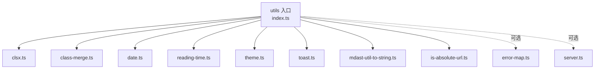
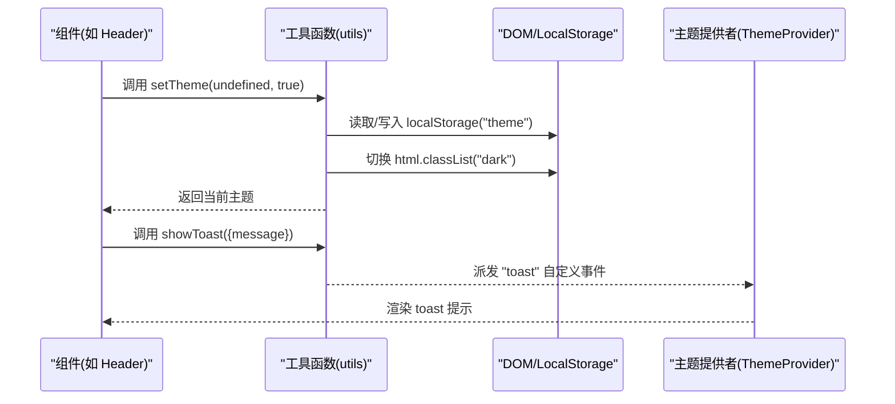
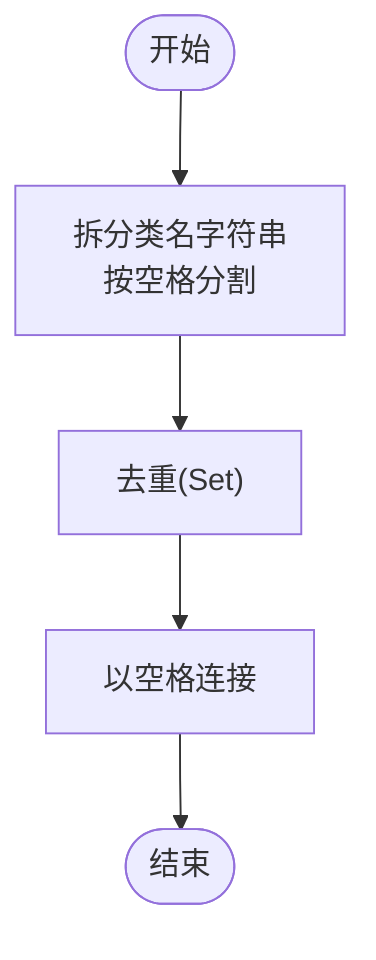
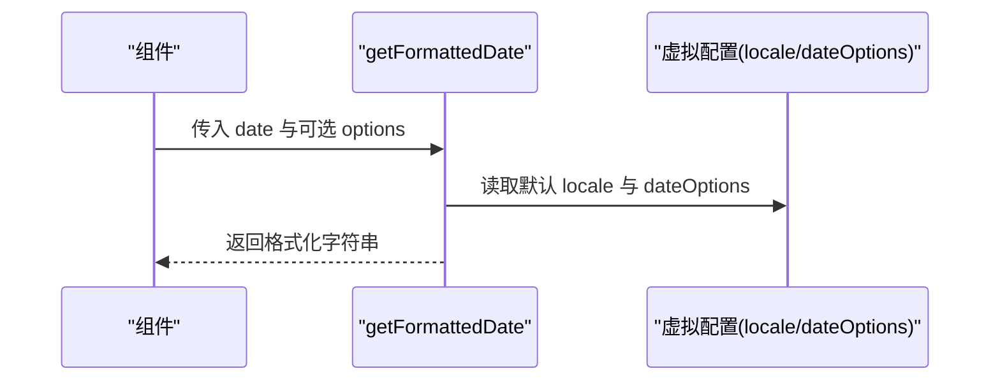
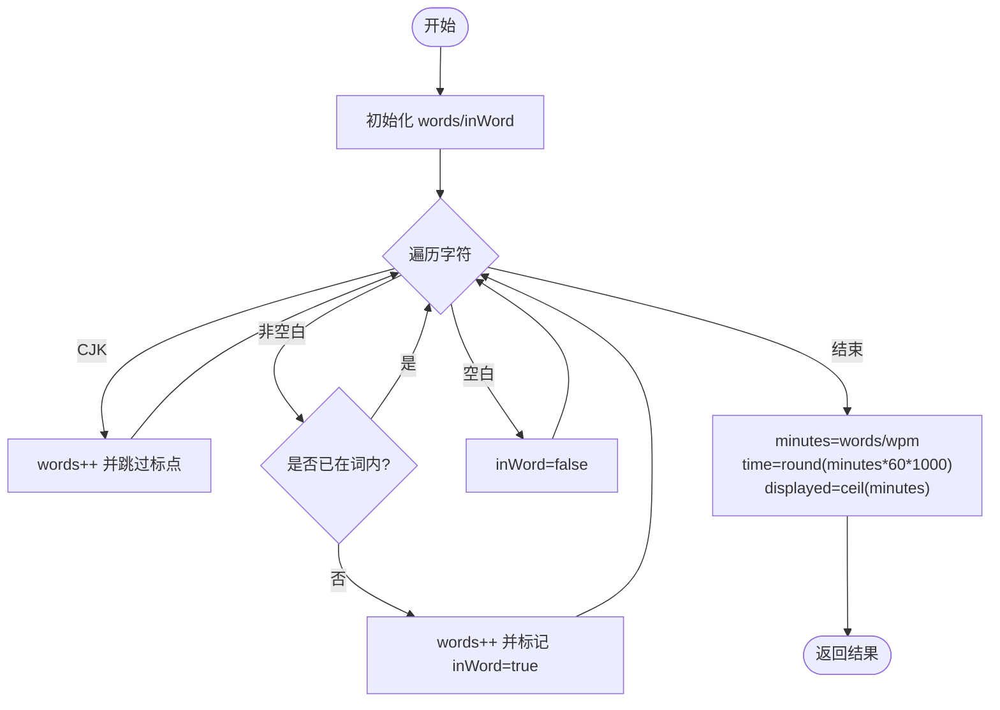
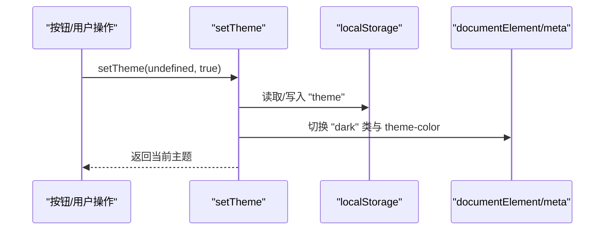
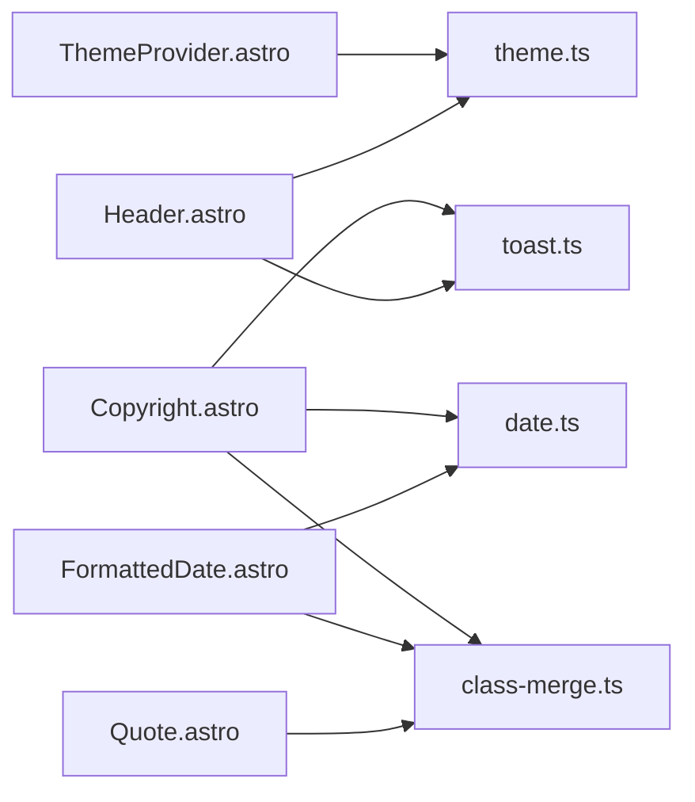

# 工具函数API

<cite>
**本文引用的文件**
- [packages/pure/utils/index.ts](file://packages/pure/utils/index.ts)
- [packages/pure/utils/class-merge.ts](file://packages/pure/utils/class-merge.ts)
- [packages/pure/utils/clsx.ts](file://packages/pure/utils/clsx.ts)
- [packages/pure/utils/date.ts](file://packages/pure/utils/date.ts)
- [packages/pure/utils/reading-time.ts](file://packages/pure/utils/reading-time.ts)
- [packages/pure/utils/theme.ts](file://packages/pure/utils/theme.ts)
- [packages/pure/utils/toast.ts](file://packages/pure/utils/toast.ts)
- [packages/pure/utils/mdast-util-to-string.ts](file://packages/pure/utils/mdast-util-to-string.ts)
- [packages/pure/utils/is-absolute-url.ts](file://packages/pure/utils/is-absolute-url.ts)
- [packages/pure/utils/error-map.ts](file://packages/pure/utils/error-map.ts)
- [packages/pure/utils/server.ts](file://packages/pure/utils/server.ts)
- [packages/pure/components/user/FormattedDate.astro](file://packages/pure/components/user/FormattedDate.astro)
- [packages/pure/components/basic/ThemeProvider.astro](file://packages/pure/components/basic/ThemeProvider.astro)
- [packages/pure/components/basic/Header.astro](file://packages/pure/components/basic/Header.astro)
- [packages/pure/components/pages/Copyright.astro](file://packages/pure/components/pages/Copyright.astro)
</cite>

## 目录
1. [简介](#简介)
2. [项目结构](#项目结构)
3. [核心组件](#核心组件)
4. [架构总览](#架构总览)
5. [详细组件分析](#详细组件分析)
6. [依赖关系分析](#依赖关系分析)
7. [性能考量](#性能考量)
8. [故障排查指南](#故障排查指南)
9. [结论](#结论)
10. [附录](#附录)

## 简介
本文件系统性梳理并说明工具函数模块（utils）的接口规范与使用方法，覆盖以下方面：
- 类名合并工具：clsx、simpleMerge、cn 的参数、返回值与最佳实践
- 日期处理工具：getFormattedDate 的参数、格式化选项与国际化配置
- 阅读时间计算：getReadingTime 的算法、输入文本与可选参数
- 主题切换工具：getTheme、listenThemeChange、setTheme 的实现原理与调用方式
- 其他常用工具：mdast-to-string、is-absolute-url、toast、错误映射与服务端集合处理
- 每个工具函数的使用场景、完整代码示例路径、性能优化建议与常见陷阱

## 项目结构
utils 目录对外统一通过入口导出，便于在组件中按需引入或整体导入。

图表来源
- [packages/pure/utils/index.ts](file://packages/pure/utils/index.ts#L1-L18)
- [packages/pure/utils/clsx.ts](file://packages/pure/utils/clsx.ts#L1-L25)
- [packages/pure/utils/class-merge.ts](file://packages/pure/utils/class-merge.ts#L1-L20)
- [packages/pure/utils/date.ts](file://packages/pure/utils/date.ts#L1-L18)
- [packages/pure/utils/reading-time.ts](file://packages/pure/utils/reading-time.ts#L1-L77)
- [packages/pure/utils/theme.ts](file://packages/pure/utils/theme.ts#L1-L41)
- [packages/pure/utils/toast.ts](file://packages/pure/utils/toast.ts#L1-L4)
- [packages/pure/utils/mdast-util-to-string.ts](file://packages/pure/utils/mdast-util-to-string.ts#L1-L52)
- [packages/pure/utils/is-absolute-url.ts](file://packages/pure/utils/is-absolute-url.ts#L1-L36)
- [packages/pure/utils/error-map.ts](file://packages/pure/utils/error-map.ts#L1-L178)
- [packages/pure/utils/server.ts](file://packages/pure/utils/server.ts#L1-L67)

章节来源
- [packages/pure/utils/index.ts](file://packages/pure/utils/index.ts#L1-L18)

## 核心组件
- 类名合并工具
  - clsx：支持字符串、数字、布尔、对象、数组等混合输入，生成去空格、去空值的类名串
  - simpleMerge：对传入的多个字符串类名进行去重拆分后合并
  - cn：基于 clsx 的增强版合并器，先经 clsx 规范化再做去重合并
- 日期处理工具
  - getFormattedDate：基于虚拟配置中的 locale 与 dateOptions，支持覆盖选项进行本地化格式化
- 阅读时间计算
  - getReadingTime：支持中日韩字符与英文单词的混合统计，支持自定义每分钟字词数
- 主题切换工具
  - getTheme：读取本地存储的主题
  - listenThemeChange：监听系统深色模式变化并自动更新主题
  - setTheme：设置主题，支持循环切换与持久化
- 其他工具
  - mdastToString：从 mdast 节点序列化为纯文本，支持是否包含图片 alt 与 html
  - isAbsoluteUrl：判断 URL 是否为绝对地址（兼容 Windows 路径）
  - showToast：派发 toast 自定义事件，供主题提供者消费显示提示

章节来源
- [packages/pure/utils/clsx.ts](file://packages/pure/utils/clsx.ts#L1-L25)
- [packages/pure/utils/class-merge.ts](file://packages/pure/utils/class-merge.ts#L1-L20)
- [packages/pure/utils/date.ts](file://packages/pure/utils/date.ts#L1-L18)
- [packages/pure/utils/reading-time.ts](file://packages/pure/utils/reading-time.ts#L1-L77)
- [packages/pure/utils/theme.ts](file://packages/pure/utils/theme.ts#L1-L41)
- [packages/pure/utils/mdast-util-to-string.ts](file://packages/pure/utils/mdast-util-to-string.ts#L1-L52)
- [packages/pure/utils/is-absolute-url.ts](file://packages/pure/utils/is-absolute-url.ts#L1-L36)
- [packages/pure/utils/toast.ts](file://packages/pure/utils/toast.ts#L1-L4)

## 架构总览
工具函数在前端组件中的典型调用链路如下：

图表来源
- [packages/pure/components/basic/Header.astro](file://packages/pure/components/basic/Header.astro#L73-L108)
- [packages/pure/utils/theme.ts](file://packages/pure/utils/theme.ts#L12-L40)
- [packages/pure/utils/toast.ts](file://packages/pure/utils/toast.ts#L1-L4)
- [packages/pure/components/basic/ThemeProvider.astro](file://packages/pure/components/basic/ThemeProvider.astro#L22-L40)

## 详细组件分析

### 类名合并工具：clsx、simpleMerge、cn
- 接口与行为
  - clsx：接收任意数量的 ClassValue（字符串、数字、布尔、对象、数组），递归展开并过滤无效值，输出单一类名串
  - simpleMerge：将多个类名字符串按空格拆分，去重后合并为一个类名串
  - cn：先用 clsx 规范化，再用 simpleMerge 去重合并，适合在 Astro 组件中组合动态样式
- 参数与返回
  - clsx(...inputs: ClassValue[]): string
  - simpleMerge(...classes: string[]): string
  - cn(...inputs: ClassValue[]): string
- 使用场景
  - 在组件中根据 props 动态拼装样式类名，避免重复与空值
  - 与 UnoCSS 或 TailwindCSS 的原子类配合使用
- 最佳实践
  - 优先使用 cn，确保输入规范化后再去重
  - 对于复杂条件，先用变量缓存中间结果，提升可读性
- 示例路径
  - [packages/pure/components/advanced/Quote.astro](file://packages/pure/components/advanced/Quote.astro#L7)
  - [packages/pure/components/user/FormattedDate.astro](file://packages/pure/components/user/FormattedDate.astro#L17)
  - [packages/pure/components/pages/Copyright.astro](file://packages/pure/components/pages/Copyright.astro#L36)

图表来源
- [packages/pure/utils/class-merge.ts](file://packages/pure/utils/class-merge.ts#L3-L15)

章节来源
- [packages/pure/utils/clsx.ts](file://packages/pure/utils/clsx.ts#L5-L22)
- [packages/pure/utils/class-merge.ts](file://packages/pure/utils/class-merge.ts#L3-L19)

### 日期处理工具：getFormattedDate
- 接口与行为
  - getFormattedDate(date: string | number | Date, options?: Intl.DateTimeFormatOptions): string
  - 若传入 options，则与全局配置的 locale/dateOptions 合并后格式化；否则使用全局默认格式
- 参数与返回
  - date：接受字符串、数值或 Date 对象
  - options：可选的 Intl 本地化选项，用于覆盖默认格式
  - 返回：格式化后的日期字符串
- 使用场景
  - 文章发布/更新时间展示、版权信息中的日期渲染
- 示例路径
  - [packages/pure/components/user/FormattedDate.astro](file://packages/pure/components/user/FormattedDate.astro#L14)
  - [packages/pure/components/pages/Copyright.astro](file://packages/pure/components/pages/Copyright.astro#L60-L66)

图表来源
- [packages/pure/utils/date.ts](file://packages/pure/utils/date.ts#L5-L17)

章节来源
- [packages/pure/utils/date.ts](file://packages/pure/utils/date.ts#L1-L18)

### 阅读时间计算：getReadingTime
- 接口与行为
  - getReadingTime(text: string, wordsPerMinute?: number): ReadingTimeResult
  - 支持中日韩字符与英文单词混合统计，自动跳过 CJK 标点
- 数据模型
  - ReadingTimeResult: { text: string, minutes: number, time: number, words: number }
- 算法要点
  - 遍历字符，识别 CJK 字符与空白字符，统计“词”数
  - CJK 字符计为 1 词，遇到 CJK 标点则跳过
  - 英文按空白分词
  - 默认每分钟 200 词，可通过第二个参数调整
- 参数与返回
  - text：待统计的文本
  - wordsPerMinute：可选，默认 200
  - 返回：包含显示文本、分钟数、毫秒数与词数的对象
- 使用场景
  - 文章卡片、文章页头展示预计阅读时长
- 示例路径
  - [packages/pure/components/pages/PostPreview.astro](file://packages/pure/components/pages/PostPreview.astro#L1-L200)（使用 cn 进行样式拼接，阅读时长可结合该组件展示）

图表来源
- [packages/pure/utils/reading-time.ts](file://packages/pure/utils/reading-time.ts#L39-L73)

章节来源
- [packages/pure/utils/reading-time.ts](file://packages/pure/utils/reading-time.ts#L16-L77)

### 主题切换工具：getTheme、listenThemeChange、setTheme
- 接口与行为
  - getTheme(): string | null —— 读取本地存储的主题
  - listenThemeChange(theme?: string): void —— 监听系统深色模式变化（当主题为 system 时生效）
  - setTheme(theme?: string, save?: boolean): string —— 设置主题，支持循环切换与持久化
- 行为细节
  - 支持主题枚举：['system', 'dark', 'light']
  - 当 theme 为 'system' 时，依据系统偏好设置目标主题，并注册变更监听
  - 切换时同步更新 documentElement 的 'dark' 类与 meta[name="theme-color"] 的颜色
- 参数与返回
  - theme：可选，指定主题或触发循环切换
  - save：可选，是否保存到 localStorage
  - 返回：最终生效的主题
- 使用场景
  - 头部按钮点击切换主题、页面加载时初始化主题
- 示例路径
  - [packages/pure/components/basic/Header.astro](file://packages/pure/components/basic/Header.astro#L89-L98)
  - [packages/pure/components/basic/ThemeProvider.astro](file://packages/pure/components/basic/ThemeProvider.astro#L27-L27)

图表来源
- [packages/pure/utils/theme.ts](file://packages/pure/utils/theme.ts#L12-L40)

章节来源
- [packages/pure/utils/theme.ts](file://packages/pure/utils/theme.ts#L1-L41)

### 其他工具函数

#### mdast-to-string：从 mdast 节点序列化为纯文本
- 接口与行为
  - 默认函数：toString(value: unknown, options?: Options): string
  - Options：includeImageAlt?: boolean, includeHtml?: boolean
- 使用场景
  - 生成摘要、索引标题、SEO 描述等纯文本内容
- 示例路径
  - [packages/pure/utils/mdast-util-to-string.ts](file://packages/pure/utils/mdast-util-to-string.ts#L21-L24)

章节来源
- [packages/pure/utils/mdast-util-to-string.ts](file://packages/pure/utils/mdast-util-to-string.ts#L1-L52)

#### is-absolute-url：判断 URL 是否为绝对地址
- 接口与行为
  - isAbsoluteUrl(url: string): boolean
  - 特殊处理 Windows 路径
- 使用场景
  - 导航链接、分享链接的相对/绝对判断
- 示例路径
  - [packages/pure/utils/is-absolute-url.ts](file://packages/pure/utils/is-absolute-url.ts#L27-L35)

章节来源
- [packages/pure/utils/is-absolute-url.ts](file://packages/pure/utils/is-absolute-url.ts#L1-L36)

#### toast：派发 toast 自定义事件
- 接口与行为
  - showToast(detail: { message: string }): void
- 使用场景
  - 主题切换提示、复制链接成功提示
- 示例路径
  - [packages/pure/utils/toast.ts](file://packages/pure/utils/toast.ts#L1-L4)
  - [packages/pure/components/basic/Header.astro](file://packages/pure/components/basic/Header.astro#L97-L97)
  - [packages/pure/components/pages/Copyright.astro](file://packages/pure/components/pages/Copyright.astro#L143-L143)

章节来源
- [packages/pure/utils/toast.ts](file://packages/pure/utils/toast.ts#L1-L4)

#### 错误映射与友好报错（可选）
- 接口与行为
  - parseWithFriendlyErrors(schema, input, message): z.output<T>
  - parseAsyncWithFriendlyErrors(schema, input, message): Promise<z.output<T>>
  - 内置 errorMap 将 Zod 错误转换为更易读的消息
- 使用场景
  - 内容校验、表单数据验证、异步校验
- 示例路径
  - [packages/pure/utils/error-map.ts](file://packages/pure/utils/error-map.ts#L23-L56)

章节来源
- [packages/pure/utils/error-map.ts](file://packages/pure/utils/error-map.ts#L1-L178)

#### 服务端集合处理（可选）
- 接口与行为
  - getBlogCollection(contentType?): Promise<CollectionEntry[]>
  - groupCollectionsByYear(collections): [number, CollectionEntry<T>[]][]
  - sortMDByDate(collections): Collections
  - getAllTags/getUniqueTags/getUniqueTagsWithCount(collections)
- 使用场景
  - 归档、标签云、按年份分组、排序
- 示例路径
  - [packages/pure/utils/server.ts](file://packages/pure/utils/server.ts#L8-L66)

章节来源
- [packages/pure/utils/server.ts](file://packages/pure/utils/server.ts#L1-L67)

## 依赖关系分析
- 组件对工具函数的依赖
  - Header、ThemeProvider、FormattedDate、Copyright 等组件直接或间接依赖 utils 中的函数
- 工具函数内部依赖
  - getFormattedDate 依赖虚拟配置中的 locale 与 dateOptions
  - setTheme 依赖 localStorage 与系统媒体查询
  - showToast 依赖自定义事件机制

图表来源
- [packages/pure/components/basic/Header.astro](file://packages/pure/components/basic/Header.astro#L73-L108)
- [packages/pure/components/basic/ThemeProvider.astro](file://packages/pure/components/basic/ThemeProvider.astro#L22-L40)
- [packages/pure/components/user/FormattedDate.astro](file://packages/pure/components/user/FormattedDate.astro#L4-L14)
- [packages/pure/components/pages/Copyright.astro](file://packages/pure/components/pages/Copyright.astro#L6-L13)
- [packages/pure/components/advanced/Quote.astro](file://packages/pure/components/advanced/Quote.astro#L7-L7)
- [packages/pure/utils/theme.ts](file://packages/pure/utils/theme.ts#L12-L40)
- [packages/pure/utils/toast.ts](file://packages/pure/utils/toast.ts#L1-L4)
- [packages/pure/utils/date.ts](file://packages/pure/utils/date.ts#L1-L18)
- [packages/pure/utils/class-merge.ts](file://packages/pure/utils/class-merge.ts#L17-L19)

章节来源
- [packages/pure/utils/index.ts](file://packages/pure/utils/index.ts#L1-L18)

## 性能考量
- 类名合并
  - cn 先经 clsx 规范化再去重，避免重复计算与多次 split/trim，适合高频拼装
  - 建议在组件外部缓存静态类名，仅合并动态部分
- 日期格式化
  - getFormattedDate 会复用 Intl.DateTimeFormat 实例，尽量减少重复实例化
  - 如需大量格式化，可考虑在组件层缓存结果
- 阅读时间
  - getReadingTime 为 O(n) 线性扫描，n 为文本长度；对超长文本可考虑分段或节流
  - CJK 标点跳过逻辑避免重复统计，注意大文本中正则匹配开销
- 主题切换
  - setTheme 仅切换类名与 meta，避免重排与重绘；监听系统主题变化时注意去抖
- toast
  - 事件派发轻量，但注意避免短时间内大量触发导致 UI 抖动

## 故障排查指南
- getFormattedDate 未按预期格式化
  - 检查虚拟配置中的 locale 与 dateOptions 是否正确
  - 确认传入的 date 类型是否为可被 Date 构造的值
  - 参考路径：[packages/pure/utils/date.ts](file://packages/pure/utils/date.ts#L9-L16)
- setTheme 不生效或循环异常
  - 确认传入的主题值在 ['system','dark','light'] 范围内
  - 检查 localStorage 是否被其他逻辑覆盖
  - 参考路径：[packages/pure/utils/theme.ts](file://packages/pure/utils/theme.ts#L12-L40)
- showToast 无提示
  - 确认主题提供者已监听 "toast" 事件并正确渲染
  - 参考路径：[packages/pure/components/basic/ThemeProvider.astro](file://packages/pure/components/basic/ThemeProvider.astro#L29-L39)
- getReadingTime 结果偏高/偏低
  - 检查文本是否包含隐藏字符或特殊编码
  - 调整 wordsPerMinute 参数以适配目标语种
  - 参考路径：[packages/pure/utils/reading-time.ts](file://packages/pure/utils/reading-time.ts#L39-L73)
- is-absolute-url 判断错误
  - 注意 Windows 路径会被视为相对路径
  - 参考路径：[packages/pure/utils/is-absolute-url.ts](file://packages/pure/utils/is-absolute-url.ts#L31-L34)

章节来源
- [packages/pure/utils/date.ts](file://packages/pure/utils/date.ts#L9-L16)
- [packages/pure/utils/theme.ts](file://packages/pure/utils/theme.ts#L12-L40)
- [packages/pure/components/basic/ThemeProvider.astro](file://packages/pure/components/basic/ThemeProvider.astro#L29-L39)
- [packages/pure/utils/reading-time.ts](file://packages/pure/utils/reading-time.ts#L39-L73)
- [packages/pure/utils/is-absolute-url.ts](file://packages/pure/utils/is-absolute-url.ts#L31-L34)

## 结论
本工具函数库提供了前端开发中高频使用的通用能力：类名合并、日期格式化、阅读时间计算、主题切换与提示通知。通过统一入口导出与清晰的接口设计，开发者可在组件中以最小成本获得一致的体验与良好的性能表现。建议在团队内约定使用 cn 作为首选类名合并器，合理利用虚拟配置与事件机制，避免在热路径上进行昂贵的重复计算。

## 附录
- 使用示例路径汇总
  - 类名合并：[packages/pure/components/advanced/Quote.astro](file://packages/pure/components/advanced/Quote.astro#L7)
  - 日期格式化：[packages/pure/components/user/FormattedDate.astro](file://packages/pure/components/user/FormattedDate.astro#L14)
  - 主题切换与提示：[packages/pure/components/basic/Header.astro](file://packages/pure/components/basic/Header.astro#L95-L98)
  - 版权信息中的日期展示：[packages/pure/components/pages/Copyright.astro](file://packages/pure/components/pages/Copyright.astro#L60-L66)