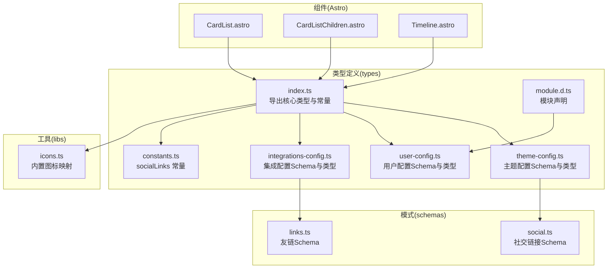
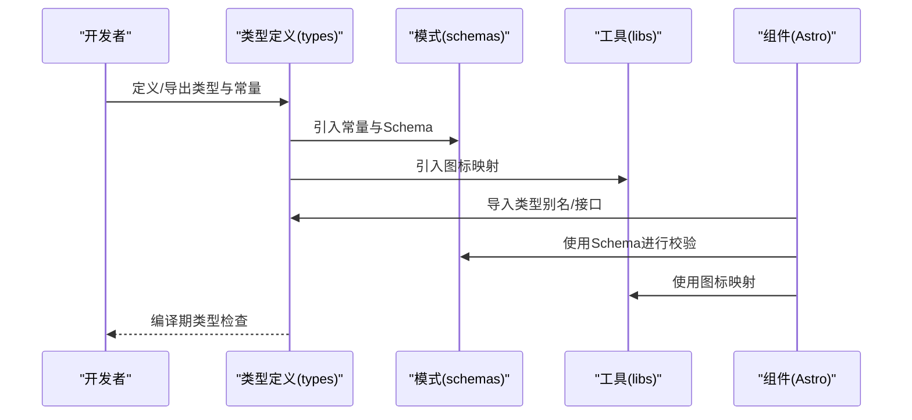
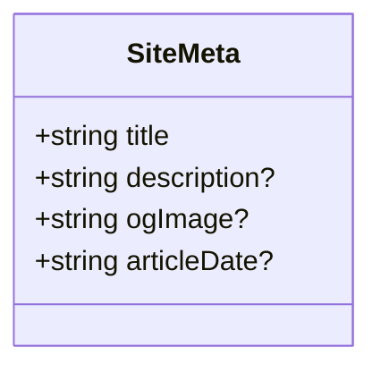
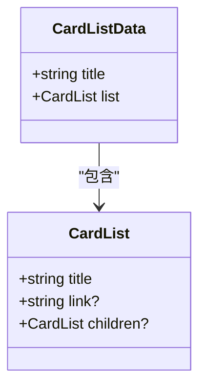
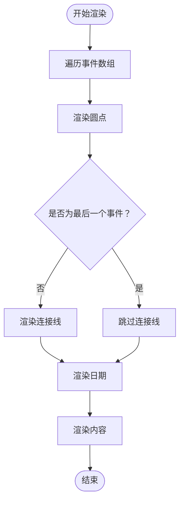
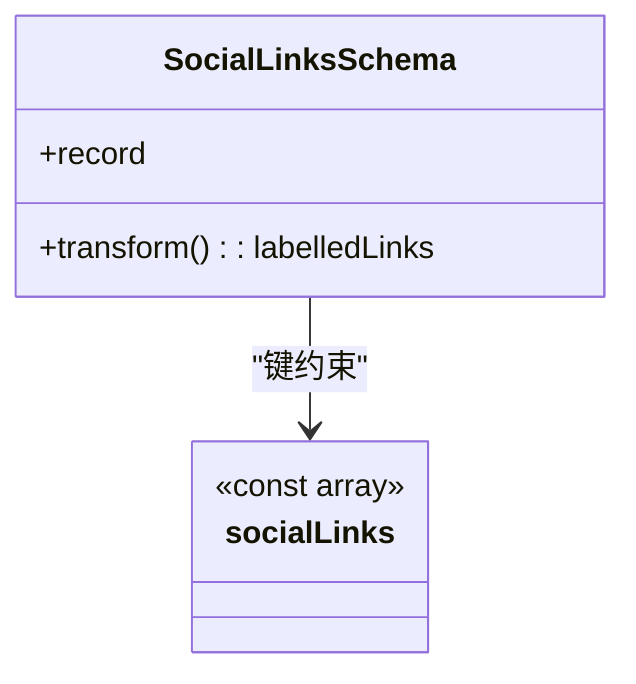
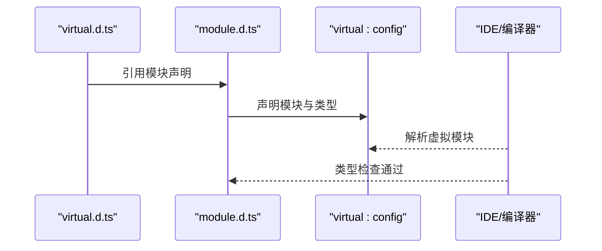
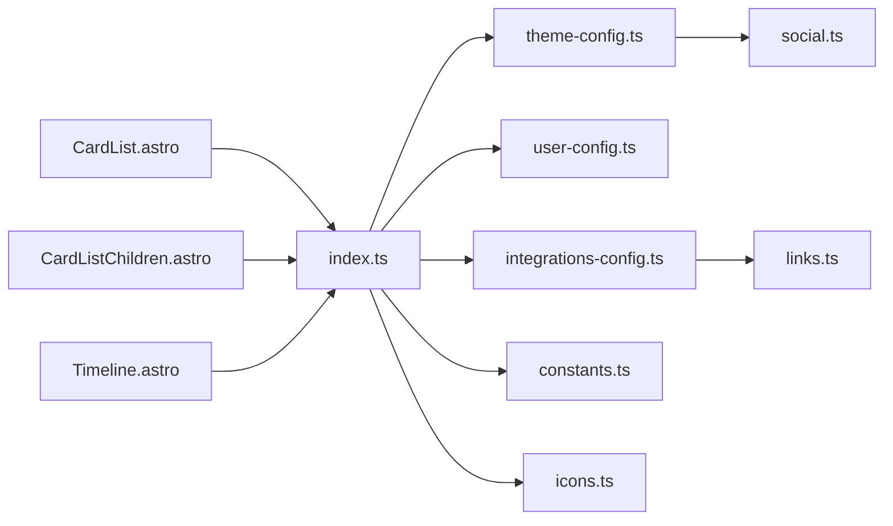

# 类型定义

<cite>
**本文引用的文件**
- [packages/pure/types/index.ts](file://packages/pure/types/index.ts)
- [packages/pure/types/constants.ts](file://packages/pure/types/constants.ts)
- [packages/pure/types/theme-config.ts](file://packages/pure/types/theme-config.ts)
- [packages/pure/types/user-config.ts](file://packages/pure/types/user-config.ts)
- [packages/pure/types/integrations-config.ts](file://packages/pure/types/integrations-config.ts)
- [packages/pure/types/module.d.ts](file://packages/pure/types/module.d.ts)
- [packages/pure/schemas/social.ts](file://packages/pure/schemas/social.ts)
- [packages/pure/schemas/links.ts](file://packages/pure/schemas/links.ts)
- [packages/pure/libs/icons.ts](file://packages/pure/libs/icons.ts)
- [packages/pure/virtual.d.ts](file://packages/pure/virtual.d.ts)
- [packages/pure/components/user/CardList.astro](file://packages/pure/components/user/CardList.astro)
- [packages/pure/components/user/CardListChildren.astro](file://packages/pure/components/user/CardListChildren.astro)
- [packages/pure/components/user/Timeline.astro](file://packages/pure/components/user/Timeline.astro)
</cite>

## 目录
1. [简介](#简介)
2. [项目结构](#项目结构)
3. [核心组件](#核心组件)
4. [架构总览](#架构总览)
5. [详细组件分析](#详细组件分析)
6. [依赖分析](#依赖分析)
7. [性能考虑](#性能考虑)
8. [故障排查指南](#故障排查指南)
9. [结论](#结论)
10. [附录](#附录)

## 简介
本文件系统性梳理并解释本仓库中 TypeScript 类型定义的设计与使用，重点覆盖以下内容：
- 导出的接口与类型别名：SiteMeta、CardListData、TimelineEvent 等
- 常量类型 socialLinks 的定义与取值范围
- 模块声明与全局类型扩展（module declaration）
- 类型安全编程最佳实践与常见错误的解决思路
- 类型推断与泛型使用示例
- 类型兼容性与版本升级时的类型变更指南

## 项目结构
类型定义主要集中在 packages/pure/types 目录，并通过模式文件（schemas）与工具库（libs）协同工作，最终在 Astro 组件中被消费。

图表来源
- [packages/pure/types/index.ts](file://packages/pure/types/index.ts#L1-L33)
- [packages/pure/types/theme-config.ts](file://packages/pure/types/theme-config.ts#L1-L193)
- [packages/pure/types/user-config.ts](file://packages/pure/types/user-config.ts#L1-L27)
- [packages/pure/types/integrations-config.ts](file://packages/pure/types/integrations-config.ts#L1-L66)
- [packages/pure/types/constants.ts](file://packages/pure/types/constants.ts#L1-L21)
- [packages/pure/types/module.d.ts](file://packages/pure/types/module.d.ts#L1-L5)
- [packages/pure/schemas/social.ts](file://packages/pure/schemas/social.ts#L1-L45)
- [packages/pure/schemas/links.ts](file://packages/pure/schemas/links.ts#L1-L31)
- [packages/pure/libs/icons.ts](file://packages/pure/libs/icons.ts#L1-L138)
- [packages/pure/components/user/CardList.astro](file://packages/pure/components/user/CardList.astro#L1-L34)
- [packages/pure/components/user/CardListChildren.astro](file://packages/pure/components/user/CardListChildren.astro#L1-L36)
- [packages/pure/components/user/Timeline.astro](file://packages/pure/components/user/Timeline.astro#L1-L39)

章节来源
- [packages/pure/types/index.ts](file://packages/pure/types/index.ts#L1-L33)
- [packages/pure/types/theme-config.ts](file://packages/pure/types/theme-config.ts#L1-L193)
- [packages/pure/types/user-config.ts](file://packages/pure/types/user-config.ts#L1-L27)
- [packages/pure/types/integrations-config.ts](file://packages/pure/types/integrations-config.ts#L1-L66)
- [packages/pure/types/constants.ts](file://packages/pure/types/constants.ts#L1-L21)
- [packages/pure/types/module.d.ts](file://packages/pure/types/module.d.ts#L1-L5)
- [packages/pure/schemas/social.ts](file://packages/pure/schemas/social.ts#L1-L45)
- [packages/pure/schemas/links.ts](file://packages/pure/schemas/links.ts#L1-L31)
- [packages/pure/libs/icons.ts](file://packages/pure/libs/icons.ts#L1-L138)
- [packages/pure/components/user/CardList.astro](file://packages/pure/components/user/CardList.astro#L1-L34)
- [packages/pure/components/user/CardListChildren.astro](file://packages/pure/components/user/CardListChildren.astro#L1-L36)
- [packages/pure/components/user/Timeline.astro](file://packages/pure/components/user/Timeline.astro#L1-L39)

## 核心组件
本节对关键类型进行逐项说明，包括用途、字段含义与典型使用场景。

- SiteMeta
  - 定义：用于描述站点元信息的接口，包含标题、描述、社交图、文章日期等可选字段。
  - 典型用途：在页面头部标签生成、Open Graph 与 Twitter 卡片渲染、文章发布时间标注等场景使用。
  - 字段说明：title（必需）、description（可选）、ogImage（可选）、articleDate（可选）。
  - 使用示例路径：[src/components/BaseHead.astro](file://src/components/BaseHead.astro#L50-L77)

- CardListData
  - 定义：卡片列表的数据载体，包含标题与子项数组。
  - 典型用途：在“关于我”、“项目列表”、“技能清单”等页面以卡片形式展示分组内容。
  - 字段说明：title（标题）、list（CardList 子项数组）。
  - 使用示例路径：[packages/pure/components/user/CardList.astro](file://packages/pure/components/user/CardList.astro#L7-L11)

- CardList
  - 定义：卡片列表的子项结构，支持递归嵌套。
  - 典型用途：构建多级导航或层级化内容展示。
  - 字段说明：title（标题）、link（可选链接）、children（可选子项）。
  - 使用示例路径：[packages/pure/components/user/CardListChildren.astro](file://packages/pure/components/user/CardListChildren.astro#L7-L10)

- TimelineEvent
  - 定义：时间线事件条目，包含日期与内容。
  - 典型用途：展示个人经历、项目里程碑、博客归档等按时间排序的内容。
  - 字段说明：date（日期字符串）、content（HTML 内容）。
  - 使用示例路径：[packages/pure/components/user/Timeline.astro](file://packages/pure/components/user/Timeline.astro#L4-L7)

- iconsType
  - 定义：基于内置图标映射的键集合生成的类型，确保图标名称的类型安全。
  - 取值来源：由内置图标映射对象的键组成。
  - 使用示例路径：[packages/pure/types/index.ts](file://packages/pure/types/index.ts#L30-L30)，[packages/pure/libs/icons.ts](file://packages/pure/libs/icons.ts#L135-L137)

- socialLinks
  - 定义：社交平台标识的字面量联合类型，使用 as const 确保最小化类型。
  - 取值范围：github、gitlab、discord、youtube、instagram、x、telegram、rss、email、reddit、bluesky、tiktok、weibo、steam、bilibili、zhihu、coolapk、netease。
  - 使用示例路径：[packages/pure/types/constants.ts](file://packages/pure/types/constants.ts#L1-L21)，[packages/pure/schemas/social.ts](file://packages/pure/schemas/social.ts#L8-L8)

章节来源
- [packages/pure/types/index.ts](file://packages/pure/types/index.ts#L7-L32)
- [packages/pure/components/user/CardList.astro](file://packages/pure/components/user/CardList.astro#L7-L11)
- [packages/pure/components/user/CardListChildren.astro](file://packages/pure/components/user/CardListChildren.astro#L7-L10)
- [packages/pure/components/user/Timeline.astro](file://packages/pure/components/user/Timeline.astro#L4-L7)
- [packages/pure/types/constants.ts](file://packages/pure/types/constants.ts#L1-L21)
- [packages/pure/schemas/social.ts](file://packages/pure/schemas/social.ts#L8-L8)
- [packages/pure/libs/icons.ts](file://packages/pure/libs/icons.ts#L135-L137)

## 架构总览
类型系统围绕“配置 Schema + 运行时类型 + 组件消费”的闭环设计：
- 配置层：ThemeConfigSchema、UserConfigSchema、IntegrationConfigSchema 提供严格的输入/输出类型约束。
- 常量层：socialLinks 与内置图标映射确保枚举与图标名称的类型安全。
- 消费层：Astro 组件通过导入类型别名与接口，实现编译期校验与运行时行为一致。

图表来源
- [packages/pure/types/theme-config.ts](file://packages/pure/types/theme-config.ts#L1-L193)
- [packages/pure/types/user-config.ts](file://packages/pure/types/user-config.ts#L1-L27)
- [packages/pure/types/integrations-config.ts](file://packages/pure/types/integrations-config.ts#L1-L66)
- [packages/pure/schemas/social.ts](file://packages/pure/schemas/social.ts#L1-L45)
- [packages/pure/schemas/links.ts](file://packages/pure/schemas/links.ts#L1-L31)
- [packages/pure/libs/icons.ts](file://packages/pure/libs/icons.ts#L1-L138)
- [packages/pure/components/user/CardList.astro](file://packages/pure/components/user/CardList.astro#L1-L34)
- [packages/pure/components/user/CardListChildren.astro](file://packages/pure/components/user/CardListChildren.astro#L1-L36)
- [packages/pure/components/user/Timeline.astro](file://packages/pure/components/user/Timeline.astro#L1-L39)

## 详细组件分析

### SiteMeta 类型分析
- 设计要点
  - 使用可选字段表达“非强制”，便于在不同页面灵活填充。
  - 与 Open Graph/Twitter 卡片属性一一对应，提升 SEO 与分享体验。
- 典型使用流程
  - 页面渲染前构造 SiteMeta 对象，传入头部组件进行标签注入。
  - 文章页额外设置 articleDate 以启用文章发布时间元信息。

图表来源
- [packages/pure/types/index.ts](file://packages/pure/types/index.ts#L7-L12)

章节来源
- [packages/pure/types/index.ts](file://packages/pure/types/index.ts#L7-L12)
- [src/components/BaseHead.astro](file://src/components/BaseHead.astro#L50-L77)

### CardListData 与 CardList 结构分析
- 设计要点
  - CardListData 作为容器，CardList 为递归结构，支持无限层级。
  - 在组件中通过条件渲染决定是否包裹折叠容器，增强交互体验。
- 数据流
  - 组件接收 CardListData，根据 collapse 参数选择渲染模式。
  - 子组件 CardListChildren 递归渲染 children，支持链接与纯文本两种标签。

图表来源
- [packages/pure/types/index.ts](file://packages/pure/types/index.ts#L14-L28)
- [packages/pure/components/user/CardList.astro](file://packages/pure/components/user/CardList.astro#L7-L11)
- [packages/pure/components/user/CardListChildren.astro](file://packages/pure/components/user/CardListChildren.astro#L7-L10)

章节来源
- [packages/pure/types/index.ts](file://packages/pure/types/index.ts#L14-L28)
- [packages/pure/components/user/CardList.astro](file://packages/pure/components/user/CardList.astro#L7-L11)
- [packages/pure/components/user/CardListChildren.astro](file://packages/pure/components/user/CardListChildren.astro#L7-L10)

### TimelineEvent 时间线分析
- 设计要点
  - 事件数组按顺序渲染，支持在最后一个元素后隐藏连接线。
  - 日期与内容分离，便于样式定制与国际化处理。
- 渲染流程
  - 组件遍历事件数组，为每个事件渲染圆点、连接线与内容区块。

图表来源
- [packages/pure/components/user/Timeline.astro](file://packages/pure/components/user/Timeline.astro#L14-L36)

章节来源
- [packages/pure/components/user/Timeline.astro](file://packages/pure/components/user/Timeline.astro#L1-L39)

### 社交链接常量与 Schema 分析
- socialLinks 常量
  - 使用 as const 将数组转为字面量元组，避免宽类型污染。
  - 作为枚举类型用于社交链接 Schema 的键约束。
- SocialLinksSchema
  - 基于 socialLinks 构建 record 类型，键为社交平台标识，值为 URL。
  - 通过 transform 将原始链接映射为带标签的对象，便于 UI 展示。

图表来源
- [packages/pure/schemas/social.ts](file://packages/pure/schemas/social.ts#L5-L44)
- [packages/pure/types/constants.ts](file://packages/pure/types/constants.ts#L1-L21)

章节来源
- [packages/pure/schemas/social.ts](file://packages/pure/schemas/social.ts#L1-L45)
- [packages/pure/types/constants.ts](file://packages/pure/types/constants.ts#L1-L21)

### 模块声明与全局类型扩展
- 虚拟模块声明
  - 通过 module 'virtual:config' 声明虚拟模块，导出类型为 UserConfig。
  - 在虚拟入口文件中引用模块声明，使 IDE 与编译器识别该模块。
- 使用场景
  - 在运行时通过虚拟模块读取配置，类型自动推断为 UserConfig。

图表来源
- [packages/pure/virtual.d.ts](file://packages/pure/virtual.d.ts#L1-L2)
- [packages/pure/types/module.d.ts](file://packages/pure/types/module.d.ts#L1-L5)

章节来源
- [packages/pure/virtual.d.ts](file://packages/pure/virtual.d.ts#L1-L2)
- [packages/pure/types/module.d.ts](file://packages/pure/types/module.d.ts#L1-L5)

## 依赖分析
类型之间的耦合关系如下：

图表来源
- [packages/pure/types/index.ts](file://packages/pure/types/index.ts#L1-L33)
- [packages/pure/types/theme-config.ts](file://packages/pure/types/theme-config.ts#L1-L193)
- [packages/pure/types/user-config.ts](file://packages/pure/types/user-config.ts#L1-L27)
- [packages/pure/types/integrations-config.ts](file://packages/pure/types/integrations-config.ts#L1-L66)
- [packages/pure/types/constants.ts](file://packages/pure/types/constants.ts#L1-L21)
- [packages/pure/schemas/social.ts](file://packages/pure/schemas/social.ts#L1-L45)
- [packages/pure/schemas/links.ts](file://packages/pure/schemas/links.ts#L1-L31)
- [packages/pure/libs/icons.ts](file://packages/pure/libs/icons.ts#L1-L138)
- [packages/pure/components/user/CardList.astro](file://packages/pure/components/user/CardList.astro#L1-L34)
- [packages/pure/components/user/CardListChildren.astro](file://packages/pure/components/user/CardListChildren.astro#L1-L36)
- [packages/pure/components/user/Timeline.astro](file://packages/pure/components/user/Timeline.astro#L1-L39)

章节来源
- [packages/pure/types/index.ts](file://packages/pure/types/index.ts#L1-L33)
- [packages/pure/types/theme-config.ts](file://packages/pure/types/theme-config.ts#L1-L193)
- [packages/pure/types/user-config.ts](file://packages/pure/types/user-config.ts#L1-L27)
- [packages/pure/types/integrations-config.ts](file://packages/pure/types/integrations-config.ts#L1-L66)
- [packages/pure/types/constants.ts](file://packages/pure/types/constants.ts#L1-L21)
- [packages/pure/schemas/social.ts](file://packages/pure/schemas/social.ts#L1-L45)
- [packages/pure/schemas/links.ts](file://packages/pure/schemas/links.ts#L1-L31)
- [packages/pure/libs/icons.ts](file://packages/pure/libs/icons.ts#L1-L138)
- [packages/pure/components/user/CardList.astro](file://packages/pure/components/user/CardList.astro#L1-L34)
- [packages/pure/components/user/CardListChildren.astro](file://packages/pure/components/user/CardListChildren.astro#L1-L36)
- [packages/pure/components/user/Timeline.astro](file://packages/pure/components/user/Timeline.astro#L1-L39)

## 性能考虑
- 使用 as const 与字面量元组
  - 减少类型推断宽度，降低编译时开销，同时提升类型精确度。
- Schema 的 transform 与 refine
  - 在编译期完成结构化校验，减少运行时分支判断与异常处理成本。
- 图标与社交链接的键约束
  - 通过索引类型与枚举约束，避免运行时拼写错误导致的渲染失败。

## 故障排查指南
- 常见类型错误
  - 键名不匹配：当使用 iconsType 时，若键不在内置图标映射中，将触发类型错误。
  - 社交链接类型不符：SocialLinksSchema 要求值为 URL，若传入非 URL 将在编译期报错。
  - 配置项缺失：UserConfigSchema 严格模式下缺少必要字段会报错，需补齐默认值或显式赋值。
- 排查步骤
  - 检查类型导出与导入路径是否正确。
  - 核对常量与 Schema 的键集合是否一致。
  - 使用 IDE 的类型提示定位具体字段与位置。

章节来源
- [packages/pure/types/index.ts](file://packages/pure/types/index.ts#L30-L30)
- [packages/pure/schemas/social.ts](file://packages/pure/schemas/social.ts#L14-L43)
- [packages/pure/types/user-config.ts](file://packages/pure/types/user-config.ts#L6-L23)

## 结论
本类型体系通过严格的 Schema、常量与模块声明，实现了从配置到组件的端到端类型安全。借助 as const、字面量元组与 zod Schema 的 transform/refine，既保证了开发体验，又提升了运行时可靠性。建议在新增字段或调整结构时，优先更新 Schema 与类型定义，确保向后兼容与类型一致性。

## 附录
- 类型安全编程最佳实践
  - 优先使用 as const 固化常量类型。
  - 利用 zod Schema 的 transform/refine 实现复杂校验与默认值注入。
  - 在组件中明确 Props 类型，避免 any 或未约束的 props。
- 泛型与类型推断示例
  - Polymorphic 与 HTMLTag 的结合可用于构建可变标签的组件。
  - keyof typeof Icons 用于从对象映射中提取键集合，确保图标名称的类型安全。
- 版本升级指南
  - 新增字段时，先在 Schema 中添加并提供默认值，再在类型别名中同步。
  - 修改现有字段时，保持向后兼容，必要时引入兼容层或迁移脚本。
  - 对外暴露的类型尽量稳定，内部实现细节通过私有类型封装。