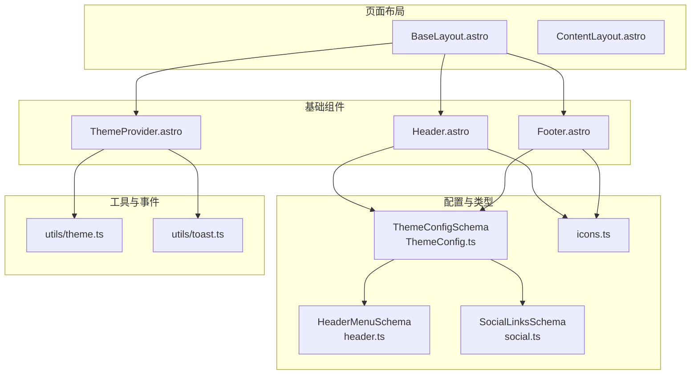
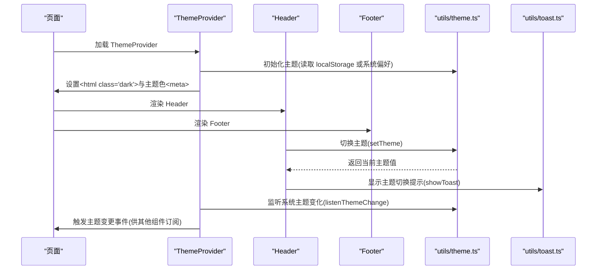
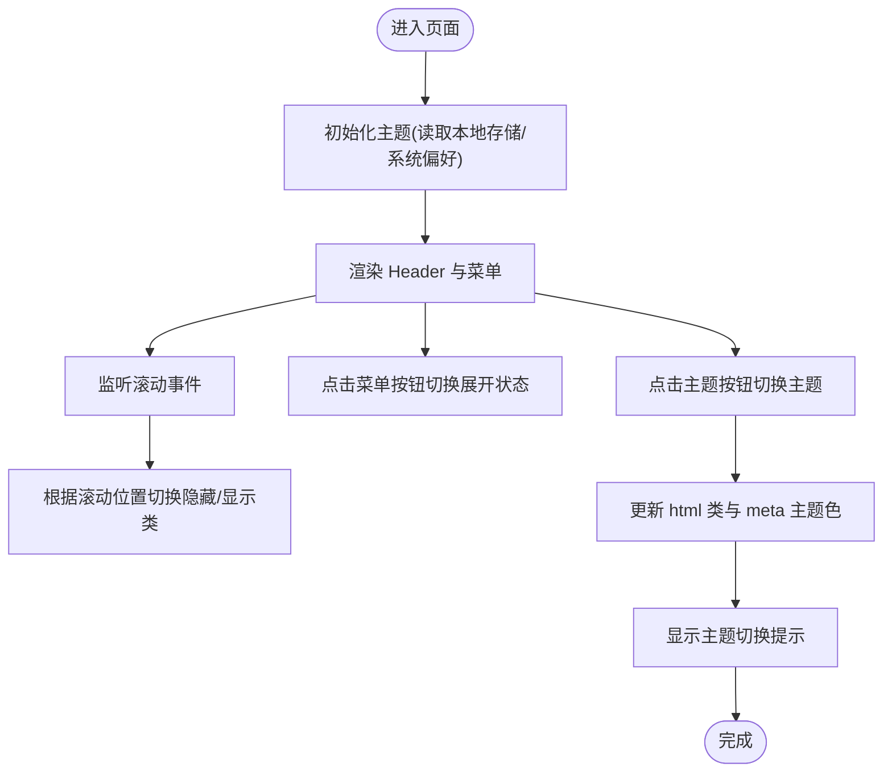
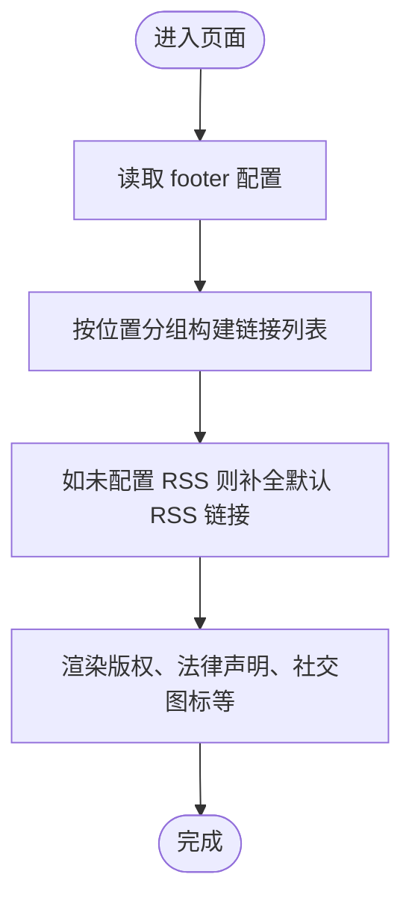
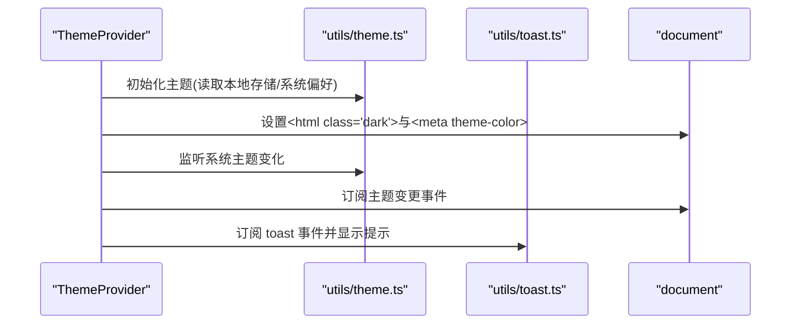
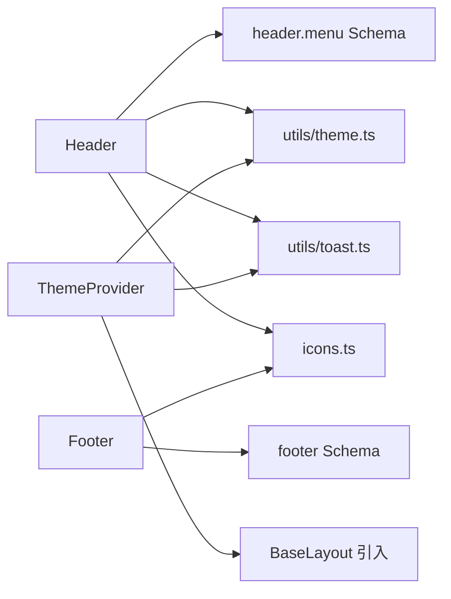

# 基础组件API

<cite>
**本文引用的文件**
- [packages/pure/components/basic/Header.astro](file://packages/pure/components/basic/Header.astro)
- [packages/pure/components/basic/Footer.astro](file://packages/pure/components/basic/Footer.astro)
- [packages/pure/components/basic/ThemeProvider.astro](file://packages/pure/components/basic/ThemeProvider.astro)
- [packages/pure/schemas/header.ts](file://packages/pure/schemas/header.ts)
- [packages/pure/schemas/social.ts](file://packages/pure/schemas/social.ts)
- [packages/pure/types/theme-config.ts](file://packages/pure/types/theme-config.ts)
- [packages/pure/utils/theme.ts](file://packages/pure/utils/theme.ts)
- [packages/pure/utils/toast.ts](file://packages/pure/utils/toast.ts)
- [packages/pure/libs/icons.ts](file://packages/pure/libs/icons.ts)
- [src/layouts/BaseLayout.astro](file://src/layouts/BaseLayout.astro)
- [src/layouts/ContentLayout.astro](file://src/layouts/ContentLayout.astro)
</cite>

## 目录
1. [简介](#简介)
2. [项目结构](#项目结构)
3. [核心组件](#核心组件)
4. [架构总览](#架构总览)
5. [组件详细分析](#组件详细分析)
6. [依赖关系分析](#依赖关系分析)
7. [性能考虑](#性能考虑)
8. [故障排查指南](#故障排查指南)
9. [结论](#结论)
10. [附录](#附录)

## 简介
本文件系统化梳理并规范“基础组件API”，覆盖 Header、Footer、ThemeProvider 三大核心组件的完整接口定义（Props/事件/插槽）、行为特性、配置来源与最佳实践。文档同时给出响应式行为、无障碍访问支持与性能优化建议，帮助开发者在不同页面布局中正确集成与扩展。

## 项目结构
基础组件位于 pure 包的 basic 目录，配合主题配置与工具函数共同工作；在页面布局中通过 BaseLayout 统一挂载。

图表来源
- [packages/pure/components/basic/Header.astro](file://packages/pure/components/basic/Header.astro#L1-L209)
- [packages/pure/components/basic/Footer.astro](file://packages/pure/components/basic/Footer.astro#L1-L91)
- [packages/pure/components/basic/ThemeProvider.astro](file://packages/pure/components/basic/ThemeProvider.astro#L1-L41)
- [packages/pure/types/theme-config.ts](file://packages/pure/types/theme-config.ts#L1-L193)
- [packages/pure/schemas/header.ts](file://packages/pure/schemas/header.ts#L1-L18)
- [packages/pure/schemas/social.ts](file://packages/pure/schemas/social.ts#L1-L45)
- [packages/pure/utils/theme.ts](file://packages/pure/utils/theme.ts#L1-L41)
- [packages/pure/utils/toast.ts](file://packages/pure/utils/toast.ts#L1-L4)
- [packages/pure/libs/icons.ts](file://packages/pure/libs/icons.ts#L1-L138)
- [src/layouts/BaseLayout.astro](file://src/layouts/BaseLayout.astro#L1-L92)

章节来源
- [src/layouts/BaseLayout.astro](file://src/layouts/BaseLayout.astro#L1-L92)

## 核心组件
- Header：站点头部导航与主题切换入口，支持滚动隐藏、移动端菜单展开、深色模式切换。
- Footer：站点页脚，支持版权信息、法律声明、社交链接展示与 RSS 自动补全。
- ThemeProvider：主题初始化与监听，负责深色/浅色/系统主题切换、主题变更提示气泡。

章节来源
- [packages/pure/components/basic/Header.astro](file://packages/pure/components/basic/Header.astro#L1-L209)
- [packages/pure/components/basic/Footer.astro](file://packages/pure/components/basic/Footer.astro#L1-L91)
- [packages/pure/components/basic/ThemeProvider.astro](file://packages/pure/components/basic/ThemeProvider.astro#L1-L41)

## 架构总览
组件间协作流程：页面加载时 ThemeProvider 先行设置初始主题，随后 Header 与 Footer 读取配置渲染内容；Header 触发主题切换后通过全局事件通知 ThemeProvider 更新状态与 UI。

图表来源
- [packages/pure/components/basic/ThemeProvider.astro](file://packages/pure/components/basic/ThemeProvider.astro#L1-L41)
- [packages/pure/utils/theme.ts](file://packages/pure/utils/theme.ts#L1-L41)
- [packages/pure/utils/toast.ts](file://packages/pure/utils/toast.ts#L1-L4)
- [packages/pure/components/basic/Header.astro](file://packages/pure/components/basic/Header.astro#L74-L108)

## 组件详细分析

### Header 组件 API 规范
- 无 Props 输入：组件通过虚拟配置读取标题与菜单项，不接收外部传参。
- 事件与交互
  - 滚动隐藏：根据滚动位置动态添加/移除类名，实现头部上移隐藏效果。
  - 菜单开关：移动端点击菜单按钮切换展开状态。
  - 主题切换：点击深色模式按钮触发主题切换，并显示提示气泡。
- 插槽
  - 无具名/命名插槽；内部通过配置驱动菜单项渲染。
- 配置来源
  - 来自虚拟配置对象 config，其中 header.menu 决定菜单项列表。
  - 菜单项结构由 Schema 校验，包含 title 与 link 字段。
- 可访问性
  - 关键元素具备 aria-label 提升读屏可用性。
  - 使用 sr-only 隐藏仅图标语义的文本，避免重复朗读。
- 响应式行为
  - 移动端折叠菜单，展开时通过网格动画展示菜单项。
  - 头部在滚动时自动隐藏，恢复滚动方向或接近顶部时重新出现。
- 性能与优化
  - 使用 is:inline 预加载主题切换图标，减少首屏闪烁。
  - 通过 dataset 传递主题状态，避免不必要的重排。
  - 事件绑定在组件连接阶段完成，避免重复绑定。

图表来源
- [packages/pure/components/basic/Header.astro](file://packages/pure/components/basic/Header.astro#L67-L108)
- [packages/pure/utils/theme.ts](file://packages/pure/utils/theme.ts#L12-L40)
- [packages/pure/utils/toast.ts](file://packages/pure/utils/toast.ts#L1-L4)

章节来源
- [packages/pure/components/basic/Header.astro](file://packages/pure/components/basic/Header.astro#L1-L209)
- [packages/pure/schemas/header.ts](file://packages/pure/schemas/header.ts#L1-L18)
- [packages/pure/types/theme-config.ts](file://packages/pure/types/theme-config.ts#L116-L126)

### Footer 组件 API 规范
- 无 Props 输入：组件通过虚拟配置读取页脚内容，不接收外部传参。
- 事件与交互
  - 无交互事件；仅静态展示。
- 插槽
  - 无具名/命名插槽。
- 配置来源
  - 来自虚拟配置对象 config.footer，包含 year、links、credits、social 等字段。
  - links 支持按 pos 分组显示（位置1与位置2），style 可自定义链接样式。
  - social 支持多种平台，若未配置 RSS 将自动补全默认 RSS 链接。
- 可访问性
  - 社交链接提供 aria-label，提升读屏可用性。
- 响应式行为
  - 在小屏设备上采用垂直堆叠布局，大屏设备横向排列。
- 性能与优化
  - 通过条件渲染减少不必要节点生成。
  - 社交图标来自内置图标库，按需渲染。

图表来源
- [packages/pure/components/basic/Footer.astro](file://packages/pure/components/basic/Footer.astro#L1-L91)
- [packages/pure/schemas/social.ts](file://packages/pure/schemas/social.ts#L1-L45)
- [packages/pure/libs/icons.ts](file://packages/pure/libs/icons.ts#L1-L138)

章节来源
- [packages/pure/components/basic/Footer.astro](file://packages/pure/components/basic/Footer.astro#L1-L91)
- [packages/pure/types/theme-config.ts](file://packages/pure/types/theme-config.ts#L128-L170)

### ThemeProvider 组件 API 规范
- 无 Props 输入：组件通过虚拟配置读取主题相关设置，不接收外部传参。
- 事件与交互
  - 监听主题变更事件：通过全局事件订阅主题切换。
  - 显示提示气泡：订阅 toast 事件并在页面底部弹出提示。
- 插槽
  - 无具名/命名插槽。
- 配置来源
  - 通过 is:inline 脚本在页面加载前快速设置主题，避免白/黑屏闪现。
  - 监听系统主题变化，确保系统偏好切换时同步更新。
- 可访问性
  - 通过 meta[name="theme-color"] 同步主题色，改善感知一致性。
- 响应式行为
  - 首屏即根据系统偏好设置主题，后续通过用户操作或系统变化动态调整。
- 性能与优化
  - is:inline 预执行初始化逻辑，降低关键路径耗时。
  - 事件监听集中处理，避免重复注册。

图表来源
- [packages/pure/components/basic/ThemeProvider.astro](file://packages/pure/components/basic/ThemeProvider.astro#L1-L41)
- [packages/pure/utils/theme.ts](file://packages/pure/utils/theme.ts#L5-L10)
- [packages/pure/utils/toast.ts](file://packages/pure/utils/toast.ts#L1-L4)

章节来源
- [packages/pure/components/basic/ThemeProvider.astro](file://packages/pure/components/basic/ThemeProvider.astro#L1-L41)
- [packages/pure/utils/theme.ts](file://packages/pure/utils/theme.ts#L1-L41)

## 依赖关系分析
- Header 依赖
  - 配置：ThemeConfigSchema.header.menu
  - 工具：utils/theme.ts（主题切换）、utils/toast.ts（提示）
  - 图标：icons.ts（菜单、搜索、主题切换图标）
- Footer 依赖
  - 配置：ThemeConfigSchema.footer（year、links、credits、social）
  - 工具：icons.ts（社交图标）
- ThemeProvider 依赖
  - 工具：utils/theme.ts（主题初始化与监听）、utils/toast.ts（提示）
  - 页面：BaseLayout 引入以确保全局生效

图表来源
- [packages/pure/components/basic/Header.astro](file://packages/pure/components/basic/Header.astro#L1-L209)
- [packages/pure/components/basic/Footer.astro](file://packages/pure/components/basic/Footer.astro#L1-L91)
- [packages/pure/components/basic/ThemeProvider.astro](file://packages/pure/components/basic/ThemeProvider.astro#L1-L41)
- [packages/pure/schemas/header.ts](file://packages/pure/schemas/header.ts#L1-L18)
- [packages/pure/schemas/social.ts](file://packages/pure/schemas/social.ts#L1-L45)
- [packages/pure/utils/theme.ts](file://packages/pure/utils/theme.ts#L1-L41)
- [packages/pure/utils/toast.ts](file://packages/pure/utils/toast.ts#L1-L4)
- [packages/pure/libs/icons.ts](file://packages/pure/libs/icons.ts#L1-L138)
- [src/layouts/BaseLayout.astro](file://src/layouts/BaseLayout.astro#L1-L92)

章节来源
- [packages/pure/types/theme-config.ts](file://packages/pure/types/theme-config.ts#L116-L170)

## 性能考虑
- 首屏主题设置
  - 使用 is:inline 预执行主题初始化，避免页面闪烁。
- 事件与监听
  - 主题监听仅在必要时注册，避免重复监听导致的内存泄漏。
- DOM 操作
  - 通过类名切换与 dataset 传递状态，减少复杂计算与重绘。
- 图标与资源
  - 内置图标库按需渲染，避免额外请求。
- 响应式与动画
  - 使用 CSS 过渡与媒体查询，减少 JavaScript 干预。

## 故障排查指南
- 主题未生效
  - 检查是否在 BaseLayout 中引入 ThemeProvider。
  - 确认浏览器未禁用 localStorage，或手动清除无效缓存。
- 深色模式切换无效
  - 确认 Header 的主题切换按钮事件已绑定。
  - 检查 utils/theme.ts 是否被正确导入与调用。
- 提示气泡不显示
  - 确认 utils/toast.ts 的事件监听是否在 ThemeProvider 中注册。
  - 检查页面是否正确引入 ThemeProvider。
- 菜单无法展开
  - 检查移动端按钮的点击事件是否绑定成功。
  - 确认 CSS 动画与类名切换逻辑正常。
- 社交链接缺失
  - 若未配置 RSS，Footer 会自动补全；检查 footer 配置是否遗漏。
  - 确认 social 平台名称是否在支持列表中。

章节来源
- [packages/pure/components/basic/ThemeProvider.astro](file://packages/pure/components/basic/ThemeProvider.astro#L1-L41)
- [packages/pure/components/basic/Header.astro](file://packages/pure/components/basic/Header.astro#L74-L108)
- [packages/pure/components/basic/Footer.astro](file://packages/pure/components/basic/Footer.astro#L1-L91)
- [packages/pure/utils/theme.ts](file://packages/pure/utils/theme.ts#L1-L41)
- [packages/pure/utils/toast.ts](file://packages/pure/utils/toast.ts#L1-L4)

## 结论
Header、Footer、ThemeProvider 三者形成完整的站点头部与主题体系：Header 负责导航与主题入口，Footer 展示版权与社交信息，ThemeProvider 负责主题初始化与全局监听。通过严格的配置 Schema 与工具函数封装，组件具备良好的可维护性与可扩展性。建议在实际项目中遵循本文档的 API 规范与最佳实践，确保一致的用户体验与性能表现。

## 附录
- 配置项参考
  - header.menu：数组，包含 title 与 link 字段。
  - footer.year：字符串，用于版权年份展示。
  - footer.links：数组，支持 pos 分组与 style 自定义。
  - footer.credits：布尔，控制是否显示主题版权信息。
  - footer.social：记录型对象，平台到链接的映射。
- 使用示例
  - 在 BaseLayout 中引入 ThemeProvider、Header、Footer 即可生效。
  - 在页面布局中通过 ContentLayout 扩展侧边栏与内容区域。

章节来源
- [packages/pure/types/theme-config.ts](file://packages/pure/types/theme-config.ts#L116-L170)
- [src/layouts/BaseLayout.astro](file://src/layouts/BaseLayout.astro#L1-L92)
- [src/layouts/ContentLayout.astro](file://src/layouts/ContentLayout.astro#L1-L156)