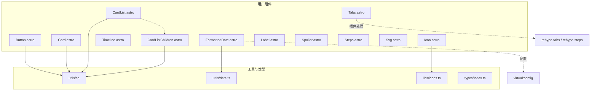
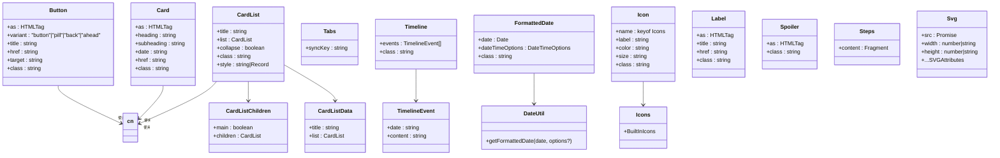
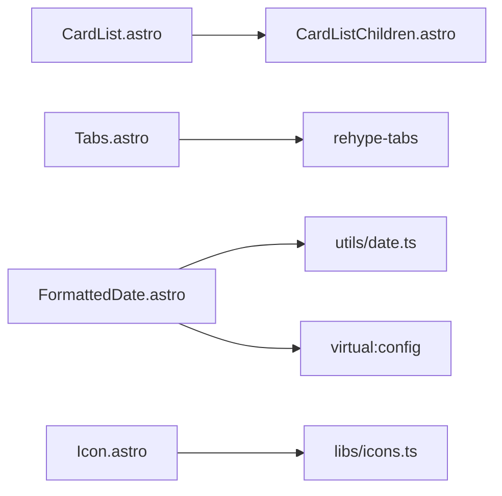

# 用户组件API

<cite>
**本文引用的文件**
- [packages/pure/components/user/Button.astro](file://packages/pure/components/user/Button.astro)
- [packages/pure/components/user/Card.astro](file://packages/pure/components/user/Card.astro)
- [packages/pure/components/user/CardList.astro](file://packages/pure/components/user/CardList.astro)
- [packages/pure/components/user/CardListChildren.astro](file://packages/pure/components/user/CardListChildren.astro)
- [packages/pure/components/user/Tabs.astro](file://packages/pure/components/user/Tabs.astro)
- [packages/pure/components/user/Timeline.astro](file://packages/pure/components/user/Timeline.astro)
- [packages/pure/components/user/FormattedDate.astro](file://packages/pure/components/user/FormattedDate.astro)
- [packages/pure/components/user/Icon.astro](file://packages/pure/components/user/Icon.astro)
- [packages/pure/components/user/Label.astro](file://packages/pure/components/user/Label.astro)
- [packages/pure/components/user/Spoiler.astro](file://packages/pure/components/user/Spoiler.astro)
- [packages/pure/components/user/Steps.astro](file://packages/pure/components/user/Steps.astro)
- [packages/pure/components/user/Svg.astro](file://packages/pure/components/user/Svg.astro)
- [packages/pure/libs/icons.ts](file://packages/pure/libs/icons.ts)
- [packages/pure/utils/date.ts](file://packages/pure/utils/date.ts)
- [packages/pure/types/index.ts](file://packages/pure/types/index.ts)
</cite>

## 目录
1. [简介](#简介)
2. [项目结构](#项目结构)
3. [核心组件](#核心组件)
4. [架构总览](#架构总览)
5. [详细组件分析](#详细组件分析)
6. [依赖关系分析](#依赖关系分析)
7. [性能考量](#性能考量)
8. [故障排查指南](#故障排查指南)
9. [结论](#结论)
10. [附录](#附录)

## 简介
本文件为“用户组件API”的综合技术文档，覆盖以下组件的接口定义、行为规范与使用建议：Button、Card、CardList、Tabs、Timeline、FormattedDate、Icon、Label、Spoiler、Steps、Svg。文档面向开发者与内容作者，提供参数说明、样式与交互要点、可访问性与性能建议，并通过图示帮助理解组件间的关系与数据流。

## 项目结构
用户组件集中于 packages/pure/components/user 目录，配套工具与类型位于 utils、libs、types 相关模块。组件多采用 Astro 组件（.astro）形式，结合 cn 工具类进行类名合并，部分组件通过插件或工具函数扩展能力（如 Tabs 使用 rehype 插件处理步骤与标签面板、FormattedDate 使用日期格式化工具）。

图表来源
- [packages/pure/components/user/Button.astro](file://packages/pure/components/user/Button.astro#L1-L91)
- [packages/pure/components/user/Card.astro](file://packages/pure/components/user/Card.astro#L1-L33)
- [packages/pure/components/user/CardList.astro](file://packages/pure/components/user/CardList.astro#L1-L34)
- [packages/pure/components/user/CardListChildren.astro](file://packages/pure/components/user/CardListChildren.astro#L1-L36)
- [packages/pure/components/user/Tabs.astro](file://packages/pure/components/user/Tabs.astro#L1-L270)
- [packages/pure/components/user/Timeline.astro](file://packages/pure/components/user/Timeline.astro#L1-L39)
- [packages/pure/components/user/FormattedDate.astro](file://packages/pure/components/user/FormattedDate.astro#L1-L22)
- [packages/pure/components/user/Icon.astro](file://packages/pure/components/user/Icon.astro#L1-L35)
- [packages/pure/components/user/Label.astro](file://packages/pure/components/user/Label.astro#L1-L26)
- [packages/pure/components/user/Spoiler.astro](file://packages/pure/components/user/Spoiler.astro#L1-L28)
- [packages/pure/components/user/Steps.astro](file://packages/pure/components/user/Steps.astro#L1-L85)
- [packages/pure/components/user/Svg.astro](file://packages/pure/components/user/Svg.astro#L1-L42)
- [packages/pure/utils/date.ts](file://packages/pure/utils/date.ts#L1-L18)
- [packages/pure/libs/icons.ts](file://packages/pure/libs/icons.ts#L1-L138)
- [packages/pure/types/index.ts](file://packages/pure/types/index.ts#L1-L33)

章节来源
- [packages/pure/components/user](file://packages/pure/components/user/index.ts#L1-L200)

## 核心组件
- Button：多态按钮/链接组件，支持多种样式变体与前/后置图标，具备悬停过渡与无障碍属性。
- Card：卡片容器，支持标题、副标题、日期与可选链接，具备悬停阴影与过渡。
- CardList：列表容器，支持折叠与非折叠两种渲染模式，内部递归渲染子项。
- Tabs：标签页组件，基于自定义元素与 localStorage 同步选中状态，支持键盘导航与无障碍。
- Timeline：时间线组件，逐条渲染事件，支持悬停放大与连接线样式。
- FormattedDate：日期展示组件，基于虚拟配置与本地化选项进行格式化输出。
- Icon：图标组件，从内置图标库选择图标，支持颜色与尺寸变量。
- Label：标签容器，支持前置图标与可选链接，具备悬停透明度过渡。
- Spoiler：遮罩文本组件，悬停时显性显示，否则以背景色遮盖。
- Steps：步骤列表组件，通过插件生成带编号与竖线的步骤序列。
- Svg：SVG 渲染组件，支持属性覆盖与错误校验，避免不合法属性传入。

章节来源
- [packages/pure/components/user/Button.astro](file://packages/pure/components/user/Button.astro#L1-L91)
- [packages/pure/components/user/Card.astro](file://packages/pure/components/user/Card.astro#L1-L33)
- [packages/pure/components/user/CardList.astro](file://packages/pure/components/user/CardList.astro#L1-L34)
- [packages/pure/components/user/Tabs.astro](file://packages/pure/components/user/Tabs.astro#L1-L270)
- [packages/pure/components/user/Timeline.astro](file://packages/pure/components/user/Timeline.astro#L1-L39)
- [packages/pure/components/user/FormattedDate.astro](file://packages/pure/components/user/FormattedDate.astro#L1-L22)
- [packages/pure/components/user/Icon.astro](file://packages/pure/components/user/Icon.astro#L1-L35)
- [packages/pure/components/user/Label.astro](file://packages/pure/components/user/Label.astro#L1-L26)
- [packages/pure/components/user/Spoiler.astro](file://packages/pure/components/user/Spoiler.astro#L1-L28)
- [packages/pure/components/user/Steps.astro](file://packages/pure/components/user/Steps.astro#L1-L85)
- [packages/pure/components/user/Svg.astro](file://packages/pure/components/user/Svg.astro#L1-L42)

## 架构总览
下图展示了用户组件与工具/类型之间的关系，以及关键数据结构与外部依赖：

图表来源
- [packages/pure/components/user/Button.astro](file://packages/pure/components/user/Button.astro#L6-L27)
- [packages/pure/components/user/Card.astro](file://packages/pure/components/user/Card.astro#L6-L21)
- [packages/pure/components/user/CardList.astro](file://packages/pure/components/user/CardList.astro#L7-L11)
- [packages/pure/components/user/CardListChildren.astro](file://packages/pure/components/user/CardListChildren.astro#L7-L11)
- [packages/pure/components/user/Tabs.astro](file://packages/pure/components/user/Tabs.astro#L5-L11)
- [packages/pure/components/user/Timeline.astro](file://packages/pure/components/user/Timeline.astro#L4-L7)
- [packages/pure/components/user/FormattedDate.astro](file://packages/pure/components/user/FormattedDate.astro#L6-L10)
- [packages/pure/components/user/Icon.astro](file://packages/pure/components/user/Icon.astro#L4-L10)
- [packages/pure/components/user/Label.astro](file://packages/pure/components/user/Label.astro#L6-L11)
- [packages/pure/components/user/Spoiler.astro](file://packages/pure/components/user/Spoiler.astro#L6-L8)
- [packages/pure/components/user/Steps.astro](file://packages/pure/components/user/Steps.astro#L5-L6)
- [packages/pure/components/user/Svg.astro](file://packages/pure/components/user/Svg.astro#L6-L9)
- [packages/pure/libs/icons.ts](file://packages/pure/libs/icons.ts#L135-L137)
- [packages/pure/types/index.ts](file://packages/pure/types/index.ts#L14-L28)
- [packages/pure/utils/date.ts](file://packages/pure/utils/date.ts#L5-L17)

## 详细组件分析

### Button 组件
- 功能概述
  - 支持多态渲染（默认 a 标签），可作为按钮或链接使用。
  - 变体：button（默认）、pill（圆角）、back（左侧带箭头图标）、ahead（右侧带箭头图标）。
  - 前/后置插槽用于插入图标或内容；当存在 href 时启用预取属性。
  - 悬停时具备过渡动画与颜色变化。
- 关键属性
  - as: HTMLTag，默认 div/a。
  - variant: "button"|"pill"|"back"|"ahead"。
  - title: 显示文本。
  - href/target: 链接目标与打开方式。
  - class: 自定义样式类。
- 交互与可访问性
  - 无 href 时禁用指针样式；有 href 时启用预取与无障碍属性。
  - back/ahead 变体在 hover 时通过过渡动画展示箭头位移与缩放。
- 性能与可用性建议
  - 尽量使用语义化的 as 值；仅在需要链接行为时提供 href。
  - 图标使用 Icon 组件以获得一致的尺寸与颜色控制。

章节来源
- [packages/pure/components/user/Button.astro](file://packages/pure/components/user/Button.astro#L6-L30)
- [packages/pure/components/user/Button.astro](file://packages/pure/components/user/Button.astro#L31-L89)

### Card 组件
- 功能概述
  - 卡片容器，支持标题、副标题、日期与可选链接。
  - 当提供 href 时，启用悬停过渡与阴影增强。
- 关键属性
  - as: HTMLTag，默认 div。
  - heading/subheading/date: 文本字段。
  - href: 可选链接地址。
  - class: 自定义样式类。
- 交互与视觉
  - 悬停时边框与阴影增强，提升可点击反馈。
- 性能与可用性建议
  - 内容尽量简洁，避免在卡片内嵌套复杂交互。

章节来源
- [packages/pure/components/user/Card.astro](file://packages/pure/components/user/Card.astro#L6-L21)
- [packages/pure/components/user/Card.astro](file://packages/pure/components/user/Card.astro#L22-L32)

### CardList 组件
- 功能概述
  - 列表容器，支持折叠与非折叠两种渲染模式。
  - 非折叠模式下显示标题与子项列表；折叠模式使用 Collapse 组件包裹。
- 关键属性
  - title: 列表标题。
  - list: CardList 类型数组。
  - collapse: 是否折叠。
  - class/style: 自定义样式。
- 子组件
  - CardListChildren：递归渲染子项，支持嵌套列表与链接样式。
- 性能与可用性建议
  - 大型列表建议使用折叠模式以减少初始渲染压力。

章节来源
- [packages/pure/components/user/CardList.astro](file://packages/pure/components/user/CardList.astro#L7-L11)
- [packages/pure/components/user/CardList.astro](file://packages/pure/components/user/CardList.astro#L16-L33)
- [packages/pure/components/user/CardListChildren.astro](file://packages/pure/components/user/CardListChildren.astro#L7-L11)
- [packages/pure/components/user/CardListChildren.astro](file://packages/pure/components/user/CardListChildren.astro#L14-L35)
- [packages/pure/types/index.ts](file://packages/pure/types/index.ts#L14-L28)

### Tabs 组件
- 功能概述
  - 标签页容器，支持多个面板与同步键（syncKey）持久化当前激活标签。
  - 内联脚本用于恢复上次选中标签，避免闪烁。
  - 支持鼠标点击与键盘导航（左右方向键、Home/End）。
- 关键属性
  - syncKey: 字符串，用于跨页面持久化。
- 交互与可访问性
  - 使用 role="tablist"/"tab"/"tabpanel"，设置 aria-selected 与 tabindex。
  - 切换时滚动位置补偿，避免面板高度差异导致跳动。
- 性能与可用性建议
  - 合理使用 syncKey，避免同页多个 Tabs 共享相同键值。
  - 避免在面板内执行重计算，必要时延迟初始化。

章节来源
- [packages/pure/components/user/Tabs.astro](file://packages/pure/components/user/Tabs.astro#L5-L11)
- [packages/pure/components/user/Tabs.astro](file://packages/pure/components/user/Tabs.astro#L31-L74)
- [packages/pure/components/user/Tabs.astro](file://packages/pure/components/user/Tabs.astro#L76-L101)
- [packages/pure/components/user/Tabs.astro](file://packages/pure/components/user/Tabs.astro#L146-L269)

### Timeline 组件
- 功能概述
  - 时间线展示，逐条渲染事件，支持日期与内容片段。
  - 节点为圆形，连接线为竖直线条；悬停时节点放大。
- 关键属性
  - events: TimelineEvent[]，包含 date 与 content。
  - class: 自定义样式类。
- 视觉与交互
  - 每个事件包含日期块与内容块，日期块在小屏下自动适配。
- 性能与可用性建议
  - 事件过多时考虑分页或懒加载。

章节来源
- [packages/pure/components/user/Timeline.astro](file://packages/pure/components/user/Timeline.astro#L4-L7)
- [packages/pure/components/user/Timeline.astro](file://packages/pure/components/user/Timeline.astro#L12-L38)
- [packages/pure/types/index.ts](file://packages/pure/types/index.ts#L25-L28)

### FormattedDate 组件
- 功能概述
  - 基于虚拟配置与本地化选项对日期进行格式化输出。
- 关键属性
  - date: Date。
  - dateTimeOptions: Intl.DateTimeFormatOptions（可选）。
  - class: 自定义样式类。
- 本地化与配置
  - 读取 virtual:config 中的 locale.dateLocale 与 dateOptions。
  - 若传入 options，则与默认选项合并。
- 性能与可用性建议
  - 在服务端渲染场景中确保 locale 配置正确，避免客户端与服务端格式不一致。

章节来源
- [packages/pure/components/user/FormattedDate.astro](file://packages/pure/components/user/FormattedDate.astro#L6-L10)
- [packages/pure/components/user/FormattedDate.astro](file://packages/pure/components/user/FormattedDate.astro#L12-L21)
- [packages/pure/utils/date.ts](file://packages/pure/utils/date.ts#L3-L17)

### Icon 组件
- 功能概述
  - 从内置图标库选择图标，支持无障碍标签、颜色与尺寸变量。
- 关键属性
  - name: keyof Icons。
  - label: 可选，用于 aria-label 或 aria-hidden。
  - color/size: CSS 变量控制颜色与字体大小。
  - class: 自定义样式类。
- 图标库
  - 内置图标来自 libs/icons.ts，包含社交、UI、项目、首页、侧边等多个分类。
- 性能与可用性建议
  - 使用语义化 label 提升可访问性；避免在高频区域重复渲染大量不同尺寸图标。

章节来源
- [packages/pure/components/user/Icon.astro](file://packages/pure/components/user/Icon.astro#L4-L10)
- [packages/pure/components/user/Icon.astro](file://packages/pure/components/user/Icon.astro#L12-L25)
- [packages/pure/libs/icons.ts](file://packages/pure/libs/icons.ts#L1-L138)

### Label 组件
- 功能概述
  - 标签容器，支持前置图标与可选链接，具备悬停透明度过渡。
- 关键属性
  - as: HTMLTag，默认 div。
  - title: 标签文本。
  - href: 可选链接。
  - class: 自定义样式类。
- 交互与视觉
  - hover 时透明度变化，增强可点击反馈。
- 性能与可用性建议
  - 与 Icon 组合使用时保持尺寸一致，避免视觉跳跃。

章节来源
- [packages/pure/components/user/Label.astro](file://packages/pure/components/user/Label.astro#L6-L11)
- [packages/pure/components/user/Label.astro](file://packages/pure/components/user/Label.astro#L13-L25)

### Spoiler 组件
- 功能概述
  - 遮罩文本组件，悬停时显性显示，否则以背景色遮盖。
- 关键属性
  - as: HTMLTag，默认 span。
  - class: 自定义样式类。
- 交互与视觉
  - :hover 时内容可见，过渡颜色变化。
- 性能与可用性建议
  - 适合短文本遮罩，长段落建议使用折叠组件。

章节来源
- [packages/pure/components/user/Spoiler.astro](file://packages/pure/components/user/Spoiler.astro#L6-L8)
- [packages/pure/components/user/Spoiler.astro](file://packages/pure/components/user/Spoiler.astro#L13-L27)

### Steps 组件
- 功能概述
  - 步骤列表组件，通过插件生成带编号与竖线的步骤序列。
- 关键属性
  - 无特定属性，通过插槽内容与插件处理生成结构。
- 视觉与交互
  - 编号圆圈、竖线连接、首子元素垂直对齐。
- 性能与可用性建议
  - 步骤过多时注意首子元素对齐与间距一致性。

章节来源
- [packages/pure/components/user/Steps.astro](file://packages/pure/components/user/Steps.astro#L5-L6)
- [packages/pure/components/user/Steps.astro](file://packages/pure/components/user/Steps.astro#L11-L84)

### Svg 组件
- 功能概述
  - 渲染原始 SVG，支持属性覆盖与错误校验，避免不合法属性传入。
- 关键属性
  - src: Promise<raw-svg>。
  - ...SVGAttributes: 透传给最终渲染的 SVG。
- 错误处理
  - src 缺失或非 SVG 时抛出错误。
  - 不允许传入 alt 属性，需使用 aria-label 或 aria-hidden。
- 性能与可用性建议
  - 优先使用已压缩的 raw SVG；避免在运行时动态拼接大体量 SVG。

章节来源
- [packages/pure/components/user/Svg.astro](file://packages/pure/components/user/Svg.astro#L6-L9)
- [packages/pure/components/user/Svg.astro](file://packages/pure/components/user/Svg.astro#L11-L36)
- [packages/pure/components/user/Svg.astro](file://packages/pure/components/user/Svg.astro#L38-L41)

## 依赖关系分析
- 组件耦合
  - CardList 依赖 CardListChildren 实现递归渲染。
  - Tabs 依赖 rehype-tabs 插件处理面板与标签。
  - FormattedDate 依赖 utils/date.ts 与虚拟配置。
  - Icon 依赖 libs/icons.ts。
- 外部依赖
  - Astro 运行时与虚拟模块（如 virtual:config）。
  - 浏览器原生 localStorage（Tabs 同步）。
- 循环依赖
  - 未发现循环依赖；CardListChildren 通过自身递归调用避免循环。

图表来源
- [packages/pure/components/user/CardList.astro](file://packages/pure/components/user/CardList.astro#L4-L5)
- [packages/pure/components/user/CardListChildren.astro](file://packages/pure/components/user/CardListChildren.astro#L1-L36)
- [packages/pure/components/user/Tabs.astro](file://packages/pure/components/user/Tabs.astro#L3-L4)
- [packages/pure/components/user/FormattedDate.astro](file://packages/pure/components/user/FormattedDate.astro#L1-L4)
- [packages/pure/utils/date.ts](file://packages/pure/utils/date.ts#L1-L3)
- [packages/pure/components/user/Icon.astro](file://packages/pure/components/user/Icon.astro#L1-L3)
- [packages/pure/libs/icons.ts](file://packages/pure/libs/icons.ts#L1-L3)

章节来源
- [packages/pure/components/user](file://packages/pure/components/user/index.ts#L1-L200)

## 性能考量
- 渲染开销
  - 大型列表（CardList）建议使用折叠模式或分页。
  - Tabs 面板内容应按需加载，避免一次性渲染过多 DOM。
- 交互成本
  - Button、Card、Label 等组件的过渡与 hover 效果应避免在低端设备上造成卡顿。
- 资源加载
  - Icon 与 Svg 组件应尽量复用与缓存，避免重复请求。
- 可访问性
  - Tabs 与 Icon 组件提供 aria-label/aria-hidden 等属性，确保屏幕阅读器友好。

## 故障排查指南
- Tabs 同步异常
  - 现象：切换后标签未恢复或页面跳动。
  - 排查：确认 syncKey 唯一且未被其他 Tabs 复用；检查 localStorage 是否可用。
- FormattedDate 格式不一致
  - 现象：服务端与客户端日期格式不同。
  - 排查：核对 virtual:config 中 locale.dateLocale 与 dateOptions；确保构建与运行环境一致。
- Icon 无障碍问题
  - 现象：屏幕阅读器无法读取图标信息。
  - 排查：为 Icon 提供 label 或 aria-hidden；避免缺失无障碍属性。
- Svg 渲染失败
  - 现象：报错“找不到 SVG”或“alt 不是有效属性”。
  - 排查：确认 src 为 raw 导入；移除 alt 属性，改用 aria-label/aria-hidden。

章节来源
- [packages/pure/components/user/Tabs.astro](file://packages/pure/components/user/Tabs.astro#L35-L42)
- [packages/pure/components/user/FormattedDate.astro](file://packages/pure/components/user/FormattedDate.astro#L12-L21)
- [packages/pure/components/user/Icon.astro](file://packages/pure/components/user/Icon.astro#L12-L13)
- [packages/pure/components/user/Svg.astro](file://packages/pure/components/user/Svg.astro#L13-L36)

## 结论
上述用户组件提供了统一的样式与交互体验，配合工具与类型系统，能够满足常见页面布局与信息展示需求。建议在实际项目中遵循组件的属性约定与可访问性实践，合理使用同步键与懒加载策略，以获得更佳的性能与用户体验。

## 附录
- 数据模型与类型
  - CardListData、CardList、TimelineEvent 等类型定义见 types/index.ts。
- 图标清单
  - 内置图标来自 libs/icons.ts，涵盖社交、UI、项目、首页、侧边等多个分类。

章节来源
- [packages/pure/types/index.ts](file://packages/pure/types/index.ts#L14-L28)
- [packages/pure/libs/icons.ts](file://packages/pure/libs/icons.ts#L1-L138)