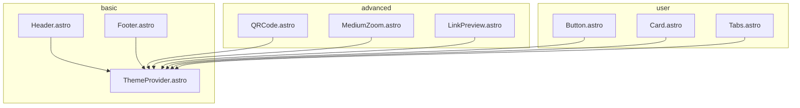
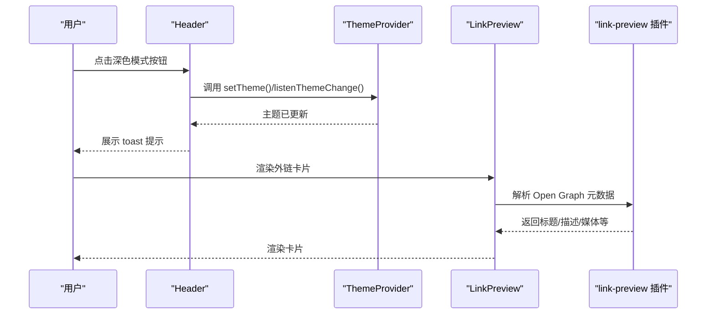
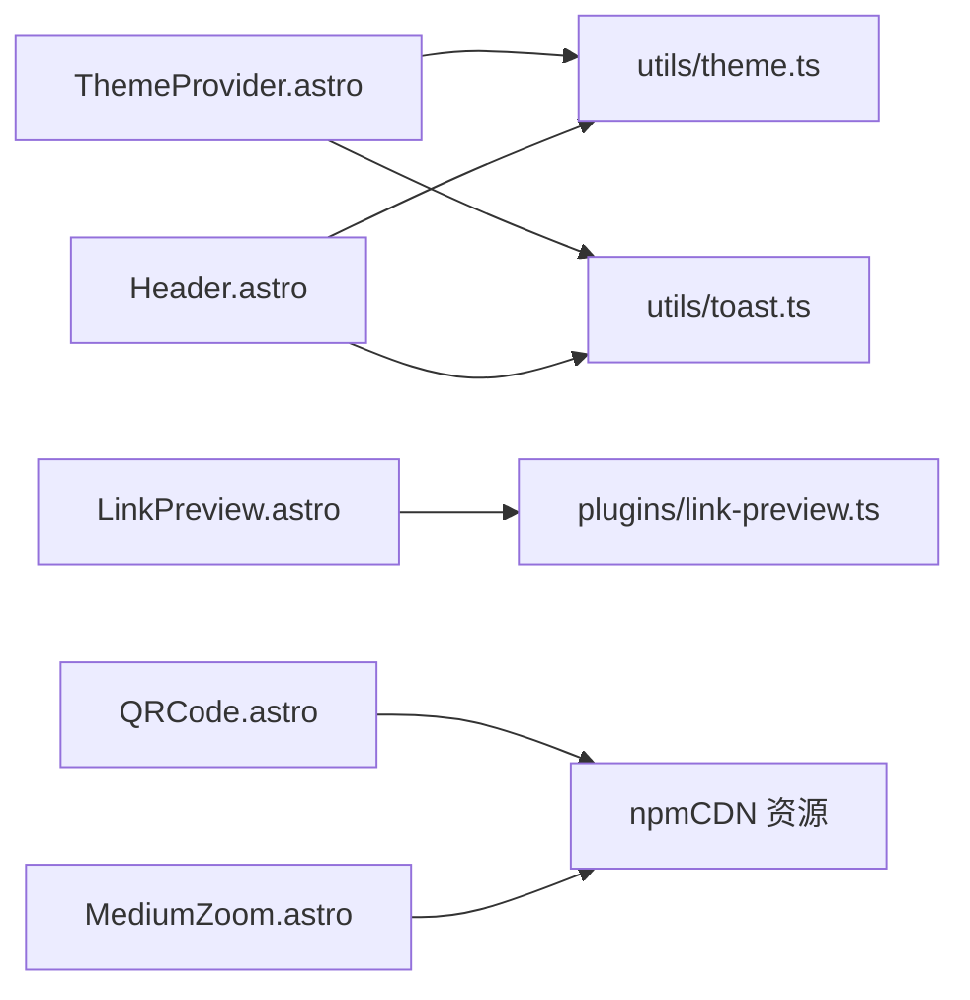

# 组件API

<cite>
**本文引用的文件**
- [packages/pure/components/basic/Header.astro](file://packages/pure/components/basic/Header.astro)
- [packages/pure/components/basic/Footer.astro](file://packages/pure/components/basic/Footer.astro)
- [packages/pure/components/basic/ThemeProvider.astro](file://packages/pure/components/basic/ThemeProvider.astro)
- [packages/pure/components/advanced/QRCode.astro](file://packages/pure/components/advanced/QRCode.astro)
- [packages/pure/components/advanced/MediumZoom.astro](file://packages/pure/components/advanced/MediumZoom.astro)
- [packages/pure/components/advanced/LinkPreview.astro](file://packages/pure/components/advanced/LinkPreview.astro)
- [packages/pure/components/user/Button.astro](file://packages/pure/components/user/Button.astro)
- [packages/pure/components/user/Card.astro](file://packages/pure/components/user/Card.astro)
- [packages/pure/components/user/Tabs.astro](file://packages/pure/components/user/Tabs.astro)
- [packages/pure/components/basic/index.ts](file://packages/pure/components/basic/index.ts)
- [packages/pure/components/advanced/index.ts](file://packages/pure/components/advanced/index.ts)
- [packages/pure/components/user/index.ts](file://packages/pure/components/user/index.ts)
- [packages/pure/plugins/link-preview.ts](file://packages/pure/plugins/link-preview.ts)
- [packages/pure/utils/theme.ts](file://packages/pure/utils/theme.ts)
- [packages/pure/utils/toast.ts](file://packages/pure/utils/toast.ts)
- [packages/pure/schemas/header.ts](file://packages/pure/schemas/header.ts)
</cite>

## 目录
1. [简介](#简介)
2. [项目结构](#项目结构)
3. [核心组件](#核心组件)
4. [架构总览](#架构总览)
5. [详细组件分析](#详细组件分析)
6. [依赖关系分析](#依赖关系分析)
7. [性能考量](#性能考量)
8. [故障排查指南](#故障排查指南)
9. [结论](#结论)
10. [附录](#附录)

## 简介
本文件系统性梳理并记录了主题中提供的组件API，覆盖基础组件（Header、Footer、ThemeProvider）、高级组件（QRCode、MediumZoom、LinkPreview）以及用户组件（Button、Card、Tabs）。内容包括：
- 每个组件的 props、事件与插槽定义
- 使用方法、配置项与可定制选项
- 响应式行为与无障碍访问支持
- 组件组合示例与最佳实践
- 关键流程与数据流的可视化图示

## 项目结构
组件主要位于 packages/pure/components 下，按功能分为 basic、advanced、user 三类，并通过各目录的 index.ts 导出。部分高级组件依赖外部 CDN 资源或服务端插件解析元数据。

图表来源
- [packages/pure/components/basic/Header.astro](file://packages/pure/components/basic/Header.astro#L1-L209)
- [packages/pure/components/basic/Footer.astro](file://packages/pure/components/basic/Footer.astro#L1-L91)
- [packages/pure/components/basic/ThemeProvider.astro](file://packages/pure/components/basic/ThemeProvider.astro#L1-L41)
- [packages/pure/components/advanced/QRCode.astro](file://packages/pure/components/advanced/QRCode.astro#L1-L22)
- [packages/pure/components/advanced/MediumZoom.astro](file://packages/pure/components/advanced/MediumZoom.astro#L1-L48)
- [packages/pure/components/advanced/LinkPreview.astro](file://packages/pure/components/advanced/LinkPreview.astro#L1-L83)
- [packages/pure/components/user/Button.astro](file://packages/pure/components/user/Button.astro#L1-L91)
- [packages/pure/components/user/Card.astro](file://packages/pure/components/user/Card.astro#L1-L33)
- [packages/pure/components/user/Tabs.astro](file://packages/pure/components/user/Tabs.astro#L1-L270)

章节来源
- [packages/pure/components/basic/index.ts](file://packages/pure/components/basic/index.ts#L1-L4)
- [packages/pure/components/advanced/index.ts](file://packages/pure/components/advanced/index.ts#L1-L9)
- [packages/pure/components/user/index.ts](file://packages/pure/components/user/index.ts#L1-L23)

## 核心组件
本节概述三大基础组件的能力边界与交互要点。

- Header
  - 功能：站点头部导航、深色模式切换、移动端菜单展开、滚动时的视觉反馈。
  - 关键行为：滚动监听切换样式；点击深色模式按钮通过工具函数切换主题并提示；移动端菜单开关。
  - 可定制：通过虚拟配置读取标题与菜单项；深色模式图标根据当前主题状态切换显示。
  - 无障碍：为关键元素提供 aria-label 或 sr-only 文本。
  - 响应式：在小屏下使用网格与过渡动画控制显隐与阴影。

- Footer
  - 功能：页脚链接、版权信息、社交图标。
  - 关键行为：自动注入 RSS 链接；支持分两列布局的链接区段；渲染社交平台图标。
  - 可定制：通过配置对象控制链接位置、年份、作者、是否显示主题致谢等。

- ThemeProvider
  - 功能：初始化主题（本地存储或系统偏好），监听系统主题变化，处理主题变更事件与全局提示。
  - 关键行为：页面加载后立即设置主题；监听主题变更；接收 toast 自定义事件并展示提示框。

章节来源
- [packages/pure/components/basic/Header.astro](file://packages/pure/components/basic/Header.astro#L1-L209)
- [packages/pure/components/basic/Footer.astro](file://packages/pure/components/basic/Footer.astro#L1-L91)
- [packages/pure/components/basic/ThemeProvider.astro](file://packages/pure/components/basic/ThemeProvider.astro#L1-L41)
- [packages/pure/utils/theme.ts](file://packages/pure/utils/theme.ts#L1-L41)
- [packages/pure/utils/toast.ts](file://packages/pure/utils/toast.ts#L1-L4)

## 架构总览
组件间协作关系如下：基础组件负责页面骨架与主题态；高级组件负责增强体验（二维码生成、图片缩放、外链预览）；用户组件提供通用 UI 元素；LinkPreview 依赖插件解析 Open Graph 元数据。

图表来源
- [packages/pure/components/basic/Header.astro](file://packages/pure/components/basic/Header.astro#L74-L108)
- [packages/pure/components/basic/ThemeProvider.astro](file://packages/pure/components/basic/ThemeProvider.astro#L22-L40)
- [packages/pure/components/advanced/LinkPreview.astro](file://packages/pure/components/advanced/LinkPreview.astro#L1-L83)
- [packages/pure/plugins/link-preview.ts](file://packages/pure/plugins/link-preview.ts#L79-L111)

## 详细组件分析

### Header 组件 API
- 组件用途
  - 提供站点品牌名、主导航菜单、搜索入口、深色模式切换与移动端菜单。
- 属性（Props）
  - 无显式 Astro props；内部通过虚拟配置读取标题与菜单项。
- 事件（Events）
  - 无直接对外事件；内部通过自定义元素与工具函数实现主题切换与菜单控制。
- 插槽（Slots）
  - 无插槽。
- 行为与配置
  - 滚动超过阈值时添加“非顶部”样式，带动画过渡与阴影。
  - 深色模式按钮点击后调用工具函数切换主题并展示 toast。
  - 移动端菜单通过切换容器类名控制展开/收起。
- 无障碍与响应式
  - 关键元素提供 aria-label 或 sr-only 文本；小屏下菜单使用网格与过渡控制显隐。
- 最佳实践
  - 将 Header 放置在页面最上方，确保滚动行为与 z-index 正常工作。
  - 如需自定义菜单，请通过虚拟配置提供菜单项数组。

章节来源
- [packages/pure/components/basic/Header.astro](file://packages/pure/components/basic/Header.astro#L1-L209)
- [packages/pure/schemas/header.ts](file://packages/pure/schemas/header.ts#L1-L18)

### Footer 组件 API
- 组件用途
  - 渲染页脚区域，包含链接区段、版权与作者信息、主题致谢与社交图标。
- 属性（Props）
  - 无显式 Astro props；内部从虚拟配置读取 footer 配置。
- 事件（Events）
  - 无。
- 插槽（Slots）
  - 无。
- 行为与配置
  - 自动注入 RSS 链接；支持两列布局的链接区段；渲染社交平台图标。
- 无障碍与响应式
  - 社交链接提供 aria-label；整体采用响应式布局适配小屏。
- 最佳实践
  - 在 footer 配置中明确 year、author、links 与 social 字段，确保信息完整。

章节来源
- [packages/pure/components/basic/Footer.astro](file://packages/pure/components/basic/Footer.astro#L1-L91)

### ThemeProvider 组件 API
- 组件用途
  - 初始化主题（本地存储或系统偏好），监听系统主题变化，处理主题变更事件与全局提示。
- 属性（Props）
  - 无。
- 事件（Events）
  - 接收自定义事件 toast，用于展示提示框。
- 插槽（Slots）
  - 无。
- 行为与配置
  - 页面加载后立即设置主题；监听系统主题变化；通过工具函数切换主题并更新 meta theme-color。
- 无障碍与响应式
  - 无特殊无障碍或响应式逻辑。
- 最佳实践
  - 将 ThemeProvider 放置在根部布局，确保全局生效。

章节来源
- [packages/pure/components/basic/ThemeProvider.astro](file://packages/pure/components/basic/ThemeProvider.astro#L1-L41)
- [packages/pure/utils/theme.ts](file://packages/pure/utils/theme.ts#L1-L41)
- [packages/pure/utils/toast.ts](file://packages/pure/utils/toast.ts#L1-L4)

### QRCode 组件 API
- 组件用途
  - 在指定容器内渲染二维码，支持传入内容或默认使用当前页面地址。
- 属性（Props）
  - content: 二维码内容字符串（可选）
  - class: 容器类名（继承 Astro props）
  - 其他原生属性透传到容器元素
- 事件（Events）
  - 无。
- 插槽（Slots）
  - 无。
- 行为与配置
  - 通过 npmCDN 加载第三方库并在客户端渲染；若容器为空则初始化一次。
- 无障碍与响应式
  - 无特殊无障碍或响应式逻辑。
- 最佳实践
  - 为容器提供明确尺寸，避免渲染异常；在 SSR 环境中注意仅在客户端执行。

章节来源
- [packages/pure/components/advanced/QRCode.astro](file://packages/pure/components/advanced/QRCode.astro#L1-L22)

### MediumZoom 组件 API
- 组件用途
  - 为匹配选择器的图像启用缩放交互，支持背景色配置。
- 属性（Props）
  - selector: 选择器字符串（默认来自虚拟配置）
  - background: 背景色字符串（默认基于主题变量）
- 事件（Events）
  - 无。
- 插槽（Slots）
  - 无。
- 行为与配置
  - 通过 npmCDN 加载第三方库并初始化；提供全局样式控制缩放遮罩与图片状态。
- 无障碍与响应式
  - 无特殊无障碍或响应式逻辑。
- 最佳实践
  - 为图片设置合适的宽高比与占位，提升缩放体验。

章节来源
- [packages/pure/components/advanced/MediumZoom.astro](file://packages/pure/components/advanced/MediumZoom.astro#L1-L48)

### LinkPreview 组件 API
- 组件用途
  - 基于 Open Graph 元数据渲染外链预览卡片，支持隐藏媒体与可缩放图片。
- 属性（Props）
  - href: 目标 URL（必填）
  - hideMedia: 是否隐藏媒体（可选，默认 false）
  - zoomable: 图片是否可缩放（可选，默认 true）
- 事件（Events）
  - 无。
- 插槽（Slots）
  - 无。
- 行为与配置
  - 通过插件解析页面的 Open Graph 元数据；根据是否存在视频/图片决定渲染策略；支持域名展示。
- 无障碍与响应式
  - 外链使用 target="_blank"，建议配合 rel 属性；卡片采用响应式布局。
- 最佳实践
  - 对不可信链接谨慎启用 zoomable；确保目标站点正确设置 og:image/og:video 等元数据。

章节来源
- [packages/pure/components/advanced/LinkPreview.astro](file://packages/pure/components/advanced/LinkPreview.astro#L1-L83)
- [packages/pure/plugins/link-preview.ts](file://packages/pure/plugins/link-preview.ts#L79-L111)

### Button 组件 API
- 组件用途
  - 多形态按钮，支持多标签渲染（a/button/自定义标签），可带前后图标与不同风格变体。
- 属性（Props）
  - as: 渲染标签（默认 a）
  - title: 按钮文本（可选）
  - href: 链接地址（可选）
  - variant: 变体（button/pill/back/ahead）
  - target: 链接目标（可选）
  - class: 自定义类名（可选）
- 事件（Events）
  - 无。
- 插槽（Slots）
  - before: 前置内容（当 variant 为 back 时显示向左箭头）
  - after: 后置内容（当 variant 为 ahead 时显示向右箭头）
  - 默认插槽：按钮主体内容（优先使用 title）
- 行为与配置
  - 根据 variant 切换圆角与样式；hover 时改变前景色；支持 href 时启用预取。
- 无障碍与响应式
  - 无特殊无障碍或响应式逻辑。
- 最佳实践
  - 使用 variant="back"/"ahead" 时，结合插槽 before/after 实现导航指示；为可点击按钮提供 href。

章节来源
- [packages/pure/components/user/Button.astro](file://packages/pure/components/user/Button.astro#L1-L91)

### Card 组件 API
- 组件用途
  - 通用卡片容器，支持标题、副标题、日期与可选链接跳转。
- 属性（Props）
  - as: 渲染标签（默认 div）
  - heading: 标题（可选）
  - subheading: 副标题（可选）
  - date: 日期（可选）
  - class: 自定义类名（可选）
- 事件（Events）
  - 无。
- 插槽（Slots）
  - 默认插槽：卡片主体内容
- 行为与配置
  - 当存在 href 时，悬停时增加边框与阴影；支持多行文本与时间信息展示。
- 无障碍与响应式
  - 无特殊无障碍或响应式逻辑。
- 最佳实践
  - 为可点击卡片提供 href；在列表中组合使用以形成卡片列表。

章节来源
- [packages/pure/components/user/Card.astro](file://packages/pure/components/user/Card.astro#L1-L33)

### Tabs 组件 API
- 组件用途
  - 标签页容器，支持键盘导航、同步切换与持久化激活状态。
- 属性（Props）
  - syncKey: 同步键（可选）；提供后跨页面持久化并同步激活标签
- 事件（Events）
  - 无。
- 插槽（Slots）
  - default: 标签页面板内容（由插件解析为多个面板）
- 行为与配置
  - 内联脚本避免“闪烁无效激活”；支持键盘 Home/End/左右箭头导航；点击切换面板并同步其他同键标签页。
- 无障碍与响应式
  - 使用 WAI-ARIA 角色与属性（tablist/tabpanel）；支持键盘操作；列表自动横向滚动。
- 最佳实践
  - 为同一组需要同步的标签页设置相同 syncKey；确保面板内容结构清晰。

章节来源
- [packages/pure/components/user/Tabs.astro](file://packages/pure/components/user/Tabs.astro#L1-L270)

## 依赖关系分析
- 组件依赖
  - Header/ThemeProvider：依赖 utils/theme.ts 与 utils/toast.ts
  - LinkPreview：依赖 plugins/link-preview.ts 进行元数据解析
  - QRCode/MediumZoom：依赖 npmCDN 上的第三方库
- 导出与聚合
  - basic/advanced/user 目录通过各自 index.ts 导出组件，便于统一引入

图表来源
- [packages/pure/components/basic/ThemeProvider.astro](file://packages/pure/components/basic/ThemeProvider.astro#L22-L40)
- [packages/pure/components/basic/Header.astro](file://packages/pure/components/basic/Header.astro#L74-L108)
- [packages/pure/components/advanced/LinkPreview.astro](file://packages/pure/components/advanced/LinkPreview.astro#L1-L83)
- [packages/pure/plugins/link-preview.ts](file://packages/pure/plugins/link-preview.ts#L79-L111)
- [packages/pure/components/advanced/QRCode.astro](file://packages/pure/components/advanced/QRCode.astro#L9-L21)
- [packages/pure/components/advanced/MediumZoom.astro](file://packages/pure/components/advanced/MediumZoom.astro#L14-L17)

章节来源
- [packages/pure/utils/theme.ts](file://packages/pure/utils/theme.ts#L1-L41)
- [packages/pure/utils/toast.ts](file://packages/pure/utils/toast.ts#L1-L4)
- [packages/pure/plugins/link-preview.ts](file://packages/pure/plugins/link-preview.ts#L1-L111)

## 性能考量
- 首屏优化
  - ThemeProvider 使用 is:inline 预设主题，避免白块闪现
  - Header 的深色模式按钮在 is:inline 中预读取本地主题
- 资源加载
  - QRCode 与 MediumZoom 通过 npmCDN 异步加载，避免阻塞主线程
- 数据解析
  - LinkPreview 插件对请求结果进行缓存与错误兜底，减少构建失败风险
- 建议
  - 控制 LinkPreview 的使用数量，避免频繁网络请求
  - Tabs 同步键仅在必要时启用，减少 localStorage 写入

## 故障排查指南
- 主题未生效
  - 检查 ThemeProvider 是否在根布局加载；确认本地存储与系统主题设置
  - 参考路径：[packages/pure/components/basic/ThemeProvider.astro](file://packages/pure/components/basic/ThemeProvider.astro#L6-L20)，[packages/pure/utils/theme.ts](file://packages/pure/utils/theme.ts#L12-L40)
- 深色模式切换无提示
  - 确认触发了 setTheme 并派发了 toast 事件
  - 参考路径：[packages/pure/components/basic/Header.astro](file://packages/pure/components/basic/Header.astro#L89-L98)，[packages/pure/utils/toast.ts](file://packages/pure/utils/toast.ts#L1-L4)
- 二维码不显示
  - 确认容器存在且未被提前清空；检查 npmCDN 可达性
  - 参考路径：[packages/pure/components/advanced/QRCode.astro](file://packages/pure/components/advanced/QRCode.astro#L13-L21)
- 图片无法缩放
  - 确认 selector 匹配到目标图片；检查背景色与样式
  - 参考路径：[packages/pure/components/advanced/MediumZoom.astro](file://packages/pure/components/advanced/MediumZoom.astro#L10-L17)
- 外链卡片无元数据
  - 检查目标站点是否设置正确的 Open Graph 元数据；查看插件日志
  - 参考路径：[packages/pure/components/advanced/LinkPreview.astro](file://packages/pure/components/advanced/LinkPreview.astro#L17-L18)，[packages/pure/plugins/link-preview.ts](file://packages/pure/plugins/link-preview.ts#L79-L111)

章节来源
- [packages/pure/components/basic/ThemeProvider.astro](file://packages/pure/components/basic/ThemeProvider.astro#L6-L20)
- [packages/pure/utils/theme.ts](file://packages/pure/utils/theme.ts#L12-L40)
- [packages/pure/utils/toast.ts](file://packages/pure/utils/toast.ts#L1-L4)
- [packages/pure/components/advanced/QRCode.astro](file://packages/pure/components/advanced/QRCode.astro#L13-L21)
- [packages/pure/components/advanced/MediumZoom.astro](file://packages/pure/components/advanced/MediumZoom.astro#L10-L17)
- [packages/pure/components/advanced/LinkPreview.astro](file://packages/pure/components/advanced/LinkPreview.astro#L17-L18)
- [packages/pure/plugins/link-preview.ts](file://packages/pure/plugins/link-preview.ts#L79-L111)

## 结论
本组件库围绕“基础骨架 + 主题态 + 体验增强 + 通用 UI”的设计思路组织，具备良好的可扩展性与可维护性。通过统一的导出入口与工具函数，开发者可以快速组合出符合无障碍与响应式要求的页面。

## 附录
- 组件组合示例与最佳实践
  - 基础布局：在页面顶部放置 Header，底部放置 Footer；根布局包裹 ThemeProvider
  - 体验增强：在文章中使用 LinkPreview 展示相关资源；为图片包裹 MediumZoom；需要时在侧边栏或正文插入 QRCode
  - 通用 UI：使用 Button 实现导航与操作；使用 Card 组织内容区块；使用 Tabs 分组展示复杂信息
- 无障碍与响应式清单
  - 为交互元素提供 aria-label 或 sr-only 文本
  - 使用语义化标签与 WAI-ARIA 属性（如 tablist/tabpanel）
  - 控制媒体资源加载时机，避免阻塞首屏
  - 在小屏设备上保持导航与内容的可读性与可触达性