# 页面组件API

<cite>
**本文引用的文件**
- [packages/pure/components/pages/Hero.astro](file://packages/pure/components/pages/Hero.astro)
- [packages/pure/components/pages/PFSearch.astro](file://packages/pure/components/pages/PFSearch.astro)
- [packages/pure/components/pages/PostPreview.astro](file://packages/pure/components/pages/PostPreview.astro)
- [packages/pure/components/pages/TOC.astro](file://packages/pure/components/pages/TOC.astro)
- [packages/pure/components/pages/TOCHeading.astro](file://packages/pure/components/pages/TOCHeading.astro)
- [packages/pure/components/pages/ArticleBottom.astro](file://packages/pure/components/pages/ArticleBottom.astro)
- [packages/pure/components/pages/BackToTop.astro](file://packages/pure/components/pages/BackToTop.astro)
- [packages/pure/components/pages/Copyright.astro](file://packages/pure/components/pages/Copyright.astro)
- [packages/pure/components/pages/Paginator.astro](file://packages/pure/components/pages/Paginator.astro)
- [packages/pure/plugins/toc.ts](file://packages/pure/plugins/toc.ts)
- [packages/pure/utils/reading-time.ts](file://packages/pure/utils/reading-time.ts)
- [packages/pure/utils/index.ts](file://packages/pure/utils/index.ts)
- [src/layouts/BlogPost.astro](file://src/layouts/BlogPost.astro)
- [src/layouts/BaseLayout.astro](file://src/layouts/BaseLayout.astro)
</cite>

## 目录
1. [简介](#简介)
2. [项目结构](#项目结构)
3. [核心组件](#核心组件)
4. [架构总览](#架构总览)
5. [详细组件分析](#详细组件分析)
6. [依赖分析](#依赖分析)
7. [性能考虑](#性能考虑)
8. [故障排查指南](#故障排查指南)
9. [结论](#结论)
10. [附录](#附录)

## 简介
本文件系统化梳理页面级组件的API规范与实现要点，覆盖 Hero、PFSearch、PostPreview、TOC、ArticleBottom、BackToTop、Copyright、Paginator 共八个组件。文档从数据结构、配置项、交互行为、样式定制到集成方式逐层展开，并提供关键流程图与时序图帮助理解。

## 项目结构
这些页面组件位于 pure 包的 pages 目录下，配合工具库与插件共同完成内容渲染、目录生成、阅读时长计算等功能；在博客文章布局中通过插槽机制进行组合使用。

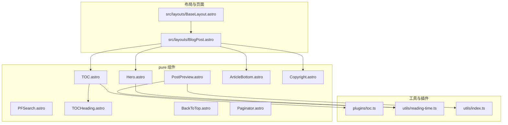

**图表来源**
- [packages/pure/components/pages/Hero.astro](file://packages/pure/components/pages/Hero.astro#L1-L147)
- [packages/pure/components/pages/PFSearch.astro](file://packages/pure/components/pages/PFSearch.astro#L1-L70)
- [packages/pure/components/pages/PostPreview.astro](file://packages/pure/components/pages/PostPreview.astro#L1-L153)
- [packages/pure/components/pages/TOC.astro](file://packages/pure/components/pages/TOC.astro#L1-L136)
- [packages/pure/components/pages/TOCHeading.astro](file://packages/pure/components/pages/TOCHeading.astro#L1-L40)
- [packages/pure/components/pages/ArticleBottom.astro](file://packages/pure/components/pages/ArticleBottom.astro#L1-L95)
- [packages/pure/components/pages/BackToTop.astro](file://packages/pure/components/pages/BackToTop.astro#L1-L147)
- [packages/pure/components/pages/Copyright.astro](file://packages/pure/components/pages/Copyright.astro#L1-L151)
- [packages/pure/components/pages/Paginator.astro](file://packages/pure/components/pages/Paginator.astro#L1-L34)
- [packages/pure/plugins/toc.ts](file://packages/pure/plugins/toc.ts#L1-L25)
- [packages/pure/utils/reading-time.ts](file://packages/pure/utils/reading-time.ts#L1-L77)
- [packages/pure/utils/index.ts](file://packages/pure/utils/index.ts#L1-L18)
- [src/layouts/BlogPost.astro](file://src/layouts/BlogPost.astro#L1-L75)
- [src/layouts/BaseLayout.astro](file://src/layouts/BaseLayout.astro#L1-L92)

**章节来源**
- [src/layouts/BlogPost.astro](file://src/layouts/BlogPost.astro#L1-L75)
- [src/layouts/BaseLayout.astro](file://src/layouts/BaseLayout.astro#L1-L92)

## 核心组件
- Hero：文章头部展示，包含标题、描述、日期、语言、标签、可选草稿标识与可选的模糊背景图与滚动渐隐效果。
- PFSearch：基于 Pagefind 的站内搜索 UI，支持开发模式禁用、结果高亮与自定义样式变量。
- PostPreview：文章列表预览卡片，支持简洁/详细两种形态，含摘要、标签、阅读时长、封面图与悬停高亮。
- TOC：目录生成与滚动高亮，支持层级缩进、锚点平滑滚动、进度条样式切换。
- ArticleBottom：文章底部“上一篇/下一篇”导航，自动计算相邻文章并提供流畅过渡。
- BackToTop：返回顶部按钮，支持百分比进度显示、与标题相交的显隐控制、平滑滚动。
- Copyright：版权信息与分享区，支持复制链接、二维码弹出、社交分享（微博、X、Bluesky）。
- Paginator：通用分页导航，支持上一页/下一页链接与无障碍标签。

**章节来源**
- [packages/pure/components/pages/Hero.astro](file://packages/pure/components/pages/Hero.astro#L1-L147)
- [packages/pure/components/pages/PFSearch.astro](file://packages/pure/components/pages/PFSearch.astro#L1-L70)
- [packages/pure/components/pages/PostPreview.astro](file://packages/pure/components/pages/PostPreview.astro#L1-L153)
- [packages/pure/components/pages/TOC.astro](file://packages/pure/components/pages/TOC.astro#L1-L136)
- [packages/pure/components/pages/ArticleBottom.astro](file://packages/pure/components/pages/ArticleBottom.astro#L1-L95)
- [packages/pure/components/pages/BackToTop.astro](file://packages/pure/components/pages/BackToTop.astro#L1-L147)
- [packages/pure/components/pages/Copyright.astro](file://packages/pure/components/pages/Copyright.astro#L1-L151)
- [packages/pure/components/pages/Paginator.astro](file://packages/pure/components/pages/Paginator.astro#L1-L34)

## 架构总览
页面组件通过 Astro 布局组合使用，BlogPost 布局负责注入 TOC、Hero、ArticleBottom、Copyright 等组件，并通过插槽将内容与侧边栏组织起来；BackToTop 作为独立浮层按钮在页面滚动时动态显隐。

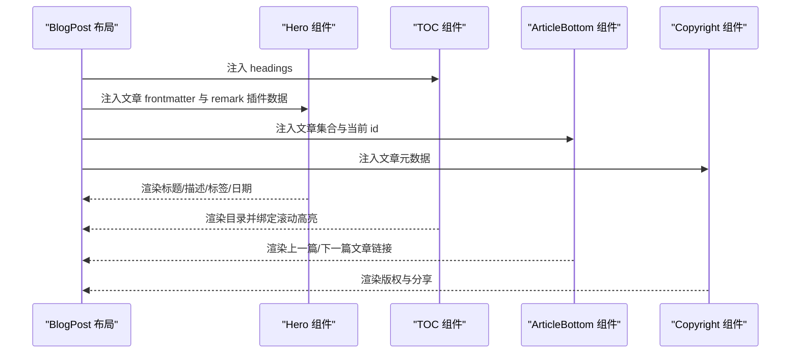

**图表来源**
- [src/layouts/BlogPost.astro](file://src/layouts/BlogPost.astro#L47-L72)
- [packages/pure/components/pages/Hero.astro](file://packages/pure/components/pages/Hero.astro#L1-L147)
- [packages/pure/components/pages/TOC.astro](file://packages/pure/components/pages/TOC.astro#L1-L136)
- [packages/pure/components/pages/ArticleBottom.astro](file://packages/pure/components/pages/ArticleBottom.astro#L1-L95)
- [packages/pure/components/pages/Copyright.astro](file://packages/pure/components/pages/Copyright.astro#L1-L151)

## 详细组件分析

### Hero 组件 API 规范
- 输入属性
  - data: 来自内容集合的条目对象，包含标题、描述、草稿标记、hero 图片、发布/更新日期、标签、语言等。
  - remarkPluginFrontmatter: remark 插件注入的前端数据，如分钟数等。
- 行为与样式
  - 可选 hero 图片与模糊背景层，滚动时根据阈值降低透明度。
  - 日期显示支持发布与更新双态，语言与标签以图标+文本形式展示。
  - 标签点击支持 pagefind 过滤与跳转。
- 响应式设计
  - 标题与信息块在小屏居中，大屏宽度自适应。
- 使用场景
  - 博文详情页头部信息展示，作为 SEO 与可读性增强。
- 集成示例
  - 在 BlogPost 布局中通过插槽注入，传递文章数据与 remark 数据。

**章节来源**
- [packages/pure/components/pages/Hero.astro](file://packages/pure/components/pages/Hero.astro#L1-L147)
- [src/layouts/BlogPost.astro](file://src/layouts/BlogPost.astro#L54-L58)

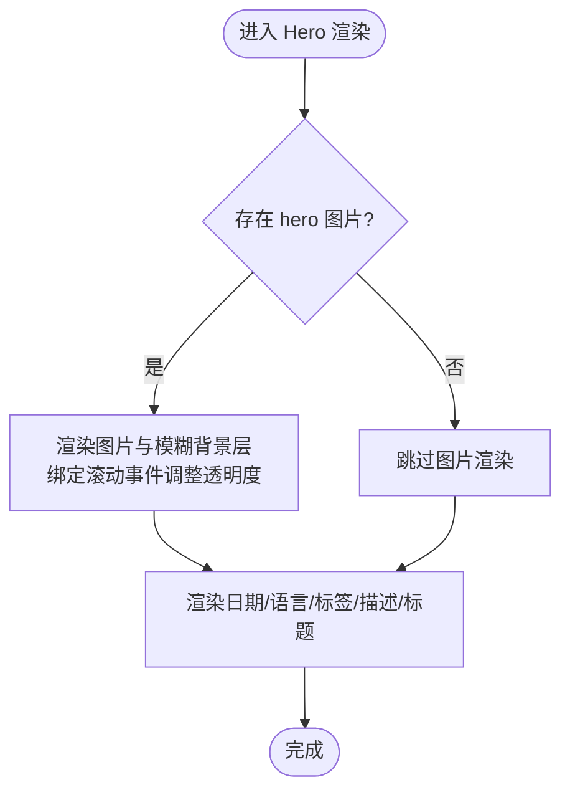

**图表来源**
- [packages/pure/components/pages/Hero.astro](file://packages/pure/components/pages/Hero.astro#L22-L139)

### PFSearch 组件 API 规范
- 功能特性
  - 基于 @pagefind/default-ui 的搜索 UI，按需懒加载。
  - 开发模式下禁用并提示。
  - 支持结果 URL 格式化、子结果处理、关闭图片与子结果展示。
- 样式定制
  - 通过 CSS 变量映射主题色板与圆角、边框、字体等。
- 配置项
  - 无外部 props，内部通过环境变量与 bundlePath 控制。
- 使用场景
  - 全局或页面级搜索入口，与 pagefind 索引配合。
- 集成示例
  - 在需要搜索的位置直接引入组件即可。

**章节来源**
- [packages/pure/components/pages/PFSearch.astro](file://packages/pure/components/pages/PFSearch.astro#L1-L70)

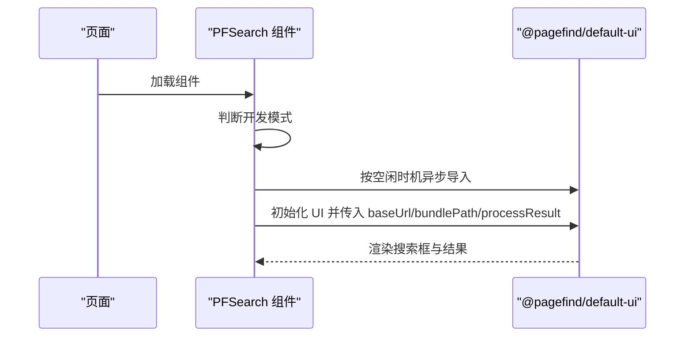

**图表来源**
- [packages/pure/components/pages/PFSearch.astro](file://packages/pure/components/pages/PFSearch.astro#L19-L53)

### PostPreview 组件 API 规范
- 输入属性
  - post: 内容条目，支持任意集合键。
  - detailed: 是否为详细卡片（默认 false）。
  - basePath: 文章基础路径，默认 “/blog”。
  - class: 自定义样式类名。
- 行为与样式
  - 详细模式下支持封面图、摘要截断、标签气泡、阅读时长与语言显示。
  - 悬停时高亮主色与箭头位移动画。
  - 封面图带遮罩，移动端/桌面端遮罩方向不同。
- 阅读时长
  - 通过 remark 渲染后的 frontmatter 获取分钟数。
- 使用场景
  - 文章列表、归档页、相关推荐等。
- 集成示例
  - 在列表循环中传入条目与 basePath。

**章节来源**
- [packages/pure/components/pages/PostPreview.astro](file://packages/pure/components/pages/PostPreview.astro#L1-L153)
- [packages/pure/utils/reading-time.ts](file://packages/pure/utils/reading-time.ts#L1-L77)
- [packages/pure/utils/index.ts](file://packages/pure/utils/index.ts#L1-L18)

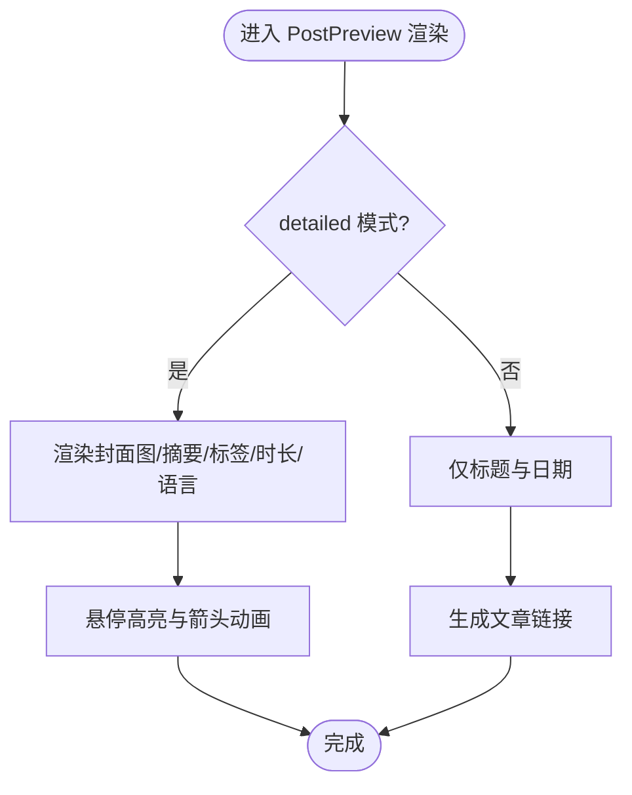

**图表来源**
- [packages/pure/components/pages/PostPreview.astro](file://packages/pure/components/pages/PostPreview.astro#L21-L151)

### TOC 组件 API 规范
- 输入属性
  - headings: MarkdownHeading 数组。
  - class/id: 可选样式类与容器 id。
- 目录生成
  - 使用 toc 工具将 headings 转换为层级树，递归渲染子项。
  - 子项组件 TOCHeading 负责深度缩进与文本清洗。
- 交互行为
  - 通过 Intersection 与滚动进度计算，高亮当前段落，显示进度条高度。
  - 点击目录项平滑滚动至对应标题并更新 URL hash。
- 样式定制
  - 通过 CSS 变量与类名切换实现高亮与半透背景。
- 使用场景
  - 文章详情页侧边栏或正文右侧目录。
- 集成示例
  - 在 BlogPost 布局中注入 headings 并挂载到 sidebar 插槽。

**章节来源**
- [packages/pure/components/pages/TOC.astro](file://packages/pure/components/pages/TOC.astro#L1-L136)
- [packages/pure/components/pages/TOCHeading.astro](file://packages/pure/components/pages/TOCHeading.astro#L1-L40)
- [packages/pure/plugins/toc.ts](file://packages/pure/plugins/toc.ts#L1-L25)

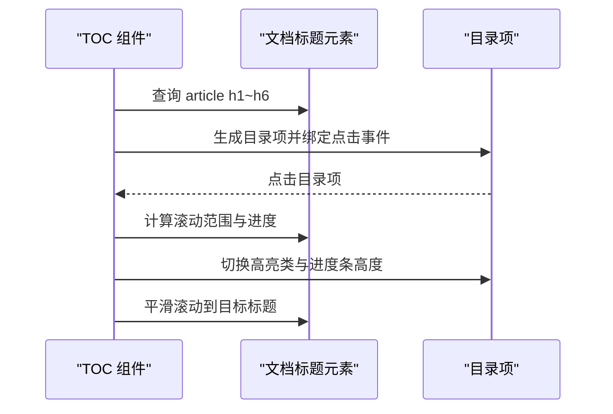

**图表来源**
- [packages/pure/components/pages/TOC.astro](file://packages/pure/components/pages/TOC.astro#L41-L129)

### ArticleBottom 组件 API 规范
- 输入属性
  - id: 当前文章 id。
  - collections: 文章集合。
  - class: 可选样式类。
- 行为与样式
  - 基于 id 查找前后文章，支持环形索引。
  - 上一篇向左、下一页向右，均带箭头与悬停过渡。
- 使用场景
  - 文章末尾提供连续阅读体验。
- 集成示例
  - 在 BlogPost 布局底部插槽中注入。

**章节来源**
- [packages/pure/components/pages/ArticleBottom.astro](file://packages/pure/components/pages/ArticleBottom.astro#L1-L95)
- [src/layouts/BlogPost.astro](file://src/layouts/BlogPost.astro#L62-L69)

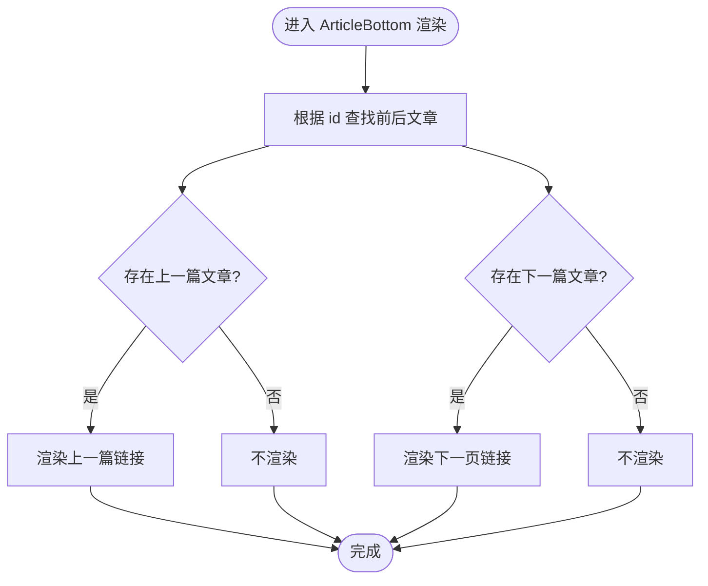

**图表来源**
- [packages/pure/components/pages/ArticleBottom.astro](file://packages/pure/components/pages/ArticleBottom.astro#L16-L94)

### BackToTop 组件 API 规范
- 输入属性
  - header: 标题元素 id（用于相交观察显隐）。
  - content: 内容元素 id（用于计算滚动进度）。
  - needPercent: 是否显示百分比（默认 true）。
- 行为与样式
  - 按需计算滚动百分比，按钮在底部固定，显隐由相交观察控制。
  - 点击平滑滚动至顶部；百分比达到 100% 时切换状态。
- 使用场景
  - 长文阅读时快速回到顶部。
- 集成示例
  - 在页面布局中引入，传入 header 与 content id。

**章节来源**
- [packages/pure/components/pages/BackToTop.astro](file://packages/pure/components/pages/BackToTop.astro#L1-L147)

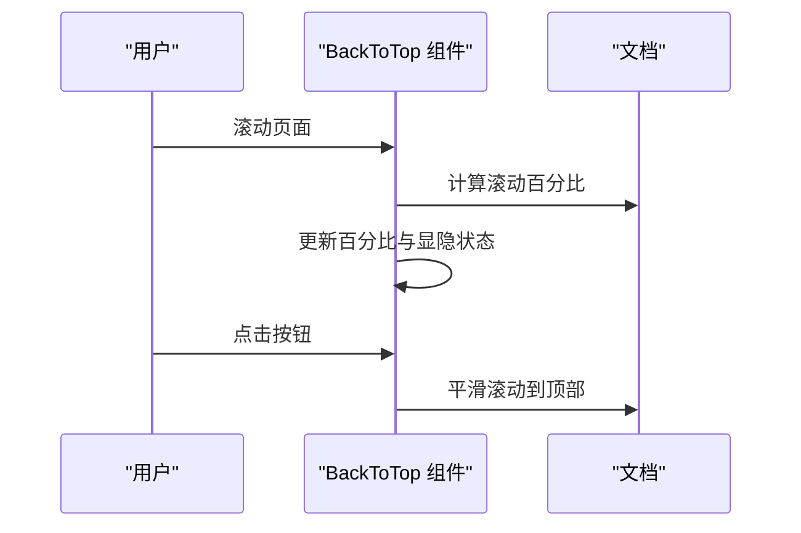

**图表来源**
- [packages/pure/components/pages/BackToTop.astro](file://packages/pure/components/pages/BackToTop.astro#L29-L109)

### Copyright 组件 API 规范
- 输入属性
  - data: 内容条目元数据（标题、发布时间、hero 图片等）。
  - class: 可选样式类。
- 功能特性
  - 展示作者、发布时间、版权协议链接。
  - 复制链接、二维码弹出、社交分享（微博、X、Bluesky）。
- 使用场景
  - 文章底部版权与分享区域。
- 集成示例
  - 在 BlogPost 布局底部插槽中注入。

**章节来源**
- [packages/pure/components/pages/Copyright.astro](file://packages/pure/components/pages/Copyright.astro#L1-L151)
- [src/layouts/BlogPost.astro](file://src/layouts/BlogPost.astro#L63-L68)

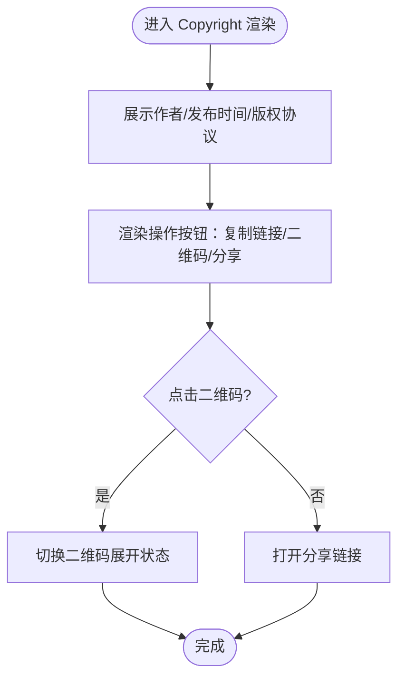

**图表来源**
- [packages/pure/components/pages/Copyright.astro](file://packages/pure/components/pages/Copyright.astro#L35-L151)

### Paginator 组件 API 规范
- 输入属性
  - nextUrl: 下一页链接对象，包含 url、text、srLabel。
  - prevUrl: 上一页链接对象，同上。
- 行为与样式
  - 仅在存在链接时渲染，支持无障碍标签与预取。
- 使用场景
  - 列表分页导航。
- 集成示例
  - 在列表页或标签页底部引入。

**章节来源**
- [packages/pure/components/pages/Paginator.astro](file://packages/pure/components/pages/Paginator.astro#L1-L34)

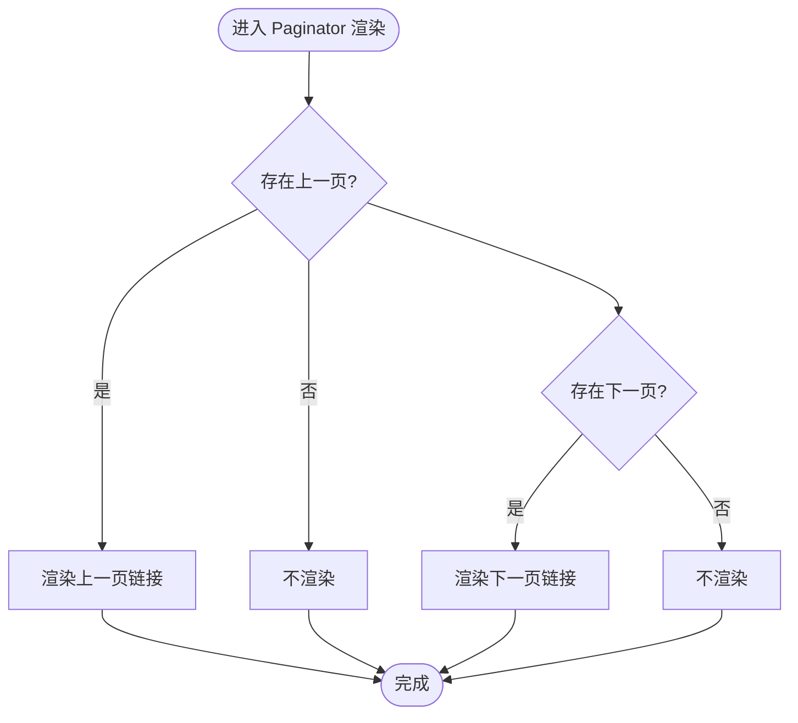

**图表来源**
- [packages/pure/components/pages/Paginator.astro](file://packages/pure/components/pages/Paginator.astro#L16-L33)

## 依赖分析
- 组件间关系
  - TOC 依赖 toc 工具生成层级树；TOCHeading 递归渲染子节点。
  - PostPreview 与 Hero 依赖阅读时长工具计算分钟数。
  - BlogPost 布局统一组合多个页面组件并通过插槽注入数据。
- 外部依赖
  - PFSearch 依赖 @pagefind/default-ui；BackToTop 依赖浏览器 IntersectionObserver 与 requestAnimationFrame。
- 循环依赖
  - 未发现直接循环依赖；TOCHeading 通过 Astro.self 实现递归渲染，属于模板层面的自引用。

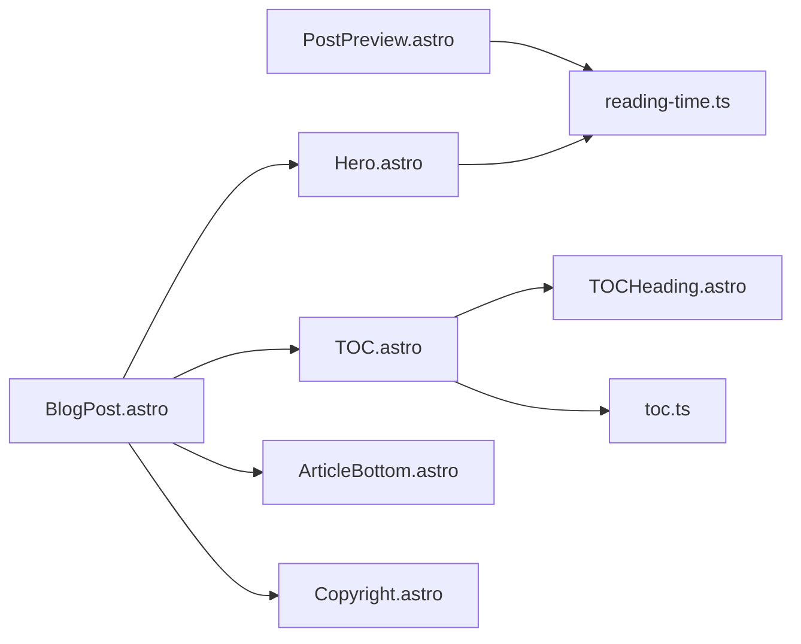

**图表来源**
- [packages/pure/components/pages/TOC.astro](file://packages/pure/components/pages/TOC.astro#L1-L136)
- [packages/pure/components/pages/TOCHeading.astro](file://packages/pure/components/pages/TOCHeading.astro#L1-L40)
- [packages/pure/plugins/toc.ts](file://packages/pure/plugins/toc.ts#L1-L25)
- [packages/pure/components/pages/PostPreview.astro](file://packages/pure/components/pages/PostPreview.astro#L1-L153)
- [packages/pure/utils/reading-time.ts](file://packages/pure/utils/reading-time.ts#L1-L77)
- [packages/pure/components/pages/Hero.astro](file://packages/pure/components/pages/Hero.astro#L1-L147)
- [src/layouts/BlogPost.astro](file://src/layouts/BlogPost.astro#L1-L75)

**章节来源**
- [packages/pure/components/pages/TOC.astro](file://packages/pure/components/pages/TOC.astro#L1-L136)
- [packages/pure/components/pages/PostPreview.astro](file://packages/pure/components/pages/PostPreview.astro#L1-L153)
- [packages/pure/utils/reading-time.ts](file://packages/pure/utils/reading-time.ts#L1-L77)
- [src/layouts/BlogPost.astro](file://src/layouts/BlogPost.astro#L1-L75)

## 性能考虑
- 懒加载与空闲回调
  - PFSearch 使用 requestIdleCallback 异步导入 UI，避免阻塞首屏。
- 滚动节流
  - TOC 使用定时器与 requestAnimationFrame 控制滚动更新频率。
- 图片与模糊效果
  - Hero 的模糊背景图采用低优先级加载与阈值渐变，减少滚动抖动。
- 预取与缓存
  - 导航链接使用 data-astro-prefetch 提升交互速度。
- 建议
  - 对长列表建议结合虚拟滚动与分页；TOC 高亮逻辑可根据内容长度调优更新间隔。

[本节为通用指导，无需特定文件来源]

## 故障排查指南
- PFSearch 在开发模式不可用
  - 现象：显示“开发模式禁用”的提示。
  - 排查：确认环境变量与构建产物路径。
- TOC 无法高亮或滚动异常
  - 现象：目录不随滚动变化或点击无效。
  - 排查：检查标题元素选择器是否匹配、目标 id 是否存在、容器偏移计算是否正确。
- BackToTop 不显示或百分比不更新
  - 现象：按钮始终隐藏或百分比不变化。
  - 排查：确认 header 与 content 的 id 正确、元素存在、滚动高度计算有效。
- PostPreview 标签/时长显示异常
  - 现象：标签为空或时长为 NaN。
  - 排查：确认 remark 渲染已注入 minutesRead，frontmatter 正确。
- Copyright 分享链接无效
  - 现象：打开分享失败或参数缺失。
  - 排查：核对分享平台链接拼接与编码，确保 title、url、image 参数可用。

**章节来源**
- [packages/pure/components/pages/PFSearch.astro](file://packages/pure/components/pages/PFSearch.astro#L8-L15)
- [packages/pure/components/pages/TOC.astro](file://packages/pure/components/pages/TOC.astro#L61-L125)
- [packages/pure/components/pages/BackToTop.astro](file://packages/pure/components/pages/BackToTop.astro#L60-L106)
- [packages/pure/components/pages/PostPreview.astro](file://packages/pure/components/pages/PostPreview.astro#L17-L18)
- [packages/pure/components/pages/Copyright.astro](file://packages/pure/components/pages/Copyright.astro#L22-L32)

## 结论
上述页面组件围绕内容展示、导航与交互形成完整闭环：Hero 提供头部信息与视觉焦点，TOC 与 ArticleBottom 提升可读性与连贯性，BackToTop 优化长文体验，Copyright 增强版权与社交传播，PFSearch 与 Paginator 则完善检索与分页能力。通过统一的数据输入与插槽组合，可在不同页面灵活复用。

[本节为总结性内容，无需特定文件来源]

## 附录
- 配置项速查
  - Hero：接收文章数据与 remark 插件数据，无额外 props。
  - PFSearch：无 props，依赖环境变量与 bundlePath。
  - PostPreview：post/detailed/basePath/class。
  - TOC：headings/class/id。
  - ArticleBottom：id/collections/class。
  - BackToTop：header/content/needPercent。
  - Copyright：data/class。
  - Paginator：nextUrl/prevUrl。
- 最佳实践
  - 在布局中集中注入数据，减少重复计算。
  - 合理使用 data-astro-prefetch 与懒加载策略。
  - 为交互元素提供无障碍标签与键盘可达性。

[本节为概览性内容，无需特定文件来源]