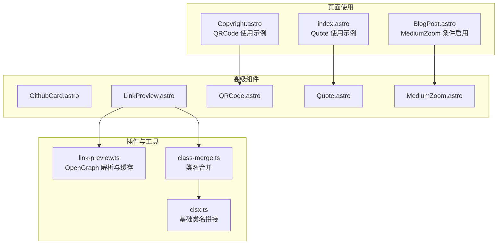
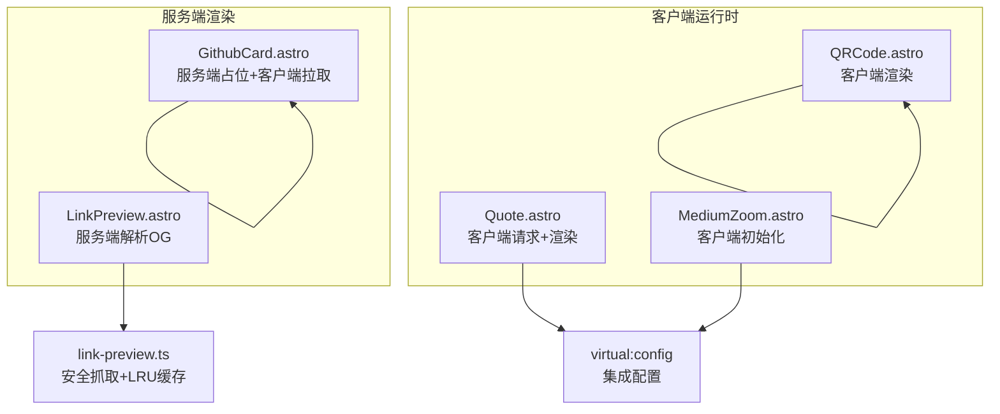
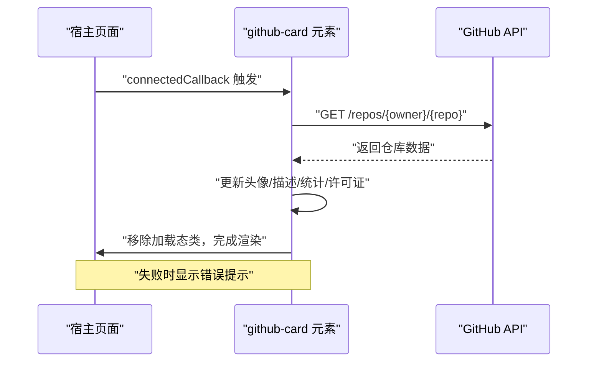
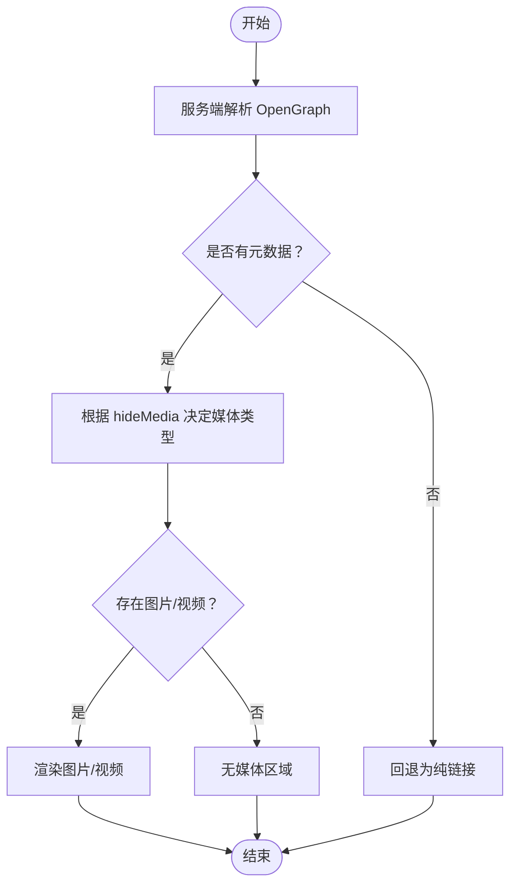
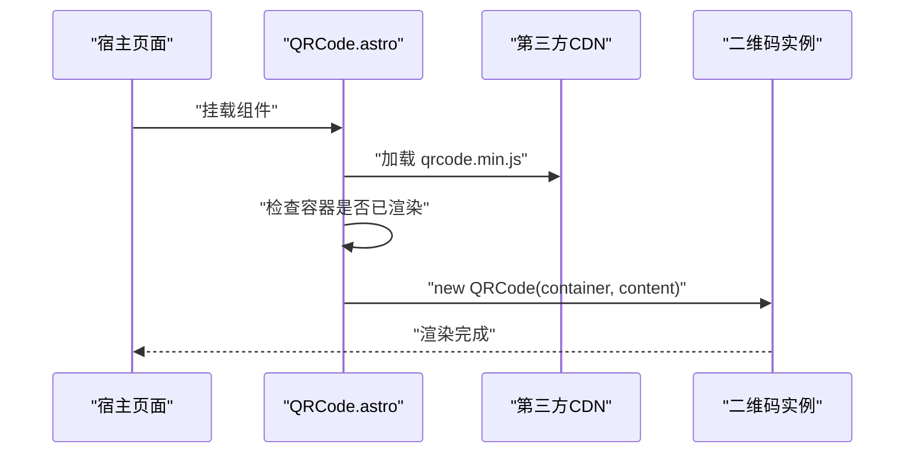
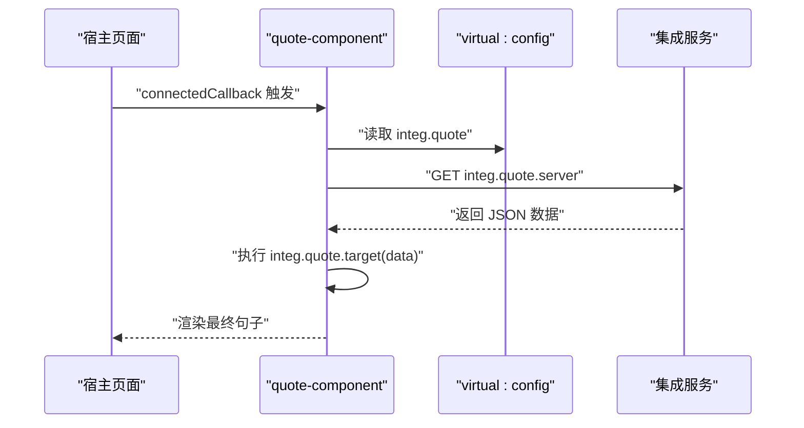
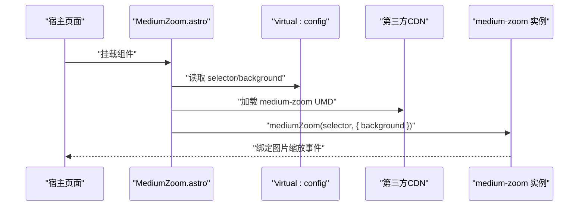
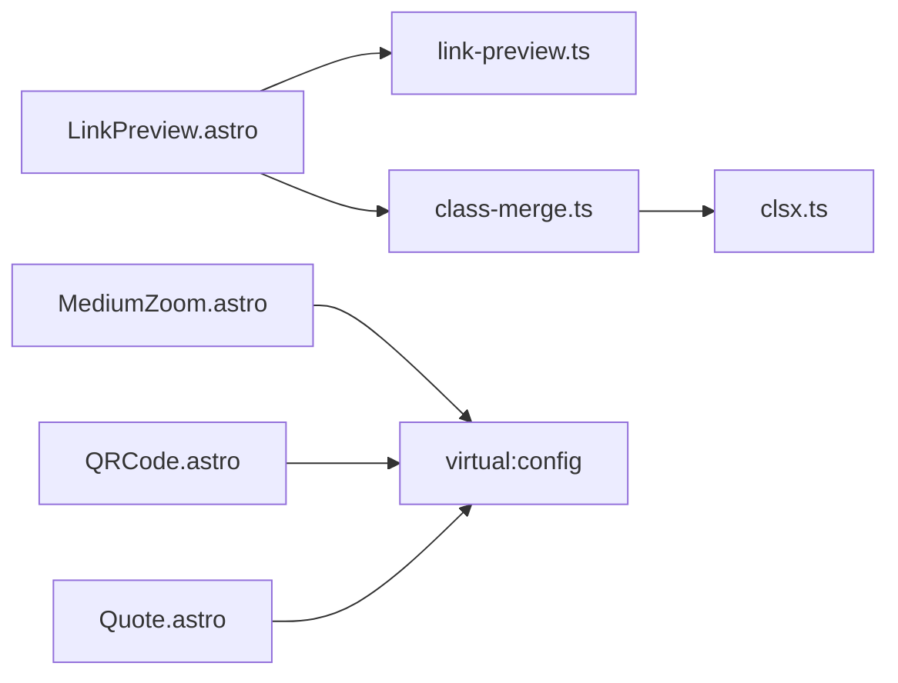

# 高级组件API

<cite>
**本文档引用的文件**
- [packages/pure/components/advanced/GithubCard.astro](file://packages/pure/components/advanced/GithubCard.astro)
- [packages/pure/components/advanced/LinkPreview.astro](file://packages/pure/components/advanced/LinkPreview.astro)
- [packages/pure/components/advanced/QRCode.astro](file://packages/pure/components/advanced/QRCode.astro)
- [packages/pure/components/advanced/Quote.astro](file://packages/pure/components/advanced/Quote.astro)
- [packages/pure/components/advanced/MediumZoom.astro](file://packages/pure/components/advanced/MediumZoom.astro)
- [packages/pure/plugins/link-preview.ts](file://packages/pure/plugins/link-preview.ts)
- [packages/pure/utils/class-merge.ts](file://packages/pure/utils/class-merge.ts)
- [packages/pure/utils/clsx.ts](file://packages/pure/utils/clsx.ts)
- [packages/pure/components/advanced/index.ts](file://packages/pure/components/advanced/index.ts)
- [packages/pure/components/pages/Copyright.astro](file://packages/pure/components/pages/Copyright.astro)
- [src/pages/index.astro](file://src/pages/index.astro)
- [src/layouts/BlogPost.astro](file://src/layouts/BlogPost.astro)
</cite>

## 目录
1. [简介](#简介)
2. [项目结构](#项目结构)
3. [核心组件](#核心组件)
4. [架构总览](#架构总览)
5. [详细组件分析](#详细组件分析)
6. [依赖关系分析](#依赖关系分析)
7. [性能考量](#性能考量)
8. [故障排查指南](#故障排查指南)
9. [结论](#结论)
10. [附录](#附录)

## 简介
本文件系统性梳理博客系统中的高级组件API，覆盖以下组件：
- GithubCard：展示 GitHub 仓库信息，含头像、描述、星数、fork 数、语言、许可证等，并支持加载态动画与错误兜底。
- LinkPreview：外链预览，基于 Open Graph 元数据抓取标题、描述、域名、图片或视频，支持隐藏媒体与可缩放图片。
- QRCode：在客户端渲染二维码，支持内容来源、尺寸控制、颜色定制与容器样式扩展。
- Quote：从集成配置中拉取随机语录并在组件内渲染，用于装饰性文案。
- MediumZoom：为页面图片提供缩放交互，支持选择器与背景色配置。

本文件提供每个组件的属性定义、事件与生命周期行为、样式与交互细节，以及典型使用场景与最佳实践。

## 项目结构
高级组件位于 packages/pure/components/advanced 目录，配套有链接预览解析插件与类名合并工具。部分组件在页面布局与内容页中被按需启用。

图表来源
- [packages/pure/components/advanced/GithubCard.astro](file://packages/pure/components/advanced/GithubCard.astro#L1-L177)
- [packages/pure/components/advanced/LinkPreview.astro](file://packages/pure/components/advanced/LinkPreview.astro#L1-L83)
- [packages/pure/components/advanced/QRCode.astro](file://packages/pure/components/advanced/QRCode.astro#L1-L22)
- [packages/pure/components/advanced/Quote.astro](file://packages/pure/components/advanced/Quote.astro#L1-L41)
- [packages/pure/components/advanced/MediumZoom.astro](file://packages/pure/components/advanced/MediumZoom.astro#L1-L48)
- [packages/pure/plugins/link-preview.ts](file://packages/pure/plugins/link-preview.ts#L1-L111)
- [packages/pure/utils/class-merge.ts](file://packages/pure/utils/class-merge.ts#L1-L20)
- [packages/pure/utils/clsx.ts](file://packages/pure/utils/clsx.ts#L1-L25)
- [packages/pure/components/pages/Copyright.astro](file://packages/pure/components/pages/Copyright.astro#L105-L151)
- [src/pages/index.astro](file://src/pages/index.astro#L60-L128)
- [src/layouts/BlogPost.astro](file://src/layouts/BlogPost.astro#L70-L75)

章节来源
- [packages/pure/components/advanced/index.ts](file://packages/pure/components/advanced/index.ts#L1-L9)

## 核心组件
- GithubCard：通过自定义元素在客户端拉取 GitHub API，渲染仓库卡片；支持加载态骨架屏与错误兜底。
- LinkPreview：服务端解析 Open Graph 元数据，动态渲染链接预览卡片，支持隐藏媒体与可缩放图片。
- QRCode：在客户端使用第三方库渲染二维码，支持传入内容与容器样式。
- Quote：通过虚拟配置读取集成接口，拉取语录并渲染到组件内部。
- MediumZoom：在客户端初始化图片缩放，支持选择器与背景色配置。

章节来源
- [packages/pure/components/advanced/GithubCard.astro](file://packages/pure/components/advanced/GithubCard.astro#L1-L177)
- [packages/pure/components/advanced/LinkPreview.astro](file://packages/pure/components/advanced/LinkPreview.astro#L1-L83)
- [packages/pure/components/advanced/QRCode.astro](file://packages/pure/components/advanced/QRCode.astro#L1-L22)
- [packages/pure/components/advanced/Quote.astro](file://packages/pure/components/advanced/Quote.astro#L1-L41)
- [packages/pure/components/advanced/MediumZoom.astro](file://packages/pure/components/advanced/MediumZoom.astro#L1-L48)

## 架构总览
下图展示了各组件的职责边界与数据流：

图表来源
- [packages/pure/components/advanced/LinkPreview.astro](file://packages/pure/components/advanced/LinkPreview.astro#L1-L83)
- [packages/pure/plugins/link-preview.ts](file://packages/pure/plugins/link-preview.ts#L1-L111)
- [packages/pure/components/advanced/GithubCard.astro](file://packages/pure/components/advanced/GithubCard.astro#L101-L177)
- [packages/pure/components/advanced/QRCode.astro](file://packages/pure/components/advanced/QRCode.astro#L1-L22)
- [packages/pure/components/advanced/Quote.astro](file://packages/pure/components/advanced/Quote.astro#L19-L41)
- [packages/pure/components/advanced/MediumZoom.astro](file://packages/pure/components/advanced/MediumZoom.astro#L1-L48)

## 详细组件分析

### GithubCard 组件 API
- 组件类型：自定义元素（Web Components）
- 属性
  - 无显式 props（通过 dataset 传递仓库标识）
  - 关键数据属性：data-repo（格式形如 owner/repo）
- 生命周期
  - connectedCallback：拉取 GitHub API，更新头像、描述、星数、fork 数、语言、许可证；移除加载态类；失败时显示错误提示
- 渲染逻辑
  - 初始状态：加载骨架屏（带脉动动画），占位文本
  - 成功后：替换占位文本与背景头像，显示真实数据
- 数据来源
  - GitHub REST API：/repos/{owner}/{repo}
  - 头像、描述、星数、fork 数、语言、许可证
- 错误处理
  - HTTP 错误与异常捕获，降级为“获取失败”提示
- 样式与交互
  - 加载态：骨架屏 + 脉动动画
  - 成功态：头像背景、文字高亮、悬停态过渡
  - 许可证为空时的样式适配
- 使用建议
  - 传入标准仓库路径（支持去除协议前缀）
  - 建议配合容器样式控制最大宽度与间距

图表来源
- [packages/pure/components/advanced/GithubCard.astro](file://packages/pure/components/advanced/GithubCard.astro#L111-L177)

章节来源
- [packages/pure/components/advanced/GithubCard.astro](file://packages/pure/components/advanced/GithubCard.astro#L1-L177)

### LinkPreview 组件 API
- 组件类型：Astro 组件（SSR）
- 属性
  - href: string（必填）- 待解析的外部链接
  - hideMedia?: boolean（可选，默认 false）- 是否隐藏图片/视频
  - zoomable?: boolean（可选，默认 true）- 图片是否可缩放（仅在未隐藏媒体且存在图片时生效）
- 渲染策略
  - 服务端：调用 Open Graph 解析插件，解析标题、描述、域名、图片/视频、URL
  - 客户端：根据 hideMedia 与 media 类型决定渲染图片或视频；若无元数据则回退为纯链接
- 样式与布局
  - 支持响应式布局（移动端与桌面端不同排列）
  - 图片/视频固定宽高比，对象填充
  - 可选的“可缩放”类名用于后续手势缩放
- 依赖
  - 插件：safeGetDOM/safeGet（带 LRU 缓存的安全抓取）
  - 工具：cn（类名合并）

图表来源
- [packages/pure/components/advanced/LinkPreview.astro](file://packages/pure/components/advanced/LinkPreview.astro#L1-L83)
- [packages/pure/plugins/link-preview.ts](file://packages/pure/plugins/link-preview.ts#L79-L108)

章节来源
- [packages/pure/components/advanced/LinkPreview.astro](file://packages/pure/components/advanced/LinkPreview.astro#L1-L83)
- [packages/pure/plugins/link-preview.ts](file://packages/pure/plugins/link-preview.ts#L1-L111)
- [packages/pure/utils/class-merge.ts](file://packages/pure/utils/class-merge.ts#L1-L20)

### QRCode 组件 API
- 组件类型：Astro 组件（客户端渲染）
- 属性
  - content?: string（可选）- 二维码内容，默认使用当前页面 URL
  - class?: string（可选）- 容器类名
  - 其他原生属性透传至容器 div
- 行为
  - 在客户端注入第三方二维码库脚本
  - 若容器已有内容则跳过重复渲染
  - 初始化时根据 content 渲染二维码
- 注意事项
  - 依赖虚拟配置中的 npmCDN 地址
  - 建议为容器设置固定尺寸与背景色以提升可读性
- 使用示例
  - 页面版权模块中作为“展开/收起”的二维码面板

图表来源
- [packages/pure/components/advanced/QRCode.astro](file://packages/pure/components/advanced/QRCode.astro#L1-L22)
- [packages/pure/components/pages/Copyright.astro](file://packages/pure/components/pages/Copyright.astro#L105-L151)

章节来源
- [packages/pure/components/advanced/QRCode.astro](file://packages/pure/components/advanced/QRCode.astro#L1-L22)
- [packages/pure/components/pages/Copyright.astro](file://packages/pure/components/pages/Copyright.astro#L105-L151)

### Quote 组件 API
- 组件类型：自定义元素（Web Components）
- 属性
  - 无显式 props（通过虚拟配置读取集成数据）
- 行为
  - connectedCallback：从虚拟配置的集成接口拉取 JSON 数据
  - 通过目标函数（字符串形式的函数体）对数据进行转换，再渲染到组件内部
  - 渲染完成后替换“加载中”提示
- 集成方式
  - 依赖 virtual:config 中的 integ.quote 配置（包含 server 与 target）
  - 由于运行时限制，target 以字符串形式提供并通过 new Function 动态执行
- 使用示例
  - 主页中作为装饰性语录展示

图表来源
- [packages/pure/components/advanced/Quote.astro](file://packages/pure/components/advanced/Quote.astro#L19-L41)
- [src/pages/index.astro](file://src/pages/index.astro#L60-L128)

章节来源
- [packages/pure/components/advanced/Quote.astro](file://packages/pure/components/advanced/Quote.astro#L1-L41)
- [src/pages/index.astro](file://src/pages/index.astro#L60-L128)

### MediumZoom 组件 API
- 组件类型：Astro 组件（客户端渲染）
- 属性
  - selector?: string（可选，默认来自配置）- 选择器，指定需要缩放的图片
  - background?: string（可选，默认透明背景）- 缩放遮罩背景色
- 行为
  - 在客户端注入 medium-zoom 库
  - 使用配置中的 npmCDN 与默认选择器初始化缩放
  - 提供全局样式以控制遮罩与图片的过渡与层级
- 使用示例
  - 博客文章布局中按需启用

图表来源
- [packages/pure/components/advanced/MediumZoom.astro](file://packages/pure/components/advanced/MediumZoom.astro#L1-L48)
- [src/layouts/BlogPost.astro](file://src/layouts/BlogPost.astro#L70-L75)

章节来源
- [packages/pure/components/advanced/MediumZoom.astro](file://packages/pure/components/advanced/MediumZoom.astro#L1-L48)
- [src/layouts/BlogPost.astro](file://src/layouts/BlogPost.astro#L70-L75)

## 依赖关系分析
- LinkPreview 依赖 link-preview.ts 提供的 OpenGraph 解析与缓存能力，避免重复抓取与构建失败。
- 类名合并工具 cn 由 class-merge.ts 导出，内部使用 clsx.ts 进行条件类名拼接。
- MediumZoom 与 QRCode 依赖 virtual:config 提供的 npmCDN 与集成配置。
- Quote 依赖 virtual:config 的 integ.quote 配置项。

图表来源
- [packages/pure/components/advanced/LinkPreview.astro](file://packages/pure/components/advanced/LinkPreview.astro#L1-L83)
- [packages/pure/plugins/link-preview.ts](file://packages/pure/plugins/link-preview.ts#L1-L111)
- [packages/pure/utils/class-merge.ts](file://packages/pure/utils/class-merge.ts#L1-L20)
- [packages/pure/utils/clsx.ts](file://packages/pure/utils/clsx.ts#L1-L25)
- [packages/pure/components/advanced/MediumZoom.astro](file://packages/pure/components/advanced/MediumZoom.astro#L1-L48)
- [packages/pure/components/advanced/QRCode.astro](file://packages/pure/components/advanced/QRCode.astro#L1-L22)
- [packages/pure/components/advanced/Quote.astro](file://packages/pure/components/advanced/Quote.astro#L1-L41)

章节来源
- [packages/pure/utils/class-merge.ts](file://packages/pure/utils/class-merge.ts#L1-L20)
- [packages/pure/utils/clsx.ts](file://packages/pure/utils/clsx.ts#L1-L25)

## 性能考量
- LinkPreview
  - 使用 LRU 缓存减少重复抓取，提高构建稳定性与性能
  - 仅在必要时渲染媒体资源，避免不必要的网络开销
- GithubCard
  - 骨架屏降低感知延迟，提升加载体验
  - 失败时快速降级，避免阻塞页面渲染
- MediumZoom
  - 仅在启用时挂载，减少无关 DOM 事件绑定
  - 通过 CSS 控制过渡与层级，避免重排抖动
- QRCode
  - 避免重复初始化，仅在空容器时渲染
  - 建议设置固定尺寸，减少重绘成本

## 故障排查指南
- LinkPreview 无法显示元数据
  - 检查目标站点是否正确输出 Open Graph 元标签
  - 查看控制台是否存在网络错误或跨域问题
  - 确认 hideMedia 未强制隐藏媒体导致误判
- GithubCard 显示“获取失败”
  - 确认仓库路径格式正确（支持去除协议前缀）
  - 检查网络连通性与 GitHub API 限流
  - 查看浏览器控制台错误日志
- MediumZoom 未生效
  - 确认 selector 正确匹配到图片节点
  - 检查背景色与页面层级是否冲突
- Quote 未渲染内容
  - 确认 virtual:config 中 integ.quote.server 与 target 配置有效
  - 检查服务端返回的数据结构是否符合预期
- QRCode 未渲染
  - 确认容器元素存在且未被提前填充
  - 检查 CDN 资源加载是否成功

章节来源
- [packages/pure/plugins/link-preview.ts](file://packages/pure/plugins/link-preview.ts#L36-L68)
- [packages/pure/components/advanced/GithubCard.astro](file://packages/pure/components/advanced/GithubCard.astro#L111-L177)
- [packages/pure/components/advanced/MediumZoom.astro](file://packages/pure/components/advanced/MediumZoom.astro#L1-L48)
- [packages/pure/components/advanced/Quote.astro](file://packages/pure/components/advanced/Quote.astro#L19-L41)
- [packages/pure/components/advanced/QRCode.astro](file://packages/pure/components/advanced/QRCode.astro#L1-L22)

## 结论
上述高级组件围绕“服务端渲染 + 客户端增强”的模式设计，既保证了首屏性能与稳定性，又提供了丰富的交互体验。通过统一的虚拟配置与插件化能力，组件具备良好的可扩展性与可维护性。建议在实际使用中结合业务场景合理启用与定制，确保加载性能与用户体验的平衡。

## 附录
- 组件导出入口
  - advanced 目录统一导出各组件，便于按需引入
- 使用示例参考
  - 页面版权模块中 QRCode 的展开/收起交互
  - 主页中 Quote 的装饰性展示
  - 布局中按开关启用 MediumZoom

章节来源
- [packages/pure/components/advanced/index.ts](file://packages/pure/components/advanced/index.ts#L1-L9)
- [packages/pure/components/pages/Copyright.astro](file://packages/pure/components/pages/Copyright.astro#L105-L151)
- [src/pages/index.astro](file://src/pages/index.astro#L60-L128)
- [src/layouts/BlogPost.astro](file://src/layouts/BlogPost.astro#L70-L75)