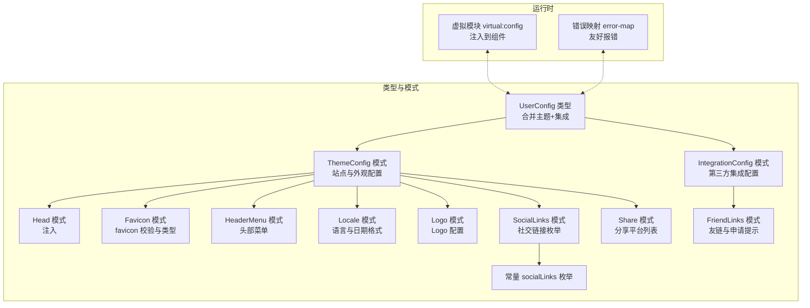
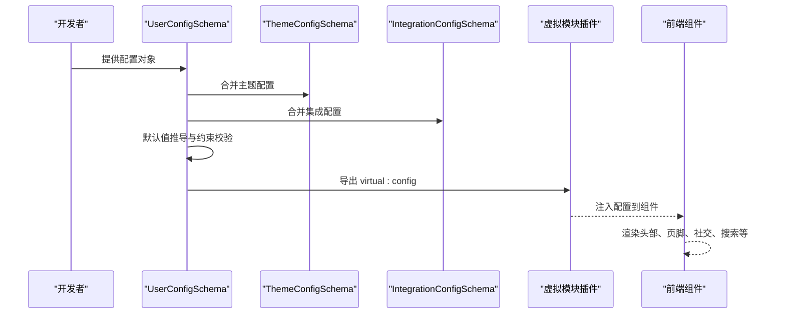
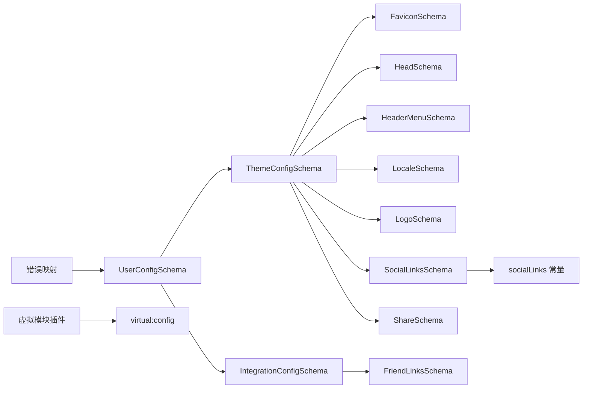
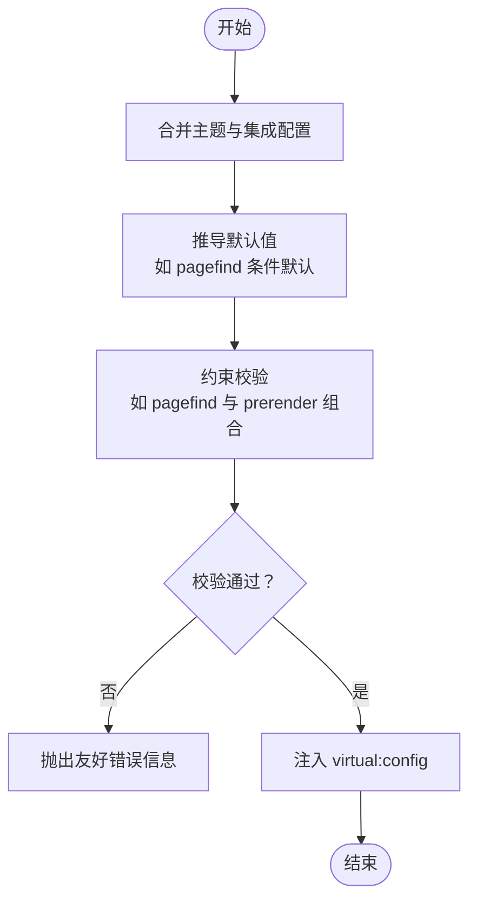

# 配置API

<cite>
**本文引用的文件**
- [packages/pure/types/user-config.ts](file://packages/pure/types/user-config.ts)
- [packages/pure/types/theme-config.ts](file://packages/pure/types/theme-config.ts)
- [packages/pure/types/integrations-config.ts](file://packages/pure/types/integrations-config.ts)
- [packages/pure/schemas/head.ts](file://packages/pure/schemas/head.ts)
- [packages/pure/schemas/favicon.ts](file://packages/pure/schemas/favicon.ts)
- [packages/pure/schemas/header.ts](file://packages/pure/schemas/header.ts)
- [packages/pure/schemas/locale.ts](file://packages/pure/schemas/locale.ts)
- [packages/pure/schemas/logo.ts](file://packages/pure/schemas/logo.ts)
- [packages/pure/schemas/share.ts](file://packages/pure/schemas/share.ts)
- [packages/pure/schemas/social.ts](file://packages/pure/schemas/social.ts)
- [packages/pure/schemas/links.ts](file://packages/pure/schemas/links.ts)
- [packages/pure/types/constants.ts](file://packages/pure/types/constants.ts)
- [packages/pure/plugins/virtual-user-config.ts](file://packages/pure/plugins/virtual-user-config.ts)
- [packages/pure/utils/error-map.ts](file://packages/pure/utils/error-map.ts)
- [packages/pure/components/basic/Footer.astro](file://packages/pure/components/basic/Footer.astro)
</cite>

## 目录
1. [简介](#简介)
2. [项目结构](#项目结构)
3. [核心组件](#核心组件)
4. [架构总览](#架构总览)
5. [详细组件分析](#详细组件分析)
6. [依赖关系分析](#依赖关系分析)
7. [性能考量](#性能考量)
8. [故障排查指南](#故障排查指南)
9. [结论](#结论)
10. [附录](#附录)

## 简介
本文件系统性梳理主题配置API，覆盖用户配置(UserConfig)、主题配置(ThemeUserConfig)与集成配置(IntegrationUserConfig)的完整参数说明，包括字段类型、默认值与典型使用场景；并给出站点配置（标题、描述、社交链接、favicon等）、主题配置（颜色方案、字体、布局等）与集成配置（评论系统、搜索、分析工具等第三方服务）的配置要点、示例与最佳实践，以及配置校验规则与错误处理指南。

## 项目结构
配置API由“类型定义 + 模式(schema) + 虚拟模块注入 + 错误映射”构成：
- 类型定义层：导出用户可直接使用的配置类型与输入类型，统一收敛为 UserConfig。
- 模式层：以 Zod Schema 组合各子配置（主题、集成、头标签、favicon、语言、Logo、社交、分享、友链等），提供强类型校验与默认值。
- 运行时注入：通过虚拟模块将最终配置暴露给前端组件使用。
- 错误映射：对 Zod 校验失败进行友好提示，便于定位问题。

图表来源
- [packages/pure/types/user-config.ts](file://packages/pure/types/user-config.ts#L6-L20)
- [packages/pure/types/theme-config.ts](file://packages/pure/types/theme-config.ts#L11-L189)
- [packages/pure/types/integrations-config.ts](file://packages/pure/types/integrations-config.ts#L5-L62)
- [packages/pure/schemas/head.ts](file://packages/pure/schemas/head.ts#L3-L15)
- [packages/pure/schemas/favicon.ts](file://packages/pure/schemas/favicon.ts#L13-L35)
- [packages/pure/schemas/header.ts](file://packages/pure/schemas/header.ts#L3-L17)
- [packages/pure/schemas/locale.ts](file://packages/pure/schemas/locale.ts#L3-L27)
- [packages/pure/schemas/logo.ts](file://packages/pure/schemas/logo.ts#L3-L9)
- [packages/pure/schemas/social.ts](file://packages/pure/schemas/social.ts#L5-L44)
- [packages/pure/schemas/share.ts](file://packages/pure/schemas/share.ts#L5-L9)
- [packages/pure/schemas/links.ts](file://packages/pure/schemas/links.ts#L3-L29)
- [packages/pure/types/constants.ts](file://packages/pure/types/constants.ts#L1-L21)
- [packages/pure/plugins/virtual-user-config.ts](file://packages/pure/plugins/virtual-user-config.ts#L61-L79)
- [packages/pure/utils/error-map.ts](file://packages/pure/utils/error-map.ts#L23-L56)

章节来源
- [packages/pure/types/user-config.ts](file://packages/pure/types/user-config.ts#L1-L27)
- [packages/pure/types/theme-config.ts](file://packages/pure/types/theme-config.ts#L1-L193)
- [packages/pure/types/integrations-config.ts](file://packages/pure/types/integrations-config.ts#L1-L66)
- [packages/pure/plugins/virtual-user-config.ts](file://packages/pure/plugins/virtual-user-config.ts#L1-L100)

## 核心组件
- UserConfig：最终用户配置入口，合并主题配置与集成配置，并在解析阶段进行默认值推导与约束校验。
- ThemeUserConfig：主题相关配置集合，涵盖站点元信息、外观、国际化、头部注入、自定义样式、标题分隔符、预渲染策略、npmCDN、页眉菜单、页脚内容与社交、内容分页与分享等。
- IntegrationUserConfig：集成相关配置集合，涵盖友链、搜索(Pagefind)、随机语录、UnoCSS排版风格、MediumZoom缩放、Waline评论系统等。

章节来源
- [packages/pure/types/user-config.ts](file://packages/pure/types/user-config.ts#L6-L27)
- [packages/pure/types/theme-config.ts](file://packages/pure/types/theme-config.ts#L11-L193)
- [packages/pure/types/integrations-config.ts](file://packages/pure/types/integrations-config.ts#L5-L66)

## 架构总览
下图展示从配置定义到运行时注入的关键流程：

图表来源
- [packages/pure/types/user-config.ts](file://packages/pure/types/user-config.ts#L6-L27)
- [packages/pure/plugins/virtual-user-config.ts](file://packages/pure/plugins/virtual-user-config.ts#L61-L79)

## 详细组件分析

### 用户配置(UserConfig)
- 定义来源：主题配置与集成配置的严格合并，并在 transform 中对 pagefind 做条件默认值推导；随后通过 refine 对 pagefind 与 prerender 的组合进行约束。
- 关键行为
  - pagefind 默认值：若未显式设置且 prerender 为真，则默认启用；否则保持未设置或显式关闭。
  - 约束：当 pagefind 为真而 prerender 为假时，抛出错误提示不支持。
- 典型用途：作为最终配置入口，供虚拟模块注入到组件使用。

章节来源
- [packages/pure/types/user-config.ts](file://packages/pure/types/user-config.ts#L6-L27)

### 主题配置(ThemeUserConfig)
- 字段概览与默认值
  - title: 字符串，用于元数据与浏览器标签页标题。
  - author: 字符串，首页与版权声明使用。
  - description: 字符串，默认值用于站点描述元数据。
  - favicon: 字符串，路径指向 public/ 下图片，经 favicon 模式校验并转换为 {href,type} 结构。
  - socialCard: 字符串，默认指向 /images/social-card.png。
  - logo: 对象，包含 src 与可选 alt。
  - tagline: 可选字符串，站点标语。
  - locale: 对象，包含 lang、attrs、dateLocale、dateOptions。
  - head: 数组，元素为 {tag, attrs, content}，用于向 <head> 注入标签。
  - customCss: 字符串数组，默认空数组。
  - titleDelimiter: 字符串，默认“•”，用于生成 <title> 标签的分隔符。
  - prerender: 布尔，默认开启。
  - npmCDN: 字符串，默认 esm.sh。
  - header.menu: 数组，默认包含 Blog、Projects、Links、About。
  - footer.year: 字符串，页脚年份。
  - footer.links: 数组，元素含 title/link/style/pos，pos 控制位置。
  - footer.credits: 布尔，默认开启。
  - footer.social: 社交链接记录，枚举来自 socialLinks 常量，URL 必须合法。
  - content.externalLinks: 对象，包含 content 与 properties。
  - content.blogPageSize: 数字，默认8。
  - content.share: 分享平台列表，默认包含 bluesky。

- 使用场景
  - 站点元信息与品牌：title、author、description、logo、favicon、socialCard。
  - 外观与国际化：customCss、locale、titleDelimiter。
  - 结构与导航：header.menu、footer.links、footer.social。
  - 内容与分享：content.blogPageSize、content.share、content.externalLinks。
  - 性能与加载：prerender、npmCDN。

章节来源
- [packages/pure/types/theme-config.ts](file://packages/pure/types/theme-config.ts#L11-L189)
- [packages/pure/schemas/favicon.ts](file://packages/pure/schemas/favicon.ts#L13-L35)
- [packages/pure/schemas/logo.ts](file://packages/pure/schemas/logo.ts#L3-L9)
- [packages/pure/schemas/locale.ts](file://packages/pure/schemas/locale.ts#L3-L27)
- [packages/pure/schemas/head.ts](file://packages/pure/schemas/head.ts#L3-L15)
- [packages/pure/schemas/header.ts](file://packages/pure/schemas/header.ts#L3-L17)
- [packages/pure/schemas/social.ts](file://packages/pure/schemas/social.ts#L5-L44)
- [packages/pure/schemas/share.ts](file://packages/pure/schemas/share.ts#L5-L9)
- [packages/pure/types/constants.ts](file://packages/pure/types/constants.ts#L1-L21)

### 集成配置(IntegrationUserConfig)
- 字段概览与默认值
  - links.logbook: 数组，元素含 date 与 content。
  - links.applyTip: 数组，元素含 name 与 val，包含默认占位项。
  - links.cacheAvatar: 布尔，默认关闭。
  - pagefind: 布尔，可选；若未设置且 prerender 为真则自动启用。
  - quote.server: 字符串，必填；quote.target: 字符串，必填。
  - typography.class: 字符串，默认 UnoCSS 排版类名集合。
  - typography.blockquoteStyle: 枚举 normal/italic，默认 italic。
  - typography.inlineCodeBlockStyle: 枚举 code/modern，默认 modern。
  - mediumZoom.enable: 布尔，默认开启；selector 默认选择器；options 默认传递 className: 'zoomable'。
  - waline.enable: 布尔，默认关闭；waline.server 可选；showMeta 默认开启；emoji 可选数组；additionalConfigs 默认空对象。

- 使用场景
  - 友链与申请提示：links.* 用于展示与交互。
  - 搜索：pagefind 控制是否启用 Pagefind 搜索。
  - 随机语录：quote.server 与 target 配置后端接口与替换目标。
  - 排版风格：typography.* 控制文章排版样式。
  - 缩放：mediumZoom 为图片添加缩放效果。
  - 评论：waline.* 配置 Waline 评论系统。

章节来源
- [packages/pure/types/integrations-config.ts](file://packages/pure/types/integrations-config.ts#L5-L62)
- [packages/pure/schemas/links.ts](file://packages/pure/schemas/links.ts#L3-L29)

### 子模式与常量
- favicon 模式
  - 支持扩展名：.ico、.gif、.jpg/.jpeg、.png、.svg。
  - 自动推断 MIME 类型并返回 {href,type} 结构。
- 社交链接枚举
  - 常量 socialLinks 包含 github、gitlab、discord、youtube、instagram、x、telegram、rss、email、reddit、bluesky、tiktok、weibo、steam、bilibili、zhihu、coolapk、netease。
  - 社交链接模式会将传入的简写映射为带 label 的结构，便于组件渲染。
- 头部注入(head)
  - 支持 title/base/link/style/meta/script/noscript/template 标签，attrs 为键值对，content 为标签内文本。
- 语言(locale)
  - lang/attrs/dateLocale 默认 US；dateOptions 支持多种 Intl.DateTimeFormat 选项。
- Logo
  - src 必填，alt 可选默认空字符串。
- 分享平台
  - shareList 限定为 weibo、x、bluesky。
- 友链
  - logbook 与 applyTip 的结构化数组；cacheAvatar 控制头像缓存。

章节来源
- [packages/pure/schemas/favicon.ts](file://packages/pure/schemas/favicon.ts#L4-L42)
- [packages/pure/schemas/social.ts](file://packages/pure/schemas/social.ts#L5-L44)
- [packages/pure/types/constants.ts](file://packages/pure/types/constants.ts#L1-L21)
- [packages/pure/schemas/head.ts](file://packages/pure/schemas/head.ts#L3-L15)
- [packages/pure/schemas/locale.ts](file://packages/pure/schemas/locale.ts#L3-L27)
- [packages/pure/schemas/logo.ts](file://packages/pure/schemas/logo.ts#L3-L9)
- [packages/pure/schemas/share.ts](file://packages/pure/schemas/share.ts#L3-L9)
- [packages/pure/schemas/links.ts](file://packages/pure/schemas/links.ts#L3-L29)

### 运行时注入与组件使用
- 虚拟模块
  - virtual:config：导出最终配置对象，供组件 import 使用。
  - virtual:user-css：按 customCss 列表动态导入用户自定义样式。
  - virtual:project-context：导出构建格式、集合模式、根目录、源码目录、尾斜杠策略等上下文。
- 组件示例
  - 页脚组件会读取 config.footer.social 并在缺少 RSS 时自动补全默认 RSS 链接。

章节来源
- [packages/pure/plugins/virtual-user-config.ts](file://packages/pure/plugins/virtual-user-config.ts#L61-L79)
- [packages/pure/components/basic/Footer.astro](file://packages/pure/components/basic/Footer.astro#L1-L59)

## 依赖关系分析
- 组合关系
  - UserConfigSchema 由 ThemeConfigSchema 与 IntegrationConfigSchema 合并而成。
  - ThemeConfigSchema 依赖多个子模式：favicon、head、header、locale、logo、social、share。
  - IntegrationConfigSchema 依赖 friend links 模式。
- 运行时耦合
  - 虚拟模块插件将最终配置注入到组件，组件通过 import 'virtual:config' 使用。
- 错误映射
  - 通过 parseWithFriendlyErrors/parseAsyncWithFriendlyErrors 将 Zod 校验错误转化为可读消息。

图表来源
- [packages/pure/types/user-config.ts](file://packages/pure/types/user-config.ts#L6-L12)
- [packages/pure/types/theme-config.ts](file://packages/pure/types/theme-config.ts#L3-L9)
- [packages/pure/types/integrations-config.ts](file://packages/pure/types/integrations-config.ts#L3)
- [packages/pure/plugins/virtual-user-config.ts](file://packages/pure/plugins/virtual-user-config.ts#L61-L79)
- [packages/pure/utils/error-map.ts](file://packages/pure/utils/error-map.ts#L23-L56)

章节来源
- [packages/pure/types/user-config.ts](file://packages/pure/types/user-config.ts#L6-L12)
- [packages/pure/types/theme-config.ts](file://packages/pure/types/theme-config.ts#L3-L9)
- [packages/pure/types/integrations-config.ts](file://packages/pure/types/integrations-config.ts#L3)
- [packages/pure/plugins/virtual-user-config.ts](file://packages/pure/plugins/virtual-user-config.ts#L61-L79)
- [packages/pure/utils/error-map.ts](file://packages/pure/utils/error-map.ts#L23-L56)

## 性能考量
- 预渲染(prerender)：默认开启，有助于 SEO 与首屏性能；若关闭，Pagefind 搜索将被禁用。
- npmCDN：默认使用 esm.sh，可根据网络情况调整以优化依赖加载速度。
- customCss：仅引入必要样式文件，避免冗余导致的打包体积增大。
- mediumZoom：默认启用但可通过 options 调整，避免对所有图片生效造成性能压力。
- waline：默认关闭，启用时注意服务端可用性与加载时机。

## 故障排查指南
- 常见错误与定位
  - Pagefind 与 prerender 组合：当 pagefind 为真而 prerender 为假时，会抛出不支持的错误。请确保 prerender 为真或显式关闭 pagefind。
  - favicon 扩展名：仅允许 .ico、.gif、.jpg/.jpeg、.png、.svg，否则校验失败。
  - 社交链接 URL：必须为合法 URL，否则校验失败。
  - 自定义 head 标签：tag 必须为受支持的枚举值，attrs 与 content 类型需匹配。
- 友好错误输出
  - 使用 parseWithFriendlyErrors/parseAsyncWithFriendlyErrors 对 Zod 校验结果进行格式化，错误信息包含字段路径与期望/实际类型，便于快速修复。

章节来源
- [packages/pure/types/user-config.ts](file://packages/pure/types/user-config.ts#L21-L23)
- [packages/pure/schemas/favicon.ts](file://packages/pure/schemas/favicon.ts#L17-L35)
- [packages/pure/schemas/social.ts](file://packages/pure/schemas/social.ts#L10-L12)
- [packages/pure/schemas/head.ts](file://packages/pure/schemas/head.ts#L8-L12)
- [packages/pure/utils/error-map.ts](file://packages/pure/utils/error-map.ts#L23-L56)

## 结论
该配置API通过 Zod 模式与类型定义实现强约束与高可维护性，结合虚拟模块注入与友好错误映射，使主题与集成配置既灵活又安全。遵循本文档的参数说明、默认值与最佳实践，可快速搭建高质量的站点配置体系。

## 附录

### 配置参数速查表
- 站点与品牌
  - title: 字符串，元数据与标签页标题
  - author: 字符串，首页与版权
  - description: 字符串，默认 Built with Astro-Pure
  - favicon: 字符串，public 下路径，经校验转为 {href,type}
  - socialCard: 字符串，默认 /images/social-card.png
  - logo: 对象，src 必填，alt 可选
  - tagline: 可选字符串
- 国际化与外观
  - locale.lang: 字符串，默认 en-US
  - locale.attrs: 字符串，默认 en_US
  - locale.dateLocale: 字符串，默认 en-US
  - locale.dateOptions: 对象，支持多种 Intl 选项
  - head: 数组，元素为 {tag, attrs, content}
  - customCss: 字符串数组，默认 []
  - titleDelimiter: 字符串，默认 “•”
  - prerender: 布尔，默认 true
  - npmCDN: 字符串，默认 https://esm.sh
- 导航与页脚
  - header.menu: 数组，默认包含 Blog/Projects/Links/About
  - footer.year: 字符串
  - footer.links: 数组，元素含 title/link/style/pos
  - footer.credits: 布尔，默认 true
  - footer.social: 记录，键为 socialLinks 枚举，值为 URL
- 内容与分享
  - content.externalLinks.content: 字符串，默认 “ ↗”
  - content.externalLinks.properties: 记录，默认 {}
  - content.blogPageSize: 数字，默认 8
  - content.share: 数组，默认包含 bluesky
- 集成
  - links.logbook: 数组，元素含 date 与 content
  - links.applyTip: 数组，元素含 name 与 val
  - links.cacheAvatar: 布尔，默认 false
  - pagefind: 布尔，可选；未设置且 prerender 为真时默认启用
  - quote.server: 字符串
  - quote.target: 字符串
  - typography.class: 字符串，默认 UnoCSS 排版类
  - typography.blockquoteStyle: 枚举 normal/italic，默认 italic
  - typography.inlineCodeBlockStyle: 枚举 code/modern，默认 modern
  - mediumZoom.enable: 布尔，默认 true
  - mediumZoom.selector: 字符串，默认 .prose .zoomable
  - mediumZoom.options: 记录，默认 { className: 'zoomable' }
  - waline.enable: 布尔，默认 false
  - waline.server: 字符串，可选
  - waline.showMeta: 布尔，默认 true
  - waline.emoji: 字符串数组，可选
  - waline.additionalConfigs: 记录，默认 {}

### 配置示例与最佳实践
- 示例路径
  - 站点基础配置：参考 [packages/pure/types/theme-config.ts](file://packages/pure/types/theme-config.ts#L13-L36)
  - 自定义 head 注入：参考 [packages/pure/schemas/head.ts](file://packages/pure/schemas/head.ts#L8-L12)
  - favicon 校验与类型：参考 [packages/pure/schemas/favicon.ts](file://packages/pure/schemas/favicon.ts#L17-L35)
  - 社交链接枚举与映射：参考 [packages/pure/schemas/social.ts](file://packages/pure/schemas/social.ts#L14-L43) 与 [packages/pure/types/constants.ts](file://packages/pure/types/constants.ts#L1-L21)
  - 友链与申请提示：参考 [packages/pure/schemas/links.ts](file://packages/pure/schemas/links.ts#L6-L28)
  - 集成配置（搜索/评论/缩放）：参考 [packages/pure/types/integrations-config.ts](file://packages/pure/types/integrations-config.ts#L14-L61)
- 最佳实践
  - favicon 优先使用 SVG 或 PNG，确保多终端兼容。
  - prerender 保持开启以获得更好 SEO；如关闭，请显式禁用 pagefind。
  - customCss 仅引入必要样式，避免阻塞渲染。
  - waline 与 mediumZoom 按需启用，关注第三方服务可用性与性能影响。

### 配置验证流程

图表来源
- [packages/pure/types/user-config.ts](file://packages/pure/types/user-config.ts#L13-L23)
- [packages/pure/utils/error-map.ts](file://packages/pure/utils/error-map.ts#L23-L56)
- [packages/pure/plugins/virtual-user-config.ts](file://packages/pure/plugins/virtual-user-config.ts#L61-L79)