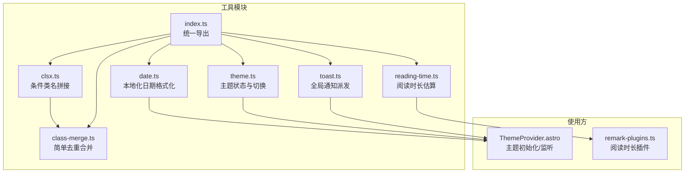
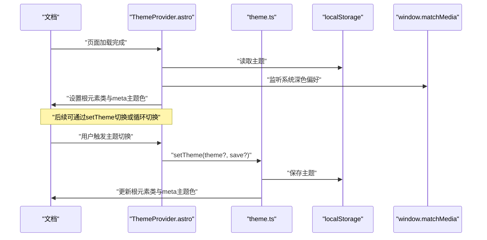
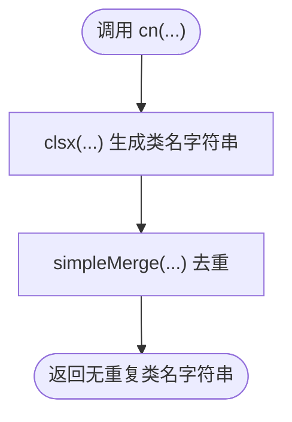
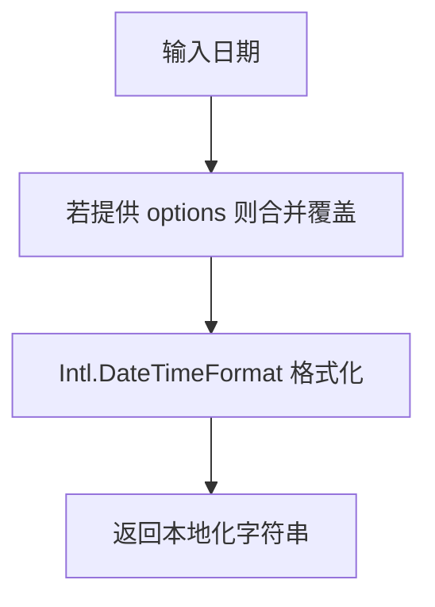
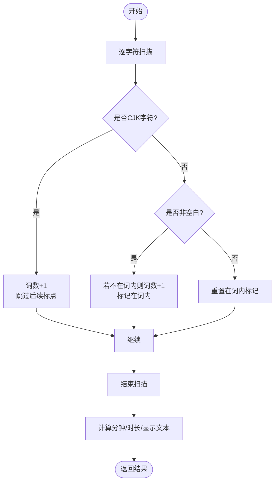
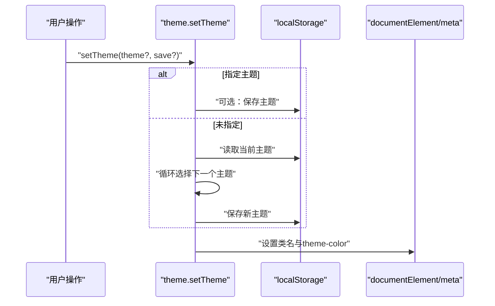
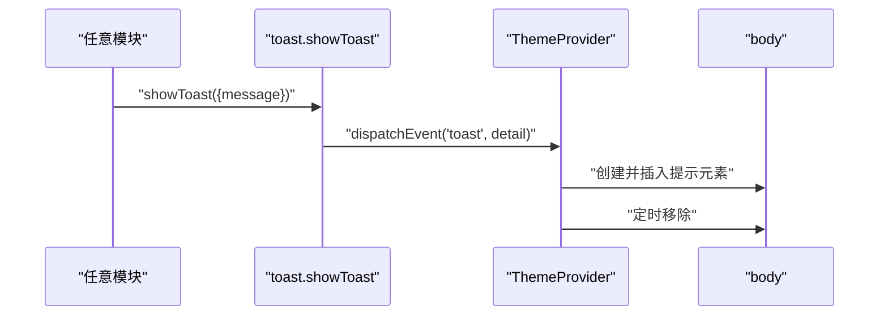
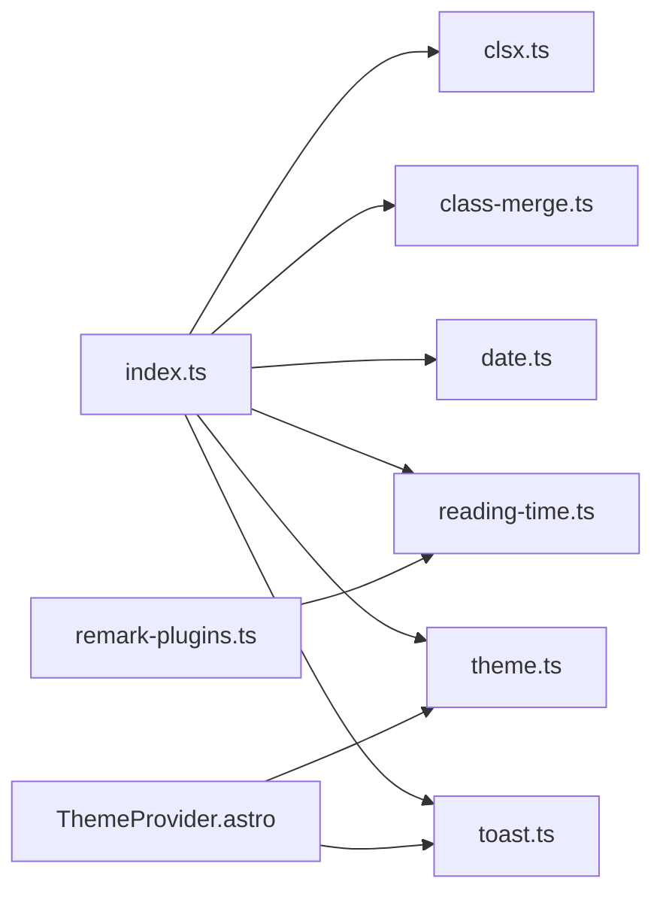

# 主题工具库

<cite>
**本文引用的文件**
- [packages/pure/utils/class-merge.ts](file://packages/pure/utils/class-merge.ts)
- [packages/pure/utils/clsx.ts](file://packages/pure/utils/clsx.ts)
- [packages/pure/utils/date.ts](file://packages/pure/utils/date.ts)
- [packages/pure/utils/reading-time.ts](file://packages/pure/utils/reading-time.ts)
- [packages/pure/utils/theme.ts](file://packages/pure/utils/theme.ts)
- [packages/pure/utils/toast.ts](file://packages/pure/utils/toast.ts)
- [packages/pure/utils/index.ts](file://packages/pure/utils/index.ts)
- [packages/pure/components/basic/ThemeProvider.astro](file://packages/pure/components/basic/ThemeProvider.astro)
- [packages/pure/plugins/remark-plugins.ts](file://packages/pure/plugins/remark-plugins.ts)
</cite>

## 目录
1. [简介](#简介)
2. [项目结构](#项目结构)
3. [核心组件](#核心组件)
4. [架构总览](#架构总览)
5. [详细组件分析](#详细组件分析)
6. [依赖关系分析](#依赖关系分析)
7. [性能考量](#性能考量)
8. [故障排查指南](#故障排查指南)
9. [结论](#结论)
10. [附录](#附录)

## 简介
本文件系统性梳理主题工具库中六个高频实用工具：class-merge（cn）、clsx、date、reading-time、theme、toast。内容覆盖功能定义、API 参考、使用示例、性能与组合实践，帮助开发者在 Astro/Pure 主题中高效、稳定地构建一致的样式、日期、阅读时长、主题与通知体验。

## 项目结构
工具集中于 packages/pure/utils，通过统一导出入口对外暴露；部分工具在组件中被消费，如 ThemeProvider 组件监听主题变更与 toast 事件。

图表来源
- [packages/pure/utils/class-merge.ts](file://packages/pure/utils/class-merge.ts#L1-L20)
- [packages/pure/utils/clsx.ts](file://packages/pure/utils/clsx.ts#L1-L25)
- [packages/pure/utils/date.ts](file://packages/pure/utils/date.ts#L1-L18)
- [packages/pure/utils/reading-time.ts](file://packages/pure/utils/reading-time.ts#L1-L77)
- [packages/pure/utils/theme.ts](file://packages/pure/utils/theme.ts#L1-L41)
- [packages/pure/utils/toast.ts](file://packages/pure/utils/toast.ts#L1-L4)
- [packages/pure/utils/index.ts](file://packages/pure/utils/index.ts#L1-L18)
- [packages/pure/components/basic/ThemeProvider.astro](file://packages/pure/components/basic/ThemeProvider.astro#L1-L41)
- [packages/pure/plugins/remark-plugins.ts](file://packages/pure/plugins/remark-plugins.ts#L1-L10)

章节来源
- [packages/pure/utils/index.ts](file://packages/pure/utils/index.ts#L1-L18)

## 核心组件
- class-merge（cn）：在 clsx 条件类名拼接基础上，对最终字符串进行空格分隔后的去重合并，避免重复类名影响样式与可读性。
- clsx：递归处理多种输入类型（字符串、数字、数组、对象），仅在值为真值时保留键名作为类名，支持嵌套数组与字典式布尔开关。
- date：基于虚拟配置中的 locale 与 dateOptions，提供本地化日期格式化能力，支持按需覆盖选项。
- reading-time：面向中英文混合文本的阅读时长估算，内置 CJK 字符识别与标点跳过逻辑，输出分钟数、显示文本与毫秒级时长。
- theme：封装主题持久化、系统偏好监听、DOM 切换与 meta 主题色更新，支持“system/dark/light”循环切换。
- toast：通过自定义事件向全局派发消息，由主题 Provider 统一接收并渲染临时提示。

章节来源
- [packages/pure/utils/class-merge.ts](file://packages/pure/utils/class-merge.ts#L1-L20)
- [packages/pure/utils/clsx.ts](file://packages/pure/utils/clsx.ts#L1-L25)
- [packages/pure/utils/date.ts](file://packages/pure/utils/date.ts#L1-L18)
- [packages/pure/utils/reading-time.ts](file://packages/pure/utils/reading-time.ts#L1-L77)
- [packages/pure/utils/theme.ts](file://packages/pure/utils/theme.ts#L1-L41)
- [packages/pure/utils/toast.ts](file://packages/pure/utils/toast.ts#L1-L4)

## 架构总览
以下序列图展示主题 Provider 在页面加载时的初始化流程，以及主题切换与通知事件的联动。

图表来源
- [packages/pure/components/basic/ThemeProvider.astro](file://packages/pure/components/basic/ThemeProvider.astro#L1-L41)
- [packages/pure/utils/theme.ts](file://packages/pure/utils/theme.ts#L1-L41)

## 详细组件分析

### class-merge 与 clsx：CSS 类名合并与性能优势
- 功能定位
  - clsx：将多种输入类型（字符串、数字、数组、对象）转换为类名字符串，对象键名为类名，仅当值为真时生效。
  - simpleMerge：对空格分隔的类名进行去重，保证最终字符串不包含重复类名。
  - cn：先通过 clsx 拼接，再经 simpleMerge 去重，兼顾可读性与性能。
- 性能优势
  - 减少重复类名带来的样式解析与渲染开销。
  - 对数组与对象的递归处理，避免手动拼接字符串的分支判断成本。
- 使用建议
  - 在组件层优先使用 cn，以获得稳定的类名集合。
  - 将条件类名集中在对象中，便于维护与测试。
- API 参考
  - clsx(...inputs: ClassValue[]): string
  - cn(...inputs: ClassValue[]): string
- 示例路径
  - [packages/pure/utils/clsx.ts](file://packages/pure/utils/clsx.ts#L1-L25)
  - [packages/pure/utils/class-merge.ts](file://packages/pure/utils/class-merge.ts#L1-L20)

图表来源
- [packages/pure/utils/clsx.ts](file://packages/pure/utils/clsx.ts#L5-L22)
- [packages/pure/utils/class-merge.ts](file://packages/pure/utils/class-merge.ts#L3-L19)

章节来源
- [packages/pure/utils/clsx.ts](file://packages/pure/utils/clsx.ts#L1-L25)
- [packages/pure/utils/class-merge.ts](file://packages/pure/utils/class-merge.ts#L1-L20)

### date：时间格式化与日期计算
- 能力概述
  - 基于虚拟配置中的 locale 与 dateOptions，提供本地化日期格式化。
  - 支持按需传入 options 覆盖默认格式。
- API 参考
  - getFormattedDate(date: string | number | Date, options?: Intl.DateTimeFormatOptions): string
- 使用建议
  - 在需要多语言展示的场景下，确保配置 locale 与 dateOptions 合理。
  - 对外部传入的日期参数做边界检查，避免无效日期导致的异常。
- 示例路径
  - [packages/pure/utils/date.ts](file://packages/pure/utils/date.ts#L1-L18)

图表来源
- [packages/pure/utils/date.ts](file://packages/pure/utils/date.ts#L3-L17)

章节来源
- [packages/pure/utils/date.ts](file://packages/pure/utils/date.ts#L1-L18)

### reading-time：阅读时间估算算法
- 算法要点
  - CJK 字符按单字计词，跳过其后标点，避免重复计数。
  - 英文按空白分词，遇到非空白字符进入单词标记，遇空白重置。
  - 默认每分钟 200 词，支持自定义 wpm。
  - 输出包含显示文本（分钟）、分钟数、毫秒级时长与总词数。
- API 参考
  - getReadingTime(text: string, wordsPerMinute?: number): ReadingTimeResult
- 使用建议
  - 在内容渲染前或预处理阶段调用，减少运行时重复计算。
  - 对超长文本可考虑缓存结果或分段统计。
- 示例路径
  - [packages/pure/utils/reading-time.ts](file://packages/pure/utils/reading-time.ts#L1-L77)

图表来源
- [packages/pure/utils/reading-time.ts](file://packages/pure/utils/reading-time.ts#L39-L73)

章节来源
- [packages/pure/utils/reading-time.ts](file://packages/pure/utils/reading-time.ts#L1-L77)

### theme：主题状态管理与切换机制
- 能力概述
  - getTheme：从 localStorage 读取当前主题。
  - listenThemeChange：监听系统深色偏好变化，自动同步到目标主题。
  - setTheme：设置主题，支持 save 参数持久化；未指定时在 ["system","dark","light"] 中循环切换；当选择 "system" 时动态跟随系统并注册监听。
  - 更新根元素类名与 meta[name="theme-color"]，实现视觉与浏览器主题色联动。
- API 参考
  - getTheme(): string | null
  - listenThemeChange(theme?: string): void
  - setTheme(theme?: string, save?: boolean): string
- 使用建议
  - 首屏通过 ThemeProvider.astro 内联脚本快速设置，避免闪烁。
  - 用户切换时建议 save=true，持久化用户选择。
- 示例路径
  - [packages/pure/utils/theme.ts](file://packages/pure/utils/theme.ts#L1-L41)
  - [packages/pure/components/basic/ThemeProvider.astro](file://packages/pure/components/basic/ThemeProvider.astro#L1-L41)

图表来源
- [packages/pure/utils/theme.ts](file://packages/pure/utils/theme.ts#L12-L40)

章节来源
- [packages/pure/utils/theme.ts](file://packages/pure/utils/theme.ts#L1-L41)
- [packages/pure/components/basic/ThemeProvider.astro](file://packages/pure/components/basic/ThemeProvider.astro#L1-L41)

### toast：通知系统与用户反馈
- 能力概述
  - showToast：通过自定义事件 "toast" 派发消息详情。
  - ThemeProvider 监听该事件，动态创建并渲染提示气泡，支持自动移除。
- API 参考
  - showToast(detail: { message: string }): void
- 使用建议
  - 重要提示建议较长停留时间，普通提示默认约 3 秒。
  - 避免短时间内大量弹窗，必要时做节流或队列管理。
- 示例路径
  - [packages/pure/utils/toast.ts](file://packages/pure/utils/toast.ts#L1-L4)
  - [packages/pure/components/basic/ThemeProvider.astro](file://packages/pure/components/basic/ThemeProvider.astro#L28-L40)

图表来源
- [packages/pure/utils/toast.ts](file://packages/pure/utils/toast.ts#L1-L4)
- [packages/pure/components/basic/ThemeProvider.astro](file://packages/pure/components/basic/ThemeProvider.astro#L28-L40)

章节来源
- [packages/pure/utils/toast.ts](file://packages/pure/utils/toast.ts#L1-L4)
- [packages/pure/components/basic/ThemeProvider.astro](file://packages/pure/components/basic/ThemeProvider.astro#L1-L41)

## 依赖关系分析
- 导出聚合：index.ts 将各工具统一导出，便于集中引入与版本管理。
- 组件耦合：ThemeProvider 依赖 theme 与 toast 工具，负责首屏渲染与事件监听。
- 插件集成：remark-plugins.ts 引入 reading-time，用于内容侧的阅读时长统计。

图表来源
- [packages/pure/utils/index.ts](file://packages/pure/utils/index.ts#L1-L18)
- [packages/pure/components/basic/ThemeProvider.astro](file://packages/pure/components/basic/ThemeProvider.astro#L24-L29)
- [packages/pure/plugins/remark-plugins.ts](file://packages/pure/plugins/remark-plugins.ts#L1-L10)

章节来源
- [packages/pure/utils/index.ts](file://packages/pure/utils/index.ts#L1-L18)
- [packages/pure/components/basic/ThemeProvider.astro](file://packages/pure/components/basic/ThemeProvider.astro#L1-L41)
- [packages/pure/plugins/remark-plugins.ts](file://packages/pure/plugins/remark-plugins.ts#L1-L10)

## 性能考量
- class-merge
  - 去重采用 Set，时间复杂度 O(n)，适合大多数组件场景。
  - 建议在组件外层计算好条件映射，减少重复调用。
- clsx
  - 递归处理对象与数组，注意避免深层嵌套与超大数组导致的开销。
- date
  - 格式化依赖 Intl，首次创建 DateTimeFormat 有轻微成本，建议复用实例或在服务端预处理。
- reading-time
  - 单次线性扫描，时间复杂度 O(n)；对超长文本可考虑分段或缓存。
- theme
  - 首屏内联设置避免闪烁；系统偏好监听仅在需要时启用。
- toast
  - DOM 创建与移除为轻量操作；批量触发时建议节流。

## 故障排查指南
- 主题未生效
  - 检查 localStorage 是否正确写入；确认 setTheme 返回值与预期一致。
  - 首屏是否执行了内联初始化逻辑。
- 系统主题切换不响应
  - 确认 listenThemeChange 已被调用且未被覆盖。
- 通知不出现
  - 确认 ThemeProvider 已监听 "toast" 事件；检查消息内容与时间参数。
- 日期格式异常
  - 检查虚拟配置中的 locale 与 dateOptions；确认传入日期类型有效。

章节来源
- [packages/pure/utils/theme.ts](file://packages/pure/utils/theme.ts#L1-L41)
- [packages/pure/components/basic/ThemeProvider.astro](file://packages/pure/components/basic/ThemeProvider.astro#L1-L41)
- [packages/pure/utils/toast.ts](file://packages/pure/utils/toast.ts#L1-L4)
- [packages/pure/utils/date.ts](file://packages/pure/utils/date.ts#L1-L18)

## 结论
本工具库围绕样式、日期、阅读时长、主题与通知五大维度提供了简洁、稳健的实现。通过 cn 与 clsx 的配合，确保类名质量；通过 theme 与 ThemeProvider 的协作，实现平滑的主题体验；通过 toast 提供一致的用户反馈；reading-time 与 date 则完善内容侧的辅助信息。建议在项目中遵循统一导出入口与组件化使用方式，结合性能与故障排查建议，获得更佳的开发与用户体验。

## 附录
- 统一导出入口
  - [packages/pure/utils/index.ts](file://packages/pure/utils/index.ts#L1-L18)
- 主题 Provider 实现
  - [packages/pure/components/basic/ThemeProvider.astro](file://packages/pure/components/basic/ThemeProvider.astro#L1-L41)
- 阅读时长插件示例
  - [packages/pure/plugins/remark-plugins.ts](file://packages/pure/plugins/remark-plugins.ts#L1-L10)