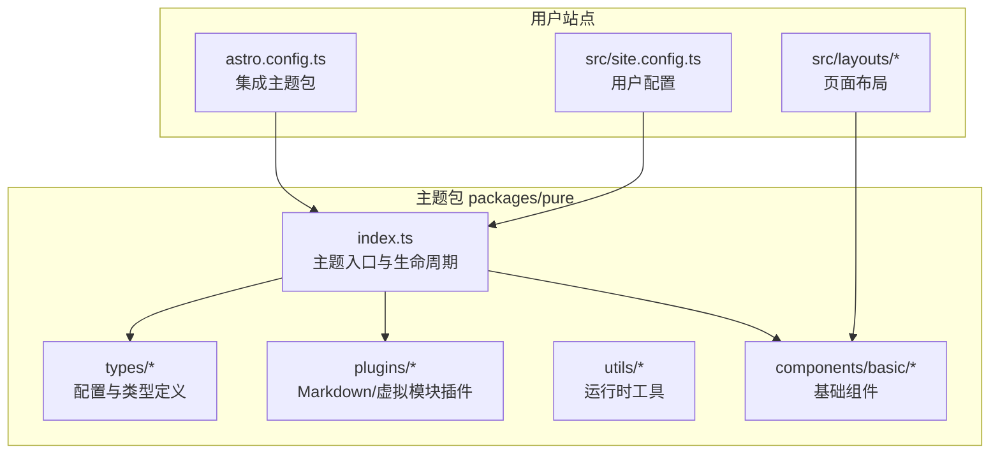
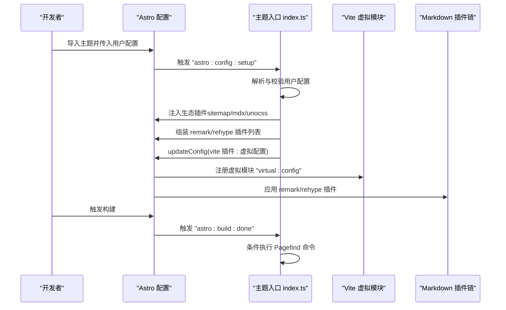
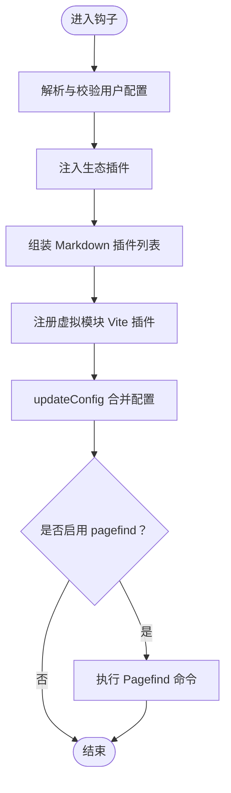
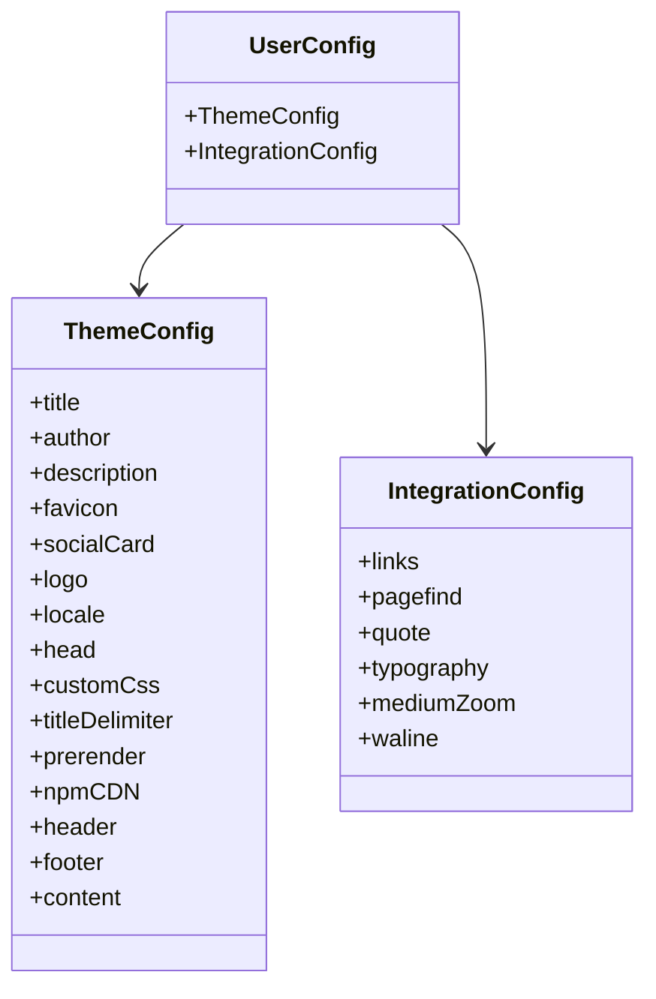
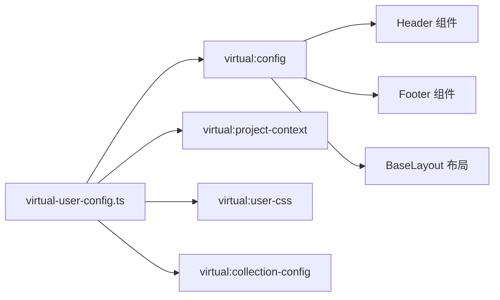
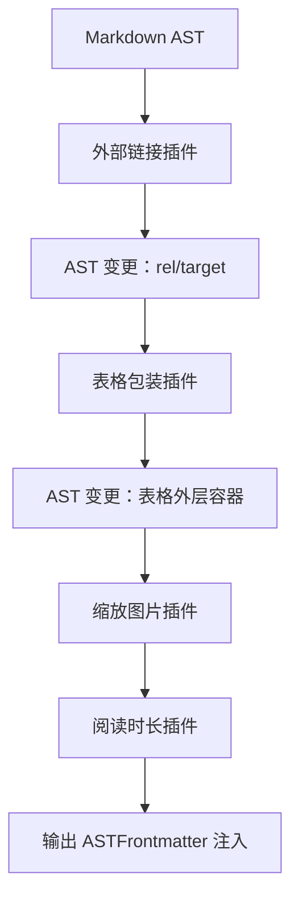
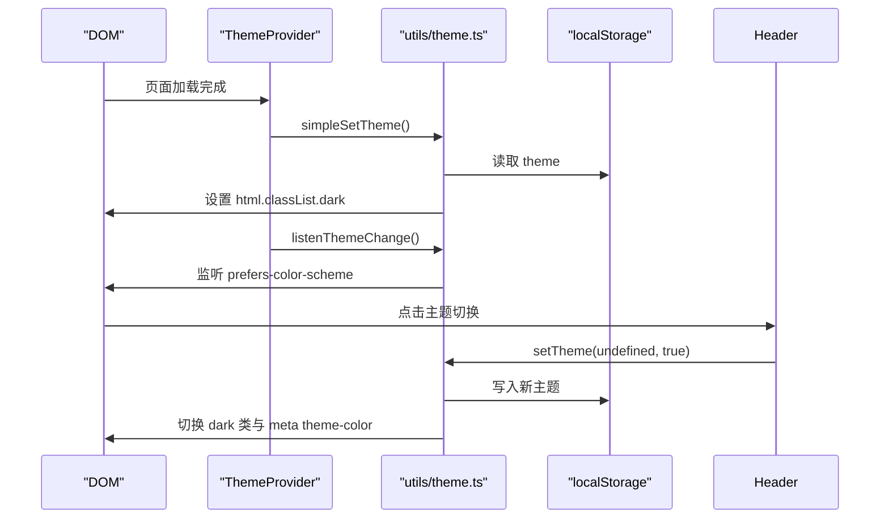
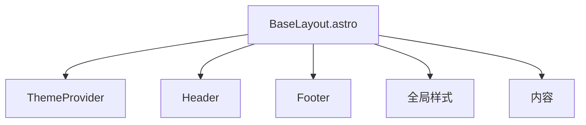
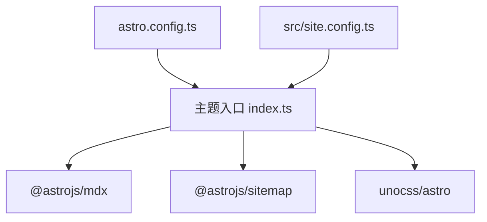

# 主题架构设计

<cite>
**本文引用的文件**
- [packages/pure/index.ts](file://packages/pure/index.ts)
- [packages/pure/types/user-config.ts](file://packages/pure/types/user-config.ts)
- [packages/pure/types/theme-config.ts](file://packages/pure/types/theme-config.ts)
- [packages/pure/types/integrations-config.ts](file://packages/pure/types/integrations-config.ts)
- [packages/pure/plugins/virtual-user-config.ts](file://packages/pure/plugins/virtual-user-config.ts)
- [packages/pure/plugins/rehype-external-links.ts](file://packages/pure/plugins/rehype-external-links.ts)
- [packages/pure/plugins/rehype-table.ts](file://packages/pure/plugins/rehype-table.ts)
- [packages/pure/plugins/remark-plugins.ts](file://packages/pure/plugins/remark-plugins.ts)
- [packages/pure/utils/theme.ts](file://packages/pure/utils/theme.ts)
- [packages/pure/components/basic/Header.astro](file://packages/pure/components/basic/Header.astro)
- [packages/pure/components/basic/Footer.astro](file://packages/pure/components/basic/Footer.astro)
- [packages/pure/components/basic/ThemeProvider.astro](file://packages/pure/components/basic/ThemeProvider.astro)
- [src/layouts/BaseLayout.astro](file://src/layouts/BaseLayout.astro)
- [src/site.config.ts](file://src/site.config.ts)
- [astro.config.ts](file://astro.config.ts)
</cite>

## 目录
1. [引言](#引言)
2. [项目结构](#项目结构)
3. [核心组件](#核心组件)
4. [架构总览](#架构总览)
5. [详细组件分析](#详细组件分析)
6. [依赖分析](#依赖分析)
7. [性能考虑](#性能考虑)
8. [故障排查指南](#故障排查指南)
9. [结论](#结论)
10. [附录](#附录)

## 引言
本文件面向希望深度理解 Astro Pure 主题架构的开发者，系统阐述主题的整体架构模式、组件化设计原理、插件系统架构与配置驱动设计理念。文档覆盖主题初始化流程、配置解析机制、生命周期钩子实现，以及与 Astro 生态（MDX、Sitemap、UnoCSS 等）的集成方式；同时解释主题的可扩展性设计，包括用户配置系统、虚拟配置插件与主题定制机制，并通过架构图与组件关系图帮助读者建立清晰的认知模型。

## 项目结构
Astro Pure 主题采用“主题包 + 用户站点”的分层组织方式：
- 主题包位于 packages/pure，包含主题的核心逻辑、组件、插件与类型定义。
- 用户站点位于根目录，通过 astro.config.ts 引入主题包并注入用户配置。
- 布局与页面位于 src 目录，基于主题提供的基础布局与组件构建页面。

**图表来源**
- [packages/pure/index.ts](file://packages/pure/index.ts#L1-L114)
- [astro.config.ts](file://astro.config.ts#L1-L133)
- [src/site.config.ts](file://src/site.config.ts#L1-L207)

**章节来源**
- [astro.config.ts](file://astro.config.ts#L1-L133)
- [src/site.config.ts](file://src/site.config.ts#L1-L207)

## 核心组件
- 主题入口与生命周期钩子：负责在 Astro 配置阶段解析用户配置、自动注入生态插件、注册 Markdown 插件与 Vite 虚拟模块。
- 配置体系：以 Zod Schema 定义严格且可扩展的用户配置与主题配置，支持默认值、转换与校验。
- 虚拟配置插件：通过 Vite 虚拟模块向组件与运行时暴露用户配置与项目上下文。
- Markdown 插件：提供外部链接处理、表格滚动包装、阅读时长计算与缩放图片标记等能力。
- 基础组件：Header、Footer、ThemeProvider，统一承载主题外观与交互。
- 运行时工具：主题切换逻辑与事件派发，保障 SSR/CSR 一致性。

**章节来源**
- [packages/pure/index.ts](file://packages/pure/index.ts#L19-L114)
- [packages/pure/types/user-config.ts](file://packages/pure/types/user-config.ts#L1-L27)
- [packages/pure/plugins/virtual-user-config.ts](file://packages/pure/plugins/virtual-user-config.ts#L1-L100)
- [packages/pure/plugins/rehype-external-links.ts](file://packages/pure/plugins/rehype-external-links.ts#L1-L75)
- [packages/pure/plugins/rehype-table.ts](file://packages/pure/plugins/rehype-table.ts#L1-L38)
- [packages/pure/plugins/remark-plugins.ts](file://packages/pure/plugins/remark-plugins.ts#L1-L29)
- [packages/pure/utils/theme.ts](file://packages/pure/utils/theme.ts#L1-L41)

## 架构总览
主题采用“配置驱动 + 生命周期钩子 + 虚拟模块”的架构模式：
- 在 astro:config:setup 钩子中完成配置解析、生态插件注入与 Markdown 插件装配。
- 在 astro:build:done 钩子中按需触发 Pagefind 搜索索引生成。
- 通过虚拟模块将用户配置与项目上下文注入到组件与运行时，实现“零样板、强约束”的主题体验。

**图表来源**
- [packages/pure/index.ts](file://packages/pure/index.ts#L29-L114)
- [packages/pure/plugins/virtual-user-config.ts](file://packages/pure/plugins/virtual-user-config.ts#L89-L100)

**章节来源**
- [packages/pure/index.ts](file://packages/pure/index.ts#L29-L114)
- [packages/pure/plugins/virtual-user-config.ts](file://packages/pure/plugins/virtual-user-config.ts#L18-L100)

## 详细组件分析

### 主题入口与生命周期钩子
- 配置解析：使用 Zod Schema 对用户输入进行严格校验与必要转换（如 pagefind 默认值与互斥校验），确保配置合法与一致。
- 生态插件注入：在未被用户或其它插件显式添加的前提下，自动注入 sitemap、mdx、unocss，保证开箱即用。
- Markdown 插件装配：根据用户配置启用 mediumZoom、阅读时长统计、外部链接 rel/target 处理与表格溢出滚动包装。
- Vite 虚拟模块：通过 vitePluginUserConfig 暴露 virtual:config、virtual:project-context、virtual:user-css、virtual:collection-config。
- 构建后处理：当启用 pagefind 时，在构建完成后调用 npx pagefind 生成搜索索引。

**图表来源**
- [packages/pure/index.ts](file://packages/pure/index.ts#L32-L114)
- [packages/pure/plugins/virtual-user-config.ts](file://packages/pure/plugins/virtual-user-config.ts#L89-L100)

**章节来源**
- [packages/pure/index.ts](file://packages/pure/index.ts#L19-L114)

### 配置驱动的设计理念
- 用户配置（UserConfig）：合并主题配置与集成配置，提供默认值与转换规则，确保 pagefind 与 prerender 的一致性。
- 主题配置（ThemeConfig）：涵盖标题、作者、描述、favicon、社交卡片、语言、头部、自定义 CSS、标题分隔符、预渲染、npmCDN、页眉与页脚等。
- 集成配置（IntegrationConfig）：链接、Pagefind、随机语录、排版样式、MediumZoom、Waline 等扩展能力开关与参数。
- 类型安全：所有配置均通过 Zod Schema 定义，生成强类型的 TypeScript 类型，降低误配风险。

**图表来源**
- [packages/pure/types/user-config.ts](file://packages/pure/types/user-config.ts#L6-L27)
- [packages/pure/types/theme-config.ts](file://packages/pure/types/theme-config.ts#L11-L193)
- [packages/pure/types/integrations-config.ts](file://packages/pure/types/integrations-config.ts#L5-L66)

**章节来源**
- [packages/pure/types/user-config.ts](file://packages/pure/types/user-config.ts#L1-L27)
- [packages/pure/types/theme-config.ts](file://packages/pure/types/theme-config.ts#L1-L193)
- [packages/pure/types/integrations-config.ts](file://packages/pure/types/integrations-config.ts#L1-L66)

### 虚拟配置插件与主题定制
- 虚拟模块暴露：
  - virtual:config：用户配置对象，供组件直接导入使用。
  - virtual:project-context：构建格式、内容集合兼容性、根路径、源码路径、尾斜杠策略等。
  - virtual:user-css：按用户配置动态导入自定义 CSS 文件。
  - virtual:collection-config：尝试加载用户内容集合配置，兼容旧版与新版内容配置文件。
- 主题定制机制：
  - 组件通过 import config from 'virtual:config' 获取配置，实现“零样板、强约束”的主题体验。
  - 自定义 CSS 通过 customCss 字段注入，满足品牌化需求。
  - 内容集合配置通过 virtual:collection-config 提供给主题内部逻辑使用。

**图表来源**
- [packages/pure/plugins/virtual-user-config.ts](file://packages/pure/plugins/virtual-user-config.ts#L61-L80)
- [packages/pure/components/basic/Header.astro](file://packages/pure/components/basic/Header.astro#L1-L209)
- [packages/pure/components/basic/Footer.astro](file://packages/pure/components/basic/Footer.astro#L1-L91)
- [src/layouts/BaseLayout.astro](file://src/layouts/BaseLayout.astro#L1-L92)

**章节来源**
- [packages/pure/plugins/virtual-user-config.ts](file://packages/pure/plugins/virtual-user-config.ts#L1-L100)

### Markdown 插件系统
- 外部链接处理：为外部链接自动添加 rel/noreferrer 等属性，并可插入提示图标，提升安全性与可访问性。
- 表格滚动包装：对内容区域内的表格包裹滚动容器，避免页面横向滚动问题。
- 阅读时长与缩放图片：为图片标记可缩放类名，为 Frontmatter 注入分钟数与字数统计，辅助 SEO 与用户体验。

**图表来源**
- [packages/pure/plugins/rehype-external-links.ts](file://packages/pure/plugins/rehype-external-links.ts#L37-L75)
- [packages/pure/plugins/rehype-table.ts](file://packages/pure/plugins/rehype-table.ts#L8-L38)
- [packages/pure/plugins/remark-plugins.ts](file://packages/pure/plugins/remark-plugins.ts#L9-L29)

**章节来源**
- [packages/pure/plugins/rehype-external-links.ts](file://packages/pure/plugins/rehype-external-links.ts#L1-L75)
- [packages/pure/plugins/rehype-table.ts](file://packages/pure/plugins/rehype-table.ts#L1-L38)
- [packages/pure/plugins/remark-plugins.ts](file://packages/pure/plugins/remark-plugins.ts#L1-L29)

### 基础组件与运行时主题切换
- Header：展示站点标题、导航菜单、搜索入口与主题切换按钮；通过 dataset 与本地存储联动主题状态。
- Footer：根据配置渲染版权、链接与社交信息，自动补齐 RSS 链接。
- ThemeProvider：在页面加载时根据系统偏好设置初始主题，并监听变化；同时处理 Toast 通知。
- 运行时工具：提供 getTheme/listenThemeChange/setTheme 方法，支持系统/浅色/深色循环切换与持久化。

**图表来源**
- [packages/pure/components/basic/ThemeProvider.astro](file://packages/pure/components/basic/ThemeProvider.astro#L1-L41)
- [packages/pure/utils/theme.ts](file://packages/pure/utils/theme.ts#L1-L41)
- [packages/pure/components/basic/Header.astro](file://packages/pure/components/basic/Header.astro#L67-L108)

**章节来源**
- [packages/pure/components/basic/Header.astro](file://packages/pure/components/basic/Header.astro#L1-L209)
- [packages/pure/components/basic/Footer.astro](file://packages/pure/components/basic/Footer.astro#L1-L91)
- [packages/pure/components/basic/ThemeProvider.astro](file://packages/pure/components/basic/ThemeProvider.astro#L1-L41)
- [packages/pure/utils/theme.ts](file://packages/pure/utils/theme.ts#L1-L41)

### 布局与页面集成
- BaseLayout：统一引入全局样式、站点元数据与主题 Provider，内嵌 Header 与 Footer，提供高亮色变量与安全区适配。
- 页面通过 Astro props 接收 meta 信息，结合主题配置生成 SEO 元数据与社交卡片。

**图表来源**
- [src/layouts/BaseLayout.astro](file://src/layouts/BaseLayout.astro#L1-L92)
- [packages/pure/components/basic/Header.astro](file://packages/pure/components/basic/Header.astro#L1-L209)
- [packages/pure/components/basic/Footer.astro](file://packages/pure/components/basic/Footer.astro#L1-L91)
- [packages/pure/components/basic/ThemeProvider.astro](file://packages/pure/components/basic/ThemeProvider.astro#L1-L41)

**章节来源**
- [src/layouts/BaseLayout.astro](file://src/layouts/BaseLayout.astro#L1-L92)

## 依赖分析
- 主题对 Astro 生态的依赖：MDX、Sitemap、UnoCSS；这些插件在未被用户显式添加时由主题自动注入。
- 主题对第三方库的依赖：remark-math、rehype-katex、Shiki 变换器等，通过主题入口与用户配置共同生效。
- 主题对运行时的依赖：浏览器特性（prefers-color-scheme）、localStorage、DOM API。

**图表来源**
- [packages/pure/index.ts](file://packages/pure/index.ts#L8-L10)
- [astro.config.ts](file://astro.config.ts#L1-L133)

**章节来源**
- [packages/pure/index.ts](file://packages/pure/index.ts#L8-L10)
- [astro.config.ts](file://astro.config.ts#L1-L133)

## 性能考虑
- 预渲染与懒加载：默认开启 prerender，减少首屏等待；主题切换与菜单展开使用 CSS 过渡，避免重排抖动。
- 资源优化：图像服务采用 Sharp；字体优化通过实验性 flag 开启；UnoCSS 提供原子化样式与按需生成。
- 构建优化：通过虚拟模块减少重复打包；Markdown 插件仅在需要时启用，避免不必要的 AST 变换。
- 搜索索引：Pagefind 仅在启用时执行，避免无谓的构建时间消耗。

## 故障排查指南
- 配置错误：若用户配置不符合 Schema，主题会在配置阶段抛出可读性良好的错误信息，定位字段与原因。
- 插件冲突：若用户已手动添加生态插件，主题会跳过重复注入，避免冲突；若出现异常，检查 integrations 数组顺序与重复项。
- Pagefind 未生成：确认 prerender 为 true 且 integ.pagefind 为 true；检查构建日志中 npx pagefind 的输出。
- 主题切换无效：检查 localStorage 中是否存在 theme 键；确认 DOM 上存在 html.dark 类；验证系统主题变化监听是否生效。

**章节来源**
- [packages/pure/index.ts](file://packages/pure/index.ts#L19-L25)
- [packages/pure/index.ts](file://packages/pure/index.ts#L98-L114)

## 结论
Astro Pure 主题通过“配置驱动 + 生命周期钩子 + 虚拟模块”的架构，实现了与 Astro 生态的无缝集成与高度可定制的主题体验。其严格的类型系统与插件化设计，既保障了易用性，又提供了强大的扩展能力。开发者可通过用户配置与虚拟模块快速定制主题外观、行为与功能，同时借助 Markdown 插件链与运行时工具实现高质量的内容呈现与交互体验。

## 附录
- 配置示例与字段说明可参考用户站点配置文件，其中包含主题配置与集成配置的完整示例。
- 如需新增 Markdown 插件或运行时行为，可在主题入口的生命周期钩子中扩展，或通过虚拟模块注入新的运行时能力。

**章节来源**
- [src/site.config.ts](file://src/site.config.ts#L1-L207)