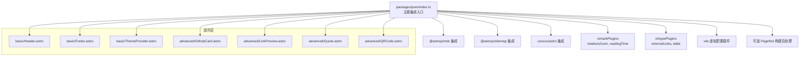
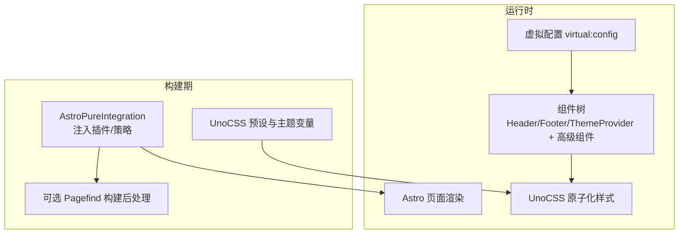
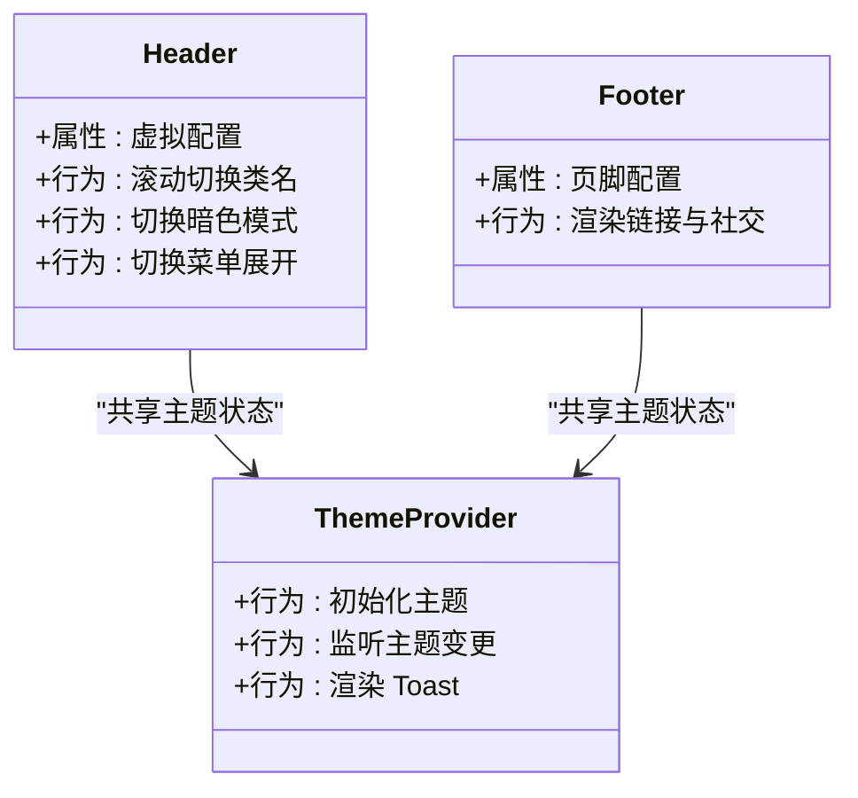
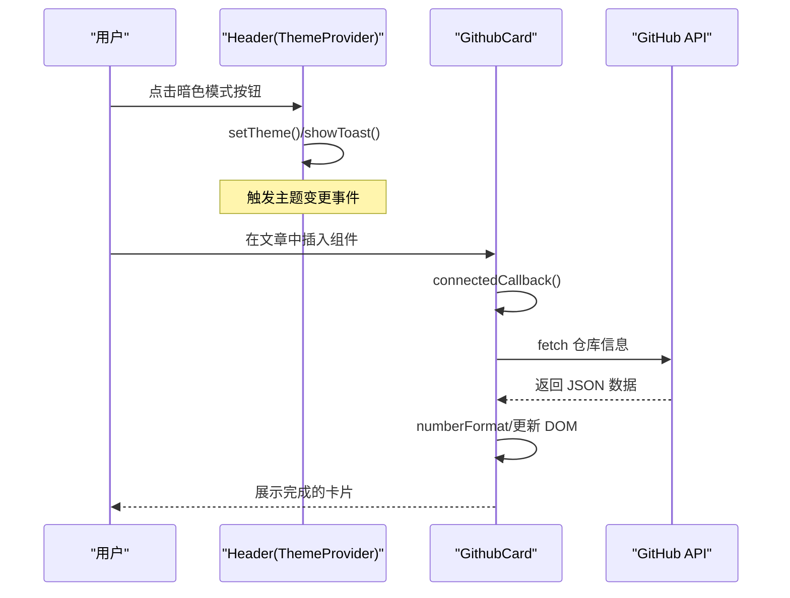
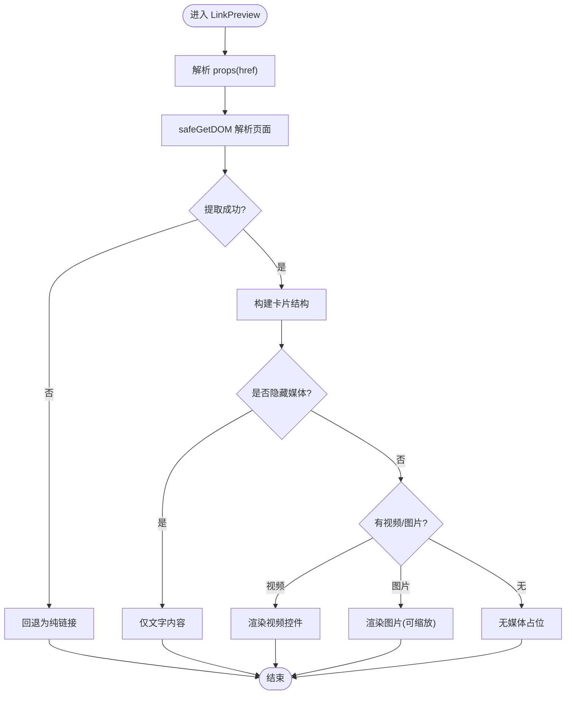
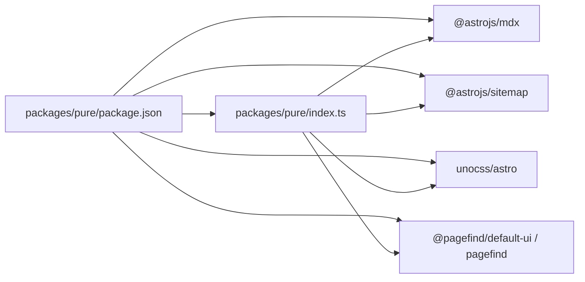

# 主题系统

<cite>
**本文引用的文件**
- [packages/pure/index.ts](file://packages/pure/index.ts)
- [packages/pure/package.json](file://packages/pure/package.json)
- [packages/pure/README.md](file://packages/pure/README.md)
- [packages/pure/types/theme-config.ts](file://packages/pure/types/theme-config.ts)
- [packages/pure/types/user-config.ts](file://packages/pure/types/user-config.ts)
- [packages/pure/components/basic/Header.astro](file://packages/pure/components/basic/Header.astro)
- [packages/pure/components/basic/Footer.astro](file://packages/pure/components/basic/Footer.astro)
- [packages/pure/components/basic/ThemeProvider.astro](file://packages/pure/components/basic/ThemeProvider.astro)
- [packages/pure/components/advanced/GithubCard.astro](file://packages/pure/components/advanced/GithubCard.astro)
- [packages/pure/components/advanced/LinkPreview.astro](file://packages/pure/components/advanced/LinkPreview.astro)
- [packages/pure/components/advanced/Quote.astro](file://packages/pure/components/advanced/Quote.astro)
- [packages/pure/components/advanced/QRCode.astro](file://packages/pure/components/advanced/QRCode.astro)
- [packages/pure/plugins/link-preview.ts](file://packages/pure/plugins/link-preview.ts)
- [packages/pure/utils/index.ts](file://packages/pure/utils/index.ts)
- [uno.config.ts](file://uno.config.ts)
</cite>

## 目录
1. [引言](#引言)
2. [项目结构](#项目结构)
3. [核心组件](#核心组件)
4. [架构总览](#架构总览)
5. [详细组件分析](#详细组件分析)
6. [依赖关系分析](#依赖关系分析)
7. [性能考量](#性能考量)
8. [故障排查指南](#故障排查指南)
9. [结论](#结论)
10. [附录](#附录)

## 引言
本文件为 Astro 主题 Pure 的完整技术文档，面向希望在 Astro 项目中使用或二次开发该主题的工程师与内容作者。文档从整体架构、设计理念、组件体系、样式系统与 UnoCSS 集成、数据流与组件间通信、到高级组件实现细节与用户自定义组件开发指南进行全面阐述，并提供最佳实践与排错建议。

## 项目结构
Pure 主题以“集成包”的形式提供，核心入口为 packages/pure/index.ts，导出一个 Astro 集成函数，负责注入 Markdown 插件、UnoCSS、页面预取策略以及可选的 Pagefind 搜索构建流程。主题组件按功能分层组织于 packages/pure/components 下，分为 basic（基础）、advanced（高级）与 user（用户）三类；样式系统通过 uno.config.ts 使用 UnoCSS 的 presetMini 与 presetTypography，并结合站点配置进行主题色与排版风格定制。

图表来源
- [packages/pure/index.ts](file://packages/pure/index.ts#L19-L114)

章节来源
- [packages/pure/index.ts](file://packages/pure/index.ts#L1-L114)
- [packages/pure/package.json](file://packages/pure/package.json#L1-L51)

## 核心组件
本节聚焦基础组件与主题系统的关键职责，包括 Header、Footer、ThemeProvider 的功能与使用方式。

- Header 组件
  - 功能：展示站点标题、导航菜单、搜索入口、深色/浅色/系统主题切换按钮；支持移动端展开菜单与滚动时的视觉反馈。
  - 关键点：读取虚拟配置中的标题与菜单项；通过自定义元素与本地存储实现主题切换与提示气泡；使用 UnoCSS 类名与原子化样式。
  - 交互：监听滚动事件动态切换类名；点击暗色模式按钮调用工具函数切换主题并显示 Toast 提示；点击菜单按钮切换展开状态。
  
  章节来源
  - [packages/pure/components/basic/Header.astro](file://packages/pure/components/basic/Header.astro#L1-L209)

- Footer 组件
  - 功能：渲染页脚信息，自动补全 RSS 社交链接；支持位置分组的链接列表与“由 Astro/Pure 主题驱动”的版权信息开关。
  - 关键点：根据配置渲染不同位置的链接；默认为 RSS 添加链接；使用 Icon 组件渲染社交图标。
  
  章节来源
  - [packages/pure/components/basic/Footer.astro](file://packages/pure/components/basic/Footer.astro#L1-L91)

- ThemeProvider 组件
  - 功能：在页面加载前根据系统偏好设置初始化主题；监听主题变更事件；全局注册 Toast 自定义事件并在页面底部渲染临时提示。
  - 关键点：内联脚本避免闪烁；通过监听主题变更事件统一响应；使用图标库渲染 Toast 图标。
  
  章节来源
  - [packages/pure/components/basic/ThemeProvider.astro](file://packages/pure/components/basic/ThemeProvider.astro#L1-L41)

## 架构总览
主题采用“集成包 + 组件库 + 工具库 + 样式系统”的分层架构。集成包在 Astro 配置阶段注入 Markdown 插件、UnoCSS、预取策略与可选 Pagefind；组件库提供基础与高级 UI 组件；工具库封装主题切换、类名合并、日期格式化、Toast 等通用能力；样式系统基于 UnoCSS 的原子化与可变主题变量，确保一致的外观与高性能渲染。

图表来源
- [packages/pure/index.ts](file://packages/pure/index.ts#L29-L96)
- [uno.config.ts](file://uno.config.ts#L174-L193)

## 详细组件分析

### 基础组件系统
基础组件承担页面骨架与通用交互职责，强调可复用性与可定制性。

图表来源
- [packages/pure/components/basic/Header.astro](file://packages/pure/components/basic/Header.astro#L76-L108)
- [packages/pure/components/basic/Footer.astro](file://packages/pure/components/basic/Footer.astro#L1-L91)
- [packages/pure/components/basic/ThemeProvider.astro](file://packages/pure/components/basic/ThemeProvider.astro#L22-L40)

章节来源
- [packages/pure/components/basic/Header.astro](file://packages/pure/components/basic/Header.astro#L1-L209)
- [packages/pure/components/basic/Footer.astro](file://packages/pure/components/basic/Footer.astro#L1-L91)
- [packages/pure/components/basic/ThemeProvider.astro](file://packages/pure/components/basic/ThemeProvider.astro#L1-L41)

### 高级组件库
高级组件提供更丰富的交互与数据展示能力，通常涉及外部 API 或第三方资源。

- GithubCard
  - 功能：解析 GitHub 仓库地址，调用 GitHub API 获取仓库信息，渲染头像、描述、星数、分支数、许可证与语言等。
  - 实现要点：自定义元素生命周期中发起请求；使用 Intl.NumberFormat 进行数字格式化；加载态使用动画占位符；错误降级处理。
  - 数据流：props -> 解析 owner/repo -> fetch -> 更新 DOM -> 移除 loading 标记
  
  章节来源
  - [packages/pure/components/advanced/GithubCard.astro](file://packages/pure/components/advanced/GithubCard.astro#L101-L177)

- LinkPreview
  - 功能：抓取目标链接的 Open Graph 元数据，渲染带媒体（图片/视频）或纯文本的预览卡片。
  - 实现要点：服务端/SSR 环境下解析 HTML 并提取元信息；支持隐藏媒体与缩放；使用 Image 组件处理图片尺寸与懒加载。
  - 数据流：props(href) -> 解析元信息 -> 渲染卡片 -> 可选缩放
  
  章节来源
  - [packages/pure/components/advanced/LinkPreview.astro](file://packages/pure/components/advanced/LinkPreview.astro#L1-L83)
  - [packages/pure/plugins/link-preview.ts](file://packages/pure/plugins/link-preview.ts#L79-L111)

- Quote
  - 功能：从配置的远程服务拉取一句名言并渲染为带心跳指示的卡片。
  - 实现要点：通过虚拟配置中的 integ.quote.server 与 target 函数动态拼接；使用 new Function 执行配置中的表达式提取目标字段。
  - 数据流：读取配置 -> fetch -> 执行 target -> 渲染
  
  章节来源
  - [packages/pure/components/advanced/Quote.astro](file://packages/pure/components/advanced/Quote.astro#L24-L40)

- QRCode
  - 功能：在容器内生成二维码，默认使用当前页面 URL。
  - 实现要点：通过 npmCDN 加载 qrcode.min.js；内联脚本确保首屏快速渲染；容器为空时才初始化。
  - 数据流：props(content) -> 内联加载库 -> 初始化 -> 渲染
  
  章节来源
  - [packages/pure/components/advanced/QRCode.astro](file://packages/pure/components/advanced/QRCode.astro#L1-L22)

图表来源
- [packages/pure/components/basic/ThemeProvider.astro](file://packages/pure/components/basic/ThemeProvider.astro#L22-L40)
- [packages/pure/components/advanced/GithubCard.astro](file://packages/pure/components/advanced/GithubCard.astro#L134-L177)

图表来源
- [packages/pure/plugins/link-preview.ts](file://packages/pure/plugins/link-preview.ts#L79-L111)
- [packages/pure/components/advanced/LinkPreview.astro](file://packages/pure/components/advanced/LinkPreview.astro#L21-L71)

### 用户组件开发指南
- 创建自定义组件
  - 建议遵循 Astro 组件规范，使用 Astro.props 接收输入，必要时在 <script> 中定义自定义元素以增强交互。
  - 将组件放入 packages/pure/components/user 目录，便于主题导出与统一管理。
- 集成到主题系统
  - 在主题配置中通过 virtual:config 注入数据；在需要的地方引入 Icon、Image 等基础组件。
  - 使用 UnoCSS 类名与主题变量，确保与整体风格一致。
- 最佳实践
  - 对外链与第三方资源使用内联脚本或 CDN 加载，减少阻塞。
  - 对可能失败的异步请求做好降级与错误日志记录。
  - 合理使用类名合并工具，避免重复与冲突。

章节来源
- [packages/pure/components/basic/Header.astro](file://packages/pure/components/basic/Header.astro#L1-L209)
- [packages/pure/components/basic/ThemeProvider.astro](file://packages/pure/components/basic/ThemeProvider.astro#L1-L41)

## 依赖关系分析
- 集成包依赖
  - @astrojs/mdx、@astrojs/sitemap、unocss/astro、pagefind、@pagefind/default-ui 等作为运行时与构建期依赖。
  - 通过 AstroPureIntegration 在配置阶段注入 Markdown 插件与 UnoCSS，并在构建完成后可选执行 Pagefind。
- 组件依赖
  - advanced 组件依赖插件与工具库；basic 组件依赖虚拟配置与工具库；ThemeProvider 依赖图标库与主题工具。
- 外部资源
  - QRCode 使用 npmCDN 加载第三方库；LinkPreview 使用安全的缓存与错误处理策略。

图表来源
- [packages/pure/package.json](file://packages/pure/package.json#L39-L49)
- [packages/pure/index.ts](file://packages/pure/index.ts#L8-L17)

章节来源
- [packages/pure/package.json](file://packages/pure/package.json#L1-L51)
- [packages/pure/index.ts](file://packages/pure/index.ts#L1-L114)

## 性能考量
- 预取策略
  - 默认启用全量链接预取，提升交互流畅度；可在站点配置中覆盖。
- 样式系统
  - UnoCSS 原子化与可变主题变量，减少 CSS 体积与重绘；presetTypography 提供语义化排版优化。
- 组件加载
  - 内联关键脚本与图标，避免首屏闪烁；对非关键资源延迟加载。
- 缓存与降级
  - LinkPreview 使用 LRU 缓存与安全获取，避免构建失败；GithubCard 提供加载态与错误降级。

章节来源
- [packages/pure/index.ts](file://packages/pure/index.ts#L92-L96)
- [uno.config.ts](file://uno.config.ts#L174-L193)
- [packages/pure/plugins/link-preview.ts](file://packages/pure/plugins/link-preview.ts#L3-L27)

## 故障排查指南
- 主题切换无效
  - 检查 ThemeProvider 是否正确监听主题变更事件；确认 localStorage 中的主题值是否被修改。
- 深色模式图标不显示
  - 检查 dataset.theme 是否随主题变化更新；确认图标库是否正确导入。
- LinkPreview 无法解析元信息
  - 查看控制台错误日志；确认目标站点的 Open Graph 元标签是否完整；检查网络请求与缓存命中情况。
- GithubCard 数据加载失败
  - 检查仓库 URL 是否正确；确认网络可达与 API 限流；查看控制台错误输出。
- QRCode 未渲染
  - 确认容器存在且未被提前清空；检查 CDN 加载是否成功；确认 content 参数传入。

章节来源
- [packages/pure/components/basic/ThemeProvider.astro](file://packages/pure/components/basic/ThemeProvider.astro#L22-L40)
- [packages/pure/components/advanced/LinkPreview.astro](file://packages/pure/components/advanced/LinkPreview.astro#L1-L83)
- [packages/pure/plugins/link-preview.ts](file://packages/pure/plugins/link-preview.ts#L51-L68)
- [packages/pure/components/advanced/GithubCard.astro](file://packages/pure/components/advanced/GithubCard.astro#L112-L125)
- [packages/pure/components/advanced/QRCode.astro](file://packages/pure/components/advanced/QRCode.astro#L13-L21)

## 结论
Pure 主题通过 Astro 集成包将 Markdown 插件、UnoCSS 与可选搜索能力整合为一体，配合基础与高级组件库，提供了开箱即用的博客与文档站点解决方案。其组件间通过虚拟配置与工具库实现松耦合的数据流与主题一致性，同时在性能与可维护性上做了充分权衡。开发者可在此基础上快速扩展用户组件并保持整体风格统一。

## 附录
- 配置与类型
  - 主题配置 Schema 定义了标题、作者、描述、favicon、socialCard、logo、locale、head、customCss、titleDelimiter、prerender、npmCDN、header/footer/content 等字段。
  - 用户配置在主题配置基础上增加集成开关与 Pagefind 行为约束。
- UnoCSS 主题变量
  - 通过 uno.config.ts 定义颜色主题与排版风格，结合 presetTypography 提升阅读体验。

章节来源
- [packages/pure/types/theme-config.ts](file://packages/pure/types/theme-config.ts#L11-L193)
- [packages/pure/types/user-config.ts](file://packages/pure/types/user-config.ts#L1-L27)
- [uno.config.ts](file://uno.config.ts#L127-L143)