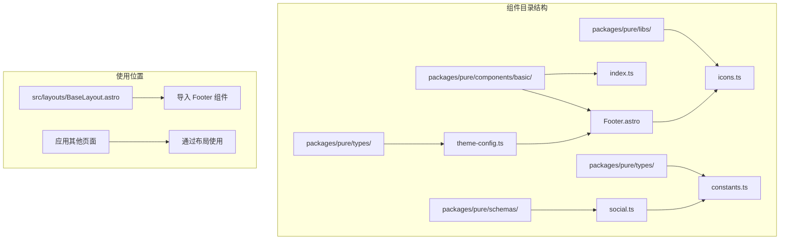
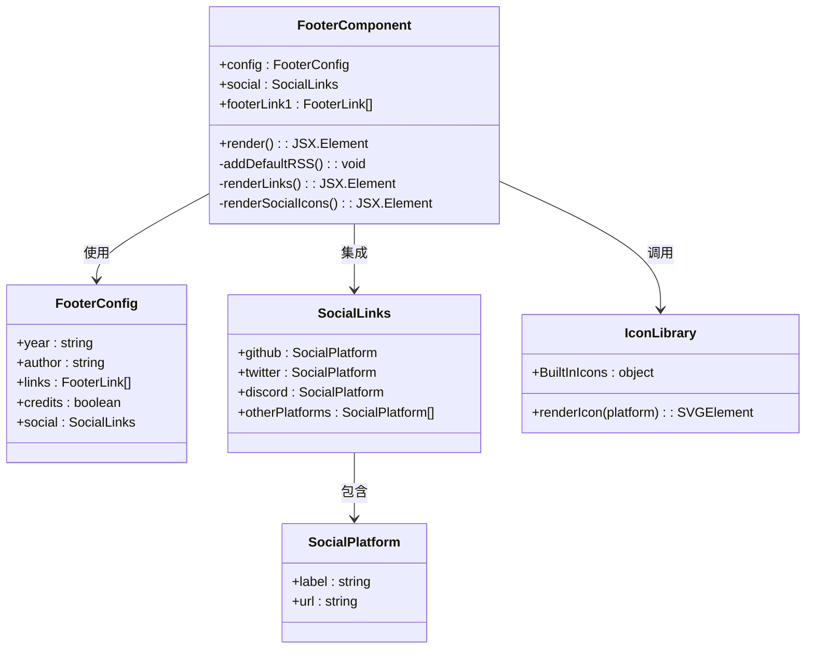
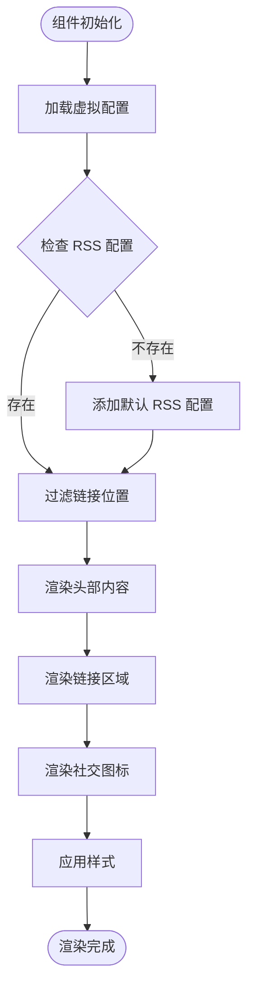
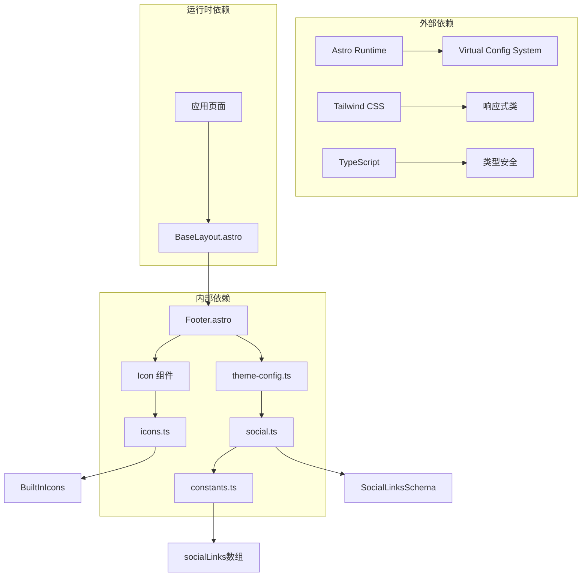

# Footer 组件

<cite>
**本文档引用的文件**
- [Footer.astro](file://packages/pure/components/basic/Footer.astro)
- [index.ts](file://packages/pure/components/basic/index.ts)
- [theme-config.ts](file://packages/pure/types/theme-config.ts)
- [social.ts](file://packages/pure/schemas/social.ts)
- [icons.ts](file://packages/pure/libs/icons.ts)
- [constants.ts](file://packages/pure/types/constants.ts)
- [BaseLayout.astro](file://src/layouts/BaseLayout.astro)
</cite>

## 目录
1. [简介](#简介)
2. [项目结构](#项目结构)
3. [核心组件](#核心组件)
4. [架构概览](#架构概览)
5. [详细组件分析](#详细组件分析)
6. [依赖关系分析](#依赖关系分析)
7. [性能考虑](#性能考虑)
8. [故障排除指南](#故障排除指南)
9. [结论](#结论)

## 简介

Footer 组件是 Astro-Pure 主题中的核心组件之一，负责在页面底部显示版权信息、社交链接和页面信息。该组件提供了灵活的配置选项，支持多种社交媒体平台集成，并具有响应式设计特性。

## 项目结构

Footer 组件位于 packages/pure/components/basic 目录下，采用 Astro 组件格式编写，集成了虚拟配置系统和图标库。



**图表来源**
- [Footer.astro](file://packages/pure/components/basic/Footer.astro#L1-L91)
- [index.ts](file://packages/pure/components/basic/index.ts#L1-L4)

**章节来源**
- [Footer.astro](file://packages/pure/components/basic/Footer.astro#L1-L91)
- [BaseLayout.astro](file://src/layouts/BaseLayout.astro#L1-L92)

## 核心组件

Footer 组件的主要功能包括：

### 版权信息展示
- 年份显示：自动显示当前年份
- 作者信息：从配置中获取作者名称
- 版权声明：支持自定义版权信息

### 社交链接集成
- 多平台支持：GitHub、Twitter、Discord 等 18 种社交媒体平台
- 自动 RSS 添加：如果未配置 RSS，自动添加默认 RSS 链接
- 图标渲染：使用内置图标库显示平台图标

### 页面信息管理
- 友情链接：支持两组不同位置的链接
- 版权主题：可选择显示 "Powered by Astro & Pure" 信息
- 响应式布局：适配移动端和桌面端显示

**章节来源**
- [Footer.astro](file://packages/pure/components/basic/Footer.astro#L6-L16)
- [Footer.astro](file://packages/pure/components/basic/Footer.astro#L37-L66)

## 架构概览

Footer 组件采用模块化设计，通过虚拟配置系统与主题配置集成。



**图表来源**
- [Footer.astro](file://packages/pure/components/basic/Footer.astro#L2-L16)
- [theme-config.ts](file://packages/pure/types/theme-config.ts#L128-L170)
- [social.ts](file://packages/pure/schemas/social.ts#L5-L44)

## 详细组件分析

### Props 配置详解

Footer 组件通过虚拟配置系统接收配置参数：

#### 基础配置
- `year`: 显示的年份字符串
- `author`: 作者或组织名称
- `credits`: 是否显示主题版权信息

#### 链接配置
- `links`: 数组形式的链接配置
  - `title`: 链接显示文本
  - `link`: 链接目标地址
  - `style`: 自定义样式类名
  - `pos`: 链接位置（1 或 2）

#### 社交媒体配置
- `social`: 对象形式的社交媒体配置
  - 支持平台：github、gitlab、discord、youtube、instagram、x、telegram、rss、email、reddit、bluesky、tiktok、weibo、steam、bilibili、zhihu、coolapk、netease
  - 每个平台包含 `label` 和 `url` 属性

### 布局结构分析

组件采用 Flexbox 布局，支持响应式设计：



**图表来源**
- [Footer.astro](file://packages/pure/components/basic/Footer.astro#L6-L16)
- [Footer.astro](file://packages/pure/components/basic/Footer.astro#L19-L82)

### 响应式设计实现

组件使用 Tailwind CSS 类实现响应式布局：

- 移动端：垂直堆叠布局 (`max-sm:flex-col`)
- 平板端：水平排列，居中对齐 (`sm:justify-between`)
- 桌面端：优化的间距和对齐方式

### 图标系统集成

Footer 组件使用内置图标库，支持 138+ 种图标：

#### 社交媒体图标
- GitHub、GitLab、Discord、YouTube、Instagram、X、Telegram
- Reddit、BlueSky、TikTok、Weibo、Steam、Bilibili、Zhihu
- Coolapk、NetEase 等平台图标

#### UI 图标
- 菜单、搜索、太阳、月亮、计算机、日历等界面图标

**章节来源**
- [icons.ts](file://packages/pure/libs/icons.ts#L1-L138)
- [social.ts](file://packages/pure/schemas/social.ts#L20-L39)

### 使用示例

#### 基础配置示例
```typescript
// 在主题配置中添加
footer: {
  year: "2025",
  author: "我的名字",
  credits: true,
  links: [
    {
      title: "隐私政策",
      link: "/terms/privacy-policy",
      pos: 1
    },
    {
      title: "关于",
      link: "/about",
      pos: 2
    }
  ],
  social: {
    github: "https://github.com/用户名",
    twitter: "https://twitter.com/用户名",
    rss: "/rss.xml"
  }
}
```

#### 高级配置示例
```typescript
// 自定义样式链接
footer: {
  links: [
    {
      title: "GitHub",
      link: "https://github.com/用户名",
      style: "text-blue-600 hover:text-blue-800",
      pos: 1
    }
  ]
}
```

### 样式定制指南

#### 内联样式
组件包含基础样式定义：
- 链接颜色：继承前景色变量
- 下划线装饰：统一的视觉风格
- 字体权重：500 的粗细度

#### 自定义样式方法
1. 通过 `style` 属性为特定链接添加自定义类名
2. 使用全局 CSS 覆盖默认样式
3. 通过主题配置调整整体外观

### 国际化支持

Footer 组件支持多语言配置：

- 通过主题配置的 `locale` 设置语言环境
- 社交平台标签根据语言自动本地化
- 文本内容支持动态语言切换

**章节来源**
- [theme-config.ts](file://packages/pure/types/theme-config.ts#L48-L52)
- [social.ts](file://packages/pure/schemas/social.ts#L20-L39)

## 依赖关系分析

Footer 组件的依赖关系图：



**图表来源**
- [Footer.astro](file://packages/pure/components/basic/Footer.astro#L2-L4)
- [icons.ts](file://packages/pure/libs/icons.ts#L1-L138)
- [social.ts](file://packages/pure/schemas/social.ts#L1-L45)
- [constants.ts](file://packages/pure/types/constants.ts#L1-L21)

**章节来源**
- [index.ts](file://packages/pure/components/basic/index.ts#L1-L4)
- [BaseLayout.astro](file://src/layouts/BaseLayout.astro#L2-L4)

## 性能考虑

### 渲染优化
- 条件渲染：仅在有数据时渲染相应部分
- 列表渲染：使用高效的 map 函数处理链接数组
- 图标缓存：内置图标库避免重复加载

### 配置优化
- 虚拟配置：减少运行时配置解析开销
- 类型检查：编译时验证配置正确性
- 默认值：合理设置默认配置减少错误

## 故障排除指南

### 常见问题及解决方案

#### 社交媒体图标不显示
1. 检查平台名称是否在支持列表中
2. 确认 URL 格式正确且可访问
3. 验证图标库是否正确导入

#### 链接样式异常
1. 检查自定义样式类名是否正确
2. 确认 Tailwind CSS 配置完整
3. 验证 CSS 优先级设置

#### 响应式布局问题
1. 检查断点类名是否正确
2. 确认容器宽度设置
3. 验证移动设备调试模式

**章节来源**
- [Footer.astro](file://packages/pure/components/basic/Footer.astro#L71-L78)
- [social.ts](file://packages/pure/schemas/social.ts#L7-L13)

## 结论

Footer 组件是一个功能完整、配置灵活的页面底部组件。它提供了版权信息展示、社交链接集成和页面信息管理的核心功能，同时具备良好的响应式设计和国际化支持。通过虚拟配置系统和类型安全的架构设计，该组件能够满足大多数网站的底部信息需求，并为开发者提供了充足的定制空间。