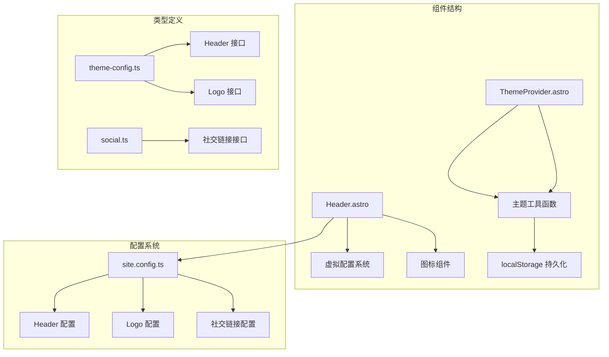
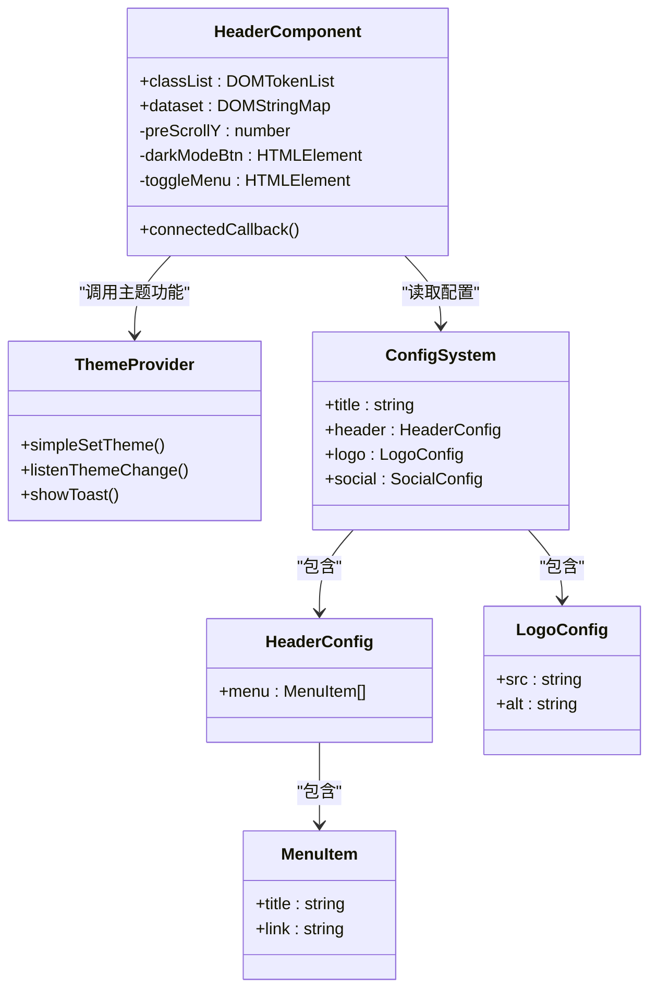
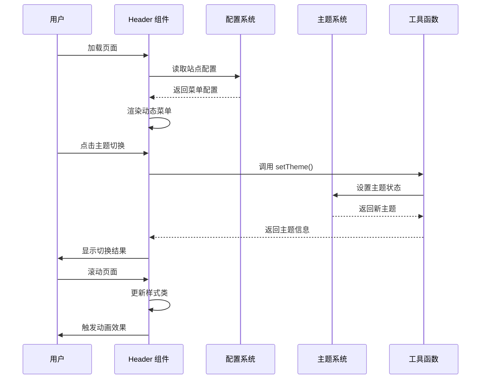
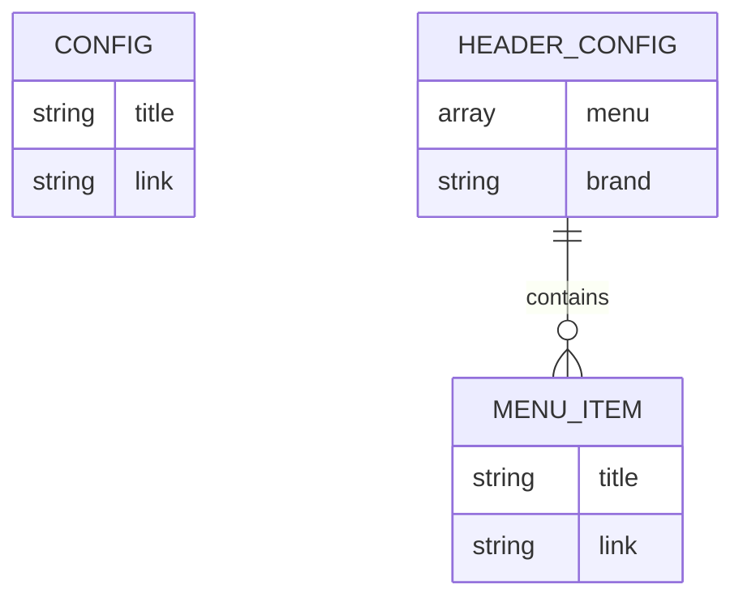
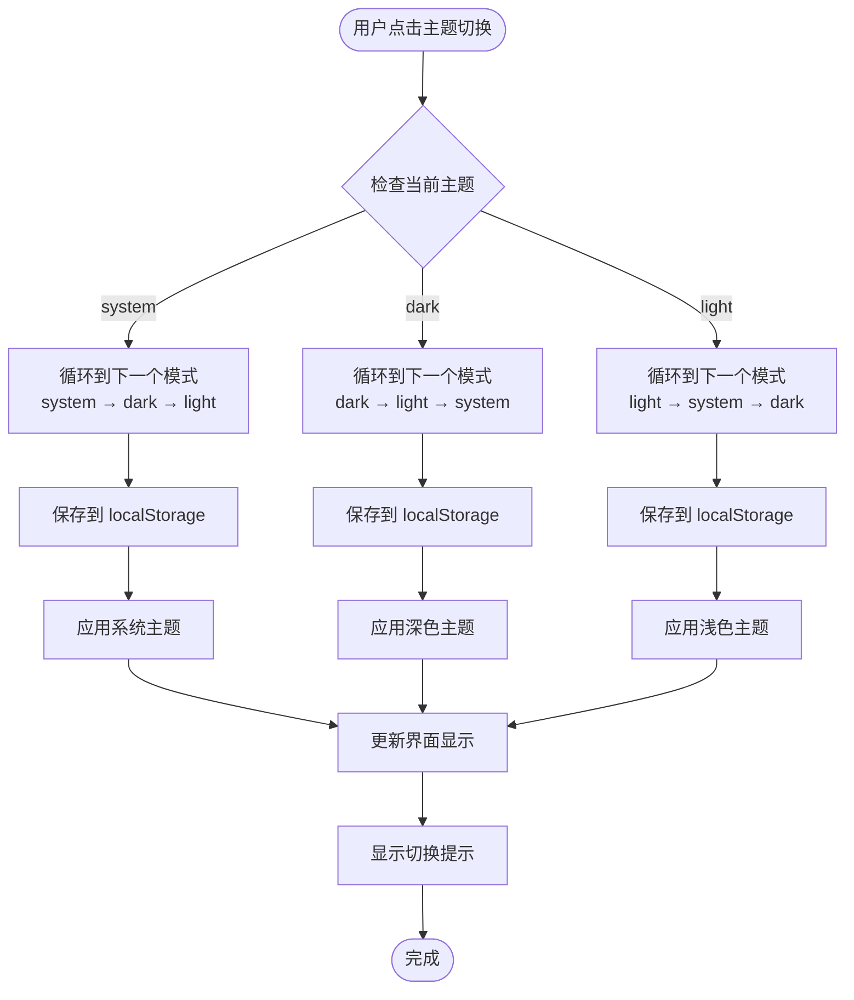
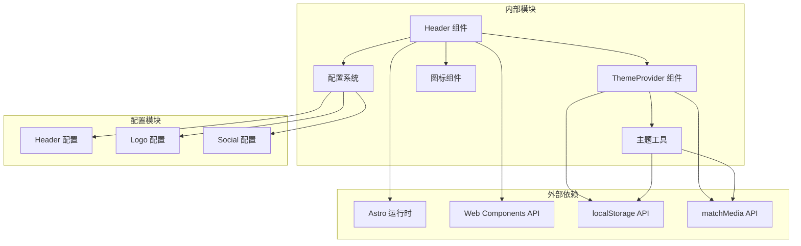

# Header 组件

<cite>
**本文档引用的文件**
- [Header.astro](file://packages/pure/components/basic/Header.astro)
- [ThemeProvider.astro](file://packages/pure/components/basic/ThemeProvider.astro)
- [header.ts](file://packages/pure/schemas/header.ts)
- [logo.ts](file://packages/pure/schemas/logo.ts)
- [social.ts](file://packages/pure/schemas/social.ts)
- [theme-config.ts](file://packages/pure/types/theme-config.ts)
- [user-config.ts](file://packages/pure/types/user-config.ts)
- [theme.ts](file://packages/pure/utils/theme.ts)
- [index.ts](file://packages/pure/utils/index.ts)
- [site.config.ts](file://src/site.config.ts)
- [BaseLayout.astro](file://src/layouts/BaseLayout.astro)
</cite>

## 目录
1. [简介](#简介)
2. [项目结构](#项目结构)
3. [核心组件](#核心组件)
4. [架构概览](#架构概览)
5. [详细组件分析](#详细组件分析)
6. [依赖关系分析](#依赖关系分析)
7. [性能考虑](#性能考虑)
8. [故障排除指南](#故障排除指南)
9. [结论](#结论)
10. [附录](#附录)

## 简介

Header 组件是 Astro-Pure 主题系统中的核心导航组件，负责提供网站的顶部导航栏功能。该组件实现了响应式设计、主题切换、动态菜单生成等功能，为用户提供一致且美观的导航体验。

## 项目结构

Header 组件位于 Astro-Pure 包的组件目录中，采用 Astro 组件格式实现，结合了客户端 JavaScript 功能来提供交互体验。



**图表来源**
- [Header.astro](file://packages/pure/components/basic/Header.astro#L1-L209)
- [site.config.ts](file://src/site.config.ts#L48-L82)
- [theme-config.ts](file://packages/pure/types/theme-config.ts#L116-L170)

**章节来源**
- [Header.astro](file://packages/pure/components/basic/Header.astro#L1-L209)
- [site.config.ts](file://src/site.config.ts#L1-L207)

## 核心组件

Header 组件是一个自定义元素，通过 Web Components 技术实现，具有以下核心特性：

### 主要功能模块

1. **导航菜单系统** - 基于站点配置动态生成的菜单项
2. **主题切换器** - 支持系统、浅色、深色三种模式切换
3. **响应式布局** - 针对不同屏幕尺寸的适配
4. **滚动行为** - 滚动时的视觉反馈和隐藏效果
5. **搜索集成** - 内置搜索功能入口

### 组件结构



**图表来源**
- [Header.astro](file://packages/pure/components/basic/Header.astro#L76-L107)
- [theme-config.ts](file://packages/pure/types/theme-config.ts#L116-L126)
- [logo.ts](file://packages/pure/schemas/logo.ts#L3-L12)

**章节来源**
- [Header.astro](file://packages/pure/components/basic/Header.astro#L7-L64)
- [theme-config.ts](file://packages/pure/types/theme-config.ts#L116-L126)

## 架构概览

Header 组件采用分层架构设计，实现了清晰的关注点分离：



**图表来源**
- [Header.astro](file://packages/pure/components/basic/Header.astro#L76-L107)
- [theme.ts](file://packages/pure/utils/theme.ts#L12-L40)
- [BaseLayout.astro](file://src/layouts/BaseLayout.astro#L27-L44)

## 详细组件分析

### 导航菜单实现

Header 组件通过虚拟配置系统动态生成导航菜单，支持完全可定制的菜单项配置。

#### 菜单数据结构



**图表来源**
- [header.ts](file://packages/pure/schemas/header.ts#L3-L17)
- [theme-config.ts](file://packages/pure/types/theme-config.ts#L116-L126)

#### 菜单渲染逻辑

菜单项通过配置驱动的方式动态渲染，每个菜单项包含标题和链接属性。

**章节来源**
- [Header.astro](file://packages/pure/components/basic/Header.astro#L24-L34)
- [header.ts](file://packages/pure/schemas/header.ts#L3-L17)

### Logo 显示系统

Logo 组件提供了灵活的图像显示方案，支持多种配置选项。

#### Logo 配置接口

| 属性名 | 类型 | 必需 | 描述 |
|--------|------|------|------|
| src | string | 是 | 图像文件的路径 |
| alt | string | 否 | 图像的替代文本描述 |

#### Logo 渲染特性

Logo 显示系统支持：
- 自适应尺寸调整
- 无障碍访问支持（alt 文本）
- 响应式布局适配

**章节来源**
- [logo.ts](file://packages/pure/schemas/logo.ts#L3-L12)
- [site.config.ts](file://src/site.config.ts#L28-L31)

### 主题切换功能

Header 组件集成了完整的主题切换功能，支持三种主题模式的无缝切换。

#### 主题模式定义



**图表来源**
- [theme.ts](file://packages/pure/utils/theme.ts#L12-L40)
- [Header.astro](file://packages/pure/components/basic/Header.astro#L88-L98)

#### 主题切换流程

1. **事件监听** - 监听用户点击主题切换按钮
2. **状态计算** - 计算下一个主题状态
3. **持久化存储** - 将主题状态保存到 localStorage
4. **样式应用** - 更新 HTML 元素的类名
5. **界面反馈** - 显示主题切换的视觉反馈

**章节来源**
- [Header.astro](file://packages/pure/components/basic/Header.astro#L87-L98)
- [theme.ts](file://packages/pure/utils/theme.ts#L12-L40)

### 响应式布局设计

Header 组件实现了完整的响应式设计，针对不同屏幕尺寸提供优化的用户体验。

#### 断点设计

| 断点 | 屏幕宽度 | 特性 |
|------|----------|------|
| 移动端 | < 640px | 折叠菜单、简化布局 |
| 平板端 | 640px - 768px | 中等复杂度布局 |
| 桌面端 | > 768px | 完整功能布局 |

#### 动画效果

Header 组件包含多个层面的动画效果：

1. **滚动动画** - 滚动时的平滑过渡效果
2. **展开动画** - 移动端菜单的展开/收起动画
3. **主题切换动画** - 主题变化时的颜色过渡效果

**章节来源**
- [Header.astro](file://packages/pure/components/basic/Header.astro#L110-L187)

### 无障碍访问支持

Header 组件全面支持无障碍访问标准，确保所有用户都能正常使用。

#### 无障碍特性

| 功能 | 实现方式 | 说明 |
|------|----------|------|
| 屏幕阅读器支持 | aria-label 属性 | 提供语义化标签 |
| 键盘导航 | 原生 HTML 行为 | 支持 Tab 键导航 |
| 高对比度支持 | CSS 变量系统 | 自动适配高对比度模式 |
| 语义化标记 | 语义化 HTML 结构 | 使用合适的 HTML 元素 |

**章节来源**
- [Header.astro](file://packages/pure/components/basic/Header.astro#L10-L14)
- [Header.astro](file://packages/pure/components/basic/Header.astro#L28-L30)

## 依赖关系分析

Header 组件的依赖关系体现了清晰的模块化设计：



**图表来源**
- [Header.astro](file://packages/pure/components/basic/Header.astro#L1-L5)
- [ThemeProvider.astro](file://packages/pure/components/basic/ThemeProvider.astro#L1-L20)

### 关键依赖关系

1. **虚拟配置系统** - 通过 `virtual:config` 模块获取站点配置
2. **主题系统** - 集成 ThemeProvider 组件实现主题切换
3. **图标系统** - 使用 Icon 组件提供统一的图标显示
4. **本地存储** - 使用 localStorage 持久化用户偏好设置

**章节来源**
- [Header.astro](file://packages/pure/components/basic/Header.astro#L1-L5)
- [ThemeProvider.astro](file://packages/pure/components/basic/ThemeProvider.astro#L1-L20)

## 性能考虑

Header 组件在设计时充分考虑了性能优化：

### 加载优化

1. **内联脚本** - 关键的初始化代码使用 `is:inline` 属性
2. **延迟加载** - 非关键资源采用延迟加载策略
3. **CSS 优化** - 使用原子化 CSS 减少样式体积

### 运行时优化

1. **事件委托** - 使用事件委托减少事件处理器数量
2. **防抖处理** - 滚动事件使用防抖技术
3. **内存管理** - 正确清理事件监听器和定时器

### 缓存策略

1. **主题状态缓存** - 使用 localStorage 缓存用户偏好
2. **配置缓存** - 虚拟配置系统提供编译时优化
3. **图标缓存** - 图标资源的浏览器缓存利用

## 故障排除指南

### 常见问题及解决方案

#### 主题切换无效

**问题描述** - 点击主题切换按钮后没有反应

**可能原因**:
1. localStorage 权限问题
2. 浏览器兼容性问题
3. 主题系统初始化失败

**解决方案**:
1. 检查浏览器控制台是否有错误信息
2. 验证 localStorage 是否可用
3. 确认 ThemeProvider 组件正确加载

#### 菜单不显示

**问题描述** - 导航菜单没有显示或显示异常

**可能原因**:
1. 配置文件格式错误
2. 菜单项链接无效
3. CSS 样式冲突

**解决方案**:
1. 检查 `site.config.ts` 中的 header 配置
2. 验证菜单项的 link 属性
3. 检查自定义 CSS 是否影响了菜单样式

#### 响应式布局问题

**问题描述** - 在移动设备上显示异常

**可能原因**:
1. 媒体查询断点设置不当
2. CSS 优先级冲突
3. 移动端触摸事件处理问题

**解决方案**:
1. 检查断点设置是否符合预期
2. 验证 CSS 选择器的优先级
3. 测试触摸手势的响应性

**章节来源**
- [Header.astro](file://packages/pure/components/basic/Header.astro#L87-L107)
- [theme.ts](file://packages/pure/utils/theme.ts#L1-L41)

## 结论

Header 组件作为 Astro-Pure 主题系统的核心组件，展现了现代前端开发的最佳实践。它通过模块化设计、响应式布局、无障碍访问支持和性能优化，为用户提供了优秀的导航体验。

组件的主要优势包括：
- **高度可定制** - 通过配置系统实现完全可定制的功能
- **响应式设计** - 针对不同设备提供优化的用户体验
- **无障碍访问** - 全面支持辅助技术
- **性能优化** - 采用多种优化策略提升加载速度
- **主题集成** - 与整体主题系统无缝集成

## 附录

### 使用示例

#### 基础配置示例

```typescript
// site.config.ts
export const theme = {
  title: '我的网站',
  header: {
    menu: [
      { title: '首页', link: '/' },
      { title: '博客', link: '/blog' },
      { title: '关于', link: '/about' }
    ]
  }
}
```

#### 高级配置示例

```typescript
// site.config.ts
export const theme = {
  title: '专业博客',
  logo: {
    src: '/images/logo.png',
    alt: '专业博客标识'
  },
  header: {
    menu: [
      { title: '文章', link: '/blog' },
      { title: '项目', link: '/projects' },
      { title: '联系', link: '/contact' }
    ]
  }
}
```

### 样式定制选项

Header 组件支持多种样式定制方式：

1. **CSS 变量** - 通过 CSS 变量控制颜色和间距
2. **类名覆盖** - 通过自定义类名覆盖默认样式
3. **原子化 CSS** - 使用 UnoCSS/TW 的原子化类名
4. **媒体查询** - 针对不同断点的样式定制

### 动画效果配置

组件内置了多种动画效果，可以通过以下方式配置：

1. **过渡时间** - 通过 CSS 变量调整动画持续时间
2. **缓动函数** - 自定义动画的缓动效果
3. **触发条件** - 控制动画的触发时机和条件