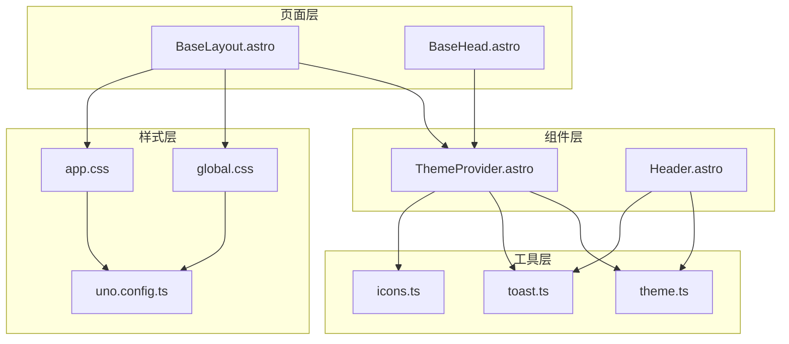
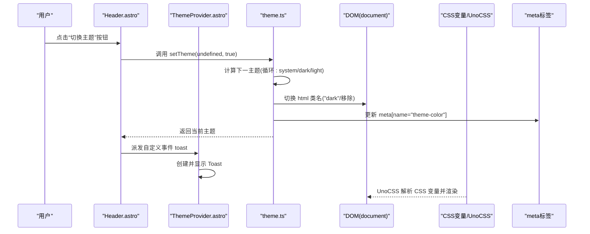
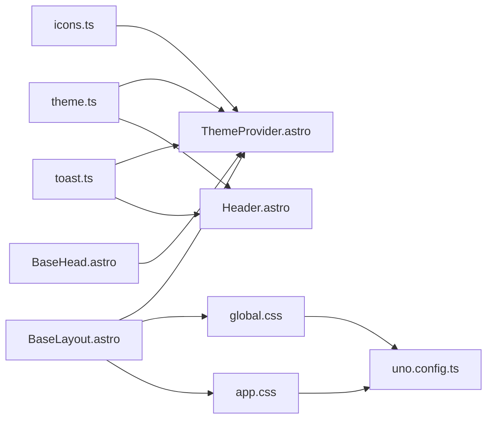

# ThemeProvider 组件

<cite>
**本文引用的文件列表**
- [ThemeProvider.astro](file://packages/pure/components/basic/ThemeProvider.astro)
- [theme.ts](file://packages/pure/utils/theme.ts)
- [toast.ts](file://packages/pure/utils/toast.ts)
- [icons.ts](file://packages/pure/libs/icons.ts)
- [app.css](file://src/assets/styles/app.css)
- [global.css](file://src/assets/styles/global.css)
- [BaseLayout.astro](file://src/layouts/BaseLayout.astro)
- [Header.astro](file://packages/pure/components/basic/Header.astro)
- [BaseHead.astro](file://src/components/BaseHead.astro)
- [uno.config.ts](file://uno.config.ts)
</cite>

## 目录
1. [简介](#简介)
2. [项目结构](#项目结构)
3. [核心组件](#核心组件)
4. [架构总览](#架构总览)
5. [组件详细分析](#组件详细分析)
6. [依赖关系分析](#依赖关系分析)
7. [性能考量](#性能考量)
8. [故障排查指南](#故障排查指南)
9. [结论](#结论)
10. [附录](#附录)

## 简介
ThemeProvider 是本项目主题系统的核心组件，负责：
- 初始化主题状态（支持“系统/浅色/深色”三态循环）
- 持久化用户偏好到浏览器本地存储
- 响应系统主题变化（如系统切换深浅模式）
- 动态注入 CSS 变量与类名，驱动全局样式切换
- 提供主题切换的可视化反馈（Toast）

该组件通过内联脚本避免首屏闪烁，结合 CSS 变量与 UnoCSS 主题映射，实现平滑的主题切换体验，并与页面头部的 meta 标签联动以优化浏览器外观。

## 项目结构
ThemeProvider 所在位置及周边样式资源分布如下：
- 组件：packages/pure/components/basic/ThemeProvider.astro
- 工具函数：packages/pure/utils/theme.ts、packages/pure/utils/toast.ts
- 图标库：packages/pure/libs/icons.ts
- 全局样式：src/assets/styles/app.css、src/assets/styles/global.css
- 页面布局：src/layouts/BaseLayout.astro
- 头部元信息：src/components/BaseHead.astro
- UnoCSS 主题映射：uno.config.ts

图表来源
- [ThemeProvider.astro](file://packages/pure/components/basic/ThemeProvider.astro#L1-L41)
- [theme.ts](file://packages/pure/utils/theme.ts#L1-L41)
- [toast.ts](file://packages/pure/utils/toast.ts#L1-L4)
- [icons.ts](file://packages/pure/libs/icons.ts#L1-L138)
- [app.css](file://src/assets/styles/app.css#L1-L48)
- [global.css](file://src/assets/styles/global.css#L1-L287)
- [BaseLayout.astro](file://src/layouts/BaseLayout.astro#L1-L92)
- [BaseHead.astro](file://src/components/BaseHead.astro#L38-L77)
- [uno.config.ts](file://uno.config.ts#L103-L192)

章节来源
- [ThemeProvider.astro](file://packages/pure/components/basic/ThemeProvider.astro#L1-L41)
- [BaseLayout.astro](file://src/layouts/BaseLayout.astro#L1-L92)

## 核心组件
- ThemeProvider.astro：内联初始化主题、监听系统主题变化、处理页面加载事件、派发 Toast 通知。
- theme.ts：主题状态管理与切换逻辑（含循环切换、系统监听、DOM 类名与 meta 更新）。
- toast.ts：统一的 Toast 事件派发器。
- app.css：定义 CSS 变量与深色类名映射，配合 UnoCSS 使用。
- global.css：通用样式与动画，依赖 CSS 变量。
- uno.config.ts：UnoCSS 主题颜色映射，将 CSS 变量转换为实际颜色值。
- BaseLayout.astro：在页面头部引入 ThemeProvider 并加载全局样式。
- Header.astro：提供主题切换按钮，调用 setTheme 并触发 Toast。
- BaseHead.astro：设置 color-scheme 与主题色 meta 标签。

章节来源
- [theme.ts](file://packages/pure/utils/theme.ts#L1-L41)
- [toast.ts](file://packages/pure/utils/toast.ts#L1-L4)
- [app.css](file://src/assets/styles/app.css#L1-L48)
- [global.css](file://src/assets/styles/global.css#L1-L287)
- [uno.config.ts](file://uno.config.ts#L103-L192)
- [BaseLayout.astro](file://src/layouts/BaseLayout.astro#L1-L92)
- [Header.astro](file://packages/pure/components/basic/Header.astro#L44-L117)
- [BaseHead.astro](file://src/components/BaseHead.astro#L38-L77)

## 架构总览
ThemeProvider 的工作流分为三个阶段：
1) 初始化阶段：读取本地存储的主题偏好，若为“系统”，则根据系统媒体查询选择深浅；随后设置 html 的类名与 meta 主题色。
2) 运行时阶段：监听系统主题变化，必要时更新主题；响应用户点击切换按钮，循环切换主题并持久化。
3) 视觉阶段：CSS 变量随主题变化而更新，UnoCSS 将其解析为具体颜色，页面元素即时呈现新主题。

图表来源
- [Header.astro](file://packages/pure/components/basic/Header.astro#L76-L108)
- [theme.ts](file://packages/pure/utils/theme.ts#L12-L40)
- [ThemeProvider.astro](file://packages/pure/components/basic/ThemeProvider.astro#L22-L40)
- [app.css](file://src/assets/styles/app.css#L1-L48)
- [uno.config.ts](file://uno.config.ts#L127-L143)

## 组件详细分析

### ThemeProvider 组件实现原理
- 内联初始化：在页面加载前执行内联脚本，避免首屏闪烁。
- 主题来源优先级：本地存储 > 系统偏好 > 默认浅色。
- DOM 操作：为 documentElement 添加/移除“dark”类名；更新 meta[name="theme-color"]。
- 事件监听：监听 astro:page-load 事件，确保 SSR 后页面仍能正确初始化。
- Toast 通知：监听自定义事件，创建并自动移除提示框。

章节来源
- [ThemeProvider.astro](file://packages/pure/components/basic/ThemeProvider.astro#L5-L20)
- [ThemeProvider.astro](file://packages/pure/components/basic/ThemeProvider.astro#L22-L40)

### 主题状态管理与持久化
- getTheme：从 localStorage 读取当前主题。
- setTheme：
  - 若传入主题值，则校验合法后可选保存；
  - 若未传入，则读取当前主题并循环切换（system/dark/light），同时保存到 localStorage；
  - 当主题为“系统”时，注册系统媒体查询监听，实时更新目标主题；
  - 更新 DOM 类名与 meta 主题色。
- listenThemeChange：仅当主题为“系统”时监听系统深浅模式变化。

章节来源
- [theme.ts](file://packages/pure/utils/theme.ts#L1-L41)

### CSS 变量注入与 UnoCSS 映射
- app.css 定义了两套 CSS 变量：:root 与 .dark，分别对应浅色与深色主题。
- UnoCSS 在 uno.config.ts 中将这些变量映射为具体颜色，使任意使用 hsl(var(--xxx)) 的样式自动适配主题。
- global.css 中大量使用 var(--foreground/--background/--muted 等)，保证全局样式随主题变化。

章节来源
- [app.css](file://src/assets/styles/app.css#L1-L48)
- [uno.config.ts](file://uno.config.ts#L127-L143)
- [global.css](file://src/assets/styles/global.css#L54-L113)

### 系统主题检测与用户偏好设置
- 系统检测：通过 window.matchMedia('(prefers-color-scheme: dark)') 获取系统偏好。
- 用户偏好：通过 localStorage 存储用户选择的主题（system/dark/light）。
- 切换循环：未显式传参时，setTheme 会按顺序循环切换，便于快速在三种模式间切换。

章节来源
- [theme.ts](file://packages/pure/utils/theme.ts#L5-L10)
- [theme.ts](file://packages/pure/utils/theme.ts#L12-L31)

### 主题切换动画与视觉反馈
- 动画：全局样式中对链接等元素设置了过渡动画，切换主题时自然呈现。
- Toast：点击按钮后派发自定义事件，ThemeProvider 接收并显示短暂提示，增强交互反馈。
- meta 主题色：根据当前主题动态更新 meta[name="theme-color"]，提升浏览器外观一致性。

章节来源
- [global.css](file://src/assets/styles/global.css#L42-L48)
- [toast.ts](file://packages/pure/utils/toast.ts#L1-L4)
- [ThemeProvider.astro](file://packages/pure/components/basic/ThemeProvider.astro#L28-L39)

### 配置选项与扩展指南
- 默认主题设置：可通过 setTheme('system'|'dark'|'light') 或在 Header 中循环切换。
- 颜色方案定制：修改 app.css 中的 CSS 变量值即可调整主题色彩；UnoCSS 会自动解析。
- 字体配置：通过 ThemeConfigSchema 的 customCss 字段引入字体资源（参考主题类型定义）。
- 主题扩展：可在 app.css 新增更多 CSS 变量键值，并在 UnoCSS 中添加对应映射规则。

章节来源
- [theme.ts](file://packages/pure/utils/theme.ts#L12-L31)
- [app.css](file://src/assets/styles/app.css#L1-L48)
- [uno.config.ts](file://uno.config.ts#L127-L143)
- [theme-config.ts](file://packages/pure/types/theme-config.ts#L76-L88)

### 使用示例
- 在页面布局中引入 ThemeProvider 并加载全局样式：
  - BaseLayout.astro 中导入 ThemeProvider 与全局样式文件。
- 在页面中使用主题切换按钮：
  - Header.astro 中的按钮绑定点击事件，调用 setTheme(undefined, true) 实现循环切换。
- 自定义主题色与图标：
  - BaseHead.astro 设置 color-scheme 与主题色 meta；
  - icons.ts 提供多种图标，用于切换按钮的视觉表达。

章节来源
- [BaseLayout.astro](file://src/layouts/BaseLayout.astro#L1-L92)
- [Header.astro](file://packages/pure/components/basic/Header.astro#L76-L108)
- [BaseHead.astro](file://src/components/BaseHead.astro#L46-L48)
- [icons.ts](file://packages/pure/libs/icons.ts#L1-L138)

### 性能优化建议
- 内联初始化：ThemeProvider 使用 is:inline 脚本，减少阻塞，避免首屏闪烁。
- 事件去抖：系统主题监听仅在主题为“系统”时启用，避免不必要的重绘。
- CSS 变量：通过 CSS 变量与 UnoCSS 映射，减少重复样式的编写与计算。
- 动画节流：全局动画采用较短时长，兼顾流畅与性能。

章节来源
- [ThemeProvider.astro](file://packages/pure/components/basic/ThemeProvider.astro#L5-L20)
- [theme.ts](file://packages/pure/utils/theme.ts#L5-L10)
- [global.css](file://src/assets/styles/global.css#L1-L23)

## 依赖关系分析
- 组件依赖：
  - ThemeProvider 依赖 theme.ts（主题状态）、toast.ts（通知）、icons.ts（图标）。
  - Header 依赖 theme.ts 与 toast.ts，用于按钮交互与反馈。
- 样式依赖：
  - app.css 与 global.css 依赖 UnoCSS 的变量映射。
  - BaseLayout 引入 app.css 与 global.css，确保所有页面生效。
- 元信息依赖：
  - BaseHead 提供 color-scheme 与 theme-color 的初始 meta 标签，ThemeProvider 动态更新 theme-color。

图表来源
- [theme.ts](file://packages/pure/utils/theme.ts#L1-L41)
- [toast.ts](file://packages/pure/utils/toast.ts#L1-L4)
- [icons.ts](file://packages/pure/libs/icons.ts#L1-L138)
- [ThemeProvider.astro](file://packages/pure/components/basic/ThemeProvider.astro#L1-L41)
- [Header.astro](file://packages/pure/components/basic/Header.astro#L76-L108)
- [app.css](file://src/assets/styles/app.css#L1-L48)
- [global.css](file://src/assets/styles/global.css#L1-L287)
- [uno.config.ts](file://uno.config.ts#L127-L143)
- [BaseLayout.astro](file://src/layouts/BaseLayout.astro#L1-L92)
- [BaseHead.astro](file://src/components/BaseHead.astro#L38-L77)

## 性能考量
- 首屏渲染：内联脚本在页面加载早期执行，避免因异步加载导致的闪烁。
- 事件监听：仅在需要时监听系统主题变化，降低主线程负担。
- CSS 变量：通过变量与 UnoCSS 映射，减少重复计算与样式表体积。
- 动画与过渡：全局动画时长适中，兼顾用户体验与性能。

[本节为通用指导，不直接分析特定文件]

## 故障排查指南
- 主题未生效或闪烁：
  - 检查是否在 BaseLayout 中正确引入 ThemeProvider 与全局样式。
  - 确认内联脚本是否在页面加载早期执行。
- 主题切换无效：
  - 确认 Header 中按钮是否正确调用 setTheme(undefined, true)。
  - 检查 localStorage 是否被禁用或清理。
- 浏览器外观未更新：
  - 确认 meta[name="theme-color"] 是否被正确更新。
  - 检查 BaseHead 是否设置 color-scheme。
- 动画异常：
  - 检查 global.css 中动画相关规则是否被覆盖。
  - 确认 UnoCSS 变量映射是否正确。

章节来源
- [BaseLayout.astro](file://src/layouts/BaseLayout.astro#L1-L92)
- [Header.astro](file://packages/pure/components/basic/Header.astro#L76-L108)
- [theme.ts](file://packages/pure/utils/theme.ts#L12-L40)
- [BaseHead.astro](file://src/components/BaseHead.astro#L46-L48)
- [global.css](file://src/assets/styles/global.css#L1-L23)

## 结论
ThemeProvider 通过“内联初始化 + CSS 变量 + UnoCSS 映射”的组合，实现了高性能、低耦合的主题系统。它不仅支持用户偏好持久化与系统主题联动，还提供了直观的视觉反馈与一致的浏览器外观体验。配合 Header 的按钮与 BaseLayout 的样式引入，开发者可以轻松在应用中集成并扩展主题能力。

[本节为总结性内容，不直接分析特定文件]

## 附录
- 主题状态循环：system → dark → light → system（循环）
- 支持的主题值：['system','dark','light']
- 关键 DOM 操作：为 documentElement 添加/移除“dark”类名；更新 meta[name="theme-color"]

章节来源
- [theme.ts](file://packages/pure/utils/theme.ts#L12-L31)
- [app.css](file://src/assets/styles/app.css#L1-L48)