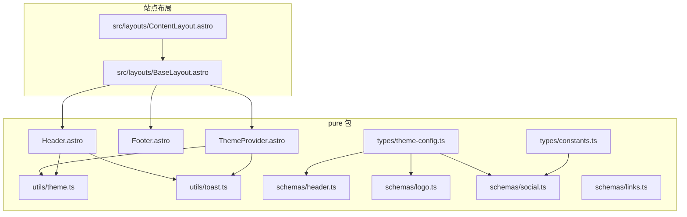
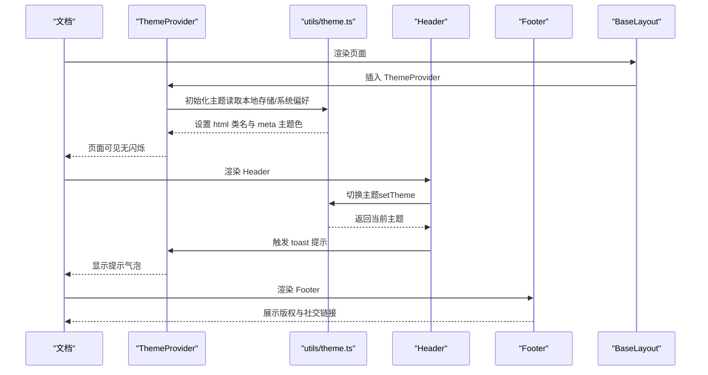
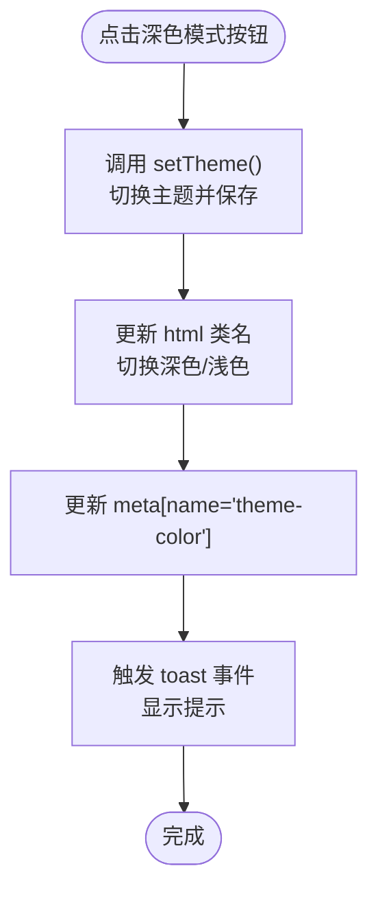
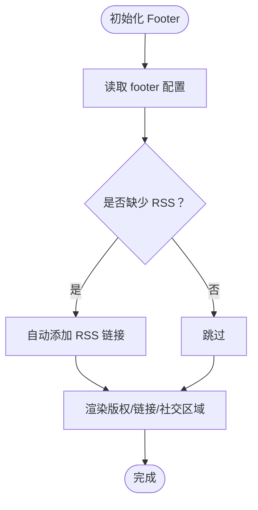
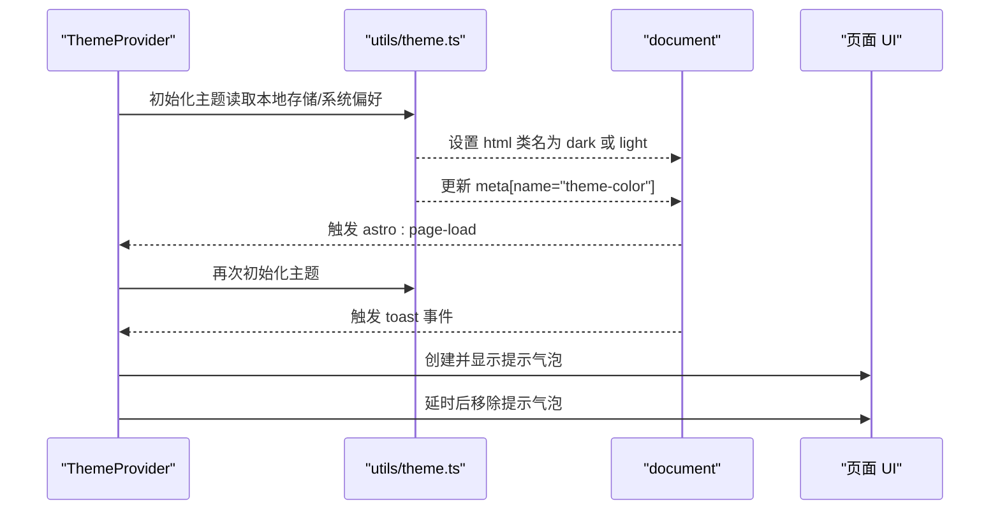
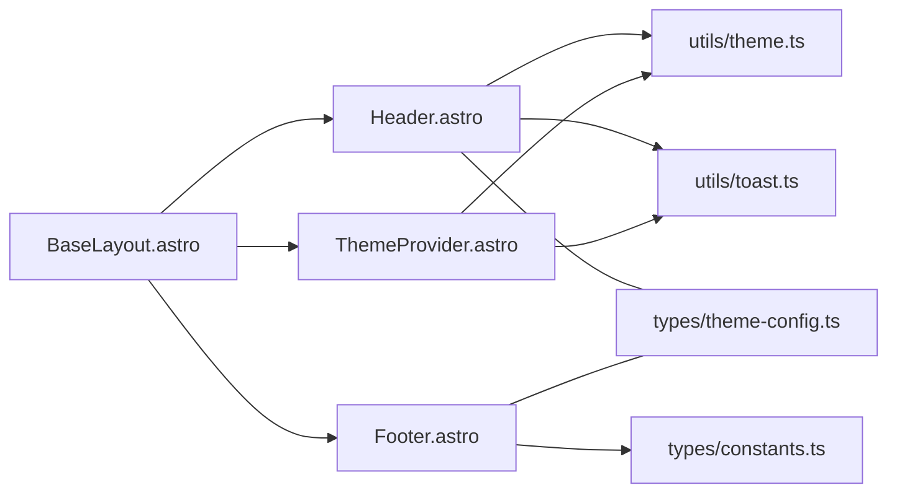

# 基础组件

<cite>
**本文引用的文件**
- [packages/pure/components/basic/Header.astro](file://packages/pure/components/basic/Header.astro)
- [packages/pure/components/basic/Footer.astro](file://packages/pure/components/basic/Footer.astro)
- [packages/pure/components/basic/ThemeProvider.astro](file://packages/pure/components/basic/ThemeProvider.astro)
- [packages/pure/utils/theme.ts](file://packages/pure/utils/theme.ts)
- [packages/pure/utils/toast.ts](file://packages/pure/utils/toast.ts)
- [packages/pure/schemas/header.ts](file://packages/pure/schemas/header.ts)
- [packages/pure/schemas/logo.ts](file://packages/pure/schemas/logo.ts)
- [packages/pure/schemas/social.ts](file://packages/pure/schemas/social.ts)
- [packages/pure/schemas/links.ts](file://packages/pure/schemas/links.ts)
- [packages/pure/types/theme-config.ts](file://packages/pure/types/theme-config.ts)
- [packages/pure/types/constants.ts](file://packages/pure/types/constants.ts)
- [src/layouts/BaseLayout.astro](file://src/layouts/BaseLayout.astro)
- [src/layouts/ContentLayout.astro](file://src/layouts/ContentLayout.astro)
</cite>

## 目录
1. [简介](#简介)
2. [项目结构](#项目结构)
3. [核心组件](#核心组件)
4. [架构总览](#架构总览)
5. [详细组件分析](#详细组件分析)
6. [依赖关系分析](#依赖关系分析)
7. [性能考量](#性能考量)
8. [故障排查指南](#故障排查指南)
9. [结论](#结论)
10. [附录](#附录)

## 简介
本文件面向开发者，系统化梳理并说明基础组件体系中的三大核心组件：Header（页头）、Footer（页脚）、ThemeProvider（主题提供器）。文档覆盖以下方面：
- 组件职责与功能边界
- 配置项与类型定义
- 交互流程与事件处理
- 样式与可定制性
- 实际使用示例与最佳实践
- 潜在问题定位与优化建议

## 项目结构
基础组件位于 pure 包的 basic 目录中，配合统一的配置 Schema 与工具函数共同工作；在站点布局中通过 BaseLayout 引入并在各页面生效。

图表来源
- [packages/pure/components/basic/Header.astro](file://packages/pure/components/basic/Header.astro#L1-L209)
- [packages/pure/components/basic/Footer.astro](file://packages/pure/components/basic/Footer.astro#L1-L91)
- [packages/pure/components/basic/ThemeProvider.astro](file://packages/pure/components/basic/ThemeProvider.astro#L1-L41)
- [packages/pure/utils/theme.ts](file://packages/pure/utils/theme.ts#L1-L41)
- [packages/pure/utils/toast.ts](file://packages/pure/utils/toast.ts#L1-L4)
- [packages/pure/schemas/header.ts](file://packages/pure/schemas/header.ts#L1-L18)
- [packages/pure/schemas/logo.ts](file://packages/pure/schemas/logo.ts#L1-L13)
- [packages/pure/schemas/social.ts](file://packages/pure/schemas/social.ts#L1-L45)
- [packages/pure/schemas/links.ts](file://packages/pure/schemas/links.ts#L1-L31)
- [packages/pure/types/theme-config.ts](file://packages/pure/types/theme-config.ts#L1-L193)
- [packages/pure/types/constants.ts](file://packages/pure/types/constants.ts#L1-L21)
- [src/layouts/BaseLayout.astro](file://src/layouts/BaseLayout.astro#L1-L92)
- [src/layouts/ContentLayout.astro](file://src/layouts/ContentLayout.astro#L1-L156)

章节来源
- [src/layouts/BaseLayout.astro](file://src/layouts/BaseLayout.astro#L1-L92)
- [src/layouts/ContentLayout.astro](file://src/layouts/ContentLayout.astro#L1-L156)

## 核心组件
- Header（页头）
  - 职责：展示站点标题、导航菜单、搜索入口、深色模式切换按钮；支持移动端菜单展开与滚动隐藏行为。
  - 关键点：读取配置生成菜单；通过自定义元素与脚本实现交互；使用 CSS 变量与暗色类名驱动视觉。
- Footer（页脚）
  - 职责：展示版权年份、作者信息、链接列表（按位置分组）、“由某框架/主题提供”声明以及社交图标链接。
  - 关键点：自动补齐 RSS 社交链接；支持自定义链接样式与位置；统一使用语义化标签与无障碍属性。
- ThemeProvider（主题提供器）
  - 职责：在页面加载时根据本地存储或系统偏好设置主题；注入深色类名与主题色 meta；监听主题变更事件并显示提示气泡。
  - 关键点：内联脚本避免闪烁；事件驱动的跨组件通信；与工具函数协同完成主题切换。

章节来源
- [packages/pure/components/basic/Header.astro](file://packages/pure/components/basic/Header.astro#L1-L209)
- [packages/pure/components/basic/Footer.astro](file://packages/pure/components/basic/Footer.astro#L1-L91)
- [packages/pure/components/basic/ThemeProvider.astro](file://packages/pure/components/basic/ThemeProvider.astro#L1-L41)

## 架构总览
下图展示了基础组件在页面生命周期中的协作关系与数据流。

图表来源
- [packages/pure/components/basic/ThemeProvider.astro](file://packages/pure/components/basic/ThemeProvider.astro#L1-L41)
- [packages/pure/utils/theme.ts](file://packages/pure/utils/theme.ts#L1-L41)
- [packages/pure/utils/toast.ts](file://packages/pure/utils/toast.ts#L1-L4)
- [packages/pure/components/basic/Header.astro](file://packages/pure/components/basic/Header.astro#L1-L209)
- [packages/pure/components/basic/Footer.astro](file://packages/pure/components/basic/Footer.astro#L1-L91)
- [src/layouts/BaseLayout.astro](file://src/layouts/BaseLayout.astro#L1-L92)

## 详细组件分析

### Header 组件
- 功能概览
  - 导航菜单：从配置读取菜单项，渲染为链接列表。
  - Logo/标题：使用站点配置中的标题作为品牌标识。
  - 主题切换：点击按钮循环切换主题（system/dark/light），并持久化到本地存储。
  - 移动端菜单：点击菜单按钮展开/收起，支持滚动隐藏。
  - 搜索入口：提供站内搜索跳转。
- 交互与事件
  - 滚动监听：根据滚动位置切换类名以控制外观与隐藏。
  - 主题切换：调用工具函数切换主题并更新按钮状态，同时触发 toast 提示。
  - 菜单展开：切换自定义元素类名控制展开态。
- 样式与可定制
  - 使用 CSS 变量与暗色类名组合实现主题感知。
  - 支持不同断点下的布局与阴影效果。
- 配置与类型
  - 菜单项结构：标题与链接。
  - 默认菜单项集合。
- 使用方式
  - 在布局中直接引入组件即可生效。
- 最佳实践
  - 将常用导航项加入配置，保持一致性。
  - 为菜单项提供清晰的 aria-label 与可访问性属性。
  - 控制移动端菜单的动画与阴影，避免过度视觉负担。

图表来源
- [packages/pure/components/basic/Header.astro](file://packages/pure/components/basic/Header.astro#L74-L108)
- [packages/pure/utils/theme.ts](file://packages/pure/utils/theme.ts#L12-L40)
- [packages/pure/utils/toast.ts](file://packages/pure/utils/toast.ts#L1-L4)

章节来源
- [packages/pure/components/basic/Header.astro](file://packages/pure/components/basic/Header.astro#L1-L209)
- [packages/pure/schemas/header.ts](file://packages/pure/schemas/header.ts#L1-L18)

### Footer 组件
- 功能概览
  - 版权信息：展示年份与作者名称。
  - 链接列表：支持两组位置（pos=1/2）的链接，可自定义样式。
  - 主题声明：可选显示“由某框架/主题提供”的声明。
  - 社交链接：基于配置渲染社交平台图标与链接，自动补齐 RSS。
- 无障碍与 SEO
  - 所有链接均具备 aria-label 或语义化结构。
  - 社交链接使用平台枚举，确保 URL 合法性。
- 样式与可定制
  - 统一的链接样式与下划线风格。
  - 支持在链接上应用自定义 class。
- 使用方式
  - 在布局中直接引入组件即可生效。
- 最佳实践
  - 优先使用配置项维护链接，减少硬编码。
  - 为重要链接提供明确的 label，提升可访问性。
  - RSS 链接可由配置覆盖，确保订阅入口稳定。

图表来源
- [packages/pure/components/basic/Footer.astro](file://packages/pure/components/basic/Footer.astro#L1-L91)
- [packages/pure/schemas/social.ts](file://packages/pure/schemas/social.ts#L1-L45)
- [packages/pure/types/constants.ts](file://packages/pure/types/constants.ts#L1-L21)

章节来源
- [packages/pure/components/basic/Footer.astro](file://packages/pure/components/basic/Footer.astro#L1-L91)
- [packages/pure/schemas/social.ts](file://packages/pure/schemas/social.ts#L1-L45)
- [packages/pure/types/constants.ts](file://packages/pure/types/constants.ts#L1-L21)

### ThemeProvider 组件
- 功能概览
  - 内联初始化：在页面加载早期根据本地存储或系统偏好设置主题，避免闪烁。
  - 事件监听：监听主题变更事件，动态更新界面与提示。
  - 提示气泡：接收 toast 事件后创建临时提示元素并自动移除。
- 与工具函数的关系
  - setTheme：负责解析主题值、切换类名与 meta 主题色。
  - listenThemeChange：监听系统主题变化，必要时更新主题。
- 使用方式
  - 在页面头部引入一次即可全局生效。
- 最佳实践
  - 保持本地存储与系统偏好的同步，避免冲突。
  - 为提示气泡提供合理的显示时长与内容。

图表来源
- [packages/pure/components/basic/ThemeProvider.astro](file://packages/pure/components/basic/ThemeProvider.astro#L1-L41)
- [packages/pure/utils/theme.ts](file://packages/pure/utils/theme.ts#L1-L41)

章节来源
- [packages/pure/components/basic/ThemeProvider.astro](file://packages/pure/components/basic/ThemeProvider.astro#L1-L41)
- [packages/pure/utils/theme.ts](file://packages/pure/utils/theme.ts#L1-L41)

## 依赖关系分析
- Header 依赖
  - 配置：来自虚拟配置模块，菜单项来源于配置 Schema。
  - 工具：调用主题工具与 toast 工具。
- Footer 依赖
  - 配置：footer 年份、链接、社交等字段来自配置 Schema。
  - 常量：社交平台枚举来自常量文件。
- ThemeProvider 依赖
  - 工具：主题工具负责切换与监听；toast 事件用于提示。
- 布局集成
  - BaseLayout 中引入 Header、Footer、ThemeProvider，并包裹页面主体内容。

图表来源
- [src/layouts/BaseLayout.astro](file://src/layouts/BaseLayout.astro#L1-L92)
- [packages/pure/components/basic/Header.astro](file://packages/pure/components/basic/Header.astro#L1-L209)
- [packages/pure/components/basic/Footer.astro](file://packages/pure/components/basic/Footer.astro#L1-L91)
- [packages/pure/components/basic/ThemeProvider.astro](file://packages/pure/components/basic/ThemeProvider.astro#L1-L41)
- [packages/pure/utils/theme.ts](file://packages/pure/utils/theme.ts#L1-L41)
- [packages/pure/utils/toast.ts](file://packages/pure/utils/toast.ts#L1-L4)
- [packages/pure/types/theme-config.ts](file://packages/pure/types/theme-config.ts#L1-L193)
- [packages/pure/types/constants.ts](file://packages/pure/types/constants.ts#L1-L21)

章节来源
- [src/layouts/BaseLayout.astro](file://src/layouts/BaseLayout.astro#L1-L92)
- [packages/pure/components/basic/Header.astro](file://packages/pure/components/basic/Header.astro#L1-L209)
- [packages/pure/components/basic/Footer.astro](file://packages/pure/components/basic/Footer.astro#L1-L91)
- [packages/pure/components/basic/ThemeProvider.astro](file://packages/pure/components/basic/ThemeProvider.astro#L1-L41)

## 性能考量
- ThemeProvider 内联初始化
  - 通过内联脚本尽早设置主题，避免页面闪烁与重排抖动。
- Header 动画与过渡
  - 使用 CSS 过渡属性控制外观变化，避免 JavaScript 频繁操作 DOM。
- Footer 渲染
  - 仅在需要时渲染社交链接与声明，减少不必要的节点数量。
- 建议
  - 避免在 Header/ThemeProvider 中进行重型计算或频繁写入 DOM。
  - 对于大量菜单项，考虑懒加载或分页策略。

## 故障排查指南
- 主题未生效或闪烁
  - 检查 ThemeProvider 是否在页面头部正确引入且为内联执行。
  - 确认本地存储中的主题值合法（system/dark/light）。
- 点击深色模式按钮无效
  - 确认 Header 组件已绑定点击事件并调用 setTheme。
  - 检查浏览器控制台是否存在错误。
- 社交链接缺失或不显示
  - 确认 footer 配置中 social 字段存在且 URL 合法。
  - 若未配置 RSS，组件会自动补齐默认 RSS 链接。
- 提示气泡不出现
  - 确认 Header/ThemeProvider 正确触发 toast 事件。
  - 检查 document 上是否监听了 toast 事件。

章节来源
- [packages/pure/components/basic/ThemeProvider.astro](file://packages/pure/components/basic/ThemeProvider.astro#L1-L41)
- [packages/pure/utils/theme.ts](file://packages/pure/utils/theme.ts#L1-L41)
- [packages/pure/utils/toast.ts](file://packages/pure/utils/toast.ts#L1-L4)
- [packages/pure/components/basic/Header.astro](file://packages/pure/components/basic/Header.astro#L74-L108)
- [packages/pure/components/basic/Footer.astro](file://packages/pure/components/basic/Footer.astro#L1-L91)

## 结论
Header、Footer、ThemeProvider 三者构成站点的基础骨架：Header 负责导航与主题控制，Footer 提供版权与社交信息，ThemeProvider 则保障主题一致性与体验流畅。通过配置 Schema 与工具函数的协作，组件具备良好的扩展性与可维护性。建议在项目中遵循本文的最佳实践，确保一致的用户体验与可访问性。

## 附录

### 配置与类型参考
- 主题配置 Schema（节选）
  - header.menu：数组，包含标题与链接的对象。
  - footer.year、footer.links、footer.credits、footer.social：分别对应版权年份、链接列表、声明开关与社交链接。
  - customCss、locale、titleDelimiter 等：其他主题级配置。
- 社交平台枚举
  - 支持的平台包括：github、gitlab、discord、youtube、instagram、x、telegram、rss、email、reddit、bluesky、tiktok、weibo、steam、bilibili、zhihu、coolapk、netease。
- 菜单项默认值
  - 默认包含 Blog、Projects、Links、About 四个菜单项。

章节来源
- [packages/pure/types/theme-config.ts](file://packages/pure/types/theme-config.ts#L116-L170)
- [packages/pure/schemas/header.ts](file://packages/pure/schemas/header.ts#L1-L18)
- [packages/pure/schemas/social.ts](file://packages/pure/schemas/social.ts#L1-L45)
- [packages/pure/types/constants.ts](file://packages/pure/types/constants.ts#L1-L21)

### 使用示例与最佳实践
- 在布局中引入组件
  - 在 BaseLayout 中引入 Header、Footer、ThemeProvider，并在页面主体中放置内容插槽。
- 自定义菜单与社交
  - 在主题配置中设置 header.menu 与 footer.social，确保链接合法且语义清晰。
- 主题切换与提示
  - Header 的主题切换按钮会自动保存到本地存储并触发 toast 提示，无需额外代码。
- 可访问性
  - 为所有链接提供 aria-label；为按钮提供 sr-only 文本描述。

章节来源
- [src/layouts/BaseLayout.astro](file://src/layouts/BaseLayout.astro#L24-L49)
- [packages/pure/components/basic/Header.astro](file://packages/pure/components/basic/Header.astro#L10-L64)
- [packages/pure/components/basic/Footer.astro](file://packages/pure/components/basic/Footer.astro#L19-L82)
- [packages/pure/components/basic/ThemeProvider.astro](file://packages/pure/components/basic/ThemeProvider.astro#L5-L20)