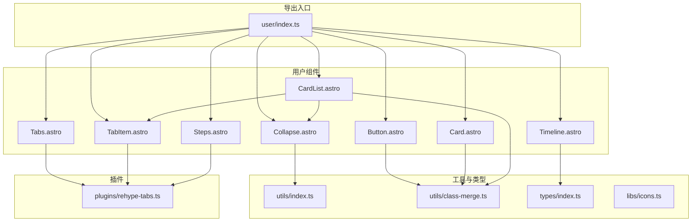
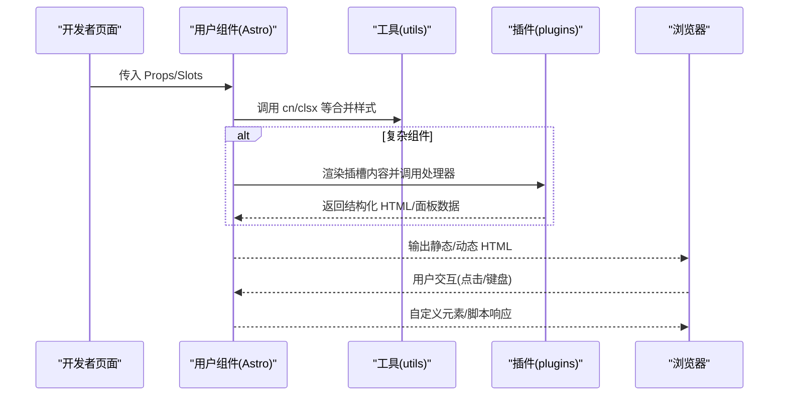
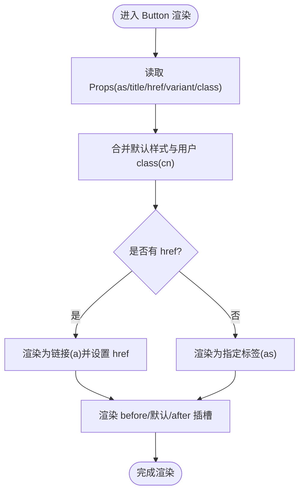
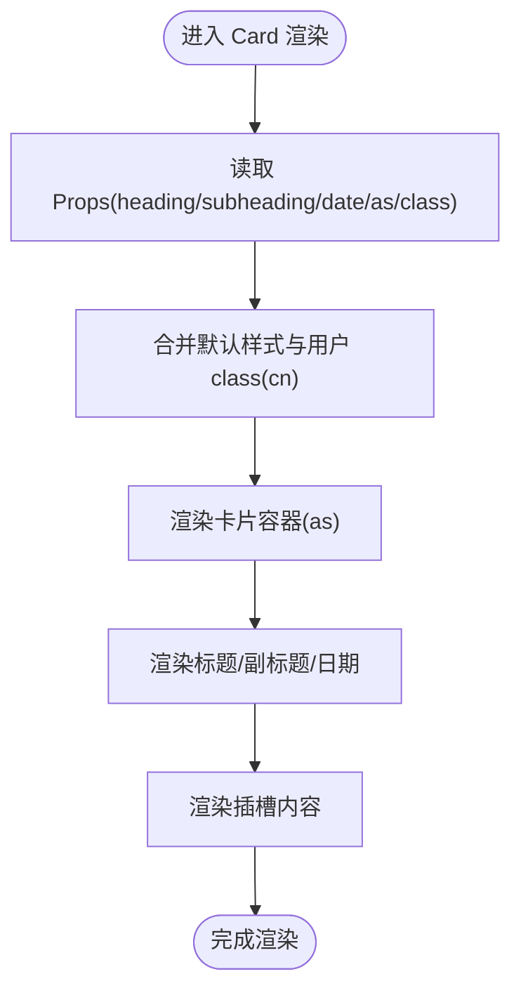
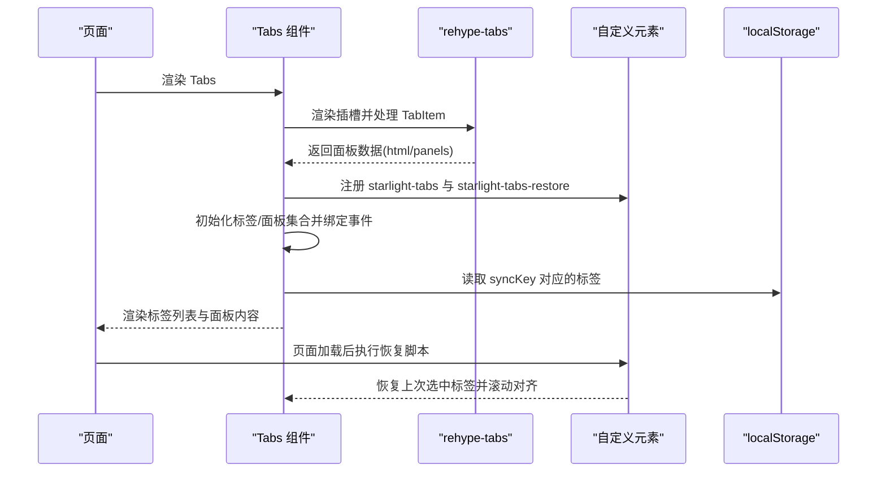
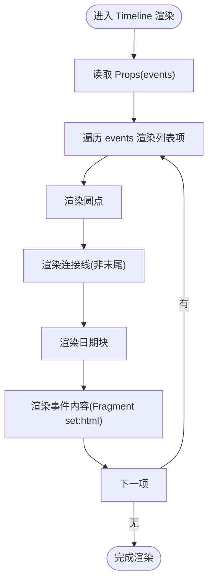
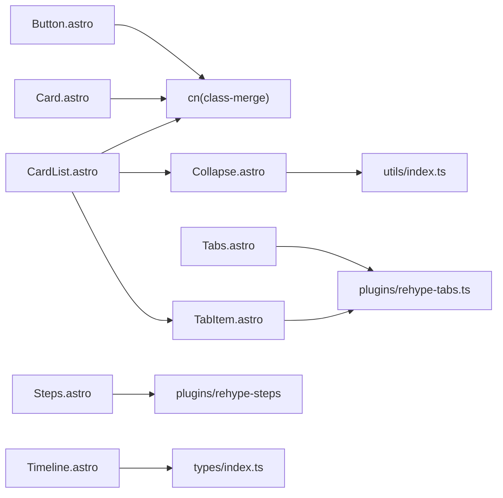

# 用户组件

<cite>
**本文引用的文件**
- [packages/pure/components/user/Button.astro](file://packages/pure/components/user/Button.astro)
- [packages/pure/components/user/Card.astro](file://packages/pure/components/user/Card.astro)
- [packages/pure/components/user/Tabs.astro](file://packages/pure/components/user/Tabs.astro)
- [packages/pure/components/user/TabItem.astro](file://packages/pure/components/user/TabItem.astro)
- [packages/pure/components/user/Timeline.astro](file://packages/pure/components/user/Timeline.astro)
- [packages/pure/components/user/Collapse.astro](file://packages/pure/components/user/Collapse.astro)
- [packages/pure/components/user/CardList.astro](file://packages/pure/components/user/CardList.astro)
- [packages/pure/components/user/Steps.astro](file://packages/pure/components/user/Steps.astro)
- [packages/pure/components/user/index.ts](file://packages/pure/components/user/index.ts)
- [packages/pure/plugins/rehype-tabs.ts](file://packages/pure/plugins/rehype-tabs.ts)
- [packages/pure/utils/index.ts](file://packages/pure/utils/index.ts)
- [packages/pure/utils/class-merge.ts](file://packages/pure/utils/class-merge.ts)
- [packages/pure/types/index.ts](file://packages/pure/types/index.ts)
- [packages/pure/libs/icons.ts](file://packages/pure/libs/icons.ts)
- [packages/pure/package.json](file://packages/pure/package.json)
</cite>

## 目录
1. [简介](#简介)
2. [项目结构](#项目结构)
3. [核心组件](#核心组件)
4. [架构总览](#架构总览)
5. [详细组件分析](#详细组件分析)
6. [依赖关系分析](#依赖关系分析)
7. [性能考量](#性能考量)
8. [故障排查指南](#故障排查指南)
9. [结论](#结论)
10. [附录](#附录)

## 简介
本指南面向希望在 Astro Pure 主题系统中创建与集成自定义 UI 组件的开发者。文档以 Button、Card、Tabs、Timeline 等组件为例，系统讲解设计理念、实现模式、Props 设计、事件处理、样式封装与可访问性、生命周期与状态管理、数据流设计、测试与调试策略，以及组件发布与版本管理建议。目标是帮助你构建高质量、可复用且易于维护的用户组件。

## 项目结构
Pure 主题将用户组件集中于 packages/pure/components/user 目录，采用“按功能分组 + 按类型导出”的组织方式：
- 组件按功能分组：容器类（如 Card、Collapse）、列表类（如 Timeline、CardList、Steps）、简单文本渲染（如 Button、Spoiler、Label、Svg）等。
- 统一通过 index.ts 导出，便于外部按需引入。
- 与组件配套的工具与类型位于 utils、types、libs 中；Tabs 等复杂组件使用 plugins 进行内容预处理。

图表来源
- [packages/pure/components/user/index.ts](file://packages/pure/components/user/index.ts#L1-L23)
- [packages/pure/utils/index.ts](file://packages/pure/utils/index.ts#L1-L18)
- [packages/pure/utils/class-merge.ts](file://packages/pure/utils/class-merge.ts#L1-L20)
- [packages/pure/types/index.ts](file://packages/pure/types/index.ts#L1-L33)
- [packages/pure/libs/icons.ts](file://packages/pure/libs/icons.ts#L1-L138)
- [packages/pure/plugins/rehype-tabs.ts](file://packages/pure/plugins/rehype-tabs.ts#L1-L113)

章节来源
- [packages/pure/components/user/index.ts](file://packages/pure/components/user/index.ts#L1-L23)

## 核心组件
本节概览四个重点组件的设计要点与实现模式，为后续深入分析打基础。

- Button：支持多形态变体（pill/back/ahead），支持多标签多态渲染，具备无障碍属性与悬停动画。
- Card：卡片容器，支持标题、副标题、日期与链接跳转，hover 增强视觉反馈。
- Tabs：基于自定义元素与 rehype 插件的标签页系统，支持本地存储同步与键盘导航。
- Timeline：时间线渲染，接收事件数组，逐条绘制圆点、连接线与时间标签。

章节来源
- [packages/pure/components/user/Button.astro](file://packages/pure/components/user/Button.astro#L1-L91)
- [packages/pure/components/user/Card.astro](file://packages/pure/components/user/Card.astro#L1-L33)
- [packages/pure/components/user/Tabs.astro](file://packages/pure/components/user/Tabs.astro#L1-L270)
- [packages/pure/components/user/Timeline.astro](file://packages/pure/components/user/Timeline.astro#L1-L39)

## 架构总览
用户组件与主题系统的交互路径如下：
- 组件通过 Astro.props 接收输入，结合 cn 等工具函数进行样式合并。
- 复杂组件（Tabs、Steps）借助 plugins 在构建期对内容进行转换，生成结构化 HTML 与面板数据。
- 组件内部通过自定义元素与脚本实现交互逻辑（Tabs、Collapse）。
- 类型与图标库提供统一的数据契约与资源。

图表来源
- [packages/pure/utils/class-merge.ts](file://packages/pure/utils/class-merge.ts#L1-L20)
- [packages/pure/plugins/rehype-tabs.ts](file://packages/pure/plugins/rehype-tabs.ts#L104-L113)
- [packages/pure/components/user/Tabs.astro](file://packages/pure/components/user/Tabs.astro#L1-L270)
- [packages/pure/components/user/Collapse.astro](file://packages/pure/components/user/Collapse.astro#L58-L83)

## 详细组件分析

### Button 组件
- 设计理念
  - 多态渲染：通过 as 属性支持任意 HTML 标签，兼顾 a/按钮/自定义元素。
  - 变体设计：pill/back/ahead 等变体满足不同语义场景。
  - 无障碍与动效：提供 hover 效果与无障碍属性，增强可用性。
- 实现要点
  - Props：as、title、href、variant、target、class 等。
  - 样式：使用 cn 合并默认样式与用户传入 class。
  - 插槽：before/after 支持前后缀图标或装饰元素。
  - 行为：根据是否带 href 决定鼠标指针与可点击性。
- 最佳实践
  - 明确语义：链接用 a 并设置 href；触发器用 button 或自定义元素。
  - 变体选择：优先使用内置变体，避免过度定制破坏一致性。
  - 可访问性：为图标提供可读文本，确保 hover 与焦点状态一致。

图表来源
- [packages/pure/components/user/Button.astro](file://packages/pure/components/user/Button.astro#L15-L30)
- [packages/pure/utils/class-merge.ts](file://packages/pure/utils/class-merge.ts#L17-L19)

章节来源
- [packages/pure/components/user/Button.astro](file://packages/pure/components/user/Button.astro#L1-L91)
- [packages/pure/utils/class-merge.ts](file://packages/pure/utils/class-merge.ts#L1-L20)

### Card 组件
- 设计理念
  - 卡片容器，承载标题、副标题、日期与正文内容。
  - 支持链接跳转，hover 提升视觉反馈。
- 实现要点
  - Props：heading/subheading/date/as/class。
  - 样式：默认圆角边框与背景，hover 时边框与阴影变化。
  - 结构：标题区与插槽内容区分离。
- 最佳实践
  - 内容分层：标题/副标题/日期清晰分层，避免信息拥挤。
  - 链接语义：若卡片可点击，使用 a 标签并提供 title/aria-label。

图表来源
- [packages/pure/components/user/Card.astro](file://packages/pure/components/user/Card.astro#L13-L32)
- [packages/pure/utils/class-merge.ts](file://packages/pure/utils/class-merge.ts#L17-L19)

章节来源
- [packages/pure/components/user/Card.astro](file://packages/pure/components/user/Card.astro#L1-L33)
- [packages/pure/utils/class-merge.ts](file://packages/pure/utils/class-merge.ts#L1-L20)

### Tabs 组件
- 设计理念
  - 基于自定义元素 starlight-tabs 与 starlight-tab-item 的标签页系统。
  - 支持本地存储同步（syncKey），跨页面恢复当前激活标签。
  - 键盘导航与无障碍属性完善。
- 实现要点
  - 插件 rehype-tabs：解析 TabItem 标签，生成面板 ID、标签 ID 与 aria 关联。
  - 组件 Tabs：渲染标签列表与面板内容，内联脚本处理同步与切换。
  - 自定义元素：starlight-tabs-restore 用于页面加载后恢复上次选中项。
- 生命周期与状态
  - connectedCallback：初始化标签与面板集合，绑定事件监听。
  - 切换逻辑：更新 aria-selected/tabindex/hidden，必要时滚动对齐。
  - 同步机制：localStorage 存储选中标签，跨实例同步。
- 数据流
  - 输入：插槽中的 TabItem 列表。
  - 输出：标签列表 + 面板内容 + 同步脚本。

图表来源
- [packages/pure/components/user/Tabs.astro](file://packages/pure/components/user/Tabs.astro#L1-L270)
- [packages/pure/plugins/rehype-tabs.ts](file://packages/pure/plugins/rehype-tabs.ts#L104-L113)

章节来源
- [packages/pure/components/user/Tabs.astro](file://packages/pure/components/user/Tabs.astro#L1-L270)
- [packages/pure/plugins/rehype-tabs.ts](file://packages/pure/plugins/rehype-tabs.ts#L1-L113)

### Timeline 组件
- 设计理念
  - 时间线可视化，支持事件数组渲染。
  - 圆点与连接线营造时间顺序感，日期块突出时间信息。
- 实现要点
  - Props：events 数组，每个事件包含 date 与 content。
  - 渲染：循环事件，绘制圆点、连接线与日期块，使用 Fragment set:html 渲染富文本。
- 最佳实践
  - 事件排序：确保 events 按时间顺序排列。
  - 内容安全：确保 content 来源可信，避免 XSS。

图表来源
- [packages/pure/components/user/Timeline.astro](file://packages/pure/components/user/Timeline.astro#L12-L38)
- [packages/pure/types/index.ts](file://packages/pure/types/index.ts#L25-L28)

章节来源
- [packages/pure/components/user/Timeline.astro](file://packages/pure/components/user/Timeline.astro#L1-L39)
- [packages/pure/types/index.ts](file://packages/pure/types/index.ts#L1-L33)

### 其他相关组件与模式
- Collapse：折叠面板，使用自定义元素与 CSS Grid 动画实现展开/收起。
- CardList：卡片列表容器，支持折叠模式与嵌套子项。
- Steps：步骤列表，通过 rehype-steps 插件生成编号与竖线样式。

章节来源
- [packages/pure/components/user/Collapse.astro](file://packages/pure/components/user/Collapse.astro#L1-L83)
- [packages/pure/components/user/CardList.astro](file://packages/pure/components/user/CardList.astro#L1-L34)
- [packages/pure/components/user/Steps.astro](file://packages/pure/components/user/Steps.astro#L1-L85)

## 依赖关系分析
- 组件与工具
  - Button、Card、CardList 使用 cn 合并样式，保证一致的类名合并策略。
  - Collapse 依赖 utils 导出的工具方法与主题能力。
- 组件与插件
  - Tabs、TabItem 依赖 rehype-tabs 插件进行内容转换与面板数据提取。
  - Steps 依赖 rehype-steps 插件生成编号与样式。
- 类型与图标
  - Timeline 使用 TimelineEvent 类型，确保事件结构一致。
  - 图标库提供统一的图标资源，供组件使用。

图表来源
- [packages/pure/utils/class-merge.ts](file://packages/pure/utils/class-merge.ts#L1-L20)
- [packages/pure/utils/index.ts](file://packages/pure/utils/index.ts#L1-L18)
- [packages/pure/plugins/rehype-tabs.ts](file://packages/pure/plugins/rehype-tabs.ts#L1-L113)
- [packages/pure/types/index.ts](file://packages/pure/types/index.ts#L25-L28)

章节来源
- [packages/pure/utils/index.ts](file://packages/pure/utils/index.ts#L1-L18)
- [packages/pure/utils/class-merge.ts](file://packages/pure/utils/class-merge.ts#L1-L20)
- [packages/pure/plugins/rehype-tabs.ts](file://packages/pure/plugins/rehype-tabs.ts#L1-L113)
- [packages/pure/types/index.ts](file://packages/pure/types/index.ts#L1-L33)

## 性能考量
- 样式合并
  - 使用 cn 合并类名，避免重复与冲突，减少运行时样式计算。
- 内容渲染
  - Tabs/Steps 通过插件在构建期转换，减少客户端 JavaScript 计算。
  - Timeline 使用 Fragment set:html 直接注入 HTML，避免额外解析成本。
- 交互优化
  - Tabs 切换时记录滚动位置并回滚，避免高度差异导致的跳动。
  - Collapse 使用 CSS Grid 动画，避免强制布局抖动。

## 故障排查指南
- Tabs 同步未生效
  - 检查是否设置了相同的 syncKey，确认页面仅渲染一次恢复脚本。
  - 确认 localStorage 可用且未被禁用。
- 键盘导航异常
  - 确保标签与面板的 aria-labelledby/role 属性正确生成。
  - 检查 TabItem 是否包含 label 属性。
- Collapse 不展开
  - 确认自定义元素已注册，事件监听是否绑定成功。
- Timeline 内容不显示
  - 确认事件数组格式正确，content 为安全的 HTML 字符串。

章节来源
- [packages/pure/components/user/Tabs.astro](file://packages/pure/components/user/Tabs.astro#L35-L74)
- [packages/pure/components/user/TabItem.astro](file://packages/pure/components/user/TabItem.astro#L1-L19)
- [packages/pure/components/user/Collapse.astro](file://packages/pure/components/user/Collapse.astro#L58-L83)
- [packages/pure/components/user/Timeline.astro](file://packages/pure/components/user/Timeline.astro#L12-L38)

## 结论
Astro Pure 的用户组件体系通过“多态渲染 + 插件预处理 + 自定义元素 + 工具函数”实现了高可复用性与良好的可访问性。遵循本文的设计理念与最佳实践，你可以快速创建高质量的用户组件，并将其无缝集成到主题系统中。

## 附录
- 组件导出清单
  - 容器类：Card、Collapse、Aside、Tabs、TabItem、MdxRepl
  - 列表类：CardList、Timeline、Steps
  - 文本与图标：Button、Spoiler、FormattedDate、Label、Svg、Icon
- 发布与版本管理建议
  - 版本号：遵循语义化版本，变更组件 API 时提升主版本。
  - 导出规范：保持 exports 字段稳定，避免破坏性变更。
  - 文档与示例：为每个组件提供最小可运行示例与 Props 说明。
  - 测试策略：为关键组件编写单元/集成测试，覆盖交互与可访问性。

章节来源
- [packages/pure/components/user/index.ts](file://packages/pure/components/user/index.ts#L1-L23)
- [packages/pure/package.json](file://packages/pure/package.json#L28-L38)