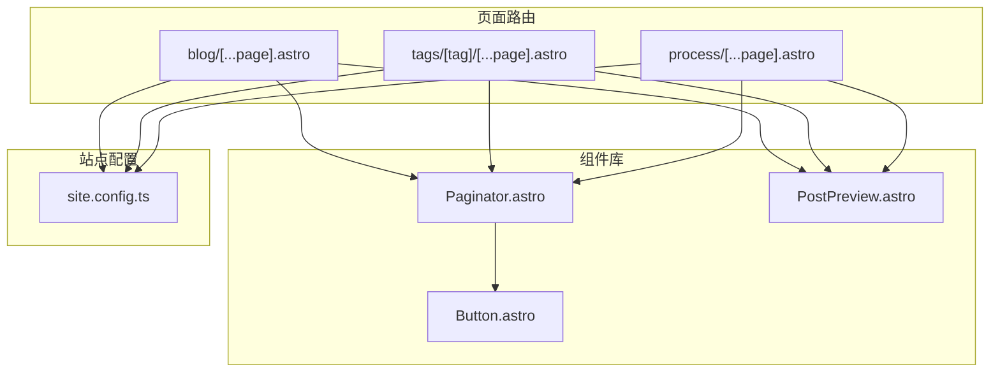
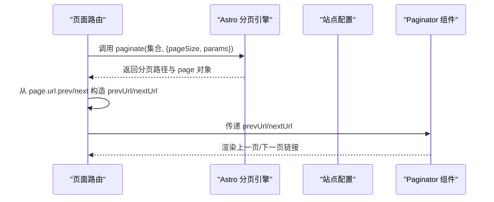
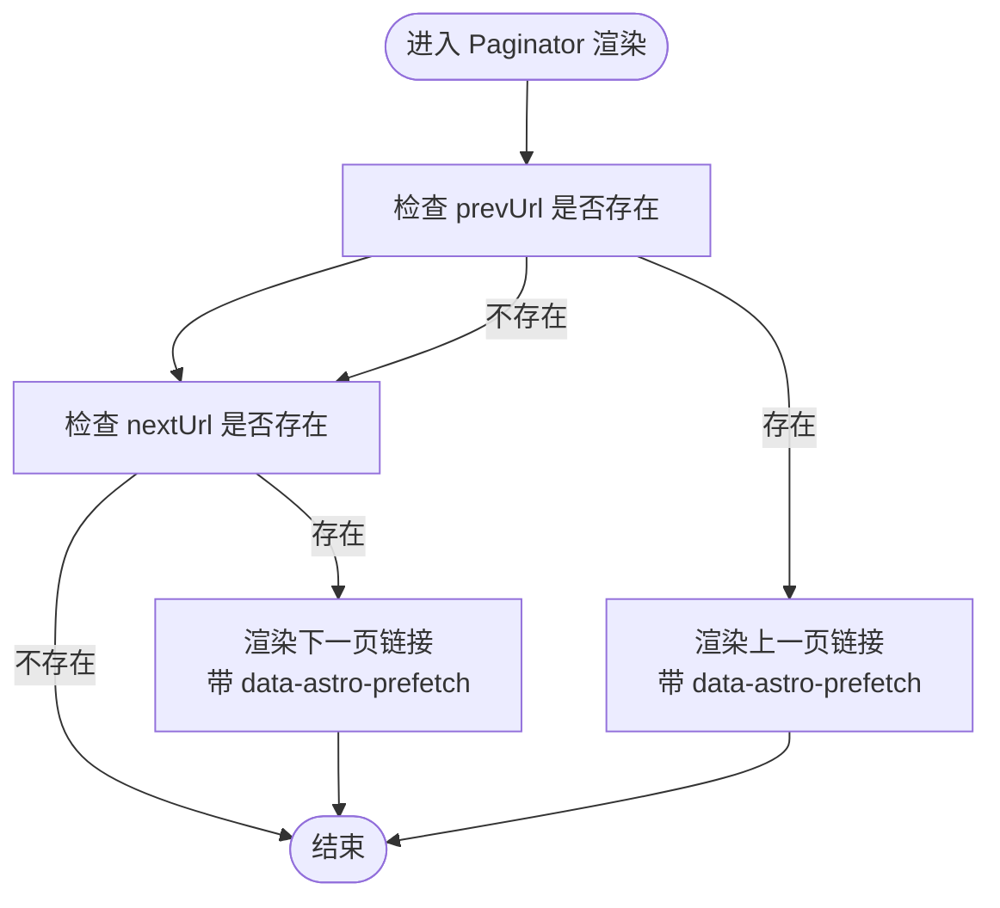
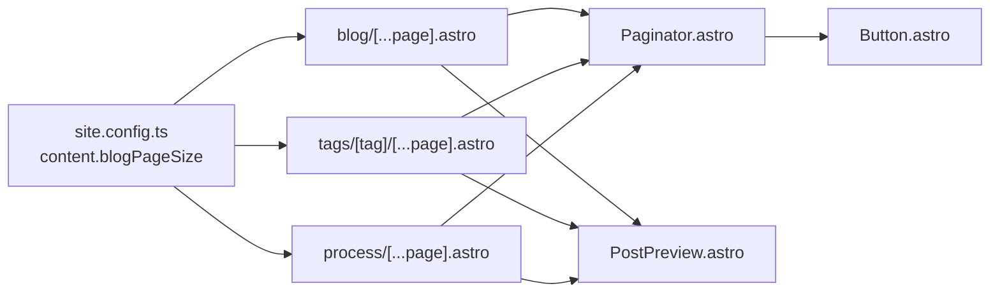

# 分页组件

<cite>
**本文引用的文件**
- [Paginator.astro](file://packages/pure/components/pages/Paginator.astro)
- [blog/[...page].astro](file://src/pages/blog/[...page].astro)
- [tags/[tag]/[...page].astro](file://src/pages/tags/[tag]/[...page].astro)
- [process/[...page].astro](file://src/pages/process/[...page].astro)
- [site.config.ts](file://src/site.config.ts)
- [PostPreview.astro](file://packages/pure/components/pages/PostPreview.astro)
- [Button.astro](file://packages/pure/components/user/Button.astro)
- [pages/index.ts](file://packages/pure/components/pages/index.ts)
</cite>

## 目录
1. [简介](#简介)
2. [项目结构](#项目结构)
3. [核心组件](#核心组件)
4. [架构总览](#架构总览)
5. [详细组件分析](#详细组件分析)
6. [依赖关系分析](#依赖关系分析)
7. [性能考量](#性能考量)
8. [故障排查指南](#故障排查指南)
9. [结论](#结论)
10. [附录](#附录)

## 简介
本文件系统化梳理并深入解析本仓库中的 Paginator 组件，覆盖其分页逻辑实现、用户界面设计、页面数量计算、当前页标识与页码导航功能。文档同时总结边界处理与用户体验优化策略，给出可配置项（如每页数量、文本标签、无障碍属性等），并结合博客列表、文档目录等典型场景说明组件使用方式。最后提供性能优化建议与 SEO 友好性考虑，帮助开发者在不同内容类型中稳定、高效地集成分页能力。

## 项目结构
Paginator 组件位于纯组件库中，作为页面级通用 UI 组件被多个页面路由复用。其主要职责是渲染“上一页/下一页”的导航链接，并通过 Astro 的静态生成与分页 API 提供页面 URL 与文本标签。

图表来源
- [Paginator.astro](file://packages/pure/components/pages/Paginator.astro#L1-L34)
- [blog/[...page].astro](file://src/pages/blog/[...page].astro#L1-L80)
- [tags/[tag]/[...page].astro](file://src/pages/tags/[tag]/[...page].astro#L1-L72)
- [process/[...page].astro](file://src/pages/process/[...page].astro#L1-L97)
- [site.config.ts](file://src/site.config.ts#L84-L98)
- [PostPreview.astro](file://packages/pure/components/pages/PostPreview.astro#L1-L153)
- [Button.astro](file://packages/pure/components/user/Button.astro#L1-L91)

章节来源
- [Paginator.astro](file://packages/pure/components/pages/Paginator.astro#L1-L34)
- [blog/[...page].astro](file://src/pages/blog/[...page].astro#L1-L80)
- [tags/[tag]/[...page].astro](file://src/pages/tags/[tag]/[...page].astro#L1-L72)
- [process/[...page].astro](file://src/pages/process/[...page].astro#L1-L97)
- [site.config.ts](file://src/site.config.ts#L84-L98)

## 核心组件
- 组件名称：Paginator
- 组件类型：页面级导航组件
- 主要职责：
  - 渲染“上一页/下一页”链接
  - 支持自定义链接文本与无障碍标签
  - 基于 Astro 的分页 API 注入预取与可选无障碍提示
- 输入参数：
  - prevUrl: 可选对象，包含 url、text、srLabel
  - nextUrl: 可选对象，包含 url、text、srLabel
- 输出行为：
  - 当存在 prevUrl 或 nextUrl 时渲染导航容器与链接
  - 使用 data-astro-prefetch 提升导航性能
  - srLabel 用于屏幕阅读器读取，提升可访问性

章节来源
- [Paginator.astro](file://packages/pure/components/pages/Paginator.astro#L1-L34)

## 架构总览
Paginator 在各页面路由中通过 Astro 的 getStaticPaths 与 paginate 生成分页数据，页面路由将 page.url.prev/page.url.next 转换为组件所需的 prevUrl/nextUrl 对象，再传入 Paginator 渲染导航。

图表来源
- [blog/[...page].astro](file://src/pages/blog/[...page].astro#L13-L21)
- [tags/[tag]/[...page].astro](file://src/pages/tags/[tag]/[...page].astro#L13-L25)
- [process/[...page].astro](file://src/pages/process/[...page].astro#L13-L21)
- [site.config.ts](file://src/site.config.ts#L94-L95)
- [Paginator.astro](file://packages/pure/components/pages/Paginator.astro#L1-L34)

## 详细组件分析

### 组件接口与数据模型
- PaginationLink 接口字段
  - url: 字符串，目标页面 URL
  - text: 可选字符串，按钮文本（默认回退为“Previous”或“Next”）
  - srLabel: 可选字符串，仅对屏幕阅读器可见的描述性文本
- Props 接口字段
  - prevUrl: 可选 PaginationLink
  - nextUrl: 可选 PaginationLink

章节来源
- [Paginator.astro](file://packages/pure/components/pages/Paginator.astro#L2-L11)

### 页面数量计算与当前页标识
- 页面数量计算
  - 各页面路由调用 Astro 的 paginate，传入集合与 pageSize（来自站点配置），返回多页路径
  - pageSize 来源于站点配置中的 content.blogPageSize
- 当前页标识
  - 每个页面通过 page 对象携带 currentPage、data、url 等信息
  - prevUrl/nextUrl 由 page.url.prev/next 决定是否存在上一页/下一页

章节来源
- [blog/[...page].astro](file://src/pages/blog/[...page].astro#L13-L21)
- [tags/[tag]/[...page].astro](file://src/pages/tags/[tag]/[...page].astro#L13-L25)
- [process/[...page].astro](file://src/pages/process/[...page].astro#L13-L21)
- [site.config.ts](file://src/site.config.ts#L94-L95)

### 页码导航功能与边界处理
- 导航渲染条件
  - 仅当 prevUrl 或 nextUrl 存在时才渲染导航容器
- 文本与无障碍
  - 若未提供 text，则使用默认文案“Previous/Next”
  - 若提供 srLabel，则渲染隐藏文本以增强可访问性
- 预取与性能
  - 所有链接均带有 data-astro-prefetch，提升导航体验

图表来源
- [Paginator.astro](file://packages/pure/components/pages/Paginator.astro#L16-L33)

章节来源
- [Paginator.astro](file://packages/pure/components/pages/Paginator.astro#L16-L33)

### 用户界面设计与样式策略
- 布局与间距
  - 使用 Flex 布局，左右两侧分别放置上一页/下一页链接
  - 顶部外边距与响应式间距适配移动端与桌面端
- 可访问性
  - srLabel 通过 sr-only 类隐藏但对屏幕阅读器可见
  - 语义化 nav 容器包裹链接
- 与 Button 组件的关系
  - Paginator 内部链接采用 a 标签，具备与 Button 相同的 data-astro-prefetch 行为
  - 可通过 sr-only 实现更丰富的无障碍描述

章节来源
- [Paginator.astro](file://packages/pure/components/pages/Paginator.astro#L18-L32)
- [Button.astro](file://packages/pure/components/user/Button.astro#L25-L27)

### 在不同内容类型中的使用场景

#### 博客列表分页
- 路由：src/pages/blog/[...page].astro
- 关键点：
  - 使用 paginate 对博客集合按 pageSize 分页
  - 将 page.url.prev/next 转换为 prevUrl/nextUrl 传给 Paginator
  - 页面头部展示当前页与总数信息，辅助用户定位

章节来源
- [blog/[...page].astro](file://src/pages/blog/[...page].astro#L13-L21)
- [blog/[...page].astro](file://src/pages/blog/[...page].astro#L36-L49)
- [blog/[...page].astro](file://src/pages/blog/[...page].astro#L58-L80)

#### 标签筛选分页
- 路由：src/pages/tags/[tag]/[...page].astro
- 关键点：
  - 先获取所有博客，按日期排序后按标签过滤
  - 对每个标签独立 paginate，保持标签维度的分页
  - 导航文本使用本地化文案“上一页/下一页”

章节来源
- [tags/[tag]/[...page].astro](file://src/pages/tags/[tag]/[...page].astro#L13-L25)
- [tags/[tag]/[...page].astro](file://src/pages/tags/[tag]/[...page].astro#L39-L52)
- [tags/[tag]/[...page].astro](file://src/pages/tags/[tag]/[...page].astro#L55-L72)

#### 文档/流程分页
- 路由：src/pages/process/[...page].astro
- 关键点：
  - 文档集合同样使用 paginate 进行分页
  - 导航文本使用中文“上一页/下一页”，体现本地化

章节来源
- [process/[...page].astro](file://src/pages/process/[...page].astro#L13-L21)
- [process/[...page].astro](file://src/pages/process/[...page].astro#L36-L49)
- [process/[...page].astro](file://src/pages/process/[...page].astro#L52-L97)

### 组件在页面中的集成方式
- 组件导出入口：packages/pure/components/pages/index.ts
- 在页面中导入并渲染 Paginator，传入 prevUrl/nextUrl
- 与 PostPreview 组件配合，形成“列表 + 分页”的常见组合

章节来源
- [pages/index.ts](file://packages/pure/components/pages/index.ts#L1-L9)
- [blog/[...page].astro](file://src/pages/blog/[...page].astro#L79-L79)
- [tags/[tag]/[...page].astro](file://src/pages/tags/[tag]/[...page].astro#L69-L69)
- [process/[...page].astro](file://src/pages/process/[...page].astro#L75-L75)
- [PostPreview.astro](file://packages/pure/components/pages/PostPreview.astro#L1-L153)

## 依赖关系分析
- 组件依赖
  - Paginator 依赖 Astro 的分页上下文（page.url.prev/next）
  - Paginator 依赖站点配置中的 pageSize（content.blogPageSize）
  - Paginator 与 Button 组件共享 data-astro-prefetch 行为
- 页面依赖
  - 各页面路由通过 getStaticPaths 与 paginate 生成分页数据
  - 页面将 page.url.prev/next 转换为组件所需 props

图表来源
- [site.config.ts](file://src/site.config.ts#L94-L95)
- [blog/[...page].astro](file://src/pages/blog/[...page].astro#L13-L21)
- [tags/[tag]/[...page].astro](file://src/pages/tags/[tag]/[...page].astro#L13-L25)
- [process/[...page].astro](file://src/pages/process/[...page].astro#L13-L21)
- [Paginator.astro](file://packages/pure/components/pages/Paginator.astro#L1-L34)
- [Button.astro](file://packages/pure/components/user/Button.astro#L25-L27)
- [PostPreview.astro](file://packages/pure/components/pages/PostPreview.astro#L1-L153)

章节来源
- [site.config.ts](file://src/site.config.ts#L94-L95)
- [blog/[...page].astro](file://src/pages/blog/[...page].astro#L13-L21)
- [tags/[tag]/[...page].astro](file://src/pages/tags/[tag]/[...page].astro#L13-L25)
- [process/[...page].astro](file://src/pages/process/[...page].astro#L13-L21)
- [Paginator.astro](file://packages/pure/components/pages/Paginator.astro#L1-L34)
- [Button.astro](file://packages/pure/components/user/Button.astro#L25-L27)
- [PostPreview.astro](file://packages/pure/components/pages/PostPreview.astro#L1-L153)

## 性能考量
- 预取优化
  - 所有导航链接均带有 data-astro-prefetch，减少用户点击后的等待时间
- 静态生成与分页
  - 使用 Astro 的 paginate 与 getStaticPaths 生成静态分页页面，降低运行时开销
- 无障碍与 SEO
  - srLabel 提升可访问性；页面标题与描述由页面路由统一设置，利于 SEO
- 样式与交互
  - 使用轻量级样式与过渡动画，避免阻塞主线程

章节来源
- [Paginator.astro](file://packages/pure/components/pages/Paginator.astro#L20-L29)
- [blog/[...page].astro](file://src/pages/blog/[...page].astro#L11-L11)
- [tags/[tag]/[...page].astro](file://src/pages/tags/[tag]/[...page].astro#L11-L11)
- [process/[...page].astro](file://src/pages/process/[...page].astro#L11-L11)

## 故障排查指南
- 问题：分页导航不显示
  - 检查页面是否正确传入 prevUrl/nextUrl
  - 确认 page.url.prev/next 是否存在
- 问题：链接无法预取
  - 确保链接带有 data-astro-prefetch 属性
- 问题：无障碍体验不佳
  - 为 prevUrl/nextUrl 提供 srLabel，确保屏幕阅读器可读
- 问题：每页数量不符合预期
  - 检查站点配置 content.blogPageSize 是否正确设置

章节来源
- [Paginator.astro](file://packages/pure/components/pages/Paginator.astro#L16-L33)
- [blog/[...page].astro](file://src/pages/blog/[...page].astro#L36-L49)
- [tags/[tag]/[...page].astro](file://src/pages/tags/[tag]/[...page].astro#L39-L52)
- [process/[...page].astro](file://src/pages/process/[...page].astro#L36-L49)
- [site.config.ts](file://src/site.config.ts#L94-L95)

## 结论
Paginator 组件以简洁的接口与明确的职责，为博客列表、标签筛选与文档目录等场景提供了稳定的分页导航能力。通过 Astro 的静态分页与预取机制，组件在性能与可访问性方面表现良好。结合站点配置与页面路由的数据流，开发者可在不同内容类型中一致地集成分页，获得良好的用户体验与 SEO 友好性。

## 附录

### 组件配置选项
- 每页数量
  - 通过站点配置 content.blogPageSize 控制
- 导航文本
  - 通过 prevUrl/nextUrl 的 text 字段自定义
- 无障碍标签
  - 通过 prevUrl/nextUrl 的 srLabel 提供屏幕阅读器描述
- 预取行为
  - 组件自动为链接添加 data-astro-prefetch

章节来源
- [site.config.ts](file://src/site.config.ts#L94-L95)
- [Paginator.astro](file://packages/pure/components/pages/Paginator.astro#L2-L11)
- [Paginator.astro](file://packages/pure/components/pages/Paginator.astro#L20-L29)