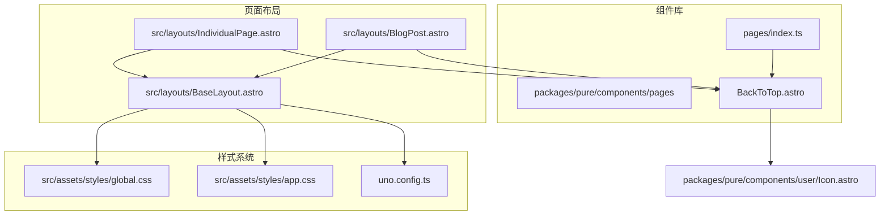
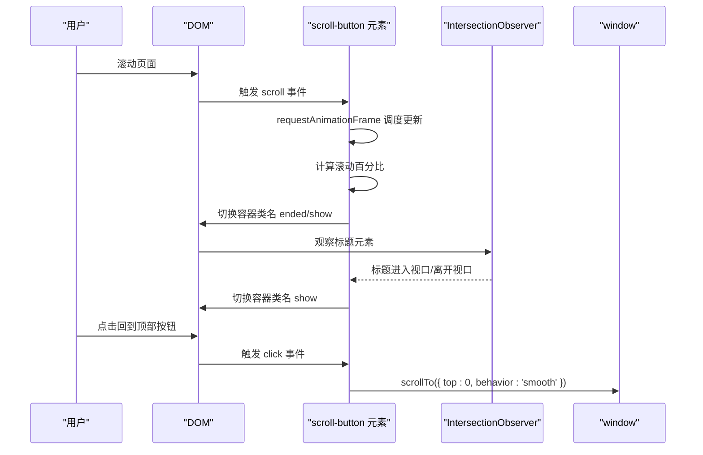
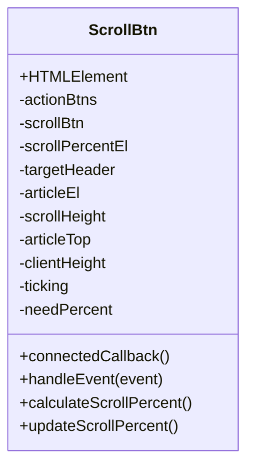
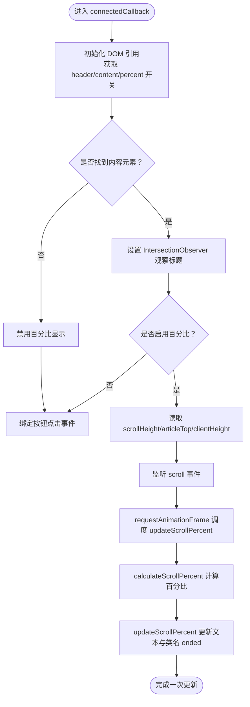
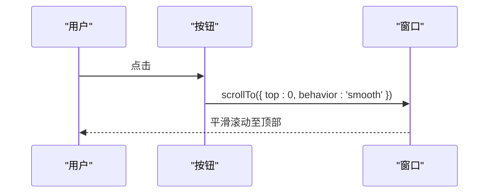
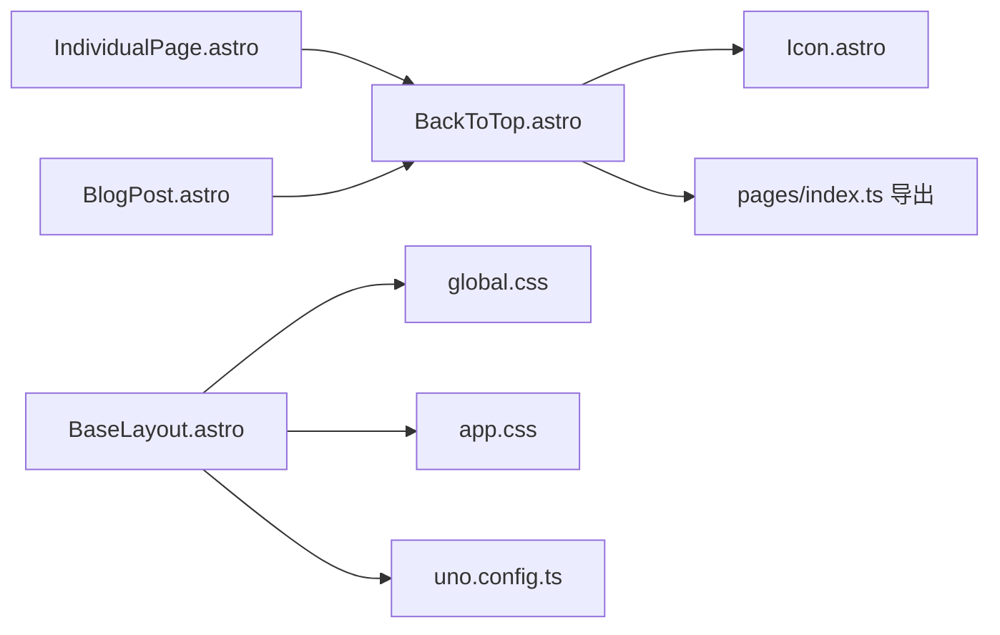

# 回到顶部组件

<cite>
**本文档引用的文件**
- [BackToTop.astro](file://packages/pure/components/pages/BackToTop.astro)
- [IndividualPage.astro](file://src/layouts/IndividualPage.astro)
- [BlogPost.astro](file://src/layouts/BlogPost.astro)
- [BaseLayout.astro](file://src/layouts/BaseLayout.astro)
- [Icon.astro](file://packages/pure/components/user/Icon.astro)
- [index.ts（pages导出）](file://packages/pure/components/pages/index.ts)
- [global.css](file://src/assets/styles/global.css)
- [app.css](file://src/assets/styles/app.css)
- [uno.config.ts](file://uno.config.ts)
</cite>

## 目录
1. [简介](#简介)
2. [项目结构](#项目结构)
3. [核心组件](#核心组件)
4. [架构概览](#架构概览)
5. [详细组件分析](#详细组件分析)
6. [依赖关系分析](#依赖关系分析)
7. [性能考量](#性能考量)
8. [故障排除指南](#故障排除指南)
9. [结论](#结论)
10. [附录](#附录)

## 简介
BackToTop 是一个用于在长页面中提供“回到顶部”能力的交互组件。它通过监听页面滚动进度，在内容区域达到一定阈值时显示一个可点击的按钮；当用户点击按钮时，页面平滑滚动至顶部。组件还支持基于 IntersectionObserver 的头部遮挡检测，当页面标题或导航栏进入视口时自动隐藏按钮，避免遮挡内容。

该组件采用自定义元素（Web Components）封装，结合 Astro 的客户端脚本与 Tailwind/UnoCSS 类名体系，实现轻量、可复用且易于集成的 UI 交互。

## 项目结构
BackToTop 组件位于纯组件库中，作为页面级组件之一对外导出，并在具体页面布局中按需引入与配置。

**图表来源**
- [BackToTop.astro](file://packages/pure/components/pages/BackToTop.astro#L1-L147)
- [IndividualPage.astro](file://src/layouts/IndividualPage.astro#L1-L77)
- [BlogPost.astro](file://src/layouts/BlogPost.astro#L1-L75)
- [BaseLayout.astro](file://src/layouts/BaseLayout.astro#L1-L92)
- [Icon.astro](file://packages/pure/components/user/Icon.astro#L1-L35)
- [index.ts（pages导出）](file://packages/pure/components/pages/index.ts#L1-L10)
- [global.css](file://src/assets/styles/global.css#L1-L287)
- [app.css](file://src/assets/styles/app.css#L1-L49)
- [uno.config.ts](file://uno.config.ts#L1-L193)

**章节来源**
- [BackToTop.astro](file://packages/pure/components/pages/BackToTop.astro#L1-L147)
- [IndividualPage.astro](file://src/layouts/IndividualPage.astro#L1-L77)
- [BlogPost.astro](file://src/layouts/BlogPost.astro#L1-L75)
- [BaseLayout.astro](file://src/layouts/BaseLayout.astro#L1-L92)
- [Icon.astro](file://packages/pure/components/user/Icon.astro#L1-L35)
- [index.ts（pages导出）](file://packages/pure/components/pages/index.ts#L1-L10)
- [global.css](file://src/assets/styles/global.css#L1-L287)
- [app.css](file://src/assets/styles/app.css#L1-L49)
- [uno.config.ts](file://uno.config.ts#L1-L193)

## 核心组件
BackToTop 组件由以下关键部分组成：
- 模板结构：包含一个固定定位的容器与一个可点击的按钮，按钮内含百分比文本与上箭头图标。
- 自定义元素：定义了 scroll-button 元素，负责计算滚动进度、处理点击事件、与 IntersectionObserver 协作控制按钮显隐。
- 样式系统：通过类名切换控制按钮的透明度与图标切换，配合 UnoCSS/Tailwind 类名实现响应式与主题化。

组件的主要行为包括：
- 显示阈值：当滚动超过目标内容区域顶部时开始显示按钮。
- 进度计算：根据滚动高度与内容区域可视高度计算百分比，达到 100% 时切换按钮状态。
- 头部遮挡检测：通过 IntersectionObserver 观察标题/页眉元素，当其进入视口时隐藏按钮。
- 平滑回到顶部：点击按钮触发 window.scrollTo({ top: 0, behavior: 'smooth' })。

**章节来源**
- [BackToTop.astro](file://packages/pure/components/pages/BackToTop.astro#L7-L27)
- [BackToTop.astro](file://packages/pure/components/pages/BackToTop.astro#L29-L108)
- [BackToTop.astro](file://packages/pure/components/pages/BackToTop.astro#L111-L146)

## 架构概览
BackToTop 的运行时架构如下：

**图表来源**
- [BackToTop.astro](file://packages/pure/components/pages/BackToTop.astro#L42-L106)

**章节来源**
- [BackToTop.astro](file://packages/pure/components/pages/BackToTop.astro#L42-L106)

## 详细组件分析

### 组件类图

**图表来源**
- [BackToTop.astro](file://packages/pure/components/pages/BackToTop.astro#L30-L108)

**章节来源**
- [BackToTop.astro](file://packages/pure/components/pages/BackToTop.astro#L30-L108)

### 滚动监听与进度计算流程

**图表来源**
- [BackToTop.astro](file://packages/pure/components/pages/BackToTop.astro#L60-L99)
- [BackToTop.astro](file://packages/pure/components/pages/BackToTop.astro#L42-L58)

**章节来源**
- [BackToTop.astro](file://packages/pure/components/pages/BackToTop.astro#L42-L99)

### 用户交互序列

**图表来源**
- [BackToTop.astro](file://packages/pure/components/pages/BackToTop.astro#L102-L106)

**章节来源**
- [BackToTop.astro](file://packages/pure/components/pages/BackToTop.astro#L102-L106)

### 样式与动画机制
- 容器类名控制：通过 .show 控制按钮出现与位移动画；通过 .ended 控制按钮状态切换。
- 图标与文本切换：在 .ended 或 :hover 状态下，百分比文本与上箭头图标互斥显示。
- 响应式尺寸：在 sm 屏幕以上增大按钮尺寸，提升移动端可用性。
- 主题适配：使用 UnoCSS/Tailwind 类名，颜色与边框遵循全局主题变量。

**章节来源**
- [BackToTop.astro](file://packages/pure/components/pages/BackToTop.astro#L111-L146)
- [global.css](file://src/assets/styles/global.css#L1-L287)
- [app.css](file://src/assets/styles/app.css#L1-L49)
- [uno.config.ts](file://uno.config.ts#L1-L193)

## 依赖关系分析
- 组件依赖
  - 自定义元素：scroll-button 作为 Web Components 封装核心逻辑。
  - 图标组件：使用 Icon 组件渲染上箭头图标。
  - 样式系统：依赖 UnoCSS/Tailwind 类名与全局主题变量。
- 页面集成
  - 在 IndividualPage 布局中通过 props 将 header 与 content 的 ID 传入组件。
  - 在 BlogPost 布局中未直接使用该组件，但整体结构与样式一致。

**图表来源**
- [BackToTop.astro](file://packages/pure/components/pages/BackToTop.astro#L1-L147)
- [Icon.astro](file://packages/pure/components/user/Icon.astro#L1-L35)
- [index.ts（pages导出）](file://packages/pure/components/pages/index.ts#L1-L10)
- [IndividualPage.astro](file://src/layouts/IndividualPage.astro#L1-L77)
- [BlogPost.astro](file://src/layouts/BlogPost.astro#L1-L75)
- [BaseLayout.astro](file://src/layouts/BaseLayout.astro#L1-L92)
- [global.css](file://src/assets/styles/global.css#L1-L287)
- [app.css](file://src/assets/styles/app.css#L1-L49)
- [uno.config.ts](file://uno.config.ts#L1-L193)

**章节来源**
- [BackToTop.astro](file://packages/pure/components/pages/BackToTop.astro#L1-L147)
- [Icon.astro](file://packages/pure/components/user/Icon.astro#L1-L35)
- [index.ts（pages导出）](file://packages/pure/components/pages/index.ts#L1-L10)
- [IndividualPage.astro](file://src/layouts/IndividualPage.astro#L1-L77)
- [BlogPost.astro](file://src/layouts/BlogPost.astro#L1-L75)
- [BaseLayout.astro](file://src/layouts/BaseLayout.astro#L1-L92)
- [global.css](file://src/assets/styles/global.css#L1-L287)
- [app.css](file://src/assets/styles/app.css#L1-L49)
- [uno.config.ts](file://uno.config.ts#L1-L193)

## 性能考量
- 请求动画帧节流：滚动事件中使用 requestAnimationFrame 避免高频重排与重绘，仅在必要时更新 DOM。
- IntersectionObserver：仅在存在目标标题元素时启用，减少不必要的观察开销。
- 条件禁用百分比：当内容元素不存在时自动禁用百分比计算，避免无效测量与错误。
- CSS 动画：使用 transform/opacity 变更，优先触发合成层，降低主线程压力。
- 响应式设计：在小屏与大屏分别优化按钮尺寸与间距，减少移动端误触概率。

**章节来源**
- [BackToTop.astro](file://packages/pure/components/pages/BackToTop.astro#L91-L96)
- [BackToTop.astro](file://packages/pure/components/pages/BackToTop.astro#L75-L84)
- [BackToTop.astro](file://packages/pure/components/pages/BackToTop.astro#L68-L71)
- [BackToTop.astro](file://packages/pure/components/pages/BackToTop.astro#L125-L127)

## 故障排除指南
- 按钮不显示
  - 检查传入的 header 与 content ID 是否正确匹配页面元素。
  - 确认 IntersectionObserver 是否成功观察到标题元素。
- 百分比不更新
  - 确保 content 元素存在且可测量高度。
  - 检查滚动事件是否被正确绑定与节流。
- 点击无反应
  - 确认按钮点击事件已绑定到自定义元素实例。
  - 检查浏览器对 smooth behavior 的支持情况。
- 样式异常
  - 检查 UnoCSS/Tailwind 类名是否正确加载。
  - 确认全局主题变量与颜色系统未被覆盖。

**章节来源**
- [BackToTop.astro](file://packages/pure/components/pages/BackToTop.astro#L65-L84)
- [BackToTop.astro](file://packages/pure/components/pages/BackToTop.astro#L86-L99)
- [BackToTop.astro](file://packages/pure/components/pages/BackToTop.astro#L102-L106)
- [global.css](file://src/assets/styles/global.css#L1-L287)
- [app.css](file://src/assets/styles/app.css#L1-L49)

## 结论
BackToTop 组件通过简洁的自定义元素封装，实现了可靠的滚动进度计算、头部遮挡检测与平滑回到顶部功能。其设计注重性能与可维护性，结合 UnoCSS/Tailwind 的类名体系，提供了良好的主题一致性与响应式体验。在实际项目中，只需在页面布局中传入正确的 header 与 content ID，即可快速集成并获得一致的用户体验。

## 附录

### 组件配置选项
- header: 标题/页眉元素的 ID，用于 IntersectionObserver 观察，决定按钮的显示/隐藏时机。
- content: 内容区域的 ID，用于计算滚动百分比与显示阈值。
- needPercent: 是否启用百分比显示，默认为 true。禁用后按钮将直接进入完成态。

**章节来源**
- [BackToTop.astro](file://packages/pure/components/pages/BackToTop.astro#L4-L4)
- [BackToTop.astro](file://packages/pure/components/pages/BackToTop.astro#L60-L66)
- [BackToTop.astro](file://packages/pure/components/pages/BackToTop.astro#L97-L99)

### 页面集成示例
- 在 IndividualPage 布局中，通过 props 将 header='content-header' 与 content='content' 传入组件，即可在文章内容区域滚动时显示回到顶部按钮。

**章节来源**
- [IndividualPage.astro](file://src/layouts/IndividualPage.astro#L75-L75)

### 设备适配建议
- 移动端：保持按钮尺寸与间距合理，避免与手势操作冲突；在小屏上优先保证点击命中区。
- 深色模式：依赖全局主题变量，确保按钮边框与背景在深色模式下具备足够对比度。
- 无障碍：按钮提供 aria-label，便于屏幕阅读器识别。

**章节来源**
- [BackToTop.astro](file://packages/pure/components/pages/BackToTop.astro#L14-L14)
- [app.css](file://src/assets/styles/app.css#L1-L49)