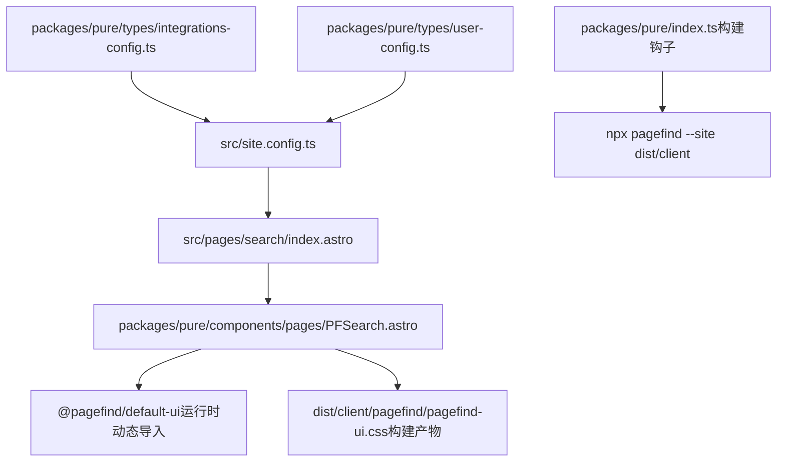
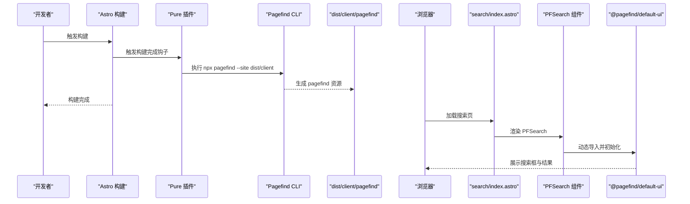
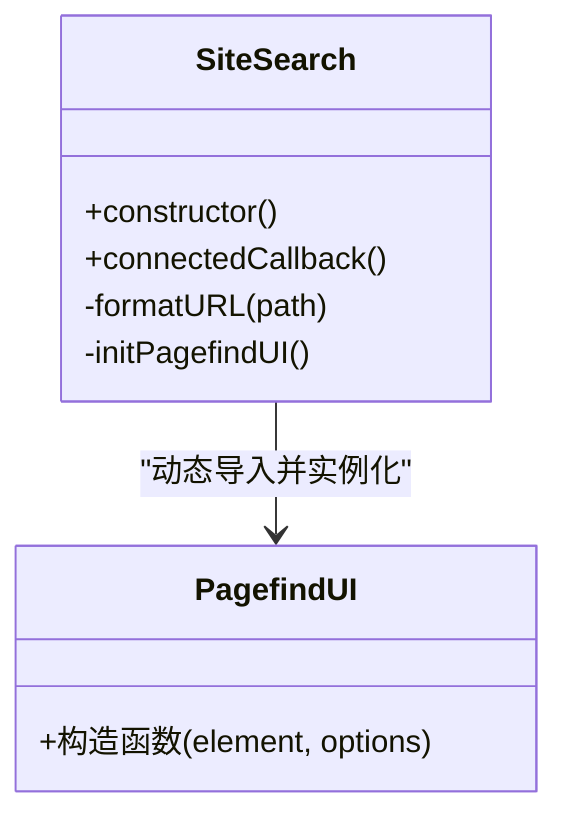
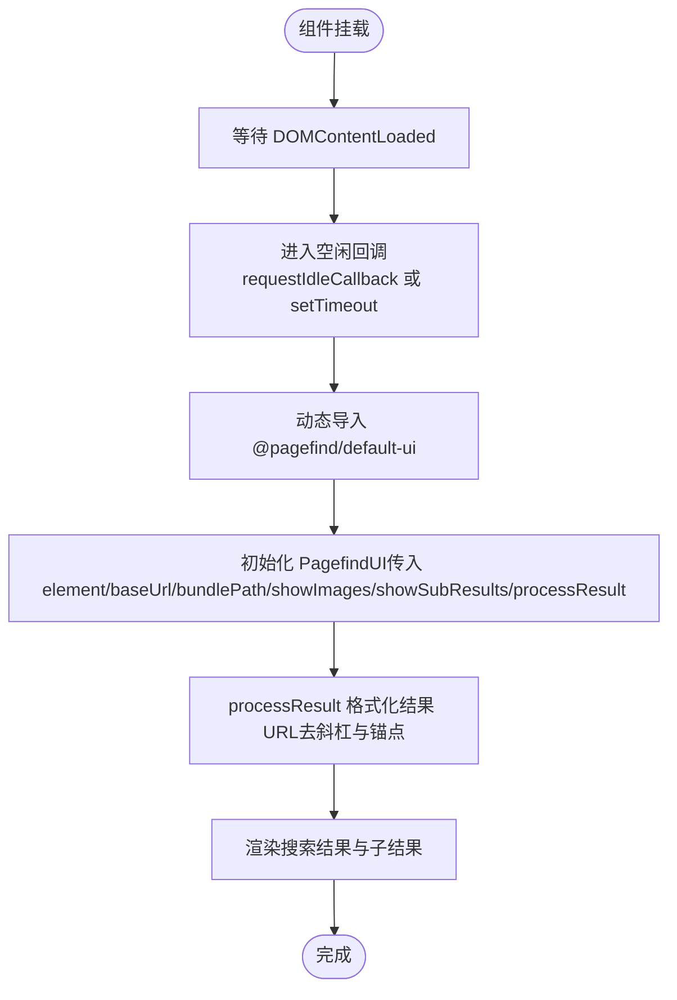
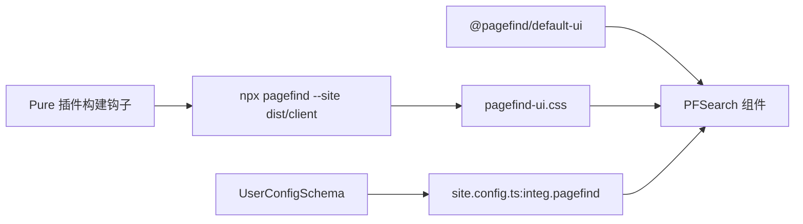

# 搜索组件

<cite>
**本文引用的文件**
- [PFSearch.astro](file://packages/pure/components/pages/PFSearch.astro)
- [search/index.astro](file://src/pages/search/index.astro)
- [site.config.ts](file://src/site.config.ts)
- [integrations-config.ts](file://packages/pure/types/integrations-config.ts)
- [UserConfigSchema.ts](file://packages/pure/types/user-config.ts)
- [index.ts（组件导出）](file://packages/pure/components/pages/index.ts)
- [pagefind-ui.css](file://dist/client/pagefind/pagefind-ui.css)
- [package.json](file://package.json)
- [pure/index.ts（构建钩子）](file://packages/pure/index.ts)
</cite>

## 目录
1. [简介](#简介)
2. [项目结构](#项目结构)
3. [核心组件](#核心组件)
4. [架构总览](#架构总览)
5. [组件详细分析](#组件详细分析)
6. [依赖关系分析](#依赖关系分析)
7. [性能考虑](#性能考虑)
8. [故障排查指南](#故障排查指南)
9. [结论](#结论)
10. [附录](#附录)

## 简介
本文件系统性地介绍 PFSearch 组件，该组件基于 Pagefind 提供站内搜索能力，集成于 Astro + Pure 主题中。内容涵盖：
- 与 Pagefind 的集成方式与初始化流程
- 搜索输入处理、查询执行与结果展示机制
- 搜索界面交互、键盘导航与历史管理
- 可配置项（搜索范围、结果排序、样式定制）
- 性能优化策略（延迟加载、资源路径、构建期索引）
- 错误处理与可用性保障
- 在不同页面布局中的集成示例与用户体验优化建议

## 项目结构
PFSearch 组件位于 Pure 主题的页面组件集合中，通过 Astro 页面进行按需渲染，并由主题配置控制是否启用 Pagefind。

图示来源
- [search/index.astro](file://src/pages/search/index.astro#L1-L34)
- [PFSearch.astro](file://packages/pure/components/pages/PFSearch.astro#L1-L70)
- [pagefind-ui.css](file://dist/client/pagefind/pagefind-ui.css#L1-L2)
- [site.config.ts](file://src/site.config.ts#L101-L181)
- [integrations-config.ts](file://packages/pure/types/integrations-config.ts#L5-L62)
- [UserConfigSchema.ts](file://packages/pure/types/user-config.ts#L1-L26)
- [pure/index.ts（构建钩子）](file://packages/pure/index.ts#L98-L110)

章节来源
- [search/index.astro](file://src/pages/search/index.astro#L1-L34)
- [PFSearch.astro](file://packages/pure/components/pages/PFSearch.astro#L1-L70)
- [site.config.ts](file://src/site.config.ts#L101-L181)
- [integrations-config.ts](file://packages/pure/types/integrations-config.ts#L5-L62)
- [UserConfigSchema.ts](file://packages/pure/types/user-config.ts#L1-L26)
- [pure/index.ts（构建钩子）](file://packages/pure/index.ts#L98-L110)

## 核心组件
- PFSearch 组件：封装 Pagefind 默认 UI，负责在 DOM 就绪后异步加载 UI 并初始化搜索入口；同时对结果 URL 进行格式化，移除末尾斜杠与锚点，保证链接一致性。
- 搜索页面：在搜索页按条件渲染 PFSearch，若未启用 Pagefind 则提示禁用状态。
- 主题配置：通过集成配置开关 Pagefind，并在构建阶段调用 Pagefind CLI 生成索引资源。

章节来源
- [PFSearch.astro](file://packages/pure/components/pages/PFSearch.astro#L1-L70)
- [search/index.astro](file://src/pages/search/index.astro#L1-L34)
- [site.config.ts](file://src/site.config.ts#L101-L181)
- [integrations-config.ts](file://packages/pure/types/integrations-config.ts#L5-L62)
- [UserConfigSchema.ts](file://packages/pure/types/user-config.ts#L1-L26)
- [pure/index.ts（构建钩子）](file://packages/pure/index.ts#L98-L110)

## 架构总览
PFSearch 的工作流分为“构建期”和“运行期”两个阶段：
- 构建期：Pure 插件在构建完成后调用 Pagefind CLI 对 dist/client 进行索引生成，产出 pagefind 资源（JS/CSS/索引数据）。
- 运行期：PFSearch 组件在浏览器端按需加载 @pagefind/default-ui，并使用 baseUrl 与 bundlePath 指向构建产物目录，初始化默认 UI。

图示来源
- [pure/index.ts（构建钩子）](file://packages/pure/index.ts#L98-L110)
- [PFSearch.astro](file://packages/pure/components/pages/PFSearch.astro#L28-L49)
- [search/index.astro](file://src/pages/search/index.astro#L22-L30)

## 组件详细分析

### 组件类与生命周期
PFSearch 是一个自定义元素，内部在 DOMContentLoaded 后采用 requestIdleCallback 或回退到 setTimeout 延迟加载 @pagefind/default-ui，并传入基础配置（元素选择器、baseUrl、bundlePath、显示图片与子结果、结果 URL 处理函数）。

图示来源
- [PFSearch.astro](file://packages/pure/components/pages/PFSearch.astro#L19-L52)

章节来源
- [PFSearch.astro](file://packages/pure/components/pages/PFSearch.astro#L19-L52)

### 初始化流程与参数
- 元素挂载：组件在页面中占位为 <site-search>，实际渲染由 Pagefind UI 控制。
- 基础路径：baseUrl 来自 import.meta.env.BASE_URL；bundlePath 拼接为 BASE_URL 下的 /pagefind/ 目录。
- 结果处理：processResult 中统一格式化结果 URL，去除末尾斜杠与锚点，避免重复或无效链接。
- 显示选项：关闭图片展示，开启子结果展示，提升文本检索体验。

章节来源
- [PFSearch.astro](file://packages/pure/components/pages/PFSearch.astro#L34-L47)

### 搜索界面与交互
- 默认 UI：组件引入 @pagefind/default-ui 的样式，页面上呈现标准搜索输入框、结果列表与筛选面板。
- 样式定制：通过 CSS 变量覆盖默认 UI 的缩放、主色、文字、背景、边框、标签色、圆角、字体等，适配主题变量。
- 可见性控制：开发模式下直接提示禁用，避免在本地调试时误触发搜索逻辑。

章节来源
- [PFSearch.astro](file://packages/pure/components/pages/PFSearch.astro#L2-L17)
- [PFSearch.astro](file://packages/pure/components/pages/PFSearch.astro#L55-L69)

### 键盘导航与可访问性
- Pagefind 默认 UI 支持键盘操作（如方向键、回车等），PFSearch 未做额外键盘扩展，遵循其原生行为。
- 若需增强可访问性，可在业务层补充 ARIA 属性或焦点管理策略（建议在上层页面或容器中实现）。

章节来源
- [PFSearch.astro](file://packages/pure/components/pages/PFSearch.astro#L32-L47)

### 搜索历史管理
- Pagefind 默认 UI 不内置搜索历史持久化；如需记录历史，可在业务层通过 localStorage 或会话存储维护最近搜索词，并在 UI 上提供快捷选择。
- PFSearch 本身不处理历史，建议在上层页面或自定义容器中实现该功能。

章节来源
- [PFSearch.astro](file://packages/pure/components/pages/PFSearch.astro#L32-L47)

### 配置选项与可定制项
- 启用开关：通过站点配置中的 integ.pagefind 控制是否启用 Pagefind，默认值受 prerender 影响。
- 构建期索引：Pure 插件在构建完成后自动调用 Pagefind CLI 对 dist/client 站点进行索引生成。
- 运行期参数：baseUrl、bundlePath、showImages、showSubResults、processResult。
- 样式变量：--pagefind-ui-scale、--pagefind-ui-primary、--pagefind-ui-text、--pagefind-ui-background、--pagefind-ui-border、--pagefind-ui-tag、--pagefind-ui-border-width、--pagefind-ui-border-radius、--pagefind-ui-image-border-radius、--pagefind-ui-image-box-ratio、--pagefind-ui-font。

章节来源
- [site.config.ts](file://src/site.config.ts#L101-L181)
- [integrations-config.ts](file://packages/pure/types/integrations-config.ts#L5-L62)
- [UserConfigSchema.ts](file://packages/pure/types/user-config.ts#L1-L26)
- [pure/index.ts（构建钩子）](file://packages/pure/index.ts#L98-L110)
- [PFSearch.astro](file://packages/pure/components/pages/PFSearch.astro#L34-L47)
- [PFSearch.astro](file://packages/pure/components/pages/PFSearch.astro#L55-L69)

### 数据流与处理逻辑

图示来源
- [PFSearch.astro](file://packages/pure/components/pages/PFSearch.astro#L28-L49)

章节来源
- [PFSearch.astro](file://packages/pure/components/pages/PFSearch.astro#L28-L49)

### 在不同页面布局中的集成示例
- 搜索页：在搜索页按配置条件渲染 PFSearch，未启用时显示禁用提示。
- 侧边栏/头部：可在任意布局中插入 <site-search> 占位或直接渲染 PFSearch，确保页面具备搜索入口。
- 多语言/多站点：通过 baseUrl 与 bundlePath 指向对应构建产物目录，实现多站点共享同一 UI。

章节来源
- [search/index.astro](file://src/pages/search/index.astro#L22-L30)
- [PFSearch.astro](file://packages/pure/components/pages/PFSearch.astro#L34-L37)

## 依赖关系分析
- 运行时依赖：@pagefind/default-ui（动态导入）、pagefind-ui.css（构建产物）。
- 构建期依赖：Pagefind CLI，由 Pure 插件在构建完成后调用。
- 配置依赖：site.config.ts 中的 integ.pagefind 决定是否启用；UserConfigSchema 对 pagefind 的默认值与校验有约束。

图示来源
- [PFSearch.astro](file://packages/pure/components/pages/PFSearch.astro#L2-L2)
- [pagefind-ui.css](file://dist/client/pagefind/pagefind-ui.css#L1-L2)
- [pure/index.ts（构建钩子）](file://packages/pure/index.ts#L98-L110)
- [site.config.ts](file://src/site.config.ts#L101-L181)
- [UserConfigSchema.ts](file://packages/pure/types/user-config.ts#L1-L26)

章节来源
- [package.json](file://package.json#L23-L34)
- [pure/index.ts（构建钩子）](file://packages/pure/index.ts#L98-L110)
- [PFSearch.astro](file://packages/pure/components/pages/PFSearch.astro#L2-L2)
- [pagefind-ui.css](file://dist/client/pagefind/pagefind-ui.css#L1-L2)
- [site.config.ts](file://src/site.config.ts#L101-L181)
- [UserConfigSchema.ts](file://packages/pure/types/user-config.ts#L1-L26)

## 性能考虑
- 延迟加载：使用 requestIdleCallback 或回退定时器在空闲时再加载 UI，避免阻塞首屏渲染。
- 资源路径：通过 baseUrl 与 bundlePath 精确指向构建产物目录，减少不必要的网络请求与 404。
- 图片关闭：默认关闭图片展示，降低结果列表渲染开销与带宽占用。
- 子结果：开启子结果展示，有助于在复杂页面中提供更细粒度的结果定位。
- 构建期索引：在构建阶段完成索引生成，运行期仅加载 UI 与资源，显著缩短首次搜索响应时间。

章节来源
- [PFSearch.astro](file://packages/pure/components/pages/PFSearch.astro#L28-L49)
- [pure/index.ts（构建钩子）](file://packages/pure/index.ts#L98-L110)

## 故障排查指南
- Pagefind 未启用
  - 现象：搜索页显示“Pagefind 已禁用”。
  - 排查：检查 site.config.ts 中 integ.pagefind 是否为 true；确认构建时未跳过 Pagefind 步骤。
- 开发模式限制
  - 现象：开发模式下搜索框提示禁用。
  - 排查：开发模式下组件不会初始化 Pagefind UI，属预期行为。
- 资源 404
  - 现象：页面无法加载 /pagefind/ 相关资源。
  - 排查：确认 baseUrl 与 bundlePath 拼接正确；检查构建产物是否存在 pagefind 目录。
- 结果链接异常
  - 现象：点击结果跳转到错误页面。
  - 排查：确认 processResult 中 URL 格式化逻辑生效；检查站点路由与链接规范。
- 构建失败或未生成索引
  - 现象：生产环境无搜索结果。
  - 排查：确认 Pure 插件已执行 Pagefind CLI；检查构建日志中是否有 Pagefind 输出。

章节来源
- [search/index.astro](file://src/pages/search/index.astro#L22-L30)
- [PFSearch.astro](file://packages/pure/components/pages/PFSearch.astro#L8-L15)
- [PFSearch.astro](file://packages/pure/components/pages/PFSearch.astro#L34-L37)
- [pure/index.ts（构建钩子）](file://packages/pure/index.ts#L98-L110)

## 结论
PFSearch 组件通过与 Pagefind 的深度集成，在 Astro + Pure 主题中提供了即插即用的站内搜索能力。其设计强调：
- 运行期的低侵入与高性能（延迟加载、资源路径精确、关闭图片）
- 构建期的自动化索引生成
- 可定制的 UI 样式与简洁的初始化参数
- 易于在不同页面布局中复用

建议在生产环境中结合业务需求进一步增强可访问性、历史记录与结果排序策略，以获得更佳的用户体验。

## 附录

### 组件导出与使用
- 组件导出：PFSearch 通过页面组件索引导出，可在页面中直接导入并渲染。
- 使用位置：搜索页、首页、文章页等需要搜索入口的位置均可放置。

章节来源
- [index.ts（组件导出）](file://packages/pure/components/pages/index.ts#L1-L10)
- [search/index.astro](file://src/pages/search/index.astro#L2-L25)