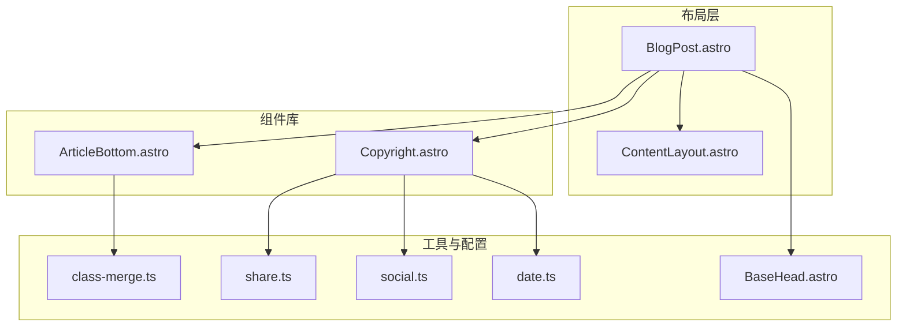
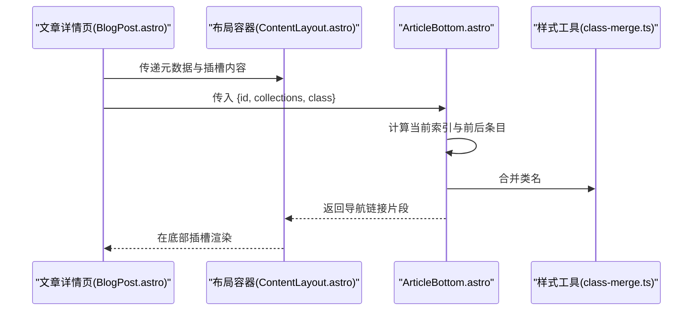
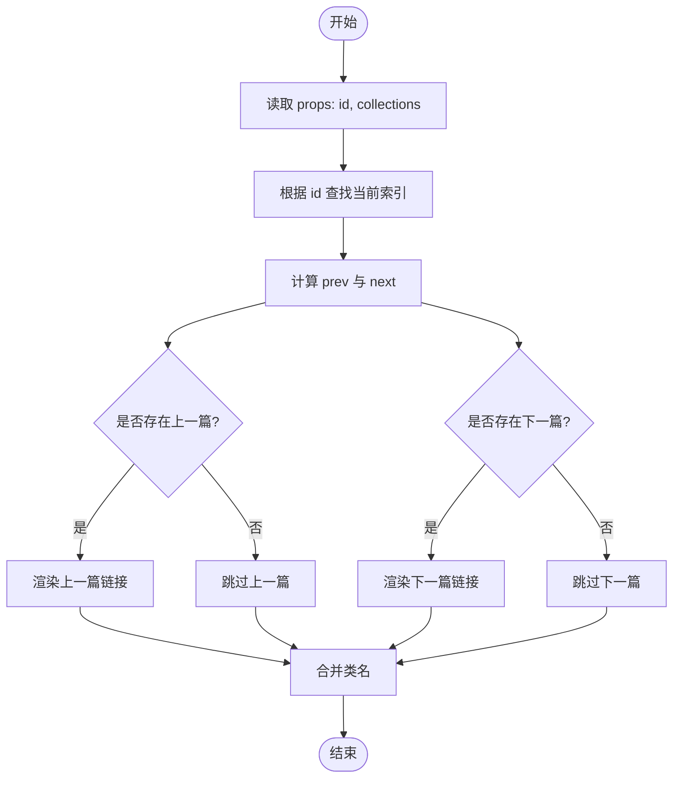
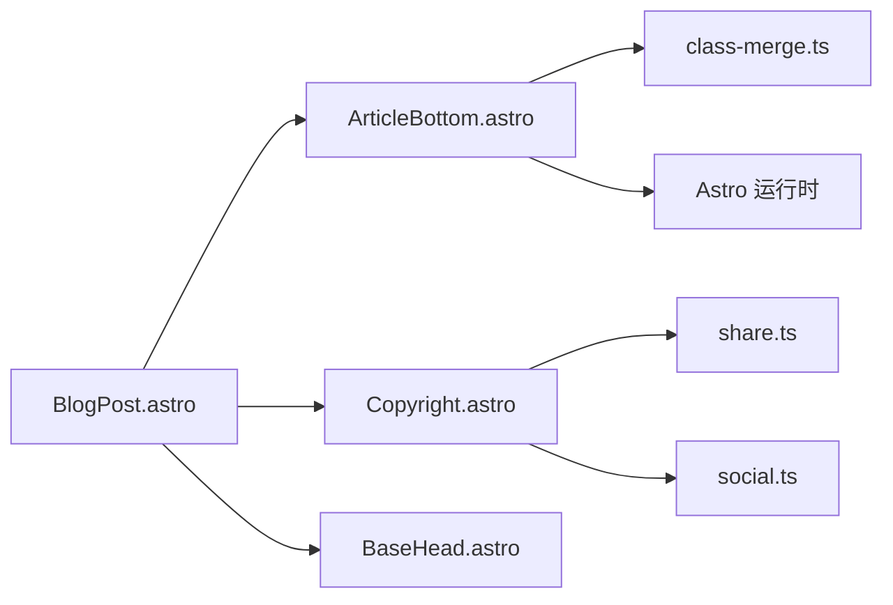

# 文章底部组件

<cite>
**本文引用的文件**
- [ArticleBottom.astro](file://packages/pure/components/pages/ArticleBottom.astro)
- [BlogPost.astro](file://src/layouts/BlogPost.astro)
- [ContentLayout.astro](file://src/layouts/ContentLayout.astro)
- [Copyright.astro](file://packages/pure/components/pages/Copyright.astro)
- [index.ts](file://packages/pure/components/pages/index.ts)
- [class-merge.ts](file://packages/pure/utils/class-merge.ts)
- [date.ts](file://packages/pure/utils/date.ts)
- [share.ts](file://packages/pure/schemas/share.ts)
- [social.ts](file://packages/pure/schemas/social.ts)
- [BaseHead.astro](file://src/components/BaseHead.astro)
</cite>

## 目录
1. [简介](#简介)
2. [项目结构](#项目结构)
3. [核心组件](#核心组件)
4. [架构总览](#架构总览)
5. [详细组件分析](#详细组件分析)
6. [依赖关系分析](#依赖关系分析)
7. [性能考虑](#性能考虑)
8. [故障排查指南](#故障排查指南)
9. [结论](#结论)
10. [附录](#附录)

## 简介
ArticleBottom 是一个用于文章页面底部的组件，主要负责展示“上一篇/下一篇”导航，帮助用户在文章集合中进行连续阅读。它通过接收当前文章 ID 与文章集合，计算相邻条目并生成可点击的导航链接；同时，结合布局系统，与其他底部信息（如版权信息、评论区等）共同构成完整的文章页底部区域。

该组件不直接展示“相关文章推荐”或“社交分享按钮”，这些能力由其他组件（如 Copyright）承担。ArticleBottom 的职责清晰、耦合度低，便于在不同页面布局中复用。

## 项目结构
ArticleBottom 位于纯组件库中，作为页面级组件之一，配合布局层在文章详情页渲染。其典型使用路径如下：
- 页面布局层（BlogPost.astro）在底部插槽中引入 ArticleBottom，并传入文章集合与当前文章 ID
- 布局容器（ContentLayout.astro）提供统一的底部区域插槽，ArticleBottom 与版权、评论等并列显示
- 样式工具（class-merge.ts）用于安全合并类名，避免重复与冲突
- 元数据与 SEO（BaseHead.astro）为文章页提供标题、描述、OG 图片等基础信息

图表来源
- [BlogPost.astro](file://src/layouts/BlogPost.astro#L62-L69)
- [ContentLayout.astro](file://src/layouts/ContentLayout.astro#L55-L63)
- [ArticleBottom.astro](file://packages/pure/components/pages/ArticleBottom.astro#L1-L10)
- [Copyright.astro](file://packages/pure/components/pages/Copyright.astro#L1-L33)
- [class-merge.ts](file://packages/pure/utils/class-merge.ts#L1-L20)
- [share.ts](file://packages/pure/schemas/share.ts#L1-L10)
- [social.ts](file://packages/pure/schemas/social.ts#L1-L45)
- [date.ts](file://packages/pure/utils/date.ts#L1-L18)
- [BaseHead.astro](file://src/components/BaseHead.astro#L1-L77)

章节来源
- [BlogPost.astro](file://src/layouts/BlogPost.astro#L1-L75)
- [ContentLayout.astro](file://src/layouts/ContentLayout.astro#L1-L156)
- [ArticleBottom.astro](file://packages/pure/components/pages/ArticleBottom.astro#L1-L95)
- [Copyright.astro](file://packages/pure/components/pages/Copyright.astro#L1-L151)
- [class-merge.ts](file://packages/pure/utils/class-merge.ts#L1-L20)
- [share.ts](file://packages/pure/schemas/share.ts#L1-L10)
- [social.ts](file://packages/pure/schemas/social.ts#L1-L45)
- [date.ts](file://packages/pure/utils/date.ts#L1-L18)
- [BaseHead.astro](file://src/components/BaseHead.astro#L1-L77)

## 核心组件
- 组件名称：ArticleBottom
- 文件位置：packages/pure/components/pages/ArticleBottom.astro
- 主要职责：
  - 接收当前文章 ID 与文章集合
  - 计算上一篇与下一篇条目
  - 渲染左右两侧的导航链接（带图标与标题）
  - 支持自定义类名扩展样式
- 关键输入（Props）：
  - id: 当前文章唯一标识
  - collections: 文章集合（数组），包含每篇文章的元数据与 ID
  - class?: 可选的自定义类名字符串
- 关键行为：
  - 通过集合索引定位当前项，取前一项与后一项
  - 使用路径拼接生成导航链接
  - 使用 cn 工具合并类名，确保样式稳定

章节来源
- [ArticleBottom.astro](file://packages/pure/components/pages/ArticleBottom.astro#L6-L10)
- [ArticleBottom.astro](file://packages/pure/components/pages/ArticleBottom.astro#L12-L20)
- [ArticleBottom.astro](file://packages/pure/components/pages/ArticleBottom.astro#L22-L94)
- [class-merge.ts](file://packages/pure/utils/class-merge.ts#L17-L19)

## 架构总览
ArticleBottom 在文章详情页的底部区域渲染，通常与版权信息、评论区并列出现。其渲染流程如下：

图表来源
- [BlogPost.astro](file://src/layouts/BlogPost.astro#L62-L69)
- [ContentLayout.astro](file://src/layouts/ContentLayout.astro#L55-L63)
- [ArticleBottom.astro](file://packages/pure/components/pages/ArticleBottom.astro#L12-L20)
- [class-merge.ts](file://packages/pure/utils/class-merge.ts#L17-L19)

章节来源
- [BlogPost.astro](file://src/layouts/BlogPost.astro#L62-L69)
- [ContentLayout.astro](file://src/layouts/ContentLayout.astro#L55-L63)
- [ArticleBottom.astro](file://packages/pure/components/pages/ArticleBottom.astro#L12-L20)

## 详细组件分析

### 组件属性与类型
- Props 结构
  - id: string
  - collections: CollectionEntry<CollectionKey>[]
  - class?: string
- 类型导出
  - ArticleBottom 默认导出，供外部页面直接引入

章节来源
- [ArticleBottom.astro](file://packages/pure/components/pages/ArticleBottom.astro#L6-L10)
- [index.ts](file://packages/pure/components/pages/index.ts#L1-L9)

### 数据流与处理逻辑
- 输入：当前文章 ID 与文章集合
- 处理：
  - 通过 findIndex 获取当前索引
  - 计算 prev = collections[index - 1]、next = collections[index + 1]
  - 若存在 prev/next，则生成导航链接，链接路径基于当前 URL 的前两级路径与目标文章 ID 拼接
- 输出：左侧“上一篇”与右侧“下一篇”的可点击链接

图表来源
- [ArticleBottom.astro](file://packages/pure/components/pages/ArticleBottom.astro#L12-L20)
- [ArticleBottom.astro](file://packages/pure/components/pages/ArticleBottom.astro#L22-L94)
- [class-merge.ts](file://packages/pure/utils/class-merge.ts#L17-L19)

章节来源
- [ArticleBottom.astro](file://packages/pure/components/pages/ArticleBottom.astro#L12-L20)
- [ArticleBottom.astro](file://packages/pure/components/pages/ArticleBottom.astro#L22-L94)

### 样式与响应式设计
- 基础布局
  - 使用 Flex 布局，sm 屏幕水平排列，max-sm 屏幕垂直堆叠
  - 两端对齐，间距统一
- 交互样式
  - 链接容器具备圆角、内边距、悬停背景色过渡
  - 图标与文字在悬停时有颜色过渡效果
- 自定义类名
  - 通过 class 参数传入额外类名，最终由 cn 合并
- 响应式断点
  - sm: 使用 flex 布局
  - max-sm: 使用 float 与宽度限制，保证移动端可读性

章节来源
- [ArticleBottom.astro](file://packages/pure/components/pages/ArticleBottom.astro#L22-L94)
- [class-merge.ts](file://packages/pure/utils/class-merge.ts#L17-L19)

### 与版权信息、社交分享的关系
- 版权信息与社交分享由 Copyright 组件负责，包含：
  - 文章标题、链接、作者、发布时间、版权协议
  - 复制链接、二维码、分享到微博/X/Bluesky 等操作
- ArticleBottom 与 Copyright 并列出现在文章底部，分别承担“导航”与“版权/分享”两类信息
- 分享平台列表由 share.ts 与 social.ts 提供配置支持

章节来源
- [Copyright.astro](file://packages/pure/components/pages/Copyright.astro#L1-L151)
- [share.ts](file://packages/pure/schemas/share.ts#L1-L10)
- [social.ts](file://packages/pure/schemas/social.ts#L1-L45)

### 使用示例与最佳实践
- 在文章详情页布局中引入
  - 在 BlogPost.astro 的底部插槽中添加 ArticleBottom，并传入 posts 与 post.id
  - 可通过 class 参数追加间距等样式
- 最佳实践
  - 确保传入的 collections 与 post.id 对应同一内容集合
  - 在移动端适当增加间距，避免与导航栏重叠
  - 如需自定义样式，优先通过 class 参数扩展，避免破坏默认交互

章节来源
- [BlogPost.astro](file://src/layouts/BlogPost.astro#L62-L69)

## 依赖关系分析
- 内部依赖
  - class-merge.ts：提供 cn 工具，合并类名并去重
- 外部依赖
  - Astro 内置类型与运行时：CollectionEntry、Astro.props、Astro.url
- 配置依赖
  - share.ts 与 social.ts：为版权组件的分享功能提供平台枚举与标签映射
  - BaseHead.astro：为文章页提供 SEO 元数据，间接影响分享卡片呈现

图表来源
- [ArticleBottom.astro](file://packages/pure/components/pages/ArticleBottom.astro#L1-L10)
- [class-merge.ts](file://packages/pure/utils/class-merge.ts#L1-L20)
- [Copyright.astro](file://packages/pure/components/pages/Copyright.astro#L1-L33)
- [share.ts](file://packages/pure/schemas/share.ts#L1-L10)
- [social.ts](file://packages/pure/schemas/social.ts#L1-L45)
- [BlogPost.astro](file://src/layouts/BlogPost.astro#L62-L69)
- [BaseHead.astro](file://src/components/BaseHead.astro#L1-L77)

章节来源
- [ArticleBottom.astro](file://packages/pure/components/pages/ArticleBottom.astro#L1-L10)
- [class-merge.ts](file://packages/pure/utils/class-merge.ts#L1-L20)
- [Copyright.astro](file://packages/pure/components/pages/Copyright.astro#L1-L33)
- [share.ts](file://packages/pure/schemas/share.ts#L1-L10)
- [social.ts](file://packages/pure/schemas/social.ts#L1-L45)
- [BlogPost.astro](file://src/layouts/BlogPost.astro#L62-L69)
- [BaseHead.astro](file://src/components/BaseHead.astro#L1-L77)

## 性能考虑
- 列表查找复杂度
  - findIndex 在文章集合中线性查找，时间复杂度 O(n)，空间复杂度 O(1)
  - 对于大型集合，建议在服务端预计算 prev/next 或仅传入必要的上下文数据
- DOM 与交互
  - 导航链接为静态链接，无复杂 JS 事件绑定，渲染成本低
  - 图标与文字的悬停过渡使用 CSS，避免 JavaScript 动画带来的抖动
- 样式合并
  - cn 工具会去重类名，减少重复样式规则带来的解析负担
- 建议
  - 在 SSR 场景下，尽量在构建期确定导航上下文，减少运行时计算
  - 对移动端文本截断与图标尺寸进行合理设置，避免过度重绘

章节来源
- [ArticleBottom.astro](file://packages/pure/components/pages/ArticleBottom.astro#L12-L20)
- [class-merge.ts](file://packages/pure/utils/class-merge.ts#L1-L20)

## 故障排查指南
- 无法显示“上一篇/下一篇”
  - 检查传入的 id 是否存在于 collections 中
  - 确认 collections 的顺序与文章集合一致
- 链接跳转异常
  - 确认当前页面 URL 的前两级路径与文章路由一致
  - 检查文章 ID 是否为字符串且与路由匹配
- 样式错乱
  - 检查传入的 class 是否覆盖了关键样式（如 flex、gap、max-sm/sm 断点）
  - 确认 cn 工具未误删必要类名
- 版权/分享功能异常
  - 检查 share.ts 与 social.ts 的配置是否正确
  - 确认 BaseHead 提供的 OG 图片与标题正常

章节来源
- [ArticleBottom.astro](file://packages/pure/components/pages/ArticleBottom.astro#L12-L20)
- [ArticleBottom.astro](file://packages/pure/components/pages/ArticleBottom.astro#L22-L94)
- [Copyright.astro](file://packages/pure/components/pages/Copyright.astro#L22-L32)
- [share.ts](file://packages/pure/schemas/share.ts#L1-L10)
- [social.ts](file://packages/pure/schemas/social.ts#L1-L45)
- [BaseHead.astro](file://src/components/BaseHead.astro#L1-L77)

## 结论
ArticleBottom 以简洁的数据流与稳定的样式体系，实现了文章页底部的“上一篇/下一篇”导航。它与 Copyright 等组件协同工作，形成完整的文章页底部信息区。通过合理的 props 设计、响应式布局与样式工具的使用，该组件在多场景下均能保持良好的可用性与可维护性。对于更大规模的文章集合，建议在服务端进行上下文预计算，以进一步提升性能与稳定性。

## 附录
- 相关组件导出
  - ArticleBottom 默认导出，便于在页面布局中直接引入
- 配置参考
  - 分享平台列表与标签映射：share.ts、social.ts
  - 日期格式化：date.ts（Copyright 组件使用）

章节来源
- [index.ts](file://packages/pure/components/pages/index.ts#L1-L9)
- [share.ts](file://packages/pure/schemas/share.ts#L1-L10)
- [social.ts](file://packages/pure/schemas/social.ts#L1-L45)
- [date.ts](file://packages/pure/utils/date.ts#L1-L18)