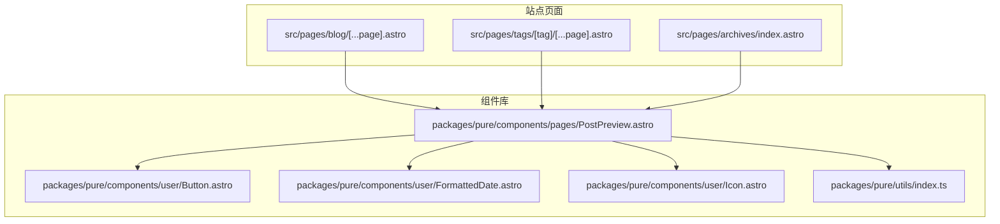
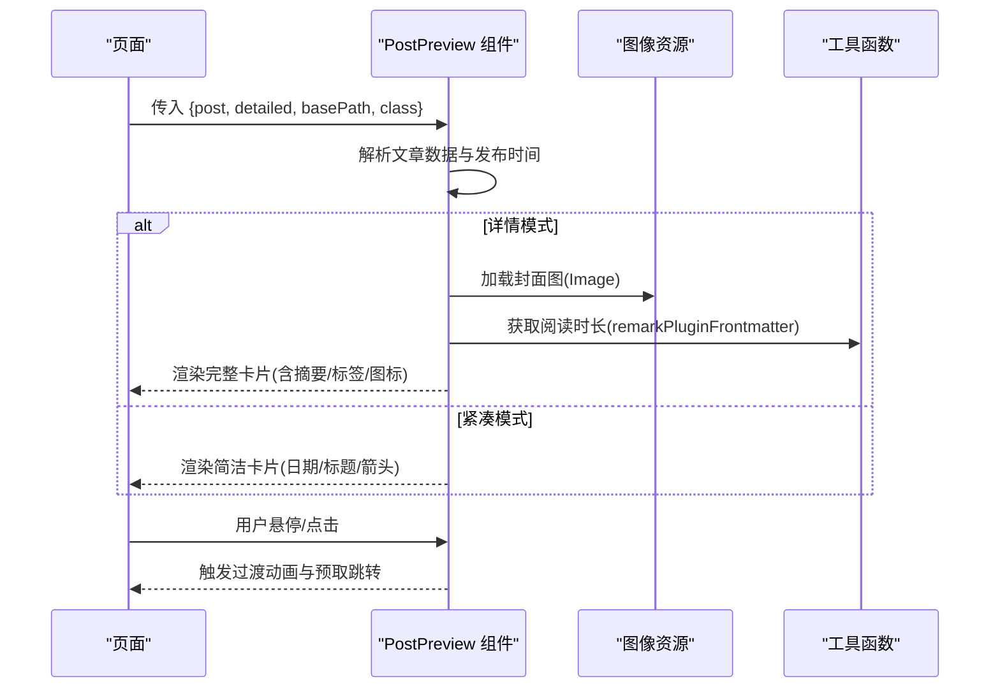
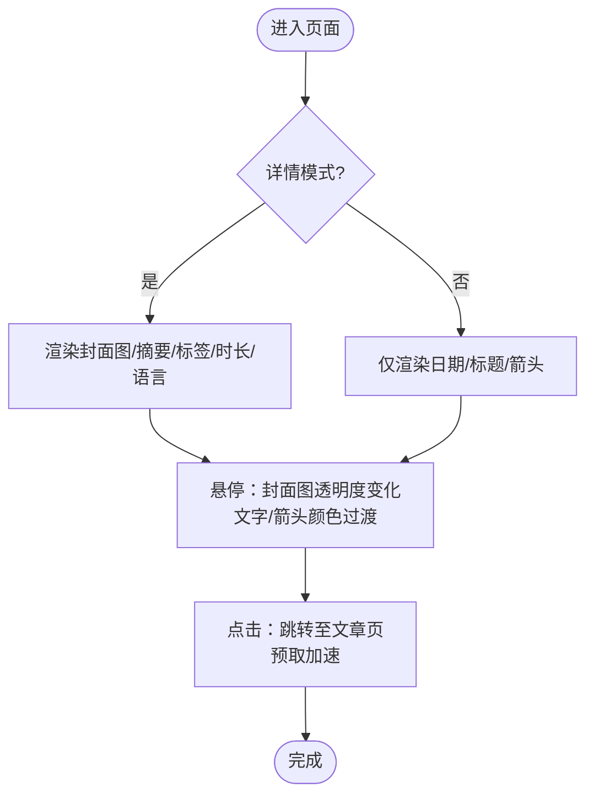
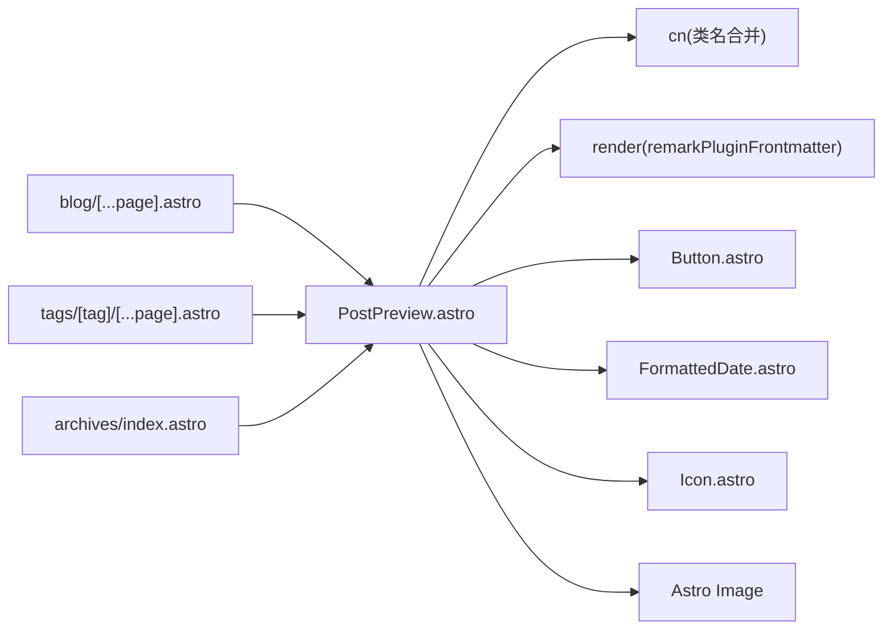

# 文章预览组件

<cite>
**本文引用的文件**
- [packages/pure/components/pages/PostPreview.astro](file://packages/pure/components/pages/PostPreview.astro)
- [packages/pure/components/pages/index.ts](file://packages/pure/components/pages/index.ts)
- [packages/pure/components/user/Button.astro](file://packages/pure/components/user/Button.astro)
- [packages/pure/components/user/FormattedDate.astro](file://packages/pure/components/user/FormattedDate.astro)
- [packages/pure/components/user/Icon.astro](file://packages/pure/components/user/Icon.astro)
- [packages/pure/utils/index.ts](file://packages/pure/utils/index.ts)
- [packages/pure/utils/class-merge.ts](file://packages/pure/utils/class-merge.ts)
- [packages/pure/utils/server.ts](file://packages/pure/utils/server.ts)
- [packages/pure/types/index.ts](file://packages/pure/types/index.ts)
- [src/pages/blog/[...page].astro](file://src/pages/blog/[...page].astro)
- [src/pages/tags/[tag]/[...page].astro](file://src/pages/tags/[tag]/[...page].astro)
- [src/pages/archives/index.astro](file://src/pages/archives/index.astro)
- [src/content/blog/2025-08-24-miniforge-替代conda的Python环境和包管理工具.md](file://src/content/blog/2025-08-24-miniforge-替代conda的Python环境和包管理工具.md)
</cite>

## 目录
1. [简介](#简介)
2. [项目结构](#项目结构)
3. [核心组件](#核心组件)
4. [架构总览](#架构总览)
5. [组件详解](#组件详解)
6. [依赖关系分析](#依赖关系分析)
7. [性能考量](#性能考量)
8. [故障排查指南](#故障排查指南)
9. [结论](#结论)
10. [附录](#附录)

## 简介
PostPreview 是一个用于在列表页、归档页、标签页等场景中展示文章卡片的 Astro 组件。它支持两种展示模式：
- 紧凑模式（默认）：仅展示日期、标题、跳转箭头，适合侧边栏或紧凑列表。
- 详情模式（detailed=true）：展示封面图、标题、摘要、阅读时长、语言、标签等完整信息。

组件具备响应式布局、悬停高亮与渐变过渡、可选的封面图遮罩与渐变主题色融合等视觉特性，并通过 Astro 的预取能力提升交互体验。

## 项目结构
PostPreview 组件位于纯组件库中，供站点多处页面复用。其主要使用位置包括：
- 博客列表页：以详情模式渲染文章卡片。
- 标签页：按标签分页展示文章列表，使用详情模式。
- 归档页：按年份分组展示文章列表，使用紧凑模式。

图表来源
- [src/pages/blog/[...page].astro](file://src/pages/blog/[...page].astro#L52-L80)
- [src/pages/tags/[tag]/[...page].astro](file://src/pages/tags/[tag]/[...page].astro#L55-L72)
- [src/pages/archives/index.astro](file://src/pages/archives/index.astro#L29-L50)
- [packages/pure/components/pages/PostPreview.astro](file://packages/pure/components/pages/PostPreview.astro#L1-L153)
- [packages/pure/components/user/Button.astro](file://packages/pure/components/user/Button.astro#L1-L91)
- [packages/pure/components/user/FormattedDate.astro](file://packages/pure/components/user/FormattedDate.astro#L1-L200)
- [packages/pure/components/user/Icon.astro](file://packages/pure/components/user/Icon.astro#L1-L200)
- [packages/pure/utils/index.ts](file://packages/pure/utils/index.ts#L1-L18)

章节来源
- [src/pages/blog/[...page].astro](file://src/pages/blog/[...page].astro#L52-L80)
- [src/pages/tags/[tag]/[...page].astro](file://src/pages/tags/[tag]/[...page].astro#L55-L72)
- [src/pages/archives/index.astro](file://src/pages/archives/index.astro#L29-L50)
- [packages/pure/components/pages/PostPreview.astro](file://packages/pure/components/pages/PostPreview.astro#L1-L153)

## 核心组件
- 组件名称：PostPreview
- 文件路径：packages/pure/components/pages/PostPreview.astro
- 导出入口：packages/pure/components/pages/index.ts
- 主要职责：
  - 接收文章条目与配置参数，渲染文章卡片。
  - 支持两种模式：紧凑模式与详情模式。
  - 在详情模式下渲染封面图、摘要、阅读时长、语言、标签等。
  - 提供悬停高亮、过渡动画与响应式布局。

章节来源
- [packages/pure/components/pages/PostPreview.astro](file://packages/pure/components/pages/PostPreview.astro#L1-L153)
- [packages/pure/components/pages/index.ts](file://packages/pure/components/pages/index.ts#L1-L10)

## 架构总览
PostPreview 的渲染流程如下：
- 输入：文章集合条目、是否详情模式、基础路径、自定义样式类。
- 渲染：根据模式决定布局与内容；在详情模式下加载封面图与摘要；计算发布时间；渲染标签按钮与图标。
- 交互：使用 Astro 预取链接，提升点击跳转体验；悬停时触发动画与颜色过渡。

图表来源
- [packages/pure/components/pages/PostPreview.astro](file://packages/pure/components/pages/PostPreview.astro#L15-L122)
- [packages/pure/utils/index.ts](file://packages/pure/utils/index.ts#L1-L18)

章节来源
- [packages/pure/components/pages/PostPreview.astro](file://packages/pure/components/pages/PostPreview.astro#L15-L122)

## 组件详解

### 数据模型与输入参数
- 输入参数（Props）
  - post：文章集合条目，包含 id、data（frontmatter 与内容元数据）。
  - detailed：是否启用详情模式，默认 false。
  - basePath：文章链接的基础路径，默认 '/blog'。
  - class：自定义样式类名。
- 关键数据来源
  - 发布时间：优先使用更新时间，否则使用发布日期。
  - 阅读时长：通过渲染结果中的 remarkPluginFrontmatter 获取。
  - 封面图：heroImage（包含颜色、alt、图片资源等）。
  - 标题、描述、语言、标签等来自文章 frontmatter。

章节来源
- [packages/pure/components/pages/PostPreview.astro](file://packages/pure/components/pages/PostPreview.astro#L8-L18)
- [packages/pure/utils/server.ts](file://packages/pure/utils/server.ts#L15-L38)
- [src/content/blog/2025-08-24-miniforge-替代conda的Python环境和包管理工具.md](file://src/content/blog/2025-08-24-miniforge-替代conda的Python环境和包管理工具.md#L1-L51)

### 布局与展示机制
- 紧凑模式（!detailed）
  - 布局：日期 + 标题 + 跳转箭头，横向排列（小屏纵向，大屏横向）。
  - 适用：侧边栏、归档页等空间受限场景。
- 详情模式（detailed=true）
  - 布局：左文右图或上下结构，支持封面图遮罩与渐变主题色融合。
  - 内容：标题、摘要、阅读时长、语言、标签列表。
  - 交互：悬停时封面图透明度变化、箭头与文字颜色过渡。

章节来源
- [packages/pure/components/pages/PostPreview.astro](file://packages/pure/components/pages/PostPreview.astro#L21-L122)

### 缩略图与封面图处理
- 图片组件：使用 Astro 内置 Image 组件，自动进行尺寸与格式优化。
- 加载策略：详情模式下 eager 加载封面图，提升首屏体验。
- 遮罩与渐变：通过 CSS 渐变遮罩实现从左到右或从上到下的遮罩效果，适配移动端与桌面端。
- 主题色融合：当存在 heroImage.color 时，计算高亮色与背景色，使悬停态颜色与主题一致。

章节来源
- [packages/pure/components/pages/PostPreview.astro](file://packages/pure/components/pages/PostPreview.astro#L38-L46)
- [packages/pure/components/pages/PostPreview.astro](file://packages/pure/components/pages/PostPreview.astro#L124-L151)

### 标题、摘要、发布时间
- 标题：支持草稿标记（draft）前置标识。
- 摘要：详情模式下展示，支持行数限制。
- 发布时间：优先使用 updatedDate，否则使用 publishDate，并通过 FormattedDate 组件格式化。

章节来源
- [packages/pure/components/pages/PostPreview.astro](file://packages/pure/components/pages/PostPreview.astro#L54-L58)
- [packages/pure/components/pages/PostPreview.astro](file://packages/pure/components/pages/PostPreview.astro#L85-L92)
- [packages/pure/components/pages/PostPreview.astro](file://packages/pure/components/pages/PostPreview.astro#L17-L18)

### 阅读时长与语言
- 阅读时长：通过 remarkPluginFrontmatter.minutesRead 获取。
- 语言：若 frontmatter 中存在 language 字段，则展示语言徽标与文本。

章节来源
- [packages/pure/components/pages/PostPreview.astro](file://packages/pure/components/pages/PostPreview.astro#L95-L105)

### 标签与交互
- 标签：遍历 tags，使用 Button 组件渲染为可点击的标签按钮，跳转至标签页。
- 交互：箭头与文字在悬停时平滑过渡；卡片整体在悬停时改变背景色与文字色。

章节来源
- [packages/pure/components/pages/PostPreview.astro](file://packages/pure/components/pages/PostPreview.astro#L107-L118)
- [packages/pure/components/user/Button.astro](file://packages/pure/components/user/Button.astro#L1-L91)

### 响应式布局与悬停效果
- 响应式断点：在小屏与大屏采用不同的内边距、行高与布局方向。
- 悬停效果：卡片背景与文字颜色过渡；封面图透明度变化；箭头与线条位移与缩放。
- 主题色融合：通过 CSS 变量与 color-mix 计算高亮色，确保悬停态与主题一致。

章节来源
- [packages/pure/components/pages/PostPreview.astro](file://packages/pure/components/pages/PostPreview.astro#L29-L33)
- [packages/pure/components/pages/PostPreview.astro](file://packages/pure/components/pages/PostPreview.astro#L129-L141)

### 点击交互行为
- 跳转路径：基于 basePath 与文章 id 拼接最终 URL。
- 预取：使用 data-astro-prefetch 提前预取目标页面，降低点击后的等待时间。

章节来源
- [packages/pure/components/pages/PostPreview.astro](file://packages/pure/components/pages/PostPreview.astro#L34-L36)

### 使用场景与页面集成
- 博客列表页：详情模式渲染，配合分页器与侧边栏标签。
- 标签页：详情模式渲染，按标签分页。
- 归档页：紧凑模式渲染，按年份分组展示。

图表来源
- [src/pages/blog/[...page].astro](file://src/pages/blog/[...page].astro#L74-L78)
- [src/pages/tags/[tag]/[...page].astro](file://src/pages/tags/[tag]/[...page].astro#L67)
- [src/pages/archives/index.astro](file://src/pages/archives/index.astro#L44)

章节来源
- [src/pages/blog/[...page].astro](file://src/pages/blog/[...page].astro#L52-L80)
- [src/pages/tags/[tag]/[...page].astro](file://src/pages/tags/[tag]/[...page].astro#L55-L72)
- [src/pages/archives/index.astro](file://src/pages/archives/index.astro#L29-L50)

### 配置选项与样式定制
- 配置项
  - post：必需，文章集合条目。
  - detailed：可选，是否启用详情模式。
  - basePath：可选，文章链接基础路径。
  - class：可选，自定义样式类名。
- 样式定制
  - 通过 class 注入自定义样式覆盖默认布局。
  - 详情模式下可利用 CSS 变量与遮罩实现主题色融合与视觉统一。
- 依赖组件
  - Button：标签按钮。
  - FormattedDate：日期格式化。
  - Icon：图标（如时钟、地球）。

章节来源
- [packages/pure/components/pages/PostPreview.astro](file://packages/pure/components/pages/PostPreview.astro#L8-L13)
- [packages/pure/components/pages/PostPreview.astro](file://packages/pure/components/pages/PostPreview.astro#L124-L151)
- [packages/pure/components/user/Button.astro](file://packages/pure/components/user/Button.astro#L1-L91)
- [packages/pure/components/user/FormattedDate.astro](file://packages/pure/components/user/FormattedDate.astro#L1-L200)
- [packages/pure/components/user/Icon.astro](file://packages/pure/components/user/Icon.astro#L1-L200)

## 依赖关系分析
- 组件内部依赖
  - 工具函数：cn（类名合并）、render（获取 remarkPluginFrontmatter）。
  - 子组件：Button、FormattedDate、Icon。
  - 图像：Astro Image 组件。
- 页面使用方式
  - 博客列表页、标签页、归档页均以相同 Props 方式调用 PostPreview。
  - 归档页通过 class 覆盖卡片边框与背景，适配紧凑展示。

图表来源
- [packages/pure/components/pages/PostPreview.astro](file://packages/pure/components/pages/PostPreview.astro#L1-L153)
- [packages/pure/utils/index.ts](file://packages/pure/utils/index.ts#L1-L18)
- [packages/pure/components/user/Button.astro](file://packages/pure/components/user/Button.astro#L1-L91)
- [packages/pure/components/user/FormattedDate.astro](file://packages/pure/components/user/FormattedDate.astro#L1-L200)
- [packages/pure/components/user/Icon.astro](file://packages/pure/components/user/Icon.astro#L1-L200)
- [src/pages/blog/[...page].astro](file://src/pages/blog/[...page].astro#L74-L78)
- [src/pages/tags/[tag]/[...page].astro](file://src/pages/tags/[tag]/[...page].astro#L67)
- [src/pages/archives/index.astro](file://src/pages/archives/index.astro#L44)

章节来源
- [packages/pure/components/pages/PostPreview.astro](file://packages/pure/components/pages/PostPreview.astro#L1-L153)
- [packages/pure/utils/index.ts](file://packages/pure/utils/index.ts#L1-L18)
- [src/pages/blog/[...page].astro](file://src/pages/blog/[...page].astro#L74-L78)
- [src/pages/tags/[tag]/[...page].astro](file://src/pages/tags/[tag]/[...page].astro#L67)
- [src/pages/archives/index.astro](file://src/pages/archives/index.astro#L44)

## 性能考量
- 图像优化
  - 使用 Astro Image 自动进行尺寸与格式优化，减少带宽与渲染压力。
  - 详情模式下 eager 加载封面图，提升首屏可见性。
- 预取与交互
  - 使用 data-astro-prefetch 提前预取文章页，降低点击延迟。
- 动画与过渡
  - 悬停动画采用 CSS 过渡，避免 JavaScript 动画带来的卡顿。
- 列表渲染
  - 在归档页使用紧凑模式，减少 DOM 结构与重绘成本。
- 环境过滤
  - 通过服务端工具函数过滤草稿文章，避免在生产环境渲染未发布内容。

章节来源
- [packages/pure/components/pages/PostPreview.astro](file://packages/pure/components/pages/PostPreview.astro#L39-L44)
- [packages/pure/components/pages/PostPreview.astro](file://packages/pure/components/pages/PostPreview.astro#L34-L36)
- [packages/pure/utils/server.ts](file://packages/pure/utils/server.ts#L7-L13)

## 故障排查指南
- 封面图不显示
  - 检查 heroImage 是否存在，以及 alt 或标题是否正确回退。
  - 确认 basePath 与文章 id 拼接后路径有效。
- 摘要为空
  - 确认 frontmatter 中 description 是否填写，或内容中是否存在足够长度的段落。
- 阅读时长为 0
  - 确认 remarkPluginFrontmatter 是否可用，检查渲染流程是否正常。
- 标签按钮不可点击
  - 检查 Button 组件的 href 生成逻辑与标签路由。
- 悬停无效果
  - 检查 CSS 变量与过渡类是否被覆盖，确认 hover 样式生效范围。

章节来源
- [packages/pure/components/pages/PostPreview.astro](file://packages/pure/components/pages/PostPreview.astro#L39-L44)
- [packages/pure/components/pages/PostPreview.astro](file://packages/pure/components/pages/PostPreview.astro#L85-L118)
- [packages/pure/components/user/Button.astro](file://packages/pure/components/user/Button.astro#L1-L91)

## 结论
PostPreview 组件通过清晰的参数化设计与模块化依赖，实现了在多种页面布局中的灵活展示。其响应式布局、悬停动画与预取交互提升了用户体验，结合 Astro 图像优化与服务端过滤，兼顾了性能与可维护性。在实际使用中，建议根据页面语义选择合适的展示模式，并通过自定义类名与主题变量实现风格统一。

## 附录
- 类型与常量参考
  - 站点元信息类型、图标类型等可在类型定义中查阅。
- 示例内容
  - 文章 frontmatter 示例展示了标题、发布时间、标签、描述等字段。

章节来源
- [packages/pure/types/index.ts](file://packages/pure/types/index.ts#L7-L33)
- [src/content/blog/2025-08-24-miniforge-替代conda的Python环境和包管理工具.md](file://src/content/blog/2025-08-24-miniforge-替代conda的Python环境和包管理工具.md#L1-L51)