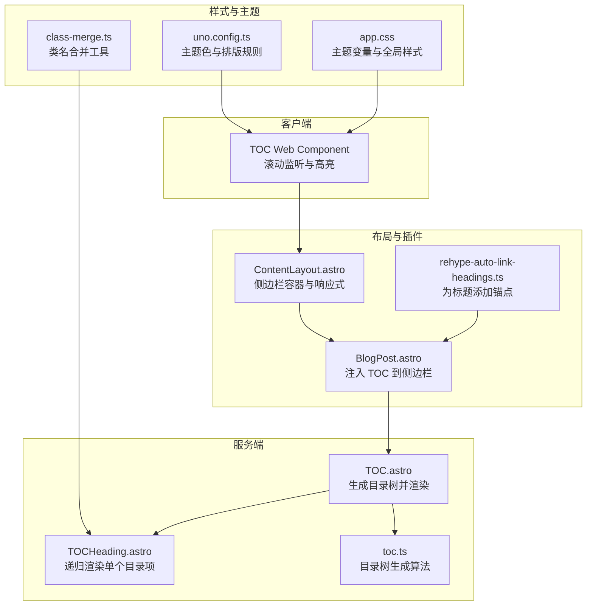
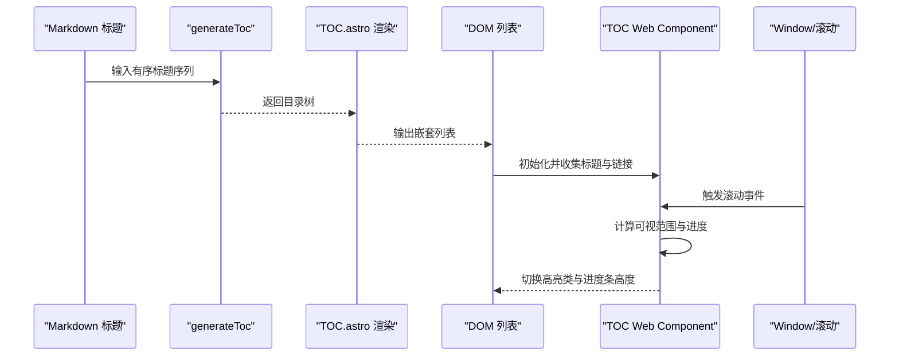
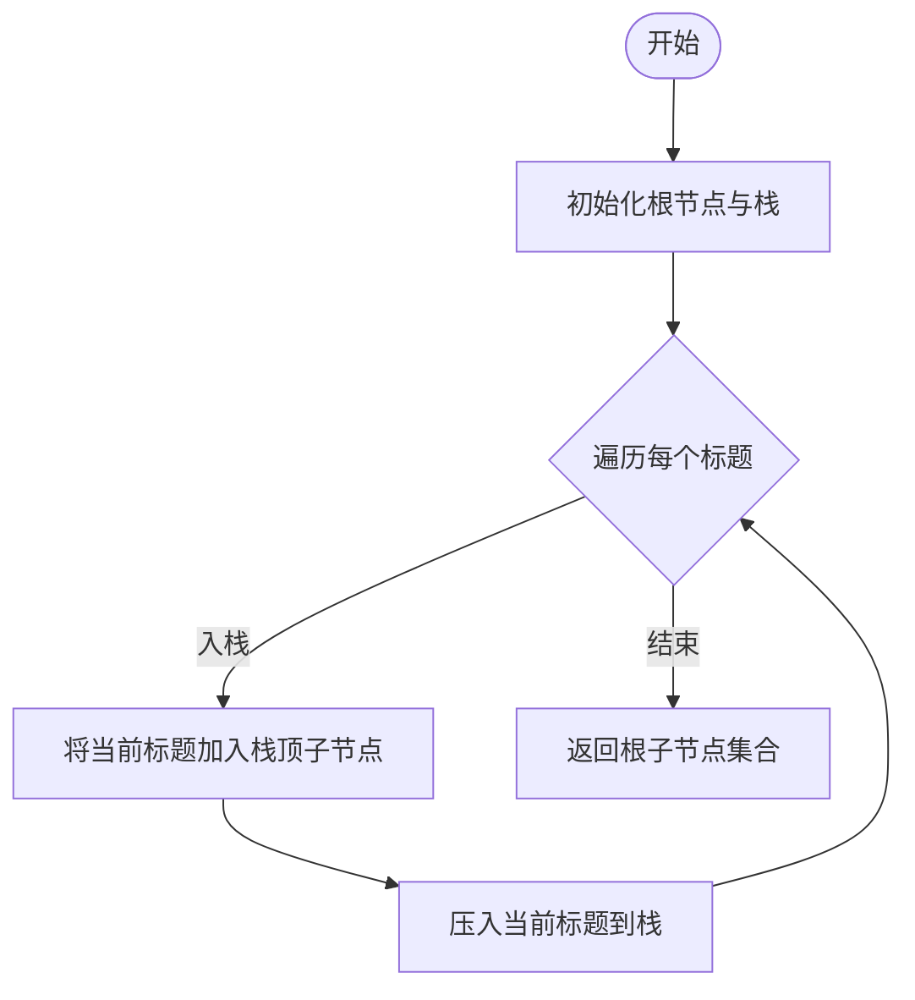
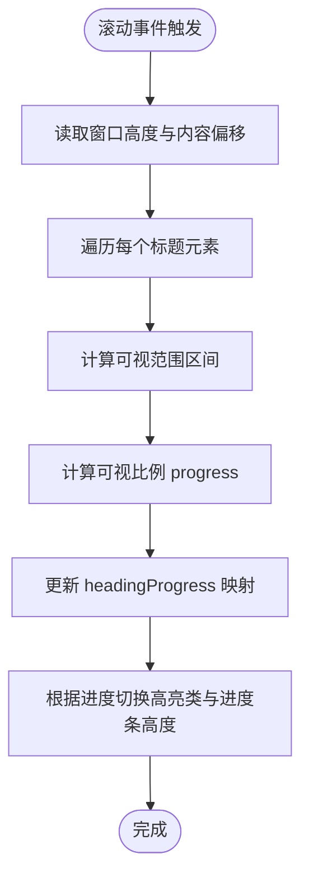
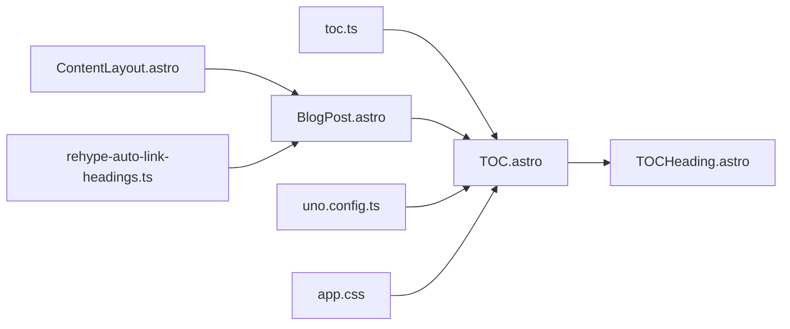

# 目录组件

<cite>
**本文引用的文件**
- [packages/pure/components/pages/TOC.astro](file://packages/pure/components/pages/TOC.astro)
- [packages/pure/components/pages/TOCHeading.astro](file://packages/pure/components/pages/TOCHeading.astro)
- [packages/pure/plugins/toc.ts](file://packages/pure/plugins/toc.ts)
- [src/layouts/BlogPost.astro](file://src/layouts/BlogPost.astro)
- [src/layouts/ContentLayout.astro](file://src/layouts/ContentLayout.astro)
- [src/plugins/rehype-auto-link-headings.ts](file://src/plugins/rehype-auto-link-headings.ts)
- [packages/pure/utils/class-merge.ts](file://packages/pure/utils/class-merge.ts)
- [uno.config.ts](file://uno.config.ts)
- [src/assets/styles/app.css](file://src/assets/styles/app.css)
- [src/pages/docs/[...id].astro](file://src/pages/docs/[...id].astro)
</cite>

## 目录
1. [简介](#简介)
2. [项目结构](#项目结构)
3. [核心组件](#核心组件)
4. [架构总览](#架构总览)
5. [组件详解](#组件详解)
6. [依赖关系分析](#依赖关系分析)
7. [性能考量](#性能考量)
8. [故障排查指南](#故障排查指南)
9. [结论](#结论)
10. [附录](#附录)

## 简介
本文件系统性阐述“目录组件（TOC）”的设计与实现，覆盖以下关键点：
- 目录生成算法：基于 Markdown 标题序列构建层级树
- 锚点导航：自动生成锚点、平滑滚动与 URL 同步
- 滚动同步机制：实时计算标题可视区域进度，驱动目录项高亮与进度条
- 当前项高亮与响应式显示策略：结合容器高度与滚动位置动态切换样式
- 组件配置与扩展：标题级别过滤、样式主题、展开折叠等思路
- 使用场景与最佳实践：博客文章页、文档页等
- 性能优化建议与无障碍支持

## 项目结构
TOC 组件由三部分组成：
- 服务端渲染层：生成目录树并输出列表
- 客户端 Web Component 层：负责滚动监听、高亮与进度条动画
- 工具与样式层：目录项渲染、类名合并、主题色与排版配置



图表来源
- [packages/pure/components/pages/TOC.astro](file://packages/pure/components/pages/TOC.astro#L1-L136)
- [packages/pure/components/pages/TOCHeading.astro](file://packages/pure/components/pages/TOCHeading.astro#L1-L40)
- [packages/pure/plugins/toc.ts](file://packages/pure/plugins/toc.ts#L1-L25)
- [src/layouts/BlogPost.astro](file://src/layouts/BlogPost.astro#L1-L75)
- [src/layouts/ContentLayout.astro](file://src/layouts/ContentLayout.astro#L1-L156)
- [src/plugins/rehype-auto-link-headings.ts](file://src/plugins/rehype-auto-link-headings.ts#L1-L42)
- [packages/pure/utils/class-merge.ts](file://packages/pure/utils/class-merge.ts#L1-L20)
- [uno.config.ts](file://uno.config.ts#L1-L193)
- [src/assets/styles/app.css](file://src/assets/styles/app.css#L1-L48)

章节来源
- [packages/pure/components/pages/TOC.astro](file://packages/pure/components/pages/TOC.astro#L1-L136)
- [packages/pure/components/pages/TOCHeading.astro](file://packages/pure/components/pages/TOCHeading.astro#L1-L40)
- [packages/pure/plugins/toc.ts](file://packages/pure/plugins/toc.ts#L1-L25)
- [src/layouts/BlogPost.astro](file://src/layouts/BlogPost.astro#L1-L75)
- [src/layouts/ContentLayout.astro](file://src/layouts/ContentLayout.astro#L1-L156)
- [src/plugins/rehype-auto-link-headings.ts](file://src/plugins/rehype-auto-link-headings.ts#L1-L42)
- [packages/pure/utils/class-merge.ts](file://packages/pure/utils/class-merge.ts#L1-L20)
- [uno.config.ts](file://uno.config.ts#L1-L193)
- [src/assets/styles/app.css](file://src/assets/styles/app.css#L1-L48)

## 核心组件
- 目录容器（TOC.astro）
  - 接收 Markdown 标题数组，调用目录生成函数构建树，渲染为嵌套列表
  - 内置 Web Component 类，负责滚动监听、高亮与进度条
- 目录项（TOCHeading.astro）
  - 递归渲染子目录项，支持深度缩进与可访问性标签
- 目录生成器（toc.ts）
  - 基于单调栈的线性算法，将有序标题序列转为层级树
- 布局集成（BlogPost.astro、ContentLayout.astro）
  - 将 TOC 注入到侧边栏槽位，并提供响应式容器
- 锚点生成（rehype-auto-link-headings.ts）
  - 为标题元素自动添加锚点链接，确保 TOC 可点击跳转
- 样式与主题（class-merge.ts、uno.config.ts、app.css）
  - 提供类名合并、主题色变量与排版规则，支撑高亮与进度条视觉效果

章节来源
- [packages/pure/components/pages/TOC.astro](file://packages/pure/components/pages/TOC.astro#L1-L136)
- [packages/pure/components/pages/TOCHeading.astro](file://packages/pure/components/pages/TOCHeading.astro#L1-L40)
- [packages/pure/plugins/toc.ts](file://packages/pure/plugins/toc.ts#L1-L25)
- [src/layouts/BlogPost.astro](file://src/layouts/BlogPost.astro#L1-L75)
- [src/layouts/ContentLayout.astro](file://src/layouts/ContentLayout.astro#L1-L156)
- [src/plugins/rehype-auto-link-headings.ts](file://src/plugins/rehype-auto-link-headings.ts#L1-L42)
- [packages/pure/utils/class-merge.ts](file://packages/pure/utils/class-merge.ts#L1-L20)
- [uno.config.ts](file://uno.config.ts#L1-L193)
- [src/assets/styles/app.css](file://src/assets/styles/app.css#L1-L48)

## 架构总览
下图展示从内容到交互的完整链路：Markdown 标题经生成器构建目录树，服务端渲染为列表；客户端 Web Component 订阅滚动事件，计算可视进度并更新高亮与进度条。



图表来源
- [packages/pure/plugins/toc.ts](file://packages/pure/plugins/toc.ts#L1-L25)
- [packages/pure/components/pages/TOC.astro](file://packages/pure/components/pages/TOC.astro#L1-L136)
- [src/plugins/rehype-auto-link-headings.ts](file://src/plugins/rehype-auto-link-headings.ts#L1-L42)

## 组件详解

### 目录生成算法
- 数据模型
  - MarkdownHeading：包含标题文本、层级与唯一标识
  - TocItem：在 MarkdownHeading 基础上增加子节点数组
- 算法流程
  - 使用单调栈维护当前路径，遍历标题序列
  - 当遇到更深层级时入栈，遇到更浅或同级时弹出至正确父级
  - 将当前标题作为子节点挂接到父级，然后入栈
- 复杂度
  - 时间复杂度 O(n)，空间复杂度 O(n)



图表来源
- [packages/pure/plugins/toc.ts](file://packages/pure/plugins/toc.ts#L1-L25)

章节来源
- [packages/pure/plugins/toc.ts](file://packages/pure/plugins/toc.ts#L1-L25)

### 锚点导航与平滑滚动
- 锚点生成
  - 通过插件为每个带 id 的标题包裹锚点链接，确保可直接跳转
- 导航行为
  - 点击目录项时阻止默认跳转，使用历史记录 API 更新 URL，再对目标标题执行平滑滚动
- 可访问性
  - 目录项提供 aria-label，明确指示跳转目标

```mermaid
sequenceDiagram
participant User as "用户"
participant Link as "目录项链接"
participant WC as "TOC Web Component"
participant Hist as "History API"
participant Head as "目标标题元素"
User->>Link : 点击
Link->>WC : 触发点击回调
WC->>Hist : pushState(更新URL哈希)
WC->>Head : scrollIntoView({ behavior : "smooth" })
```

图表来源
- [packages/pure/components/pages/TOC.astro](file://packages/pure/components/pages/TOC.astro#L101-L125)
- [src/plugins/rehype-auto-link-headings.ts](file://src/plugins/rehype-auto-link-headings.ts#L1-L42)

章节来源
- [packages/pure/components/pages/TOC.astro](file://packages/pure/components/pages/TOC.astro#L101-L125)
- [src/plugins/rehype-auto-link-headings.ts](file://src/plugins/rehype-auto-link-headings.ts#L1-L42)

### 滚动同步机制与当前项高亮
- 元素发现
  - 在组件初始化时查询文章内所有标题元素与目录项链接
  - 通过链接的 href 提取目标标题 id，建立映射关系
- 进度计算
  - 以窗口高度与内容容器偏移为基准，计算每个标题可视范围
  - 将可视比例映射到 0~1，用于进度条高度与高亮状态判断
- 高亮策略
  - 当标题进入可视区域时，为链接与进度条添加高亮类
  - 对首尾可视标题进行圆角修饰，形成连续高亮块的视觉反馈
- 实时更新
  - 使用定时器与滚动事件触发更新，保证高亮与进度条实时跟随



图表来源
- [packages/pure/components/pages/TOC.astro](file://packages/pure/components/pages/TOC.astro#L61-L99)

章节来源
- [packages/pure/components/pages/TOC.astro](file://packages/pure/components/pages/TOC.astro#L41-L129)

### 响应式显示策略
- 侧边栏容器
  - 固定宽度与最大高度，移动端提供抽屉式遮罩与动画
  - 桌面端固定定位，配合滚动条实现长目录的可浏览性
- 文档页适配
  - 在大屏下将目录组件设为纵向布局并启用垂直滚动
- 主题与样式
  - 使用 UnoCSS 主题变量与 safelist，确保高亮与圆角类可用

章节来源
- [src/layouts/ContentLayout.astro](file://src/layouts/ContentLayout.astro#L1-L156)
- [src/pages/docs/[...id].astro](file://src/pages/docs/[...id].astro#L79-L97)
- [uno.config.ts](file://uno.config.ts#L174-L192)

### 目录项渲染与样式
- 递归渲染
  - 支持多级子目录，按深度增加缩进
- 可访问性
  - 为每个链接提供 aria-label，描述跳转目标
- 类名合并
  - 使用 cn 工具合并条件类，避免重复与冲突

章节来源
- [packages/pure/components/pages/TOCHeading.astro](file://packages/pure/components/pages/TOCHeading.astro#L1-L40)
- [packages/pure/utils/class-merge.ts](file://packages/pure/utils/class-merge.ts#L1-L20)

### 布局集成与使用场景
- 博客文章页
  - 在文章布局中将 TOC 注入侧边栏槽位，随内容滚动同步
- 文档页
  - 结合文档目录组件与文章 TOC，分别处理静态导航与阅读导航
- 最佳实践
  - 确保标题具备 id，以便锚点与滚动定位
  - 控制目录层级，避免过深导致阅读负担
  - 在移动端提供便捷的侧边栏开关

章节来源
- [src/layouts/BlogPost.astro](file://src/layouts/BlogPost.astro#L1-L75)
- [src/layouts/ContentLayout.astro](file://src/layouts/ContentLayout.astro#L1-L156)

## 依赖关系分析
- 组件耦合
  - TOC.astro 依赖 toc.ts 生成目录树，依赖 TOCHeading 递归渲染
  - 客户端 Web Component 依赖布局容器与标题元素结构
- 外部依赖
  - rehype-auto-link-headings.ts 为标题生成锚点，是 TOC 跳转的基础
  - UnoCSS 主题变量与 safelist 保障高亮与圆角类生效
- 潜在循环
  - 无直接循环依赖，数据流单向：标题 → 目录树 → 列表 → 滚动监听



图表来源
- [packages/pure/plugins/toc.ts](file://packages/pure/plugins/toc.ts#L1-L25)
- [packages/pure/components/pages/TOC.astro](file://packages/pure/components/pages/TOC.astro#L1-L136)
- [packages/pure/components/pages/TOCHeading.astro](file://packages/pure/components/pages/TOCHeading.astro#L1-L40)
- [src/layouts/BlogPost.astro](file://src/layouts/BlogPost.astro#L1-L75)
- [src/layouts/ContentLayout.astro](file://src/layouts/ContentLayout.astro#L1-L156)
- [src/plugins/rehype-auto-link-headings.ts](file://src/plugins/rehype-auto-link-headings.ts#L1-L42)
- [uno.config.ts](file://uno.config.ts#L1-L193)
- [src/assets/styles/app.css](file://src/assets/styles/app.css#L1-L48)

章节来源
- [packages/pure/plugins/toc.ts](file://packages/pure/plugins/toc.ts#L1-L25)
- [packages/pure/components/pages/TOC.astro](file://packages/pure/components/pages/TOC.astro#L1-L136)
- [packages/pure/components/pages/TOCHeading.astro](file://packages/pure/components/pages/TOCHeading.astro#L1-L40)
- [src/layouts/BlogPost.astro](file://src/layouts/BlogPost.astro#L1-L75)
- [src/layouts/ContentLayout.astro](file://src/layouts/ContentLayout.astro#L1-L156)
- [src/plugins/rehype-auto-link-headings.ts](file://src/plugins/rehype-auto-link-headings.ts#L1-L42)
- [uno.config.ts](file://uno.config.ts#L1-L193)
- [src/assets/styles/app.css](file://src/assets/styles/app.css#L1-L48)

## 性能考量
- 滚动事件节流
  - 当前使用滚动事件与定时器组合，建议在高频滚动场景引入 requestAnimationFrame 或节流函数，降低重绘频率
- DOM 查询优化
  - 标题与链接查询可在组件初始化后缓存，避免重复选择器匹配
- 目录层级控制
  - 限制最大层级与子节点数量，必要时提供“展开/折叠”交互，减少一次性渲染量
- 进度计算简化
  - 可考虑仅对可视标题进行进度计算，忽略完全不可见区域
- 预渲染与懒加载
  - 对长文可延迟初始化 Web Component，或在首屏后再注册，提升首屏性能

## 故障排查指南
- 目录项无法高亮
  - 检查标题是否具备 id，确认 rehype 插件已生效
  - 确认内容容器 id 与滚动计算使用的偏移一致
- 点击目录无反应
  - 检查链接 href 是否为以 # 开头的片段标识
  - 确认目标标题元素存在且可见
- 移动端显示异常
  - 检查侧边栏抽屉样式与遮罩逻辑
  - 确认大屏样式媒体查询未影响小屏布局
- 进度条不更新
  - 确认滚动事件绑定成功，且定时器未被意外清理
  - 检查主题类名是否在 safelist 中

章节来源
- [packages/pure/components/pages/TOC.astro](file://packages/pure/components/pages/TOC.astro#L41-L129)
- [src/plugins/rehype-auto-link-headings.ts](file://src/plugins/rehype-auto-link-headings.ts#L1-L42)
- [src/layouts/ContentLayout.astro](file://src/layouts/ContentLayout.astro#L77-L156)
- [uno.config.ts](file://uno.config.ts#L184-L192)

## 结论
该目录组件以简洁高效的目录生成算法为基础，结合 Web Component 的滚动同步能力，实现了从静态目录到动态导航的完整闭环。通过合理的样式与主题体系，组件在桌面与移动端均具备良好的可读性与交互体验。建议在长文场景中进一步优化滚动性能与渲染开销，并完善层级控制与可访问性细节，以满足更广泛的使用需求。

## 附录

### 组件配置与扩展建议
- 标题级别过滤
  - 在生成目录树前过滤掉不需要的层级，例如仅保留 h2~h4
- 样式主题
  - 通过主题变量统一高亮色、背景色与圆角尺寸
- 展开/折叠
  - 为深层目录提供展开/折叠按钮，减少初始渲染量
- 可访问性增强
  - 为目录容器提供 role 与 aria-labelledby
  - 为链接提供键盘可达性与焦点状态

### 使用场景与最佳实践
- 博客文章页
  - 将 TOC 放置于侧边栏，随正文滚动同步，保持标题 id 与锚点一致
- 文档页
  - 结合文档目录组件与文章 TOC，分别承担导航与阅读辅助
- 多语言与多主题
  - 通过主题变量与 UnoCSS 规则，适配不同语言与设计风格