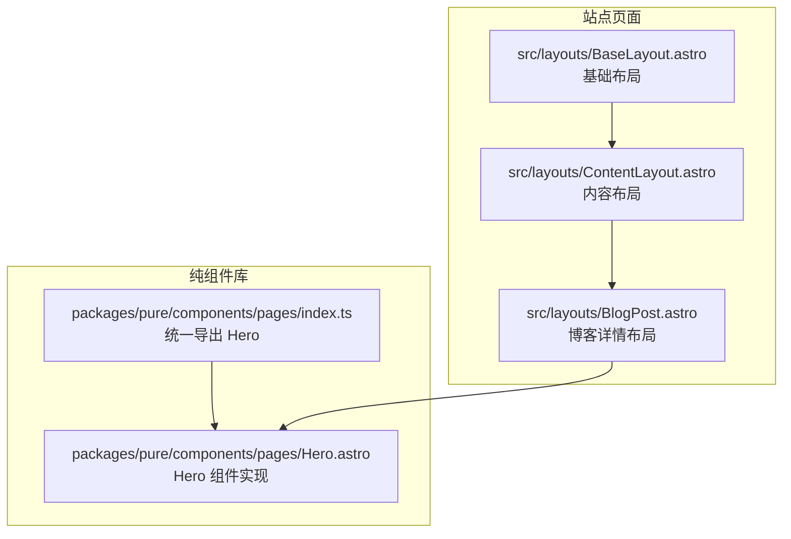
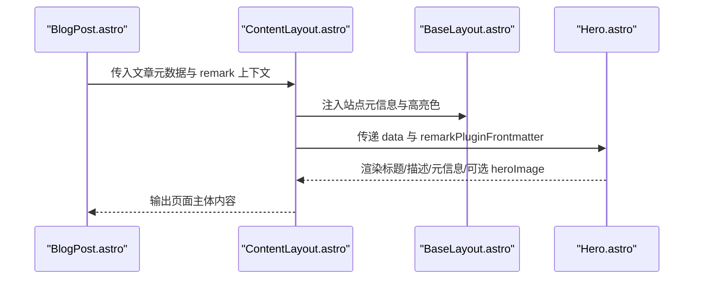
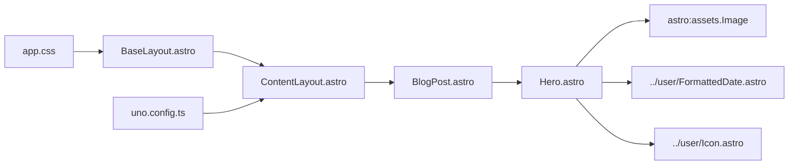

# 英雄区域组件

<cite>
**本文引用的文件**
- [Hero.astro](file://packages/pure/components/pages/Hero.astro)
- [pages/index.ts](file://packages/pure/components/pages/index.ts)
- [BlogPost.astro](file://src/layouts/BlogPost.astro)
- [ContentLayout.astro](file://src/layouts/ContentLayout.astro)
- [BaseLayout.astro](file://src/layouts/BaseLayout.astro)
- [app.css](file://src/assets/styles/app.css)
- [uno.config.ts](file://uno.config.ts)
- [site.config.ts](file://src/site.config.ts)
- [2025-08-24-miniforge-替代conda的python环境和包管理工具.md](file://src/content/blog/2025-08-24-miniforge-替代conda的python环境和包管理工具.md)
- [2025-09-20-五分钟快速部署：用 Docker 和 Docker Compose 部署 FastAPI 应用.md](file://src/content/blog/2025-09-20-五分钟快速部署：用 Docker 和 Docker Compose 部署 FastAPI 应用.md)
- [rss.xml.ts](file://src/pages/rss.xml.ts)
</cite>

## 目录
1. [简介](#简介)
2. [项目结构](#项目结构)
3. [核心组件](#核心组件)
4. [架构总览](#架构总览)
5. [详细组件分析](#详细组件分析)
6. [依赖关系分析](#依赖关系分析)
7. [性能考量](#性能考量)
8. [故障排查指南](#故障排查指南)
9. [结论](#结论)
10. [附录](#附录)

## 简介
Hero 组件用于在页面顶部展示文章的标题、副标题、标签、语言、阅读时长、发布/更新日期等元信息，并可选地展示封面图与背景虚化层。组件采用 Astro 组件形式，结合 UnoCSS 提供的排版与颜色体系，确保在不同页面类型（如博客详情页）中保持一致的视觉与交互体验。

## 项目结构
Hero 组件位于纯组件库中，通过统一导出入口暴露给业务页面使用；在博客详情页布局中被组合使用，配合全局主题与排版配置，形成完整的页面头部信息区。

**图表来源**
- [pages/index.ts](file://packages/pure/components/pages/index.ts#L1-L10)
- [Hero.astro](file://packages/pure/components/pages/Hero.astro#L1-L147)
- [BlogPost.astro](file://src/layouts/BlogPost.astro#L1-L52)
- [ContentLayout.astro](file://src/layouts/ContentLayout.astro#L1-L156)
- [BaseLayout.astro](file://src/layouts/BaseLayout.astro#L1-L92)

**章节来源**
- [pages/index.ts](file://packages/pure/components/pages/index.ts#L1-L10)
- [Hero.astro](file://packages/pure/components/pages/Hero.astro#L1-L147)
- [BlogPost.astro](file://src/layouts/BlogPost.astro#L1-L52)
- [ContentLayout.astro](file://src/layouts/ContentLayout.astro#L1-L156)
- [BaseLayout.astro](file://src/layouts/BaseLayout.astro#L1-L92)

## 核心组件
- 组件职责
  - 展示文章标题与描述（支持插槽扩展）
  - 渲染文章元信息：发布日期、更新日期、阅读时长、语言、标签
  - 可选展示封面图与背景虚化层，滚动时动态调整虚化层透明度
  - 支持草稿标记显示
- 关键数据源
  - 来自 Astro 内容集合的文章数据（标题、描述、草稿、heroImage、发布/更新时间、标签、语言）
  - remark 插件提供的阅读时长等前端上下文
- 视觉与排版
  - 使用 UnoCSS 类名进行响应式布局与间距控制
  - 主题色通过全局 CSS 变量与 Uno 配置注入，保证一致性

**章节来源**
- [Hero.astro](file://packages/pure/components/pages/Hero.astro#L7-L20)
- [Hero.astro](file://packages/pure/components/pages/Hero.astro#L22-L147)
- [BlogPost.astro](file://src/layouts/BlogPost.astro#L14-L36)
- [app.css](file://src/assets/styles/app.css#L1-L49)
- [uno.config.ts](file://uno.config.ts#L1-L193)

## 架构总览
Hero 组件在页面中的位置与协作关系如下：

**图表来源**
- [BlogPost.astro](file://src/layouts/BlogPost.astro#L14-L52)
- [ContentLayout.astro](file://src/layouts/ContentLayout.astro#L15-L76)
- [BaseLayout.astro](file://src/layouts/BaseLayout.astro#L12-L92)
- [Hero.astro](file://packages/pure/components/pages/Hero.astro#L7-L20)

## 详细组件分析

### 数据模型与属性
- 输入属性
  - data：来自内容集合的博客条目数据
  - remarkPluginFrontmatter：remark 插件注入的前端上下文（如阅读时长）
- 元信息字段
  - 标题、描述、草稿标记、heroImage、发布/更新日期、标签、语言
- 日期格式化
  - 使用 Intl 选项仅显示月份缩写，便于紧凑展示

**章节来源**
- [Hero.astro](file://packages/pure/components/pages/Hero.astro#L7-L20)
- [Hero.astro](file://packages/pure/components/pages/Hero.astro#L12-L15)

### 布局与视觉效果
- 标题与描述
  - 标题采用语义化层级，配合响应式字号
  - 描述支持默认段落与插槽扩展
- 元信息行
  - 发布日期与更新日期联动显示，更新项以分隔符呈现
  - 阅读时长、语言、标签分别以图标与文字形式展示
  - 标签支持点击跳转至筛选页
- 封面图与背景虚化层
  - 双图层：前景图用于清晰展示，背景图进行模糊与透明度过渡
  - 滚动监听根据视口高度阈值逐步降低背景虚化层透明度
- 分割线
  - 顶部分隔线用于强调内容分区

**章节来源**
- [Hero.astro](file://packages/pure/components/pages/Hero.astro#L22-L147)

### 响应式设计实现
- 标题与描述
  - 在小屏设备上自动居中与间距调整
- 元信息行
  - 使用换行与紧凑间距，适配多标签与多语言场景
- 封面图
  - 最大宽度约束与容器圆角，确保在不同屏幕下的可读性
- 背景虚化层
  - 通过 JavaScript 动态计算透明度，避免在小屏设备上过度遮挡

**章节来源**
- [Hero.astro](file://packages/pure/components/pages/Hero.astro#L22-L147)

### 背景图片处理与文本排版优化
- 图片处理
  - 前景图与背景图共享同一资源，但分别设置加载优先级与模糊滤镜
  - 背景图使用过渡动画，提升滚动时的视觉连贯性
- 文本排版
  - 依托 UnoCSS 排版预设，统一标题、正文、引用、列表等元素的视觉风格
  - 通过站点配置注入主题色变量，使组件颜色与整体风格一致

**章节来源**
- [Hero.astro](file://packages/pure/components/pages/Hero.astro#L22-L147)
- [app.css](file://src/assets/styles/app.css#L1-L49)
- [uno.config.ts](file://uno.config.ts#L14-L125)

### 组件配置选项
- 必填输入
  - data：必须包含标题、描述、草稿标记、heroImage（可选）、发布/更新日期、标签（可选）、语言（可选）
  - remarkPluginFrontmatter：包含阅读时长等前端上下文
- 可选行为
  - 是否展示草稿标记
  - 是否展示 heroImage 与背景虚化层
  - 标签点击跳转与过滤能力（依赖 pagefind）

**章节来源**
- [Hero.astro](file://packages/pure/components/pages/Hero.astro#L7-L20)
- [Hero.astro](file://packages/pure/components/pages/Hero.astro#L22-L147)

### 在不同页面类型中的使用场景与最佳实践
- 博客详情页
  - 在博客布局中直接渲染 Hero，展示文章标题、描述、元信息与封面图
  - 高亮色由文章 heroImage 的主色调推导，增强页面主题一致性
  - 通过 remark 插件提供阅读时长，提升用户预期
- 关于页等非文章页
  - Hero 组件不强制要求 heroImage 或元信息，可在其他布局中按需组合
  - 若存在封面图，建议遵循相同加载策略与视觉规范

**章节来源**
- [BlogPost.astro](file://src/layouts/BlogPost.astro#L14-L52)
- [rss.xml.ts](file://src/pages/rss.xml.ts#L66-L83)

### 样式定制指南
- 主题色与变量
  - 通过全局 CSS 变量与 Uno 配置注入主题色，Hero 组件的颜色与边框、背景等元素保持一致
- 排版风格
  - 使用 UnoCSS 排版预设，统一标题、正文、引用等元素的视觉风格
- 组件局部样式
  - 可通过类名覆盖局部样式，如标题字号、间距、圆角等
- 高亮色注入
  - 基础布局支持通过 highlightColor 注入页面高亮色，Hero 组件可与之协同

**章节来源**
- [app.css](file://src/assets/styles/app.css#L1-L49)
- [uno.config.ts](file://uno.config.ts#L14-L125)
- [BaseLayout.astro](file://src/layouts/BaseLayout.astro#L52-L89)

### 性能优化建议
- 图片加载
  - 前景图与背景图均设置高优先级与急切加载，减少首屏阻塞
  - 背景图使用模糊滤镜与渐变透明度，避免额外重绘
- 滚动事件
  - 使用节流/防抖策略（当前实现为直接监听滚动），避免频繁计算导致掉帧
- 内容渲染
  - 仅在存在 heroImage 时渲染双图层，减少不必要的 DOM 结构
- SEO 与社交卡片
  - RSS 中嵌入 heroImage 作为社交分享图，提升传播效果

**章节来源**
- [Hero.astro](file://packages/pure/components/pages/Hero.astro#L22-L147)
- [rss.xml.ts](file://src/pages/rss.xml.ts#L66-L83)

## 依赖关系分析
Hero 组件的依赖与耦合关系如下：

**图表来源**
- [Hero.astro](file://packages/pure/components/pages/Hero.astro#L1-L10)
- [BlogPost.astro](file://src/layouts/BlogPost.astro#L8-L12)
- [ContentLayout.astro](file://src/layouts/ContentLayout.astro#L1-L8)
- [BaseLayout.astro](file://src/layouts/BaseLayout.astro#L1-L10)
- [uno.config.ts](file://uno.config.ts#L174-L193)
- [app.css](file://src/assets/styles/app.css#L1-L49)

**章节来源**
- [Hero.astro](file://packages/pure/components/pages/Hero.astro#L1-L10)
- [BlogPost.astro](file://src/layouts/BlogPost.astro#L8-L12)
- [ContentLayout.astro](file://src/layouts/ContentLayout.astro#L1-L8)
- [BaseLayout.astro](file://src/layouts/BaseLayout.astro#L1-L10)
- [uno.config.ts](file://uno.config.ts#L174-L193)
- [app.css](file://src/assets/styles/app.css#L1-L49)

## 性能考量
- 图片优先级与懒加载
  - 前景图与背景图均设置高优先级与急切加载，缩短首屏渲染时间
- 滚动性能
  - 当前实现直接监听滚动事件，建议在生产环境中加入节流/防抖，降低计算频率
- DOM 结构最小化
  - 仅在存在 heroImage 时渲染双图层，减少不必要的节点
- 主题注入
  - 通过全局 CSS 变量与 Uno 预设，避免重复定义样式，提升维护性与渲染效率

**章节来源**
- [Hero.astro](file://packages/pure/components/pages/Hero.astro#L22-L147)
- [app.css](file://src/assets/styles/app.css#L1-L49)
- [uno.config.ts](file://uno.config.ts#L174-L193)

## 故障排查指南
- 封面图未显示
  - 检查 heroImage 是否正确传入，以及资源路径是否有效
  - 确认背景图与前景图共享同一资源对象
- 背景虚化层不生效
  - 确认滚动事件绑定成功，且存在目标元素
  - 检查透明度阈值与视口高度的关系
- 标签跳转异常
  - 确认 pagefind 已启用，标签筛选属性已正确设置
- 日期显示不符合预期
  - 检查日期格式化选项与本地化配置

**章节来源**
- [Hero.astro](file://packages/pure/components/pages/Hero.astro#L22-L147)
- [site.config.ts](file://src/site.config.ts#L124-L149)

## 结论
Hero 组件通过简洁的数据接口与灵活的布局能力，在博客详情页中承担了“页面头部信息区”的关键角色。其与布局系统、主题与排版配置的深度集成，确保了在不同页面类型中的一致性与可维护性。建议在生产环境中对滚动事件进行性能优化，并充分利用主题与排版配置实现更丰富的定制化体验。

## 附录
- 示例文章数据
  - [2025-08-24-miniforge-替代conda的python环境和包管理工具.md](file://src/content/blog/2025-08-24-miniforge-替代conda的python环境和包管理工具.md#L1-L51)
  - [2025-09-20-五分钟快速部署：用 Docker 和 Docker Compose 部署 FastAPI 应用.md](file://src/content/blog/2025-09-20-五分钟快速部署：用 Docker 和 Docker Compose 部署 FastAPI 应用.md#L1-L70)