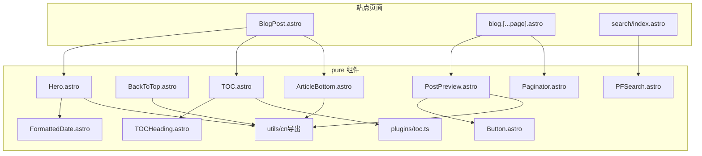
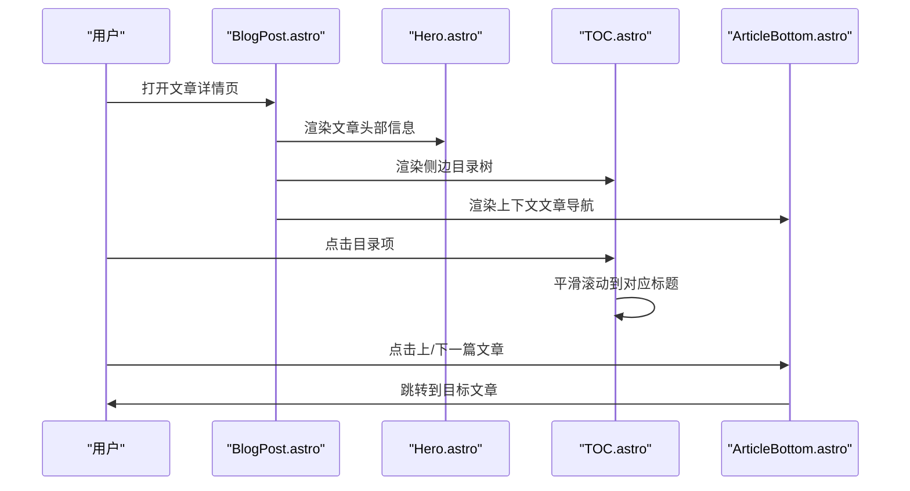
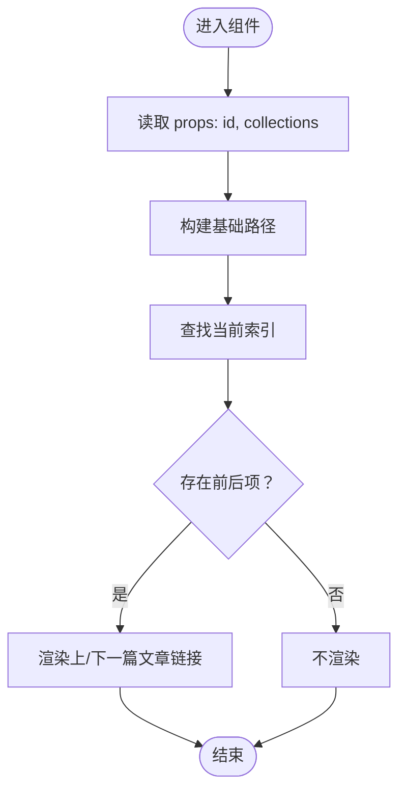
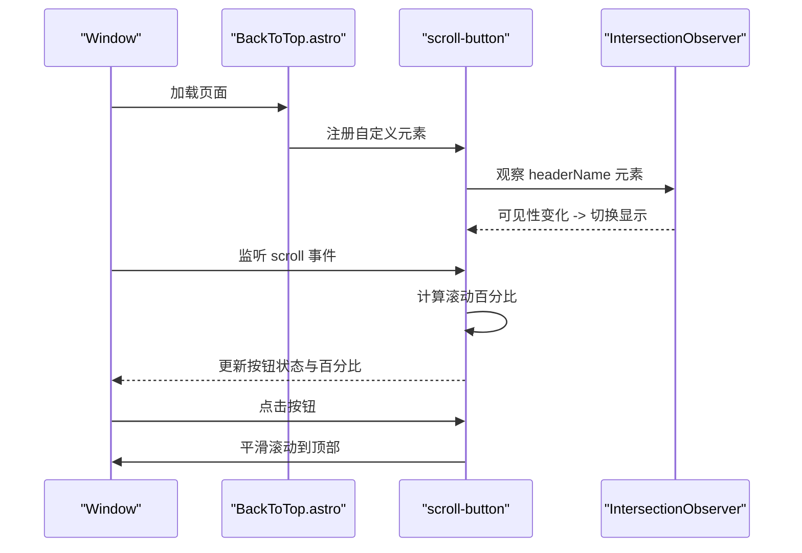
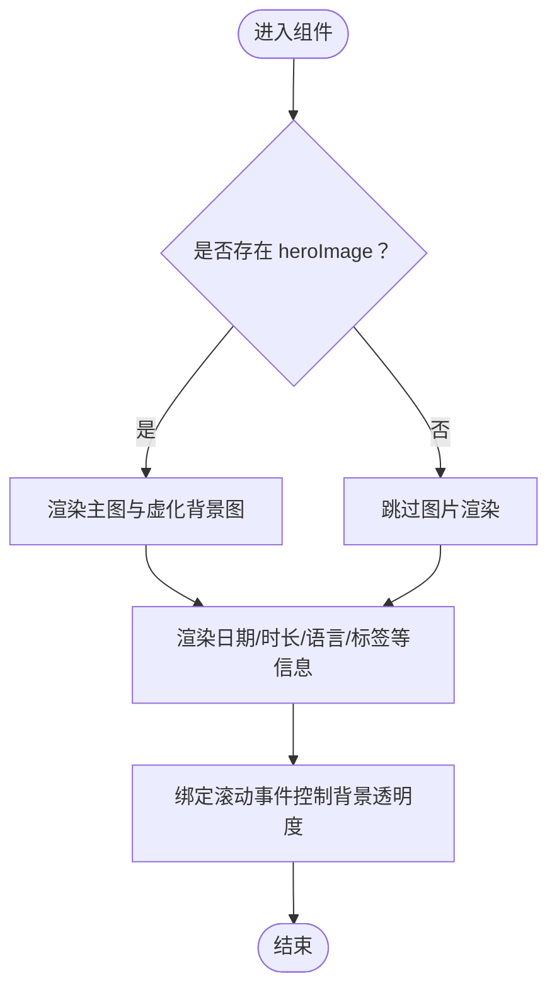
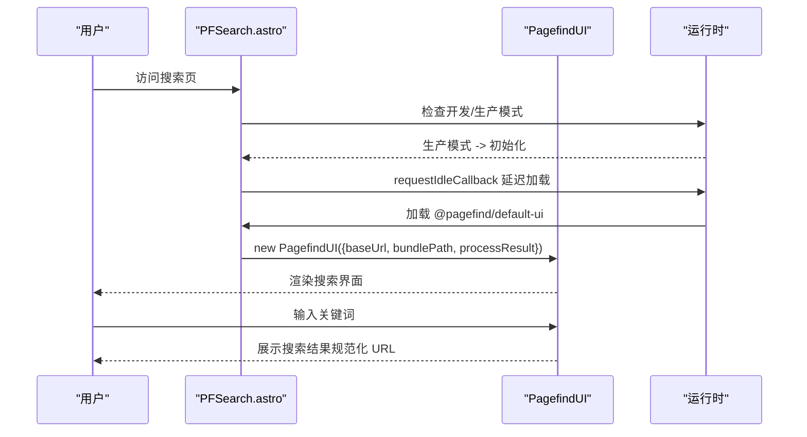
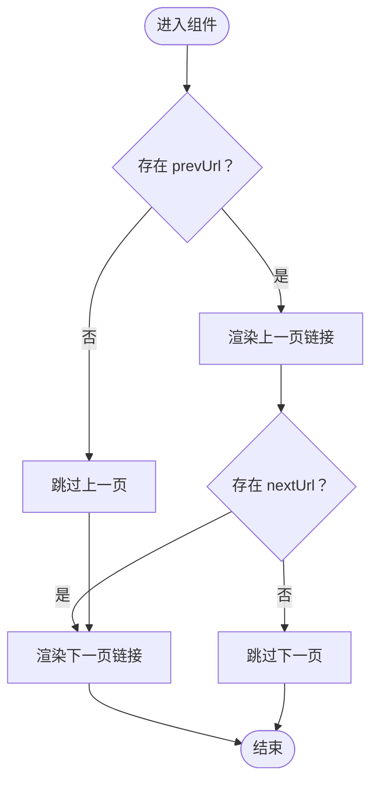
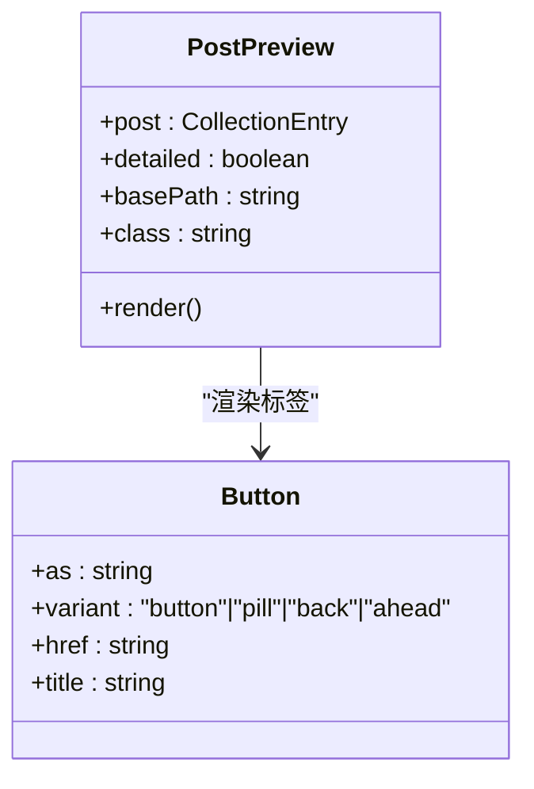
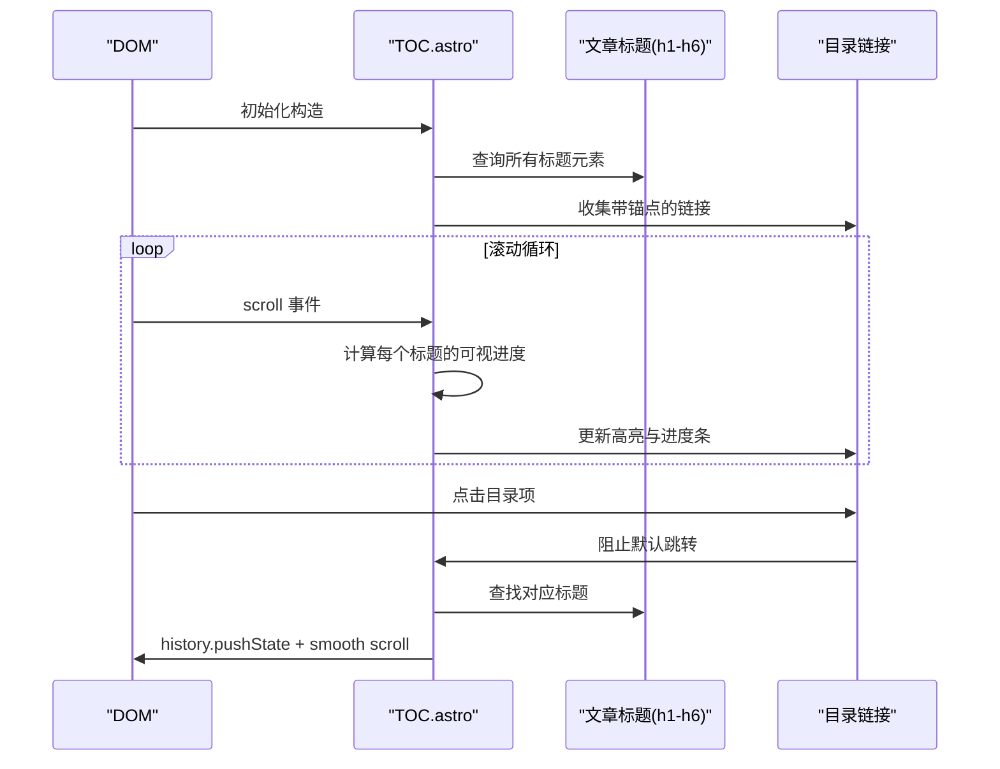
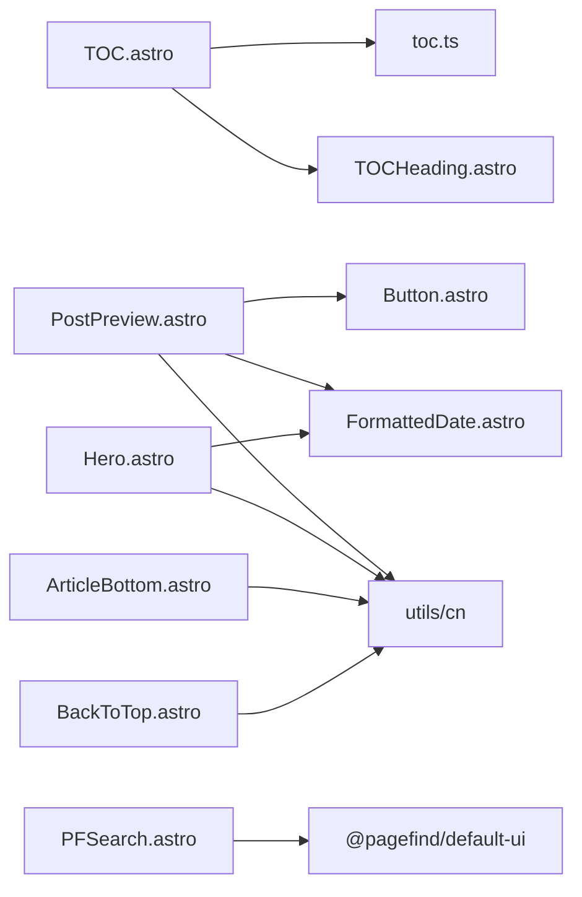

# 页面组件

<cite>
**本文引用的文件**
- [ArticleBottom.astro](file://packages/pure/components/pages/ArticleBottom.astro)
- [BackToTop.astro](file://packages/pure/components/pages/BackToTop.astro)
- [Hero.astro](file://packages/pure/components/pages/Hero.astro)
- [PFSearch.astro](file://packages/pure/components/pages/PFSearch.astro)
- [Paginator.astro](file://packages/pure/components/pages/Paginator.astro)
- [PostPreview.astro](file://packages/pure/components/pages/PostPreview.astro)
- [TOC.astro](file://packages/pure/components/pages/TOC.astro)
- [TOCHeading.astro](file://packages/pure/components/pages/TOCHeading.astro)
- [toc.ts](file://packages/pure/plugins/toc.ts)
- [index.ts（pure utils）](file://packages/pure/utils/index.ts)
- [Button.astro](file://packages/pure/components/user/Button.astro)
- [FormattedDate.astro](file://packages/pure/components/user/FormattedDate.astro)
- [BlogPost.astro](file://src/layouts/BlogPost.astro)
- [index.astro（search）](file://src/pages/search/index.astro)
- [blog.[...page].astro](file://src/pages/blog/[...page].astro)
</cite>

## 目录
1. [引言](#引言)
2. [项目结构](#项目结构)
3. [核心组件](#核心组件)
4. [架构总览](#架构总览)
5. [组件详解](#组件详解)
6. [依赖关系分析](#依赖关系分析)
7. [性能考量](#性能考量)
8. [故障排查指南](#故障排查指南)
9. [结论](#结论)
10. [附录](#附录)

## 引言
本文件系统性梳理页面级组件体系，重点覆盖 ArticleBottom、BackToTop、Hero、PFSearch、Paginator、PostPreview、TOC 等组件的功能、实现与协作方式。文档从架构视角解释组件在页面布局中的职责与交互，深入解析 PFSearch 的 Pagefind 集成与搜索流程、PostPreview 的文章预览机制与卡片设计、TOC 的目录生成算法与锚点导航、Paginator 的分页逻辑与体验优化，并提供配置项、样式定制与性能优化建议及实际页面集成示例。

## 项目结构
页面组件主要位于 pure 包的 pages 目录中，配合用户态组件（如 Button、FormattedDate）与工具函数（cn、日期格式化等），在站点布局与页面中被组合使用。典型页面布局包括博客列表页、博客详情页、搜索页等。

图表来源
- [BlogPost.astro](file://src/layouts/BlogPost.astro#L9-L12)
- [blog.[...page].astro](file://src/pages/blog/[...page].astro#L5-L7)
- [search/index.astro](file://src/pages/search/index.astro#L2-L5)
- [PostPreview.astro](file://packages/pure/components/pages/PostPreview.astro#L5-L6)
- [Button.astro](file://packages/pure/components/user/Button.astro#L1-L27)
- [Hero.astro](file://packages/pure/components/pages/Hero.astro#L5-L15)
- [FormattedDate.astro](file://packages/pure/components/user/FormattedDate.astro#L4-L14)
- [TOC.astro](file://packages/pure/components/pages/TOC.astro#L4-L5)
- [TOCHeading.astro](file://packages/pure/components/pages/TOCHeading.astro#L2-L3)
- [toc.ts](file://packages/pure/plugins/toc.ts#L1-L25)
- [index.ts（pure utils）](file://packages/pure/utils/index.ts#L8)

章节来源
- [BlogPost.astro](file://src/layouts/BlogPost.astro#L1-L75)
- [blog.[...page].astro](file://src/pages/blog/[...page].astro#L1-L111)
- [search/index.astro](file://src/pages/search/index.astro#L1-L34)

## 核心组件
- ArticleBottom：为当前文章提供“上一篇/下一篇”导航，基于集合索引计算前后条目并生成链接。
- BackToTop：提供回到顶部按钮与滚动进度百分比显示，支持标题栏交叉观察与平滑滚动。
- Hero：展示文章头部信息（标题、描述、日期、标签、语言、阅读时长等），支持背景虚化图层随滚动渐变透明。
- PFSearch：集成 Pagefind 搜索 UI，按需加载并在生产环境启用，支持结果 URL 规范化与主题变量覆盖。
- Paginator：通用分页导航，根据 prevUrl/nextUrl 渲染“上一页/下一页”，内置预取与无障碍标签。
- PostPreview：文章预览卡片，支持简洁/详细两种模式，展示日期、标题、描述、阅读时长、语言、标签等。
- TOC：自动生成目录树，支持滚动高亮与锚点平滑跳转，结合插件生成层级结构。

章节来源
- [ArticleBottom.astro](file://packages/pure/components/pages/ArticleBottom.astro#L1-L95)
- [BackToTop.astro](file://packages/pure/components/pages/BackToTop.astro#L1-L147)
- [Hero.astro](file://packages/pure/components/pages/Hero.astro#L1-L147)
- [PFSearch.astro](file://packages/pure/components/pages/PFSearch.astro#L1-L70)
- [Paginator.astro](file://packages/pure/components/pages/Paginator.astro#L1-L34)
- [PostPreview.astro](file://packages/pure/components/pages/PostPreview.astro#L1-L153)
- [TOC.astro](file://packages/pure/components/pages/TOC.astro#L1-L136)

## 架构总览
页面组件通过 Astro 布局与页面进行组合装配，形成统一的阅读体验。博客详情页在侧边栏放置 TOC，在底部放置版权与相关文章推荐；博客列表页采用网格布局，左侧为文章列表（PostPreview），右侧为分页导航（Paginator）；搜索页集成 PFSearch。

图表来源
- [BlogPost.astro](file://src/layouts/BlogPost.astro#L52-L69)
- [TOC.astro](file://packages/pure/components/pages/TOC.astro#L103-L125)
- [ArticleBottom.astro](file://packages/pure/components/pages/ArticleBottom.astro#L22-L94)

## 组件详解

### ArticleBottom 组件
- 功能：根据当前文章 ID 在集合中定位索引，计算前一项与后一项，生成可点击的导航链接。
- 关键点：
  - 使用 Astro.props 获取 id 与集合，通过 findIndex 定位当前项。
  - 通过 pathname 片段拼接生成相对路径，避免硬编码。
  - 使用 cn 合并类名，适配移动端与桌面端布局。
- 适用场景：文章底部的上下文导航，提升连续阅读体验。

图表来源
- [ArticleBottom.astro](file://packages/pure/components/pages/ArticleBottom.astro#L12-L20)
- [ArticleBottom.astro](file://packages/pure/components/pages/ArticleBottom.astro#L17-L19)
- [ArticleBottom.astro](file://packages/pure/components/pages/ArticleBottom.astro#L22-L94)

章节来源
- [ArticleBottom.astro](file://packages/pure/components/pages/ArticleBottom.astro#L1-L95)
- [BlogPost.astro](file://src/layouts/BlogPost.astro#L62-L69)

### BackToTop 组件
- 功能：固定悬浮按钮，显示滚动进度百分比，支持标题栏交叉观察显示隐藏，点击平滑回到顶部。
- 关键点：
  - 自定义元素内维护 DOM 引用与滚动状态，使用 IntersectionObserver 监听标题栏可见性。
  - 通过 requestAnimationFrame 降低滚动事件更新频率，提升性能。
  - 支持通过 needPercent 控制是否显示百分比。
- 适用场景：长文阅读、大屏设备，提升返回顶部的可达性与反馈。

图表来源
- [BackToTop.astro](file://packages/pure/components/pages/BackToTop.astro#L60-L108)
- [BackToTop.astro](file://packages/pure/components/pages/BackToTop.astro#L111-L147)

章节来源
- [BackToTop.astro](file://packages/pure/components/pages/BackToTop.astro#L1-L147)

### Hero 组件
- 功能：渲染文章头部信息与视觉元素，支持主图与虚化背景层，展示发布/更新时间、阅读时长、语言、标签等。
- 关键点：
  - 使用 Astro Assets 的 Image 组件加载图片，支持优先级与懒加载策略。
  - 通过滚动监听动态调整背景虚化图层透明度，增强沉浸感。
  - 标签区域支持 pagefind 过滤属性，便于后续搜索联动。
- 适用场景：博客详情页头部信息展示，提升首屏吸引力。

图表来源
- [Hero.astro](file://packages/pure/components/pages/Hero.astro#L22-L42)
- [Hero.astro](file://packages/pure/components/pages/Hero.astro#L46-L113)
- [Hero.astro](file://packages/pure/components/pages/Hero.astro#L118-L139)

章节来源
- [Hero.astro](file://packages/pure/components/pages/Hero.astro#L1-L147)
- [BlogPost.astro](file://src/layouts/BlogPost.astro#L52-L58)

### PFSearch 组件（Pagefind 集成）
- 功能：在生产环境按需加载 Pagefind 默认 UI，配置基础 URL 与资源路径，处理结果 URL 规范化，支持主题变量覆盖。
- 关键点：
  - 开发模式下禁用搜索，提示不可用。
  - 使用 requestIdleCallback 或回退方案延迟初始化，避免阻塞主线程。
  - 通过 processResult 对结果 URL 做尾斜杠与锚点清理，保证导航一致性。
  - 主题变量覆盖默认 UI 的颜色与圆角等样式。
- 适用场景：站点全局搜索入口，提升内容发现效率。

图表来源
- [PFSearch.astro](file://packages/pure/components/pages/PFSearch.astro#L19-L53)
- [PFSearch.astro](file://packages/pure/components/pages/PFSearch.astro#L55-L70)
- [search/index.astro](file://src/pages/search/index.astro#L20-L31)

章节来源
- [PFSearch.astro](file://packages/pure/components/pages/PFSearch.astro#L1-L70)
- [search/index.astro](file://src/pages/search/index.astro#L1-L34)

### Paginator 组件
- 功能：根据传入的上一页/下一页链接渲染导航，支持无障碍标签与预取优化。
- 关键点：
  - 通过 Astro.props 接收 nextUrl/prevUrl，内部结构包含 url、text、srLabel。
  - 使用 data-astro-prefetch 提升导航性能。
  - 文案支持自定义或默认值，满足多语言需求。
- 适用场景：列表页分页导航，改善大量内容的浏览体验。

图表来源
- [Paginator.astro](file://packages/pure/components/pages/Paginator.astro#L16-L33)

章节来源
- [Paginator.astro](file://packages/pure/components/pages/Paginator.astro#L1-L34)
- [blog.[...page].astro](file://src/pages/blog/[...page].astro#L36-L49)

### PostPreview 组件
- 功能：文章预览卡片，支持简洁/详细两种模式，展示日期、标题、描述、阅读时长、语言、标签等。
- 关键点：
  - 通过 render(post) 获取 remark 插件注入的分钟数等元数据。
  - 详细模式下支持封面图与遮罩渐变，悬停高亮与过渡效果。
  - 标签使用 Button 组件渲染为可点击的胶囊式标签。
  - 使用 cn 合并类名，支持自定义样式扩展。
- 适用场景：博客列表、归档页、推荐区等批量文章展示。

图表来源
- [PostPreview.astro](file://packages/pure/components/pages/PostPreview.astro#L8-L18)
- [Button.astro](file://packages/pure/components/user/Button.astro#L6-L27)

章节来源
- [PostPreview.astro](file://packages/pure/components/pages/PostPreview.astro#L1-L153)
- [blog.[...page].astro](file://src/pages/blog/[...page].astro#L74-L78)

### TOC 组件（目录生成与锚点导航）
- 功能：接收 MarkdownHeading 列表，生成层级目录树，支持滚动高亮与锚点平滑跳转。
- 关键点：
  - 使用 generateToc 将扁平 headings 转为嵌套树结构，深度越深缩进越多。
  - 自定义元素内维护标题与链接映射，计算可视范围内的进度并更新高亮与进度条高度。
  - 点击目录项通过 history.pushState 与 smooth scroll 实现无刷新跳转。
- 适用场景：长文阅读时的导航与进度反馈，提升可读性与可发现性。

图表来源
- [TOC.astro](file://packages/pure/components/pages/TOC.astro#L41-L129)
- [toc.ts](file://packages/pure/plugins/toc.ts#L7-L24)
- [TOCHeading.astro](file://packages/pure/components/pages/TOCHeading.astro#L16-L39)

章节来源
- [TOC.astro](file://packages/pure/components/pages/TOC.astro#L1-L136)
- [TOCHeading.astro](file://packages/pure/components/pages/TOCHeading.astro#L1-L40)
- [toc.ts](file://packages/pure/plugins/toc.ts#L1-L25)
- [BlogPost.astro](file://src/layouts/BlogPost.astro#L52-L52)

## 依赖关系分析
- 组件内聚与耦合：
  - TOC 依赖 toc.ts 的 generateToc 生成树结构，依赖 TOCHeading 渲染子节点。
  - PostPreview 依赖 Button 与 FormattedDate，依赖 cn 进行类名合并。
  - Hero 依赖 FormattedDate 与 cn，同时使用 Astro Assets 图片能力。
  - ArticleBottom 依赖 cn 与集合索引计算。
  - BackToTop 依赖 IntersectionObserver 与 requestAnimationFrame。
  - PFSearch 依赖 @pagefind/default-ui，按需加载。
- 外部依赖与集成点：
  - Pagefind：搜索 UI 与静态资源路径配置。
  - Astro Assets：图片加载与优先级控制。
  - Astro 预取：Paginator 与 PostPreview 的 data-astro-prefetch。
- 循环依赖：未发现直接循环依赖。

图表来源
- [TOC.astro](file://packages/pure/components/pages/TOC.astro#L4-L5)
- [TOCHeading.astro](file://packages/pure/components/pages/TOCHeading.astro#L2-L3)
- [toc.ts](file://packages/pure/plugins/toc.ts#L1-L25)
- [PostPreview.astro](file://packages/pure/components/pages/PostPreview.astro#L5-L6)
- [Button.astro](file://packages/pure/components/user/Button.astro#L1-L27)
- [FormattedDate.astro](file://packages/pure/components/user/FormattedDate.astro#L1-L22)
- [Hero.astro](file://packages/pure/components/pages/Hero.astro#L5-L15)
- [ArticleBottom.astro](file://packages/pure/components/pages/ArticleBottom.astro#L4)
- [BackToTop.astro](file://packages/pure/components/pages/BackToTop.astro#L2)
- [PFSearch.astro](file://packages/pure/components/pages/PFSearch.astro#L2)

章节来源
- [TOC.astro](file://packages/pure/components/pages/TOC.astro#L1-L136)
- [PostPreview.astro](file://packages/pure/components/pages/PostPreview.astro#L1-L153)
- [Hero.astro](file://packages/pure/components/pages/Hero.astro#L1-L147)
- [ArticleBottom.astro](file://packages/pure/components/pages/ArticleBottom.astro#L1-L95)
- [BackToTop.astro](file://packages/pure/components/pages/BackToTop.astro#L1-L147)
- [PFSearch.astro](file://packages/pure/components/pages/PFSearch.astro#L1-L70)

## 性能考量
- 按需加载与延迟初始化
  - PFSearch 使用 requestIdleCallback 或回退方案延迟加载 Pagefind UI，减少首屏阻塞。
  - BackToTop 在连接回调中才建立 IntersectionObserver 与滚动监听，避免不必要的开销。
- 事件节流与帧调度
  - TOC 使用 setInterval + updatePositionAndStyle 控制更新频率；BackToTop 使用 requestAnimationFrame 避免高频重排。
- 资源加载优化
  - Hero 中的图片设置 fetchpriority 与 loading=’eager’，确保首屏关键渲染；同时通过滚动控制背景透明度，避免额外重绘。
  - Paginator 与 PostPreview 使用 data-astro-prefetch 提升导航性能。
- CSS 变量与主题
  - PFSearch 通过 CSS 变量覆盖 UI 主题色、圆角、字体等，减少运行时样式计算。

[本节为通用性能建议，无需特定文件引用]

## 故障排查指南
- PFSearch 在开发模式不可用
  - 现象：搜索框显示“开发模式下禁用”。
  - 处理：确认环境变量与站点配置，生产环境方可启用。
- Pagefind 资源 404
  - 现象：搜索 UI 无法加载或结果为空。
  - 处理：检查 BASE_URL 与 bundlePath 是否正确，确认 /pagefind 静态资源已生成并可访问。
- TOC 锚点无效
  - 现象：点击目录无反应或滚动异常。
  - 处理：确认文章标题具有 id 且与目录 slug 对应；检查 history.pushState 与 scrollIntoView 的调用。
- BackToTop 不显示或百分比不更新
  - 现象：按钮不出现或百分比不变化。
  - 处理：确认 headerName 与 contentName 对应的 DOM 存在；检查 IntersectionObserver 与滚动监听是否注册成功。
- PostPreview 标签点击无响应
  - 现象：标签无法跳转。
  - 处理：确认 Button 组件 href 正确，路径与路由匹配；检查 basePath 参数。

章节来源
- [PFSearch.astro](file://packages/pure/components/pages/PFSearch.astro#L8-L15)
- [TOC.astro](file://packages/pure/components/pages/TOC.astro#L103-L125)
- [BackToTop.astro](file://packages/pure/components/pages/BackToTop.astro#L60-L108)
- [PostPreview.astro](file://packages/pure/components/pages/PostPreview.astro#L107-L117)

## 结论
上述页面组件围绕“可发现、可导航、可阅读”的目标构建：Hero 提升首屏信息密度，TOC 与 ArticleBottom 提供上下文导航，Paginator 与 PostPreview 支撑列表浏览，BackToTop 优化回到顶部体验，PFSearch 则打通站内搜索闭环。通过合理的依赖组织、按需加载与事件节流，整体具备良好的性能与可维护性。

[本节为总结性内容，无需特定文件引用]

## 附录

### 组件配置与样式定制
- ArticleBottom
  - 配置项：id、collections、class
  - 样式：通过 cn 合并类名，支持自定义容器样式
- BackToTop
  - 配置项：header、content、needPercent
  - 样式：通过 CSS 变量与类名切换控制显示/隐藏与百分比动画
- Hero
  - 配置项：data（标题、描述、日期、标签、语言、草稿）、remarkPluginFrontmatter
  - 样式：图片遮罩、背景虚化、滚动透明度控制
- PFSearch
  - 配置项：无（按需加载），主题变量可覆盖
  - 资源：BASE_URL 与 bundlePath
- Paginator
  - 配置项：prevUrl、nextUrl（含 text/srLabel/url）
  - 样式：外层 flex 布局，左右对齐
- PostPreview
  - 配置项：post、detailed、basePath、class
  - 样式：封面图遮罩、悬停高亮、标签胶囊式渲染
- TOC
  - 配置项：headings、class、id
  - 样式：进度条、高亮、缩进与圆角

章节来源
- [ArticleBottom.astro](file://packages/pure/components/pages/ArticleBottom.astro#L6-L10)
- [BackToTop.astro](file://packages/pure/components/pages/BackToTop.astro#L4)
- [Hero.astro](file://packages/pure/components/pages/Hero.astro#L7-L15)
- [PFSearch.astro](file://packages/pure/components/pages/PFSearch.astro#L55-L70)
- [Paginator.astro](file://packages/pure/components/pages/Paginator.astro#L8-L11)
- [PostPreview.astro](file://packages/pure/components/pages/PostPreview.astro#L8-L13)
- [TOC.astro](file://packages/pure/components/pages/TOC.astro#L7-L11)

### 实际页面集成示例
- 博客详情页（BlogPost.astro）
  - 侧边栏：TOC
  - 头部：Hero
  - 底部：Copyright、ArticleBottom、评论（可选）
- 博客列表页（blog.[...page].astro）
  - 左侧：PostPreview 列表
  - 右侧：Paginator 分页
  - 顶部：标签云（Button 胶囊式）
- 搜索页（search/index.astro）
  - 内容区：PFSearch

章节来源
- [BlogPost.astro](file://src/layouts/BlogPost.astro#L52-L72)
- [blog.[...page].astro](file://src/pages/blog/[...page].astro#L62-L106)
- [search/index.astro](file://src/pages/search/index.astro#L20-L31)