# GithubCard GitHub卡片组件

<cite>
**本文档引用的文件**
- [GithubCard.astro](file://packages/pure/components/advanced/GithubCard.astro)
- [index.ts](file://packages/pure/components/advanced/index.ts)
- [link-preview.ts](file://packages/pure/plugins/link-preview.ts)
- [cacheAvatars.ts](file://preset/scripts/cacheAvatars.ts)
- [app.css](file://src/assets/styles/app.css)
- [uno.config.ts](file://uno.config.ts)
- [README.md](file://packages/pure/README.md)
- [README.md](file://README.md)
</cite>

## 目录
1. [简介](#简介)
2. [项目结构](#项目结构)
3. [核心组件](#核心组件)
4. [架构概览](#架构概览)
5. [详细组件分析](#详细组件分析)
6. [依赖关系分析](#依赖关系分析)
7. [性能考虑](#性能考虑)
8. [故障排除指南](#故障排除指南)
9. [结论](#结论)
10. [附录](#附录)

## 简介

GithubCard GitHub卡片组件是一个用于在Astro项目中展示GitHub仓库信息的现代化UI组件。该组件通过直接调用GitHub API获取仓库数据，提供实时的星标数、fork数、语言、许可证和描述等信息。

该组件采用Web Components标准实现，具有以下核心特性：
- 自动解析GitHub仓库URL
- 实时API数据获取
- 响应式设计
- 加载状态动画
- 错误处理机制
- 支持深色/浅色主题

## 项目结构

GithubCard组件位于Astro主题的高级组件目录中，与其它高级组件共同构成完整的组件生态系统。

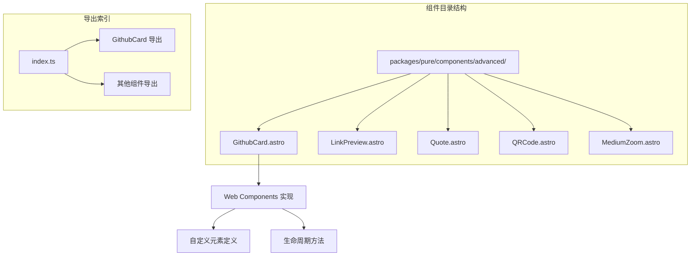

**图表来源**
- [GithubCard.astro](file://packages/pure/components/advanced/GithubCard.astro#L1-L177)
- [index.ts](file://packages/pure/components/advanced/index.ts#L1-L9)

**章节来源**
- [GithubCard.astro](file://packages/pure/components/advanced/GithubCard.astro#L1-L177)
- [index.ts](file://packages/pure/components/advanced/index.ts#L1-L9)

## 核心组件

### 组件架构设计

GithubCard采用现代Web Components架构，结合Astro的SSR特性和原生JavaScript实现：

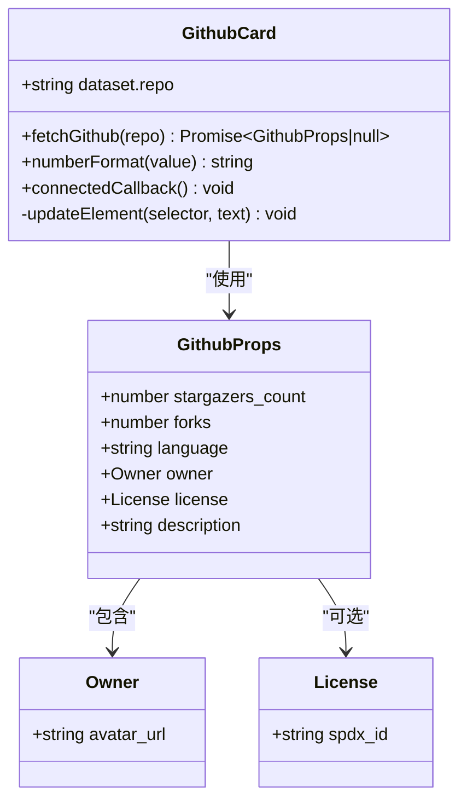

**图表来源**
- [GithubCard.astro](file://packages/pure/components/advanced/GithubCard.astro#L102-L176)

### 数据流架构

组件的数据流遵循严格的单向数据绑定模式：

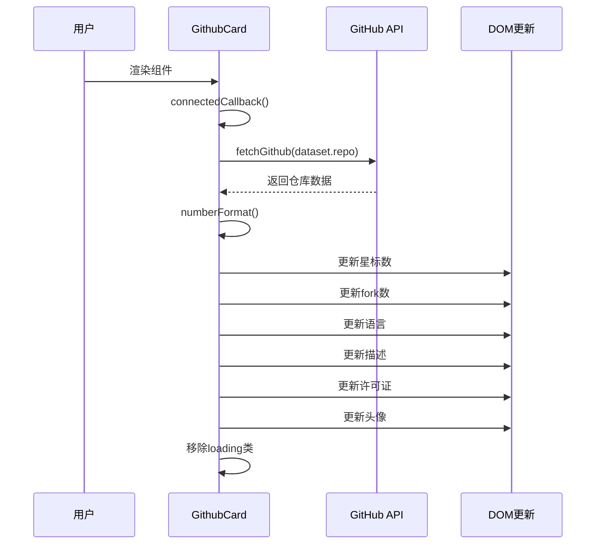

**图表来源**
- [GithubCard.astro](file://packages/pure/components/advanced/GithubCard.astro#L134-L165)

**章节来源**
- [GithubCard.astro](file://packages/pure/components/advanced/GithubCard.astro#L101-L176)

## 架构概览

### 整体系统架构

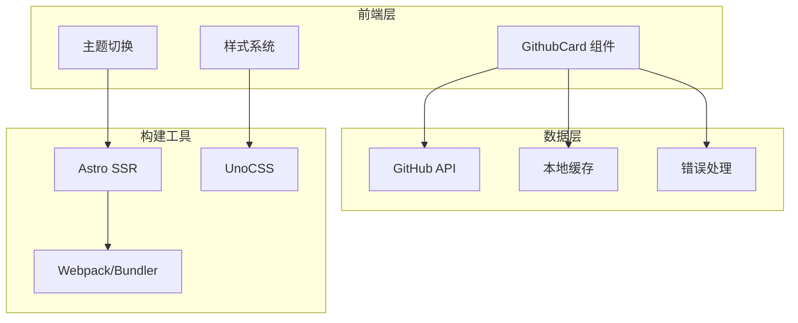

**图表来源**
- [GithubCard.astro](file://packages/pure/components/advanced/GithubCard.astro#L1-L177)
- [app.css](file://src/assets/styles/app.css#L1-L48)

### 组件交互流程

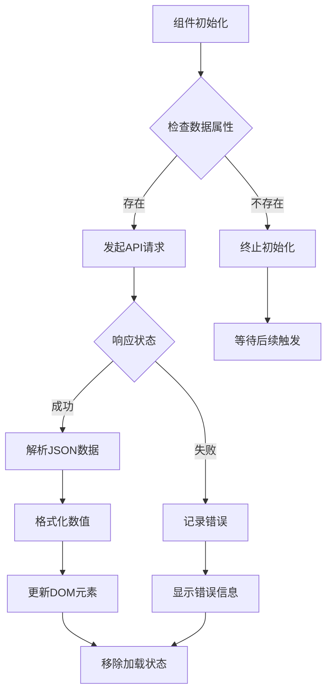

**图表来源**
- [GithubCard.astro](file://packages/pure/components/advanced/GithubCard.astro#L112-L165)

## 详细组件分析

### API调用机制

组件通过标准fetch API直接调用GitHub公共REST API：

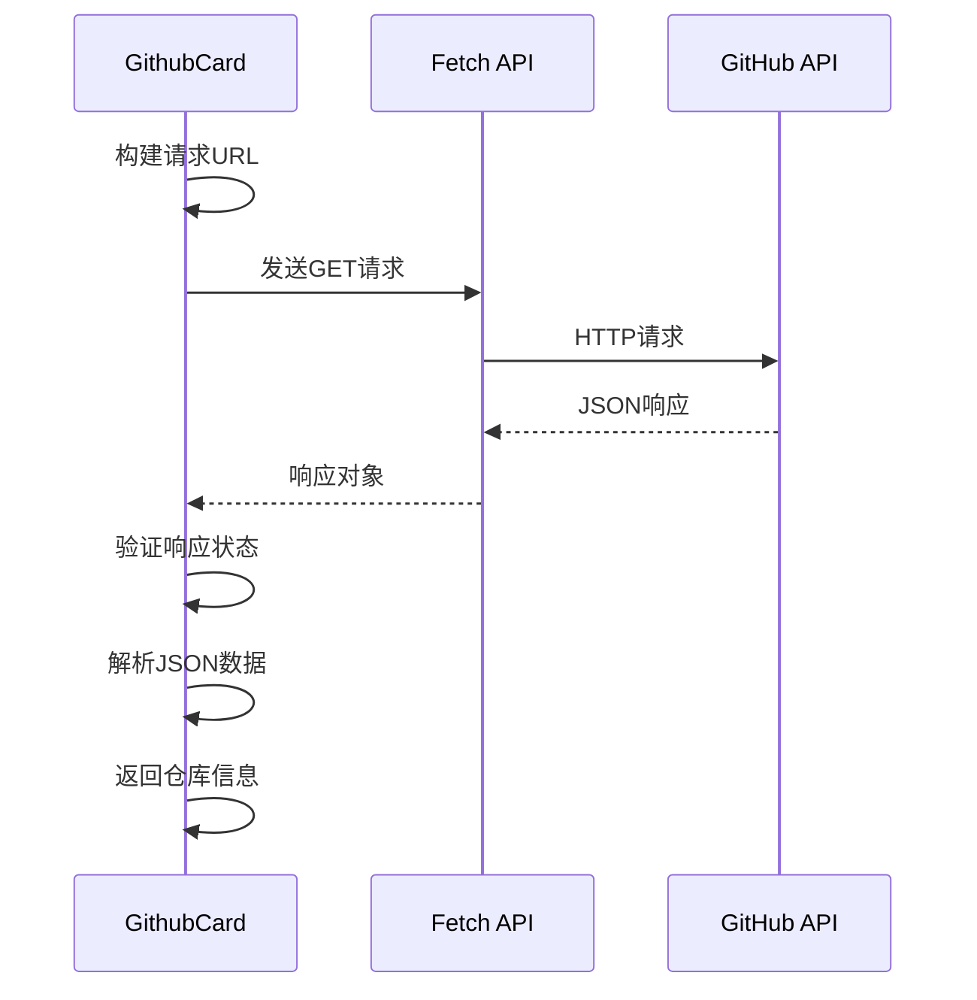

**图表来源**
- [GithubCard.astro](file://packages/pure/components/advanced/GithubCard.astro#L112-L125)

### 数据获取流程

组件实现了完整的数据获取和处理流程：

1. **URL解析**：自动去除GitHub URL前缀
2. **API调用**：使用标准fetch API
3. **数据验证**：检查HTTP响应状态
4. **数据转换**：格式化数字显示
5. **DOM更新**：安全更新页面元素

**章节来源**
- [GithubCard.astro](file://packages/pure/components/advanced/GithubCard.astro#L4-L10)
- [GithubCard.astro](file://packages/pure/components/advanced/GithubCard.astro#L112-L165)

### 缓存策略分析

虽然GithubCard组件本身没有内置缓存机制，但项目提供了相关的缓存解决方案：

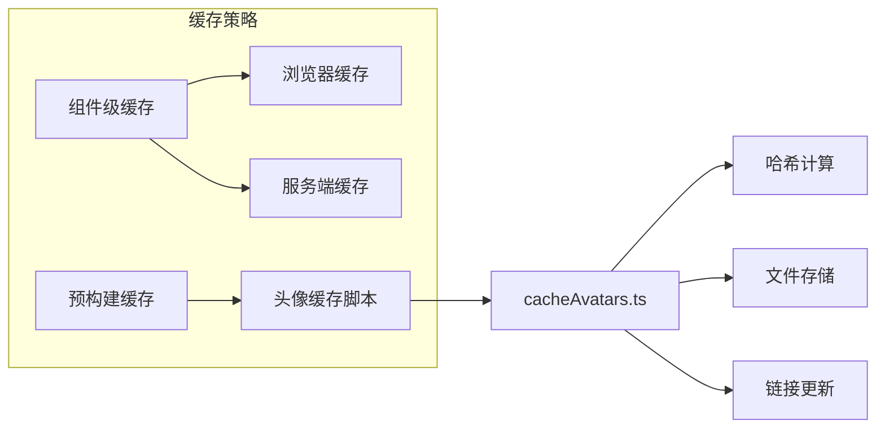

**图表来源**
- [cacheAvatars.ts](file://preset/scripts/cacheAvatars.ts#L53-L197)

**章节来源**
- [cacheAvatars.ts](file://preset/scripts/cacheAvatars.ts#L53-L197)

### 错误处理机制

组件实现了多层次的错误处理：

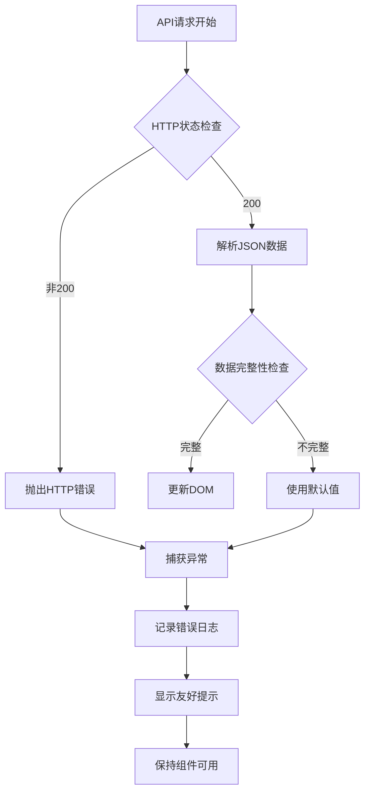

**图表来源**
- [GithubCard.astro](file://packages/pure/components/advanced/GithubCard.astro#L112-L125)
- [GithubCard.astro](file://packages/pure/components/advanced/GithubCard.astro#L161-L164)

**章节来源**
- [GithubCard.astro](file://packages/pure/components/advanced/GithubCard.astro#L112-L165)

### 主题样式系统

组件完全集成到Astro的主题系统中：

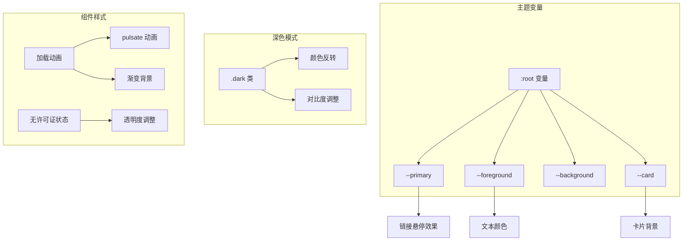

**图表来源**
- [app.css](file://src/assets/styles/app.css#L1-L48)

**章节来源**
- [app.css](file://src/assets/styles/app.css#L1-L48)

## 依赖关系分析

### 外部依赖

组件主要依赖于以下外部库和API：

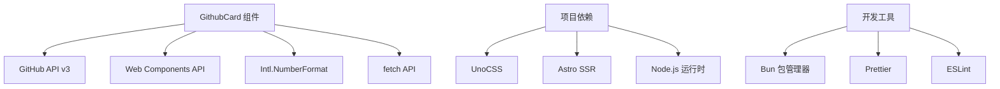

**图表来源**
- [GithubCard.astro](file://packages/pure/components/advanced/GithubCard.astro#L1-L177)
- [README.md](file://packages/pure/README.md#L1-L59)

### 内部模块依赖

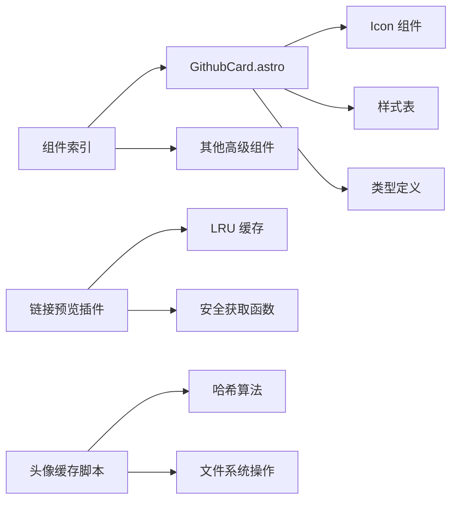

**图表来源**
- [index.ts](file://packages/pure/components/advanced/index.ts#L1-L9)
- [link-preview.ts](file://packages/pure/plugins/link-preview.ts#L1-L81)

**章节来源**
- [index.ts](file://packages/pure/components/advanced/index.ts#L1-L9)
- [link-preview.ts](file://packages/pure/plugins/link-preview.ts#L1-L81)

## 性能考虑

### 懒加载实现

组件采用渐进式加载策略：

1. **初始渲染**：显示占位符元素
2. **异步数据**：后台获取真实数据
3. **渐进增强**：逐步替换占位符为真实内容
4. **状态管理**：通过CSS类控制加载状态

### 数字格式化优化

组件使用浏览器原生的`Intl.NumberFormat`进行高效格式化：

```javascript
// 使用紧凑数字格式
Intl.NumberFormat('en-us', {
    notation: 'compact',
    maximumFractionDigits: 1
}).format(value)
```

### 请求去重机制

虽然组件本身不实现请求去重，但项目提供了相关的基础设施：

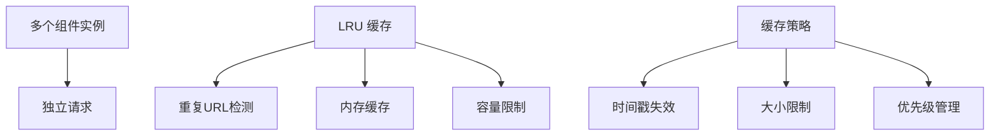

**图表来源**
- [link-preview.ts](file://packages/pure/plugins/link-preview.ts#L3-L27)

**章节来源**
- [link-preview.ts](file://packages/pure/plugins/link-preview.ts#L46-L68)

## 故障排除指南

### 常见问题诊断

| 问题类型 | 症状 | 可能原因 | 解决方案 |
|---------|------|----------|----------|
| API调用失败 | 显示"Failed to fetch data" | 网络连接问题或API限制 | 检查网络状态，稍后重试 |
| 数据格式错误 | 数字显示异常 | API响应格式变化 | 更新组件以适配新格式 |
| 跨域问题 | CORS错误 | 浏览器安全策略 | 使用代理或检查请求头 |
| 性能问题 | 页面加载缓慢 | 大量组件同时渲染 | 实施懒加载或分批渲染 |

### 调试技巧

1. **开发者工具**：检查网络面板中的API响应
2. **控制台日志**：查看组件的错误输出
3. **元素检查**：验证DOM结构和CSS类状态
4. **性能分析**：使用浏览器性能面板监控渲染时间

**章节来源**
- [GithubCard.astro](file://packages/pure/components/advanced/GithubCard.astro#L121-L124)
- [GithubCard.astro](file://packages/pure/components/advanced/GithubCard.astro#L161-L164)

## 结论

GithubCard GitHub卡片组件是一个设计精良的现代化UI组件，具有以下优势：

**技术优势**：
- 采用Web Components标准，兼容性强
- 使用原生fetch API，无需额外依赖
- 实现了完整的错误处理机制
- 集成到Astro的SSR架构中

**用户体验**：
- 提供流畅的加载动画
- 支持深色/浅色主题切换
- 响应式设计适配多设备
- 实时数据更新

**扩展性**：
- 模块化设计便于维护
- 类型安全的TypeScript实现
- 良好的代码组织结构

该组件为Astro项目提供了一个可靠的GitHub仓库信息展示解决方案，既满足了功能需求，又保持了良好的性能表现。

## 附录

### 使用示例

由于组件是基于Astro的SSR实现，使用方式相对简单：

```astro
<!-- 基本用法 -->
<GithubCard repo="owner/repo-name" />

<!-- 在Markdown中使用 -->
<GithubCard repo="https://github.com/owner/repo-name" />
```

### 配置选项

组件目前支持的配置相对简洁，主要通过props传递仓库信息。未来可以考虑添加更多配置选项：

- 自定义显示字段
- 主题样式定制
- 缓存策略配置
- 错误处理行为

### 开发建议

1. **性能优化**：考虑添加请求去重和缓存机制
2. **功能扩展**：支持更多GitHub元数据展示
3. **样式定制**：提供更灵活的主题配置
4. **国际化**：支持多语言显示