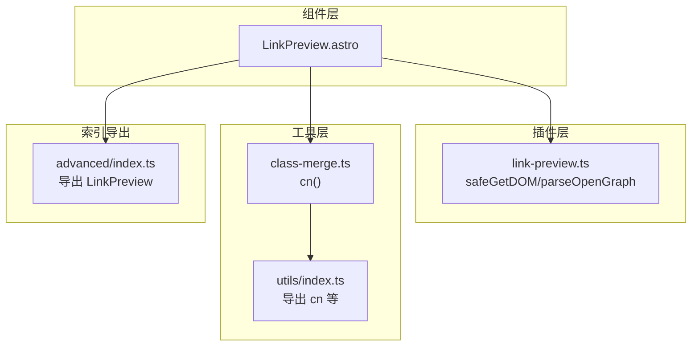
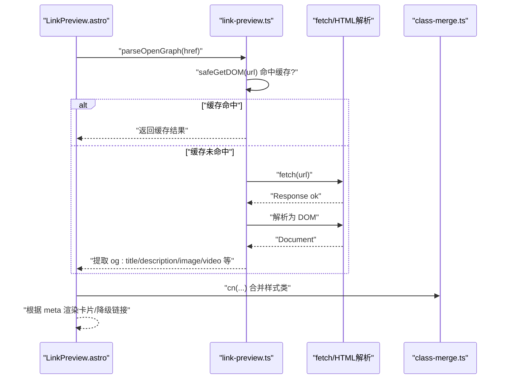
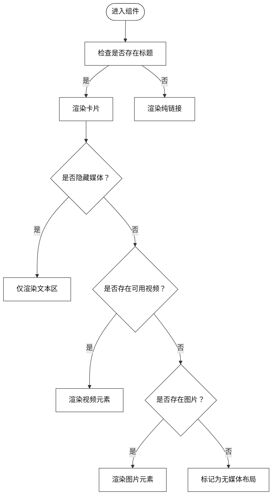
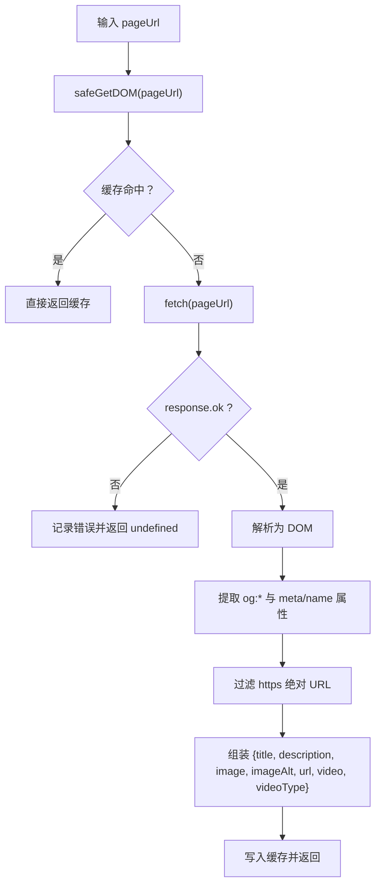
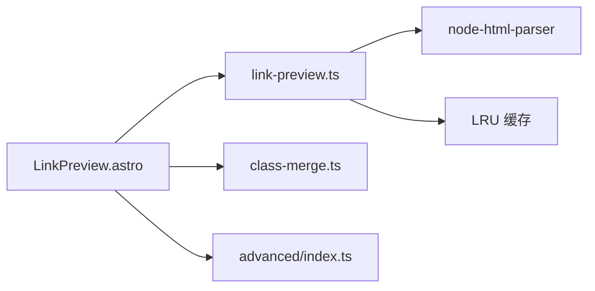

# LinkPreview 链接预览组件

<cite>
**本文引用的文件**
- [packages/pure/components/advanced/LinkPreview.astro](file://packages/pure/components/advanced/LinkPreview.astro)
- [packages/pure/plugins/link-preview.ts](file://packages/pure/plugins/link-preview.ts)
- [packages/pure/utils/class-merge.ts](file://packages/pure/utils/class-merge.ts)
- [packages/pure/utils/index.ts](file://packages/pure/utils/index.ts)
- [packages/pure/components/advanced/index.ts](file://packages/pure/components/advanced/index.ts)
</cite>

## 目录
1. [简介](#简介)
2. [项目结构](#项目结构)
3. [核心组件](#核心组件)
4. [架构总览](#架构总览)
5. [详细组件分析](#详细组件分析)
6. [依赖关系分析](#依赖关系分析)
7. [性能考虑](#性能考虑)
8. [故障排查指南](#故障排查指南)
9. [结论](#结论)
10. [附录](#附录)

## 简介
LinkPreview 是一个用于在博客文章中自动抓取并渲染外部链接元数据的组件。它通过解析目标网页的 Open Graph 元数据，提取标题、描述、缩略图或视频等信息，并以卡片形式展示，提升阅读体验。组件具备安全过滤机制（仅接受 HTTPS 资源、绝对路径），并内置缓存与错误降级策略，确保构建与运行时的稳定性。

## 项目结构
LinkPreview 组件位于纯主题包的高级组件目录中，配合插件层完成 HTTP 请求、HTML 解析与元数据提取；样式通过 Astro 组件内的内联样式定义；类名合并工具提供便捷的条件样式拼接。

图表来源
- [packages/pure/components/advanced/LinkPreview.astro](file://packages/pure/components/advanced/LinkPreview.astro#L1-L19)
- [packages/pure/plugins/link-preview.ts](file://packages/pure/plugins/link-preview.ts#L1-L111)
- [packages/pure/utils/class-merge.ts](file://packages/pure/utils/class-merge.ts#L1-L20)
- [packages/pure/utils/index.ts](file://packages/pure/utils/index.ts#L1-L18)
- [packages/pure/components/advanced/index.ts](file://packages/pure/components/advanced/index.ts#L1-L9)

章节来源
- [packages/pure/components/advanced/LinkPreview.astro](file://packages/pure/components/advanced/LinkPreview.astro#L1-L19)
- [packages/pure/plugins/link-preview.ts](file://packages/pure/plugins/link-preview.ts#L1-L111)
- [packages/pure/utils/class-merge.ts](file://packages/pure/utils/class-merge.ts#L1-L20)
- [packages/pure/utils/index.ts](file://packages/pure/utils/index.ts#L1-L18)
- [packages/pure/components/advanced/index.ts](file://packages/pure/components/advanced/index.ts#L1-L9)

## 核心组件
- LinkPreview.astro：负责接收外部链接、调用插件解析元数据、渲染卡片视图与默认样式。
- link-preview.ts：封装安全的 HTTP 获取器、LRU 缓存、HTML 解析与 Open Graph 元数据提取逻辑。
- class-merge.ts：提供 cn() 工具函数，用于合并与去重 CSS 类名，支持条件样式拼接。
- advanced/index.ts：统一导出 LinkPreview，便于上层页面按需引入。

章节来源
- [packages/pure/components/advanced/LinkPreview.astro](file://packages/pure/components/advanced/LinkPreview.astro#L1-L83)
- [packages/pure/plugins/link-preview.ts](file://packages/pure/plugins/link-preview.ts#L1-L111)
- [packages/pure/utils/class-merge.ts](file://packages/pure/utils/class-merge.ts#L1-L20)
- [packages/pure/utils/index.ts](file://packages/pure/utils/index.ts#L1-L18)
- [packages/pure/components/advanced/index.ts](file://packages/pure/components/advanced/index.ts#L1-L9)

## 架构总览
LinkPreview 的工作流分为三段：组件渲染阶段、元数据解析阶段、UI 渲染阶段。组件在 SSR 阶段调用插件解析函数，插件内部进行安全请求与缓存命中判断，最终返回结构化的元数据对象，组件据此渲染卡片。

图表来源
- [packages/pure/components/advanced/LinkPreview.astro](file://packages/pure/components/advanced/LinkPreview.astro#L15-L18)
- [packages/pure/plugins/link-preview.ts](file://packages/pure/plugins/link-preview.ts#L46-L68)
- [packages/pure/plugins/link-preview.ts](file://packages/pure/plugins/link-preview.ts#L79-L108)
- [packages/pure/utils/class-merge.ts](file://packages/pure/utils/class-merge.ts#L17-L19)

## 详细组件分析

### LinkPreview 组件
- 输入属性
  - href: 外部链接地址（必填）
  - hideMedia: 是否隐藏媒体（图片/视频），默认 false
  - zoomable: 图片是否可缩放（结合样式使用），默认 true
- 渲染逻辑
  - 若能解析到标题，则渲染卡片容器，包含媒体区与文本区；否则回退为纯链接展示。
  - 媒体区优先显示视频（若存在且类型可用），否则显示图片；当 hideMedia 为真时隐藏媒体区域。
  - 文本区显示标题、描述与域名后缀（从解析出的 url 中提取）。
- 样式与交互
  - 使用 cn 合并条件类名，支持“无媒体”“视频模式”等布局切换。
  - 默认样式固定宽高比，保证媒体元素一致的视觉比例。

图表来源
- [packages/pure/components/advanced/LinkPreview.astro](file://packages/pure/components/advanced/LinkPreview.astro#L21-L71)

章节来源
- [packages/pure/components/advanced/LinkPreview.astro](file://packages/pure/components/advanced/LinkPreview.astro#L7-L18)
- [packages/pure/components/advanced/LinkPreview.astro](file://packages/pure/components/advanced/LinkPreview.astro#L21-L71)
- [packages/pure/components/advanced/LinkPreview.astro](file://packages/pure/components/advanced/LinkPreview.astro#L73-L82)

### 插件：Open Graph 元数据提取
- 安全请求与缓存
  - safeGetDOM：对 HTML 页面进行安全获取，失败时记录错误并返回空值，避免中断构建。
  - LRU 缓存：限制最大容量，默认 1000，命中则提前触达，未命中则写入。
- 元数据提取规则
  - 标题：优先取 og:title，其次取 <title> 文本。
  - 描述：优先取 og:description，其次取 name=description 的 meta。
  - 图片：优先取 og:image:secure_url 或 og:image:url，再取 og:image；仅保留以 https:// 开头的绝对 URL。
  - 视频：优先取 og:video:secure_url 或 og:video:url，再取 og:video；并读取 og:video:type。
  - URL：优先取 og:url，其次取 rel="canonical" 的链接，最后回退为原始输入。
  - 图片 alt：取 og:image:alt。
- 错误处理
  - 对非 2xx 响应抛出格式化错误信息。
  - 捕获异常并输出统一错误日志，返回 undefined 以触发降级。

图表来源
- [packages/pure/plugins/link-preview.ts](file://packages/pure/plugins/link-preview.ts#L46-L68)
- [packages/pure/plugins/link-preview.ts](file://packages/pure/plugins/link-preview.ts#L79-L108)

章节来源
- [packages/pure/plugins/link-preview.ts](file://packages/pure/plugins/link-preview.ts#L1-L111)

### 类名合并工具
- cn()：基于 clsx 与自定义简单合并逻辑，将多个类值合并为字符串并去重，支持条件类拼接。
- 在 LinkPreview 中用于动态组合布局类名（如“无媒体”“视频模式”等）。

章节来源
- [packages/pure/utils/class-merge.ts](file://packages/pure/utils/class-merge.ts#L1-L20)
- [packages/pure/utils/index.ts](file://packages/pure/utils/index.ts#L1-L18)
- [packages/pure/components/advanced/LinkPreview.astro](file://packages/pure/components/advanced/LinkPreview.astro#L25-L32)

### 导出索引
- advanced/index.ts 将 LinkPreview 作为高级组件统一导出，便于上层页面按需导入使用。

章节来源
- [packages/pure/components/advanced/index.ts](file://packages/pure/components/advanced/index.ts#L1-L9)

## 依赖关系分析
- LinkPreview 依赖插件层的 parseOpenGraph 与 safeGetDOM，依赖工具层的 cn。
- 插件层内部依赖 node-html-parser 进行 DOM 解析，依赖 LRU 实现缓存。
- LinkPreview 与样式层通过内联样式耦合，保持组件自包含。

图表来源
- [packages/pure/components/advanced/LinkPreview.astro](file://packages/pure/components/advanced/LinkPreview.astro#L1-L5)
- [packages/pure/plugins/link-preview.ts](file://packages/pure/plugins/link-preview.ts#L1-L1)
- [packages/pure/plugins/link-preview.ts](file://packages/pure/plugins/link-preview.ts#L3-L27)
- [packages/pure/components/advanced/index.ts](file://packages/pure/components/advanced/index.ts#L4-L4)

章节来源
- [packages/pure/components/advanced/LinkPreview.astro](file://packages/pure/components/advanced/LinkPreview.astro#L1-L5)
- [packages/pure/plugins/link-preview.ts](file://packages/pure/plugins/link-preview.ts#L1-L111)
- [packages/pure/components/advanced/index.ts](file://packages/pure/components/advanced/index.ts#L1-L9)

## 性能考虑
- 请求缓存
  - LRU 缓存限制最大容量，默认 1000，命中即返回，显著降低重复请求与解析成本。
- 异步加载
  - 组件在 SSR 阶段发起请求与解析，利用异步能力减少首屏阻塞；若失败则降级为纯链接，避免影响整体渲染。
- 错误降级
  - 插件层捕获异常并记录日志，返回 undefined，组件侧回退为纯链接展示，保障页面可用性。
- 资源过滤
  - 仅接受 https:// 绝对 URL，避免混合内容与不安全资源，减少额外校验成本。

章节来源
- [packages/pure/plugins/link-preview.ts](file://packages/pure/plugins/link-preview.ts#L3-L27)
- [packages/pure/plugins/link-preview.ts](file://packages/pure/plugins/link-preview.ts#L46-L68)
- [packages/pure/plugins/link-preview.ts](file://packages/pure/plugins/link-preview.ts#L72-L73)
- [packages/pure/components/advanced/LinkPreview.astro](file://packages/pure/components/advanced/LinkPreview.astro#L64-L71)

## 故障排查指南
- 无法显示卡片
  - 检查目标站点是否返回有效的 HTML 与 Open Graph 元标签；确认插件层 safeGetDOM 是否成功解析。
  - 若返回 undefined，查看控制台错误日志，定位具体 URL 与状态码。
- 媒体未显示
  - 确认 og:image/og:video 是否为 https:// 绝对 URL；非 https 或相对路径会被过滤。
  - 若存在视频但未渲染，检查 og:video:type 是否正确设置。
- 样式异常
  - 确认 cn() 条件类拼接是否正确；检查组件内联样式是否被覆盖。
- 构建失败
  - 插件层已捕获异常并返回 undefined，避免中断构建；可在本地开发时观察错误日志定位问题。

章节来源
- [packages/pure/plugins/link-preview.ts](file://packages/pure/plugins/link-preview.ts#L50-L67)
- [packages/pure/plugins/link-preview.ts](file://packages/pure/plugins/link-preview.ts#L72-L73)
- [packages/pure/components/advanced/LinkPreview.astro](file://packages/pure/components/advanced/LinkPreview.astro#L64-L71)

## 结论
LinkPreview 通过简洁的接口与完善的插件层实现，实现了对外链元数据的稳定提取与安全渲染。其缓存、过滤与降级策略在保证性能的同时提升了可靠性，适合在博客文章中广泛使用。建议在实际使用中关注媒体资源的 HTTPS 与绝对路径要求，并结合样式系统合理控制卡片布局。

## 附录

### 组件配置参数说明
- href: 外部链接地址（必填）
- hideMedia: 是否隐藏媒体（图片/视频），默认 false
- zoomable: 图片是否可缩放（结合样式使用），默认 true

章节来源
- [packages/pure/components/advanced/LinkPreview.astro](file://packages/pure/components/advanced/LinkPreview.astro#L7-L13)

### 最佳实践示例（文字描述）
- 在 Markdown 正文中直接粘贴外链，组件会自动解析并渲染卡片。
- 若希望隐藏媒体（如仅展示标题与描述），可传入 hideMedia=true。
- 若需要图片可点击放大，保持 zoomable=true 并确保样式系统支持相应交互。
- 对于不可用或无元数据的链接，组件将回退为纯链接展示，无需额外处理。

章节来源
- [packages/pure/components/advanced/LinkPreview.astro](file://packages/pure/components/advanced/LinkPreview.astro#L21-L71)