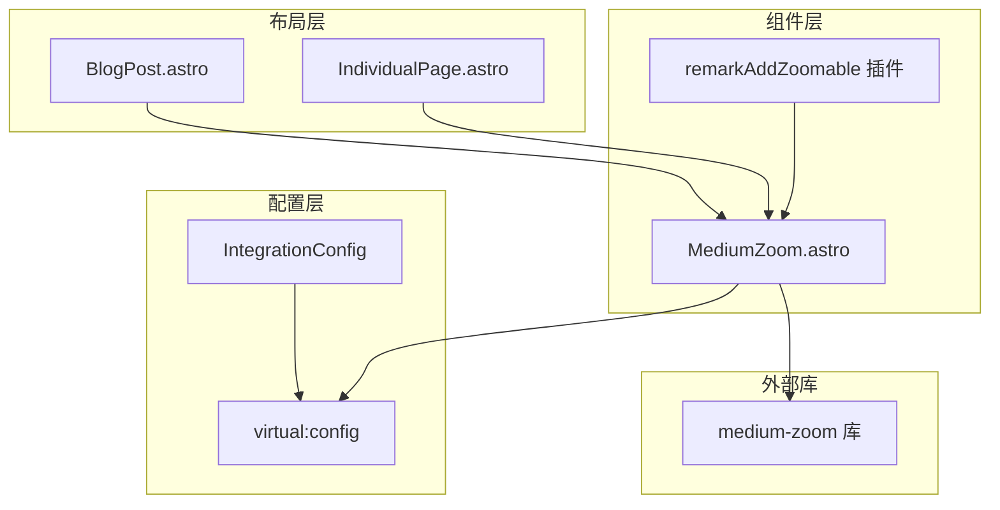
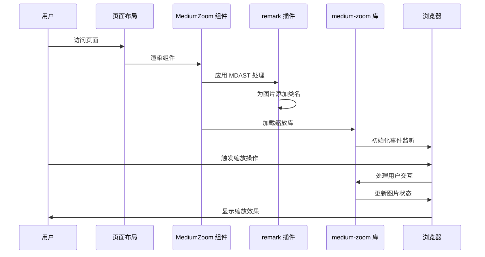
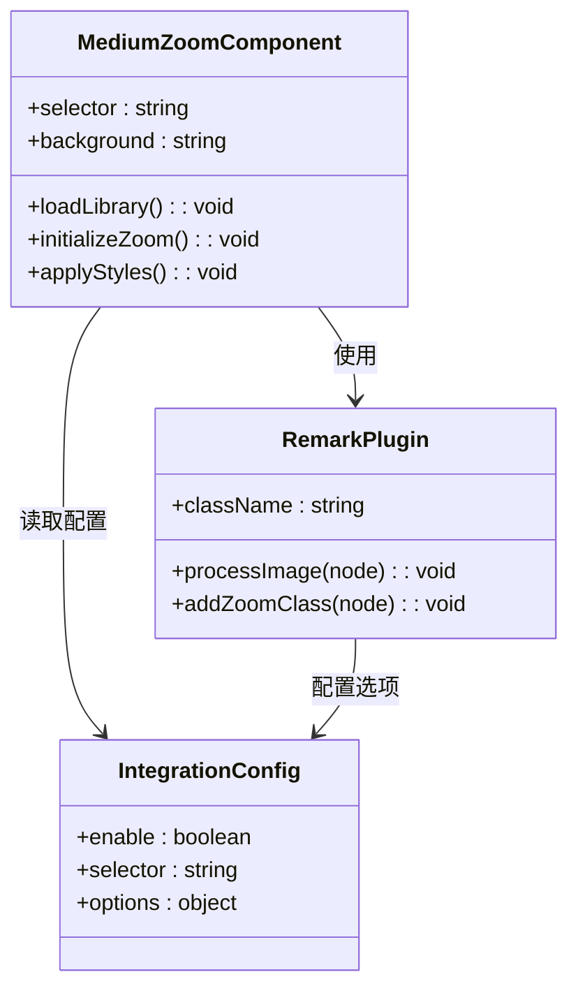
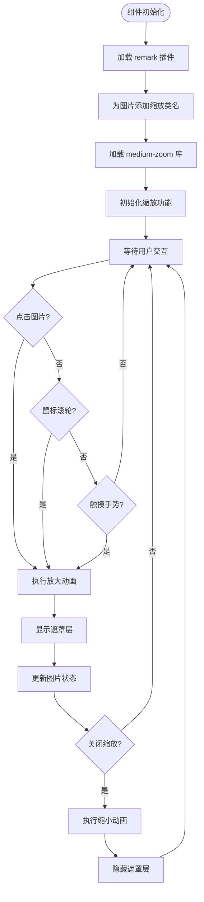
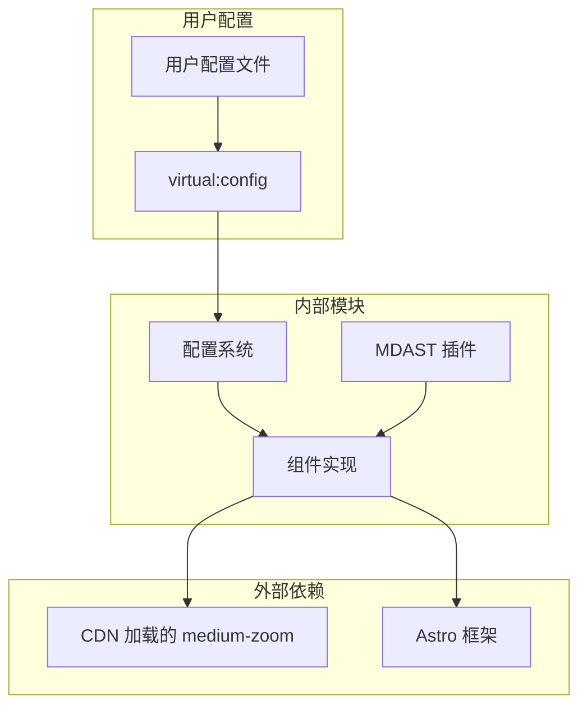
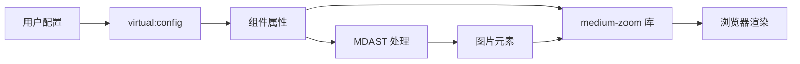

# MediumZoom 图片缩放组件

<cite>
**本文档引用的文件**
- [packages/pure/components/advanced/MediumZoom.astro](file://packages/pure/components/advanced/MediumZoom.astro)
- [packages/pure/plugins/remark-plugins.ts](file://packages/pure/plugins/remark-plugins.ts)
- [packages/pure/types/integrations-config.ts](file://packages/pure/types/integrations-config.ts)
- [packages/pure/index.ts](file://packages/pure/index.ts)
- [packages/pure/plugins/virtual-user-config.ts](file://packages/pure/plugins/virtual-user-config.ts)
- [src/layouts/BlogPost.astro](file://src/layouts/BlogPost.astro)
- [src/layouts/IndividualPage.astro](file://src/layouts/IndividualPage.astro)
</cite>

## 目录
1. [简介](#简介)
2. [项目结构](#项目结构)
3. [核心组件](#核心组件)
4. [架构概览](#架构概览)
5. [详细组件分析](#详细组件分析)
6. [依赖关系分析](#依赖关系分析)
7. [性能考虑](#性能考虑)
8. [故障排除指南](#故障排除指南)
9. [结论](#结论)
10. [附录](#附录)

## 简介

MediumZoom 是一个基于 Astro 的图片缩放组件，它集成了第三方的 medium-zoom 库，为博客文章中的图片提供缩放功能。该组件支持多种交互方式，包括点击缩放、触摸手势、鼠标滚轮缩放等，并提供了丰富的配置选项和视觉反馈。

该组件的核心特性包括：
- 自动化的图片缩放触发机制
- 多种用户交互方式支持
- 平滑的动画过渡效果
- 可定制的视觉样式
- 轻量级的实现方案

## 项目结构

MediumZoom 组件在整个项目中的位置和组织如下：



**图表来源**
- [packages/pure/components/advanced/MediumZoom.astro](file://packages/pure/components/advanced/MediumZoom.astro#L1-L48)
- [packages/pure/plugins/remark-plugins.ts](file://packages/pure/plugins/remark-plugins.ts#L9-L15)
- [packages/pure/types/integrations-config.ts](file://packages/pure/types/integrations-config.ts#L39-L47)

**章节来源**
- [packages/pure/components/advanced/MediumZoom.astro](file://packages/pure/components/advanced/MediumZoom.astro#L1-L48)
- [packages/pure/plugins/remark-plugins.ts](file://packages/pure/plugins/remark-plugins.ts#L9-L15)
- [packages/pure/types/integrations-config.ts](file://packages/pure/types/integrations-config.ts#L39-L47)

## 核心组件

MediumZoom 组件由三个主要部分组成：

### 主要组件文件
- **MediumZoom.astro**: 核心组件实现，负责加载外部库和初始化缩放功能
- **remarkAddZoomable 插件**: MDAST 处理插件，自动为图片添加缩放类名
- **IntegrationConfig**: 集成配置，定义组件的启用状态和默认参数

### 关键特性
1. **自动化图片识别**: 通过 CSS 选择器自动识别需要缩放的图片
2. **外部库集成**: 使用 CDN 加载 medium-zoom 库，确保性能和可靠性
3. **样式定制**: 提供全局样式覆盖，支持主题化设计
4. **响应式设计**: 支持桌面端和移动端的不同交互方式

**章节来源**
- [packages/pure/components/advanced/MediumZoom.astro](file://packages/pure/components/advanced/MediumZoom.astro#L5-L17)
- [packages/pure/plugins/remark-plugins.ts](file://packages/pure/plugins/remark-plugins.ts#L9-L15)
- [packages/pure/types/integrations-config.ts](file://packages/pure/types/integrations-config.ts#L40-L47)

## 架构概览

MediumZoom 组件的完整架构流程如下：



**图表来源**
- [packages/pure/components/advanced/MediumZoom.astro](file://packages/pure/components/advanced/MediumZoom.astro#L14-L17)
- [packages/pure/plugins/remark-plugins.ts](file://packages/pure/plugins/remark-plugins.ts#L9-L15)
- [packages/pure/index.ts](file://packages/pure/index.ts#L53-L54)

## 详细组件分析

### 组件实现分析

#### 核心组件结构


**图表来源**
- [packages/pure/components/advanced/MediumZoom.astro](file://packages/pure/components/advanced/MediumZoom.astro#L5-L11)
- [packages/pure/plugins/remark-plugins.ts](file://packages/pure/plugins/remark-plugins.ts#L9-L15)
- [packages/pure/types/integrations-config.ts](file://packages/pure/types/integrations-config.ts#L40-L47)

#### 交互流程分析


**图表来源**
- [packages/pure/components/advanced/MediumZoom.astro](file://packages/pure/components/advanced/MediumZoom.astro#L14-L17)
- [packages/pure/plugins/remark-plugins.ts](file://packages/pure/plugins/remark-plugins.ts#L12-L13)

### 配置参数详解

#### 基础配置
| 参数名 | 类型 | 默认值 | 说明 |
|--------|------|--------|------|
| enable | boolean | true | 是否启用 MediumZoom 功能 |
| selector | string | '.prose .zoomable' | CSS 选择器，用于匹配需要缩放的图片 |
| options | object | { className: 'zoomable' } | 传递给 medium-zoom 的选项 |

#### 组件属性
| 属性名 | 类型 | 默认值 | 说明 |
|--------|------|--------|------|
| selector | string | config.integ.mediumZoom.selector | 缩放目标的选择器 |
| background | string | 'hsl(var(--background) / 0.8)' | 遮罩层的背景颜色 |

#### 样式配置
组件提供了完整的 CSS 类名体系：
- `.medium-zoom-overlay`: 遮罩层样式
- `.medium-zoom-image`: 图片基础样式
- `.medium-zoom--opened`: 已打开状态样式
- `.medium-zoom-image--hidden`: 隐藏状态样式
- `.medium-zoom-image--opened`: 放大状态样式

**章节来源**
- [packages/pure/types/integrations-config.ts](file://packages/pure/types/integrations-config.ts#L40-L47)
- [packages/pure/components/advanced/MediumZoom.astro](file://packages/pure/components/advanced/MediumZoom.astro#L5-L11)
- [packages/pure/components/advanced/MediumZoom.astro](file://packages/pure/components/advanced/MediumZoom.astro#L18-L47)

### 交互设计分析

#### 缩放动画效果
组件实现了平滑的缩放动画，包含以下关键特性：

1. **遮罩层过渡**: 0.3秒的透明度过渡，使用 `will-change: opacity` 优化性能
2. **图片变换**: 0.3秒的缓动曲线变换，提供自然的缩放体验
3. **状态管理**: 通过 CSS 类名切换实现状态转换

#### 视觉反馈机制
- **光标变化**: 缩放前显示 `zoom-in`，缩放后显示 `zoom-out`
- **层级管理**: 使用 z-index 确保缩放图片始终位于最顶层
- **可见性控制**: 通过 `visibility` 属性优化渲染性能

**章节来源**
- [packages/pure/components/advanced/MediumZoom.astro](file://packages/pure/components/advanced/MediumZoom.astro#L26-L46)

### 使用示例

#### 基础使用
在页面布局中简单引入组件即可启用所有功能：

```astro
<!-- 在布局文件中 -->
{config.integ.mediumZoom.enable && <MediumZoom />}
```

#### 自定义配置
通过配置文件自定义组件行为：

```typescript
// 用户配置
mediumZoom: {
  enable: true,
  selector: '.prose img',
  options: {
    className: 'zoomable'
  }
}
```

#### 不同场景的应用
1. **博客文章**: 自动为所有文章图片添加缩放功能
2. **文档页面**: 仅对特定容器内的图片启用缩放
3. **产品展示**: 结合自定义样式实现专业的图片展示效果

**章节来源**
- [src/layouts/BlogPost.astro](file://src/layouts/BlogPost.astro#L74-L74)
- [packages/pure/types/integrations-config.ts](file://packages/pure/types/integrations-config.ts#L40-L47)

## 依赖关系分析

### 组件依赖图


**图表来源**
- [packages/pure/components/advanced/MediumZoom.astro](file://packages/pure/components/advanced/MediumZoom.astro#L3-L17)
- [packages/pure/plugins/virtual-user-config.ts](file://packages/pure/plugins/virtual-user-config.ts#L61-L62)
- [packages/pure/index.ts](file://packages/pure/index.ts#L53-L54)

### 数据流分析


**图表来源**
- [packages/pure/plugins/virtual-user-config.ts](file://packages/pure/plugins/virtual-user-config.ts#L61-L62)
- [packages/pure/components/advanced/MediumZoom.astro](file://packages/pure/components/advanced/MediumZoom.astro#L10-L11)

**章节来源**
- [packages/pure/plugins/virtual-user-config.ts](file://packages/pure/plugins/virtual-user-config.ts#L1-L99)
- [packages/pure/index.ts](file://packages/pure/index.ts#L53-L54)

## 性能考虑

### 懒加载策略
- **按需加载**: 组件只在启用时才加载 medium-zoom 库
- **CDN 优化**: 使用 CDN 加载外部库，减少本地打包体积
- **条件渲染**: 通过配置开关控制组件的渲染

### 内存管理
- **事件清理**: medium-zoom 库负责事件监听器的管理
- **DOM 优化**: 使用 `will-change` 属性优化动画性能
- **样式隔离**: 通过全局样式避免样式冲突

### 渲染优化
- **CSS 硬件加速**: 利用 transform 和 opacity 属性启用 GPU 加速
- **最小重绘**: 通过类名切换减少 DOM 操作
- **响应式设计**: 适配不同设备的交互方式

## 故障排除指南

### 常见问题及解决方案

#### 图片无法缩放
1. **检查选择器配置**: 确认 `selector` 设置正确
2. **验证类名添加**: 确认 MDAST 插件正常工作
3. **检查 CSS 冲突**: 验证自定义样式是否影响缩放功能

#### 缩放动画异常
1. **检查 CSS 过渡**: 确认 transition 属性设置正确
2. **验证 z-index**: 确保缩放图片层级正确
3. **测试浏览器兼容性**: 验证浏览器对 CSS 动画的支持

#### 性能问题
1. **检查 CDN 加载**: 确认外部库加载正常
2. **监控内存使用**: 使用浏览器开发者工具检查内存泄漏
3. **优化图片尺寸**: 确保图片资源大小合理

**章节来源**
- [packages/pure/components/advanced/MediumZoom.astro](file://packages/pure/components/advanced/MediumZoom.astro#L18-L47)
- [packages/pure/plugins/remark-plugins.ts](file://packages/pure/plugins/remark-plugins.ts#L12-L13)

## 结论

MediumZoom 图片缩放组件是一个设计精良的解决方案，它成功地将第三方库的功能与 Astro 框架无缝集成。组件的主要优势包括：

1. **简洁的实现**: 通过最少的代码实现强大的功能
2. **灵活的配置**: 支持多种配置选项满足不同需求
3. **优秀的性能**: 采用多种优化策略确保流畅的用户体验
4. **良好的扩展性**: 易于维护和进一步开发

该组件为博客和文档网站提供了专业级的图片缩放体验，是提升用户交互质量的理想选择。

## 附录

### API 参考

#### 组件属性
- `selector`: CSS 选择器，用于匹配缩放目标
- `background`: 遮罩层背景颜色

#### 配置选项
- `enable`: 启用/禁用组件
- `selector`: 自定义选择器
- `options`: medium-zoom 库的配置选项

### 最佳实践

1. **合理配置选择器**: 避免对不需要缩放的图片应用缩放功能
2. **优化图片质量**: 使用适当的图片格式和尺寸
3. **测试多设备兼容性**: 确保在各种设备上都有良好的表现
4. **监控性能指标**: 定期检查组件对页面性能的影响