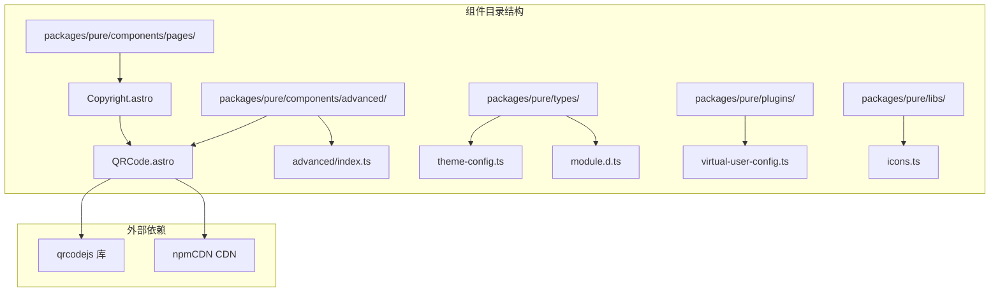
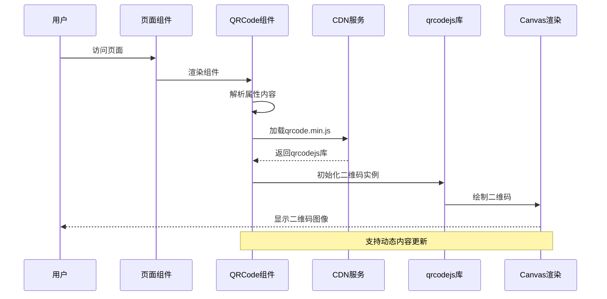
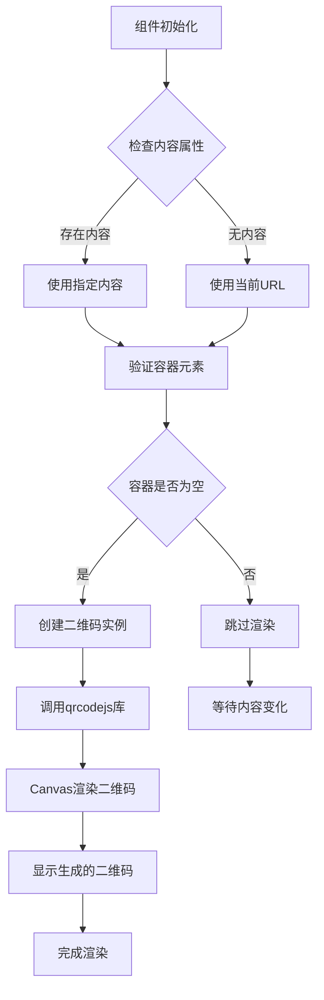
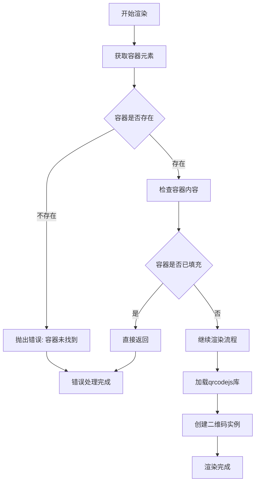
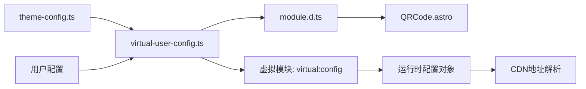
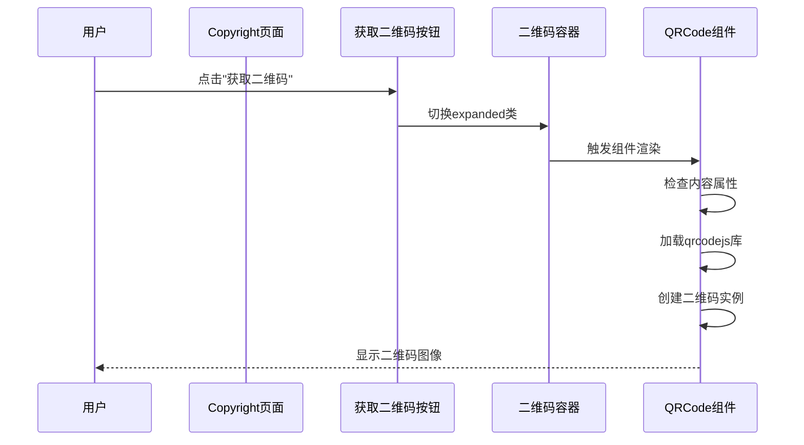
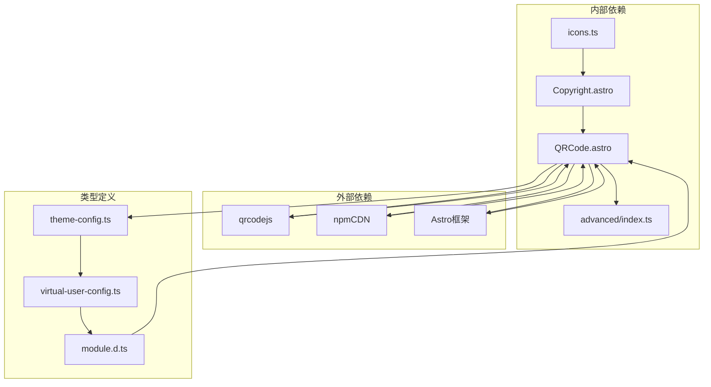
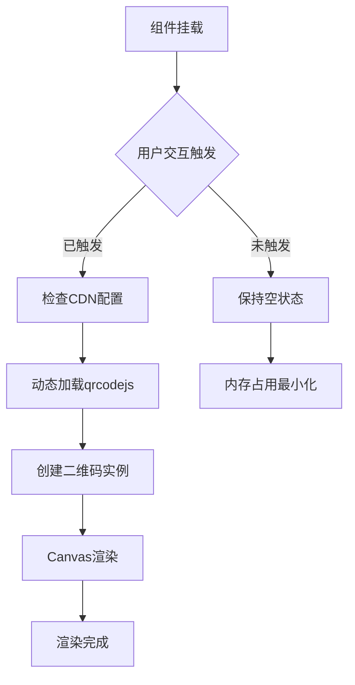

# QRCode 二维码组件

<cite>
**本文档引用的文件**
- [QRCode.astro](file://packages/pure/components/advanced/QRCode.astro)
- [advanced/index.ts](file://packages/pure/components/advanced/index.ts)
- [Copyright.astro](file://packages/pure/components/pages/Copyright.astro)
- [theme-config.ts](file://packages/pure/types/theme-config.ts)
- [virtual-user-config.ts](file://packages/pure/plugins/virtual-user-config.ts)
- [icons.ts](file://packages/pure/libs/icons.ts)
- [module.d.ts](file://packages/pure/types/module.d.ts)
- [src/type.d.ts](file://src/type.d.ts)
- [package.json](file://packages/pure/package.json)
</cite>

## 目录
1. [简介](#简介)
2. [项目结构](#项目结构)
3. [核心组件](#核心组件)
4. [架构概览](#架构概览)
5. [详细组件分析](#详细组件分析)
6. [依赖关系分析](#依赖关系分析)
7. [性能考虑](#性能考虑)
8. [故障排除指南](#故障排除指南)
9. [结论](#结论)
10. [附录](#附录)

## 简介

QRCode 二维码组件是一个基于 Astro 框架构建的轻量级二维码生成组件。该组件通过集成 qrcodejs 库，在客户端运行时动态生成二维码图像，为用户提供便捷的内容分享和访问入口。

该组件采用极简设计理念，仅包含一个容器元素和必要的 JavaScript 初始化逻辑，实现了"所见即所得"的二维码生成功能。组件支持多种数据源输入，包括当前页面链接、自定义内容等，并提供了灵活的样式定制能力。

## 项目结构

QRCode 组件在项目中的组织结构如下：



**图表来源**
- [QRCode.astro](file://packages/pure/components/advanced/QRCode.astro#L1-L22)
- [Copyright.astro](file://packages/pure/components/pages/Copyright.astro#L1-L151)

**章节来源**
- [QRCode.astro](file://packages/pure/components/advanced/QRCode.astro#L1-L22)
- [advanced/index.ts](file://packages/pure/components/advanced/index.ts#L1-L9)

## 核心组件

### 组件架构设计

QRCode 组件采用了"声明式 + 命令式"相结合的设计模式：


**图表来源**
- [QRCode.astro](file://packages/pure/components/advanced/QRCode.astro#L1-L22)
- [Copyright.astro](file://packages/pure/components/pages/Copyright.astro#L1-L151)
- [icons.ts](file://packages/pure/libs/icons.ts#L56-L63)

### 核心特性

1. **自动内容检测**: 当未指定内容时，自动使用当前页面 URL
2. **延迟加载**: 仅在需要时才初始化二维码生成
3. **CDN 集成**: 通过虚拟配置系统支持多种 CDN 服务
4. **样式继承**: 支持从父组件继承 CSS 类名
5. **事件驱动**: 提供完整的交互式体验

**章节来源**
- [QRCode.astro](file://packages/pure/components/advanced/QRCode.astro#L10-L21)
- [theme-config.ts](file://packages/pure/types/theme-config.ts#L103-L114)

## 架构概览

### 整体架构流程



**图表来源**
- [QRCode.astro](file://packages/pure/components/advanced/QRCode.astro#L8-L21)
- [virtual-user-config.ts](file://packages/pure/plugins/virtual-user-config.ts#L60-L63)

### 数据流处理



**图表来源**
- [QRCode.astro](file://packages/pure/components/advanced/QRCode.astro#L10-L21)

**章节来源**
- [QRCode.astro](file://packages/pure/components/advanced/QRCode.astro#L1-L22)

## 详细组件分析

### 组件实现细节

#### 核心渲染逻辑

组件的核心渲染逻辑遵循以下步骤：

1. **属性解析**: 从 Astro.props 中提取 content、class 等属性
2. **内容确定**: 如果未提供 content，则默认使用当前页面 URL
3. **容器验证**: 确保目标 DOM 元素存在且为空
4. **库加载**: 通过 CDN 动态加载 qrcodejs 库
5. **实例创建**: 使用 qrcodejs 创建二维码实例

#### 错误处理机制

组件实现了多层次的错误处理：



**图表来源**
- [QRCode.astro](file://packages/pure/components/advanced/QRCode.astro#L13-L20)

**章节来源**
- [QRCode.astro](file://packages/pure/components/advanced/QRCode.astro#L1-L22)

### 配置选项详解

#### 基础配置参数

| 参数名 | 类型 | 默认值 | 描述 |
|--------|------|--------|------|
| content | string | 当前页面URL | 二维码要编码的数据内容 |
| class | string | '' | 自定义CSS类名 |
| ...props | object | {} | 其他HTML属性 |

#### 主题配置集成

组件通过虚拟配置系统集成主题配置：



**图表来源**
- [theme-config.ts](file://packages/pure/types/theme-config.ts#L103-L114)
- [virtual-user-config.ts](file://packages/pure/plugins/virtual-user-config.ts#L60-L63)
- [module.d.ts](file://packages/pure/types/module.d.ts#L1-L4)

**章节来源**
- [QRCode.astro](file://packages/pure/components/advanced/QRCode.astro#L2-L4)
- [theme-config.ts](file://packages/pure/types/theme-config.ts#L103-L114)

### 使用示例

#### 基础用法

在页面中使用 QRCode 组件的基本语法：

```html
<!-- 使用当前页面URL作为二维码内容 -->
<QRCode />

<!-- 指定自定义内容 -->
<QRCode content="https://example.com" />

<!-- 自定义样式类 -->
<QRCode class="custom-style" />
```

#### 在版权组件中的应用

QRCode 组件在 Copyright 页面中的完整使用示例展示了高级用法：



**图表来源**
- [Copyright.astro](file://packages/pure/components/pages/Copyright.astro#L146-L149)

**章节来源**
- [Copyright.astro](file://packages/pure/components/pages/Copyright.astro#L110-L113)
- [Copyright.astro](file://packages/pure/components/pages/Copyright.astro#L146-L149)

## 依赖关系分析

### 外部依赖关系



**图表来源**
- [QRCode.astro](file://packages/pure/components/advanced/QRCode.astro#L1-L22)
- [package.json](file://packages/pure/package.json#L39-L50)

### 内部模块耦合

组件间的依赖关系相对松散，主要体现在：

1. **导出接口**: advanced/index.ts 提供统一的组件导出
2. **样式共享**: Copyright 页面复用 QRCode 组件样式
3. **图标集成**: 图标库为 QRCode 功能提供视觉标识

**章节来源**
- [advanced/index.ts](file://packages/pure/components/advanced/index.ts#L6-L9)
- [icons.ts](file://packages/pure/libs/icons.ts#L59-L63)

## 性能考虑

### 渲染优化策略

#### 延迟加载机制

组件采用延迟加载策略，避免不必要的资源消耗：



#### 内存管理

组件实现了智能的内存管理：

1. **单次渲染**: 容器非空时跳过重复渲染
2. **按需加载**: 仅在需要时加载外部库
3. **生命周期管理**: 依赖于 Astro 的组件生命周期

### CDN 优化

通过虚拟配置系统，组件支持多种 CDN 服务：

| CDN提供商 | 配置项 | 优点 |
|-----------|--------|------|
| esm.sh | 默认CDN | 国内访问稳定 |
| jsdelivr | 可选配置 | 全球加速 |
| smartcis | 可选配置 | 特定地区优化 |
| unkpg | 可选配置 | 多协议支持 |
| custom | 自定义配置 | 企业私有CDN |

**章节来源**
- [QRCode.astro](file://packages/pure/components/advanced/QRCode.astro#L8-L9)
- [theme-config.ts](file://packages/pure/types/theme-config.ts#L103-L114)

## 故障排除指南

### 常见问题及解决方案

#### 问题1: 二维码无法显示

**症状**: 组件渲染后无任何输出

**可能原因**:
1. CDN 加载失败
2. 容器元素未正确渲染
3. JavaScript 执行异常

**解决步骤**:
1. 检查浏览器开发者工具的网络面板
2. 验证 CDN 配置是否正确
3. 确认容器元素的 ID 属性

#### 问题2: 内容不匹配

**症状**: 生成的二维码内容与预期不符

**可能原因**:
1. content 属性未正确传递
2. 默认 URL 获取失败

**解决方法**:
1. 显式设置 content 属性
2. 检查页面上下文环境

#### 问题3: 性能问题

**症状**: 页面加载缓慢或内存占用过高

**优化建议**:
1. 确保只在需要时触发渲染
2. 合理使用 CDN 缓存
3. 避免重复实例化

**章节来源**
- [QRCode.astro](file://packages/pure/components/advanced/QRCode.astro#L13-L20)

## 结论

QRCode 二维码组件展现了现代前端组件开发的最佳实践：

1. **简洁性**: 最小化的实现代码，专注于核心功能
2. **可扩展性**: 通过虚拟配置系统支持多种 CDN 和主题
3. **用户体验**: 提供流畅的交互式二维码生成体验
4. **性能优化**: 采用延迟加载和智能缓存策略

该组件为 Astro 生态系统提供了一个高质量的二维码解决方案，既满足了基本需求，又保持了良好的可维护性和扩展性。

## 附录

### API 参考

#### 组件属性

| 属性名 | 类型 | 必需 | 默认值 | 描述 |
|--------|------|------|--------|------|
| content | string | 否 | 当前页面URL | 二维码编码内容 |
| class | string | 否 | '' | 自定义CSS类名 |
| ...props | object | 否 | {} | 其他HTML属性 |

#### 主题配置

| 配置项 | 类型 | 默认值 | 描述 |
|--------|------|--------|------|
| npmCDN | string | 'https://esm.sh' | npm包CDN地址 |
| author | string | '' | 站点作者信息 |
| title | string | '' | 站点标题 |

### 开发建议

1. **内容验证**: 在生产环境中添加内容有效性验证
2. **错误边界**: 实现更完善的错误处理机制
3. **性能监控**: 添加渲染时间和内存使用监控
4. **国际化支持**: 考虑多语言环境下的文本处理