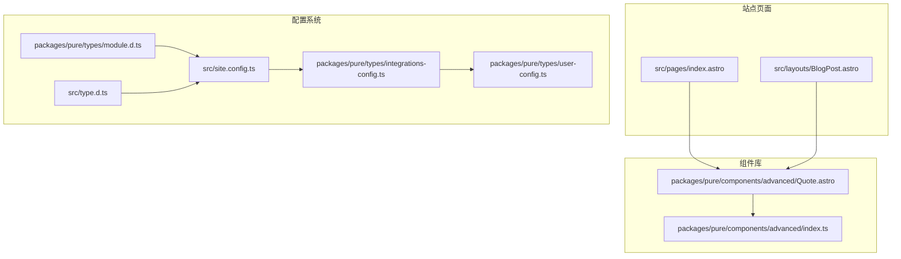
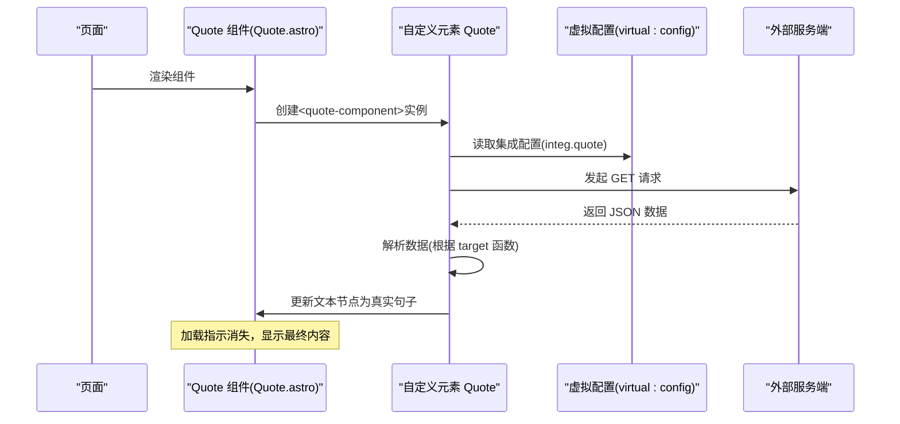
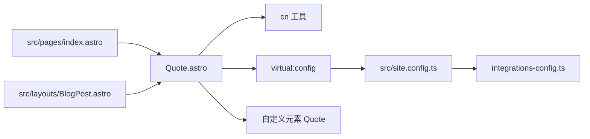
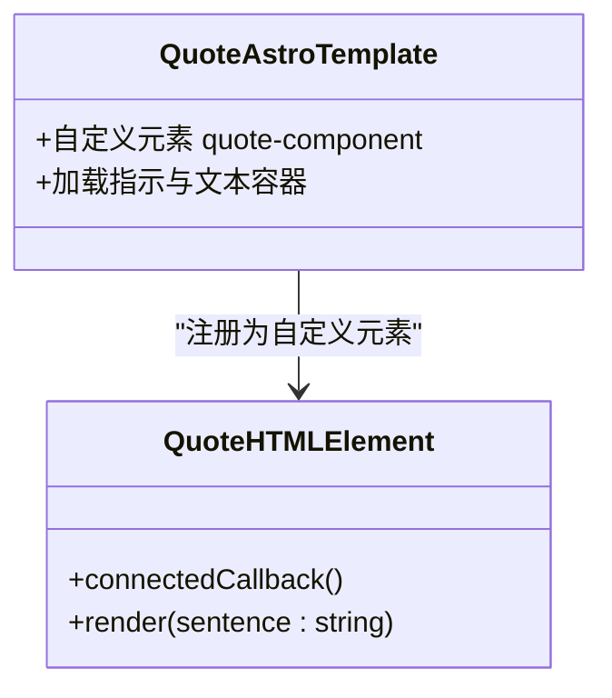
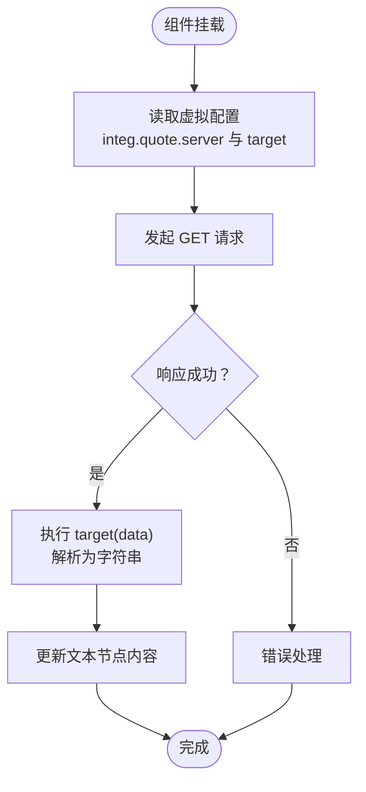

# Quote 引用组件

<cite>
**本文档引用的文件**
- [packages/pure/components/advanced/Quote.astro](file://packages/pure/components/advanced/Quote.astro)
- [packages/pure/components/advanced/index.ts](file://packages/pure/components/advanced/index.ts)
- [src/pages/index.astro](file://src/pages/index.astro)
- [src/layouts/BlogPost.astro](file://src/layouts/BlogPost.astro)
- [packages/pure/types/integrations-config.ts](file://packages/pure/types/integrations-config.ts)
- [packages/pure/types/user-config.ts](file://packages/pure/types/user-config.ts)
- [src/site.config.ts](file://src/site.config.ts)
- [uno.config.ts](file://uno.config.ts)
- [packages/pure/types/module.d.ts](file://packages/pure/types/module.d.ts)
- [src/type.d.ts](file://src/type.d.ts)
</cite>

## 目录
1. [简介](#简介)
2. [项目结构](#项目结构)
3. [核心组件](#核心组件)
4. [架构总览](#架构总览)
5. [详细组件分析](#详细组件分析)
6. [依赖关系分析](#依赖关系分析)
7. [性能考量](#性能考量)
8. [故障排查指南](#故障排查指南)
9. [结论](#结论)
10. [附录](#附录)

## 简介
Quote 引用组件是一个轻量级的 Web Components 组件，用于在页面中动态加载并展示一句随机名言或格言。它通过自定义元素在页面中渲染一个“加载中”的占位 UI，并在页面挂载后向指定的服务端接口发起请求，解析返回数据后将句子插入到 DOM 中，从而实现无刷新的动态内容展示。

该组件具备以下特点：
- 视觉设计：采用圆角卡片式布局，包含一个“加载中”指示的小圆点动画，文字区域显示“Loading...”，随后由真实句子替换。
- 交互特性：组件本身不包含复杂的交互逻辑；其交互行为主要体现在加载态的视觉反馈与内容替换。
- 配置驱动：通过站点配置中的集成项进行服务端地址与数据提取函数的配置，支持灵活切换数据源与格式。
- 使用场景：适合放置于首页、文章页底部或任何需要展示每日格言、名人名言的位置，提升页面的可读性与人文气息。

## 项目结构
Quote 组件位于纯组件库的高级组件目录中，导出入口统一在 advanced 模块索引中，供站点页面按需引入与使用。

**图表来源**
- [packages/pure/components/advanced/Quote.astro](file://packages/pure/components/advanced/Quote.astro#L1-L41)
- [packages/pure/components/advanced/index.ts](file://packages/pure/components/advanced/index.ts#L1-L9)
- [src/pages/index.astro](file://src/pages/index.astro#L1-L128)
- [src/layouts/BlogPost.astro](file://src/layouts/BlogPost.astro#L1-L75)
- [src/site.config.ts](file://src/site.config.ts#L101-L134)
- [packages/pure/types/integrations-config.ts](file://packages/pure/types/integrations-config.ts#L1-L65)
- [packages/pure/types/user-config.ts](file://packages/pure/types/user-config.ts#L1-L26)
- [packages/pure/types/module.d.ts](file://packages/pure/types/module.d.ts#L1-L4)
- [src/type.d.ts](file://src/type.d.ts#L1-L4)

**章节来源**
- [packages/pure/components/advanced/Quote.astro](file://packages/pure/components/advanced/Quote.astro#L1-L41)
- [packages/pure/components/advanced/index.ts](file://packages/pure/components/advanced/index.ts#L1-L9)
- [src/pages/index.astro](file://src/pages/index.astro#L1-L128)
- [src/layouts/BlogPost.astro](file://src/layouts/BlogPost.astro#L1-L75)
- [src/site.config.ts](file://src/site.config.ts#L101-L134)
- [packages/pure/types/integrations-config.ts](file://packages/pure/types/integrations-config.ts#L1-L65)
- [packages/pure/types/user-config.ts](file://packages/pure/types/user-config.ts#L1-L26)
- [packages/pure/types/module.d.ts](file://packages/pure/types/module.d.ts#L1-L4)
- [src/type.d.ts](file://src/type.d.ts#L1-L4)

## 核心组件
- 组件文件：packages/pure/components/advanced/Quote.astro
  - 渲染层：自定义元素 quote-component，内部包含一个加载指示与文本容器。
  - 行为层：通过自定义元素类实现连接回调、数据拉取与渲染。
- 导出入口：packages/pure/components/advanced/index.ts
  - 提供 Quote 组件的默认导出，便于站点按模块导入。

关键实现要点：
- 自定义元素注册：在组件脚本中定义 Quote 类并注册为 quote-component。
- 数据获取：从虚拟配置中读取集成配置，构造目标函数与服务端地址，使用 fetch 获取 JSON 并解析。
- 渲染逻辑：将解析后的字符串写入 DOM 文本节点，替换“Loading...”。

**章节来源**
- [packages/pure/components/advanced/Quote.astro](file://packages/pure/components/advanced/Quote.astro#L1-L41)
- [packages/pure/components/advanced/index.ts](file://packages/pure/components/advanced/index.ts#L1-L9)

## 架构总览
Quote 组件的运行流程如下：

**图表来源**
- [packages/pure/components/advanced/Quote.astro](file://packages/pure/components/advanced/Quote.astro#L19-L40)
- [src/site.config.ts](file://src/site.config.ts#L128-L133)

**章节来源**
- [packages/pure/components/advanced/Quote.astro](file://packages/pure/components/advanced/Quote.astro#L19-L40)
- [src/site.config.ts](file://src/site.config.ts#L128-L133)

## 详细组件分析

### 组件结构与样式设计
- 结构组成
  - 外层容器：自定义元素 quote-component，使用 not-prose 与传入的类名合并，保证与站点排版体系一致。
  - 内容区：圆角卡片布局，包含左侧“加载指示”与右侧“句子文本”。
  - 加载指示：由两个同心小圆点构成，外圈带脉冲动画，表示异步加载中。
  - 文本区：默认显示“Loading...”，随后由真实句子替换。
- 视觉设计原理
  - 圆角卡片：营造柔和、现代的卡片风格，符合现代站点的 UI 趋势。
  - 边框与阴影：轻微边框与阴影增强层级感，避免与背景过度融合。
  - 颜色语义：使用站点调色板中的“muted foreground”作为文本色，确保可读性与一致性。
  - 动效：脉冲动画强调加载状态，提升用户感知与等待体验。

**章节来源**
- [packages/pure/components/advanced/Quote.astro](file://packages/pure/components/advanced/Quote.astro#L7-L17)

### 交互特性
- 加载态反馈：通过脉冲动画与“Loading...”文案，明确告知用户内容正在加载。
- 内容替换：数据到达后，立即替换文本节点内容，无需额外交互。
- 可扩展性：组件未内置点击展开、复制等交互，若需扩展可在业务侧封装上层组件。

**章节来源**
- [packages/pure/components/advanced/Quote.astro](file://packages/pure/components/advanced/Quote.astro#L10-L16)

### 配置参数说明
- 集成配置项
  - quote.server：字符串，外部服务端地址，组件将发起 GET 请求获取 JSON 数据。
  - quote.target：字符串，表示一个函数体（以字符串形式提供），组件会将其包装为可执行函数，接收数据对象并返回目标字符串。
- 配置来源与类型
  - 站点配置：src/site.config.ts 中的 integ.quote 字段定义。
  - 类型约束：packages/pure/types/integrations-config.ts 对 quote 的字段进行 Zod 校验。
  - 用户配置合并：packages/pure/types/user-config.ts 将集成配置合并到用户配置中。
- 虚拟配置模块声明
  - packages/pure/types/module.d.ts 与 src/type.d.ts 分别声明了虚拟配置模块的类型，确保 TS 推断正确。

**章节来源**
- [src/site.config.ts](file://src/site.config.ts#L128-L133)
- [packages/pure/types/integrations-config.ts](file://packages/pure/types/integrations-config.ts#L20-L25)
- [packages/pure/types/user-config.ts](file://packages/pure/types/user-config.ts#L13-L20)
- [packages/pure/types/module.d.ts](file://packages/pure/types/module.d.ts#L1-L4)
- [src/type.d.ts](file://src/type.d.ts#L1-L4)

### 使用示例与最佳实践
- 在首页使用
  - 页面：src/pages/index.astro
  - 位置：首页头部信息下方，用于展示每日格言。
  - 用法：直接引入 Quote 并在模板中渲染，可附加自定义类名以微调间距或对齐。
- 在文章页使用
  - 页面：src/layouts/BlogPost.astro
  - 说明：组件可放置于文章底部或侧边栏，用于增加阅读体验。
- 最佳实践
  - 保持加载态的可见性：确保加载指示足够明显，避免误以为页面卡顿。
  - 合理的刷新频率：若服务端支持缓存或限流，建议在服务端层面控制刷新节奏。
  - 主题一致性：组件使用站点调色板，无需额外主题适配。
  - 可访问性：当前组件未包含键盘交互或无障碍属性，若需更高可访问性，可在上层封装中补充 aria 属性与键盘事件。

**章节来源**
- [src/pages/index.astro](file://src/pages/index.astro#L65-L65)
- [src/layouts/BlogPost.astro](file://src/layouts/BlogPost.astro#L1-L75)

### 性能优化策略
- 资源加载
  - 组件体积小，仅包含必要的 HTML 与少量 JS，不会对首屏造成负担。
  - 使用自定义元素，避免重复渲染与不必要的组件生命周期开销。
- 网络请求
  - 采用一次性请求，成功后立即渲染，减少多次往返。
  - 建议服务端开启合适的缓存策略与压缩，降低响应时间。
- 样式与主题
  - 使用 UnoCSS 的预设与站点主题变量，避免运行时计算与重绘。
  - 卡片阴影与圆角为轻量样式，对性能影响可忽略。

**章节来源**
- [packages/pure/components/advanced/Quote.astro](file://packages/pure/components/advanced/Quote.astro#L7-L17)
- [uno.config.ts](file://uno.config.ts#L14-L125)

### 浏览器兼容性
- 自定义元素
  - 组件基于原生自定义元素 API 注册 quote-component，需确保目标浏览器支持该能力。
  - 若需兼容旧版浏览器，可在站点侧引入 polyfill 或降级方案。
- Fetch API
  - 组件使用原生 fetch 获取数据，需确保目标环境支持 fetch。
- 动画与样式
  - 脉冲动画与阴影为现代浏览器常用特性，兼容性良好；若需支持更老设备，可考虑降级为静态点或移除动画。

**章节来源**
- [packages/pure/components/advanced/Quote.astro](file://packages/pure/components/advanced/Quote.astro#L31-L37)

## 依赖关系分析
- 组件依赖
  - 自定义元素：Quote 类继承自 HTMLElement，在 connectedCallback 中发起请求。
  - 虚拟配置：通过 import 'virtual:config' 读取集成配置。
  - 工具函数：cn 用于类名合并，保证与站点样式体系一致。
- 配置依赖
  - 站点配置：integ.quote.server 与 integ.quote.target 决定数据来源与解析方式。
  - 类型系统：Zod Schema 与 TS 声明确保配置合法与类型安全。
- 页面依赖
  - 页面通过 import { Quote } from 'astro-pure/advanced' 引入组件并在模板中使用。

**图表来源**
- [packages/pure/components/advanced/Quote.astro](file://packages/pure/components/advanced/Quote.astro#L1-L41)
- [packages/pure/components/advanced/index.ts](file://packages/pure/components/advanced/index.ts#L1-L9)
- [src/pages/index.astro](file://src/pages/index.astro#L4-L4)
- [src/layouts/BlogPost.astro](file://src/layouts/BlogPost.astro#L8-L8)
- [src/site.config.ts](file://src/site.config.ts#L101-L134)
- [packages/pure/types/integrations-config.ts](file://packages/pure/types/integrations-config.ts#L1-L65)

**章节来源**
- [packages/pure/components/advanced/Quote.astro](file://packages/pure/components/advanced/Quote.astro#L1-L41)
- [packages/pure/components/advanced/index.ts](file://packages/pure/components/advanced/index.ts#L1-L9)
- [src/pages/index.astro](file://src/pages/index.astro#L4-L4)
- [src/layouts/BlogPost.astro](file://src/layouts/BlogPost.astro#L8-L8)
- [src/site.config.ts](file://src/site.config.ts#L101-L134)
- [packages/pure/types/integrations-config.ts](file://packages/pure/types/integrations-config.ts#L1-L65)

## 性能考量
- 组件体积与渲染成本
  - 组件为轻量级，仅包含少量 DOM 节点与简单脚本，对渲染性能影响极低。
- 网络与缓存
  - 建议服务端启用缓存头与压缩，减少带宽占用与延迟。
- 样式与主题
  - 使用 UnoCSS 预设与站点主题变量，避免运行时样式计算，提升渲染效率。
- 可选优化
  - 若页面存在多个异步组件，可考虑懒加载或延迟初始化策略，避免同时触发多个请求。

[本节为通用性能建议，不直接分析具体文件，故无“章节来源”]

## 故障排查指南
- 无法显示内容
  - 检查服务端地址是否可达，确认返回的 JSON 结构与 target 函数匹配。
  - 确认虚拟配置已正确注入，且 integ.quote.server 与 integ.quote.target 已设置。
- 加载指示持续存在
  - 检查网络请求是否成功，确认返回数据可被 target 函数正确解析。
  - 若服务端返回格式变化，需同步调整 target 函数字符串。
- 样式异常
  - 确认站点主题变量与 UnoCSS 预设正常生效，检查 not-prose 与圆角、阴影类是否被覆盖。
- 自定义元素未生效
  - 确认浏览器支持自定义元素 API，必要时引入 polyfill。
  - 检查组件是否在正确的页面上下文中渲染。

**章节来源**
- [packages/pure/components/advanced/Quote.astro](file://packages/pure/components/advanced/Quote.astro#L31-L37)
- [src/site.config.ts](file://src/site.config.ts#L128-L133)
- [uno.config.ts](file://uno.config.ts#L14-L125)

## 结论
Quote 引用组件以简洁的设计与清晰的配置实现了动态内容的加载与展示。其加载态的视觉反馈与轻量的实现方式，使其非常适合用于首页或文章页的点缀。通过配置化的方式，用户可以轻松切换不同的数据源与解析规则，满足多样化的展示需求。在性能方面，组件本身开销极低，结合站点的样式与主题体系，能够稳定地融入各类页面布局。

[本节为总结性内容，不直接分析具体文件，故无“章节来源”]

## 附录

### 组件类图（代码级）

**图表来源**
- [packages/pure/components/advanced/Quote.astro](file://packages/pure/components/advanced/Quote.astro#L24-L39)

### 数据流与处理流程

**图表来源**
- [packages/pure/components/advanced/Quote.astro](file://packages/pure/components/advanced/Quote.astro#L31-L37)
- [src/site.config.ts](file://src/site.config.ts#L128-L133)