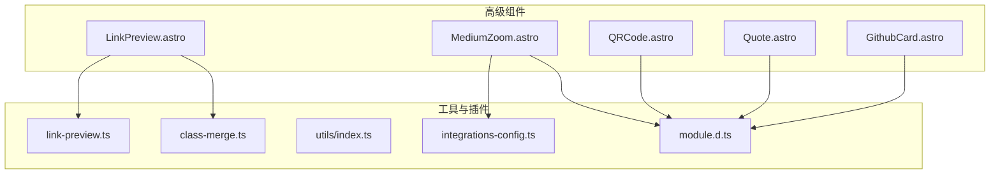
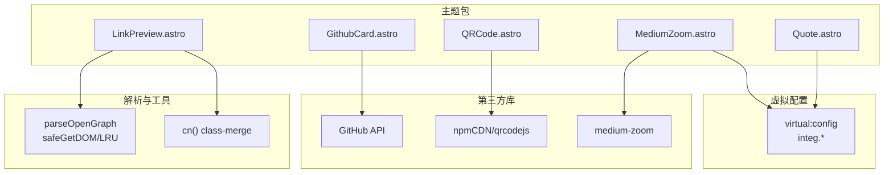
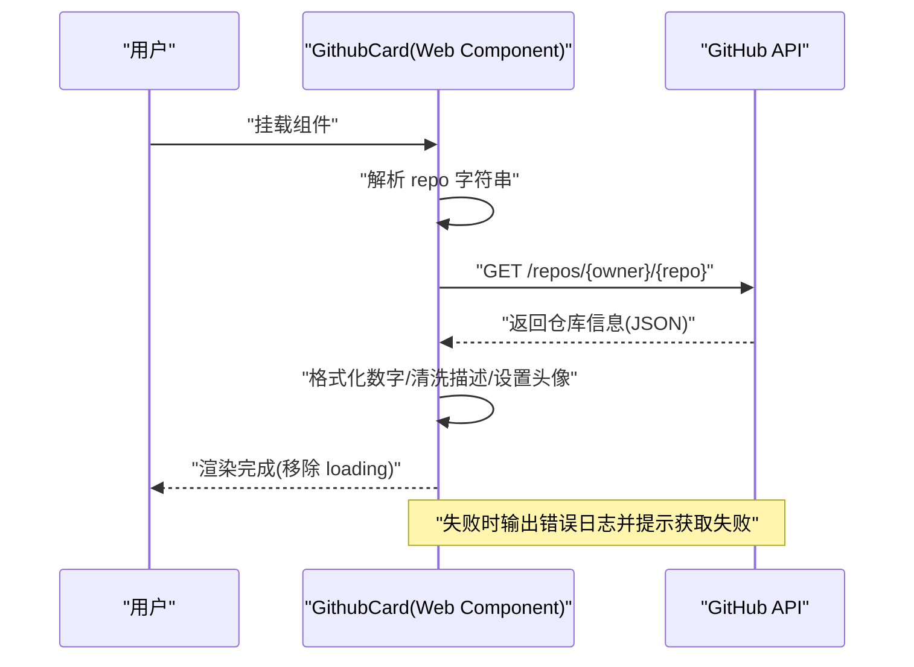
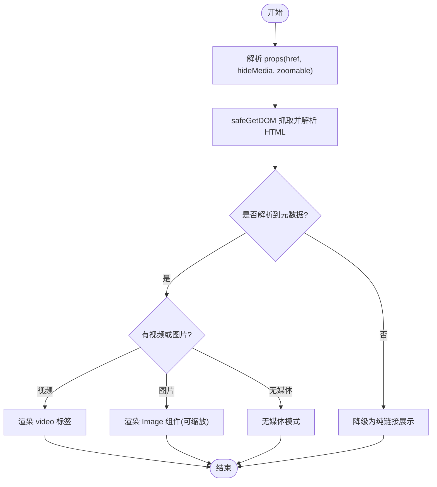
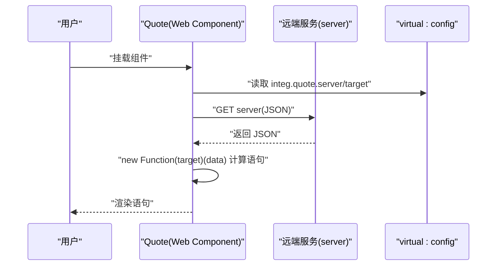
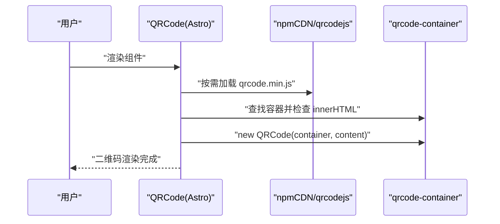
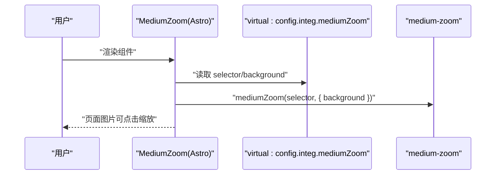
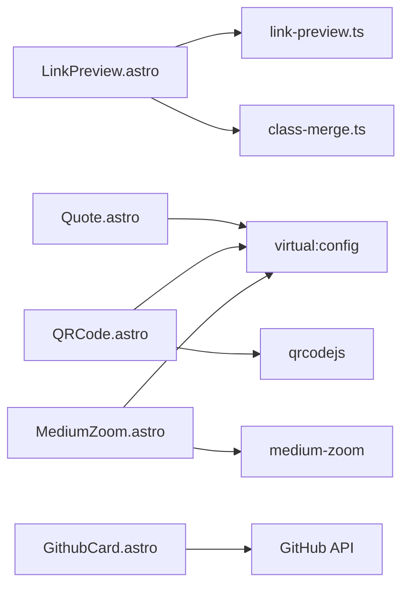

# 高级组件

<cite>
**本文档引用的文件**
- [packages/pure/components/advanced/GithubCard.astro](file://packages/pure/components/advanced/GithubCard.astro)
- [packages/pure/components/advanced/LinkPreview.astro](file://packages/pure/components/advanced/LinkPreview.astro)
- [packages/pure/components/advanced/Quote.astro](file://packages/pure/components/advanced/Quote.astro)
- [packages/pure/components/advanced/QRCode.astro](file://packages/pure/components/advanced/QRCode.astro)
- [packages/pure/components/advanced/MediumZoom.astro](file://packages/pure/components/advanced/MediumZoom.astro)
- [packages/pure/plugins/link-preview.ts](file://packages/pure/plugins/link-preview.ts)
- [packages/pure/utils/class-merge.ts](file://packages/pure/utils/class-merge.ts)
- [packages/pure/utils/index.ts](file://packages/pure/utils/index.ts)
- [packages/pure/types/integrations-config.ts](file://packages/pure/types/integrations-config.ts)
- [packages/pure/components/advanced/index.ts](file://packages/pure/components/advanced/index.ts)
- [packages/pure/types/module.d.ts](file://packages/pure/types/module.d.ts)
- [README.md](file://README.md)
- [packages/pure/README.md](file://packages/pure/README.md)
</cite>

## 目录
1. [简介](#简介)
2. [项目结构](#项目结构)
3. [核心组件](#核心组件)
4. [架构总览](#架构总览)
5. [详细组件分析](#详细组件分析)
6. [依赖关系分析](#依赖关系分析)
7. [性能考量](#性能考量)
8. [故障排查指南](#故障排查指南)
9. [结论](#结论)
10. [附录](#附录)

## 简介
本文件系统性梳理主题包中“高级组件”的设计与实现，覆盖以下组件：
- GithubCard：从 GitHub API 拉取仓库信息并渲染卡片，包含加载态、数据格式化、错误兜底与头像更新。
- LinkPreview：解析页面 Open Graph 元数据，动态生成链接预览卡片，支持图片/视频媒体与缩放能力。
- Quote：从远端服务拉取随机语录，通过虚拟配置注入的函数式路径进行字段抽取与渲染。
- QRCode：在客户端按需加载第三方二维码库，生成可定制内容的二维码。
- MediumZoom：基于 medium-zoom 的图片缩放增强，提供全局样式与默认选择器。

同时给出各组件的配置参数、使用示例与性能优化建议，帮助在不同项目中正确集成与扩展。

## 项目结构
高级组件位于主题包的 advanced 目录，统一导出入口为 advanced/index.ts；部分组件依赖虚拟配置模块 virtual:config 以读取用户侧集成配置（如 CDN、第三方库地址、默认选择器等）。

图表来源
- [packages/pure/components/advanced/index.ts](file://packages/pure/components/advanced/index.ts#L1-L9)
- [packages/pure/plugins/link-preview.ts](file://packages/pure/plugins/link-preview.ts#L1-L111)
- [packages/pure/utils/class-merge.ts](file://packages/pure/utils/class-merge.ts#L1-L20)
- [packages/pure/utils/index.ts](file://packages/pure/utils/index.ts#L1-L18)
- [packages/pure/types/integrations-config.ts](file://packages/pure/types/integrations-config.ts#L1-L66)
- [packages/pure/types/module.d.ts](file://packages/pure/types/module.d.ts#L1-L4)

章节来源
- [packages/pure/components/advanced/index.ts](file://packages/pure/components/advanced/index.ts#L1-L9)
- [README.md](file://README.md#L34-L42)
- [packages/pure/README.md](file://packages/pure/README.md#L11-L22)

## 核心组件
- GithubCard：Web Component 封装，负责调用 GitHub API、格式化数字、清洗描述、设置头像与语言/许可证显示。
- LinkPreview：服务端渲染组件，通过插件解析 Open Graph 元数据，按条件渲染图片或视频媒体，支持缩放类名与禁用媒体。
- Quote：Web Component 封装，通过虚拟配置的 integ.quote.server 与 target 函数式字符串，拉取并渲染语录。
- QRCode：客户端渲染组件，按需加载 qrcodejs，支持自定义内容与容器属性透传。
- MediumZoom：客户端初始化组件，按默认选择器启用 medium-zoom，支持背景色与全局样式覆盖。

章节来源
- [packages/pure/components/advanced/GithubCard.astro](file://packages/pure/components/advanced/GithubCard.astro#L101-L177)
- [packages/pure/components/advanced/LinkPreview.astro](file://packages/pure/components/advanced/LinkPreview.astro#L1-L83)
- [packages/pure/components/advanced/Quote.astro](file://packages/pure/components/advanced/Quote.astro#L19-L41)
- [packages/pure/components/advanced/QRCode.astro](file://packages/pure/components/advanced/QRCode.astro#L1-L22)
- [packages/pure/components/advanced/MediumZoom.astro](file://packages/pure/components/advanced/MediumZoom.astro#L1-L48)

## 架构总览
下图展示高级组件与外部依赖的关系：组件通过虚拟配置模块读取用户侧集成配置，LinkPreview 使用独立插件解析网页元数据并带缓存；MediumZoom 依赖主题内集成配置的默认选择器。

图表来源
- [packages/pure/components/advanced/GithubCard.astro](file://packages/pure/components/advanced/GithubCard.astro#L112-L125)
- [packages/pure/components/advanced/LinkPreview.astro](file://packages/pure/components/advanced/LinkPreview.astro#L4-L5)
- [packages/pure/components/advanced/Quote.astro](file://packages/pure/components/advanced/Quote.astro#L20-L37)
- [packages/pure/components/advanced/QRCode.astro](file://packages/pure/components/advanced/QRCode.astro#L9-L11)
- [packages/pure/components/advanced/MediumZoom.astro](file://packages/pure/components/advanced/MediumZoom.astro#L14-L16)
- [packages/pure/plugins/link-preview.ts](file://packages/pure/plugins/link-preview.ts#L46-L68)
- [packages/pure/utils/class-merge.ts](file://packages/pure/utils/class-merge.ts#L17-L19)
- [packages/pure/types/integrations-config.ts](file://packages/pure/types/integrations-config.ts#L40-L47)
- [packages/pure/types/module.d.ts](file://packages/pure/types/module.d.ts#L1-L4)

## 详细组件分析

### GithubCard 组件
- 功能特性
  - 解析仓库路径，移除协议前缀，拆分为 owner/repo。
  - Web Component 生命周期中发起 GitHub API 请求，更新星级数、fork 数、语言、许可证、描述与头像。
  - 数字采用紧凑格式化；描述中对特定表情占位符进行清洗；无许可证时显示占位提示。
  - 加载态使用伪元素动画，成功后移除 loading 类。
- 数据流与错误处理
  - 成功：更新 DOM 文本与背景图；移除 loading。
  - 失败：记录错误并提示“获取失败”。
- 性能与可用性
  - 仅在首次挂载时请求一次；避免重复渲染。
  - 头像通过 CSS 背景图设置，减少额外 img 标签层级。
- 配置与使用
  - 接收仓库字符串（支持 https://github.com/{owner}/{repo} 形式）。
  - 无需额外配置，自动渲染卡片与统计信息。
- 示例
  - 在文章或页面中直接使用组件标签，传入仓库路径即可。

图表来源
- [packages/pure/components/advanced/GithubCard.astro](file://packages/pure/components/advanced/GithubCard.astro#L112-L165)

章节来源
- [packages/pure/components/advanced/GithubCard.astro](file://packages/pure/components/advanced/GithubCard.astro#L1-L177)

### LinkPreview 组件
- 功能特性
  - 服务端异步解析目标 URL 的 Open Graph 元数据，优先取 og:title/description/image/video。
  - 支持禁用媒体（hideMedia）、是否允许缩放（zoomable），并根据媒体类型切换布局。
  - 域名展示：从元数据 URL 或 canonical 中提取主机名并去除 www. 前缀。
  - 图片使用 Astro 内置 Image 组件，按固定宽高比裁剪；视频直接渲染。
- 元数据提取与缓存
  - 插件提供安全抓取与 DOM 解析，内部维护 LRU 缓存，命中则直接返回缓存结果。
  - 对非 HTTPS 的资源 URL 进行过滤，确保安全性。
- 安全与健壮性
  - 抓取失败或解析失败时，降级为纯文本链接展示。
- 配置与使用
  - 必填：href（目标 URL）
  - 可选：hideMedia（是否隐藏媒体）、zoomable（图片是否可缩放）
- 示例
  - 在文章中插入组件并传入链接，自动渲染预览卡片。

图表来源
- [packages/pure/components/advanced/LinkPreview.astro](file://packages/pure/components/advanced/LinkPreview.astro#L17-L71)
- [packages/pure/plugins/link-preview.ts](file://packages/pure/plugins/link-preview.ts#L79-L108)

章节来源
- [packages/pure/components/advanced/LinkPreview.astro](file://packages/pure/components/advanced/LinkPreview.astro#L1-L83)
- [packages/pure/plugins/link-preview.ts](file://packages/pure/plugins/link-preview.ts#L1-L111)
- [packages/pure/utils/class-merge.ts](file://packages/pure/utils/class-merge.ts#L17-L19)

### Quote 组件
- 功能特性
  - Web Component 封装，连接时通过虚拟配置的 integ.quote.server 拉取 JSON 数据。
  - 通过 integ.quote.target（字符串形式的函数体）动态计算目标字段，渲染到组件内部。
  - 使用 new Function 执行字符串函数，实现灵活的数据映射。
- 配置与使用
  - 需要在用户配置中提供 integ.quote.server 与 integ.quote.target。
  - 组件会自动渲染“正在加载”状态，完成后替换为实际语录。
- 示例
  - 在需要展示随机语录的位置引入组件，确保配置正确即可。

图表来源
- [packages/pure/components/advanced/Quote.astro](file://packages/pure/components/advanced/Quote.astro#L24-L37)
- [packages/pure/types/module.d.ts](file://packages/pure/types/module.d.ts#L1-L4)

章节来源
- [packages/pure/components/advanced/Quote.astro](file://packages/pure/components/advanced/Quote.astro#L1-L41)
- [packages/pure/types/integrations-config.ts](file://packages/pure/types/integrations-config.ts#L19-L25)

### QRCode 组件
- 功能特性
  - 客户端渲染，按需加载 qrcodejs 库，支持自定义内容（content）与容器属性透传。
  - 若未指定内容，默认使用当前浏览器地址。
  - 首次渲染时才实例化二维码，避免重复创建。
- 配置与使用
  - content：二维码内容（字符串）
  - class/...props：透传给容器 div
  - 依赖虚拟配置中的 npmCDN，用于加载第三方库。
- 示例
  - 在文章或页面中插入组件，传入 content 即可生成二维码。

图表来源
- [packages/pure/components/advanced/QRCode.astro](file://packages/pure/components/advanced/QRCode.astro#L9-L21)
- [packages/pure/types/module.d.ts](file://packages/pure/types/module.d.ts#L1-L4)

章节来源
- [packages/pure/components/advanced/QRCode.astro](file://packages/pure/components/advanced/QRCode.astro#L1-L22)

### MediumZoom 组件
- 功能特性
  - 客户端初始化 medium-zoom，按默认选择器启用图片缩放。
  - 支持自定义背景色，覆盖默认遮罩层样式。
  - 提供全局样式，控制 overlay 与 image 的显隐与过渡。
- 配置与使用
  - selector：应用缩放的目标选择器（默认来自集成配置）
  - background：遮罩背景色（默认来自主题变量）
  - 依赖集成配置中的 mediumZoom.enable/selector/options。
- 示例
  - 在页面中引入组件，确保 Markdown 渲染产物带有 zoomable 类或符合默认选择器。

图表来源
- [packages/pure/components/advanced/MediumZoom.astro](file://packages/pure/components/advanced/MediumZoom.astro#L14-L17)
- [packages/pure/types/integrations-config.ts](file://packages/pure/types/integrations-config.ts#L40-L47)

章节来源
- [packages/pure/components/advanced/MediumZoom.astro](file://packages/pure/components/advanced/MediumZoom.astro#L1-L48)
- [packages/pure/types/integrations-config.ts](file://packages/pure/types/integrations-config.ts#L1-L66)

## 依赖关系分析
- 组件间耦合
  - LinkPreview 与插件 link-preview.ts 强耦合，解析与缓存逻辑集中于插件。
  - Quote、QRCode、MediumZoom 依赖虚拟配置 virtual:config，形成弱耦合的配置驱动。
  - GithubCard 与外部 API 强耦合，内部无缓存策略。
- 外部依赖
  - LinkPreview：safeGetDOM、LRU 缓存、Open Graph 元数据解析。
  - QRCode：qrcodejs（通过 npmCDN 按需加载）。
  - MediumZoom：medium-zoom（通过 npmCDN 按需加载）。
- 风险点
  - GithubCard 未内置缓存，频繁渲染可能触发多次 API 请求。
  - LinkPreview 插件对非 HTTPS 资源进行过滤，避免不安全内容。
  - Quote 通过字符串函数执行，需确保配置合法且安全。

图表来源
- [packages/pure/components/advanced/LinkPreview.astro](file://packages/pure/components/advanced/LinkPreview.astro#L4-L5)
- [packages/pure/plugins/link-preview.ts](file://packages/pure/plugins/link-preview.ts#L46-L68)
- [packages/pure/utils/class-merge.ts](file://packages/pure/utils/class-merge.ts#L17-L19)
- [packages/pure/components/advanced/Quote.astro](file://packages/pure/components/advanced/Quote.astro#L20-L37)
- [packages/pure/components/advanced/QRCode.astro](file://packages/pure/components/advanced/QRCode.astro#L9-L11)
- [packages/pure/components/advanced/MediumZoom.astro](file://packages/pure/components/advanced/MediumZoom.astro#L14-L16)
- [packages/pure/components/advanced/GithubCard.astro](file://packages/pure/components/advanced/GithubCard.astro#L112-L125)

章节来源
- [packages/pure/components/advanced/index.ts](file://packages/pure/components/advanced/index.ts#L1-L9)

## 性能考量
- LinkPreview
  - 插件内置 LRU 缓存，避免重复抓取相同 URL；建议在高频场景下复用组件，减少网络开销。
  - 对非 HTTPS 资源过滤，降低跨域与安全风险。
- GithubCard
  - 建议在上层组件层面对相同 repo 进行去重渲染，避免重复请求；或在业务侧增加本地缓存。
  - 数字格式化与描述清洗为纯前端操作，成本较低。
- Quote
  - 仅在连接时请求一次，避免重复拉取；建议将服务端响应做本地缓存。
- QRCode
  - 按需加载第三方库，首次渲染时实例化；建议在 SSR 场景下考虑预加载或服务端渲染替代方案。
- MediumZoom
  - 默认选择器针对 Markdown 渲染产物；确保渲染产物包含所需类名或自定义 selector，避免无效初始化。

[本节为通用性能建议，不直接分析具体文件]

## 故障排查指南
- LinkPreview 无法显示媒体
  - 检查目标页面是否正确设置 Open Graph 元数据；确认资源 URL 为 https。
  - 若被过滤，尝试更换可公开访问的资源。
- LinkPreview 一直显示降级
  - 网络抓取失败或解析异常；查看控制台错误日志，确认 URL 可达。
- GithubCard 显示“获取失败”
  - 检查仓库路径是否正确；确认 GitHub API 可访问；观察网络面板错误码。
- Quote 不显示内容
  - 确认 virtual:config 中 integ.quote.server 与 integ.quote.target 配置正确；检查服务端返回 JSON 结构。
- QRCode 未渲染
  - 确认 npmCDN 可访问；检查容器是否存在且未被提前填充内容。
- MediumZoom 无效果
  - 确认渲染产物包含默认选择器或自定义 selector；检查全局样式是否被覆盖。

章节来源
- [packages/pure/plugins/link-preview.ts](file://packages/pure/plugins/link-preview.ts#L51-L67)
- [packages/pure/components/advanced/GithubCard.astro](file://packages/pure/components/advanced/GithubCard.astro#L117-L125)
- [packages/pure/components/advanced/Quote.astro](file://packages/pure/components/advanced/Quote.astro#L33-L37)
- [packages/pure/components/advanced/QRCode.astro](file://packages/pure/components/advanced/QRCode.astro#L13-L20)
- [packages/pure/components/advanced/MediumZoom.astro](file://packages/pure/components/advanced/MediumZoom.astro#L14-L17)

## 结论
上述高级组件围绕“服务端解析 + 客户端增强”的思路构建：LinkPreview 通过插件解析元数据并缓存；Quote/QRCode/MediumZoom 通过虚拟配置实现灵活接入；GithubCard 则直接对接外部 API 展示仓库信息。建议在生产环境中结合缓存与错误兜底策略，提升稳定性与性能。

[本节为总结性内容，不直接分析具体文件]

## 附录
- 组件导出入口
  - advanced/index.ts 统一导出 Quote、GithubCard、LinkPreview、QRCode、MediumZoom。
- 集成配置要点
  - Quote：integ.quote.server、integ.quote.target。
  - MediumZoom：integ.mediumZoom.enable、selector、options。
- 使用参考
  - README 与包文档提供了基础使用说明与集成指引。

章节来源
- [packages/pure/components/advanced/index.ts](file://packages/pure/components/advanced/index.ts#L1-L9)
- [packages/pure/types/integrations-config.ts](file://packages/pure/types/integrations-config.ts#L19-L47)
- [README.md](file://README.md#L34-L42)
- [packages/pure/README.md](file://packages/pure/README.md#L11-L22)