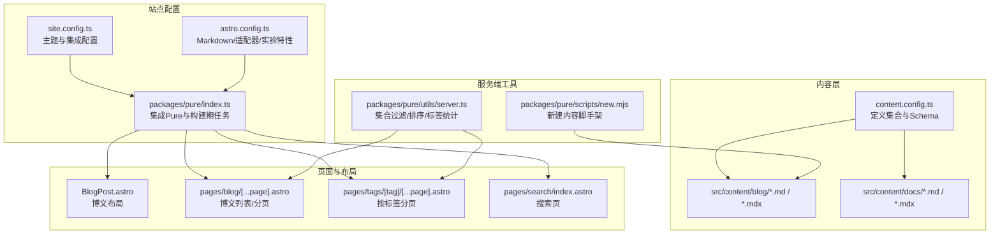
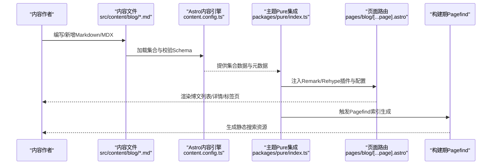
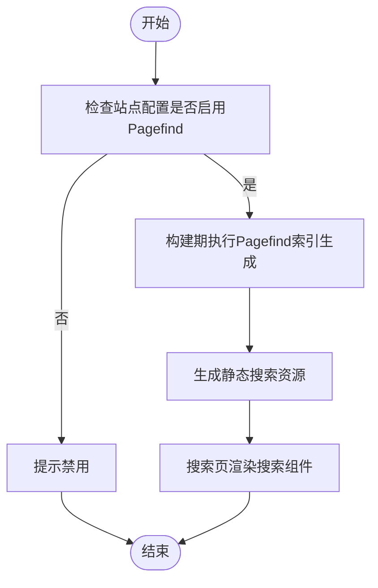
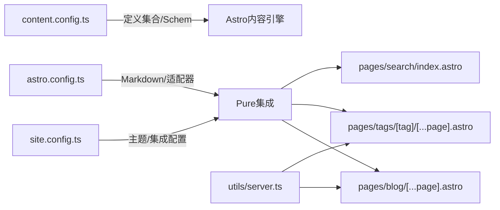

# 内容管理系统

<cite>
**本文引用的文件**
- [content.config.ts](file://src/content.config.ts)
- [site.config.ts](file://src/site.config.ts)
- [astro.config.ts](file://astro.config.ts)
- [index.ts](file://packages/pure/index.ts)
- [theme-config.ts](file://packages/pure/types/theme-config.ts)
- [BlogPost.astro](file://src/layouts/BlogPost.astro)
- [[...page].astro](file://src/pages/blog/[...page].astro)
- [server.ts](file://packages/pure/utils/server.ts)
- [new.mjs](file://packages/pure/scripts/new.mjs)
- [index.astro](file://src/pages/search/index.astro)
- [tags-[tag]-[...page].astro](file://src/pages/tags/[tag]/[...page].astro)
</cite>

## 目录
1. [简介](#简介)
2. [项目结构](#项目结构)
3. [核心组件](#核心组件)
4. [架构总览](#架构总览)
5. [组件详解](#组件详解)
6. [依赖关系分析](#依赖关系分析)
7. [性能考量](#性能考量)
8. [故障排查指南](#故障排查指南)
9. [结论](#结论)
10. [附录](#附录)

## 简介
本文件面向内容作者与开发者，系统化梳理基于 Astro 主题 Pure 的内容管理系统。内容覆盖：
- 内容集合的定义与校验规则（content.config.ts）
- 博文与文档的组织、前置字段与元数据管理
- 分类、标签体系与内容导航
- 内容路由生成与 URL 结构
- 内容创作、编辑与发布工作流
- 搜索与索引（Pagefind）机制
- 内容版本与迁移建议
- 实用内容管理指导

## 项目结构
该系统采用 Astro 的内容目录与页面路由结合的方式组织内容与页面。核心位置如下：
- 内容集合定义：src/content.config.ts
- 站点主题与集成配置：src/site.config.ts
- 构建与插件配置：astro.config.ts
- 主题 Pure 集成与构建期行为：packages/pure/index.ts
- 主题配置 Schema：packages/pure/types/theme-config.ts
- 博文布局：src/layouts/BlogPost.astro
- 博文列表页与分页：src/pages/blog/[...page].astro
- 标签页与分页：src/pages/tags/[tag]/[...page].astro
- 搜索页：src/pages/search/index.astro
- 内容工具与脚手架：packages/pure/scripts/new.mjs
- 内容服务端工具：packages/pure/utils/server.ts

图表来源
- [content.config.ts](file://src/content.config.ts#L1-L77)
- [site.config.ts](file://src/site.config.ts#L1-L207)
- [astro.config.ts](file://astro.config.ts#L1-L133)
- [index.ts](file://packages/pure/index.ts#L1-L114)
- [BlogPost.astro](file://src/layouts/BlogPost.astro#L1-L75)
- [[...page].astro](file://src/pages/blog/[...page].astro#L1-L111)
- [tags-[tag]-[...page].astro](file://src/pages/tags/[tag]/[...page].astro#L1-L73)
- [index.astro](file://src/pages/search/index.astro#L1-L34)
- [server.ts](file://packages/pure/utils/server.ts#L1-L67)
- [new.mjs](file://packages/pure/scripts/new.mjs#L1-L131)

章节来源
- [content.config.ts](file://src/content.config.ts#L1-L77)
- [site.config.ts](file://src/site.config.ts#L1-L207)
- [astro.config.ts](file://astro.config.ts#L1-L133)
- [index.ts](file://packages/pure/index.ts#L1-L114)

## 核心组件
- 内容集合与Schema
  - 定义 blog、process 集合，支持 Markdown 与 MDX；docs 集合用于文档。
  - 字段约束：标题长度上限、描述长度上限、日期强制转换、可选更新时间、草稿标记、评论开关、标签去重与小写化等。
  - 注意：当前 collections 仅导出 blog、process，docs 集合未在导出对象中出现，需在页面中显式使用。

- 主题与集成配置
  - 主题配置包含站点元信息、语言、Logo、页头/页脚菜单、分享按钮、博客分页大小等。
  - 集成配置启用 Pagefind 搜索、Waline 评论、MediumZoom 等。

- 构建与插件
  - Markdown 数学公式、锚点、自动链接、代码高亮与折叠等。
  - 构建期调用 Pagefind 生成索引。

- 页面与布局
  - 博文布局负责元数据、社交图、目录、评论与推荐。
  - 列表页与标签页通过分页组件实现分页与导航。

章节来源
- [content.config.ts](file://src/content.config.ts#L11-L77)
- [site.config.ts](file://src/site.config.ts#L3-L99)
- [astro.config.ts](file://astro.config.ts#L52-L104)
- [BlogPost.astro](file://src/layouts/BlogPost.astro#L1-L75)
- [[...page].astro](file://src/pages/blog/[...page].astro#L1-L111)
- [tags-[tag]-[...page].astro](file://src/pages/tags/[tag]/[...page].astro#L1-L73)

## 架构总览
下图展示从内容文件到页面渲染的关键路径，以及构建期 Pagefind 索引生成：

图表来源
- [content.config.ts](file://src/content.config.ts#L11-L77)
- [index.ts](file://packages/pure/index.ts#L98-L110)
- [[...page].astro](file://src/pages/blog/[...page].astro#L13-L21)
- [index.astro](file://src/pages/search/index.astro#L1-L34)

## 组件详解

### 内容集合与Schema（content.config.ts）
- 集合加载
  - blog/process 使用 glob 加载 src/content/blog 与 src/content/process 下的 **/*.{md,mdx}。
  - docs 使用 glob 加载 src/content/docs 下的 **/*.{md,mdx}。
- 字段校验与默认值
  - 标题与描述长度限制；日期字段强制转换为 Date；heroImage 支持图片与尺寸/颜色；tags 默认空数组并去重与小写化；language 可选；draft 默认 false；comment 在 blog/process 中默认 true。
- 导出集合
  - 当前导出对象包含 blog、process；docs 未在导出对象中出现，需在页面中显式使用。

章节来源
- [content.config.ts](file://src/content.config.ts#L11-L77)

### 博文布局与元数据（BlogPost.astro）
- 元信息注入：标题、描述、社交图、发布时间/更新时间。
- 功能模块：目录（TOC）、顶部英雄区（Hero）、版权（Copyright）、相关文章（ArticleBottom）、评论（Waline）。
- 图片缩放：根据配置启用 MediumZoom。

章节来源
- [BlogPost.astro](file://src/layouts/BlogPost.astro#L1-L75)

### 博文列表与分页（pages/blog/[...page].astro）
- 静态生成：prerender 启用。
- 数据处理：获取集合、按日期排序、统计唯一标签、计算总数。
- 分页：根据配置的 blogPageSize 进行分页，生成上一页/下一页链接。
- 侧边栏：展示前 50 个标签与“查看全部”。

章节来源
- [[...page].astro](file://src/pages/blog/[...page].astro#L13-L21)
- [[...page].astro](file://src/pages/blog/[...page].astro#L36-L49)
- [[...page].astro](file://src/pages/blog/[...page].astro#L82-L105)

### 标签筛选与分页（pages/tags/[tag]/[...page].astro）
- 静态生成：prerender 启用。
- 数据处理：按日期排序、提取唯一标签、按标签过滤集合。
- 分页：对每个标签单独分页，保留标签参数。
- 导航：返回博客列表的按钮与分页组件。

章节来源
- [tags-[tag]-[...page].astro](file://src/pages/tags/[tag]/[...page].astro#L13-L25)
- [tags-[tag]-[...page].astro](file://src/pages/tags/[tag]/[...page].astro#L39-L52)

### 搜索与索引（Pagefind）
- 配置：在站点配置中开启 pagefind。
- 构建期：主题 Pure 集成在构建完成后调用 npx pagefind 生成索引。
- 页面：搜索页根据配置决定是否渲染搜索组件。

图表来源
- [site.config.ts](file://src/site.config.ts#L124-L124)
- [index.ts](file://packages/pure/index.ts#L98-L110)
- [index.astro](file://src/pages/search/index.astro#L22-L30)

章节来源
- [site.config.ts](file://src/site.config.ts#L124-L124)
- [index.ts](file://packages/pure/index.ts#L98-L110)
- [index.astro](file://src/pages/search/index.astro#L1-L34)

### 内容服务端工具（server.ts）
- 集合过滤：按环境过滤草稿（生产环境不显示 draft）。
- 排序：以更新时间或发布时间倒序排列。
- 标签：提取所有标签、去重、统计数量并降序。

章节来源
- [server.ts](file://packages/pure/utils/server.ts#L8-L13)
- [server.ts](file://packages/pure/utils/server.ts#L40-L46)
- [server.ts](file://packages/pure/utils/server.ts#L49-L66)

### 新建内容脚手架（scripts/new.mjs）
- 参数：语言（-l）、草稿（-d）、MDX（-m）、文件夹（-f）、帮助（-h）。
- 生成：根据标题生成带日期的文件名，写入基础 Frontmatter，支持单文件或目录形式。

章节来源
- [new.mjs](file://packages/pure/scripts/new.mjs#L60-L131)

## 依赖关系分析
- 内容引擎与主题集成
  - content.config.ts 定义集合与 Schema，为页面与服务端工具提供统一的数据契约。
  - site.config.ts 与 astro.config.ts 配置主题与构建插件，Pure 集成负责注入插件与构建期任务。
- 页面与工具
  - pages/blog 与 pages/tags 依赖 server.ts 的集合过滤与排序能力。
  - Pure 集成在构建期触发 Pagefind，搜索页按配置渲染。

图表来源
- [content.config.ts](file://src/content.config.ts#L11-L77)
- [site.config.ts](file://src/site.config.ts#L101-L181)
- [astro.config.ts](file://astro.config.ts#L99-L104)
- [index.ts](file://packages/pure/index.ts#L29-L96)
- [[...page].astro](file://src/pages/blog/[...page].astro#L1-L111)
- [tags-[tag]-[...page].astro](file://src/pages/tags/[tag]/[...page].astro#L1-L73)
- [index.astro](file://src/pages/search/index.astro#L1-L34)
- [server.ts](file://packages/pure/utils/server.ts#L1-L67)

章节来源
- [content.config.ts](file://src/content.config.ts#L11-L77)
- [site.config.ts](file://src/site.config.ts#L101-L181)
- [astro.config.ts](file://astro.config.ts#L99-L104)
- [index.ts](file://packages/pure/index.ts#L29-L96)
- [server.ts](file://packages/pure/utils/server.ts#L1-L67)

## 性能考量
- 预渲染与分页：列表页与标签页启用 prerender，提升首屏性能。
- 代码高亮与数学公式：在构建时完成，减少客户端负担。
- Pagefind 索引：构建期生成，避免运行时扫描内容。
- 草稿过滤：仅在非生产环境显示草稿，减少无效渲染。

章节来源
- [[...page].astro](file://src/pages/blog/[...page].astro#L11-L11)
- [index.ts](file://packages/pure/index.ts#L98-L110)
- [server.ts](file://packages/pure/utils/server.ts#L8-L13)

## 故障排查指南
- Pagefind 未生成索引
  - 检查站点配置是否启用 pagefind。
  - 确认构建日志中是否执行了 Pagefind 命令。
- 草稿内容未显示
  - 确认当前环境是否为开发模式；生产环境会过滤 draft。
- 标签统计异常
  - 确认 Frontmatter 中 tags 是否存在重复或大小写差异；Schema 已进行去重与小写化。
- 文档集合未生效
  - 当前 collections 未导出 docs，请在页面中显式使用 docs 集合。

章节来源
- [site.config.ts](file://src/site.config.ts#L124-L124)
- [index.ts](file://packages/pure/index.ts#L98-L110)
- [server.ts](file://packages/pure/utils/server.ts#L8-L13)
- [content.config.ts](file://src/content.config.ts#L76-L77)

## 结论
该内容管理系统以 Astro 为核心，借助 Pure 主题与集成，实现了：
- 明确的内容集合与字段校验
- 便捷的博文与文档组织
- 标签与分页导航
- 构建期 Pagefind 搜索
- 可扩展的主题与插件生态

建议在团队协作中统一 Frontmatter 规范与命名约定，配合脚手架工具提升一致性与效率。

## 附录

### 内容集合与字段规范
- blog/process 集合
  - 必填：title、description、publishDate
  - 可选：updatedDate、heroImage、language、draft、comment
  - 特性：tags 自动去重与小写化
- docs 集合
  - 必填：title、description
  - 可选：publishDate、updatedDate、tags、draft、order
- 导出集合：blog、process（docs 未在导出对象中）

章节来源
- [content.config.ts](file://src/content.config.ts#L11-L77)

### 内容路由与URL结构
- 博文列表：/blog
- 博文详情：/blog/{slug}（由文件名派生）
- 标签列表：/tags/{tag}
- 标签分页：/tags/{tag}/page/{page}
- 归档：/archives（页面存在但未在本节展开）
- 搜索：/search

章节来源
- [[...page].astro](file://src/pages/blog/[...page].astro#L1-L111)
- [tags-[tag]-[...page].astro](file://src/pages/tags/[tag]/[...page].astro#L1-L73)
- [index.astro](file://src/pages/search/index.astro#L1-L34)

### 内容创作、编辑与发布工作流
- 创建：使用脚手架生成基础 Frontmatter，随后补充正文。
- 编辑：更新 Frontmatter 字段（如 draft、tags），必要时调整 heroImage。
- 发布：移除 draft 或在生产环境发布；Pagefind 索引会在构建期更新。

章节来源
- [new.mjs](file://packages/pure/scripts/new.mjs#L60-L131)
- [server.ts](file://packages/pure/utils/server.ts#L8-L13)

### 内容版本管理与迁移建议
- 版本管理
  - 使用 Git 管理内容文件与配置变更。
  - 对重大 Schema 变更采用分支策略，逐步迁移。
- 迁移策略
  - 逐步更新 Frontmatter 字段，保持向后兼容。
  - 如需调整集合导出，确保页面与工具链同步修改。

章节来源
- [content.config.ts](file://src/content.config.ts#L76-L77)