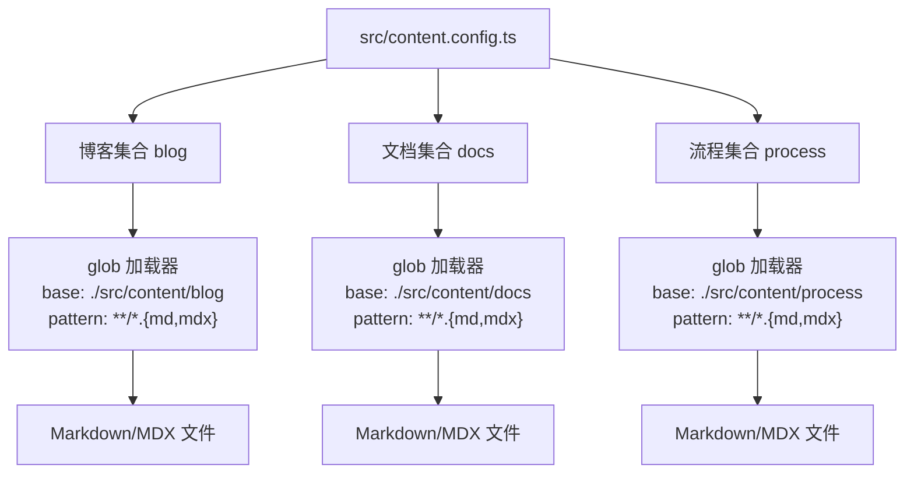
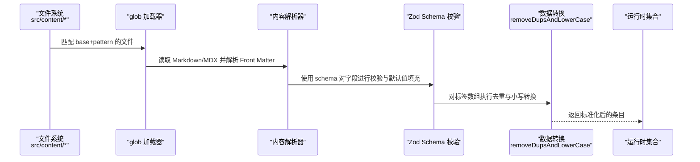
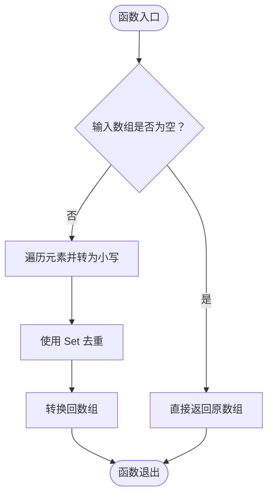
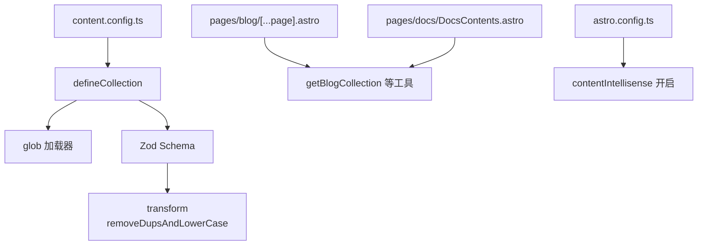

# 内容集合定义

<cite>
**本文引用的文件**
- [content.config.ts](file://src/content.config.ts)
- [blog 示例内容](file://src/content/blog/ngrok.md)
- [blog 示例内容（含标签）](file://src/content/blog/2025-09-20-服务器网络访问控制.md)
- [process 示例内容](file://src/content/process/小程序认证费用审批报销流程.md)
- [博客分页页面](file://src/pages/blog/[...page].astro)
- [文档目录页面](file://src/pages/docs/DocsContents.astro)
- [错误解析工具](file://packages/pure/utils/error-map.ts)
- [Astro 配置](file://astro.config.ts)
</cite>

## 目录
1. [简介](#简介)
2. [项目结构](#项目结构)
3. [核心组件](#核心组件)
4. [架构总览](#架构总览)
5. [详细组件分析](#详细组件分析)
6. [依赖分析](#依赖分析)
7. [性能考虑](#性能考虑)
8. [故障排查指南](#故障排查指南)
9. [结论](#结论)
10. [附录](#附录)

## 简介
本文件围绕 Astro 内容集合定义进行系统化说明，重点聚焦于 src/content.config.ts 中的博客、文档与流程（SOP）三类内容集合的配置方式。内容涵盖：
- defineCollection 的使用与配置项
- 内容加载器 glob 的 base 与 pattern 设置
- 内容验证 schema 的字段类型、约束与默认值
- removeDupsAndLowerCase 函数的去重与归一化逻辑
- 扩展与自定义新内容类型的步骤
- 最佳实践与常见问题处理建议

## 项目结构
本项目采用按内容类型划分的集合组织方式，内容文件位于 src/content 下的不同子目录，并通过 content.config.ts 统一声明与校验。

图表来源
- [content.config.ts](file://src/content.config.ts#L12-L41)
- [content.config.ts](file://src/content.config.ts#L43-L57)
- [content.config.ts](file://src/content.config.ts#L59-L74)

章节来源
- [content.config.ts](file://src/content.config.ts#L1-L77)

## 核心组件
- defineCollection：用于定义单个内容集合，包含 loader 与 schema 两部分。
- glob 加载器：基于 base 与 pattern 的文件匹配策略，自动扫描并读取 Markdown/MDX 内容。
- Zod schema：对 Front Matter 字段进行强类型校验、默认值注入与数据转换。
- removeDupsAndLowerCase：对标签数组进行去重与小写归一化，保证索引一致性。

章节来源
- [content.config.ts](file://src/content.config.ts#L1-L77)

## 架构总览
内容从磁盘文件到运行时数据的流转如下：

图表来源
- [content.config.ts](file://src/content.config.ts#L12-L41)
- [content.config.ts](file://src/content.config.ts#L43-L57)
- [content.config.ts](file://src/content.config.ts#L59-L74)

## 详细组件分析

### 博客集合（blog）
- 加载器配置
  - base：./src/content/blog
  - pattern：**/*.{md,mdx}
- schema 关键字段
  - 必填：title（最大长度 60）、description（最大长度 160）、publishDate（日期）
  - 可选：updatedDate（日期）、heroImage（嵌套对象，支持 src、alt、inferSize、width、height、color；src 来源于 image()）、language、draft（默认 false）、comment（默认 true）
  - 特殊：tags（字符串数组，默认空数组），经 transform 执行去重与小写归一化
- 典型使用场景
  - 在页面中通过 getBlogCollection 获取并分页展示
  - 基于 tags 进行侧边栏标签云生成

章节来源
- [content.config.ts](file://src/content.config.ts#L12-L41)
- [博客分页页面](file://src/pages/blog/[...page].astro#L13-L21)

### 文档集合（docs）
- 加载器配置
  - base：./src/content/docs
  - pattern：**/*.{md,mdx}
- schema 关键字段
  - 必填：title（最大长度 60）、description（最大长度 160）
  - 可选：publishDate、updatedDate、draft（默认 false）
  - 特殊：tags（字符串数组，默认空数组），经 transform 执行去重与小写归一化；order（数字，默认 999）
- 当前状态
  - 文档目录页面存在注释标记，表示文档功能暂未启用

章节来源
- [content.config.ts](file://src/content.config.ts#L43-L57)
- [文档目录页面](file://src/pages/docs/DocsContents.astro#L10-L18)

### 流程集合（process，即 SOP）
- 加载器配置
  - base：./src/content/process
  - pattern：**/*.{md,mdx}
- schema 关键字段
  - 必填：title、description、publishDate
  - 可选：updatedDate、draft（默认 false）
  - 特殊：tags（字符串数组，默认空数组），经 transform 执行去重与小写归一化；order（数字，默认 999）；comment（默认 true）

章节来源
- [content.config.ts](file://src/content.config.ts#L59-L74)

### removeDupsAndLowerCase 去重与归一化
该函数负责对标签数组进行标准化处理，确保后续索引与查询的一致性与准确性。

图表来源
- [content.config.ts](file://src/content.config.ts#L4-L9)

章节来源
- [content.config.ts](file://src/content.config.ts#L4-L9)

### 内容加载器（glob）配置详解
- base 路径
  - 指定内容根目录，影响相对路径解析与文件定位
- pattern 模式
  - 支持通配符匹配，当前统一使用 **/*.{md,mdx}，覆盖所有 Markdown/MDX 文件
- 作用范围
  - 自动扫描指定目录下的所有匹配文件，构建内容集合条目

章节来源
- [content.config.ts](file://src/content.config.ts#L12-L41)
- [content.config.ts](file://src/content.config.ts#L43-L57)
- [content.config.ts](file://src/content.config.ts#L59-L74)

### 内容验证 schema 的字段类型、约束与默认值
- 字段类型
  - 字符串：title、description、language、heroImage.alt、heroImage.color
  - 日期：publishDate、updatedDate（通过 coerce.date() 解析）
  - 数字：order、heroImage.width、heroImage.height
  - 布尔：draft、comment、heroImage.inferSize
  - 数组：tags（字符串数组）
- 约束条件
  - 字符串长度限制：title 最大 60，description 最大 160
  - 可选字段：未显式标注 optional() 的字段视为必填
- 默认值与转换
  - draft 默认 false
  - comment 默认 true（仅 blog、process）
  - order 默认 999（仅 docs、process）
  - tags 默认 [] 并通过 transform 执行去重与小写归一化

章节来源
- [content.config.ts](file://src/content.config.ts#L16-L40)
- [content.config.ts](file://src/content.config.ts#L46-L56)
- [content.config.ts](file://src/content.config.ts#L62-L73)

### 实际内容示例与字段映射
- 博客示例（ngrok.md）
  - Front Matter 字段：title、description、publishDate、draft
- 博客示例（含标签）
  - Front Matter 字段：title、publishDate、updatedDate、tags（数组）
- 流程示例（小程序认证费用审批报销流程.md）
  - Front Matter 字段：title、description、publishDate、tags、order、draft

章节来源
- [blog 示例内容](file://src/content/blog/ngrok.md#L1-L6)
- [blog 示例内容（含标签）](file://src/content/blog/2025-09-20-服务器网络访问控制.md#L1-L9)
- [process 示例内容](file://src/content/process/小程序认证费用审批报销流程.md#L1-L10)

### 在页面中的使用
- 博客分页页面
  - 通过 getBlogCollection 获取集合，结合 sortMDByDate、getUniqueTagsWithCount 等工具进行排序与标签统计
  - 使用 paginate 生成分页路径与页面数据
- 文档目录页面
  - 当前处于注释禁用状态，原计划按分类聚合并按 order 排序展示

章节来源
- [博客分页页面](file://src/pages/blog/[...page].astro#L13-L21)
- [博客分页页面](file://src/pages/blog/[...page].astro#L23-L27)
- [博客分页页面](file://src/pages/blog/[...page].astro#L52-L110)
- [文档目录页面](file://src/pages/docs/DocsContents.astro#L10-L18)

## 依赖分析
- defineCollection 依赖
  - loader：glob 提供文件扫描能力
  - schema：Zod 提供强类型校验与默认值注入
  - transform：removeDupsAndLowerCase 提供数据转换
- 运行时依赖
  - 页面组件通过 getBlogCollection 等工具消费集合数据
  - Astro 配置开启 contentIntellisense，提升编辑器内联感知

图表来源
- [content.config.ts](file://src/content.config.ts#L1-L77)
- [博客分页页面](file://src/pages/blog/[...page].astro#L1-L111)
- [文档目录页面](file://src/pages/docs/DocsContents.astro#L1-L105)
- [Astro 配置](file://astro.config.ts#L107-L110)

章节来源
- [content.config.ts](file://src/content.config.ts#L1-L77)
- [博客分页页面](file://src/pages/blog/[...page].astro#L1-L111)
- [文档目录页面](file://src/pages/docs/DocsContents.astro#L1-L105)
- [Astro 配置](file://astro.config.ts#L107-L110)

## 性能考虑
- glob 匹配范围
  - pattern 使用 **/*.{md,mdx}，覆盖全面但可能引入大量文件扫描。若内容规模较大，可考虑缩小 base 或细化 pattern，减少不必要的文件读取
- 数据转换成本
  - removeDupsAndLowerCase 对每个条目的 tags 执行小写与去重，属于轻量级操作；在条目数量较多时仍建议避免重复调用，可在上游缓存或批量处理
- 编辑器体验
  - 启用 contentIntellisense 可显著提升开发体验，但需注意与编辑器版本兼容性

## 故障排查指南
- 常见错误与定位
  - 字段类型不匹配：如日期字段格式错误、字符串超长等，Zod 校验会抛出错误
  - 缺少必填字段：未提供 title、description、publishDate 等必填项会导致校验失败
  - 标签重复或大小写不一致：可通过 removeDupsAndLowerCase 规范化，避免索引冲突
- 友好错误提示
  - 项目内置 parseWithFriendlyErrors 与 parseAsyncWithFriendlyErrors 工具，将 Zod 错误映射为更易读的信息，便于定位问题
- 处理建议
  - 在本地开发阶段开启 Astro 检查命令，提前发现 schema 与数据问题
  - 对于异步 schema（如有），优先使用 parseAsyncWithFriendlyErrors

章节来源
- [错误解析工具](file://packages/pure/utils/error-map.ts#L23-L56)

## 结论
本项目的 content.config.ts 以清晰的集合划分与严格的 schema 校验为基础，结合 glob 加载器与 transform 转换，实现了博客、文档与流程三类内容的标准化管理。通过 removeDupsAndLowerCase 的标签规范化，进一步提升了索引与检索的稳定性。建议在内容规模扩大后，优化 glob 匹配范围与缓存策略，以获得更好的构建与运行性能。

## 附录

### 扩展与自定义新内容类型
- 新增集合步骤
  - 在 src/content.config.ts 中新增 defineCollection，设置 loader.base 与 loader.pattern
  - 在 schema 中定义字段类型、约束与默认值；必要时添加 transform
  - 在页面中通过 getCollection('新集合名') 获取数据并渲染
- 修改现有配置
  - 若需调整字段约束，直接在对应集合的 schema 中修改
  - 若需变更加载范围，调整 base 与 pattern
  - 若需新增字段，先在 schema 中声明，再在内容文件中补充 Front Matter

章节来源
- [content.config.ts](file://src/content.config.ts#L12-L41)
- [content.config.ts](file://src/content.config.ts#L43-L57)
- [content.config.ts](file://src/content.config.ts#L59-L74)