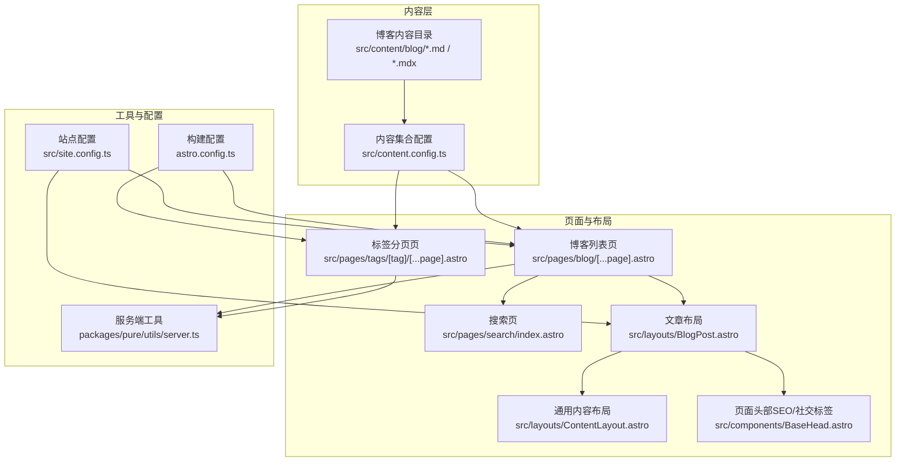
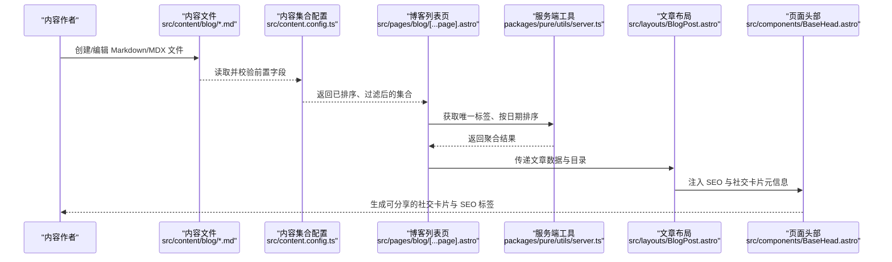
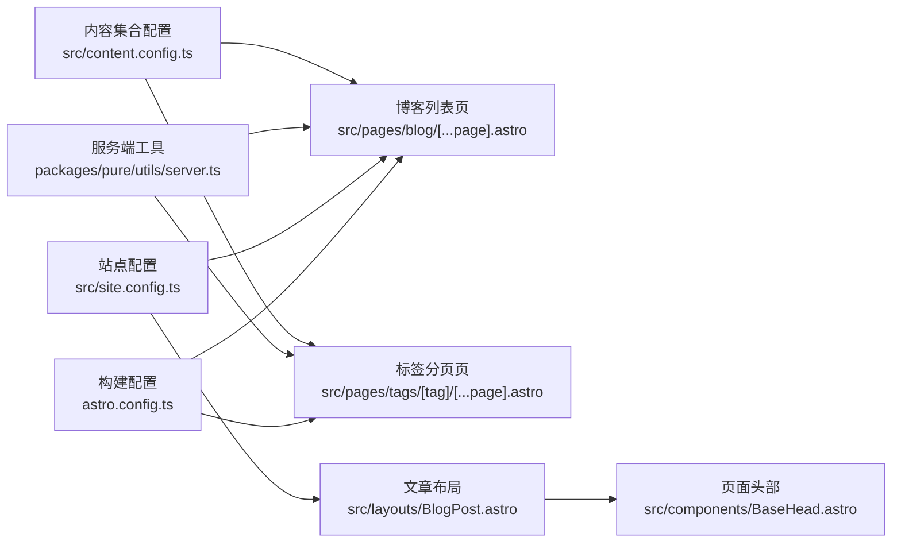

# 博客内容管理

<cite>
**本文引用的文件**
- [src/content.config.ts](file://src/content.config.ts)
- [src/site.config.ts](file://src/site.config.ts)
- [src/layouts/BlogPost.astro](file://src/layouts/BlogPost.astro)
- [src/layouts/ContentLayout.astro](file://src/layouts/ContentLayout.astro)
- [src/pages/blog/[...page].astro](file://src/pages/blog/[...page].astro)
- [src/pages/tags/[tag]/[...page].astro](file://src/pages/tags/[tag]/[...page].astro)
- [src/pages/search/index.astro](file://src/pages/search/index.astro)
- [packages/pure/utils/server.ts](file://packages/pure/utils/server.ts)
- [packages/pure/utils/date.ts](file://packages/pure/utils/date.ts)
- [src/components/BaseHead.astro](file://src/components/BaseHead.astro)
- [astro.config.ts](file://astro.config.ts)
- [src/content/blog/2025-08-24-miniforge-替代conda的Python环境和包管理工具.md](file://src/content/blog/2025-08-24-miniforge-替代conda的Python环境和包管理工具.md)
</cite>

## 目录
1. [简介](#简介)
2. [项目结构](#项目结构)
3. [核心组件](#核心组件)
4. [架构总览](#架构总览)
5. [详细组件分析](#详细组件分析)
6. [依赖关系分析](#依赖关系分析)
7. [性能考量](#性能考量)
8. [故障排查指南](#故障排查指南)
9. [结论](#结论)
10. [附录](#附录)

## 简介
本文件面向内容作者与维护者，系统性阐述该博客内容管理方案：从内容文件组织、前置字段定义与元数据管理，到路由生成、分类与标签体系、搜索与索引、以及创作与发布工作流。文档以仓库现有实现为依据，结合页面与布局组件、内容集合配置与站点配置，帮助读者高效地创建、维护与优化博客内容。

## 项目结构
博客内容主要位于 src/content/blog 下，采用“日期+标题”的命名规范；页面与布局位于 src/pages 与 src/layouts；内容集合与站点配置分别在 src/content.config.ts 与 src/site.config.ts 中定义；SEO 与社交卡片由 src/components/BaseHead.astro 输出；分页、标签与搜索由 packages/pure/utils/server.ts 与 src/pages 提供支持；构建与适配器在 astro.config.ts 中配置。

图表来源
- [src/content.config.ts](file://src/content.config.ts#L1-L77)
- [src/pages/blog/[...page].astro](file://src/pages/blog/[...page].astro#L1-L111)
- [src/pages/tags/[tag]/[...page].astro](file://src/pages/tags/[tag]/[...page].astro#L1-L73)
- [src/pages/search/index.astro](file://src/pages/search/index.astro#L1-L34)
- [src/layouts/BlogPost.astro](file://src/layouts/BlogPost.astro#L1-L75)
- [src/layouts/ContentLayout.astro](file://src/layouts/ContentLayout.astro#L1-L156)
- [src/components/BaseHead.astro](file://src/components/BaseHead.astro#L1-L99)
- [packages/pure/utils/server.ts](file://packages/pure/utils/server.ts#L1-L67)
- [astro.config.ts](file://astro.config.ts#L1-L133)

章节来源
- [src/content.config.ts](file://src/content.config.ts#L1-L77)
- [src/pages/blog/[...page].astro](file://src/pages/blog/[...page].astro#L1-L111)
- [src/pages/tags/[tag]/[...page].astro](file://src/pages/tags/[tag]/[...page].astro#L1-L73)
- [src/pages/search/index.astro](file://src/pages/search/index.astro#L1-L34)
- [src/layouts/BlogPost.astro](file://src/layouts/BlogPost.astro#L1-L75)
- [src/layouts/ContentLayout.astro](file://src/layouts/ContentLayout.astro#L1-L156)
- [src/components/BaseHead.astro](file://src/components/BaseHead.astro#L1-L99)
- [packages/pure/utils/server.ts](file://packages/pure/utils/server.ts#L1-L67)
- [astro.config.ts](file://astro.config.ts#L1-L133)

## 核心组件
- 内容集合与前置字段校验：通过 Astro Content Collections 在 src/content.config.ts 中定义博客集合，限定标题、描述、发布时间、可选更新时间、英雄图、标签、语言、草稿、评论等字段，并对标签进行去重与小写化处理。
- 页面与布局：博客列表页与标签页负责分页与侧边栏展示；文章布局负责输出 SEO 元信息、社交卡片、目录与评论集成；通用内容布局提供侧边栏、回到顶部与移动端交互。
- 工具函数：服务端工具提供集合过滤（草稿按环境策略）、按年份分组、按日期排序、标签聚合与计数等能力。
- 站点配置：主题与集成配置决定默认语言、社交卡片、博客分页大小、分享平台、评论系统、字体与排版等。
- 构建与适配器：astro.config.ts 指定站点域名、输出模式、适配器、Markdown 渲染插件、代码高亮与数学公式支持。

章节来源
- [src/content.config.ts](file://src/content.config.ts#L11-L41)
- [src/pages/blog/[...page].astro](file://src/pages/blog/[...page].astro#L13-L21)
- [src/pages/tags/[tag]/[...page].astro](file://src/pages/tags/[tag]/[...page].astro#L13-L25)
- [src/layouts/BlogPost.astro](file://src/layouts/BlogPost.astro#L21-L45)
- [src/layouts/ContentLayout.astro](file://src/layouts/ContentLayout.astro#L18-L75)
- [packages/pure/utils/server.ts](file://packages/pure/utils/server.ts#L8-L66)
- [src/site.config.ts](file://src/site.config.ts#L16-L98)
- [astro.config.ts](file://astro.config.ts#L26-L104)

## 架构总览
下图展示了从内容文件到页面渲染的关键路径：内容集合加载与校验 → 页面静态生成 → SEO/社交标签注入 → 文章布局与评论集成。

图表来源
- [src/content.config.ts](file://src/content.config.ts#L12-L41)
- [src/pages/blog/[...page].astro](file://src/pages/blog/[...page].astro#L13-L21)
- [packages/pure/utils/server.ts](file://packages/pure/utils/server.ts#L8-L46)
- [src/layouts/BlogPost.astro](file://src/layouts/BlogPost.astro#L21-L45)
- [src/components/BaseHead.astro](file://src/components/BaseHead.astro#L10-L15)

## 详细组件分析

### 内容集合与前置字段定义
- 支持 Markdown 与 MDX 文件，统一加载于 src/content/blog 目录。
- 必填字段：title（≤60字符）、description（≤160字符）、publishDate（强制解析为日期）。
- 可选字段：updatedDate、heroImage（src、alt、inferSize、width、height、color）、language、draft（默认 false）、comment（默认 true）。
- 标签：数组，默认空，经 transform 去重并转为小写。
- 文档与 SOP 集合另有字段（如 docs 的 order），但博客集合不包含这些扩展字段。

章节来源
- [src/content.config.ts](file://src/content.config.ts#L12-L41)

### 博客文章的元数据与SEO
- 文章布局从文章数据提取 description、heroImage、publishDate、title、updatedDate、draft、comment，并据此计算社交图片与文章日期。
- 页面头部组件根据传入的 meta（title、description、articleDate、ogImage）生成 Open Graph 与 Twitter 卡片，自动设置站点标题分隔符、作者、站点语言、社交卡片尺寸与 RSS 自动发现链接。
- 社交卡片优先使用文章 heroImage，否则回退至站点配置的 socialCard。

章节来源
- [src/layouts/BlogPost.astro](file://src/layouts/BlogPost.astro#L21-L45)
- [src/components/BaseHead.astro](file://src/components/BaseHead.astro#L10-L78)

### 路由生成与URL结构
- 博客列表页：动态路由 [...page].astro，按配置的每页数量分页，支持上一页/下一页导航。
- 标签页：动态路由 [tag]/[...page].astro，先按日期排序所有文章，再按标签过滤，最后分页。
- 归档页：在博客列表页中提供“按年份查看全部”的入口。
- 搜索页：动态路由 /search/index.astro，启用后显示搜索输入与结果。

章节来源
- [src/pages/blog/[...page].astro](file://src/pages/blog/[...page].astro#L13-L21)
- [src/pages/tags/[tag]/[...page].astro](file://src/pages/tags/[tag]/[...page].astro#L13-L25)
- [src/pages/search/index.astro](file://src/pages/search/index.astro#L1-L34)

### 分类与标签系统
- 标签聚合：提供 getAllTags、getUniqueTags、getUniqueTagsWithCount 三个工具函数，分别用于提取全部标签、去重与统计计数。
- 列表页侧边栏：仅展示前 50 个高频标签，点击进入对应标签分页页。
- 标签页：按标签过滤文章并分页，页头显示当前标签。

章节来源
- [packages/pure/utils/server.ts](file://packages/pure/utils/server.ts#L49-L66)
- [src/pages/blog/[...page].astro](file://src/pages/blog/[...page].astro#L83-L105)
- [src/pages/tags/[tag]/[...page].astro](file://src/pages/tags/[tag]/[...page].astro#L13-L25)

### 搜索与索引
- 启用 pagefind：站点配置中开启 integ.pagefind，搜索页渲染 PFSearch 组件。
- 搜索入口：/search，支持输入关键词检索全站博客内容。
- 注意：prerender 开启时需确保 pagefind 与预渲染兼容。

章节来源
- [src/site.config.ts](file://src/site.config.ts#L124-L124)
- [src/pages/search/index.astro](file://src/pages/search/index.astro#L22-L30)

### 内容创作与发布工作流
- 文件命名：建议采用“YYYY-MM-DD-标题”的形式，便于排序与归档。
- 前置字段：在 Markdown 头部填写 title、description、publishDate、tags 等；如需社交卡片与评论，保持 heroImage 与 comment 默认值或显式配置。
- 发布策略：草稿 draft 仅在非生产环境生效；生产环境会隐藏草稿文章。
- 预览与验证：本地启动后检查 SEO 元信息与社交卡片是否正确生成；确认分页、标签与搜索功能正常。

章节来源
- [src/content.config.ts](file://src/content.config.ts#L19-L39)
- [packages/pure/utils/server.ts](file://packages/pure/utils/server.ts#L8-L13)
- [src/content/blog/2025-08-24-miniforge-替代conda的Python环境和包管理工具.md](file://src/content/blog/2025-08-24-miniforge-替代conda的Python环境和包管理工具.md#L1-L9)

### 文章布局与交互
- 文章布局：接收文章集合与目录，注入社交卡片与文章日期，支持目录侧边栏、版权信息、相关文章推荐与评论模块。
- 通用内容布局：提供侧边栏、回到顶部、移动端侧边栏切换动画与样式。
- MediumZoom：可选缩放增强，按配置启用。

章节来源
- [src/layouts/BlogPost.astro](file://src/layouts/BlogPost.astro#L47-L75)
- [src/layouts/ContentLayout.astro](file://src/layouts/ContentLayout.astro#L18-L75)

### 日期格式化与本地化
- 使用站点配置中的 locale.dateLocale 与 dateOptions 对日期进行本地化格式化，确保文章日期在不同地区显示一致。

章节来源
- [packages/pure/utils/date.ts](file://packages/pure/utils/date.ts#L3-L17)
- [src/site.config.ts](file://src/site.config.ts#L16-L26)

### 构建与适配器
- 站点域名与输出：配置站点 URL、输出模式为 server、适配器为 Vercel。
- Markdown 渲染：启用数学公式与 KaTeX、标题锚点、自动链接标题等插件。
- 代码高亮：自定义 Transformer 实现标题、复制按钮、折叠与语言标识。
- 字体与实验特性：启用字体预加载与 SVGO、字体优化等实验特性。

章节来源
- [astro.config.ts](file://astro.config.ts#L26-L133)

## 依赖关系分析
- 内容集合配置依赖 Astro Content Collections 的 schema 校验与 image 类型。
- 页面依赖服务端工具函数进行集合过滤、排序与标签聚合。
- 布局依赖站点配置中的主题与集成参数，以及 BaseHead 的 SEO 元信息。
- 构建配置影响 Markdown 渲染、代码高亮与适配器部署。

图表来源
- [src/content.config.ts](file://src/content.config.ts#L1-L77)
- [src/pages/blog/[...page].astro](file://src/pages/blog/[...page].astro#L1-L111)
- [src/pages/tags/[tag]/[...page].astro](file://src/pages/tags/[tag]/[...page].astro#L1-L73)
- [packages/pure/utils/server.ts](file://packages/pure/utils/server.ts#L1-L67)
- [src/layouts/BlogPost.astro](file://src/layouts/BlogPost.astro#L1-L75)
- [src/components/BaseHead.astro](file://src/components/BaseHead.astro#L1-L99)
- [src/site.config.ts](file://src/site.config.ts#L1-L207)
- [astro.config.ts](file://astro.config.ts#L1-L133)

## 性能考量
- 预渲染与分页：博客列表与标签页均使用分页，减少单页渲染压力；prerender 开启时需确保 pagefind 与静态生成兼容。
- 图像服务：通过 Sharp 服务与响应式样式优化图片加载体验。
- 字体与资源：启用字体预加载与 SVGO 优化，降低首屏阻塞与资源体积。
- 代码高亮：自定义 Transformer 控制高亮复杂度与交互成本。

章节来源
- [src/site.config.ts](file://src/site.config.ts#L34-L34)
- [astro.config.ts](file://astro.config.ts#L45-L50)
- [astro.config.ts](file://astro.config.ts#L112-L113)
- [astro.config.ts](file://astro.config.ts#L68-L95)

## 故障排查指南
- 草稿未显示：确认当前环境变量是否为生产；生产环境会隐藏 draft=true 的文章。
- 标签不显示：检查标签数组是否为空或大小写混杂；系统会对标签进行去重与小写化处理。
- 社交卡片缺失：若未设置 heroImage，将回退到站点 socialCard；请确保 socialCard 路径有效。
- 搜索不可用：确认站点配置中已开启 integ.pagefind，且搜索页正常渲染 PFSearch 组件。
- 日期显示异常：检查站点配置 locale.dateLocale 与 dateOptions 是否符合预期。

章节来源
- [packages/pure/utils/server.ts](file://packages/pure/utils/server.ts#L8-L13)
- [src/content.config.ts](file://src/content.config.ts#L35-L35)
- [src/layouts/BlogPost.astro](file://src/layouts/BlogPost.astro#L38-L42)
- [src/site.config.ts](file://src/site.config.ts#L124-L124)
- [src/site.config.ts](file://src/site.config.ts#L16-L26)

## 结论
该博客内容管理方案以 Astro Content Collections 为核心，结合分页、标签聚合、SEO 与社交卡片、搜索索引与评论系统，形成完整的创作与发布闭环。通过明确的文件命名与前置字段规范、可配置的主题与集成参数，内容作者可以高效地组织与发布高质量博客内容。

## 附录

### 博客文章文件组织与命名规范
- 目录：src/content/blog
- 命名：YYYY-MM-DD-标题（示例见内容文件）
- 扩展：支持 .md 与 .mdx
- 前置字段：title、description、publishDate、updatedDate（可选）、heroImage（可选）、tags、language（可选）、draft（默认 false）、comment（默认 true）

章节来源
- [src/content.config.ts](file://src/content.config.ts#L12-L41)
- [src/content/blog/2025-08-24-miniforge-替代conda的Python环境和包管理工具.md](file://src/content/blog/2025-08-24-miniforge-替代conda的Python环境和包管理工具.md#L1-L9)

### 博客路由与URL设计
- 博客列表：/blog
- 标签分页：/tags/:tag
- 搜索：/search
- 归档：在博客列表页提供按年份跳转

章节来源
- [src/pages/blog/[...page].astro](file://src/pages/blog/[...page].astro#L31-L34)
- [src/pages/tags/[tag]/[...page].astro](file://src/pages/tags/[tag]/[...page].astro#L34-L37)
- [src/pages/search/index.astro](file://src/pages/search/index.astro#L7-L10)

### SEO与社交媒体分享配置
- Open Graph 与 Twitter 卡片：由 BaseHead 统一注入，支持文章类型、作者、发布时间、社交图片与站点语言。
- 社交卡片：优先使用文章 heroImage，否则回退站点 socialCard。
- RSS：自动发现链接指向 /rss.xml

章节来源
- [src/components/BaseHead.astro](file://src/components/BaseHead.astro#L50-L85)
- [src/layouts/BlogPost.astro](file://src/layouts/BlogPost.astro#L38-L42)
- [src/site.config.ts](file://src/site.config.ts#L13-L14)

### 博客分类与标签系统实现机制
- 聚合：getAllTags → getUniqueTags → getUniqueTagsWithCount
- 展示：列表页侧边栏展示前 50 个标签；标签页按标签过滤并分页
- 排序：按 updatedDate 或 publishDate 降序排列

章节来源
- [packages/pure/utils/server.ts](file://packages/pure/utils/server.ts#L49-L66)
- [src/pages/blog/[...page].astro](file://src/pages/blog/[...page].astro#L83-L105)
- [src/pages/tags/[tag]/[...page].astro](file://src/pages/tags/[tag]/[...page].astro#L13-L25)

### 搜索与索引功能
- pagefind：站点配置开启后，搜索页渲染 PFSearch 组件
- 输入：关键词或短语
- 结果：基于 pagefind 索引的全文检索

章节来源
- [src/site.config.ts](file://src/site.config.ts#L124-L124)
- [src/pages/search/index.astro](file://src/pages/search/index.astro#L22-L30)

### 内容作者最佳实践
- 前置字段：严格控制 title 与 description 长度；合理填写 publishDate 与 updatedDate；为重要文章设置 heroImage 与 color 以提升社交卡片视觉效果。
- 标签：避免重复与大小写不一致；优先使用高频标签，保持标签粒度清晰。
- 草稿：开发阶段可使用 draft=false 辅助预览，上线前确保发布状态正确。
- SEO：关注社交卡片尺寸与站点语言配置；定期检查 RSS 与 sitemap 链接有效性。

章节来源
- [src/content.config.ts](file://src/content.config.ts#L19-L39)
- [src/layouts/BlogPost.astro](file://src/layouts/BlogPost.astro#L38-L42)
- [src/site.config.ts](file://src/site.config.ts#L16-L26)