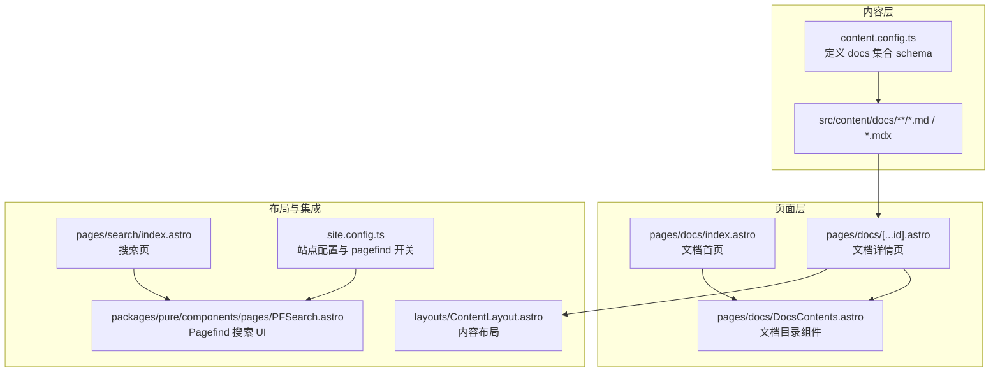
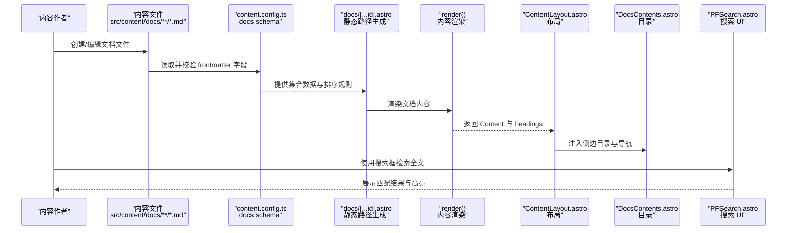
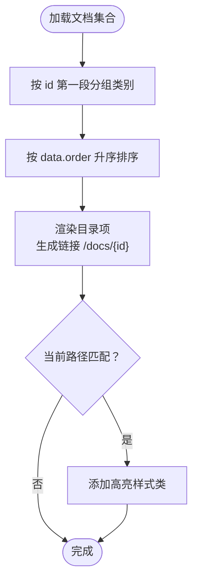
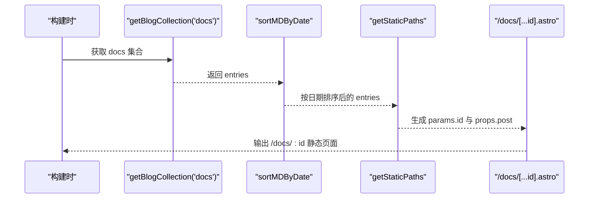
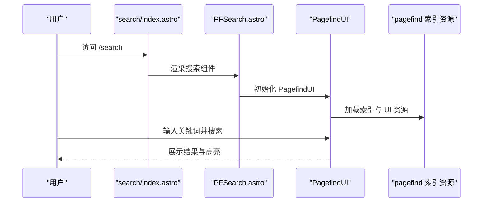
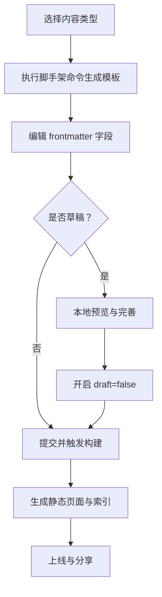
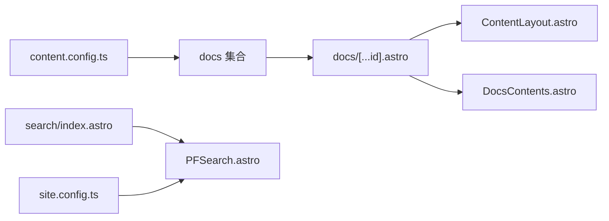

# 文档内容管理

<cite>
**本文引用的文件**
- [content.config.ts](file://src/content.config.ts)
- [site.config.ts](file://src/site.config.ts)
- [DocsContents.astro](file://src/pages/docs/DocsContents.astro)
- [docs/index.astro](file://src/pages/docs/index.astro)
- [docs/[...id].astro](file://src/pages/docs/[...id].astro)
- [ContentLayout.astro](file://src/layouts/ContentLayout.astro)
- [search/index.astro](file://src/pages/search/index.astro)
- [PFSearch.astro](file://packages/pure/components/pages/PFSearch.astro)
- [new.mjs](file://packages/pure/scripts/new.mjs)
</cite>

## 目录
1. [简介](#简介)
2. [项目结构](#项目结构)
3. [核心组件](#核心组件)
4. [架构总览](#架构总览)
5. [组件详解](#组件详解)
6. [依赖关系分析](#依赖关系分析)
7. [性能考量](#性能考量)
8. [故障排查指南](#故障排查指南)
9. [结论](#结论)
10. [附录](#附录)

## 简介
本文件面向内容作者与维护者，系统化阐述该 Astro 主题项目中的“文档内容管理”体系。内容涵盖：
- 文档集合的组织与命名规范、目录层级设计
- 前置字段（frontmatter）配置与作用说明（title、description、publishDate、updatedDate、tags、draft、order 等）
- 文档排序机制与导航生成规则
- 文档页面路由生成与 URL 结构设计
- 内容创建与维护工作流程
- 分类、标签系统与内容索引
- 搜索功能与全文索引机制
- 编写最佳实践与格式规范

## 项目结构
该项目采用 Astro 的内容集合（Content Collections）与页面路由相结合的方式组织文档内容。核心结构如下：
- 内容来源：src/content/docs 下存放文档内容，按主题或模块分层组织
- 页面路由：src/pages/docs 下定义文档列表页、详情页与导航组件
- 配置中心：src/content.config.ts 定义文档集合 schema；src/site.config.ts 提供站点级配置与集成开关
- 搜索与布局：packages/pure/components/pages/PFSearch.astro 提供搜索 UI；ContentLayout.astro 提供通用内容布局

图表来源
- [content.config.ts](file://src/content.config.ts#L44-L57)
- [docs/index.astro](file://src/pages/docs/index.astro#L1-L40)
- [docs/[...id].astro](file://src/pages/docs/[...id].astro#L1-L98)
- [DocsContents.astro](file://src/pages/docs/DocsContents.astro#L1-L105)
- [ContentLayout.astro](file://src/layouts/ContentLayout.astro#L1-L156)
- [search/index.astro](file://src/pages/search/index.astro#L1-L34)
- [PFSearch.astro](file://packages/pure/components/pages/PFSearch.astro#L1-L70)
- [site.config.ts](file://src/site.config.ts#L123-L124)

章节来源
- [content.config.ts](file://src/content.config.ts#L44-L57)
- [docs/index.astro](file://src/pages/docs/index.astro#L1-L40)
- [docs/[...id].astro](file://src/pages/docs/[...id].astro#L1-L98)
- [DocsContents.astro](file://src/pages/docs/DocsContents.astro#L1-L105)
- [ContentLayout.astro](file://src/layouts/ContentLayout.astro#L1-L156)
- [search/index.astro](file://src/pages/search/index.astro#L1-L34)
- [PFSearch.astro](file://packages/pure/components/pages/PFSearch.astro#L1-L70)
- [site.config.ts](file://src/site.config.ts#L123-L124)

## 核心组件
- 文档集合 schema（docs）：定义标题、描述、发布时间、更新时间、标签、草稿状态、排序权重等字段，确保内容一致性与可检索性
- 文档详情页路由：基于动态路由参数 id，支持预渲染与静态路径生成
- 文档目录组件：按类别分组展示文档，依据 order 字段排序
- 搜索组件：基于 Pagefind 的全文搜索 UI，支持结果高亮与子结果展示
- 内容布局：提供侧边栏、目录、返回按钮等通用交互

章节来源
- [content.config.ts](file://src/content.config.ts#L44-L57)
- [docs/[...id].astro](file://src/pages/docs/[...id].astro#L14-L20)
- [DocsContents.astro](file://src/pages/docs/DocsContents.astro#L21-L25)
- [PFSearch.astro](file://packages/pure/components/pages/PFSearch.astro#L19-L52)
- [ContentLayout.astro](file://src/layouts/ContentLayout.astro#L18-L75)

## 架构总览
文档内容从内容源到页面渲染的关键流程如下：

图表来源
- [content.config.ts](file://src/content.config.ts#L44-L57)
- [docs/[...id].astro](file://src/pages/docs/[...id].astro#L14-L28)
- [ContentLayout.astro](file://src/layouts/ContentLayout.astro#L18-L75)
- [DocsContents.astro](file://src/pages/docs/DocsContents.astro#L35-L57)
- [PFSearch.astro](file://packages/pure/components/pages/PFSearch.astro#L19-L52)

## 组件详解

### 文档集合与前置字段配置
- 集合名称：docs
- 关键字段与约束：
  - title：字符串，最大长度限制
  - description：字符串，最大长度限制
  - publishDate：日期类型（可选）
  - updatedDate：日期类型（可选）
  - tags：字符串数组，默认空数组，统一转小写并去重
  - draft：布尔值，默认 false
  - order：数字，默认 999，用于排序
- 其他特殊字段：
  - comment：布尔值，默认 true（仅 blog/process 集合存在）

字段作用与使用建议：
- title/description：SEO 与社交卡片元信息来源
- publishDate/updatedDate：内容时效性与排序依据
- tags：内容分类与索引关键词，建议统一大小写与语义化
- draft：发布前草稿标记，避免提前渲染
- order：同分类内排序权重，数值越小越靠前

章节来源
- [content.config.ts](file://src/content.config.ts#L44-L57)
- [content.config.ts](file://src/content.config.ts#L35-L37)

### 文档排序机制与导航生成
- 排序依据：文档集合 entries 按 data.order 升序排列
- 导航生成：目录组件按固定类别映射（如 setup、integrations、advanced）分组展示
- 路由高亮：当前文档项通过样式类进行高亮标识

图表来源
- [DocsContents.astro](file://src/pages/docs/DocsContents.astro#L13-L57)

章节来源
- [DocsContents.astro](file://src/pages/docs/DocsContents.astro#L21-L25)
- [DocsContents.astro](file://src/pages/docs/DocsContents.astro#L44-L51)

### 文档页面路由与 URL 结构
- 列表页：/docs
- 详情页：/docs/:id
- 静态路径生成：通过 getStaticPaths 基于集合 entries 生成所有 id 参数
- 预渲染：详情页启用预渲染以提升性能与 SEO

图表来源
- [docs/[...id].astro](file://src/pages/docs/[...id].astro#L14-L20)

章节来源
- [docs/index.astro](file://src/pages/docs/index.astro#L1-L40)
- [docs/[...id].astro](file://src/pages/docs/[...id].astro#L12-L20)

### 搜索功能与全文索引
- 搜索集成：通过 site.config.ts 中的 pagefind 开关启用
- 搜索 UI：PFSearch.astro 组件按开发/生产模式动态加载 Pagefind UI
- 结果处理：对结果 URL 进行格式化，移除尾随斜杠与锚点
- 基础路径：根据 BASE_URL 自动拼接 pagefind 资源路径

图表来源
- [search/index.astro](file://src/pages/search/index.astro#L22-L30)
- [PFSearch.astro](file://packages/pure/components/pages/PFSearch.astro#L19-L52)
- [site.config.ts](file://src/site.config.ts#L123-L124)

章节来源
- [search/index.astro](file://src/pages/search/index.astro#L1-L34)
- [PFSearch.astro](file://packages/pure/components/pages/PFSearch.astro#L1-L70)
- [site.config.ts](file://src/site.config.ts#L123-L124)

### 内容创建与维护工作流程
- 创建新文档：使用脚手架命令生成带 frontmatter 的文档模板
- 编写规范：遵循 schema 字段要求，设置 title、description、tags、draft、order 等
- 发布流程：草稿 draft=false 后提交，触发预渲染与索引更新
- 维护更新：更新 updatedDate 与 tags，必要时调整 order 以调整展示顺序

章节来源
- [new.mjs](file://packages/pure/scripts/new.mjs#L60-L130)

### 分类、标签系统与内容索引
- 分类：通过目录组件按 id 第一段进行分组（如 setup、integrations、advanced）
- 标签：frontmatter 中的 tags 数组参与索引与过滤
- 内容索引：Pagefind 基于构建产物生成索引，支持多语言与子结果展示

章节来源
- [DocsContents.astro](file://src/pages/docs/DocsContents.astro#L13-L25)
- [content.config.ts](file://src/content.config.ts#L52-L53)
- [PFSearch.astro](file://packages/pure/components/pages/PFSearch.astro#L32-L47)

## 依赖关系分析
- 文档集合依赖 content.config.ts 的 schema 定义
- 文档详情页依赖 getBlogCollection 与 sortMDByDate 实现静态路径生成与内容渲染
- 目录组件依赖文档集合与 order 字段进行排序与高亮
- 搜索功能依赖 site.config.ts 的 pagefind 开关与 PFSearch.astro 的资源加载

图表来源
- [content.config.ts](file://src/content.config.ts#L44-L57)
- [docs/[...id].astro](file://src/pages/docs/[...id].astro#L1-L98)
- [ContentLayout.astro](file://src/layouts/ContentLayout.astro#L1-L156)
- [DocsContents.astro](file://src/pages/docs/DocsContents.astro#L1-L105)
- [search/index.astro](file://src/pages/search/index.astro#L1-L34)
- [PFSearch.astro](file://packages/pure/components/pages/PFSearch.astro#L1-L70)
- [site.config.ts](file://src/site.config.ts#L123-L124)

章节来源
- [content.config.ts](file://src/content.config.ts#L44-L57)
- [docs/[...id].astro](file://src/pages/docs/[...id].astro#L1-L98)
- [DocsContents.astro](file://src/pages/docs/DocsContents.astro#L1-L105)
- [search/index.astro](file://src/pages/search/index.astro#L1-L34)
- [PFSearch.astro](file://packages/pure/components/pages/PFSearch.astro#L1-L70)
- [site.config.ts](file://src/site.config.ts#L123-L124)

## 性能考量
- 预渲染：文档详情页启用 prerender，减少运行时渲染开销
- 静态路径生成：通过 getStaticPaths 生成所有页面，利于缓存与 CDN 加速
- 搜索资源：Pagefind UI 按需懒加载，避免阻塞首屏
- 目录与布局：侧边栏与 TOC 在桌面端固定定位，减少滚动重排

## 故障排查指南
- 搜索不可用
  - 检查 site.config.ts 中 pagefind 是否启用
  - 确认构建产物中存在 pagefind 资源目录
- 文档未出现在目录
  - 检查 frontmatter 中 draft 是否为 true
  - 确认 order 字段是否合理
- 路由 404
  - 确认文档 id 是否符合预期（按目录层级与文件名生成）
  - 检查 getStaticPaths 是否正确生成 params.id
- 搜索结果异常
  - 确认 baseUrl 与 bundlePath 配置正确
  - 检查结果 URL 格式化逻辑是否生效

章节来源
- [site.config.ts](file://src/site.config.ts#L123-L124)
- [PFSearch.astro](file://packages/pure/components/pages/PFSearch.astro#L34-L47)
- [docs/[...id].astro](file://src/pages/docs/[...id].astro#L14-L20)
- [DocsContents.astro](file://src/pages/docs/DocsContents.astro#L44-L51)

## 结论
本项目通过 Astro 内容集合与页面路由的组合，实现了结构清晰、可扩展的文档内容管理体系。借助统一的 schema、排序与导航机制，以及 Pagefind 的全文搜索能力，内容作者可以高效地创建与维护文档，读者也能获得良好的浏览体验。

## 附录

### 最佳实践与格式规范
- 命名规范
  - 文件名使用短横线分隔的小写 slug，避免空格与特殊字符
  - 目录层级建议按主题或模块划分（如 setup、integrations、advanced）
- 前置字段
  - 必填：title、description
  - 时间：publishDate 与 updatedDate 建议及时更新
  - 分类：tags 使用语义化词汇，统一大小写
  - 发布：草稿 draft=true，发布后改为 false
  - 排序：order 数值越小越靠前
- 搜索优化
  - 合理设置 tags 与 description，提升搜索命中率
  - 避免过长标题与重复内容
- 路由与导航
  - 保持 id 与目录层级一致，便于导航与 SEO
  - 使用 DocsContents 组件统一展示导航，避免硬编码链接

章节来源
- [content.config.ts](file://src/content.config.ts#L44-L57)
- [DocsContents.astro](file://src/pages/docs/DocsContents.astro#L21-L25)
- [new.mjs](file://packages/pure/scripts/new.mjs#L36-L43)