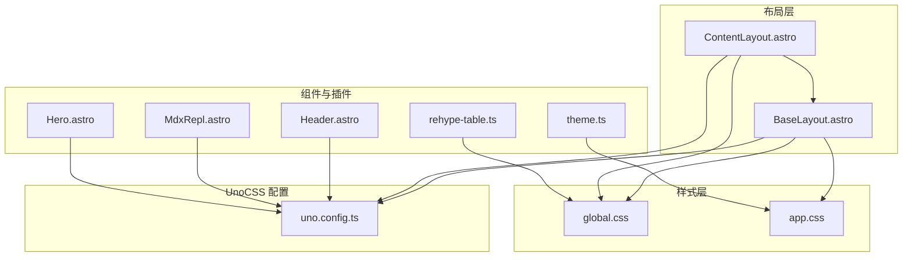
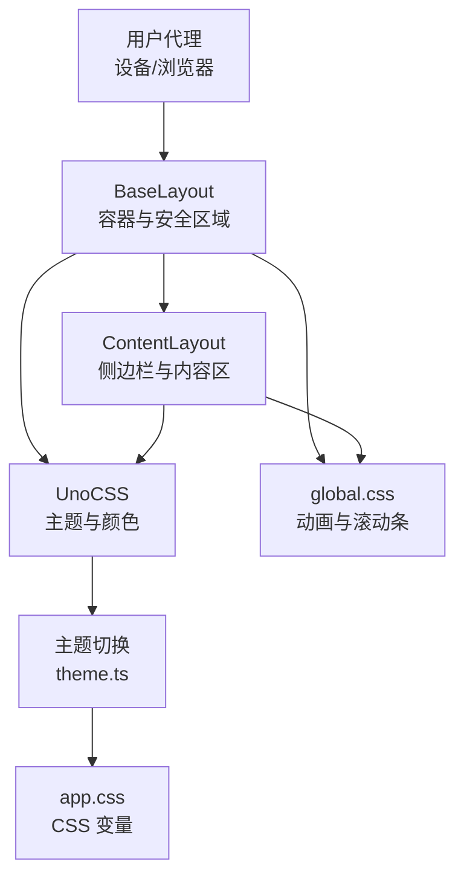
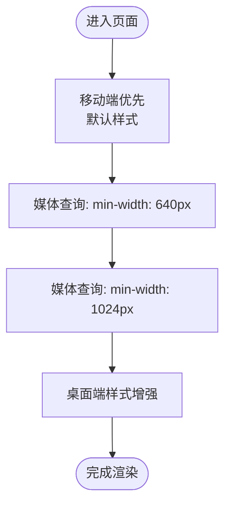
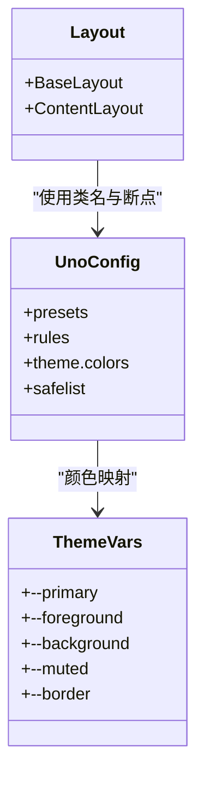
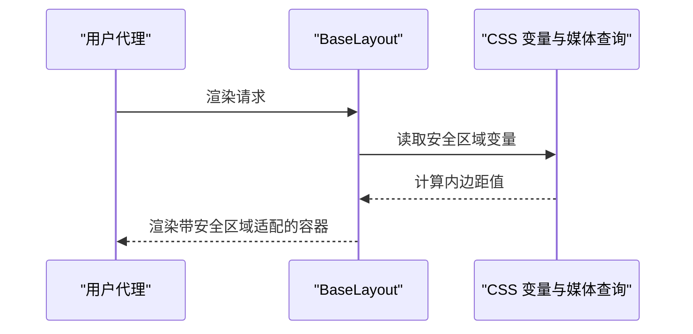
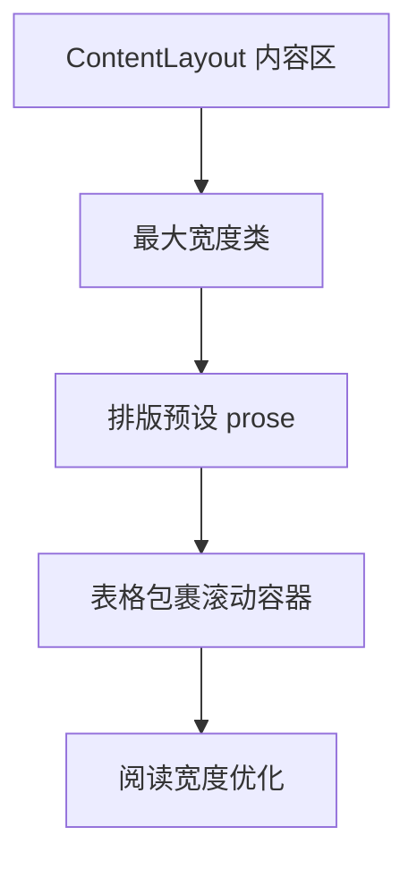
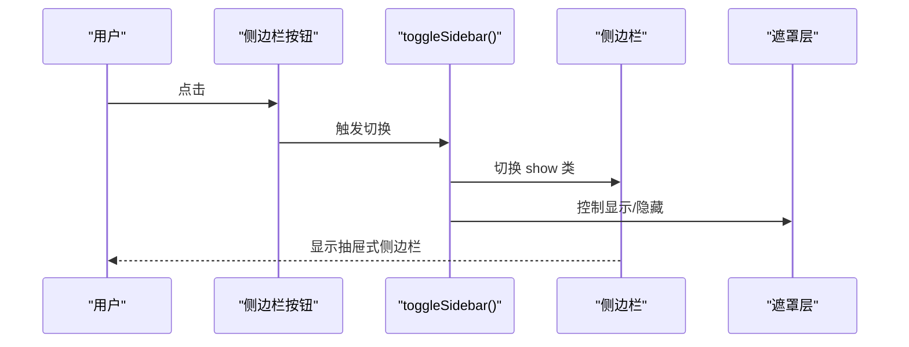
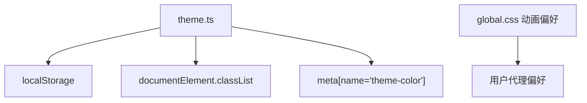
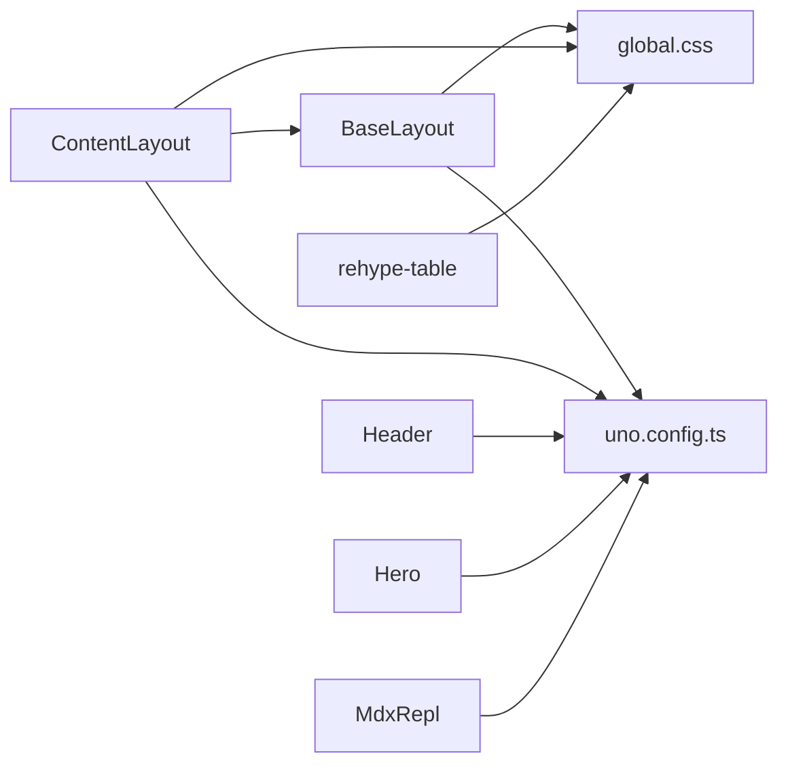

# 响应式设计实现

<cite>
**本文档引用的文件**
- [uno.config.ts](file://uno.config.ts)
- [BaseLayout.astro](file://src/layouts/BaseLayout.astro)
- [ContentLayout.astro](file://src/layouts/ContentLayout.astro)
- [global.css](file://src/assets/styles/global.css)
- [app.css](file://src/assets/styles/app.css)
- [site.config.ts](file://src/site.config.ts)
- [Header.astro](file://packages/pure/components/basic/Header.astro)
- [rehype-table.ts](file://packages/pure/plugins/rehype-table.ts)
- [MdxRepl.astro](file://packages/pure/components/user/MdxRepl.astro)
- [Hero.astro](file://packages/pure/components/pages/Hero.astro)
- [theme.ts](file://packages/pure/utils/theme.ts)
</cite>

## 目录
1. [简介](#简介)
2. [项目结构](#项目结构)
3. [核心组件](#核心组件)
4. [架构总览](#架构总览)
5. [详细组件分析](#详细组件分析)
6. [依赖关系分析](#依赖关系分析)
7. [性能考量](#性能考量)
8. [故障排查指南](#故障排查指南)
9. [结论](#结论)
10. [附录](#附录)

## 简介
本技术文档围绕该 Astro 项目的响应式设计实现进行系统化梳理，重点覆盖以下方面：
- 断点系统与移动端优先策略：基于 UnoCSS 主题变量与媒体查询的断点设计，以及在不同屏幕尺寸下的布局行为。
- UnoCSS 在布局中的应用与自定义断点配置：如何通过 UnoCSS 主题颜色与规则扩展实现一致的视觉与交互体验。
- 安全区域适配（safe-area-inset）：针对刘海屏、圆角屏等特殊设备的安全区域处理与跨设备兼容性。
- 容器宽度限制与最大内容宽度：通过容器类与内容区类实现的宽度约束与阅读宽度优化。
- 调试技巧与性能优化策略：结合媒体查询、动画偏好设置与滚动性能的优化建议。
- 移动端与桌面端最佳实践：从交互到视觉的用户体验优化建议。

## 项目结构
该项目采用 Astro + Pure 组件库的组合，响应式设计主要分布在布局层、样式层与 UnoCSS 配置层：
- 布局层：BaseLayout 作为根布局，ContentLayout 作为内容页布局，统一承载容器宽度与安全区域适配。
- 样式层：全局样式与主题样式分别定义动画、滚动条、代码块等通用样式，并通过 CSS 变量与 UnoCSS 主题联动。
- UnoCSS 层：通过主题颜色、规则扩展与预设，提供一致的断点与间距体系。

**图表来源**
- [BaseLayout.astro](file://src/layouts/BaseLayout.astro#L1-L92)
- [ContentLayout.astro](file://src/layouts/ContentLayout.astro#L1-L156)
- [global.css](file://src/assets/styles/global.css#L1-L287)
- [app.css](file://src/assets/styles/app.css#L1-L49)
- [uno.config.ts](file://uno.config.ts#L1-L193)
- [Header.astro](file://packages/pure/components/basic/Header.astro#L119-L164)
- [rehype-table.ts](file://packages/pure/plugins/rehype-table.ts#L1-L37)
- [MdxRepl.astro](file://packages/pure/components/user/MdxRepl.astro#L1-L48)
- [Hero.astro](file://packages/pure/components/pages/Hero.astro#L105-L146)
- [theme.ts](file://packages/pure/utils/theme.ts#L1-L40)

**章节来源**
- [BaseLayout.astro](file://src/layouts/BaseLayout.astro#L1-L92)
- [ContentLayout.astro](file://src/layouts/ContentLayout.astro#L1-L156)
- [global.css](file://src/assets/styles/global.css#L1-L287)
- [app.css](file://src/assets/styles/app.css#L1-L49)
- [uno.config.ts](file://uno.config.ts#L1-L193)

## 核心组件
- 布局容器与安全区域适配：BaseLayout 提供主容器与安全区域内边距的动态计算，配合媒体查询在不同断点下调整左右内边距。
- 内容布局与侧边栏响应：ContentLayout 在桌面端使用固定/粘性侧边栏，在移动端使用抽屉式侧边栏并配合遮罩层与动画。
- UnoCSS 主题与颜色体系：通过主题变量与颜色映射，确保断点、间距与色彩在各组件中保持一致。
- 全局样式与动画偏好：global.css 中的动画与滚动条样式，以及对“减少动画”的媒体查询支持，提升可访问性与性能。
- 表格与内容宽度：rehype-table 插件自动为内容区表格添加横向滚动容器，ContentLayout 的内容区使用最大宽度类以优化阅读宽度。

**章节来源**
- [BaseLayout.astro](file://src/layouts/BaseLayout.astro#L40-L91)
- [ContentLayout.astro](file://src/layouts/ContentLayout.astro#L18-L75)
- [uno.config.ts](file://uno.config.ts#L127-L192)
- [global.css](file://src/assets/styles/global.css#L1-L287)
- [rehype-table.ts](file://packages/pure/plugins/rehype-table.ts#L1-L37)

## 架构总览
响应式架构由三层协同构成：
- 布局层负责容器宽度与安全区域适配；
- UnoCSS 层提供断点与颜色体系；
- 样式层通过 CSS 变量与媒体查询实现细节优化。

**图表来源**
- [BaseLayout.astro](file://src/layouts/BaseLayout.astro#L40-L91)
- [ContentLayout.astro](file://src/layouts/ContentLayout.astro#L18-L75)
- [uno.config.ts](file://uno.config.ts#L127-L192)
- [global.css](file://src/assets/styles/global.css#L1-L287)
- [app.css](file://src/assets/styles/app.css#L1-L49)
- [theme.ts](file://packages/pure/utils/theme.ts#L1-L40)

## 详细组件分析

### 断点系统与移动端优先策略
- 设计原则
  - 移动端优先：默认样式面向小屏设备，通过媒体查询逐步增强至大屏。
  - 基于 UnoCSS 主题变量：颜色、边框、圆角等通过 CSS 变量与 UnoCSS 主题联动，保证一致性。
- 关键实现
  - 布局容器宽度：BaseLayout 的主容器设置了最大宽度，内容在大屏上居中显示。
  - 侧边栏断点：ContentLayout 在桌面端使用固定/粘性定位，在移动端使用抽屉式侧边栏。
  - 头部断点：Header 在较大屏幕下增加外边距，移动端优化折叠菜单与展开动画。
- 自定义断点
  - UnoCSS 未显式定义自定义断点，但通过媒体查询与 UnoCSS 类名组合实现断点效果（如 md、max-md 等）。

**图表来源**
- [BaseLayout.astro](file://src/layouts/BaseLayout.astro#L72-L88)
- [ContentLayout.astro](file://src/layouts/ContentLayout.astro#L104-L155)
- [Header.astro](file://packages/pure/components/basic/Header.astro#L136-L140)

**章节来源**
- [BaseLayout.astro](file://src/layouts/BaseLayout.astro#L40-L91)
- [ContentLayout.astro](file://src/layouts/ContentLayout.astro#L18-L75)
- [Header.astro](file://packages/pure/components/basic/Header.astro#L119-L164)

### UnoCSS 在布局中的应用与自定义断点配置
- 主题颜色与变量
  - UnoCSS 将主题色映射为 HSL 变量，与全局 CSS 变量保持一致，确保组件间颜色一致性。
- 规则扩展
  - 自定义规则如 sr-only、object-cover、bg-cover 与行高限制等，提升可访问性与图片/背景展示质量。
- 预设与排版
  - 启用 Typography 预设，结合站点配置的排版风格（如块引风格、内联代码块风格），统一内容区视觉。
- 断点与间距
  - 通过 UnoCSS 类名（如 md、max-md）与媒体查询配合，实现断点切换与间距调整。

**图表来源**
- [uno.config.ts](file://uno.config.ts#L127-L192)
- [app.css](file://src/assets/styles/app.css#L1-L49)
- [BaseLayout.astro](file://src/layouts/BaseLayout.astro#L40-L91)
- [ContentLayout.astro](file://src/layouts/ContentLayout.astro#L18-L75)

**章节来源**
- [uno.config.ts](file://uno.config.ts#L1-L193)
- [app.css](file://src/assets/styles/app.css#L1-L49)

### 安全区域适配（safe-area-inset）实现原理与跨设备兼容性
- 实现原理
  - 通过 CSS 变量与 env(safe-area-inset-*) 动态计算容器内边距，顶部与左右侧边距根据断点进行差异化处理。
- 跨设备兼容性
  - 在不同断点下调整左右内边距，确保内容不被系统 UI（如刘海、圆角、手势区域）遮挡。
  - 结合全局样式与布局容器，保证在各种设备上的可读性与可用性。

**图表来源**
- [BaseLayout.astro](file://src/layouts/BaseLayout.astro#L72-L88)

**章节来源**
- [BaseLayout.astro](file://src/layouts/BaseLayout.astro#L72-L88)

### 容器宽度限制与最大内容宽度实现机制
- 容器宽度限制
  - BaseLayout 的主容器设置最大宽度并在大屏上居中显示，避免内容在超宽屏幕上过度拉伸。
- 最大内容宽度
  - ContentLayout 的内容区使用最大宽度类，结合排版预设，确保文本在阅读宽度范围内呈现，提升可读性。
- 表格与内容区
  - rehype-table 插件为内容区表格包裹横向滚动容器，避免表格溢出影响整体布局。

**图表来源**
- [ContentLayout.astro](file://src/layouts/ContentLayout.astro#L43-L51)
- [rehype-table.ts](file://packages/pure/plugins/rehype-table.ts#L20-L31)

**章节来源**
- [BaseLayout.astro](file://src/layouts/BaseLayout.astro#L40-L49)
- [ContentLayout.astro](file://src/layouts/ContentLayout.astro#L43-L51)
- [rehype-table.ts](file://packages/pure/plugins/rehype-table.ts#L1-L37)

### 侧边栏与移动端抽屉式交互
- 桌面端
  - 固定/粘性定位，高度随视口变化，提供稳定的导航与目录浏览体验。
- 移动端
  - 抽屉式侧边栏，通过遮罩层与动画实现滑入/滑出，限定最小/最大宽度，确保在窄屏上的可用性。
- 交互逻辑
  - 通过脚本监听按钮点击事件，切换侧边栏显示状态与遮罩层显示。

**图表来源**
- [ContentLayout.astro](file://src/layouts/ContentLayout.astro#L77-L101)
- [ContentLayout.astro](file://src/layouts/ContentLayout.astro#L103-L155)

**章节来源**
- [ContentLayout.astro](file://src/layouts/ContentLayout.astro#L77-L155)

### 主题切换与可访问性优化
- 主题切换
  - 通过 theme.ts 实现系统/浅色/深色三态循环切换，并持久化到本地存储；同时更新 meta theme-color。
- 可访问性
  - global.css 对“减少动画”媒体查询进行适配，降低动画以满足无障碍需求。
  - UnoCSS safelist 避免关键类名在构建时被摇树移除，保证样式稳定性。

**图表来源**
- [theme.ts](file://packages/pure/utils/theme.ts#L1-L40)
- [global.css](file://src/assets/styles/global.css#L17-L23)

**章节来源**
- [theme.ts](file://packages/pure/utils/theme.ts#L1-L40)
- [global.css](file://src/assets/styles/global.css#L17-L23)

### 内容区排版与代码块优化
- 排版预设
  - site.config.ts 中启用 Typography 预设与自定义排版风格，统一标题、链接、列表、表格等元素的视觉表现。
- 代码块
  - global.css 中对 .astro-code 进行样式定制，包括行号、高亮、差异标记与折叠效果，提升代码阅读体验。
- 表格滚动
  - rehype-table 插件为内容区表格包裹横向滚动容器，避免表格溢出影响整体布局。

**章节来源**
- [site.config.ts](file://src/site.config.ts#L141-L149)
- [global.css](file://src/assets/styles/global.css#L54-L271)
- [rehype-table.ts](file://packages/pure/plugins/rehype-table.ts#L1-L37)

## 依赖关系分析
- 布局层依赖样式层与 UnoCSS 配置，确保容器宽度、安全区域与断点行为一致。
- 组件层（如 Header、Hero、MdxRepl）通过 UnoCSS 类名与 CSS 变量实现视觉一致性。
- 插件层（如 rehype-table）在内容渲染阶段对表格进行增强，保障内容区布局稳定。

**图表来源**
- [BaseLayout.astro](file://src/layouts/BaseLayout.astro#L1-L92)
- [ContentLayout.astro](file://src/layouts/ContentLayout.astro#L1-L156)
- [uno.config.ts](file://uno.config.ts#L1-L193)
- [global.css](file://src/assets/styles/global.css#L1-L287)
- [Header.astro](file://packages/pure/components/basic/Header.astro#L119-L164)
- [Hero.astro](file://packages/pure/components/pages/Hero.astro#L105-L146)
- [MdxRepl.astro](file://packages/pure/components/user/MdxRepl.astro#L1-L48)
- [rehype-table.ts](file://packages/pure/plugins/rehype-table.ts#L1-L37)

**章节来源**
- [BaseLayout.astro](file://src/layouts/BaseLayout.astro#L1-L92)
- [ContentLayout.astro](file://src/layouts/ContentLayout.astro#L1-L156)
- [uno.config.ts](file://uno.config.ts#L1-L193)
- [global.css](file://src/assets/styles/global.css#L1-L287)

## 性能考量
- 减少动画与滚动优化
  - 对“减少动画”媒体查询进行适配，降低动画开销，提升低端设备性能。
  - 代码块与表格滚动容器仅在需要时出现，避免不必要的 DOM 结构。
- 构建与样式稳定性
  - UnoCSS safelist 保留关键类名，避免构建时误删导致的样式回流。
- 主题切换与 meta 更新
  - 主题切换时仅更新必要的 DOM 属性，减少重绘与回流。

**章节来源**
- [global.css](file://src/assets/styles/global.css#L17-L23)
- [uno.config.ts](file://uno.config.ts#L183-L191)
- [theme.ts](file://packages/pure/utils/theme.ts#L33-L38)

## 故障排查指南
- 安全区域适配异常
  - 检查 BaseLayout 中安全区域变量是否正确注入，确认媒体查询断点是否按预期生效。
- 侧边栏抽屉无法关闭或遮罩层不消失
  - 检查 ContentLayout 中 toggleSidebar() 逻辑与按钮事件绑定，确认 show 类切换与遮罩层显示状态一致。
- 表格溢出影响布局
  - 确认 rehype-table 插件已正确包裹内容区表格，检查横向滚动容器类名是否生效。
- 主题切换无效
  - 检查 theme.ts 中主题状态保存与系统偏好监听逻辑，确认 documentElement.classList 与 meta 更新成功。

**章节来源**
- [BaseLayout.astro](file://src/layouts/BaseLayout.astro#L72-L88)
- [ContentLayout.astro](file://src/layouts/ContentLayout.astro#L77-L101)
- [rehype-table.ts](file://packages/pure/plugins/rehype-table.ts#L1-L37)
- [theme.ts](file://packages/pure/utils/theme.ts#L1-L40)

## 结论
本项目通过布局层、样式层与 UnoCSS 的协同，实现了以移动端优先为核心的响应式设计。安全区域适配、容器宽度限制与最大内容宽度优化共同提升了跨设备的可用性与可读性。配合断点系统与无障碍优化，项目在视觉一致性与性能之间取得了良好平衡。后续可在 UnoCSS 中引入自定义断点与更细粒度的间距体系，进一步提升设计系统的可维护性与扩展性。

## 附录
- 最佳实践建议
  - 移动端优先：先保证小屏体验，再逐步增强大屏交互。
  - 语义化与无障碍：使用 sr-only 等类名提升可访问性，遵循“减少动画”媒体查询。
  - 性能优先：避免过度动画与复杂滤镜，合理使用 safelist 与媒体查询。
  - 设计系统：统一使用 UnoCSS 类名与 CSS 变量，确保组件间一致性。