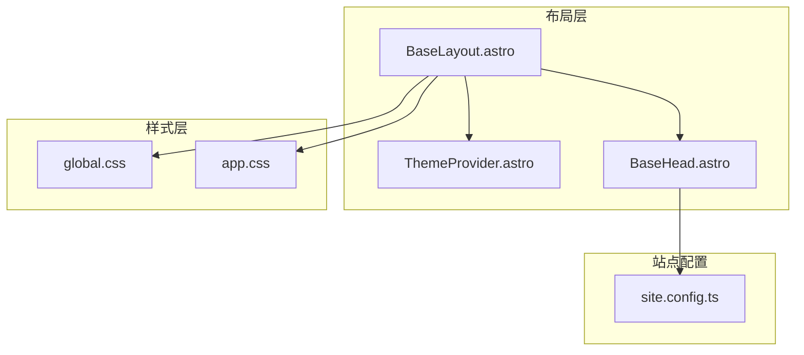
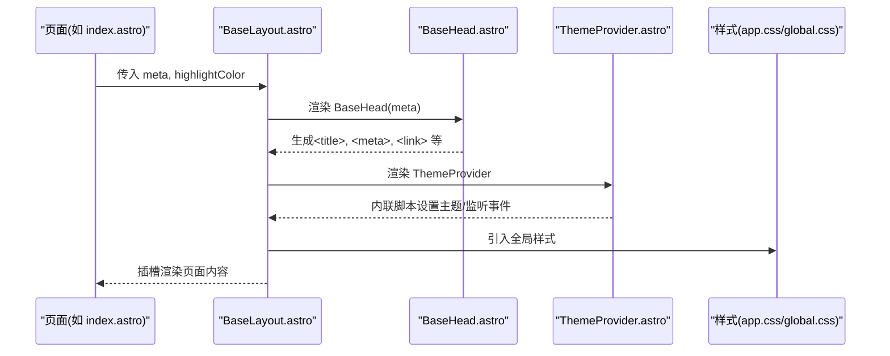
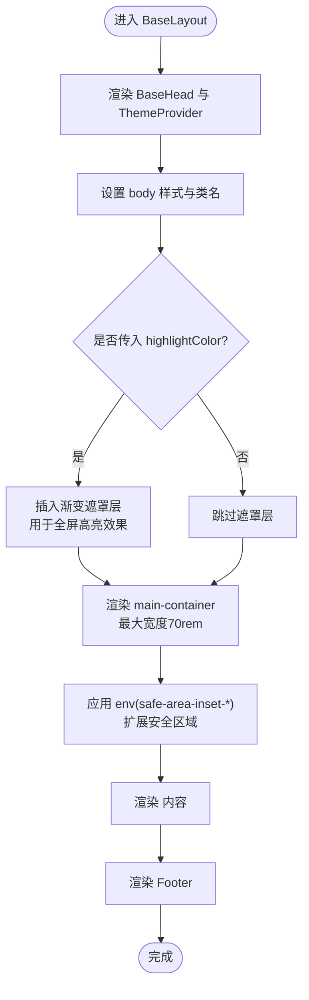
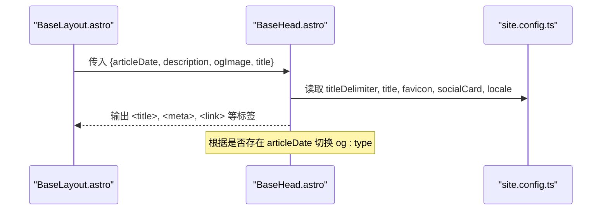
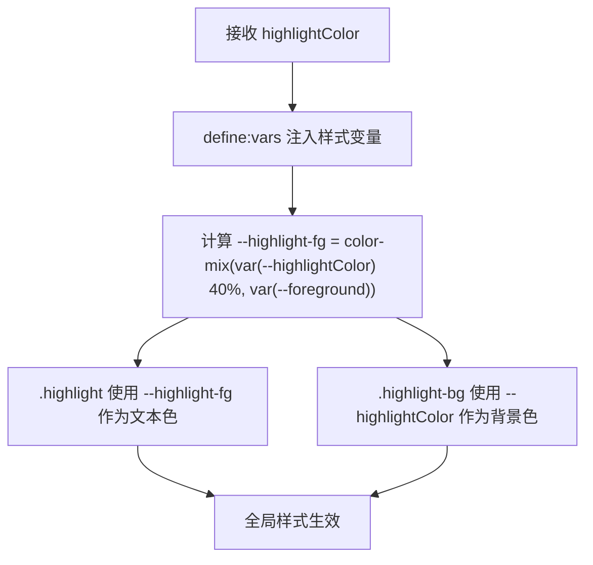
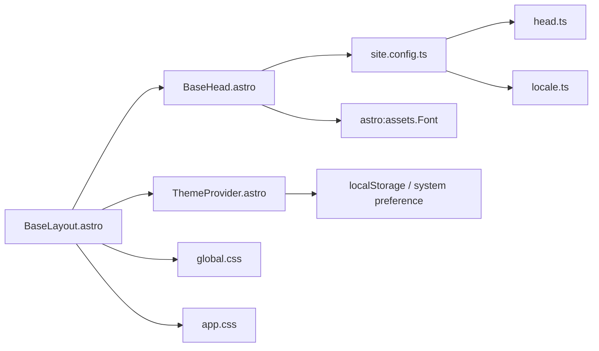

# 基础布局组件

<cite>
**本文引用的文件**
- [BaseLayout.astro](file://src/layouts/BaseLayout.astro)
- [BaseHead.astro](file://src/components/BaseHead.astro)
- [ThemeProvider.astro](file://packages/pure/components/basic/ThemeProvider.astro)
- [site.config.ts](file://src/site.config.ts)
- [global.css](file://src/assets/styles/global.css)
- [app.css](file://src/assets/styles/app.css)
- [index.astro](file://src/pages/index.astro)
- [BlogPost.astro](file://src/layouts/BlogPost.astro)
- [head.ts](file://packages/pure/schemas/head.ts)
- [locale.ts](file://packages/pure/schemas/locale.ts)
- [astro.config.ts](file://astro.config.ts)
</cite>

## 目录
1. [简介](#简介)
2. [项目结构](#项目结构)
3. [核心组件](#核心组件)
4. [架构总览](#架构总览)
5. [详细组件分析](#详细组件分析)
6. [依赖关系分析](#依赖关系分析)
7. [性能考量](#性能考量)
8. [故障排查指南](#故障排查指南)
9. [结论](#结论)
10. [附录](#附录)

## 简介
本文件面向基础布局组件 BaseLayout.astro 的技术文档，系统阐述其架构设计、HTML 结构、全局样式引入与组件集成模式；详解 BaseHead 组件的 SEO 元数据管理、Open Graph 图片处理与国际化支持；解释响应式容器与安全区域适配（safe-area-inset）的实现；介绍主题颜色系统与高亮效果的动态配置机制；并提供自定义指南、最佳实践、性能优化建议与浏览器兼容性考虑。

## 项目结构
BaseLayout 作为页面级布局，位于 src/layouts/ 目录，被具体页面与内容布局复用。其通过导入全局样式与主题提供器，统一注入站点元信息与主题行为，并以插槽承载页面内容。

图表来源
- [BaseLayout.astro](file://src/layouts/BaseLayout.astro#L1-L92)
- [BaseHead.astro](file://src/components/BaseHead.astro#L1-L99)
- [ThemeProvider.astro](file://packages/pure/components/basic/ThemeProvider.astro#L1-L41)
- [global.css](file://src/assets/styles/global.css#L1-L287)
- [app.css](file://src/assets/styles/app.css#L1-L49)
- [site.config.ts](file://src/site.config.ts#L1-L207)

章节来源
- [BaseLayout.astro](file://src/layouts/BaseLayout.astro#L1-L92)
- [site.config.ts](file://src/site.config.ts#L1-L207)

## 核心组件
- BaseLayout.astro
  - 负责整体 HTML 结构、全局样式引入、主题提供器挂载、响应式容器与安全区域适配、高亮色动态配置。
  - 接收 meta 与可选 highlightColor 属性，向 BaseHead 传递 SEO 元数据，向 ThemeProvider 注入主题逻辑。
- BaseHead.astro
  - 负责生成标题、图标、字体预加载、Canonical、Open Graph、Twitter Card、RSS 自动发现、站点地图等 SEO 元数据。
  - 支持根据文章或页面类型动态设置 og:type、文章作者与发布时间等。
- ThemeProvider.astro
  - 在客户端内联脚本中快速设置主题（读取 localStorage 或系统偏好），并更新 meta[name="theme-color"]。
  - 监听主题变更事件与全局提示事件，实现交互反馈。
- 全局样式
  - app.css 定义 HSL 色相环变量与明暗主题切换规则。
  - global.css 提供动画、代码块、滚动条等通用样式与暗色主题下的覆盖。

章节来源
- [BaseLayout.astro](file://src/layouts/BaseLayout.astro#L1-L92)
- [BaseHead.astro](file://src/components/BaseHead.astro#L1-L99)
- [ThemeProvider.astro](file://packages/pure/components/basic/ThemeProvider.astro#L1-L41)
- [app.css](file://src/assets/styles/app.css#L1-L49)
- [global.css](file://src/assets/styles/global.css#L1-L287)

## 架构总览
BaseLayout 作为页面骨架，串联 SEO 头部、主题提供器与全局样式，形成一致的视觉与行为基线。页面通过传入 meta 与 highlightColor，驱动 BaseHead 的 SEO 输出与 BaseLayout 的高亮动态变量。

图表来源
- [index.astro](file://src/pages/index.astro#L42-L42)
- [BaseLayout.astro](file://src/layouts/BaseLayout.astro#L24-L91)
- [BaseHead.astro](file://src/components/BaseHead.astro#L12-L99)
- [ThemeProvider.astro](file://packages/pure/components/basic/ThemeProvider.astro#L6-L20)
- [app.css](file://src/assets/styles/app.css#L1-L49)
- [global.css](file://src/assets/styles/global.css#L1-L287)

## 详细组件分析

### BaseLayout.astro 架构与数据流
- HTML 结构
  - 设置 html lang 来源于站点配置 locale.lang。
  - head 中嵌入 BaseHead 与 ThemeProvider。
  - body 使用 flex 布局，背景与前景色来自主题变量。
- 全局样式引入
  - 在布局中引入 global.css 与 app.css，确保所有页面共享样式基线。
- 主题与高亮
  - ThemeProvider 在内联脚本中快速设置主题并更新 meta[name="theme-color"]。
  - 通过 define:vars 将 highlightColor 注入到样式变量，计算高亮前景色与背景色。
- 响应式容器与安全区域适配
  - main-container 最大宽度为 70rem，配合媒体查询在不同断点下增加左右内边距。
  - 使用 env(safe-area-inset-*) 扩展特殊屏幕的安全区域，避免刘海/圆角遮挡。
- 插槽与头部/底部
  - 顶部放置 Header，中间为 <slot />，底部放置 Footer，形成三段式结构。

图表来源
- [BaseLayout.astro](file://src/layouts/BaseLayout.astro#L24-L91)

章节来源
- [BaseLayout.astro](file://src/layouts/BaseLayout.astro#L1-L92)

### BaseHead.astro 的 SEO 元数据与国际化
- 标题与描述
  - 根据页面 title 与站点配置 titleDelimiter、site.title 组合最终标题。
  - description 优先使用页面 meta，否则回退至站点配置。
- 图标与清单
  - 提供多尺寸 favicon、apple-touch-icon、manifest，满足多平台需求。
- 字体预加载
  - 通过 astro:assets 的 Font 组件预加载指定字体子集与样式，减少 FOIT。
- Canonical 与 RSS
  - 生成当前路径的 Canonical URL，提供 RSS 自动发现链接。
- Open Graph 与 Twitter Card
  - 动态设置 og:type（article 或 website），og:title/description/url/site_name/locale/image 等。
  - 若存在 articleDate，则附加 article:author 与 article:published_time。
  - Twitter card 使用 summary_large_image，图像来源优先页面 ogImage，否则回退站点 socialCard。
- 国际化支持
  - locale.attrs 用于设置 og:locale，确保社交平台正确解析语言区域。
- 版本与站点地图
  - 输出 generator 信息与 sitemap 索引链接。

图表来源
- [BaseHead.astro](file://src/components/BaseHead.astro#L12-L99)
- [site.config.ts](file://src/site.config.ts#L16-L34)

章节来源
- [BaseHead.astro](file://src/components/BaseHead.astro#L1-L99)
- [site.config.ts](file://src/site.config.ts#L1-L207)
- [locale.ts](file://packages/pure/schemas/locale.ts#L1-L30)

### 主题颜色系统与高亮效果动态配置
- 主题变量
  - app.css 定义明暗两套 HSL 变量，根元素与 .dark 类分别对应浅色与深色主题。
  - html.dark 与 color-scheme: dark 协同实现系统级外观同步。
- 高亮色动态配置
  - BaseLayout 通过 define:vars 接收 highlightColor，计算 --highlight-fg 与 --highlightColor。
  - .highlight 与 .highlight-bg 使用 color-mix 计算混合色，保证在不同前景色下保持可读性。
- 主题提供器
  - ThemeProvider 内联脚本优先从 localStorage 读取 theme，若为 'system' 则跟随系统偏好。
  - 设置 documentElement 的 'dark' 类，并更新 meta[name="theme-color"]。

图表来源
- [BaseLayout.astro](file://src/layouts/BaseLayout.astro#L52-L66)
- [app.css](file://src/assets/styles/app.css#L1-L49)

章节来源
- [BaseLayout.astro](file://src/layouts/BaseLayout.astro#L51-L91)
- [ThemeProvider.astro](file://packages/pure/components/basic/ThemeProvider.astro#L6-L20)
- [app.css](file://src/assets/styles/app.css#L1-L49)

### 响应式容器与安全区域适配
- 容器约束
  - main-container 最大宽度 70rem，保证长文本阅读体验。
- 安全区域扩展
  - 使用 env(safe-area-inset-top/left/right)，在不同断点下增加左右内边距，避免刘海/圆角遮挡。
- 移动端体验
  - 在小屏断点下，内边距按比例递增，提升可触达性与可读性。

章节来源
- [BaseLayout.astro](file://src/layouts/BaseLayout.astro#L72-L88)

### 组件集成模式与使用示例
- 页面使用 BaseLayout
  - 示例：首页 index.astro 传入 meta 并设置 highlightColor，承载主要内容与组件。
- 文章页使用 BaseLayout
  - 示例：BlogPost.astro 将文章的 description、ogImage、title、articleDate 透传给 BaseLayout，同时将主色调作为 highlightColor，增强文章主题一致性。

章节来源
- [index.astro](file://src/pages/index.astro#L42-L42)
- [BlogPost.astro](file://src/layouts/BlogPost.astro#L47-L49)

## 依赖关系分析
- BaseLayout 依赖
  - BaseHead：负责 SEO 元数据输出。
  - ThemeProvider：负责主题初始化与事件监听。
  - global.css / app.css：提供全局样式与主题变量。
  - site.config.ts：提供站点标题、描述、图标、社交卡片、语言等配置。
- BaseHead 依赖
  - virtual:config：读取站点配置（titleDelimiter、title、favicon、socialCard、locale）。
  - astro:assets.Font：字体预加载。
- ThemeProvider 依赖
  - 本地存储与系统偏好匹配，动态设置主题与 meta[name="theme-color"]。
- 配置与校验
  - head.ts：head 注入配置的类型校验。
  - locale.ts：locale 配置的类型校验。

图表来源
- [BaseLayout.astro](file://src/layouts/BaseLayout.astro#L1-L11)
- [BaseHead.astro](file://src/components/BaseHead.astro#L1-L7)
- [ThemeProvider.astro](file://packages/pure/components/basic/ThemeProvider.astro#L1-L20)
- [site.config.ts](file://src/site.config.ts#L1-L207)
- [head.ts](file://packages/pure/schemas/head.ts#L1-L19)
- [locale.ts](file://packages/pure/schemas/locale.ts#L1-L30)

章节来源
- [BaseLayout.astro](file://src/layouts/BaseLayout.astro#L1-L11)
- [BaseHead.astro](file://src/components/BaseHead.astro#L1-L7)
- [head.ts](file://packages/pure/schemas/head.ts#L1-L19)
- [locale.ts](file://packages/pure/schemas/locale.ts#L1-L30)

## 性能考量
- 字体加载
  - 通过 astro.config.ts 的 experimental.fonts 配置，启用字体预加载与优化，减少首字渲染时间。
- 样式体积
  - 将全局样式集中于 global.css 与 app.css，避免重复引入，降低运行时样式计算成本。
- 主题切换
  - ThemeProvider 使用内联脚本在页面加载早期设置主题，避免闪烁。
- 代码高亮
  - app.css 中对 .astro-code 的样式优化与暗色主题覆盖，减少额外资源请求。
- Markdown 数学公式
  - astro.config.ts 启用 remark-math 与 rehype-katex，按需加载，避免不必要的开销。

章节来源
- [astro.config.ts](file://astro.config.ts#L116-L131)
- [app.css](file://src/assets/styles/app.css#L1-L49)
- [global.css](file://src/assets/styles/global.css#L54-L119)
- [ThemeProvider.astro](file://packages/pure/components/basic/ThemeProvider.astro#L6-L20)

## 故障排查指南
- SEO 元数据未生效
  - 检查 BaseHead 是否正确接收页面 meta（title、description、ogImage、articleDate）。
  - 确认 site.config.ts 中的 title、titleDelimiter、favicon、socialCard、locale 是否正确配置。
- 主题切换闪烁
  - 确保 ThemeProvider 内联脚本在页面加载早期执行，且未被其他脚本覆盖。
- 高亮色不生效
  - 检查 BaseLayout 是否传入 highlightColor，以及 define:vars 是否正确注入。
  - 确认 app.css 中的主题变量与颜色混合逻辑未被覆盖。
- 安全区域适配异常
  - 检查设备是否支持 env(safe-area-inset-*)，并在 BaseLayout 的媒体查询断点下验证内边距变化。
- 字体加载问题
  - 确认 astro.config.ts 的 experimental.fonts 配置与 Font 组件调用一致。

章节来源
- [BaseHead.astro](file://src/components/BaseHead.astro#L12-L99)
- [site.config.ts](file://src/site.config.ts#L16-L34)
- [ThemeProvider.astro](file://packages/pure/components/basic/ThemeProvider.astro#L6-L20)
- [BaseLayout.astro](file://src/layouts/BaseLayout.astro#L52-L88)
- [astro.config.ts](file://astro.config.ts#L116-L131)

## 结论
BaseLayout.astro 通过统一的 HTML 结构、全局样式与主题提供器，构建了稳定一致的页面骨架；BaseHead.astro 则将 SEO 元数据、国际化与社交分享能力前置到布局层，显著提升内容分发质量；结合响应式容器与安全区域适配，确保跨设备一致体验；高亮色动态配置与主题变量体系，使品牌色彩与交互细节得以灵活定制。遵循本文的最佳实践与性能建议，可在保证可维护性的同时获得更优的用户体验。

## 附录

### 自定义指南与最佳实践
- 自定义站点元信息
  - 在 site.config.ts 中调整 title、description、favicon、socialCard、locale 等字段。
- 自定义高亮色
  - 在页面中传入 highlightColor，建议使用品牌主色或文章主图提取色。
- 扩展 head 注入
  - 使用 head.ts 定义的类型，向 head 配置数组添加自定义 meta/link/script。
- 国际化与语言
  - 通过 locale.ts 的校验与 site.config.ts 的 locale 配置，确保 og:locale 与日期格式正确。
- 主题变量扩展
  - 在 app.css 中新增或调整 HSL 变量，确保明暗两套值均完整覆盖。

章节来源
- [site.config.ts](file://src/site.config.ts#L16-L34)
- [head.ts](file://packages/pure/schemas/head.ts#L1-L19)
- [locale.ts](file://packages/pure/schemas/locale.ts#L1-L30)
- [app.css](file://src/assets/styles/app.css#L1-L49)