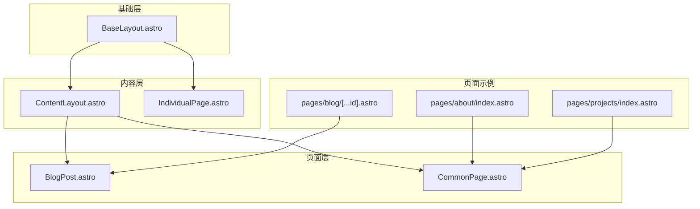
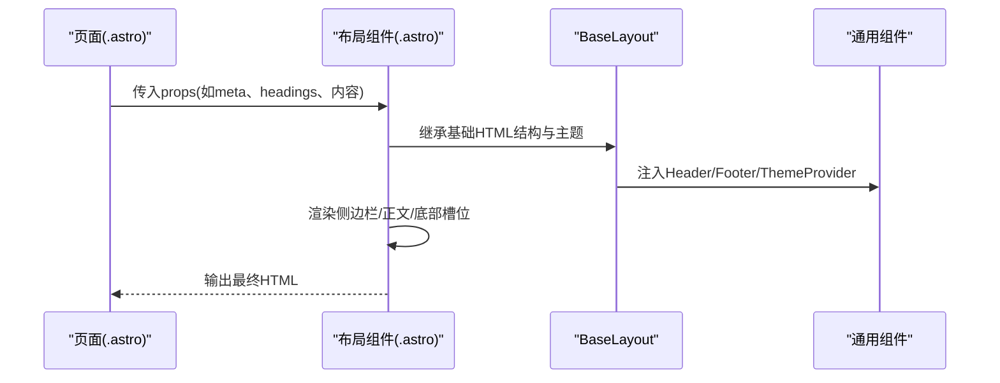
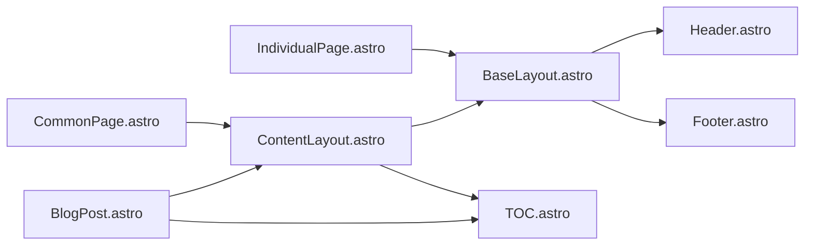

# 布局系统

<cite>
**本文引用的文件**
- [src/layouts/BaseLayout.astro](file://src/layouts/BaseLayout.astro)
- [src/layouts/ContentLayout.astro](file://src/layouts/ContentLayout.astro)
- [src/layouts/BlogPost.astro](file://src/layouts/BlogPost.astro)
- [src/layouts/CommonPage.astro](file://src/layouts/CommonPage.astro)
- [src/layouts/IndividualPage.astro](file://src/layouts/IndividualPage.astro)
- [src/pages/blog/[...id].astro](file://src/pages/blog/[...id].astro)
- [src/pages/about/index.astro](file://src/pages/about/index.astro)
- [src/pages/projects/index.astro](file://src/pages/projects/index.astro)
- [packages/pure/components/basic/Header.astro](file://packages/pure/components/basic/Header.astro)
- [packages/pure/components/basic/Footer.astro](file://packages/pure/components/basic/Footer.astro)
- [packages/pure/components/pages/TOC.astro](file://packages/pure/components/pages/TOC.astro)
- [src/assets/styles/global.css](file://src/assets/styles/global.css)
- [src/site.config.ts](file://src/site.config.ts)
- [packages/pure/types/theme-config.ts](file://packages/pure/types/theme-config.ts)
- [packages/pure/types/index.ts](file://packages/pure/types/index.ts)
</cite>

## 目录
1. [简介](#简介)
2. [项目结构](#项目结构)
3. [核心组件](#核心组件)
4. [架构总览](#架构总览)
5. [组件详解](#组件详解)
6. [依赖关系分析](#依赖关系分析)
7. [性能考量](#性能考量)
8. [故障排查指南](#故障排查指南)
9. [结论](#结论)
10. [附录](#附录)

## 简介
本文件面向Astro主题Pure的布局系统，聚焦于基础布局组件BaseLayout.astro及其派生布局（BlogPost、CommonPage、ContentLayout、IndividualPage）的架构设计、数据流与组合模式。文档同时覆盖响应式断点策略、可扩展性与SEO友好结构，并提供自定义布局的开发指南与最佳实践。

## 项目结构
布局系统位于src/layouts目录，采用“基础布局 + 内容布局 + 页面布局”的分层设计：
- BaseLayout：全局HTML骨架、主题提供者、安全区域适配、高亮色变量注入
- ContentLayout：通用内容区布局（侧边栏、正文、底部槽位、回到顶部）
- IndividualPage：独立页面（无侧边栏，强调标题/描述/语言元信息）
- BlogPost：文章详情页布局（集成TOC、Hero、版权、推荐、评论）
- CommonPage：通用页面布局（标题、TOC、评论、底部槽位）

图表来源
- [src/layouts/BaseLayout.astro](file://src/layouts/BaseLayout.astro#L1-L92)
- [src/layouts/ContentLayout.astro](file://src/layouts/ContentLayout.astro#L1-L156)
- [src/layouts/IndividualPage.astro](file://src/layouts/IndividualPage.astro#L1-L77)
- [src/layouts/BlogPost.astro](file://src/layouts/BlogPost.astro#L1-L75)
- [src/layouts/CommonPage.astro](file://src/layouts/CommonPage.astro#L1-L34)
- [src/pages/blog/[...id].astro](file://src/pages/blog/[...id].astro#L1-L29)
- [src/pages/about/index.astro](file://src/pages/about/index.astro#L1-L251)
- [src/pages/projects/index.astro](file://src/pages/projects/index.astro#L1-L205)

章节来源
- [src/layouts/BaseLayout.astro](file://src/layouts/BaseLayout.astro#L1-L92)
- [src/layouts/ContentLayout.astro](file://src/layouts/ContentLayout.astro#L1-L156)
- [src/layouts/IndividualPage.astro](file://src/layouts/IndividualPage.astro#L1-L77)
- [src/layouts/BlogPost.astro](file://src/layouts/BlogPost.astro#L1-L75)
- [src/layouts/CommonPage.astro](file://src/layouts/CommonPage.astro#L1-L34)

## 核心组件
- BaseLayout.astro
  - 负责全局HTML结构、lang属性、全局样式引入、主题提供者、高亮色CSS变量注入、安全区域适配
  - 提供主容器与Header/Footer占位，通过slot承载子布局内容
- ContentLayout.astro
  - 在BaseLayout之上封装内容区：侧边栏、正文、底部槽位、回到顶部按钮
  - 移动端侧边栏抽屉交互逻辑内联脚本实现
- IndividualPage.astro
  - 独立页面布局，适合文档/单页，不强制侧边栏
- BlogPost.astro
  - 文章详情页专用布局，集成TOC、Hero、版权、文章推荐、评论
- CommonPage.astro
  - 通用页面布局，支持标题、TOC、评论、底部槽位

章节来源
- [src/layouts/BaseLayout.astro](file://src/layouts/BaseLayout.astro#L1-L92)
- [src/layouts/ContentLayout.astro](file://src/layouts/ContentLayout.astro#L1-L156)
- [src/layouts/IndividualPage.astro](file://src/layouts/IndividualPage.astro#L1-L77)
- [src/layouts/BlogPost.astro](file://src/layouts/BlogPost.astro#L1-L75)
- [src/layouts/CommonPage.astro](file://src/layouts/CommonPage.astro#L1-L34)

## 架构总览
布局系统采用“组合优于继承”的模式：页面通过渲染函数或静态路径生成，选择合适的布局组件进行包裹；布局组件之间通过嵌套与slot协作完成内容拼装。

图表来源
- [src/pages/blog/[...id].astro](file://src/pages/blog/[...id].astro#L1-L29)
- [src/layouts/BlogPost.astro](file://src/layouts/BlogPost.astro#L1-L75)
- [src/layouts/ContentLayout.astro](file://src/layouts/ContentLayout.astro#L1-L156)
- [src/layouts/BaseLayout.astro](file://src/layouts/BaseLayout.astro#L1-L92)
- [packages/pure/components/basic/Header.astro](file://packages/pure/components/basic/Header.astro#L1-L209)
- [packages/pure/components/basic/Footer.astro](file://packages/pure/components/basic/Footer.astro#L1-L91)

## 组件详解

### BaseLayout.astro
- 全局职责
  - 设置<html lang>、引入全局样式与应用样式
  - 注入BaseHead与ThemeProvider
  - 主容器与Header/Footer占位，支持高亮色变量注入
- 响应式与安全区域
  - 使用env(safe-area-inset-*)适配刘海屏/圆角屏
  - 多级媒体查询调整容器内边距
- 可扩展点
  - 通过define:vars注入高亮色，影响.highlight与.highlight-bg
  - 可在子布局中传递highlightColor以统一视觉风格

章节来源
- [src/layouts/BaseLayout.astro](file://src/layouts/BaseLayout.astro#L1-L92)
- [src/assets/styles/global.css](file://src/assets/styles/global.css#L1-L287)

### ContentLayout.astro
- 结构与槽位
  - 侧边栏(slot='sidebar')、内容头部(slot='header')、正文、底部槽位(slot='bottom'/'bottom-sidebar')
  - 回到顶部组件与移动端侧边栏开关按钮
- 交互与动画
  - 内联脚本控制侧边栏显示/隐藏与遮罩
  - 媒体查询下针对移动端侧边栏的动画与尺寸约束
- 与BaseLayout的关系
  - 作为ContentLayout的父级，负责通用内容区排版

章节来源
- [src/layouts/ContentLayout.astro](file://src/layouts/ContentLayout.astro#L1-L156)

### IndividualPage.astro
- 适用场景
  - 独立页面（如文档、单页），不强制侧边栏
- 关键特性
  - 支持标题、描述、语言标签、社交图
  - 正文区域结合站点排版集成类名
  - 回到顶部组件

章节来源
- [src/layouts/IndividualPage.astro](file://src/layouts/IndividualPage.astro#L1-L77)

### BlogPost.astro
- 数据与插件
  - 接收文章集合、标题、摘要、更新时间、草稿标记、评论开关
  - 集成KaTeX样式、MediumZoom（按配置启用）
- 组合模式
  - 通过PageLayout（即ContentLayout）承载侧边栏/正文/底部
  - 插入TOC、Hero、版权、文章推荐、评论等模块
- SEO与社交图
  - 动态计算articleDate与ogImage（优先heroImage，否则回退至站点socialCard）

章节来源
- [src/layouts/BlogPost.astro](file://src/layouts/BlogPost.astro#L1-L75)
- [src/site.config.ts](file://src/site.config.ts#L1-L207)

### CommonPage.astro
- 通用页面
  - 支持标题、可选headings生成TOC、页面信息展示、评论开关
  - 通过底部槽位扩展更多内容（如文章推荐/评论）

章节来源
- [src/layouts/CommonPage.astro](file://src/layouts/CommonPage.astro#L1-L34)

### 页面示例与布局选择
- 文章详情页
  - pages/blog/[...id].astro使用BlogPost布局，渲染文章内容并传入headings与remark插件数据
- 关于页
  - pages/about/index.astro使用CommonPage布局，传入标题与headings，插入多个业务组件
- 项目页
  - pages/projects/index.astro使用CommonPage布局，传入标题与headings，插入项目卡片、赞助等组件

章节来源
- [src/pages/blog/[...id].astro](file://src/pages/blog/[...id].astro#L1-L29)
- [src/pages/about/index.astro](file://src/pages/about/index.astro#L1-L251)
- [src/pages/projects/index.astro](file://src/pages/projects/index.astro#L1-L205)

## 依赖关系分析

图表来源
- [src/layouts/BlogPost.astro](file://src/layouts/BlogPost.astro#L1-L75)
- [src/layouts/CommonPage.astro](file://src/layouts/CommonPage.astro#L1-L34)
- [src/layouts/ContentLayout.astro](file://src/layouts/ContentLayout.astro#L1-L156)
- [src/layouts/IndividualPage.astro](file://src/layouts/IndividualPage.astro#L1-L77)
- [src/layouts/BaseLayout.astro](file://src/layouts/BaseLayout.astro#L1-L92)
- [packages/pure/components/basic/Header.astro](file://packages/pure/components/basic/Header.astro#L1-L209)
- [packages/pure/components/basic/Footer.astro](file://packages/pure/components/basic/Footer.astro#L1-L91)
- [packages/pure/components/pages/TOC.astro](file://packages/pure/components/pages/TOC.astro#L1-L136)

### 组件间继承与组合
- 继承关系
  - ContentLayout与IndividualPage均直接继承BaseLayout
  - BlogPost与CommonPage通过ContentLayout间接继承BaseLayout
- 组合关系
  - BlogPost组合了Hero、TOC、Copyright、ArticleBottom、Comment等组件
  - BaseLayout组合Header与Footer
  - ContentLayout组合BackToTop与用户态Button/Icon

章节来源
- [src/layouts/BaseLayout.astro](file://src/layouts/BaseLayout.astro#L1-L92)
- [src/layouts/ContentLayout.astro](file://src/layouts/ContentLayout.astro#L1-L156)
- [src/layouts/BlogPost.astro](file://src/layouts/BlogPost.astro#L1-L75)
- [src/layouts/CommonPage.astro](file://src/layouts/CommonPage.astro#L1-L34)
- [src/layouts/IndividualPage.astro](file://src/layouts/IndividualPage.astro#L1-L77)

## 性能考量
- 渲染与预渲染
  - 文章详情页采用getStaticPaths与prerender=true，提升首屏性能与SEO表现
- 侧边栏交互
  - ContentLayout的侧边栏切换使用内联脚本，避免额外依赖，减少首屏阻塞
- 样式与动画
  - 全局动画与滚动条样式集中管理，避免重复计算
- 图片与外部资源
  - 社交图与站点配置统一管理，减少重复请求
- 可选功能
  - MediumZoom按配置启用，避免不必要的库加载

章节来源
- [src/pages/blog/[...id].astro](file://src/pages/blog/[...id].astro#L1-L29)
- [src/layouts/ContentLayout.astro](file://src/layouts/ContentLayout.astro#L77-L156)
- [src/site.config.ts](file://src/site.config.ts#L1-L207)

## 故障排查指南
- 侧边栏无法显示/点击无效
  - 检查ContentLayout中的内联脚本是否正确挂载事件监听器
  - 确认移动端断点下的样式规则未被覆盖
- TOC高亮异常
  - 确保headings参数正确传入，且TOCHeading生成的slug与正文锚点一致
- 高亮色不生效
  - 检查BaseLayout中highlightColor是否传入，以及CSS变量是否被覆盖
- 移动端安全区域适配异常
  - 确认设备支持env(safe-area-inset-*)，并检查媒体查询覆盖顺序

章节来源
- [src/layouts/ContentLayout.astro](file://src/layouts/ContentLayout.astro#L77-L156)
- [packages/pure/components/pages/TOC.astro](file://packages/pure/components/pages/TOC.astro#L1-L136)
- [src/layouts/BaseLayout.astro](file://src/layouts/BaseLayout.astro#L52-L89)

## 结论
Astro主题Pure的布局系统通过清晰的分层与组合模式，实现了从全局骨架到页面细节的完整覆盖。BaseLayout提供一致的全局体验，ContentLayout与IndividualPage分别满足内容型与独立型页面需求，BlogPost与CommonPage则针对文章与通用页面提供了丰富的可插拔能力。配合响应式断点与可选功能，系统在可用性、SEO与性能上取得良好平衡。

## 附录

### 响应式断点与安全区域
- 断点策略
  - 移动端：最大宽度769px时启用侧边栏抽屉与遮罩
  - 平板/桌面：侧边栏固定/粘性定位，支持滚动与层级控制
- 安全区域
  - 使用env(safe-area-inset-*)适配刘海屏/圆角屏，多级媒体查询逐步增加左右内边距

章节来源
- [src/layouts/ContentLayout.astro](file://src/layouts/ContentLayout.astro#L103-L156)
- [src/layouts/BaseLayout.astro](file://src/layouts/BaseLayout.astro#L68-L89)

### SEO友好结构建议
- 文章页
  - 使用articleDate与ogImage，确保社交分享与搜索结果丰富
- 通用页
  - 通过title与description完善页面元信息
- 站点配置
  - 通过site.config.ts统一管理locale、socialCard、prerender等SEO相关项

章节来源
- [src/layouts/BlogPost.astro](file://src/layouts/BlogPost.astro#L38-L44)
- [src/site.config.ts](file://src/site.config.ts#L1-L207)

### 自定义布局开发指南与最佳实践
- 设计原则
  - 优先组合而非继承：通过slot与子组件组合实现差异化
  - 明确职责边界：BaseLayout负责全局，ContentLayout负责内容区，IndividualPage负责独立页
- 参数与类型
  - 使用SiteMeta与MarkdownHeading等类型，保证数据契约清晰
- 可扩展性
  - 通过config.integ与virtual:config注入集成能力（如MediumZoom、Waline、Typography）
  - 将可选功能（如评论、TOC）作为可插拔模块，避免强制依赖

章节来源
- [packages/pure/types/index.ts](file://packages/pure/types/index.ts#L7-L12)
- [packages/pure/types/theme-config.ts](file://packages/pure/types/theme-config.ts#L1-L193)
- [src/site.config.ts](file://src/site.config.ts#L101-L181)