# 内容页面布局

<cite>
**本文引用的文件**
- [ContentLayout.astro](file://src/layouts/ContentLayout.astro)
- [BaseLayout.astro](file://src/layouts/BaseLayout.astro)
- [CommonPage.astro](file://src/layouts/CommonPage.astro)
- [BlogPost.astro](file://src/layouts/BlogPost.astro)
- [BaseHead.astro](file://src/components/BaseHead.astro)
- [BackToTop.astro](file://packages/pure/components/pages/BackToTop.astro)
- [app.css](file://src/assets/styles/app.css)
- [uno.config.ts](file://uno.config.ts)
- [site.config.ts](file://src/site.config.ts)
- [index.ts（pure types）](file://packages/pure/types/index.ts)
- [head.ts（pure schemas）](file://packages/pure/schemas/head.ts)
- [social.ts（pure schemas）](file://packages/pure/schemas/social.ts)
- [favicon.ts（pure schemas）](file://packages/pure/schemas/favicon.ts)
</cite>

## 目录
1. [简介](#简介)
2. [项目结构](#项目结构)
3. [核心组件](#核心组件)
4. [架构总览](#架构总览)
5. [组件详解](#组件详解)
6. [依赖关系分析](#依赖关系分析)
7. [性能考量](#性能考量)
8. [故障排查指南](#故障排查指南)
9. [结论](#结论)
10. [附录](#附录)

## 简介
本技术文档围绕内容页面布局组件进行深入解析，重点覆盖以下方面：
- 内容页面处理机制与内容渲染优化策略
- 元数据处理、社交媒体卡片生成与 SEO 优化
- 高亮颜色系统与主题色彩管理
- 返回按钮的动态配置与导航集成
- 插槽系统的使用模式与组件组合方式
- 性能优化技巧与最佳实践
- 自定义配置与扩展开发指南

## 项目结构
内容页面布局由多层布局与页面模板组成，采用“基础布局 + 内容布局 + 页面模板”的分层设计，配合主题与样式系统实现一致的外观与行为。

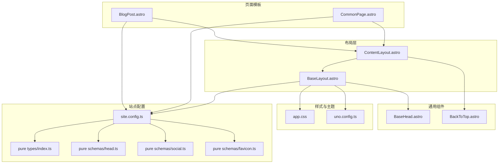

图表来源
- [BaseLayout.astro](file://src/layouts/BaseLayout.astro#L1-L92)
- [ContentLayout.astro](file://src/layouts/ContentLayout.astro#L1-L156)
- [CommonPage.astro](file://src/layouts/CommonPage.astro#L1-L34)
- [BlogPost.astro](file://src/layouts/BlogPost.astro#L1-L75)
- [BaseHead.astro](file://src/components/BaseHead.astro#L1-L99)
- [BackToTop.astro](file://packages/pure/components/pages/BackToTop.astro#L1-L146)
- [app.css](file://src/assets/styles/app.css#L1-L48)
- [uno.config.ts](file://uno.config.ts#L14-L125)
- [site.config.ts](file://src/site.config.ts#L1-L207)
- [index.ts（pure types）](file://packages/pure/types/index.ts#L1-L33)
- [head.ts（pure schemas）](file://packages/pure/schemas/head.ts#L1-L19)
- [social.ts（pure schemas）](file://packages/pure/schemas/social.ts#L1-L45)
- [favicon.ts（pure schemas）](file://packages/pure/schemas/favicon.ts#L1-L43)

章节来源
- [BaseLayout.astro](file://src/layouts/BaseLayout.astro#L1-L92)
- [ContentLayout.astro](file://src/layouts/ContentLayout.astro#L1-L156)
- [CommonPage.astro](file://src/layouts/CommonPage.astro#L1-L34)
- [BlogPost.astro](file://src/layouts/BlogPost.astro#L1-L75)
- [BaseHead.astro](file://src/components/BaseHead.astro#L1-L99)
- [BackToTop.astro](file://packages/pure/components/pages/BackToTop.astro#L1-L146)
- [app.css](file://src/assets/styles/app.css#L1-L48)
- [uno.config.ts](file://uno.config.ts#L14-L125)
- [site.config.ts](file://src/site.config.ts#L1-L207)
- [index.ts（pure types）](file://packages/pure/types/index.ts#L1-L33)
- [head.ts（pure schemas）](file://packages/pure/schemas/head.ts#L1-L19)
- [social.ts（pure schemas）](file://packages/pure/schemas/social.ts#L1-L45)
- [favicon.ts（pure schemas）](file://packages/pure/schemas/favicon.ts#L1-L43)

## 核心组件
- 基础布局 BaseLayout：负责全局主题注入、高亮色变量、安全区域适配、头部与页脚占位以及全局样式加载。
- 内容布局 ContentLayout：封装内容容器、侧边栏、移动端遮罩与返回按钮，提供插槽以承载页面内容与底部区块。
- 页面模板 CommonPage：面向通用页面（如文档页），自动注入目录、页面信息与评论区等。
- 页面模板 BlogPost：面向博客文章页，自动处理社交卡片、文章日期、高亮主色与推荐区块。
- SEO 头部 BaseHead：统一输出标题、描述、Open Graph、Twitter Card、图标与 RSS 等 SEO 元数据。
- 返回按钮 BackToTop：提供回到顶部与滚动进度指示，并可挂载其他自定义图标。

章节来源
- [BaseLayout.astro](file://src/layouts/BaseLayout.astro#L1-L92)
- [ContentLayout.astro](file://src/layouts/ContentLayout.astro#L1-L156)
- [CommonPage.astro](file://src/layouts/CommonPage.astro#L1-L34)
- [BlogPost.astro](file://src/layouts/BlogPost.astro#L1-L75)
- [BaseHead.astro](file://src/components/BaseHead.astro#L1-L99)
- [BackToTop.astro](file://packages/pure/components/pages/BackToTop.astro#L1-L146)

## 架构总览
内容页面从页面模板开始，逐层向下传递元数据与配置，最终由内容布局承载内容与交互；同时通过基础布局完成主题与 SEO 的统一注入。

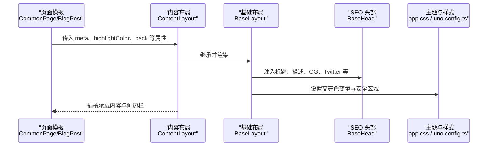

图表来源
- [CommonPage.astro](file://src/layouts/CommonPage.astro#L1-L34)
- [BlogPost.astro](file://src/layouts/BlogPost.astro#L1-L75)
- [ContentLayout.astro](file://src/layouts/ContentLayout.astro#L1-L156)
- [BaseLayout.astro](file://src/layouts/BaseLayout.astro#L1-L92)
- [BaseHead.astro](file://src/components/BaseHead.astro#L1-L99)
- [app.css](file://src/assets/styles/app.css#L1-L48)
- [uno.config.ts](file://uno.config.ts#L14-L125)

## 组件详解

### 内容布局 ContentLayout
- 职责与结构
  - 提供内容容器与两列式布局（侧边栏 + 主内容区），支持移动端抽屉式侧边栏与遮罩。
  - 通过插槽系统承载 header、默认内容、底部与底部侧边栏。
  - 提供返回按钮与“回到顶部”联动，支持自定义返回路径。
- 关键特性
  - 移动端侧边栏：点击按钮或遮罩触发显示/隐藏，配合动画与遮罩透明度。
  - 高亮色透传：通过父级传递的 highlightColor，在基础布局中转换为 CSS 变量，影响高亮文本与背景。
  - 返回按钮：动态 href 来自 back 属性，默认回退到“/”，可按页面定制。
- 插槽使用模式
  - header：用于放置标题、副标题、页面信息等。
  - 默认插槽：承载正文内容。
  - bottom：用于版权、推荐、评论等底部区块。
  - bottom-sidebar：用于底部侧边栏内容。
- 与返回按钮 BackToTop 的集成
  - 将“回到顶部”按钮置于内容布局内，通过 header 与 content 的 DOM 引用计算滚动进度与显示状态。

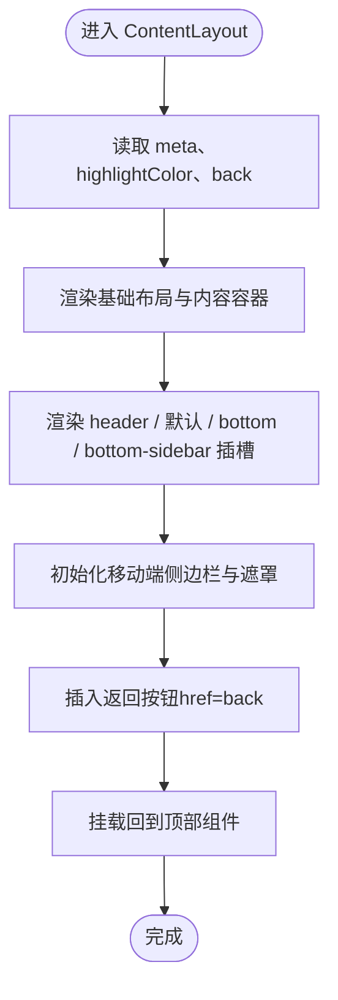

图表来源
- [ContentLayout.astro](file://src/layouts/ContentLayout.astro#L1-L156)
- [BackToTop.astro](file://packages/pure/components/pages/BackToTop.astro#L1-L146)

章节来源
- [ContentLayout.astro](file://src/layouts/ContentLayout.astro#L1-L156)

### 基础布局 BaseLayout
- 职责与结构
  - 在 HTML 层注入全局样式与主题提供器，设置根元素语言与主题容器。
  - 通过 define:vars 接收 highlightColor，将其映射为 CSS 变量，实现高亮文本与背景色的动态替换。
  - 使用 define:vars 与 CSS 变量组合 color-mix 实现高亮前景色与背景色的智能混合。
  - 适配安全区域（safe-area-inset-*），提升刘海屏/折叠屏体验。
- 主题与样式
  - app.css 定义了明暗主题下的基础色值与过渡规则。
  - uno.config.ts 中的排版配置为内容区提供统一的排版风格与可访问性增强（如标题锚点可见性）。

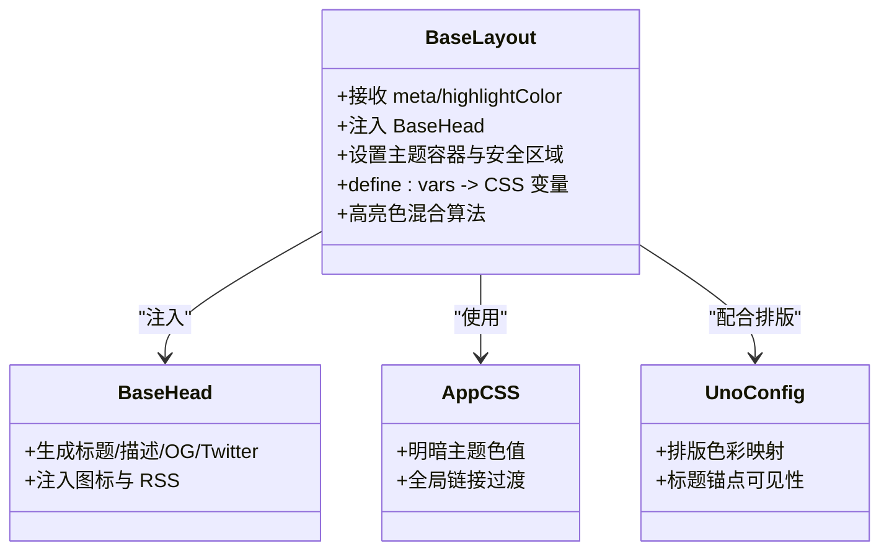

图表来源
- [BaseLayout.astro](file://src/layouts/BaseLayout.astro#L1-L92)
- [BaseHead.astro](file://src/components/BaseHead.astro#L1-L99)
- [app.css](file://src/assets/styles/app.css#L1-L48)
- [uno.config.ts](file://uno.config.ts#L14-L125)

章节来源
- [BaseLayout.astro](file://src/layouts/BaseLayout.astro#L1-L92)
- [app.css](file://src/assets/styles/app.css#L1-L48)
- [uno.config.ts](file://uno.config.ts#L14-L125)

### 页面模板 CommonPage
- 职责与结构
  - 面向通用页面（如文档页），自动注入目录（TOC）、页面信息（PageInfo）与评论区（Comment）。
  - 通过插槽将标题、描述与底部内容进行组合，便于复用。
- 与内容布局的协作
  - 以 PageLayout 作为载体，传入 meta（标题）与其它属性，确保与 ContentLayout 的接口一致。

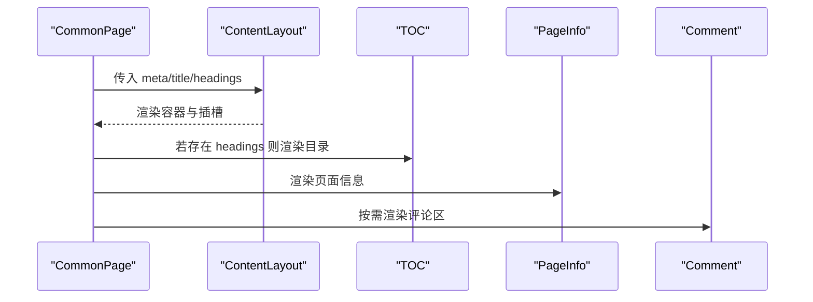

图表来源
- [CommonPage.astro](file://src/layouts/CommonPage.astro#L1-L34)
- [ContentLayout.astro](file://src/layouts/ContentLayout.astro#L1-L156)

章节来源
- [CommonPage.astro](file://src/layouts/CommonPage.astro#L1-L34)

### 页面模板 BlogPost
- 职责与结构
  - 面向博客文章页，自动处理社交卡片（heroImage 或默认 socialCard）、文章日期（publishDate/updatedDate）、高亮主色（heroImage.color）与推荐区块。
  - 通过 BackToTop 提供回到顶部能力，并在需要时启用 MediumZoom。
- 与内容布局的协作
  - 以 PageLayout 为载体，back 默认指向“/blog”，meta 包含标题、描述、OG 图片与文章日期。

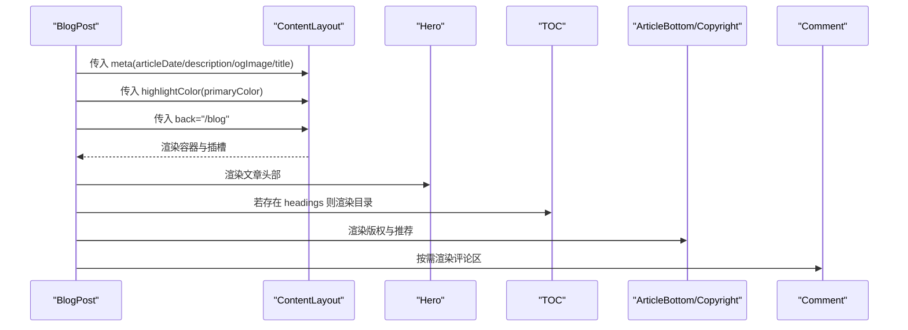

图表来源
- [BlogPost.astro](file://src/layouts/BlogPost.astro#L1-L75)
- [ContentLayout.astro](file://src/layouts/ContentLayout.astro#L1-L156)

章节来源
- [BlogPost.astro](file://src/layouts/BlogPost.astro#L1-L75)

### SEO 与社交媒体卡片
- BaseHead 统一输出
  - 标题：站点标题与页面标题拼接，使用站点分隔符。
  - 描述：页面描述或站点默认描述。
  - OG/Twitter：类型、标题、描述、URL、站点名、语言、图片尺寸与社交图片。
  - 图标与清单：favicon、apple-touch-icon、manifest。
  - RSS 与站点地图：自动发现 RSS 与 sitemap。
- 社交卡片生成策略
  - 若文章有 heroImage，则优先使用；否则回退到站点默认 socialCard。
  - 图片 URL 支持绝对/相对路径，统一通过 URL 构造保证正确性。
- 站点配置与校验
  - favicon 类型校验与默认值约束，确保合法格式。
  - 社交链接 schema 将枚举映射为带标签的对象，便于前端展示。

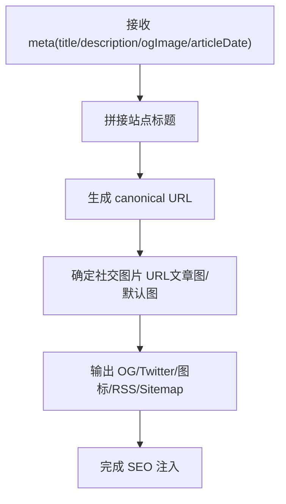

图表来源
- [BaseHead.astro](file://src/components/BaseHead.astro#L1-L99)
- [favicon.ts（pure schemas）](file://packages/pure/schemas/favicon.ts#L1-L43)
- [social.ts（pure schemas）](file://packages/pure/schemas/social.ts#L1-L45)

章节来源
- [BaseHead.astro](file://src/components/BaseHead.astro#L1-L99)
- [favicon.ts（pure schemas）](file://packages/pure/schemas/favicon.ts#L1-L43)
- [social.ts（pure schemas）](file://packages/pure/schemas/social.ts#L1-L45)

### 高亮颜色系统与主题色彩管理
- 高亮色透传与变量映射
  - ContentLayout 接收 highlightColor 并传递给 BaseLayout。
  - BaseLayout 通过 define:vars 将 highlightColor 映射为 CSS 变量，并结合 color-mix 计算高亮前景色与背景色。
- 主题色值与过渡
  - app.css 定义明/暗主题的基础色值，全局链接悬停过渡使用主题色。
  - uno.config.ts 的排版配置对标题、链接、代码块等进行色彩映射，确保一致性。
- 动态效果
  - 高亮色仅在传入时生效，避免无意义的样式开销。
  - 通过 CSS 变量与 color-mix，实现与前景色的智能混合，兼顾可读性与美观。

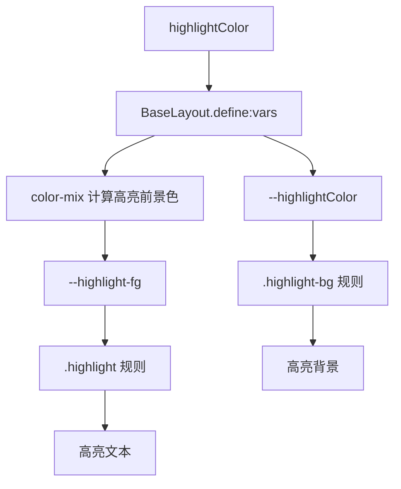

图表来源
- [BaseLayout.astro](file://src/layouts/BaseLayout.astro#L52-L89)
- [app.css](file://src/assets/styles/app.css#L1-L48)
- [uno.config.ts](file://uno.config.ts#L14-L125)

章节来源
- [BaseLayout.astro](file://src/layouts/BaseLayout.astro#L52-L89)
- [app.css](file://src/assets/styles/app.css#L1-L48)
- [uno.config.ts](file://uno.config.ts#L14-L125)

### 返回按钮的动态配置与导航集成
- 动态配置
  - ContentLayout 的 back 属性决定返回按钮的 href，默认为“/”，可在页面模板中覆盖。
  - BlogPost 将 back 设为“/blog”，实现文章页返回列表页的导航。
- 导航集成
  - 返回按钮与 BackToTop 协同工作：BackToTop 通过 header 与 content 的 DOM 引用计算滚动进度，返回按钮提供直接跳转。
  - 移动端侧边栏与返回按钮共存，互不干扰。

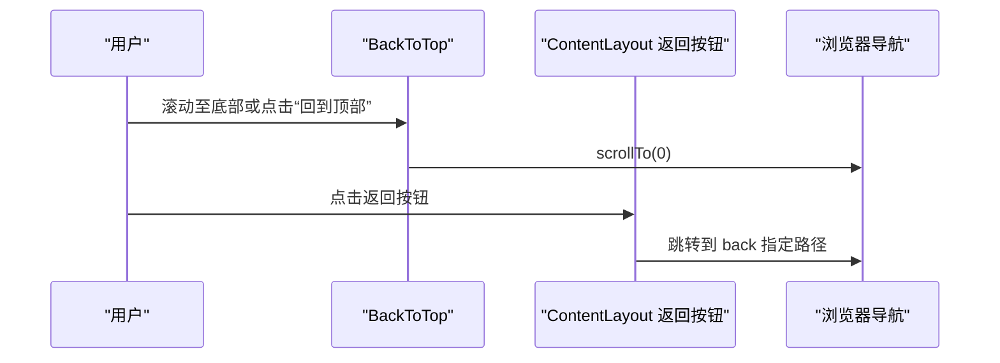

图表来源
- [BackToTop.astro](file://packages/pure/components/pages/BackToTop.astro#L1-L146)
- [ContentLayout.astro](file://src/layouts/ContentLayout.astro#L1-L156)
- [BlogPost.astro](file://src/layouts/BlogPost.astro#L1-L75)

章节来源
- [BackToTop.astro](file://packages/pure/components/pages/BackToTop.astro#L1-L146)
- [ContentLayout.astro](file://src/layouts/ContentLayout.astro#L1-L156)
- [BlogPost.astro](file://src/layouts/BlogPost.astro#L1-L75)

### 插槽系统的使用模式与组件组合
- 插槽分布
  - header：标题与页面信息。
  - 默认：正文内容。
  - bottom：版权、推荐、评论等底部区块。
  - bottom-sidebar：底部侧边栏。
- 组合方式
  - CommonPage：注入 TOC、PageInfo、Comment。
  - BlogPost：注入 Hero、TOC、Copyright、ArticleBottom、Comment。
  - ContentLayout：统一容器与移动端交互，供上层模板组合。

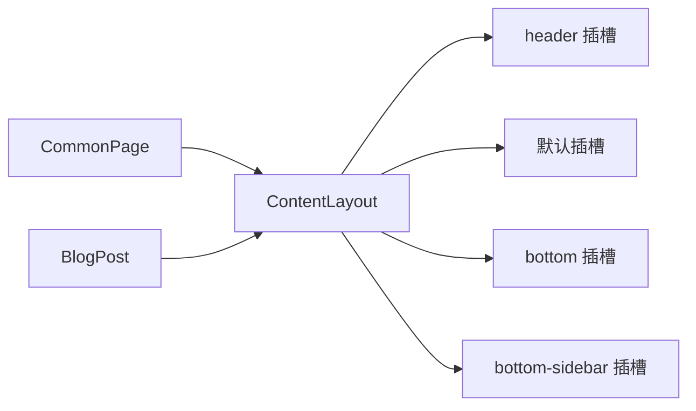

图表来源
- [ContentLayout.astro](file://src/layouts/ContentLayout.astro#L1-L156)
- [CommonPage.astro](file://src/layouts/CommonPage.astro#L1-L34)
- [BlogPost.astro](file://src/layouts/BlogPost.astro#L1-L75)

章节来源
- [ContentLayout.astro](file://src/layouts/ContentLayout.astro#L1-L156)
- [CommonPage.astro](file://src/layouts/CommonPage.astro#L1-L34)
- [BlogPost.astro](file://src/layouts/BlogPost.astro#L1-L75)

## 依赖关系分析
- 组件耦合
  - ContentLayout 依赖 BaseLayout 进行主题与 SEO 注入。
  - 页面模板（CommonPage/BlogPost）依赖 ContentLayout 进行内容组织。
  - BackToTop 与 ContentLayout 的 DOM 结构强相关（header/content 的 ID）。
- 外部依赖
  - UnoCSS 排版预设用于内容区样式一致性。
  - 站点配置（site.config.ts）提供标题、描述、社交卡片、字体、国际化等全局参数。
- 潜在风险
  - BackToTop 依赖特定 DOM ID，若 ContentLayout 结构变更需同步调整。
  - 高亮色变量依赖 define:vars，未传入时不会产生高亮样式。

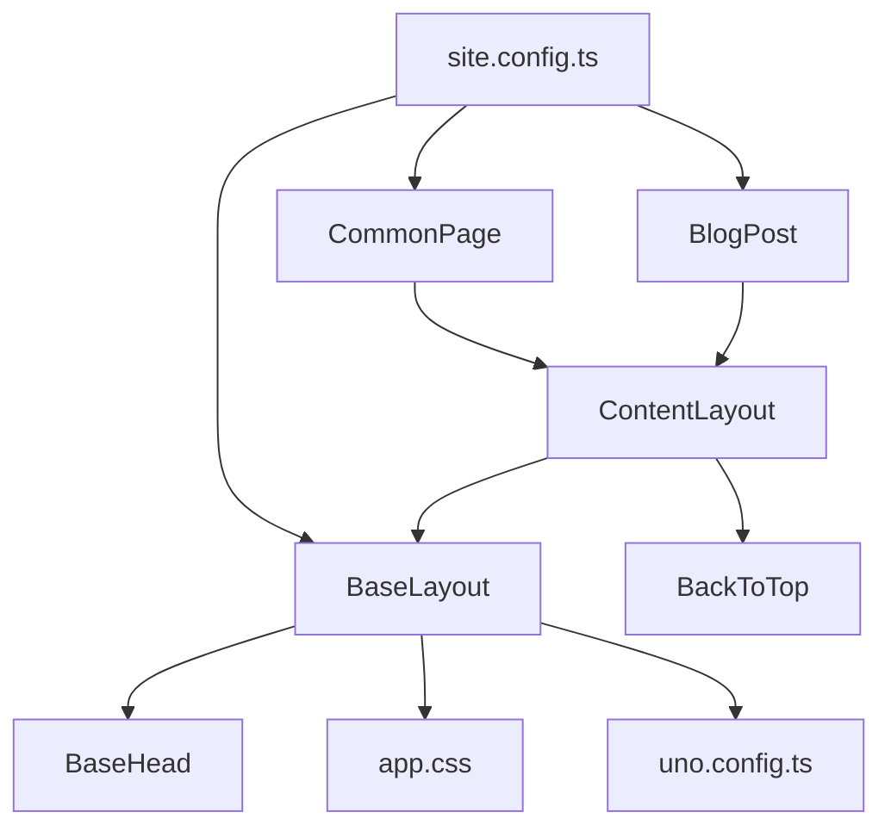

图表来源
- [CommonPage.astro](file://src/layouts/CommonPage.astro#L1-L34)
- [BlogPost.astro](file://src/layouts/BlogPost.astro#L1-L75)
- [ContentLayout.astro](file://src/layouts/ContentLayout.astro#L1-L156)
- [BaseLayout.astro](file://src/layouts/BaseLayout.astro#L1-L92)
- [BaseHead.astro](file://src/components/BaseHead.astro#L1-L99)
- [BackToTop.astro](file://packages/pure/components/pages/BackToTop.astro#L1-L146)
- [app.css](file://src/assets/styles/app.css#L1-L48)
- [uno.config.ts](file://uno.config.ts#L14-L125)
- [site.config.ts](file://src/site.config.ts#L1-L207)

章节来源
- [CommonPage.astro](file://src/layouts/CommonPage.astro#L1-L34)
- [BlogPost.astro](file://src/layouts/BlogPost.astro#L1-L75)
- [ContentLayout.astro](file://src/layouts/ContentLayout.astro#L1-L156)
- [BaseLayout.astro](file://src/layouts/BaseLayout.astro#L1-L92)
- [BaseHead.astro](file://src/components/BaseHead.astro#L1-L99)
- [BackToTop.astro](file://packages/pure/components/pages/BackToTop.astro#L1-L146)
- [app.css](file://src/assets/styles/app.css#L1-L48)
- [uno.config.ts](file://uno.config.ts#L14-L125)
- [site.config.ts](file://src/site.config.ts#L1-L207)

## 性能考量
- 渲染优化
  - 内容区使用 UnoCSS 排版类（如 prose）减少重复样式，提高渲染效率。
  - 通过 define:vars 仅在传入高亮色时生成相关样式，避免不必要的 CSS 输出。
- 交互优化
  - BackToTop 使用 requestAnimationFrame 控制滚动百分比更新，降低主线程压力。
  - 移动端侧边栏切换采用类名切换与 CSS 动画，避免复杂 JS 动画。
- SEO 与资源加载
  - BaseHead 统一注入关键 SEO 元素，减少重复请求。
  - favicon 与图标采用预加载与清单，提升首屏识别度。
- 可选功能按需开启
  - MediumZoom、Waline 等功能可通过站点配置开关，避免无用资源加载。

章节来源
- [ContentLayout.astro](file://src/layouts/ContentLayout.astro#L1-L156)
- [BackToTop.astro](file://packages/pure/components/pages/BackToTop.astro#L1-L146)
- [BaseHead.astro](file://src/components/BaseHead.astro#L1-L99)
- [site.config.ts](file://src/site.config.ts#L101-L181)

## 故障排查指南
- 高亮色无效
  - 检查是否传入 highlightColor，确认 BaseLayout 的 define:vars 是否生效。
  - 确认 CSS 变量与 color-mix 规则未被覆盖。
- 滚动进度不显示
  - 确认 BackToTop 的 header 与 content ID 与 ContentLayout 保持一致。
  - 检查文章内容区是否存在对应 ID 的元素。
- 移动端侧边栏无法关闭
  - 检查遮罩与按钮事件绑定是否正常，确认样式类名切换逻辑。
- 社交卡片未显示
  - 检查文章 heroImage 是否存在，或站点 socialCard 是否有效。
  - 确认 BaseHead 中的 ogImage URL 构造逻辑。
- 返回按钮链接错误
  - 检查页面模板中 back 属性是否正确设置。

章节来源
- [BaseLayout.astro](file://src/layouts/BaseLayout.astro#L52-L89)
- [BackToTop.astro](file://packages/pure/components/pages/BackToTop.astro#L29-L108)
- [ContentLayout.astro](file://src/layouts/ContentLayout.astro#L77-L102)
- [BaseHead.astro](file://src/components/BaseHead.astro#L12-L14)
- [BlogPost.astro](file://src/layouts/BlogPost.astro#L38-L50)

## 结论
内容页面布局通过“基础布局 + 内容布局 + 页面模板”的分层设计，实现了高内聚、低耦合的内容组织与渲染体系。配合高亮颜色系统、SEO 元数据注入与插槽化组合，既满足了多样化的页面需求，又保证了性能与可维护性。建议在扩展新页面时遵循现有插槽约定与配置规范，确保一致的用户体验与开发效率。

## 附录
- 自定义配置与扩展开发指南
  - 高亮色：在页面模板中传入 highlightColor，即可在全站范围内生效。
  - 返回按钮：在页面模板中设置 back 属性，实现不同页面的返回路径定制。
  - SEO：通过 BaseHead 的 meta 参数与站点配置，统一管理标题、描述与社交卡片。
  - 插槽：根据页面需求在 header/bottom/bottom-sidebar 中插入组件，保持结构清晰。
  - 主题：通过 app.css 与 uno.config.ts 的排版配置，统一色彩与排版风格。
  - 站点配置：在 site.config.ts 中集中管理标题、描述、社交卡片、国际化与功能开关。

章节来源
- [site.config.ts](file://src/site.config.ts#L1-L207)
- [index.ts（pure types）](file://packages/pure/types/index.ts#L1-L33)
- [head.ts（pure schemas）](file://packages/pure/schemas/head.ts#L1-L19)
- [social.ts（pure schemas）](file://packages/pure/schemas/social.ts#L1-L45)
- [favicon.ts（pure schemas）](file://packages/pure/schemas/favicon.ts#L1-L43)