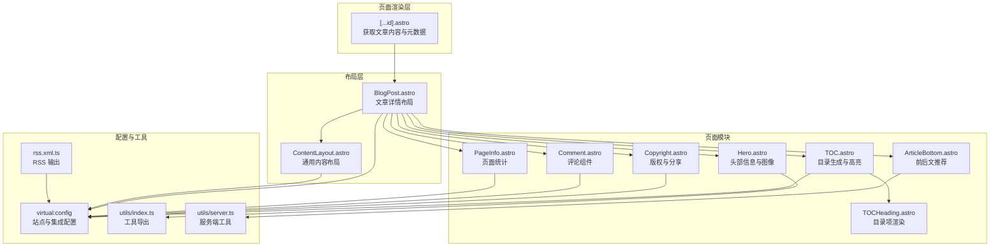
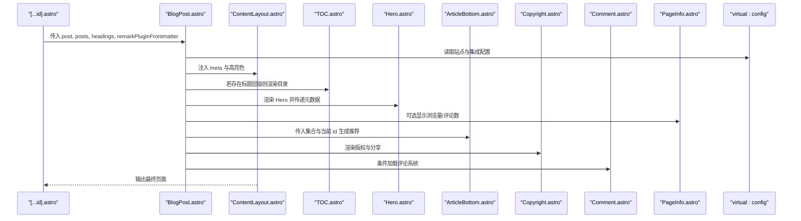
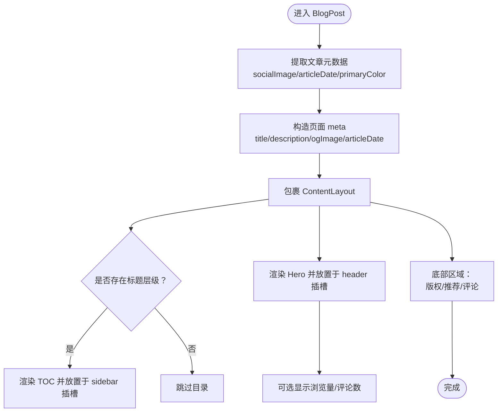
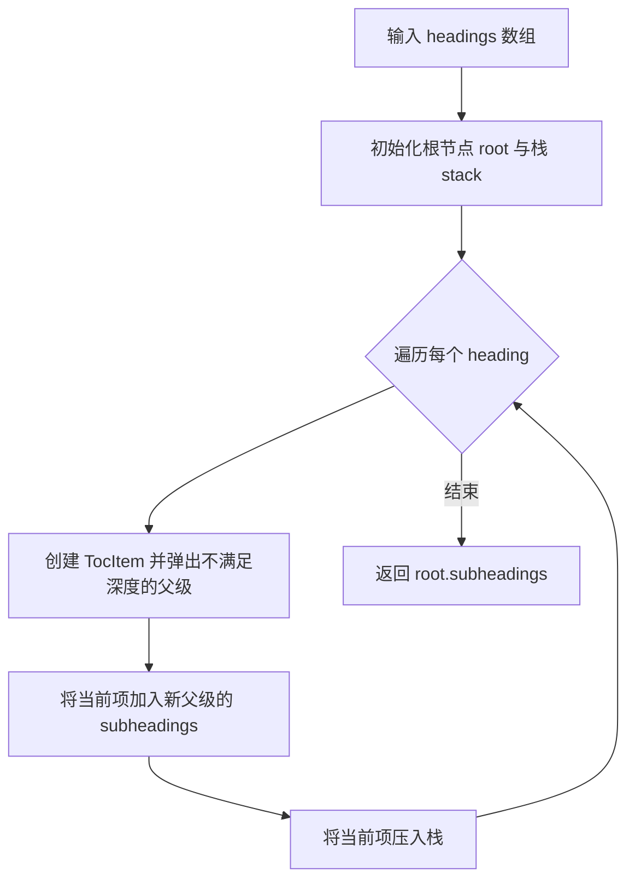
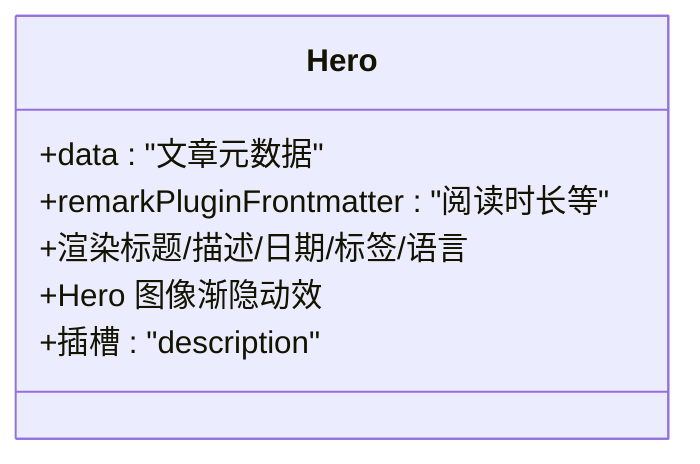
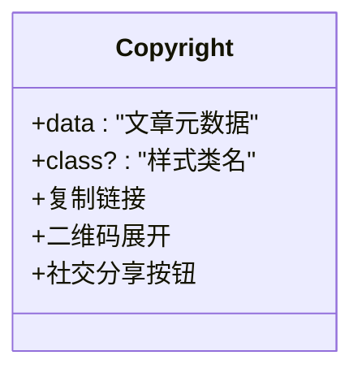
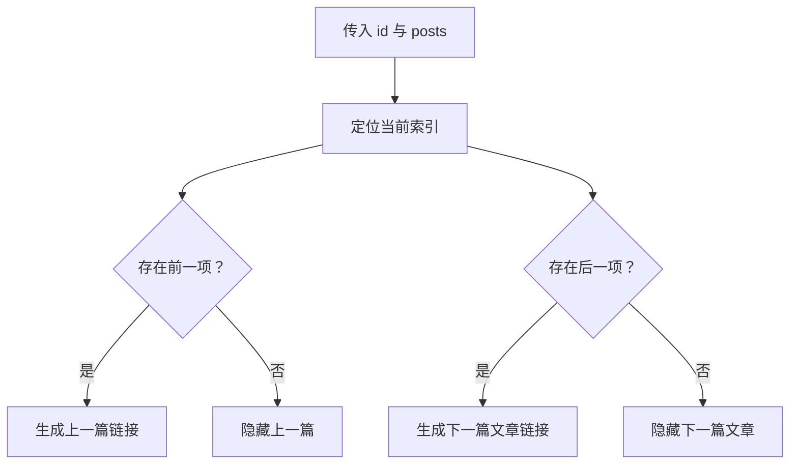
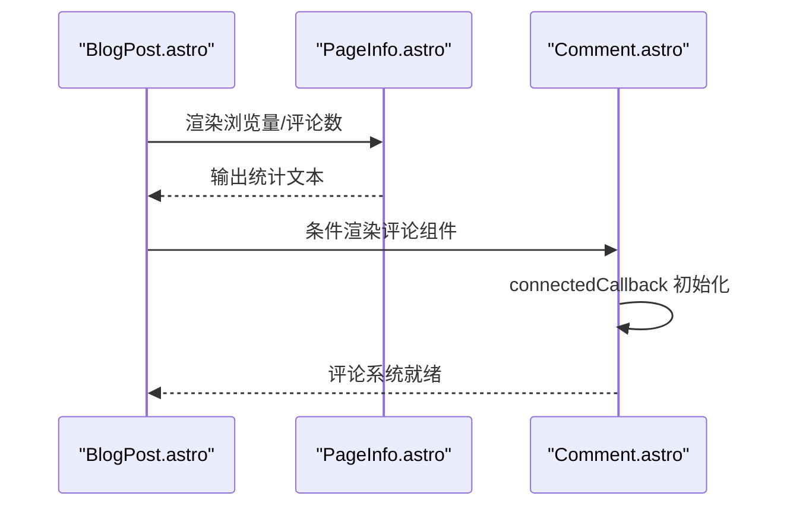
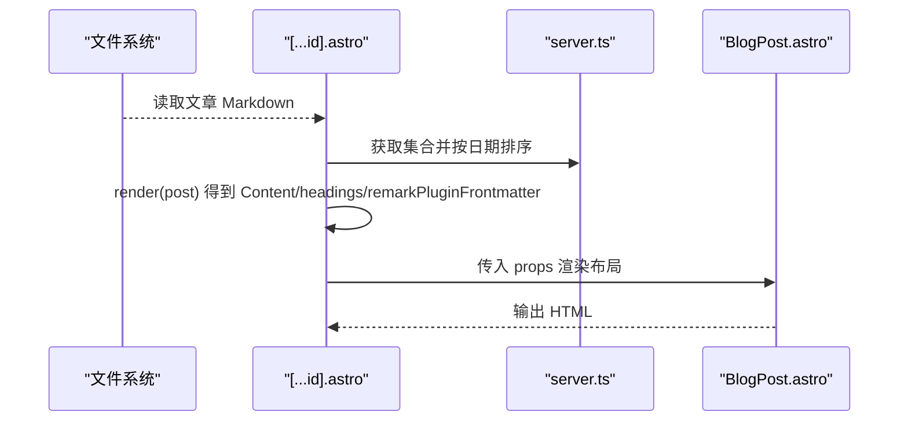
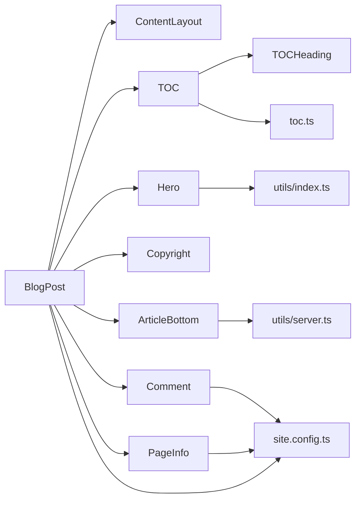

# 博客文章布局

<cite>
**本文引用的文件**
- [BlogPost.astro](file://src/layouts/BlogPost.astro)
- [ContentLayout.astro](file://src/layouts/ContentLayout.astro)
- [TOC.astro](file://packages/pure/components/pages/TOC.astro)
- [TOCHeading.astro](file://packages/pure/components/pages/TOCHeading.astro)
- [toc.ts](file://packages/pure/plugins/toc.ts)
- [Hero.astro](file://packages/pure/components/pages/Hero.astro)
- [Copyright.astro](file://packages/pure/components/pages/Copyright.astro)
- [ArticleBottom.astro](file://packages/pure/components/pages/ArticleBottom.astro)
- [Comment.astro](file://src/components/waline/Comment.astro)
- [PageInfo.astro](file://src/components/waline/PageInfo.astro)
- [FormattedDate.astro](file://packages/pure/components/user/FormattedDate.astro)
- [site.config.ts](file://src/site.config.ts)
- [[...id].astro](file://src/pages/blog/[...id].astro)
- [index.ts](file://packages/pure/utils/index.ts)
- [server.ts](file://packages/pure/utils/server.ts)
- [rss.xml.ts](file://src/pages/rss.xml.ts)
</cite>

## 目录
1. [引言](#引言)
2. [项目结构](#项目结构)
3. [核心组件](#核心组件)
4. [架构总览](#架构总览)
5. [组件详解](#组件详解)
6. [依赖关系分析](#依赖关系分析)
7. [性能考量](#性能考量)
8. [故障排查指南](#故障排查指南)
9. [结论](#结论)
10. [附录](#附录)

## 引言
本技术文档围绕博客文章详情页的布局组件进行深入解析，重点覆盖以下方面：
- 文章元数据的提取与展示（标题、描述、发布时间、更新时间、语言、标签等）
- 目录生成系统（TOC）的实现原理与交互行为
- 文章推荐系统与版权信息的集成方式
- 评论系统的条件加载机制与页面统计功能
- Hero 组件的特殊处理与插槽使用模式
- 布局参数配置、组件组合与可扩展性建议

## 项目结构
博客文章详情页由页面渲染层与布局层协同完成。页面渲染层负责收集文章内容、标题层级与阅读时长等前置信息；布局层负责组织页面结构、注入目录、版权与推荐等模块，并通过虚拟配置中心统一接入主题与集成能力。

**图表来源**
- [[...id].astro](file://src/pages/blog/[...id].astro#L1-L28)
- [BlogPost.astro](file://src/layouts/BlogPost.astro#L1-L75)
- [ContentLayout.astro](file://src/layouts/ContentLayout.astro#L1-L156)
- [TOC.astro](file://packages/pure/components/pages/TOC.astro#L1-L136)
- [TOCHeading.astro](file://packages/pure/components/pages/TOCHeading.astro#L1-L40)
- [Hero.astro](file://packages/pure/components/pages/Hero.astro#L1-L147)
- [Copyright.astro](file://packages/pure/components/pages/Copyright.astro#L1-L151)
- [ArticleBottom.astro](file://packages/pure/components/pages/ArticleBottom.astro#L1-L95)
- [Comment.astro](file://src/components/waline/Comment.astro#L1-L167)
- [PageInfo.astro](file://src/components/waline/PageInfo.astro#L1-L31)
- [site.config.ts](file://src/site.config.ts#L1-L207)
- [index.ts](file://packages/pure/utils/index.ts#L1-L18)
- [server.ts](file://packages/pure/utils/server.ts#L35-L66)
- [rss.xml.ts](file://src/pages/rss.xml.ts#L66-L83)

**章节来源**
- [[...id].astro](file://src/pages/blog/[...id].astro#L1-L28)
- [BlogPost.astro](file://src/layouts/BlogPost.astro#L1-L75)
- [ContentLayout.astro](file://src/layouts/ContentLayout.astro#L1-L156)

## 核心组件
- 布局入口：BlogPost.astro 负责接收文章内容、标题层级与阅读时长等前置数据，组装页面元信息并挂载目录、Hero、版权、推荐与评论等模块。
- 内容容器：ContentLayout.astro 提供通用的三栏结构（侧边栏/主内容/底部），并内置移动端侧边栏切换逻辑。
- 目录系统：TOC.astro 基于 toc.ts 生成目录树，结合 TOCHeading.astro 渲染层级项，并通过原生自定义元素实现滚动高亮与平滑跳转。
- 头部模块：Hero.astro 展示标题、描述、日期、阅读时长、语言与标签等元信息，并对 Hero 图像做渐隐动效。
- 版权与分享：Copyright.astro 展示作者、发布日期与版权协议，提供复制链接、二维码与社交分享能力。
- 推荐系统：ArticleBottom.astro 基于集合索引计算前后文文章，提供导航链接。
- 评论与统计：Comment.astro 条件加载 Waline 评论系统；PageInfo.astro 展示浏览量与评论数。
- 配置中心：site.config.ts 提供主题与集成配置，virtual:config 在运行时注入。

**章节来源**
- [BlogPost.astro](file://src/layouts/BlogPost.astro#L14-L75)
- [ContentLayout.astro](file://src/layouts/ContentLayout.astro#L9-L75)
- [TOC.astro](file://packages/pure/components/pages/TOC.astro#L1-L136)
- [toc.ts](file://packages/pure/plugins/toc.ts#L1-L25)
- [TOCHeading.astro](file://packages/pure/components/pages/TOCHeading.astro#L1-L40)
- [Hero.astro](file://packages/pure/components/pages/Hero.astro#L1-L147)
- [Copyright.astro](file://packages/pure/components/pages/Copyright.astro#L1-L151)
- [ArticleBottom.astro](file://packages/pure/components/pages/ArticleBottom.astro#L1-L95)
- [Comment.astro](file://src/components/waline/Comment.astro#L1-L167)
- [PageInfo.astro](file://src/components/waline/PageInfo.astro#L1-L31)
- [site.config.ts](file://src/site.config.ts#L101-L181)

## 架构总览
下图展示了从页面渲染到布局装配的关键流程，以及各模块之间的依赖关系。

**图表来源**
- [[...id].astro](file://src/pages/blog/[...id].astro#L22-L28)
- [BlogPost.astro](file://src/layouts/BlogPost.astro#L47-L75)
- [ContentLayout.astro](file://src/layouts/ContentLayout.astro#L18-L75)
- [TOC.astro](file://packages/pure/components/pages/TOC.astro#L1-L25)
- [Hero.astro](file://packages/pure/components/pages/Hero.astro#L12-L113)
- [ArticleBottom.astro](file://packages/pure/components/pages/ArticleBottom.astro#L12-L20)
- [Copyright.astro](file://packages/pure/components/pages/Copyright.astro#L15-L77)
- [Comment.astro](file://src/components/waline/Comment.astro#L11-L56)
- [PageInfo.astro](file://src/components/waline/PageInfo.astro#L16-L28)
- [site.config.ts](file://src/site.config.ts#L101-L181)

## 组件详解

### BlogPost 布局：参数、组合与扩展
- 参数与输入
  - post：当前文章条目，包含 id、data（标题、描述、发布时间、更新时间、草稿标记、是否启用评论、heroImage 等）
  - posts：按时间排序的文章集合，用于生成“上一篇/下一篇”
  - headings：Markdown 标题层级数组，用于生成目录
  - remarkPluginFrontmatter：Remark 插件注入的阅读时长等元信息
- 元数据处理
  - 社交卡片图：优先使用文章 heroImage，否则回退至站点 socialCard
  - 文章日期：若存在更新时间则以更新时间为基准，否则使用发布时间
  - 主题色：优先使用 heroImage 的颜色，否则回退到主题变量
- 组合与插槽
  - 侧边栏：当存在标题层级时渲染 TOC，并置于 slot='sidebar'
  - 头部：渲染 Hero，并在 slot='header' 中插入页面统计（浏览量/评论数）
  - 底部：渲染版权、前后文推荐与评论（均在 slot='bottom'）
  - 底侧边栏：预留 slot='bottom-sidebar'
- 扩展点
  - 可通过 virtual:config 控制评论开关、社交分享平台、图片缩放等
  - 可在底部与底侧边栏插槽中注入更多业务模块

**图表来源**
- [BlogPost.astro](file://src/layouts/BlogPost.astro#L21-L75)

**章节来源**
- [BlogPost.astro](file://src/layouts/BlogPost.astro#L14-L75)
- [site.config.ts](file://src/site.config.ts#L101-L181)

### 目录生成系统（TOC）：原理与配置
- 数据结构
  - MarkdownHeading：Astro 提供的标题节点，包含 depth、slug、text
  - TocItem：扩展后的目录项，包含子节点 subheadings
- 生成算法
  - 使用栈维护父子关系，遍历标题序列，将当前项作为栈顶父级的子节点
  - 时间复杂度 O(n)，空间复杂度 O(n)
- 渲染与交互
  - TOC.astro 调用 generateToc(headings) 生成树形目录
  - TOCHeading.astro 递归渲染子项，支持深度缩进
  - 自定义元素 toc-heading 实现滚动高亮与进度条动画，点击平滑跳转至对应标题
- 配置选项
  - 可通过 virtual:config.integ.mediumZoom.enable 控制图片缩放（与 TOC 无直接耦合）
  - 目录样式与交互可通过组件内样式与脚本调整

**图表来源**
- [toc.ts](file://packages/pure/plugins/toc.ts#L7-L24)

**章节来源**
- [TOC.astro](file://packages/pure/components/pages/TOC.astro#L1-L136)
- [TOCHeading.astro](file://packages/pure/components/pages/TOCHeading.astro#L1-L40)
- [toc.ts](file://packages/pure/plugins/toc.ts#L1-L25)

### Hero 组件：元数据展示与插槽模式
- 元数据展示
  - 标题、描述、日期（发布/更新）、阅读时长、语言、标签
  - Hero 图像采用双层遮罩：前景图与背景模糊图，滚动时降低背景图透明度
- 插槽使用
  - 在 BlogPost 中，Hero 放置于 slot='header'
  - 插槽名称 'description' 用于注入页面统计（浏览量/评论数）
- 可访问性
  - 标签使用 data-pagefind-filter='tag' 便于站内搜索过滤

**图表来源**
- [Hero.astro](file://packages/pure/components/pages/Hero.astro#L12-L113)

**章节来源**
- [Hero.astro](file://packages/pure/components/pages/Hero.astro#L1-L147)
- [FormattedDate.astro](file://packages/pure/components/user/FormattedDate.astro#L1-L22)

### 版权信息与社交分享
- 版权声明
  - 展示文章标题、当前链接、作者、发布日期与版权协议
  - 提供复制链接与二维码按钮，点击展开二维码面板
- 社交分享
  - 支持微博、X（原 Twitter）、Bluesky 三种平台
  - 分享链接根据站点配置与文章信息动态拼接
- 工具函数
  - 使用 utils/index.ts 导出的 cn、getFormattedDate 等工具

**图表来源**
- [Copyright.astro](file://packages/pure/components/pages/Copyright.astro#L15-L114)
- [index.ts](file://packages/pure/utils/index.ts#L10-L12)

**章节来源**
- [Copyright.astro](file://packages/pure/components/pages/Copyright.astro#L1-L151)
- [site.config.ts](file://src/site.config.ts#L84-L98)

### 文章推荐系统
- 计算逻辑
  - 基于 posts 集合查找当前文章索引，取前一项与后一项作为“上一篇/下一篇文章”
  - 通过路径拼接生成可访问链接
- 交互样式
  - 使用 SVG 图标与悬停过渡效果，适配移动端与桌面端

**图表来源**
- [ArticleBottom.astro](file://packages/pure/components/pages/ArticleBottom.astro#L16-L20)

**章节来源**
- [ArticleBottom.astro](file://packages/pure/components/pages/ArticleBottom.astro#L1-L95)
- [server.ts](file://packages/pure/utils/server.ts#L40-L46)

### 评论系统与页面统计
- 条件加载
  - 仅当 virtual:config.integ.waline.enable 为真时才渲染评论组件
  - 评论初始化在自定义元素 connectedCallback 中执行，避免与 SSR 水合冲突
- 页面统计
  - PageInfo 组件在 slot='description' 中显示浏览量与评论数
  - 通过 data-path 标记当前路径，Waline 后端据此统计
- 主题适配
  - 评论样式基于主题变量进行映射，确保深浅色一致

**图表来源**
- [BlogPost.astro](file://src/layouts/BlogPost.astro#L52-L71)
- [PageInfo.astro](file://src/components/waline/PageInfo.astro#L16-L28)
- [Comment.astro](file://src/components/waline/Comment.astro#L28-L56)

**章节来源**
- [Comment.astro](file://src/components/waline/Comment.astro#L1-L167)
- [PageInfo.astro](file://src/components/waline/PageInfo.astro#L1-L31)
- [site.config.ts](file://src/site.config.ts#L160-L181)

### 页面渲染与静态生成
- 页面渲染
  - [...id].astro 通过 render 获取 Content、headings 与 remarkPluginFrontmatter
  - 将这些数据透传给 BlogPost.astro
- 静态生成
  - 使用 getStaticPaths 与 sortMDByDate 生成所有文章的静态路由
  - prerender=true 提升首屏性能与 SEO

**图表来源**
- [[...id].astro](file://src/pages/blog/[...id].astro#L9-L28)
- [server.ts](file://packages/pure/utils/server.ts#L40-L46)
- [BlogPost.astro](file://src/layouts/BlogPost.astro#L47-L75)

**章节来源**
- [[...id].astro](file://src/pages/blog/[...id].astro#L1-L28)
- [server.ts](file://packages/pure/utils/server.ts#L40-L46)

## 依赖关系分析
- 组件耦合
  - BlogPost 依赖 ContentLayout、TOC、Hero、Copyright、ArticleBottom、Comment、PageInfo
  - TOC 依赖 toc.ts 与 TOCHeading
  - Hero 依赖 utils/index.ts 中的工具
  - ArticleBottom 依赖 utils/server.ts 的排序与索引工具
  - 评论与统计依赖 virtual:config 的集成配置
- 外部依赖
  - Waline 客户端、KaTeX 样式、MediumZoom（通过配置控制）

**图表来源**
- [BlogPost.astro](file://src/layouts/BlogPost.astro#L8-L12)
- [TOC.astro](file://packages/pure/components/pages/TOC.astro#L4-L5)
- [TOCHeading.astro](file://packages/pure/components/pages/TOCHeading.astro#L2-L3)
- [toc.ts](file://packages/pure/plugins/toc.ts#L1-L5)
- [Hero.astro](file://packages/pure/components/pages/Hero.astro#L5)
- [ArticleBottom.astro](file://packages/pure/components/pages/ArticleBottom.astro#L4)
- [Comment.astro](file://src/components/waline/Comment.astro#L2)
- [PageInfo.astro](file://src/components/waline/PageInfo.astro#L3)
- [site.config.ts](file://src/site.config.ts#L101-L181)

**章节来源**
- [BlogPost.astro](file://src/layouts/BlogPost.astro#L1-L75)
- [TOC.astro](file://packages/pure/components/pages/TOC.astro#L1-L136)
- [Hero.astro](file://packages/pure/components/pages/Hero.astro#L1-L147)
- [ArticleBottom.astro](file://packages/pure/components/pages/ArticleBottom.astro#L1-L95)
- [Comment.astro](file://src/components/waline/Comment.astro#L1-L167)
- [PageInfo.astro](file://src/components/waline/PageInfo.astro#L1-L31)
- [site.config.ts](file://src/site.config.ts#L101-L181)

## 性能考量
- 静态预渲染：页面设置 prerender=true，提升首屏速度与 SEO
- 目录滚动高亮：使用节流式更新与 IntersectionObserver 思想（定时器+窗口高度），在移动端需关注能耗
- 图片缩放：MediumZoom 仅在配置开启时加载，避免不必要的资源开销
- 评论懒加载：仅在需要时初始化 Waline，减少首屏 JS 体积
- 样式与脚本：目录与评论样式采用主题变量，避免重复定义

[本节为通用性能建议，无需特定文件引用]

## 故障排查指南
- 目录不显示或高亮异常
  - 检查 headings 是否为空；确认文章 Markdown 是否包含标题层级
  - 确认 toc-heading 自定义元素已注册且未被移除
- 评论组件空白或报错
  - 检查 virtual:config.integ.waline.enable 是否为 true
  - 确认 connectedCallback 中的全局标志位未被其他框架覆盖
  - 检查 serverURL 与 CDN 配置是否可达
- 页面统计不更新
  - 确认 data-path 与当前路径一致
  - 检查 Waline 后端是否正确记录浏览量与评论数
- Hero 图像不生效
  - 检查 heroImage 的 src 类型与 fallback socialCard 配置
  - 确认 Image 组件属性传递正确

**章节来源**
- [TOC.astro](file://packages/pure/components/pages/TOC.astro#L41-L129)
- [Comment.astro](file://src/components/waline/Comment.astro#L28-L56)
- [PageInfo.astro](file://src/components/waline/PageInfo.astro#L16-L28)
- [BlogPost.astro](file://src/layouts/BlogPost.astro#L38-L44)

## 结论
BlogPost 布局通过清晰的参数传递与插槽体系，将目录、头部信息、版权与推荐、评论与统计等模块有机整合，既满足了文章详情页的复杂需求，又保持了良好的可扩展性。借助 virtual:config 与工具函数，开发者可以灵活地定制主题风格、社交分享与第三方集成，同时通过静态生成与懒加载策略优化性能与用户体验。

[本节为总结性内容，无需特定文件引用]

## 附录
- 配置参考
  - 主题与集成功能位于 site.config.ts，包括评论、图片缩放、排版风格等
- RSS 输出
  - rss.xml.ts 使用文章 heroImage 作为封面图，增强订阅体验

**章节来源**
- [site.config.ts](file://src/site.config.ts#L101-L181)
- [rss.xml.ts](file://src/pages/rss.xml.ts#L66-L83)