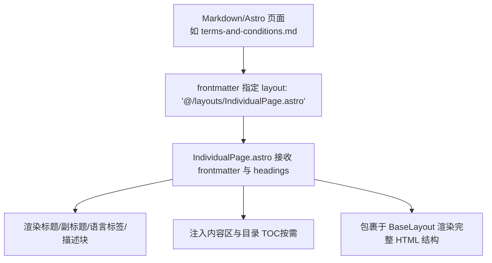
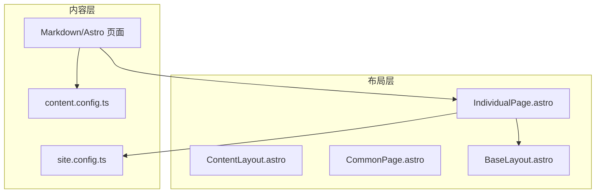
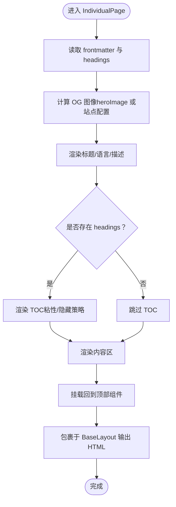
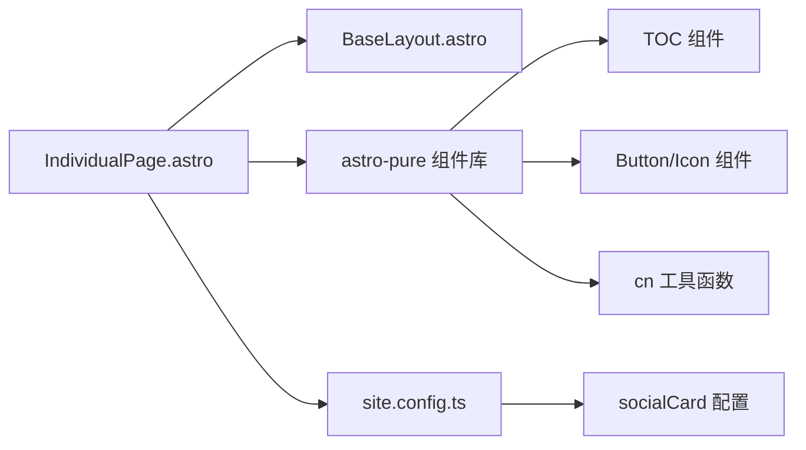

# 独立页面布局

<cite>
**本文引用的文件**
- [IndividualPage.astro](file://src/layouts/IndividualPage.astro)
- [BaseLayout.astro](file://src/layouts/BaseLayout.astro)
- [ContentLayout.astro](file://src/layouts/ContentLayout.astro)
- [CommonPage.astro](file://src/layouts/CommonPage.astro)
- [site.config.ts](file://src/site.config.ts)
- [content.config.ts](file://src/content.config.ts)
- [index.astro](file://src/pages/index.astro)
- [about/index.astro](file://src/pages/about/index.astro)
- [projects/index.astro](file://src/pages/projects/index.astro)
- [links/index.astro](file://src/pages/links/index.astro)
- [terms-and-conditions.md](file://src/pages/terms/terms-and-conditions.md)
</cite>

## 目录
1. [简介](#简介)
2. [项目结构](#项目结构)
3. [核心组件](#核心组件)
4. [架构总览](#架构总览)
5. [详细组件分析](#详细组件分析)
6. [依赖关系分析](#依赖关系分析)
7. [性能考量](#性能考量)
8. [故障排查指南](#故障排查指南)
9. [结论](#结论)
10. [附录](#附录)

## 简介
本技术文档聚焦于独立页面布局组件 IndividualPage，系统阐述其在 Astro 项目中的定位、设计目标与实现方式。IndividualPage 用于承载“不需要标准页面结构”的特殊页面，例如条款协议、隐私政策、免责声明等，强调简洁、可定制与灵活适配。文档将从架构、数据流、处理逻辑、与其他布局的差异、配置方法、使用案例与扩展建议等方面进行深入解析。

## 项目结构
IndividualPage 位于 src/layouts 目录，作为布局层的一部分，通常由 Markdown 或 Astro 页面通过 frontmatter 的 layout 字段指定使用。其典型调用路径如下：

图表来源
- [IndividualPage.astro](file://src/layouts/IndividualPage.astro#L1-L77)
- [terms-and-conditions.md](file://src/pages/terms/terms-and-conditions.md#L1-L11)

章节来源
- [IndividualPage.astro](file://src/layouts/IndividualPage.astro#L1-L77)
- [terms-and-conditions.md](file://src/pages/terms/terms-and-conditions.md#L1-L11)

## 核心组件
- IndividualPage.astro：独立页面布局的核心实现，负责接收 Markdown frontmatter 与 headings，渲染标题、语言与描述信息，按需展示目录 TOC，并将内容区交给主题排版系统。
- BaseLayout.astro：基础页面骨架，提供全局 Head、主题切换、容器结构与页脚页眉占位，确保所有页面具备一致的 HTML 结构与样式基线。
- ContentLayout.astro：通用内容布局，提供侧边栏、移动端抽屉、回到顶部等交互；IndividualPage 不强制使用侧边栏，但可复用其回顶部能力。
- CommonPage.astro：面向常规内容页的布局，支持评论、阅读统计、底部插槽等；IndividualPage 更偏向“极简”，不引入评论与统计等额外模块。
- site.config.ts：站点级配置，包括主题、集成（排版、搜索、评论、打赏等）与默认元数据，IndividualPage 会读取社交卡片与排版类名等配置。
- content.config.ts：内容集合定义与字段约束，影响 frontmatter 字段（如 title/description/language/comment 等）的可用性与校验。

章节来源
- [IndividualPage.astro](file://src/layouts/IndividualPage.astro#L1-L77)
- [BaseLayout.astro](file://src/layouts/BaseLayout.astro#L1-L92)
- [ContentLayout.astro](file://src/layouts/ContentLayout.astro#L1-L156)
- [CommonPage.astro](file://src/layouts/CommonPage.astro#L1-L34)
- [site.config.ts](file://src/site.config.ts#L1-L207)
- [content.config.ts](file://src/content.config.ts#L1-L77)

## 架构总览
IndividualPage 的整体架构围绕“最小必要结构 + 可选增强”展开，既避免了复杂布局的干扰，又保留了与主题生态的无缝衔接。

图表来源
- [IndividualPage.astro](file://src/layouts/IndividualPage.astro#L1-L77)
- [BaseLayout.astro](file://src/layouts/BaseLayout.astro#L1-L92)
- [ContentLayout.astro](file://src/layouts/ContentLayout.astro#L1-L156)
- [CommonPage.astro](file://src/layouts/CommonPage.astro#L1-L34)
- [site.config.ts](file://src/site.config.ts#L1-L207)
- [content.config.ts](file://src/content.config.ts#L1-L77)

## 详细组件分析

### IndividualPage 组件分析
- 设计目标
  - 面向“无需标准页面结构”的独立页面（如条款、隐私政策、免责声明），强调简洁与可定制。
  - 通过 frontmatter 提供标题、描述、语言、英雄图与返回链接等元信息。
  - 按需渲染目录 TOC，避免对简单页面造成冗余。
- 关键特性
  - 元信息渲染：标题、语言标签、可选描述块。
  - 内容区排版：继承主题排版类名，保证一致性。
  - 返回按钮：可自定义返回链接，默认回首页。
  - 回到顶部：复用通用组件，提升可访问性。
- 数据流与处理逻辑
  - 接收 Astro.props 中的 frontmatter 与 headings。
  - 计算社交卡片图（优先使用页面 heroImage，否则回退至站点配置）。
  - 条件渲染：当存在 headings 时显示 TOC；根据 language/description 渲染语言与描述区域。
  - 将页面内容通过 <slot /> 注入到内容区。

图表来源
- [IndividualPage.astro](file://src/layouts/IndividualPage.astro#L1-L77)

章节来源
- [IndividualPage.astro](file://src/layouts/IndividualPage.astro#L1-L77)

### 与其它布局的差异与适用场景
- 与 BaseLayout 的关系
  - BaseLayout 是所有页面的基础骨架，提供全局 Head、主题 Provider、容器结构与页脚占位；IndividualPage 在其之上进行内容层封装。
- 与 ContentLayout 的区别
  - ContentLayout 强调“通用内容页”的完整体验：侧边栏、移动端抽屉、回到顶部等；IndividualPage 则追求“轻量”，不强制侧边栏，适合短文档或声明类页面。
- 与 CommonPage 的区别
  - CommonPage 面向常规内容页，常启用评论、阅读统计、底部插槽等；IndividualPage 不引入这些模块，专注“独立页面”的简洁性。
- 适用场景
  - 条款协议类页面（如隐私政策、服务条款、版权说明）。
  - 简短说明或致谢页面。
  - 不需要侧边栏或评论系统的静态页面。

章节来源
- [BaseLayout.astro](file://src/layouts/BaseLayout.astro#L1-L92)
- [ContentLayout.astro](file://src/layouts/ContentLayout.astro#L1-L156)
- [CommonPage.astro](file://src/layouts/CommonPage.astro#L1-L34)

### 开发模式与配置方法
- 页面级配置
  - 在 Markdown/Astro 页面的 frontmatter 中设置 layout 为 '@/layouts/IndividualPage.astro'。
  - 常用字段：title、description、language、heroImage、back。
- 主题与排版配置
  - 社交卡片图：未设置 heroImage 时回退至站点配置的 socialCard。
  - 排版类名：继承站点配置 integ.typography.class，确保内容区排版风格一致。
- 使用建议
  - 对于声明类页面，尽量保持 frontmatter 简洁，仅包含必要元信息。
  - 若页面包含大量标题层级，建议提供 headings，以便生成 TOC。

章节来源
- [IndividualPage.astro](file://src/layouts/IndividualPage.astro#L1-L77)
- [site.config.ts](file://src/site.config.ts#L1-L207)
- [content.config.ts](file://src/content.config.ts#L1-L77)

### 实际使用案例
- 条款协议页面
  - 示例：terms-and-conditions.md 指定 layout 为 IndividualPage，并设置标题、描述、语言与返回链接。
- 常规内容页对比
  - about/index.astro 使用 CommonPage，提供评论与阅读统计。
  - projects/index.astro 使用 CommonPage，展示项目列表与赞助信息。
  - links/index.astro 使用 CommonPage，展示友链与时间线。
- 页面入口
  - index.astro 展示首页内容，作为站点入口之一。

章节来源
- [terms-and-conditions.md](file://src/pages/terms/terms-and-conditions.md#L1-L11)
- [about/index.astro](file://src/pages/about/index.astro#L1-L251)
- [projects/index.astro](file://src/pages/projects/index.astro#L1-L205)
- [links/index.astro](file://src/pages/links/index.astro#L1-L66)
- [index.astro](file://src/pages/index.astro)

### 扩展开发建议
- 自定义返回行为
  - 通过 frontmatter 的 back 字段控制返回链接；若为空则回首页。
- 增强元信息
  - 可在 frontmatter 中加入更多 SEO 元信息（如 keywords、canonical 等），并在 BaseLayout 中统一注入。
- 目录 TOC 的条件化
  - 当页面 headings 较少时可隐藏 TOC，减少视觉噪音。
- 主题一致性
  - 通过 site.config.ts 的 integ.typography.class 与主题变量，确保独立页面与站点整体风格一致。
- 可访问性
  - 为标题与描述区域提供语义化结构，便于屏幕阅读器识别。

章节来源
- [IndividualPage.astro](file://src/layouts/IndividualPage.astro#L1-L77)
- [BaseLayout.astro](file://src/layouts/BaseLayout.astro#L1-L92)
- [site.config.ts](file://src/site.config.ts#L1-L207)

## 依赖关系分析
IndividualPage 的依赖关系清晰，主要依赖于主题生态组件与站点配置。

图表来源
- [IndividualPage.astro](file://src/layouts/IndividualPage.astro#L1-L77)
- [BaseLayout.astro](file://src/layouts/BaseLayout.astro#L1-L92)
- [site.config.ts](file://src/site.config.ts#L1-L207)

章节来源
- [IndividualPage.astro](file://src/layouts/IndividualPage.astro#L1-L77)
- [BaseLayout.astro](file://src/layouts/BaseLayout.astro#L1-L92)
- [site.config.ts](file://src/site.config.ts#L1-L207)

## 性能考量
- 轻量化渲染：IndividualPage 不加载评论、统计等额外模块，减少首屏渲染负担。
- 条件化 TOC：仅在存在 headings 时渲染 TOC，避免无意义的 DOM 结构。
- 配置驱动：通过站点配置统一管理排版与社交卡片，减少重复计算与资源请求。
- 建议：对声明类页面尽量保持内容简洁，避免大体量图片与复杂交互，以获得更佳的加载体验。

## 故障排查指南
- 页面未显示标题或描述
  - 检查 frontmatter 是否正确设置 title/description/language。
- TOC 未出现
  - 确认 Markdown 页面是否包含足够的标题层级，使 headings 生效。
- 社交卡片未生效
  - 若未设置 heroImage，请确认 site.config.ts 中 socialCard 配置有效。
- 返回按钮链接异常
  - 检查 frontmatter 的 back 字段是否为有效 URL；为空时默认回首页。

章节来源
- [IndividualPage.astro](file://src/layouts/IndividualPage.astro#L1-L77)
- [site.config.ts](file://src/site.config.ts#L1-L207)

## 结论
IndividualPage 以“最小必要结构 + 可选增强”为核心理念，为独立页面提供了高灵活性与强可定制性的布局方案。它与 BaseLayout、ContentLayout、CommonPage 形成层次分明的布局体系，既能满足声明类页面的简洁需求，又能与主题生态无缝衔接。通过合理的 frontmatter 配置与站点配置，开发者可以快速构建高质量的独立页面，并在此基础上进行扩展与优化。

## 附录
- 相关文件清单
  - 布局：IndividualPage.astro、BaseLayout.astro、ContentLayout.astro、CommonPage.astro
  - 配置：site.config.ts、content.config.ts
  - 页面示例：terms-and-conditions.md、about/index.astro、projects/index.astro、links/index.astro、index.astro