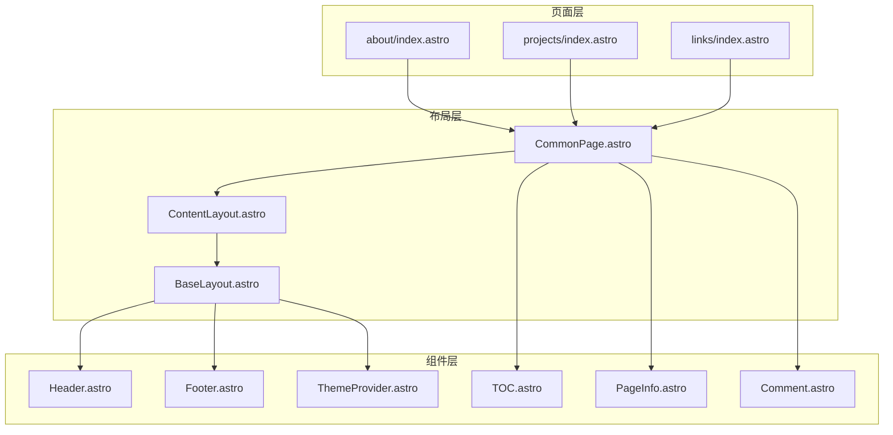
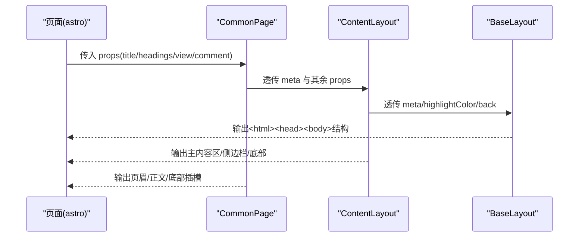
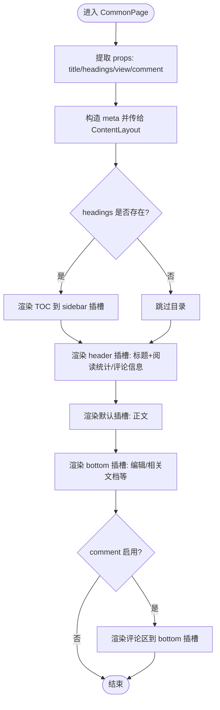
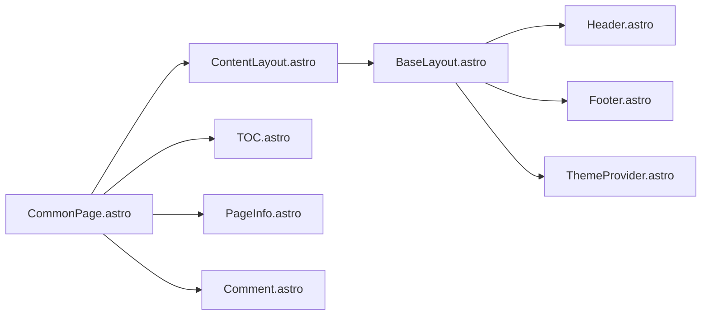

# 通用页面布局

<cite>
**本文引用的文件**   
- [src/layouts/CommonPage.astro](file://src/layouts/CommonPage.astro)
- [src/layouts/BaseLayout.astro](file://src/layouts/BaseLayout.astro)
- [src/layouts/ContentLayout.astro](file://src/layouts/ContentLayout.astro)
- [src/layouts/IndividualPage.astro](file://src/layouts/IndividualPage.astro)
- [packages/pure/components/basic/Header.astro](file://packages/pure/components/basic/Header.astro)
- [packages/pure/components/basic/Footer.astro](file://packages/pure/components/basic/Footer.astro)
- [packages/pure/components/basic/ThemeProvider.astro](file://packages/pure/components/basic/ThemeProvider.astro)
- [packages/pure/components/pages/TOC.astro](file://packages/pure/components/pages/TOC.astro)
- [packages/pure/components/pages/PFSearch.astro](file://packages/pure/components/pages/PFSearch.astro)
- [packages/pure/components/pages/ArticleBottom.astro](file://packages/pure/components/pages/ArticleBottom.astro)
- [src/components/waline/PageInfo.astro](file://src/components/waline/PageInfo.astro)
- [src/components/waline/Comment.astro](file://src/components/waline/Comment.astro)
- [packages/pure/types/index.ts](file://packages/pure/types/index.ts)
- [src/pages/about/index.astro](file://src/pages/about/index.astro)
- [src/pages/projects/index.astro](file://src/pages/projects/index.astro)
- [src/pages/links/index.astro](file://src/pages/links/index.astro)
</cite>

## 目录
1. [简介](#简介)
2. [项目结构](#项目结构)
3. [核心组件](#核心组件)
4. [架构总览](#架构总览)
5. [详细组件分析](#详细组件分析)
6. [依赖分析](#依赖分析)
7. [性能考虑](#性能考虑)
8. [故障排查指南](#故障排查指南)
9. [结论](#结论)
10. [附录](#附录)

## 简介
本文件为通用页面布局组件“CommonPage”的全面技术文档。CommonPage旨在提供统一、可复用的页面骨架，简化页面开发流程，统一页面结构与样式基础。它通过组合基础布局与内容布局，并内置目录导航、阅读统计与评论等常用能力，帮助开发者以最少的样板代码实现高质量页面。

CommonPage的典型使用场景包括：个人介绍页、项目展示页、链接页、文档页等需要统一头部、侧边栏、底部区域与评论系统的页面。通过插槽系统与参数配置，CommonPage既能满足静态内容页，也能适配带目录与交互功能的长文页面。

## 项目结构
CommonPage位于 src/layouts 目录下，作为页面级布局组件，通常由具体页面直接引入并渲染。其上层依赖 ContentLayout 与 BaseLayout，底层依赖主题与组件库中的基础组件（如 Header、Footer、ThemeProvider）以及第三方组件（如 TOC、Waline 评论）。

图表来源
- [src/pages/about/index.astro](file://src/pages/about/index.astro#L1-L251)
- [src/pages/projects/index.astro](file://src/pages/projects/index.astro#L1-L205)
- [src/pages/links/index.astro](file://src/pages/links/index.astro#L1-L66)
- [src/layouts/CommonPage.astro](file://src/layouts/CommonPage.astro#L1-L34)
- [src/layouts/ContentLayout.astro](file://src/layouts/ContentLayout.astro#L1-L156)
- [src/layouts/BaseLayout.astro](file://src/layouts/BaseLayout.astro#L1-L92)
- [packages/pure/components/basic/Header.astro](file://packages/pure/components/basic/Header.astro#L1-L209)
- [packages/pure/components/basic/Footer.astro](file://packages/pure/components/basic/Footer.astro#L1-L91)
- [packages/pure/components/basic/ThemeProvider.astro](file://packages/pure/components/basic/ThemeProvider.astro#L1-L41)
- [packages/pure/components/pages/TOC.astro](file://packages/pure/components/pages/TOC.astro#L1-L136)
- [src/components/waline/PageInfo.astro](file://src/components/waline/PageInfo.astro#L1-L31)
- [src/components/waline/Comment.astro](file://src/components/waline/Comment.astro#L1-L167)

章节来源
- [src/layouts/CommonPage.astro](file://src/layouts/CommonPage.astro#L1-L34)
- [src/layouts/ContentLayout.astro](file://src/layouts/ContentLayout.astro#L1-L156)
- [src/layouts/BaseLayout.astro](file://src/layouts/BaseLayout.astro#L1-L92)

## 核心组件
- CommonPage：页面级通用布局，负责标题、目录、页眉插槽、正文插槽、底部插槽与评论区的统一组织。
- ContentLayout：内容级布局，提供返回按钮、主内容区、侧边栏、底部区域、移动端侧边栏开关等。
- BaseLayout：基础布局，封装全局样式、主题切换、头部与底部组件、安全边距等。
- TOC：目录生成与高亮滚动进度，支持平滑跳转与阅读进度可视化。
- Waline 组件：阅读统计与评论系统，支持按路径统计浏览量与评论数，以及初始化评论区。

章节来源
- [src/layouts/CommonPage.astro](file://src/layouts/CommonPage.astro#L1-L34)
- [src/layouts/ContentLayout.astro](file://src/layouts/ContentLayout.astro#L1-L156)
- [src/layouts/BaseLayout.astro](file://src/layouts/BaseLayout.astro#L1-L92)
- [packages/pure/components/pages/TOC.astro](file://packages/pure/components/pages/TOC.astro#L1-L136)
- [src/components/waline/PageInfo.astro](file://src/components/waline/PageInfo.astro#L1-L31)
- [src/components/waline/Comment.astro](file://src/components/waline/Comment.astro#L1-L167)

## 架构总览
CommonPage采用“页面布局 → 内容布局 → 基础布局”的层级化设计，通过插槽系统将页面内容与通用 UI 结构解耦。页面传入标题与可选的 Markdown 目录，CommonPage 负责在合适位置插入目录与页眉信息，并将正文与底部内容交由 ContentLayout 渲染。

图表来源
- [src/layouts/CommonPage.astro](file://src/layouts/CommonPage.astro#L15-L33)
- [src/layouts/ContentLayout.astro](file://src/layouts/ContentLayout.astro#L15-L75)
- [src/layouts/BaseLayout.astro](file://src/layouts/BaseLayout.astro#L17-L91)

## 详细组件分析

### CommonPage 组件
- 角色定位：页面级通用布局，负责标题、目录、页眉与评论区的统一组织。
- 参数配置：
  - title：页面标题，用于 meta 与页眉显示。
  - headings：Markdown 目录数组，用于生成侧边栏目录。
  - view：是否显示阅读统计。
  - comment：是否启用评论区。
- 插槽系统：
  - header：页眉区域，常放置标题与阅读统计/评论入口。
  - 默认插槽：正文内容。
  - bottom：底部区域，常放置编辑链接、相关文档、分页等。
  - bottom-sidebar：底部侧边栏，常放置相关链接或工具。
- 处理逻辑：
  - 将标题注入 meta 并传递给 ContentLayout。
  - 若存在目录，则在 sidebar 插槽中渲染 TOC。
  - 在 header 插槽中渲染标题与阅读统计/评论信息。
  - 在默认插槽中渲染正文。
  - 在 bottom 插槽中根据 comment 条件渲染评论区。

图表来源
- [src/layouts/CommonPage.astro](file://src/layouts/CommonPage.astro#L15-L33)

章节来源
- [src/layouts/CommonPage.astro](file://src/layouts/CommonPage.astro#L8-L33)

### ContentLayout 组件
- 角色定位：内容级布局，提供返回按钮、主内容区、侧边栏、底部区域与移动端侧边栏开关。
- 关键点：
  - 返回按钮：可自定义返回地址，默认回首页。
  - 侧边栏：固定/粘性布局，移动端支持抽屉式展开。
  - 底部区域：分为内容区与侧边栏两列，便于放置相关文档或工具。
  - 移动端交互：通过按钮切换侧边栏显隐，并配合遮罩层提升交互体验。
  - 字体与排版：结合站点集成配置，统一内容区排版类名。

章节来源
- [src/layouts/ContentLayout.astro](file://src/layouts/ContentLayout.astro#L9-L75)

### BaseLayout 组件
- 角色定位：基础布局，负责全局样式、主题切换、头部与底部组件、安全边距等。
- 关键点：
  - 全局样式：引入全局与应用样式，确保所有页面一致。
  - 主题切换：内联脚本快速设置主题，避免闪烁；支持监听主题变更事件。
  - 头部与底部：注入 Header、Footer 组件，统一站点品牌与版权信息。
  - 安全边距：针对特殊屏幕（如刘海屏）自动扩展容器内边距。
  - 高亮色变量：通过 define:vars 注入高亮色，供全局样式使用。

章节来源
- [src/layouts/BaseLayout.astro](file://src/layouts/BaseLayout.astro#L1-L92)
- [packages/pure/components/basic/Header.astro](file://packages/pure/components/basic/Header.astro#L1-L209)
- [packages/pure/components/basic/Footer.astro](file://packages/pure/components/basic/Footer.astro#L1-L91)
- [packages/pure/components/basic/ThemeProvider.astro](file://packages/pure/components/basic/ThemeProvider.astro#L1-L41)

### 目录组件 TOC
- 功能：基于 Markdown 目录生成侧边栏目录，支持滚动高亮与平滑跳转。
- 关键点：
  - 读取 headings 并生成目录树。
  - 通过 IntersectionObserver 与滚动事件计算当前阅读进度，动态高亮对应条目。
  - 点击目录项时平滑滚动至目标标题，并同步 URL hash。

章节来源
- [packages/pure/components/pages/TOC.astro](file://packages/pure/components/pages/TOC.astro#L1-L136)

### 评论与阅读统计
- 阅读统计：PageInfo 组件按当前路径展示浏览量与评论数。
- 评论系统：Comment 组件在启用时初始化 Waline，支持表情、反应按钮与主题适配。
- 集成方式：CommonPage 通过插槽将评论区挂载到底部，同时在页眉显示阅读统计/评论入口。

章节来源
- [src/components/waline/PageInfo.astro](file://src/components/waline/PageInfo.astro#L5-L31)
- [src/components/waline/Comment.astro](file://src/components/waline/Comment.astro#L21-L167)

### 页面使用示例
- 个人介绍页：演示标题、目录、多段落内容与底部插槽的组合使用。
- 项目展示页：演示阅读统计、项目卡片、折叠块与底部赞助信息。
- 链接页：演示评论区、折叠块、时间线与底部插槽。

章节来源
- [src/pages/about/index.astro](file://src/pages/about/index.astro#L16-L250)
- [src/pages/projects/index.astro](file://src/pages/projects/index.astro#L22-L184)
- [src/pages/links/index.astro](file://src/pages/links/index.astro#L20-L65)

## 依赖分析
CommonPage 的依赖关系清晰，遵循“页面布局 → 内容布局 → 基础布局”的层级化设计，同时通过组件库与第三方组件增强功能。

图表来源
- [src/layouts/CommonPage.astro](file://src/layouts/CommonPage.astro#L4-L6)
- [src/layouts/ContentLayout.astro](file://src/layouts/ContentLayout.astro#L2-L6)
- [src/layouts/BaseLayout.astro](file://src/layouts/BaseLayout.astro#L2-L5)
- [packages/pure/components/pages/TOC.astro](file://packages/pure/components/pages/TOC.astro#L1-L6)
- [src/components/waline/PageInfo.astro](file://src/components/waline/PageInfo.astro#L1-L4)
- [src/components/waline/Comment.astro](file://src/components/waline/Comment.astro#L1-L7)

章节来源
- [src/layouts/CommonPage.astro](file://src/layouts/CommonPage.astro#L4-L6)
- [src/layouts/ContentLayout.astro](file://src/layouts/ContentLayout.astro#L2-L6)
- [src/layouts/BaseLayout.astro](file://src/layouts/BaseLayout.astro#L2-L5)

## 性能考虑
- 目录高亮与滚动监听：TOC 使用滚动事件与定时器进行进度计算，建议在长文场景谨慎开启或在移动端禁用不必要的高亮效果，以减少重绘频率。
- 评论初始化：Comment 组件在连接时初始化外部库，建议在首屏尽量延迟加载非关键资源，避免阻塞主线程。
- 主题切换：BaseLayout 采用内联脚本快速设置主题，避免闪烁；但需注意在 SSR 场景下确保客户端脚本执行顺序正确。
- 移动端侧边栏：ContentLayout 的侧边栏抽屉在小屏设备上会增加 DOM 与动画开销，建议仅在需要时渲染并及时移除。

## 故障排查指南
- 评论未显示
  - 检查站点集成配置中评论系统是否启用。
  - 确认页面已传入 comment 参数并渲染底部插槽。
- 目录不生效
  - 确保页面向 CommonPage 传入 headings 数组。
  - 检查 ContentLayout 的 sidebar 插槽是否被覆盖。
- 阅读统计不更新
  - 确认 PageInfo 组件的路径与当前页面一致。
  - 检查后端统计服务是否正常。
- 主题切换异常
  - 确认 BaseLayout 中的主题初始化脚本是否执行。
  - 检查浏览器本地存储中主题状态与系统偏好设置。

章节来源
- [src/components/waline/Comment.astro](file://src/components/waline/Comment.astro#L11-L19)
- [src/components/waline/PageInfo.astro](file://src/components/waline/PageInfo.astro#L13-L28)
- [src/layouts/BaseLayout.astro](file://src/layouts/BaseLayout.astro#L6-L21)

## 结论
CommonPage 通过参数化与插槽系统，将页面标题、目录、页眉信息、正文与底部区域进行统一编排，显著降低页面开发成本。结合 ContentLayout 的内容区布局与 BaseLayout 的基础结构，形成从页面到内容再到基础样式的完整体系。配合 TOC、阅读统计与评论系统，CommonPage 能够覆盖大多数静态与半动态页面的需求，适合在文档站、博客与知识库场景中广泛复用。

## 附录

### 参数与插槽参考
- 参数
  - title：页面标题（必填）
  - headings：Markdown 目录数组（可选）
  - view：是否显示阅读统计（可选）
  - comment：是否启用评论（可选）
- 插槽
  - header：页眉区域
  - 默认插槽：正文内容
  - bottom：底部区域
  - bottom-sidebar：底部侧边栏

章节来源
- [src/layouts/CommonPage.astro](file://src/layouts/CommonPage.astro#L8-L33)

### 常见使用场景与最佳实践
- 文档页：传入 headings 以启用侧边栏目录；在 bottom 插槽放置编辑链接与相关文档。
- 博客页：传入 headings 与 comment；在 header 插槽显示标题与阅读统计。
- 介绍页：无需目录，仅传入 title 与 comment；在 bottom 插槽放置社交信息与联系方式。
- 项目页：传入 view 与 comment；在 bottom 插槽放置赞助与致谢信息。

章节来源
- [src/pages/about/index.astro](file://src/pages/about/index.astro#L16-L250)
- [src/pages/projects/index.astro](file://src/pages/projects/index.astro#L22-L184)
- [src/pages/links/index.astro](file://src/pages/links/index.astro#L20-L65)

### 自定义扩展与主题适配
- 扩展插槽内容：在 header/bottom/bottom-sidebar 插槽中注入业务组件（如编辑按钮、分页器、相关文档列表）。
- 目录样式：通过 TOC 组件的 class 属性与自定义样式覆盖目录外观。
- 主题颜色：通过 BaseLayout 的 highlightColor 变量与全局 CSS 变量调整高亮色系。
- 评论样式：通过 Comment 组件的样式块覆盖评论区主题变量，适配深浅色模式。

章节来源
- [src/layouts/ContentLayout.astro](file://src/layouts/ContentLayout.astro#L103-L155)
- [src/layouts/BaseLayout.astro](file://src/layouts/BaseLayout.astro#L52-L89)
- [packages/pure/components/pages/TOC.astro](file://packages/pure/components/pages/TOC.astro#L131-L136)
- [src/components/waline/Comment.astro](file://src/components/waline/Comment.astro#L64-L166)