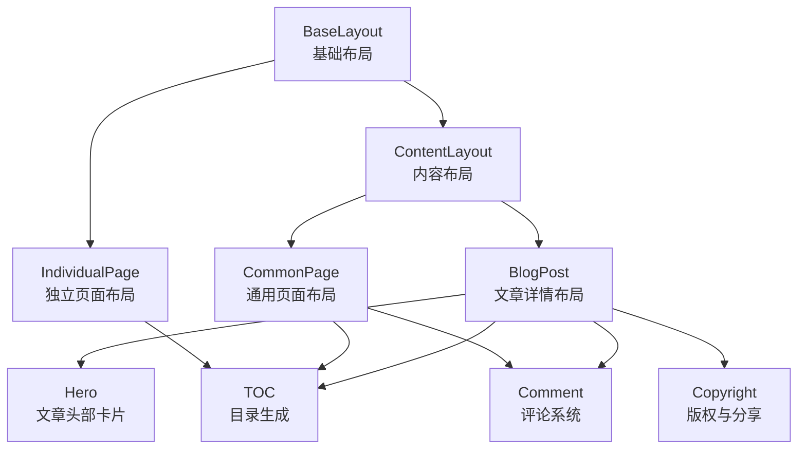
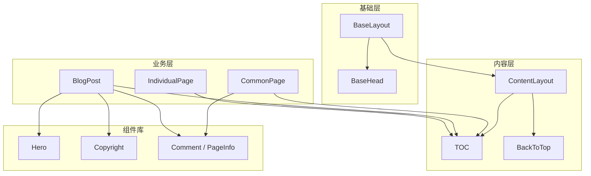
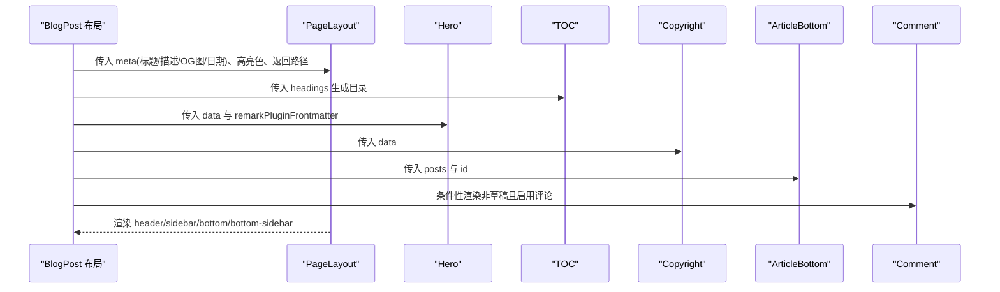
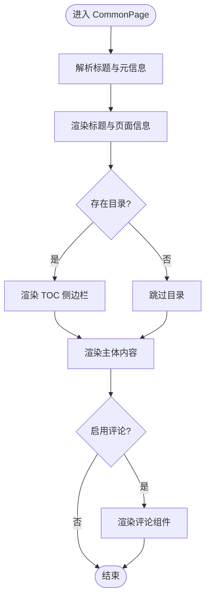
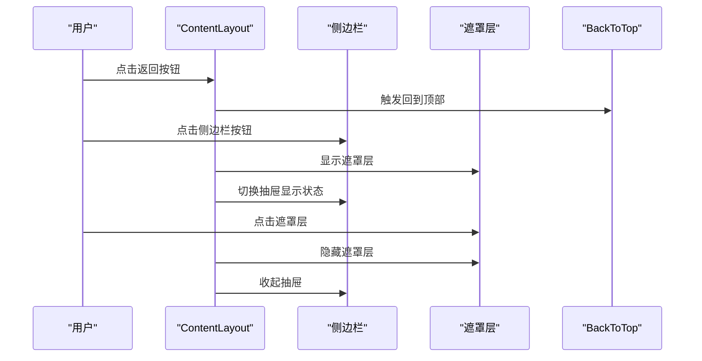
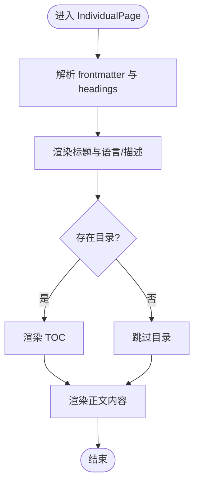
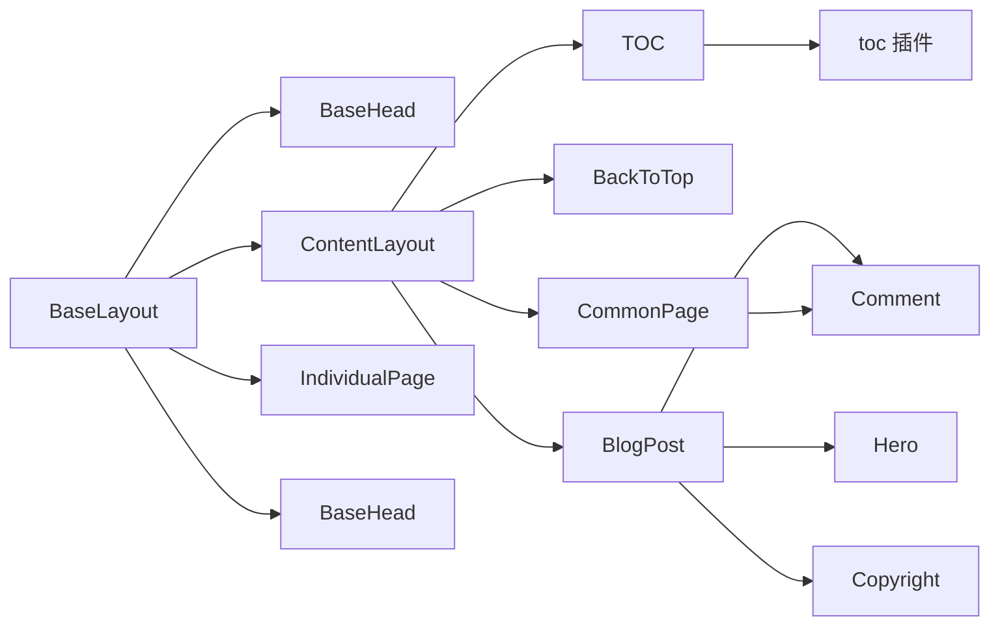

# 页面布局组件

<cite>
**本文引用的文件**
- [src/layouts/BaseLayout.astro](file://src/layouts/BaseLayout.astro)
- [src/layouts/ContentLayout.astro](file://src/layouts/ContentLayout.astro)
- [src/layouts/CommonPage.astro](file://src/layouts/CommonPage.astro)
- [src/layouts/BlogPost.astro](file://src/layouts/BlogPost.astro)
- [src/layouts/IndividualPage.astro](file://src/layouts/IndividualPage.astro)
- [packages/pure/components/pages/index.ts](file://packages/pure/components/pages/index.ts)
- [packages/pure/components/pages/Hero.astro](file://packages/pure/components/pages/Hero.astro)
- [packages/pure/components/pages/TOC.astro](file://packages/pure/components/pages/TOC.astro)
- [packages/pure/components/pages/Copyright.astro](file://packages/pure/components/pages/Copyright.astro)
- [packages/pure/types/index.ts](file://packages/pure/types/index.ts)
- [packages/pure/plugins/toc.ts](file://packages/pure/plugins/toc.ts)
- [src/components/BaseHead.astro](file://src/components/BaseHead.astro)
- [src/components/waline/Comment.astro](file://src/components/waline/Comment.astro)
- [src/components/waline/PageInfo.astro](file://src/components/waline/PageInfo.astro)
- [src/site.config.ts](file://src/site.config.ts)
</cite>

## 目录
1. [引言](#引言)
2. [项目结构](#项目结构)
3. [核心组件](#核心组件)
4. [架构总览](#架构总览)
5. [详细组件分析](#详细组件分析)
6. [依赖关系分析](#依赖关系分析)
7. [性能考量](#性能考量)
8. [故障排查指南](#故障排查指南)
9. [结论](#结论)
10. [附录](#附录)

## 引言
本技术文档聚焦于页面布局组件体系，系统性阐述以下布局组件的设计目标、参数配置、插槽使用与组合模式：
- BlogPost 布局：专为文章详情页打造，涵盖文章元数据展示、目录生成、评论集成与推荐模块。
- CommonPage 布局：通用页面处理模式，强调标题、目录与可选评论的复用能力。
- ContentLayout 布局：内容页面处理机制，提供侧边栏、底部区域与返回按钮等通用结构，并内置移动端侧边栏交互。
- IndividualPage 布局：独立页面设计，适用于非文章类内容（如“关于”、“归档”等），支持语言、描述与社交图等元信息。

同时提供布局选择指南与自定义开发建议，帮助读者在不同场景下正确选用与扩展布局组件。

## 项目结构
页面布局组件位于 src/layouts 下，围绕 BaseLayout 进行分层封装：
- BaseLayout：全局基础布局，注入 Head 元信息、主题提供者与容器结构。
- ContentLayout：在 BaseLayout 基础上增加内容区、侧边栏、底部区域与返回按钮，并实现移动端侧边栏交互。
- CommonPage：面向通用页面的轻量封装，内含标题、目录与评论等可选功能。
- BlogPost：面向文章详情页的完整布局，整合 Hero、TOC、版权与评论等模块。
- IndividualPage：面向独立页面的布局，强调标题、描述与可选语言标签。

图表来源
- [src/layouts/BaseLayout.astro](file://src/layouts/BaseLayout.astro#L1-L92)
- [src/layouts/ContentLayout.astro](file://src/layouts/ContentLayout.astro#L1-L156)
- [src/layouts/CommonPage.astro](file://src/layouts/CommonPage.astro#L1-L34)
- [src/layouts/BlogPost.astro](file://src/layouts/BlogPost.astro#L1-L75)
- [src/layouts/IndividualPage.astro](file://src/layouts/IndividualPage.astro#L1-L77)
- [packages/pure/components/pages/Hero.astro](file://packages/pure/components/pages/Hero.astro#L1-L147)
- [packages/pure/components/pages/TOC.astro](file://packages/pure/components/pages/TOC.astro#L1-L136)
- [packages/pure/components/pages/Copyright.astro](file://packages/pure/components/pages/Copyright.astro#L1-L151)
- [src/components/waline/Comment.astro](file://src/components/waline/Comment.astro#L1-L167)

章节来源
- [src/layouts/BaseLayout.astro](file://src/layouts/BaseLayout.astro#L1-L92)
- [src/layouts/ContentLayout.astro](file://src/layouts/ContentLayout.astro#L1-L156)
- [src/layouts/CommonPage.astro](file://src/layouts/CommonPage.astro#L1-L34)
- [src/layouts/BlogPost.astro](file://src/layouts/BlogPost.astro#L1-L75)
- [src/layouts/IndividualPage.astro](file://src/layouts/IndividualPage.astro#L1-L77)

## 核心组件
本节概述各布局组件的关键职责与适用场景：
- BaseLayout：负责注入站点元信息（标题、描述、OG 图、作者等）、主题切换与全局样式占位，是所有页面布局的根容器。
- ContentLayout：在 BaseLayout 上提供内容区主结构，包含侧边栏、正文、底部区域与返回按钮；内置移动端侧边栏开关与动画。
- CommonPage：面向通用页面（如“关于”、“标签页”）的轻量布局，支持标题、目录与评论。
- BlogPost：面向文章详情页的完整布局，整合 Hero、TOC、版权、推荐与评论；根据草稿状态与配置决定是否启用评论。
- IndividualPage：面向独立页面（如“关于”、“归档”）的布局，支持标题、描述、语言与社交图等元信息。

章节来源
- [src/layouts/BaseLayout.astro](file://src/layouts/BaseLayout.astro#L1-L92)
- [src/layouts/ContentLayout.astro](file://src/layouts/ContentLayout.astro#L1-L156)
- [src/layouts/CommonPage.astro](file://src/layouts/CommonPage.astro#L1-L34)
- [src/layouts/BlogPost.astro](file://src/layouts/BlogPost.astro#L1-L75)
- [src/layouts/IndividualPage.astro](file://src/layouts/IndividualPage.astro#L1-L77)

## 架构总览
整体架构采用“基础布局 + 内容布局 + 业务布局”的分层设计，通过插槽与属性传递实现高内聚、低耦合的可复用布局体系。

图表来源
- [src/layouts/BaseLayout.astro](file://src/layouts/BaseLayout.astro#L1-L92)
- [src/components/BaseHead.astro](file://src/components/BaseHead.astro#L1-L77)
- [src/layouts/ContentLayout.astro](file://src/layouts/ContentLayout.astro#L1-L156)
- [packages/pure/components/pages/TOC.astro](file://packages/pure/components/pages/TOC.astro#L1-L136)
- [src/layouts/CommonPage.astro](file://src/layouts/CommonPage.astro#L1-L34)
- [src/layouts/BlogPost.astro](file://src/layouts/BlogPost.astro#L1-L75)
- [packages/pure/components/pages/Hero.astro](file://packages/pure/components/pages/Hero.astro#L1-L147)
- [packages/pure/components/pages/Copyright.astro](file://packages/pure/components/pages/Copyright.astro#L1-L151)
- [src/components/waline/Comment.astro](file://src/components/waline/Comment.astro#L1-L167)
- [src/components/waline/PageInfo.astro](file://src/components/waline/PageInfo.astro#L1-L31)
- [src/layouts/IndividualPage.astro](file://src/layouts/IndividualPage.astro#L1-L77)

## 详细组件分析

### BlogPost 布局
- 设计目标：为文章详情页提供完整的元数据展示、目录生成、版权与推荐、评论集成等能力。
- 关键参数与行为
  - 输入属性：post、posts、headings、remarkPluginFrontmatter。
  - 元数据：从 frontmatter 中提取标题、描述、发布时间、更新时间、草稿标记与评论开关；社交图优先使用文章 heroImage，否则回退到站点配置。
  - 结构组织：通过 PageLayout 注入 meta 与高亮色；在 header 插槽中放置 Hero；侧边栏插槽放置 TOC；底部插槽放置版权、推荐与评论；支持 bottom-sidebar 插槽。
  - 功能细节：草稿状态下禁用评论；根据配置决定是否加载 MediumZoom。
- 插槽与组合
  - header：放置 Hero，可在其描述插槽中嵌入页面浏览/评论统计。
  - sidebar：放置 TOC。
  - bottom：放置版权、推荐与评论。
  - bottom-sidebar：预留扩展位。
- 与组件协作
  - Hero：展示文章头图、日期、阅读时长、语言与标签等。
  - TOC：基于 Markdown headings 生成目录并高亮当前阅读段落。
  - Copyright：提供复制链接、二维码、分享与版权声明。
  - Comment：按站点配置初始化 Waline 评论系统。

图表来源
- [src/layouts/BlogPost.astro](file://src/layouts/BlogPost.astro#L1-L75)
- [src/layouts/ContentLayout.astro](file://src/layouts/ContentLayout.astro#L1-L156)
- [packages/pure/components/pages/Hero.astro](file://packages/pure/components/pages/Hero.astro#L1-L147)
- [packages/pure/components/pages/TOC.astro](file://packages/pure/components/pages/TOC.astro#L1-L136)
- [packages/pure/components/pages/Copyright.astro](file://packages/pure/components/pages/Copyright.astro#L1-L151)
- [src/components/waline/Comment.astro](file://src/components/waline/Comment.astro#L1-L167)

章节来源
- [src/layouts/BlogPost.astro](file://src/layouts/BlogPost.astro#L1-L75)
- [packages/pure/components/pages/Hero.astro](file://packages/pure/components/pages/Hero.astro#L1-L147)
- [packages/pure/components/pages/TOC.astro](file://packages/pure/components/pages/TOC.astro#L1-L136)
- [packages/pure/components/pages/Copyright.astro](file://packages/pure/components/pages/Copyright.astro#L1-L151)
- [src/components/waline/Comment.astro](file://src/components/waline/Comment.astro#L1-L167)

### CommonPage 布局
- 设计目标：为通用页面提供统一的标题、目录与评论入口，强调可复用性与最小化样板代码。
- 关键参数与行为
  - 输入属性：title、headings、view、comment。
  - 结构组织：通过 PageLayout 注入 meta；在 header 插槽中渲染标题与页面浏览/评论统计；支持 TOC 侧边栏；默认底部插槽可挂载评论。
- 插槽与组合
  - header：放置标题与页面信息（浏览数/评论数）。
  - sidebar：放置 TOC。
  - bottom：默认挂载评论，也可由外部覆盖。
  - bottom-sidebar：预留扩展位。

图表来源
- [src/layouts/CommonPage.astro](file://src/layouts/CommonPage.astro#L1-L34)
- [src/layouts/ContentLayout.astro](file://src/layouts/ContentLayout.astro#L1-L156)
- [packages/pure/components/pages/TOC.astro](file://packages/pure/components/pages/TOC.astro#L1-L136)
- [src/components/waline/Comment.astro](file://src/components/waline/Comment.astro#L1-L167)

章节来源
- [src/layouts/CommonPage.astro](file://src/layouts/CommonPage.astro#L1-L34)

### ContentLayout 布局
- 设计目标：提供内容页面的通用结构与交互，包括侧边栏、正文、底部区域与返回按钮；内置移动端侧边栏开关与动画。
- 关键参数与行为
  - 输入属性：meta、highlightColor、back。
  - 结构组织：顶部返回按钮；主内容区分为侧边栏与文章区；底部区分为内容与侧边栏；提供 BackToTop 按钮与自定义图标插槽。
  - 移动端交互：通过脚本控制侧边栏显示/隐藏与遮罩层；侧边栏在小屏设备上以抽屉形式呈现。
- 插槽与组合
  - header：内容头部（如标题、副标题、元信息）。
  - sidebar：目录或导航等侧边内容。
  - 默认插槽：正文内容。
  - bottom：内容区下方区域。
  - bottom-sidebar：底部侧边栏。
- 与组件协作
  - BackToTop：滚动至顶部并支持自定义图标插槽。
  - TOC：可直接复用目录组件。

图表来源
- [src/layouts/ContentLayout.astro](file://src/layouts/ContentLayout.astro#L1-L156)

章节来源
- [src/layouts/ContentLayout.astro](file://src/layouts/ContentLayout.astro#L1-L156)

### IndividualPage 布局
- 设计目标：为独立页面（如“关于”、“归档”）提供简洁的标题、描述、语言与社交图等元信息展示。
- 关键参数与行为
  - 输入属性：frontmatter（title/description/heroImage/language/back）与 headings。
  - 结构组织：通过 BaseLayout 注入 meta；主内容区包含标题、语言与描述等；根据 headings 是否为空决定是否渲染 TOC；提供返回按钮与回到顶部。
- 插槽与组合
  - 默认插槽：正文内容。
  - 与 ContentLayout 的差异：不使用 ContentLayout 的复杂插槽体系，而是直接在 BaseLayout 上渲染。

图表来源
- [src/layouts/IndividualPage.astro](file://src/layouts/IndividualPage.astro#L1-L77)

章节来源
- [src/layouts/IndividualPage.astro](file://src/layouts/IndividualPage.astro#L1-L77)

### 组件与类型定义
- 类型定义
  - SiteMeta：统一的站点元信息接口，包含标题、描述、OG 图与文章日期。
- 组件导出
  - 页面组件集合：Hero、TOC、Copyright、ArticleBottom、BackToTop 等。

章节来源
- [packages/pure/types/index.ts](file://packages/pure/types/index.ts#L7-L12)
- [packages/pure/components/pages/index.ts](file://packages/pure/components/pages/index.ts#L1-L10)

## 依赖关系分析
- 布局层级依赖
  - BaseLayout 是所有布局的根容器，负责全局 Head 与主题注入。
  - ContentLayout 在 BaseLayout 基础上提供内容区结构与交互。
  - CommonPage 与 BlogPost 均基于 ContentLayout 或 BaseLayout 进行二次封装。
  - IndividualPage 直接基于 BaseLayout。
- 组件依赖
  - BlogPost 依赖 Hero、TOC、Copyright、ArticleBottom 与 Comment。
  - CommonPage 依赖 TOC 与 Comment。
  - TOC 依赖 toc 插件生成目录树并提供高亮与滚动进度反馈。
  - BaseHead 负责生成标准 SEO 元信息与社交图。
  - Waline 评论系统通过 Comment 与 PageInfo 组件集成。

图表来源
- [src/layouts/BaseLayout.astro](file://src/layouts/BaseLayout.astro#L1-L92)
- [src/components/BaseHead.astro](file://src/components/BaseHead.astro#L1-L77)
- [src/layouts/ContentLayout.astro](file://src/layouts/ContentLayout.astro#L1-L156)
- [src/layouts/CommonPage.astro](file://src/layouts/CommonPage.astro#L1-L34)
- [src/layouts/BlogPost.astro](file://src/layouts/BlogPost.astro#L1-L75)
- [src/layouts/IndividualPage.astro](file://src/layouts/IndividualPage.astro#L1-L77)
- [packages/pure/components/pages/TOC.astro](file://packages/pure/components/pages/TOC.astro#L1-L136)
- [packages/pure/plugins/toc.ts](file://packages/pure/plugins/toc.ts#L1-L200)
- [src/components/waline/Comment.astro](file://src/components/waline/Comment.astro#L1-L167)

章节来源
- [src/layouts/BaseLayout.astro](file://src/layouts/BaseLayout.astro#L1-L92)
- [src/layouts/ContentLayout.astro](file://src/layouts/ContentLayout.astro#L1-L156)
- [src/layouts/CommonPage.astro](file://src/layouts/CommonPage.astro#L1-L34)
- [src/layouts/BlogPost.astro](file://src/layouts/BlogPost.astro#L1-L75)
- [src/layouts/IndividualPage.astro](file://src/layouts/IndividualPage.astro#L1-L77)
- [packages/pure/components/pages/TOC.astro](file://packages/pure/components/pages/TOC.astro#L1-L136)
- [packages/pure/plugins/toc.ts](file://packages/pure/plugins/toc.ts#L1-L200)
- [src/components/BaseHead.astro](file://src/components/BaseHead.astro#L1-L77)
- [src/components/waline/Comment.astro](file://src/components/waline/Comment.astro#L1-L167)

## 性能考量
- 目录生成与滚动高亮
  - TOC 组件在连接时注册滚动监听并定时更新高亮状态，建议在长文场景下谨慎使用，避免频繁重排。
  - 可通过 toc 插件生成目录树，减少运行时计算开销。
- 图片与社交图
  - Hero 头图采用预加载与模糊背景增强首屏体验；社交图优先使用文章 heroImage，否则回退站点配置，避免重复请求。
- 评论系统
  - Comment 组件仅在站点配置启用时渲染；初始化过程涉及外部资源加载，建议在文章详情页按需启用。
- 主题与高亮色
  - BaseLayout 支持 highlightColor，通过 CSS 变量注入高亮效果，避免额外 JS 计算。

章节来源
- [packages/pure/components/pages/TOC.astro](file://packages/pure/components/pages/TOC.astro#L1-L136)
- [packages/pure/plugins/toc.ts](file://packages/pure/plugins/toc.ts#L1-L200)
- [packages/pure/components/pages/Hero.astro](file://packages/pure/components/pages/Hero.astro#L1-L147)
- [src/components/waline/Comment.astro](file://src/components/waline/Comment.astro#L1-L167)
- [src/layouts/BaseLayout.astro](file://src/layouts/BaseLayout.astro#L1-L92)

## 故障排查指南
- 目录未高亮或点击无反应
  - 检查 headings 是否为空；确认文章内容包含标题标签（h1-h6）；确保 TOC 组件已正确渲染。
  - 若使用自定义目录，请确认 toc 插件生成的目录树结构与标题 ID 对应。
- 侧边栏无法在移动端打开
  - 检查 ContentLayout 中的脚本是否执行；确认按钮与侧边栏元素的 DOM 已就绪；验证遮罩层事件绑定。
- 评论组件未加载
  - 确认站点配置中 waline.enable 为 true；检查 CDN 资源加载是否成功；确认初始化参数（serverURL、emoji 等）正确。
- 社交图未生效
  - 确认 frontmatter 中 heroImage 或站点配置 socialCard 路径有效；BaseHead 会根据 meta 动态拼接社交图 URL。

章节来源
- [packages/pure/components/pages/TOC.astro](file://packages/pure/components/pages/TOC.astro#L1-L136)
- [src/layouts/ContentLayout.astro](file://src/layouts/ContentLayout.astro#L77-L156)
- [src/components/waline/Comment.astro](file://src/components/waline/Comment.astro#L1-L167)
- [src/components/BaseHead.astro](file://src/components/BaseHead.astro#L1-L77)

## 结论
本布局组件体系通过分层设计实现了高内聚与强复用：BaseLayout 提供全局基础设施，ContentLayout 提供内容区通用结构，业务布局（BlogPost、CommonPage、IndividualPage）则针对不同页面类型进行定制化封装。配合 Hero、TOC、Copyright、Comment 等组件，能够快速构建一致性的页面体验。建议在新页面开发中优先选择对应布局，按需组合插槽与组件，以获得最佳的可维护性与性能表现。

## 附录

### 参数与插槽速查
- BaseLayout
  - 属性：meta（SiteMeta）、highlightColor（可选）
  - 插槽：无（作为根容器）
- ContentLayout
  - 属性：meta（SiteMeta）、highlightColor（可选）、back（可选，默认“/”）
  - 插槽：header、sidebar、默认插槽、bottom、bottom-sidebar
- CommonPage
  - 属性：title（string）、headings（MarkdownHeading[]，可选）、view（boolean，可选）、comment（boolean，可选）
  - 插槽：header、sidebar、默认插槽、bottom、bottom-sidebar
- BlogPost
  - 属性：post（CollectionEntry<'blog'>）、posts（CollectionEntry<'blog'>[]）、headings（MarkdownHeading[]）、remarkPluginFrontmatter（Record<string, unknown>）
  - 插槽：header（Hero）、sidebar（TOC）、默认插槽、bottom（Copyright、ArticleBottom、Comment）、bottom-sidebar
- IndividualPage
  - 属性：frontmatter（title、description、heroImage、language、back），headings（MarkdownHeading[]）
  - 插槽：默认插槽

章节来源
- [src/layouts/BaseLayout.astro](file://src/layouts/BaseLayout.astro#L12-L21)
- [src/layouts/ContentLayout.astro](file://src/layouts/ContentLayout.astro#L9-L15)
- [src/layouts/CommonPage.astro](file://src/layouts/CommonPage.astro#L8-L13)
- [src/layouts/BlogPost.astro](file://src/layouts/BlogPost.astro#L14-L19)
- [src/layouts/IndividualPage.astro](file://src/layouts/IndividualPage.astro#L10-L18)

### 布局选择指南
- 文章详情页：优先使用 BlogPost，自动集成元数据、目录、版权、推荐与评论。
- 通用内容页（如“关于”、“标签页”）：使用 CommonPage，强调标题与目录，按需开启评论。
- 独立页面（如“归档”、“链接”）：使用 IndividualPage，强调标题、描述与语言等元信息。
- 自定义内容页：在 ContentLayout 基础上灵活组合插槽，满足复杂布局需求。

### 自定义开发建议
- 扩展插槽：在现有布局基础上新增插槽，保持向后兼容；避免破坏默认插槽的语义。
- 组件复用：优先使用纯组件库中的页面组件（Hero、TOC、Copyright 等），减少重复实现。
- 性能优化：对长文目录与滚动高亮进行节流/防抖；合理使用图片懒加载与社交图缓存。
- 配置驱动：通过站点配置（src/site.config.ts）集中管理评论、搜索、排版风格等，便于统一维护。

章节来源
- [src/site.config.ts](file://src/site.config.ts#L101-L181)