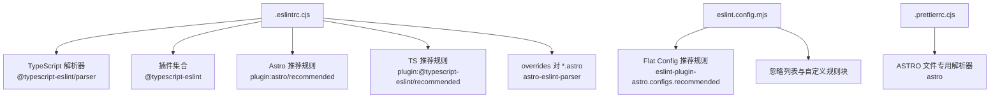
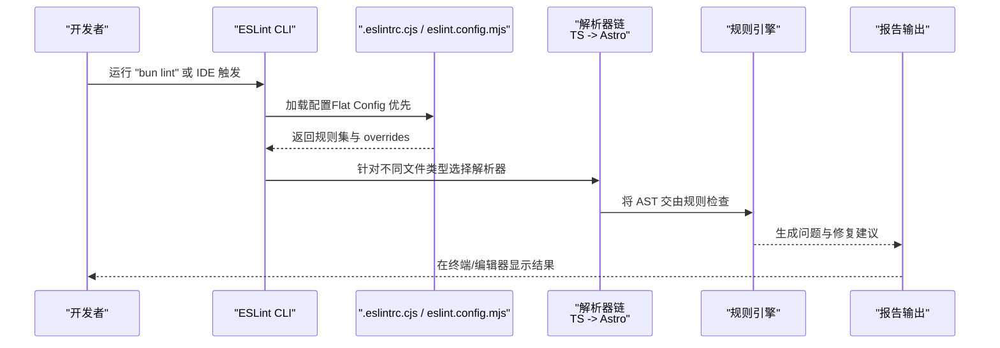
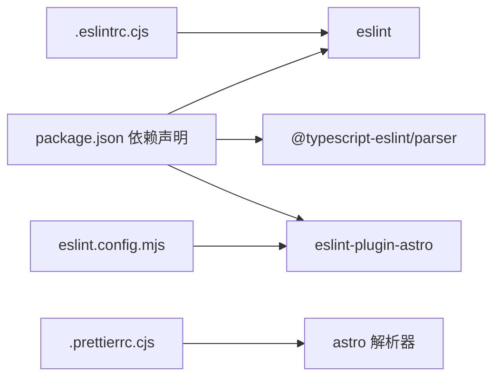

# ESLint配置

<cite>
**本文引用的文件**
- [.eslintrc.cjs](file://.eslintrc.cjs)
- [eslint.config.mjs](file://eslint.config.mjs)
- [package.json](file://package.json)
- [src/layouts/BaseLayout.astro](file://src/layouts/BaseLayout.astro)
- [src/pages/index.astro](file://src/pages/index.astro)
- [packages/pure/components/basic/Header.astro](file://packages/pure/components/basic/Header.astro)
- [packages/pure/components/advanced/Quote.astro](file://packages/pure/components/advanced/Quote.astro)
- [.prettierrc.cjs](file://.prettierrc.cjs)
</cite>

## 目录
1. [简介](#简介)
2. [项目结构](#项目结构)
3. [核心组件](#核心组件)
4. [架构总览](#架构总览)
5. [详细组件分析](#详细组件分析)
6. [依赖关系分析](#依赖关系分析)
7. [性能考量](#性能考量)
8. [故障排查指南](#故障排查指南)
9. [结论](#结论)
10. [附录](#附录)

## 简介
本指南面向使用 Astro 主题 Pure 的开发者，系统讲解项目中的 ESLint 配置与最佳实践，重点覆盖：
- .eslintrc.cjs 的结构与规则设置（含 TypeScript 解析器、插件集成与规则定制）
- Astro 组件文件的特殊配置（astro-eslint-parser 使用与额外文件扩展名处理）
- overrides 块对 *.astro 文件的针对性规则
- 常见规则说明与替代方案
- VS Code 集成与实时检查
- 团队协作与 CI/CD 自动化检查

## 项目结构
本项目同时存在两种 ESLint 配置形态：
- 传统 CJS 配置：.eslintrc.cjs，用于兼容旧版或混合场景
- 新版 Flat Config：eslint.config.mjs，推荐在新项目中优先采用

此外，Prettier 也提供了对应的 .prettierrc.cjs 配置，确保格式化与 ESLint 规则协同工作。

图表来源
- [.eslintrc.cjs](file://.eslintrc.cjs#L1-L32)
- [eslint.config.mjs](file://eslint.config.mjs#L1-L16)
- [.prettierrc.cjs](file://.prettierrc.cjs#L1-L17)

章节来源
- [.eslintrc.cjs](file://.eslintrc.cjs#L1-L32)
- [eslint.config.mjs](file://eslint.config.mjs#L1-L16)
- [package.json](file://package.json#L1-L45)
- [.prettierrc.cjs](file://.prettierrc.cjs#L1-L17)

## 核心组件
- TypeScript 解析器与插件
  - 解析器：@typescript-eslint/parser
  - 插件：@typescript-eslint
  - 作用：为 JS/TS 提供类型感知的静态检查能力
- Astro 规则集
  - plugin:astro/recommended：为 Astro 组件提供语义与安全规则
  - eslint-plugin-astro.configs.recommended：新版 Flat Config 的推荐规则入口
- overrides 对 *.astro 的专项配置
  - parser: astro-eslint-parser
  - parserOptions.extraFileExtensions: ['.astro']
  - 使 AST 解析器能正确识别并处理 Astro 组件脚本部分

章节来源
- [.eslintrc.cjs](file://.eslintrc.cjs#L1-L32)
- [eslint.config.mjs](file://eslint.config.mjs#L1-L16)

## 架构总览
下图展示了从命令行到规则执行的整体流程，以及 Astro 组件与 TS 脚本的解析路径。

图表来源
- [package.json](file://package.json#L18-L18)
- [.eslintrc.cjs](file://.eslintrc.cjs#L1-L32)
- [eslint.config.mjs](file://eslint.config.mjs#L1-L16)

## 详细组件分析

### .eslintrc.cjs 配置详解
- 解析器选项 parserOptions
  - ecmaVersion: 'latest'，sourceType: 'module'，确保支持最新 ECMAScript 特性与 ES Module
  - parser: '@typescript-eslint/parser'，启用 TS 语法与类型检查
- 插件与继承
  - plugins: ['@typescript-eslint']
  - extends: ['plugin:astro/recommended', 'plugin:@typescript-eslint/recommended']
- 规则定制
  - 关闭了 @typescript-eslint/no-unused-expressions 与 @typescript-eslint/no-explicit-any
  - 原因与替代：避免在模板表达式与动态场景中误报；建议通过更严格的类型约束替代 any
- overrides：针对 *.astro
  - parser: 'astro-eslint-parser'
  - parserOptions.parser: '@typescript-eslint/parser'
  - parserOptions.extraFileExtensions: ['.astro']
  - 可在此处添加 Astro 特有规则（如 astro/no-set-html-directive）

章节来源
- [.eslintrc.cjs](file://.eslintrc.cjs#L1-L32)

### eslint.config.mjs（Flat Config）要点
- 导入 eslint-plugin-astro 并展开推荐规则
- 忽略列表 ignores：public/scripts/*、scripts/*、.astro/、src/env.d.ts
- 自定义规则块：可在 ignores 规则块内追加或覆盖规则

章节来源
- [eslint.config.mjs](file://eslint.config.mjs#L1-L16)

### Astro 组件文件的特殊配置
- astro-eslint-parser 的作用
  - 使 ESLint 能正确解析 <script> 区域与组件逻辑，而非仅作为纯文本
- 额外文件扩展名
  - extraFileExtensions: ['.astro'] 让解析器把 .astro 当作可解析单元
- 实际组件示例
  - BaseLayout.astro：包含 TS 类型导入与 props 结构
  - index.astro：页面级组件，调用服务端函数与组件库
  - Header.astro：自定义元素注册与事件绑定
  - Quote.astro：fetch 请求与 DOM 更新

章节来源
- [.eslintrc.cjs](file://.eslintrc.cjs#L13-L30)
- [src/layouts/BaseLayout.astro](file://src/layouts/BaseLayout.astro#L1-L92)
- [src/pages/index.astro](file://src/pages/index.astro#L1-L128)
- [packages/pure/components/basic/Header.astro](file://packages/pure/components/basic/Header.astro#L1-L209)
- [packages/pure/components/advanced/Quote.astro](file://packages/pure/components/advanced/Quote.astro#L1-L41)

### overrides 配置块的作用
- 目标：为 *.astro 文件单独指定解析器与规则
- 关键点：
  - 使用 astro-eslint-parser 替代默认解析器
  - 通过 extraFileExtensions 支持 .astro 扩展名
  - 在 rules 中可叠加或覆盖全局规则，满足 Astro 组件的特殊约束

章节来源
- [.eslintrc.cjs](file://.eslintrc.cjs#L13-L30)

### 常见规则说明与最佳实践
- @typescript-eslint/no-unused-expressions
  - 用途：禁止无副作用的表达式
  - 项目做法：关闭
  - 替代：在模板中合理组织表达式，必要时显式注释或重构
- @typescript-eslint/no-explicit-any
  - 用途：避免任意类型污染
  - 项目做法：关闭
  - 替代：优先使用具体类型、泛型与条件类型；仅在迁移期临时使用 unknown 再断言
- Astro 特有规则（建议）
  - astro/no-set-html-directive：防止危险的 innerHTML 设置
  - 可在 overrides.rules 中按需开启

章节来源
- [.eslintrc.cjs](file://.eslintrc.cjs#L9-L12)
- [.eslintrc.cjs](file://.eslintrc.cjs#L25-L28)

### VS Code 集成与实时检查
- 推荐安装 ESLint 扩展并启用“在编辑器中自动修复”
- 在工作区设置中启用：
  - ESLint: Auto Fix On Save
  - ESLint: Run: "onSave"
- 若使用 Flat Config，确保 VS Code 使用较新的 ESLint 版本（>= v9），并在用户设置中允许使用新式配置

（本节为通用实践说明，不直接分析具体文件）

### 团队协作与 CI/CD 自动化
- 团队规范统一
  - 统一使用 ESLint 与 Prettier，避免风格分歧
  - 在 PR 检查中强制执行：bun lint
- CI/CD 流程
  - 在流水线中加入 lint 步骤，失败即阻断合并
  - 可结合 --fix 参数自动修复可修复问题，剩余问题进入评审

章节来源
- [package.json](file://package.json#L18-L18)

## 依赖关系分析
- 外部依赖
  - eslint、@typescript-eslint/parser、eslint-plugin-astro
- 项目内部
  - .eslintrc.cjs 与 eslint.config.mjs 协同工作，前者兼容旧流程，后者为推荐形态
  - .prettierrc.cjs 与 ESLint 共同维护一致的格式化体验

图表来源
- [package.json](file://package.json#L36-L43)
- [.eslintrc.cjs](file://.eslintrc.cjs#L7-L8)
- [eslint.config.mjs](file://eslint.config.mjs#L3-L6)
- [.prettierrc.cjs](file://.prettierrc.cjs#L10-L12)

章节来源
- [package.json](file://package.json#L36-L43)
- [.eslintrc.cjs](file://.eslintrc.cjs#L7-L8)
- [eslint.config.mjs](file://eslint.config.mjs#L3-L6)
- [.prettierrc.cjs](file://.prettierrc.cjs#L10-L12)

## 性能考量
- 解析器链路优化
  - 仅对 *.astro 使用 astro-eslint-parser，避免对 JS/TS 文件造成额外开销
- 规则粒度控制
  - 通过 overrides 精准配置，减少不必要的规则扫描
- 缓存与增量检查
  - 在大型仓库中启用 ESLint 缓存与增量检查（IDE 与 CI 均支持）

（本节为通用指导，不直接分析具体文件）

## 故障排查指南
- 问题：Astro 组件内的 TS 语法被标记为错误
  - 检查 overrides 是否生效（files: ['*.astro']、parser: 'astro-eslint-parser'）
  - 确认 extraFileExtensions 包含 .astro
- 问题：规则冲突或重复
  - 检查是否同时启用了 .eslintrc.cjs 与 eslint.config.mjs
  - 建议优先使用 eslint.config.mjs，或将 .eslintrc.cjs 的 overrides 合并进 Flat Config
- 问题：VS Code 报错或未生效
  - 确保 ESLint 扩展已安装且版本较新
  - 在工作区设置中启用 ESLint: Auto Fix On Save

章节来源
- [.eslintrc.cjs](file://.eslintrc.cjs#L13-L30)
- [eslint.config.mjs](file://eslint.config.mjs#L1-L16)

## 结论
本项目采用“传统 CJS + Flat Config”的双轨策略，既保证向后兼容，又为未来迁移提供清晰路径。通过 overrides 精准适配 Astro 组件，配合 TypeScript 解析器与推荐规则集，能够有效提升代码质量与一致性。建议团队在本地与 CI 中统一执行 lint，并根据业务需要逐步收紧规则。

## 附录
- 命令参考
  - 本地检查：bun lint
  - 一键检查构建：bun run build（内部会触发 astro check 与 lint）
- 相关文件
  - .eslintrc.cjs：传统配置入口
  - eslint.config.mjs：Flat Config 推荐入口
  - .prettierrc.cjs：格式化与 ASTRO 文件解析器配置

章节来源
- [package.json](file://package.json#L18-L18)
- [.eslintrc.cjs](file://.eslintrc.cjs#L1-L32)
- [eslint.config.mjs](file://eslint.config.mjs#L1-L16)
- [.prettierrc.cjs](file://.prettierrc.cjs#L1-L17)