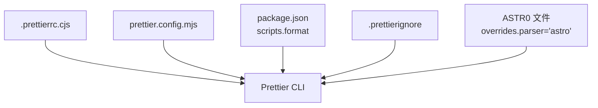
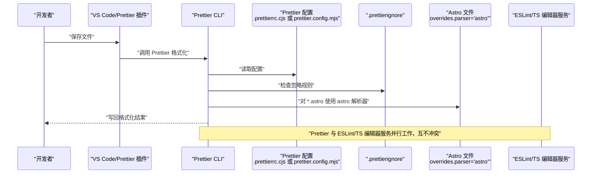
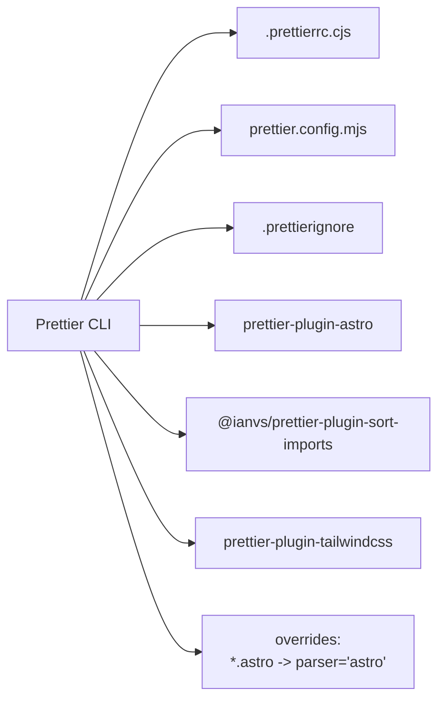

# Prettier格式化

<cite>
**本文引用的文件**
- [.prettierrc.cjs](file://.prettierrc.cjs)
- [.prettierignore](file://.prettierignore)
- [prettier.config.mjs](file://prettier.config.mjs)
- [package.json](file://package.json)
- [src/layouts/BaseLayout.astro](file://src/layouts/BaseLayout.astro)
- [src/content/blog/2025-08-24-miniforge-替代conda的Python环境和包管理工具.md](file://src/content/blog/2025-08-24-miniforge-替代conda的Python环境和包管理工具.md)
- [packages/pure/index.ts](file://packages/pure/index.ts)
- [.eslintrc.cjs](file://.eslintrc.cjs)
</cite>

## 目录
1. [简介](#简介)
2. [项目结构](#项目结构)
3. [核心组件](#核心组件)
4. [架构总览](#架构总览)
5. [详细组件分析](#详细组件分析)
6. [依赖关系分析](#依赖关系分析)
7. [性能考量](#性能考量)
8. [故障排查指南](#故障排查指南)
9. [结论](#结论)
10. [附录](#附录)

## 简介
本指南面向使用 Astro 主题 Pure 的开发者，系统讲解仓库中的 Prettier 格式化配置与实践，涵盖以下要点：
- .prettierrc.cjs 与 prettier.config.mjs 的差异与取舍
- 关键格式化参数说明（打印宽度、引号策略、分号、缩进、换行等）
- .prettierignore 的作用与忽略规则
- 不同文件类型（JS/TS/JSX/TSX/MD/MDX/Astro）的格式化规则与特殊处理
- VS Code 中 Prettier 插件的安装与保存时自动格式化配置
- 与其他格式化工具（如 ESLint、TypeScript 编辑器服务）的兼容与冲突处理
- 团队协作中的格式化标准统一与自动化流程
- 常见问题排查与解决思路

## 项目结构
本仓库同时提供了两种 Prettier 配置形式：
- CommonJS 形式的 .prettierrc.cjs：用于 Node 生态下的配置
- ES Module 形式的 prettier.config.mjs：现代前端工程常用配置文件

此外，仓库通过 package.json 提供一键格式化脚本，覆盖 JS/TS/JSX/TSX/MD/MDX/Astro 等多种文件类型。

图表来源
- [.prettierrc.cjs](file://.prettierrc.cjs#L1-L17)
- [prettier.config.mjs](file://prettier.config.mjs#L1-L58)
- [package.json](file://package.json#L17-L17)
- [.prettierignore](file://.prettierignore#L1-L1)

章节来源
- [.prettierrc.cjs](file://.prettierrc.cjs#L1-L17)
- [prettier.config.mjs](file://prettier.config.mjs#L1-L58)
- [package.json](file://package.json#L17-L17)
- [.prettierignore](file://.prettierignore#L1-L1)

## 核心组件
- Prettier 配置文件
  - .prettierrc.cjs：定义打印宽度、引号策略、分号、换行、导入顺序、Astro 解析器、插件等
  - prettier.config.mjs：补充更多通用格式化选项（如缩进宽度、尾逗号、换行敏感度等），并提供更完整的导入顺序规则
- Prettier 忽略文件 .prettierignore：当前仅忽略 node_modules
- 格式化脚本：package.json 中的 scripts.format 覆盖多种文件类型
- Astro 文件专属解析：通过 overrides 将 *.astro 指定为 astro 解析器
- 插件生态：prettier-plugin-astro、@ianvs/prettier-plugin-sort-imports、prettier-plugin-tailwindcss（.prettierrc.cjs）

章节来源
- [.prettierrc.cjs](file://.prettierrc.cjs#L1-L17)
- [prettier.config.mjs](file://prettier.config.mjs#L1-L58)
- [package.json](file://package.json#L17-L17)
- [.prettierignore](file://.prettierignore#L1-L1)

## 架构总览
下图展示了从命令行触发格式化到具体文件处理的整体流程，以及与 ESLint、TypeScript 编辑器服务的关系。

图表来源
- [package.json](file://package.json#L17-L17)
- [.prettierrc.cjs](file://.prettierrc.cjs#L7-L16)
- [prettier.config.mjs](file://prettier.config.mjs#L49-L57)
- [.prettierignore](file://.prettierignore#L1-L1)
- [.eslintrc.cjs](file://.eslintrc.cjs#L1-L32)

## 详细组件分析

### .prettierrc.cjs 配置详解
- 打印宽度：120
- 引号策略：单引号
- 分号：无分号
- 换行符：按操作系统自动（auto）
- 导入排序：正则表达式分组，优先 astro、@astrojs、外部模块、@ 开头的内部别名、@assets 资源
- Astro 文件专属解析：对 *.astro 使用 astro 解析器
- 插件：
  - prettier-plugin-astro
  - @ianvs/prettier-plugin-sort-imports
  - prettier-plugin-tailwindcss

章节来源
- [.prettierrc.cjs](file://.prettierrc.cjs#L1-L17)

### prettier.config.mjs 配置详解
- 缩进宽度：2
- 尾逗号：无
- 单引号：启用
- 分号：无
- 换行符：LF
- HTML 空白敏感度：css
- 引号属性：按需
- 导入顺序：按模块类型分层（astro、@astrojs、第三方、内部别名、相对路径等）
- Astro 文件专属解析：对 *.astro 使用 astro 解析器
- 插件：
  - prettier-plugin-astro
  - @ianvs/prettier-plugin-sort-imports

章节来源
- [prettier.config.mjs](file://prettier.config.mjs#L1-L58)

### .prettierignore 忽略规则
- 当前仅忽略 node_modules 目录
- 如需忽略构建产物、静态资源或特定文件，可在该文件中追加规则

章节来源
- [.prettierignore](file://.prettierignore#L1-L1)

### 文件类型与格式化规则
- JavaScript/TypeScript/JSX/TSX：遵循 .prettierrc.cjs 或 prettier.config.mjs 的通用规则
- Markdown/MDX：遵循 .prettierrc.cjs 或 prettier.config.mjs 的通用规则
- Astro 组件：通过 overrides 指定 astro 解析器，确保 SFC 语法与嵌入式语言正确格式化
- 示例文件参考：
  - Astro 布局组件：src/layouts/BaseLayout.astro
  - Markdown 文章：src/content/blog/2025-08-24-miniforge-替代conda的Python环境和包管理工具.md
  - 主题入口集成：packages/pure/index.ts（与 Prettier 无直接耦合，但影响整体工程结构）

章节来源
- [src/layouts/BaseLayout.astro](file://src/layouts/BaseLayout.astro#L1-L92)
- [src/content/blog/2025-08-24-miniforge-替代conda的Python环境和包管理工具.md](file://src/content/blog/2025-08-24-miniforge-替代conda的Python环境和包管理工具.md#L1-L51)
- [packages/pure/index.ts](file://packages/pure/index.ts#L1-L114)

### VS Code 中 Prettier 插件安装与配置
- 安装 Prettier 插件后，在工作区设置中启用“保存时格式化”
- VS Code 默认会读取项目根目录的 Prettier 配置文件（.prettierrc.cjs 或 prettier.config.mjs）
- 若存在多个配置文件，建议保留一种以避免冲突
- 可在 VS Code 设置中指定默认 formatter 为 Prettier，并确保与 ESLint 冲突时的优先级

（本节为通用实践说明，不直接分析具体文件）

### 与其他格式化工具的兼容与冲突
- 与 ESLint/TypeScript 编辑器服务并行工作：Prettier 负责格式化，ESLint/TS 编辑器服务负责语义与风格规则
- 在 VS Code 中，若同时启用 Prettier 与 ESLint 插件，建议：
  - 保存时仅让 Prettier 格式化
  - 由 ESLint/TS 提供诊断与修复
- 仓库中 .eslintrc.cjs 已针对 *.astro 文件配置了专用解析器，避免与 Prettier 冲突

章节来源
- [.eslintrc.cjs](file://.eslintrc.cjs#L1-L32)

### 团队协作中的格式化标准统一与自动化流程
- 统一配置：团队成员使用同一份 .prettierrc.cjs 或 prettier.config.mjs
- 自动化脚本：通过 package.json 的 scripts.format 对多类型文件批量格式化
- 提交前钩子：可在 Git Hooks 中集成 Prettier 校验，保证提交质量
- CI 流水线：在构建或检查阶段加入格式化校验步骤，防止格式漂移

章节来源
- [package.json](file://package.json#L17-L17)

## 依赖关系分析
- Prettier CLI 依赖配置文件（.prettierrc.cjs 或 prettier.config.mjs）
- Astro 文件通过 overrides 指定 astro 解析器
- 插件扩展能力：
  - prettier-plugin-astro：支持 Astro SFC 语法
  - @ianvs/prettier-plugin-sort-imports：按规则排序导入
  - prettier-plugin-tailwindcss：识别 Tailwind 类名并排序
- 忽略规则由 .prettierignore 控制

图表来源
- [.prettierrc.cjs](file://.prettierrc.cjs#L7-L16)
- [prettier.config.mjs](file://prettier.config.mjs#L29-L57)
- [.prettierignore](file://.prettierignore#L1-L1)

章节来源
- [.prettierrc.cjs](file://.prettierrc.cjs#L1-L17)
- [prettier.config.mjs](file://prettier.config.mjs#L1-L58)
- [.prettierignore](file://.prettierignore#L1-L1)

## 性能考量
- 合理设置 printWidth：.prettierrc.cjs 为 120，prettier.config.mjs 为 100，可根据团队偏好与屏幕宽度调整
- 使用插件时注意解析成本：astro 解析器与导入排序插件会增加处理时间，建议在大型项目中开启增量格式化或限制扫描范围
- 忽略不必要的目录：.prettierignore 中仅忽略 node_modules，避免扫描构建产物与缓存目录

（本节为通用指导，不直接分析具体文件）

## 故障排查指南
- 问题：Astro 文件未按预期格式化
  - 排查：确认 overrides 中对 *.astro 指定了 parser='astro'
  - 参考：.prettierrc.cjs 与 prettier.config.mjs 的 overrides 配置
- 问题：导入顺序不符合预期
  - 排查：检查 importOrder 规则是否覆盖所需模块类型
  - 参考：.prettierrc.cjs 与 prettier.config.mjs 的 importOrder
- 问题：Tailwind 类名未排序
  - 排查：确认已安装并启用 prettier-plugin-tailwindcss
  - 参考：.prettierrc.cjs 的 plugins 列表
- 问题：VS Code 保存时格式化异常
  - 排查：确认默认 formatter 为 Prettier，且未同时启用多个格式化器
  - 参考：与 ESLint/TS 编辑器服务的协同配置
- 问题：忽略规则未生效
  - 排查：检查 .prettierignore 中的路径匹配是否正确

章节来源
- [.prettierrc.cjs](file://.prettierrc.cjs#L7-L16)
- [prettier.config.mjs](file://prettier.config.mjs#L29-L57)
- [.prettierignore](file://.prettierignore#L1-L1)
- [.eslintrc.cjs](file://.eslintrc.cjs#L1-L32)

## 结论
本仓库提供了两套互补的 Prettier 配置方案，并通过统一的格式化脚本与忽略规则，确保 Astro、Markdown、TypeScript 等多类型文件的一致性。结合 VS Code 插件与 ESLint/TS 编辑器服务，可实现高效、稳定的团队协作与自动化流程。建议团队根据项目规模与偏好选择其一作为主配置，并在 CI/本地钩子中强制执行格式化校验。

## 附录
- 常用命令
  - 格式化全部受支持文件：参见 package.json 中的 scripts.format
- 参考文件
  - .prettierrc.cjs：打印宽度、引号、分号、换行、导入顺序、Astro 解析器、插件
  - prettier.config.mjs：缩进宽度、尾逗号、单引号、分号、HTML 空白敏感度、导入顺序、Astro 解析器、插件
  - .prettierignore：忽略 node_modules
  - package.json：格式化脚本与依赖
  - .eslintrc.cjs：与 Prettier 并行工作的 ESLint 配置

章节来源
- [package.json](file://package.json#L17-L17)
- [.prettierrc.cjs](file://.prettierrc.cjs#L1-L17)
- [prettier.config.mjs](file://prettier.config.mjs#L1-L58)
- [.prettierignore](file://.prettierignore#L1-L1)
- [.eslintrc.cjs](file://.eslintrc.cjs#L1-L32)