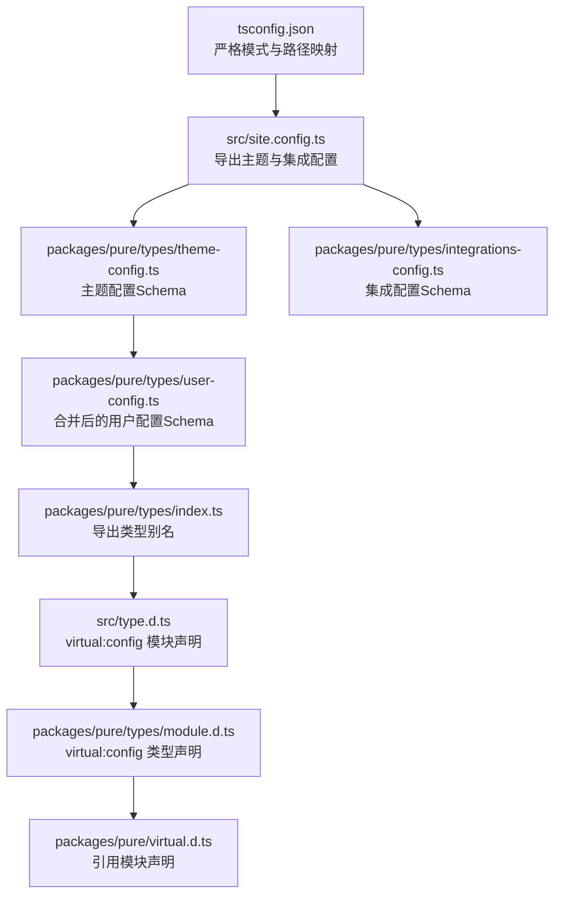
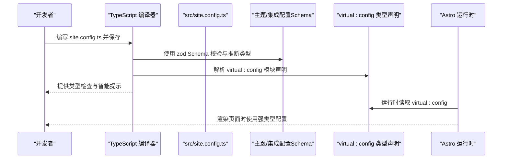
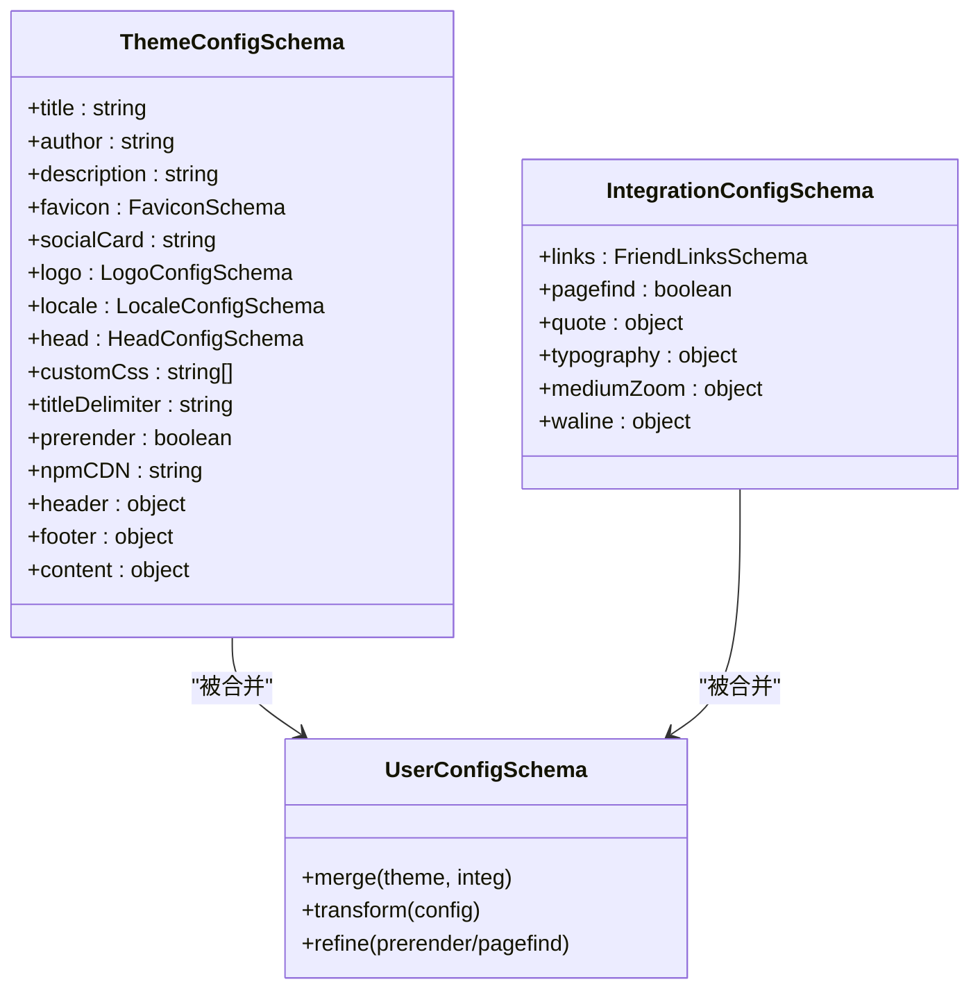
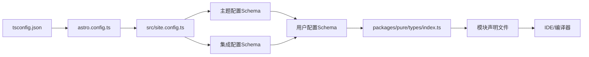

# TypeScript配置

<cite>
**本文引用的文件**
- [tsconfig.json](file://tsconfig.json)
- [packages/pure/virtual.d.ts](file://packages/pure/virtual.d.ts)
- [packages/pure/types/module.d.ts](file://packages/pure/types/module.d.ts)
- [packages/pure/types/theme-config.ts](file://packages/pure/types/theme-config.ts)
- [packages/pure/types/user-config.ts](file://packages/pure/types/user-config.ts)
- [packages/pure/types/integrations-config.ts](file://packages/pure/types/integrations-config.ts)
- [packages/pure/types/constants.ts](file://packages/pure/types/constants.ts)
- [packages/pure/types/index.ts](file://packages/pure/types/index.ts)
- [src/type.d.ts](file://src/type.d.ts)
- [package.json](file://package.json)
- [astro.config.ts](file://astro.config.ts)
- [packages/pure/package.json](file://packages/pure/package.json)
- [src/site.config.ts](file://src/site.config.ts)
</cite>

## 目录
1. [简介](#简介)
2. [项目结构](#项目结构)
3. [核心组件](#核心组件)
4. [架构总览](#架构总览)
5. [详细组件分析](#详细组件分析)
6. [依赖关系分析](#依赖关系分析)
7. [性能考量](#性能考量)
8. [故障排查指南](#故障排查指南)
9. [结论](#结论)
10. [附录](#附录)

## 简介
本指南围绕 Astro 主题 Pure 的 TypeScript 配置展开，系统讲解 tsconfig.json 的编译选项、路径映射与模块解析规则；解释虚拟类型声明文件与模块声明文件的作用与使用场景；梳理主题与用户配置的类型定义；给出 Astro 项目中 TypeScript 的最佳实践（组件类型安全与类型推断）、开发与生产环境的差异化策略、常见错误排查方法，以及 IDE 中的 TypeScript 配置优化与智能提示设置。

## 项目结构
本仓库采用多包工作区布局，TypeScript 配置集中在根目录的 tsconfig.json，并通过路径映射与严格模式提升类型安全。主题 Pure 的类型定义位于 packages/pure/types 下，用户侧通过 src/site.config.ts 导出的配置对象与主题类型进行对接。

图表来源
- [tsconfig.json](file://tsconfig.json#L1-L31)
- [src/site.config.ts](file://src/site.config.ts#L1-L207)
- [packages/pure/types/theme-config.ts](file://packages/pure/types/theme-config.ts#L1-L193)
- [packages/pure/types/integrations-config.ts](file://packages/pure/types/integrations-config.ts#L1-L66)
- [packages/pure/types/user-config.ts](file://packages/pure/types/user-config.ts#L1-L27)
- [packages/pure/types/index.ts](file://packages/pure/types/index.ts#L1-L33)
- [src/type.d.ts](file://src/type.d.ts#L1-L5)
- [packages/pure/types/module.d.ts](file://packages/pure/types/module.d.ts#L1-L5)
- [packages/pure/virtual.d.ts](file://packages/pure/virtual.d.ts#L1-L2)

章节来源
- [tsconfig.json](file://tsconfig.json#L1-L31)
- [src/site.config.ts](file://src/site.config.ts#L1-L207)

## 核心组件
- 编译与严格性
  - 继承 astro/tsconfigs/strict，启用严格模式与更严格的类型检查。
  - 允许 JavaScript 文件参与编译，便于渐进迁移。
  - 启用严格空值检查，降低运行时 null/undefined 风险。
  - 使用 verbatimModuleSyntax，避免隐式模块语法导致的导入歧义。
- 路径映射与模块解析
  - 通过 baseUrl 与 paths 将 @ 前缀映射到 src 子目录，统一导入风格。
  - 支持通配符路径，减少相对路径复杂度。
- 类型声明与虚拟模块
  - packages/pure/virtual.d.ts 引入模块声明文件，使 virtual:config 成为可解析的模块。
  - src/type.d.ts 与 packages/pure/types/module.d.ts 提供 virtual:config 的类型定义，确保 IDE 与编译器能正确识别该虚拟模块的类型。
- 用户与主题配置类型
  - 主题配置 Schema 与集成配置 Schema 通过 zod 定义，生成强类型的用户输入与推断类型。
  - 用户配置 Schema 合并主题与集成配置，并在构建阶段进行校验与默认值处理。

章节来源
- [tsconfig.json](file://tsconfig.json#L1-L31)
- [packages/pure/virtual.d.ts](file://packages/pure/virtual.d.ts#L1-L2)
- [packages/pure/types/module.d.ts](file://packages/pure/types/module.d.ts#L1-L5)
- [src/type.d.ts](file://src/type.d.ts#L1-L5)
- [packages/pure/types/theme-config.ts](file://packages/pure/types/theme-config.ts#L1-L193)
- [packages/pure/types/integrations-config.ts](file://packages/pure/types/integrations-config.ts#L1-L66)
- [packages/pure/types/user-config.ts](file://packages/pure/types/user-config.ts#L1-L27)

## 架构总览
下图展示 TypeScript 在 Astro 主题 Pure 中的类型流转：用户在 site.config.ts 中编写配置，经 zod Schema 推断为强类型；通过 virtual:config 模块在运行时注入；IDE 与编译器通过模块声明文件与路径映射正确解析类型。

图表来源
- [src/site.config.ts](file://src/site.config.ts#L1-L207)
- [packages/pure/types/theme-config.ts](file://packages/pure/types/theme-config.ts#L1-L193)
- [packages/pure/types/integrations-config.ts](file://packages/pure/types/integrations-config.ts#L1-L66)
- [packages/pure/types/user-config.ts](file://packages/pure/types/user-config.ts#L1-L27)
- [src/type.d.ts](file://src/type.d.ts#L1-L5)
- [packages/pure/types/module.d.ts](file://packages/pure/types/module.d.ts#L1-L5)

## 详细组件分析

### tsconfig.json 配置详解
- 继承严格配置
  - 继承 astro/tsconfigs/strict，自动获得严格的类型检查开关与合理的默认值，适合 Astro 项目。
- 包含范围与排除
  - include 包含 .astro/types.d.ts 与所有文件，确保 Astro 生成的类型也能被纳入编译。
  - exclude 排除 node_modules、.vscode、dist、public/scripts、test 与部分页面文件，避免无关文件进入编译。
- 编译选项
  - allowJs：允许混用 JS，便于渐进迁移。
  - declaration：为库产物生成 .d.ts 声明文件，利于发布与消费。
  - lib：指定 es2022、DOM 与 iterable，满足现代浏览器与 Node 环境需求。
  - verbatimModuleSyntax：严格模块语法，避免隐式模块行为。
  - strictNullChecks：开启严格空值检查，降低运行时风险。
  - baseUrl 与 paths：统一 @ 前缀路径映射，提升可维护性。
- 路径映射要点
  - @/assets、@/components、@/layouts、@/utils、@/plugins、@/pages、@/types、@/site-config 等映射，覆盖主题与用户代码常用目录。

章节来源
- [tsconfig.json](file://tsconfig.json#L1-L31)

### 虚拟类型声明文件与模块声明
- packages/pure/virtual.d.ts
  - 通过三斜线指令引用模块声明文件，使 virtual:config 成为可解析的模块。
- packages/pure/types/module.d.ts
  - 声明 virtual:config 模块的默认导出类型为用户配置类型，供主题内部消费。
- src/type.d.ts
  - 在用户侧声明 virtual:config 的类型，指向主题导出的配置输出类型，保证两端一致。
- 作用与场景
  - 在 Astro 项目中，virtual:* 是约定的虚拟模块命名空间，用于在运行时注入配置或资源。
  - 通过模块声明文件，TypeScript 可以在编译期与 IDE 中正确识别这些模块的类型，避免“找不到模块”或“any”泛滥。

章节来源
- [packages/pure/virtual.d.ts](file://packages/pure/virtual.d.ts#L1-L2)
- [packages/pure/types/module.d.ts](file://packages/pure/types/module.d.ts#L1-L5)
- [src/type.d.ts](file://src/type.d.ts#L1-L5)

### 主题配置与用户配置类型体系
- 主题配置 Schema（ThemeConfigSchema）
  - 定义站点标题、作者、描述、favicon、socialCard、logo、locale、head、customCss、titleDelimiter、prerender、npmCDN、header、footer、content 等字段。
  - 使用 zod 对字段进行校验与默认值处理，最终导出 ThemeUserConfig 与 ThemeConfig 类型别名。
- 集成配置 Schema（IntegrationConfigSchema）
  - 定义 links、pagefind、quote、typography、mediumZoom、waline 等集成项。
  - 提供默认值与枚举约束，确保配置的可用性与一致性。
- 用户配置 Schema（UserConfigSchema）
  - 合并主题配置与集成配置，并在 transform 阶段对 pagefind 与 prerender 的关系进行约束与默认值处理。
  - 通过 refine 对不合法组合进行校验，如禁用 prerender 时禁止启用 pagefind。
- 类型导出与常量
  - packages/pure/types/index.ts 导出用户配置类型别名与常用接口（如 SiteMeta、CardListData、TimelineEvent、iconsType）。
  - packages/pure/types/constants.ts 定义社交链接键名常量，配合 zod schema 与类型系统使用。

图表来源
- [packages/pure/types/theme-config.ts](file://packages/pure/types/theme-config.ts#L1-L193)
- [packages/pure/types/integrations-config.ts](file://packages/pure/types/integrations-config.ts#L1-L66)
- [packages/pure/types/user-config.ts](file://packages/pure/types/user-config.ts#L1-L27)

章节来源
- [packages/pure/types/theme-config.ts](file://packages/pure/types/theme-config.ts#L1-L193)
- [packages/pure/types/integrations-config.ts](file://packages/pure/types/integrations-config.ts#L1-L66)
- [packages/pure/types/user-config.ts](file://packages/pure/types/user-config.ts#L1-L27)
- [packages/pure/types/index.ts](file://packages/pure/types/index.ts#L1-L33)
- [packages/pure/types/constants.ts](file://packages/pure/types/constants.ts#L1-L21)

### 用户配置在 Astro 中的应用
- src/site.config.ts
  - 导出 theme 与 integ 两部分配置，并将其合并为最终的 Config 类型导出。
  - 通过类型标注 import type { Config, IntegrationUserConfig, ThemeUserConfig } from 'astro-pure/types'，确保 IDE 与编译器能正确识别类型。
- astro.config.ts
  - 作为 Astro 配置入口，加载 site.config.ts 并传入主题集成，实现运行时配置注入。
- packages/pure/package.json
  - 主题包的 exports 字段暴露 types、utils、server 等子导出，供用户侧按需引入。

章节来源
- [src/site.config.ts](file://src/site.config.ts#L1-L207)
- [astro.config.ts](file://astro.config.ts#L1-L133)
- [packages/pure/package.json](file://packages/pure/package.json#L1-L51)

## 依赖关系分析
- TypeScript 与 Astro 的耦合
  - tsconfig.json 继承 astro/tsconfigs/strict，确保与 Astro 的类型生态保持一致。
  - Astro 配置 astro.config.ts 通过 defineConfig 与主题集成，间接影响类型推断与运行时行为。
- 主题类型与用户配置的依赖
  - 用户在 site.config.ts 中使用主题提供的类型别名，编译器通过模块声明文件与路径映射解析类型。
  - 主题内部通过 zod Schema 生成类型，形成从输入到输出的类型链路。

图表来源
- [tsconfig.json](file://tsconfig.json#L1-L31)
- [astro.config.ts](file://astro.config.ts#L1-L133)
- [src/site.config.ts](file://src/site.config.ts#L1-L207)
- [packages/pure/types/index.ts](file://packages/pure/types/index.ts#L1-L33)
- [packages/pure/types/module.d.ts](file://packages/pure/types/module.d.ts#L1-L5)

章节来源
- [tsconfig.json](file://tsconfig.json#L1-L31)
- [astro.config.ts](file://astro.config.ts#L1-L133)
- [src/site.config.ts](file://src/site.config.ts#L1-L207)
- [packages/pure/types/index.ts](file://packages/pure/types/index.ts#L1-L33)

## 性能考量
- 编译性能
  - include 与 exclude 的合理配置可显著减少编译扫描范围，建议仅包含必要目录与文件。
  - 路径映射减少深层相对路径，有助于增量编译与缓存命中。
- 运行时性能
  - 开启 strictNullChecks 与 verbatimModuleSyntax 可在编译期发现潜在问题，减少运行时开销。
  - 合理拆分配置与类型声明，避免一次性加载过多类型，提升 IDE 响应速度。

## 故障排查指南
- 找不到模块 virtual:config
  - 确认 packages/pure/virtual.d.ts 已正确引用模块声明文件。
  - 确认 src/type.d.ts 与 packages/pure/types/module.d.ts 的类型定义一致。
  - 确认 tsconfig.json 的 include 范围包含 .astro/types.d.ts 与相关类型文件。
- 类型不匹配或推断异常
  - 检查 src/site.config.ts 的类型导入是否指向正确的主题类型别名。
  - 检查 UserConfigSchema 的 transform/refine 是否与当前配置冲突（如 prerender 与 pagefind 的组合）。
- 路径解析失败
  - 检查 baseUrl 与 paths 的映射是否与实际目录结构一致。
  - 确保 @ 前缀路径在项目内保持一致，避免混用相对路径与别名路径。
- 编译报错或 IDE 不提示
  - 确认 TypeScript 版本与项目依赖兼容。
  - 在 IDE 中重新加载项目或重启语言服务，确保类型声明生效。

章节来源
- [packages/pure/virtual.d.ts](file://packages/pure/virtual.d.ts#L1-L2)
- [packages/pure/types/module.d.ts](file://packages/pure/types/module.d.ts#L1-L5)
- [src/type.d.ts](file://src/type.d.ts#L1-L5)
- [tsconfig.json](file://tsconfig.json#L1-L31)
- [src/site.config.ts](file://src/site.config.ts#L1-L207)
- [packages/pure/types/user-config.ts](file://packages/pure/types/user-config.ts#L1-L27)

## 结论
通过继承严格配置、合理设置路径映射与模块声明、利用 zod Schema 生成强类型配置，Astro 主题 Pure 在 TypeScript 生态中实现了高可维护性与良好的开发体验。结合 IDE 的智能提示与编译期检查，能够在开发与生产环境中稳定地提供类型安全保障。

## 附录

### 开发与生产环境的差异化策略
- 开发环境
  - 启用 allowJs 与 verbatimModuleSyntax，便于混合开发与严格模块语法。
  - include 覆盖 .astro/types.d.ts 与源码目录，确保 IDE 与 watch 模式下的类型更新。
- 生产环境
  - 关闭 declaration（若不发布库），减少构建产物体积。
  - 保留 strictNullChecks 与严格模式，确保运行时稳定性。

章节来源
- [tsconfig.json](file://tsconfig.json#L1-L31)

### IDE 中的 TypeScript 配置优化与智能提示
- VS Code
  - 使用 TypeScript 自带的语言服务，确保 tsconfig.json 与模块声明文件被正确识别。
  - 在 settings.json 中启用“建议使用 verbatim module syntax”，与项目配置保持一致。
- WebStorm/IntelliJ
  - 确认项目根目录的 tsconfig.json 被识别为项目配置。
  - 在“Settings > Languages & Frameworks > TypeScript > Project”中选择合适的版本与模块系统。

章节来源
- [tsconfig.json](file://tsconfig.json#L1-L31)