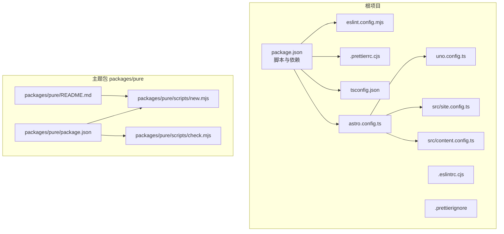
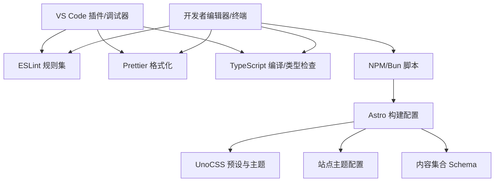
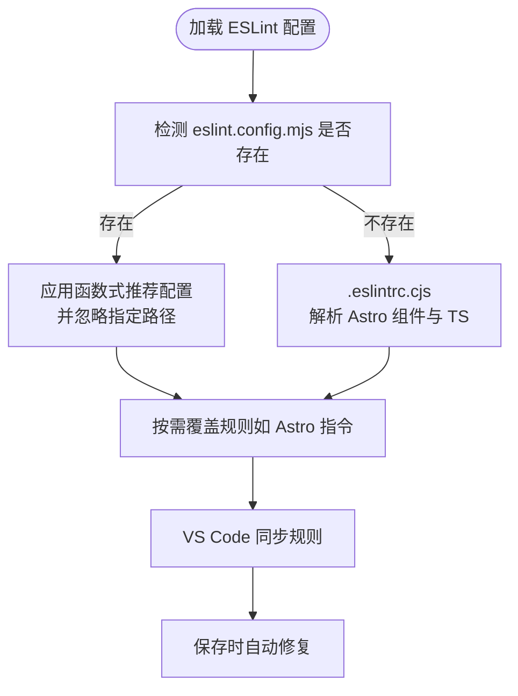
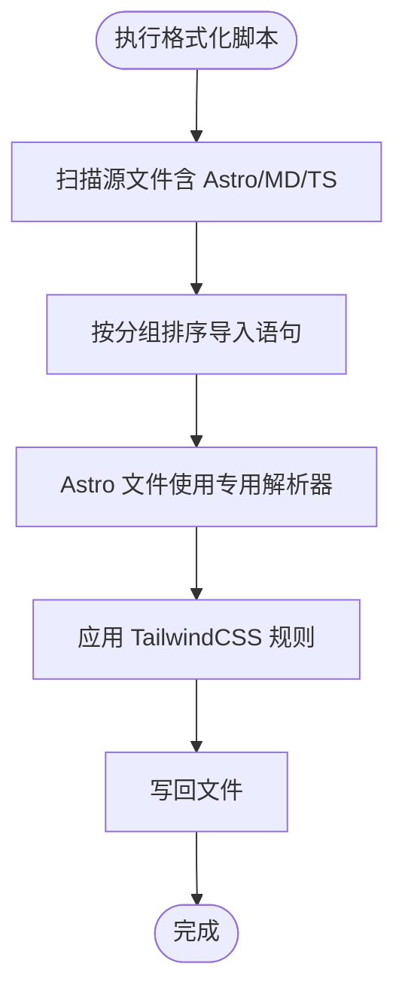
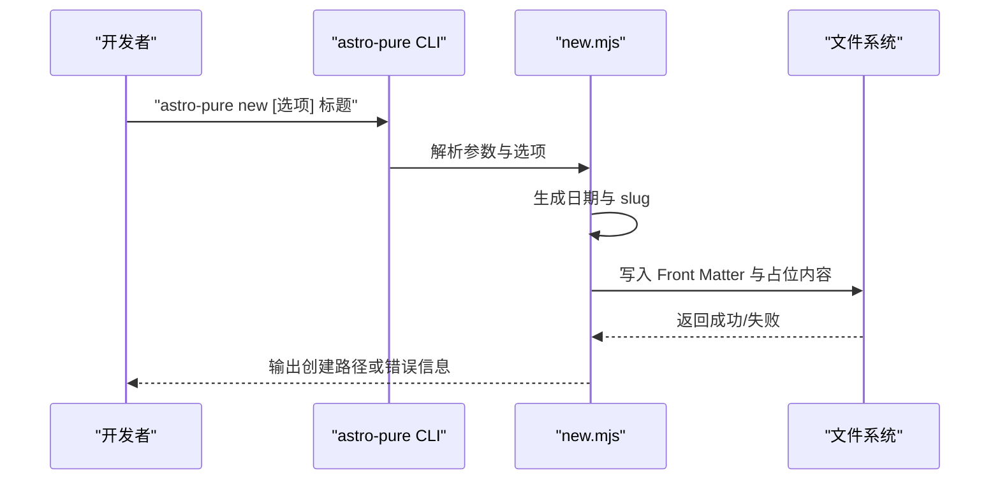
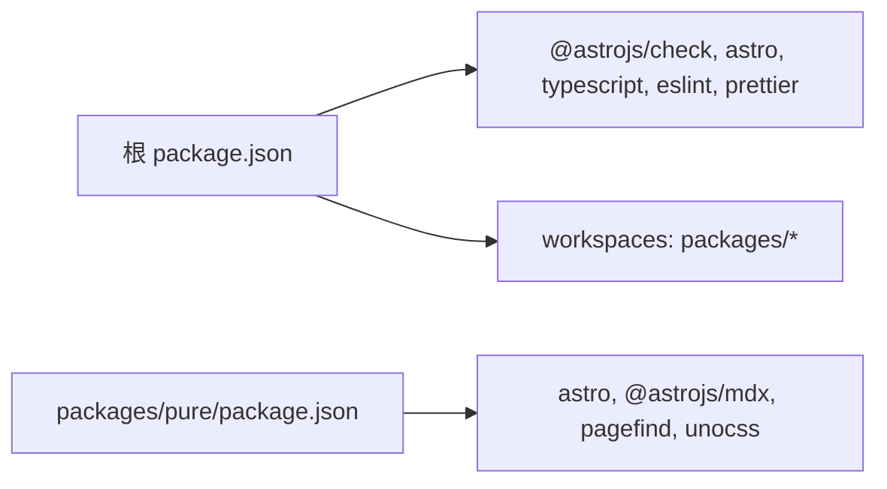

# 开发工具

<cite>
**本文引用的文件**
- [eslint.config.mjs](file://eslint.config.mjs)
- [.eslintrc.cjs](file://.eslintrc.cjs)
- [.prettierrc.cjs](file://.prettierrc.cjs)
- [.prettierignore](file://.prettierignore)
- [tsconfig.json](file://tsconfig.json)
- [package.json](file://package.json)
- [astro.config.ts](file://astro.config.ts)
- [uno.config.ts](file://uno.config.ts)
- [src/site.config.ts](file://src/site.config.ts)
- [src/content.config.ts](file://src/content.config.ts)
- [packages/pure/scripts/new.mjs](file://packages/pure/scripts/new.mjs)
- [packages/pure/scripts/check.mjs](file://packages/pure/scripts/check.mjs)
- [packages/pure/package.json](file://packages/pure/package.json)
- [packages/pure/README.md](file://packages/pure/README.md)
- [src/content/blog/2025-08-24-miniforge-替代conda的Python环境和包管理工具.md](file://src/content/blog/2025-08-24-miniforge-替代conda的Python环境和包管理工具.md)
- [src/content/blog/2025-09-20-五分钟快速部署：用 Docker 和 Docker Compose 部署 FastAPI 应用.md](file://src/content/blog/2025-09-20-五分钟快速部署：用 Docker 和 Docker Compose 部署 FastAPI 应用.md)
</cite>

## 目录
1. [简介](#简介)
2. [项目结构](#项目结构)
3. [核心组件](#核心组件)
4. [架构总览](#架构总览)
5. [详细组件分析](#详细组件分析)
6. [依赖关系分析](#依赖关系分析)
7. [性能考虑](#性能考虑)
8. [故障排查指南](#故障排查指南)
9. [结论](#结论)
10. [附录](#附录)

## 简介
本指南面向使用 Astro 主题 Pure 的开发者，系统讲解开发工具链的配置与使用，覆盖 ESLint 代码规范、Prettier 格式化、TypeScript 类型检查、开发脚本（new.mjs、check.mjs）、VS Code 推荐配置、调试与性能分析、以及团队协作与质量保障流程。目标是帮助你高效搭建并维护高质量的 Astro 博客/文档站点。

## 项目结构
该仓库采用多包工作区布局，核心开发工具与配置集中在根目录与主题包 packages/pure 中：
- 根配置：ESLint、Prettier、TypeScript、脚本与构建配置
- 主题包：提供 CLI 脚本（new、check）与主题能力
- 内容层：Markdown/MDX 文章与文档集合定义
- 构建与样式：Astro 配置、UnoCSS 配置、站点主题配置

图表来源
- [package.json](file://package.json#L1-L45)
- [eslint.config.mjs](file://eslint.config.mjs#L1-L16)
- [.prettierrc.cjs](file://.prettierrc.cjs#L1-L17)
- [tsconfig.json](file://tsconfig.json#L1-L31)
- [astro.config.ts](file://astro.config.ts#L1-L133)
- [uno.config.ts](file://uno.config.ts#L1-L193)
- [src/site.config.ts](file://src/site.config.ts#L1-L207)
- [src/content.config.ts](file://src/content.config.ts#L1-L77)
- [packages/pure/package.json](file://packages/pure/package.json#L1-L51)
- [packages/pure/scripts/new.mjs](file://packages/pure/scripts/new.mjs#L1-L131)
- [packages/pure/scripts/check.mjs](file://packages/pure/scripts/check.mjs#L1-L40)
- [packages/pure/README.md](file://packages/pure/README.md#L1-L59)

章节来源
- [package.json](file://package.json#L1-L45)
- [astro.config.ts](file://astro.config.ts#L1-L133)

## 核心组件
- ESLint 配置与规则：支持 Astro 组件与 TypeScript，覆盖忽略路径与 Astro 文件解析策略
- Prettier 配置与插件：统一代码风格、自动排序导入、TailwindCSS 支持、Astro 解析器
- TypeScript 配置：严格模式、DOM 环境、路径映射、库声明与排除项
- 开发脚本：new.mjs 创建文章、check.mjs 执行链接与检查流程
- 构建与样式：Astro 配置启用 Markdown 数学公式、语法高亮与 UnoCSS；站点配置集中管理主题与集成参数

章节来源
- [eslint.config.mjs](file://eslint.config.mjs#L1-L16)
- [.eslintrc.cjs](file://.eslintrc.cjs#L1-L32)
- [.prettierrc.cjs](file://.prettierrc.cjs#L1-L17)
- [tsconfig.json](file://tsconfig.json#L1-L31)
- [packages/pure/scripts/new.mjs](file://packages/pure/scripts/new.mjs#L1-L131)
- [packages/pure/scripts/check.mjs](file://packages/pure/scripts/check.mjs#L1-L40)
- [astro.config.ts](file://astro.config.ts#L1-L133)
- [uno.config.ts](file://uno.config.ts#L1-L193)
- [src/site.config.ts](file://src/site.config.ts#L1-L207)

## 架构总览
下图展示开发工具链在项目中的位置与交互关系：

图表来源
- [package.json](file://package.json#L8-L22)
- [eslint.config.mjs](file://eslint.config.mjs#L1-L16)
- [.prettierrc.cjs](file://.prettierrc.cjs#L1-L17)
- [tsconfig.json](file://tsconfig.json#L1-L31)
- [astro.config.ts](file://astro.config.ts#L1-L133)
- [uno.config.ts](file://uno.config.ts#L1-L193)
- [src/site.config.ts](file://src/site.config.ts#L1-L207)
- [src/content.config.ts](file://src/content.config.ts#L1-L77)

## 详细组件分析

### ESLint 配置与 IDE 集成
- 配置来源与优先级
  - 新版推荐使用基于函数的配置文件 eslint.config.mjs，继承 Astro 官方推荐规则并提供忽略列表
  - 旧版 .eslintrc.cjs 仍保留，用于兼容解析 Astro 组件与 TypeScript
- 规则定制
  - 可在忽略块中添加自定义规则覆盖，例如针对 Astro 指令的规则
  - Astro 文件使用 astro-eslint-parser 并开启 TypeScript 解析
- IDE 集成建议
  - VS Code 安装 ESLint 插件，启用保存时自动修复
  - 使用 ESLint 扩展以获得最佳 Astro/TS 支持

图表来源
- [eslint.config.mjs](file://eslint.config.mjs#L1-L16)
- [.eslintrc.cjs](file://.eslintrc.cjs#L1-L32)

章节来源
- [eslint.config.mjs](file://eslint.config.mjs#L1-L16)
- [.eslintrc.cjs](file://.eslintrc.cjs#L1-L32)

### Prettier 格式化配置与自动化流程
- 风格统一
  - 行宽、单引号、无分号、换行符策略
  - 导入顺序分组：Astro/官方、绝对路径、别名、资产路径
- 插件生态
  - Prettier 插件：Astro 解析器、导入排序、TailwindCSS
  - 针对 *.astro 文件使用专用 parser
- 忽略规则
  - 忽略 node_modules 目录
- 自动化流程
  - 通过 package.json 的 format 脚本批量格式化
  - 建议在提交前执行格式化，或在 VS Code 中配置保存时格式化

图表来源
- [.prettierrc.cjs](file://.prettierrc.cjs#L1-L17)
- [.prettierignore](file://.prettierignore#L1-L1)
- [package.json](file://package.json#L17-L17)

章节来源
- [.prettierrc.cjs](file://.prettierrc.cjs#L1-L17)
- [.prettierignore](file://.prettierignore#L1-L1)
- [package.json](file://package.json#L17-L17)

### TypeScript 配置与类型检查最佳实践
- 严格模式与 DOM 环境
  - 继承 Astro 严格配置，启用 strictNullChecks
  - 引入 DOM/Iterable 类库，适配浏览器端运行
- 路径映射
  - 通过 baseUrl 与 paths 映射 @/assets、@/components、@/layouts、@/utils、@/plugins、@/pages、@/types、@/site-config
- 排除项
  - 排除 node_modules、.vscode、dist、public/scripts、test、src/pages/**/* 等
- 类型检查
  - 使用 astro check 或 npm 脚本进行类型检查与构建预检
  - 建议在 VS Code 中启用“始终启用类型检查”，并在保存时显示类型错误

章节来源
- [tsconfig.json](file://tsconfig.json#L1-L31)
- [package.json](file://package.json#L10-L14)

### 开发脚本：new.mjs 与 check.mjs
- new.mjs：创建新文章
  - 支持语言、草稿、MDX、文件夹模式等选项
  - 自动生成 Front Matter（标题、描述、发布时间、标签等）
  - 输出创建路径与错误处理
- check.mjs：执行链接与检查流程
  - 条件执行 bun link 以支持本地主题开发联调
  - 提供错误捕获与状态输出

图表来源
- [packages/pure/scripts/new.mjs](file://packages/pure/scripts/new.mjs#L1-L131)
- [packages/pure/package.json](file://packages/pure/package.json#L25-L27)

章节来源
- [packages/pure/scripts/new.mjs](file://packages/pure/scripts/new.mjs#L1-L131)
- [packages/pure/scripts/check.mjs](file://packages/pure/scripts/check.mjs#L1-L40)
- [packages/pure/package.json](file://packages/pure/package.json#L25-L27)

### VS Code 推荐配置与插件
- 插件建议
  - ESLint：保存时自动修复
  - Prettier：默认格式化器，配合保存时格式化
  - Astro：语法高亮与智能感知
  - TypeScript Importer：自动导入
  - Tailwind CSS IntelliSense：Tailwind 类补全
- 设置建议
  - editor.formatOnSave: true
  - editor.codeActionsOnSave: { "source.fixAll.eslint": true }
  - eslint.validate: ["javascript", "typescript", "astro"]
  - prettier.prettierPath: 指向项目内依赖

章节来源
- [eslint.config.mjs](file://eslint.config.mjs#L1-L16)
- [.prettierrc.cjs](file://.prettierrc.cjs#L1-L17)

### 调试与性能分析
- 调试
  - 在 VS Code 中设置断点，使用调试配置启动 Astro 开发服务器
  - 对于主题包本地联调，可使用 check.mjs 的条件链接逻辑
- 性能分析
  - 使用浏览器性能面板分析渲染与脚本执行
  - 关注 Markdown 渲染、语法高亮与图片懒加载
  - UnoCSS 与字体优化：合理配置字体预加载与裁剪

章节来源
- [packages/pure/scripts/check.mjs](file://packages/pure/scripts/check.mjs#L26-L38)
- [astro.config.ts](file://astro.config.ts#L107-L131)

### 团队协作与质量保障流程
- 提交前检查
  - 运行格式化与类型检查：npm run yijiansilian 或分别执行 lint、format、check、sync
  - 保持内容集合 Schema 一致（标题长度、描述长度、标签去重等）
- 内容规范
  - 使用 new.mjs 快速生成文章模板，确保 Front Matter 字段完整
  - 文章内容遵循 Markdown/MDX 规范，必要时使用数学公式与代码高亮
- 发布流程
  - 本地预览与同步后，执行构建与部署脚本

章节来源
- [package.json](file://package.json#L17-L21)
- [src/content.config.ts](file://src/content.config.ts#L11-L77)
- [packages/pure/scripts/new.mjs](file://packages/pure/scripts/new.mjs#L113-L126)

## 依赖关系分析
- 根项目依赖
  - @astrojs/check、astro、typescript、eslint、prettier、prettier-plugin-astro 等
- 主题包依赖
  - astro、@astrojs/mdx、@astrojs/sitemap、pagefind、unocss 等
- 工作区
  - 根 package.json 声明 workspaces: ["packages/*"]

图表来源
- [package.json](file://package.json#L1-L45)
- [packages/pure/package.json](file://packages/pure/package.json#L1-L51)

章节来源
- [package.json](file://package.json#L1-L45)
- [packages/pure/package.json](file://packages/pure/package.json#L1-L51)

## 性能考虑
- 构建与运行
  - 启用 UnoCSS 预设与安全列表，减少未使用类导致的体积
  - 图片服务使用 sharp，开启响应式样式与优化
- Markdown 与渲染
  - 合理使用数学公式与代码高亮，避免过度复杂块
  - 控制图片尺寸与数量，结合懒加载与预加载策略
- 开发体验
  - 使用 astro dev 的 watch 模式与类型检查并行（dev:check）

章节来源
- [uno.config.ts](file://uno.config.ts#L174-L193)
- [astro.config.ts](file://astro.config.ts#L44-L96)
- [package.json](file://package.json#L10-L10)

## 故障排查指南
- ESLint 报错
  - 确认 eslint.config.mjs 与 .eslintrc.cjs 的配置是否冲突
  - 检查 Astro 文件是否正确使用 astro-eslint-parser
- Prettier 格式化异常
  - 检查 .prettierrc.cjs 的插件与解析器配置
  - 确认 .prettierignore 是否误排除了需要格式化的文件
- TypeScript 错误
  - 使用 astro check 或 tsc 校验类型
  - 检查 tsconfig.json 的 paths 与 exclude 是否影响类型解析
- new.mjs 创建失败
  - 检查目标目录是否存在同名文件
  - 确认传入的参数与选项是否合法
- check.mjs 未执行
  - 确认环境变量 BUN_LINK_PKG 是否为 true

章节来源
- [eslint.config.mjs](file://eslint.config.mjs#L1-L16)
- [.eslintrc.cjs](file://.eslintrc.cjs#L1-L32)
- [.prettierrc.cjs](file://.prettierrc.cjs#L1-L17)
- [.prettierignore](file://.prettierignore#L1-L1)
- [tsconfig.json](file://tsconfig.json#L1-L31)
- [packages/pure/scripts/new.mjs](file://packages/pure/scripts/new.mjs#L108-L111)
- [packages/pure/scripts/check.mjs](file://packages/pure/scripts/check.mjs#L26-L38)

## 结论
通过统一的 ESLint、Prettier、TypeScript 配置与主题包提供的 CLI 脚本，Astro 主题 Pure 提供了完整的开发工具链。结合 VS Code 插件与脚本化流程，开发者可以高效地创建内容、保持代码风格一致、提升构建质量，并在团队协作中维持稳定的发布节奏。

## 附录
- 示例内容文件
  - [示例文章1](file://src/content/blog/2025-08-24-miniforge-替代conda的Python环境和包管理工具.md#L1-L51)
  - [示例文章2](file://src/content/blog/2025-09-20-五分钟快速部署：用 Docker 和 Docker Compose 部署 FastAPI 应用.md#L1-L70)
- 主题包 CLI 使用说明
  - [主题包 README](file://packages/pure/README.md#L45-L54)