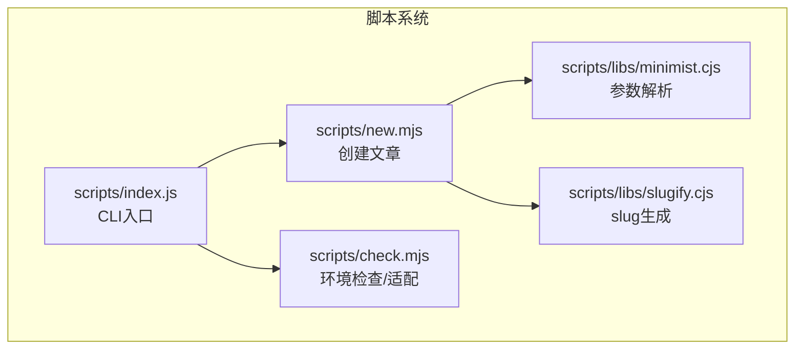
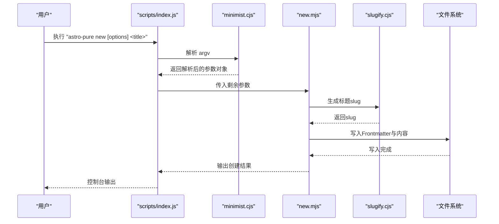
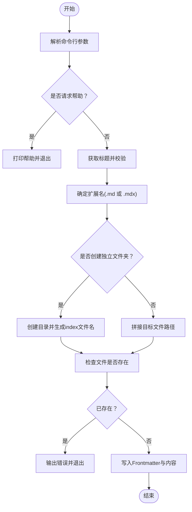
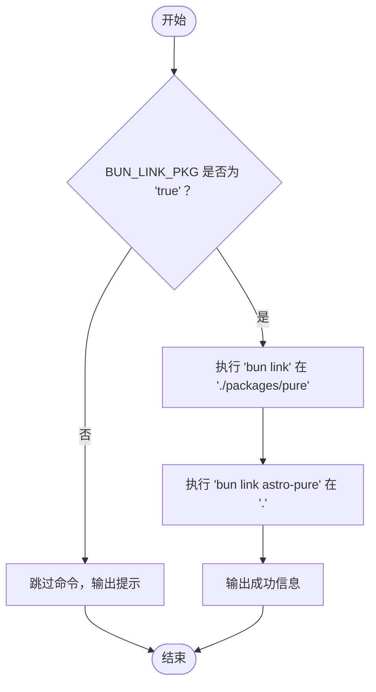
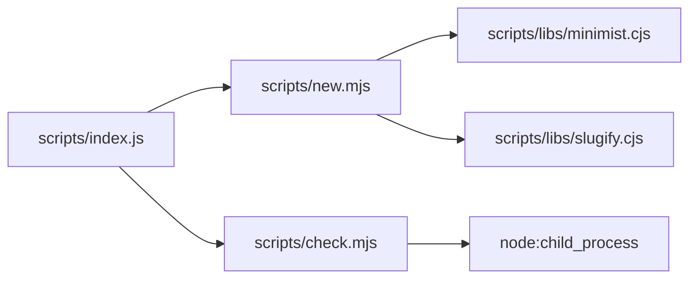

# 开发脚本

<cite>
**本文引用的文件列表**
- [packages/pure/scripts/index.js](file://packages/pure/scripts/index.js)
- [packages/pure/scripts/new.mjs](file://packages/pure/scripts/new.mjs)
- [packages/pure/scripts/check.mjs](file://packages/pure/scripts/check.mjs)
- [packages/pure/scripts/libs/minimist.cjs](file://packages/pure/scripts/libs/minimist.cjs)
- [packages/pure/scripts/libs/slugify.cjs](file://packages/pure/scripts/libs/slugify.cjs)
- [packages/pure/package.json](file://packages/pure/package.json)
- [package.json](file://package.json)
- [README.md](file://README.md)
- [packages/pure/README.md](file://packages/pure/README.md)
</cite>

## 目录
1. [简介](#简介)
2. [项目结构](#项目结构)
3. [核心组件](#核心组件)
4. [架构总览](#架构总览)
5. [详细组件分析](#详细组件分析)
6. [依赖关系分析](#依赖关系分析)
7. [性能考量](#性能考量)
8. [故障排除指南](#故障排除指南)
9. [结论](#结论)
10. [附录](#附录)

## 简介
本指南面向Astro主题Pure的开发者，聚焦于packages/pure/scripts/目录下的脚本工具，帮助你：
- 快速上手并正确使用new.mjs创建新文章的命令行参数与使用方法
- 深入理解check.mjs代码检查脚本的功能与执行流程
- 掌握minimist.cjs与slugify.cjs两个内置库的作用与使用方式
- 明确脚本的安装与运行方法（含Node.js版本要求）
- 了解脚本在开发工作流中的定位与最佳实践
- 学会如何基于现有脚本进行自定义开发与扩展
- 提供常见使用场景示例与故障排除建议

## 项目结构
脚本系统位于packages/pure/scripts/，通过packages/pure/scripts/index.js作为统一入口分发命令；new.mjs负责创建文章内容文件，check.mjs负责在特定条件下执行环境适配命令；libs/目录内包含minimist.cjs与slugify.cjs两个轻量级库，分别用于解析命令行参数与生成URL友好型的slug。

图表来源
- [packages/pure/scripts/index.js](file://packages/pure/scripts/index.js#L1-L45)
- [packages/pure/scripts/new.mjs](file://packages/pure/scripts/new.mjs#L1-L131)
- [packages/pure/scripts/check.mjs](file://packages/pure/scripts/check.mjs#L1-L40)
- [packages/pure/scripts/libs/minimist.cjs](file://packages/pure/scripts/libs/minimist.cjs#L1-L280)
- [packages/pure/scripts/libs/slugify.cjs](file://packages/pure/scripts/libs/slugify.cjs#L1-L74)

章节来源
- [packages/pure/scripts/index.js](file://packages/pure/scripts/index.js#L1-L45)
- [packages/pure/package.json](file://packages/pure/package.json#L25-L27)

## 核心组件
- CLI入口：packages/pure/scripts/index.js
  - 负责解析用户输入的子命令（如check、new、info、help），并将参数转发给对应模块
  - 使用minimist.cjs解析argv，支持短/长选项别名与默认值
- 新文章创建：packages/pure/scripts/new.mjs
  - 解析命令行参数，生成文章标题slug，决定文件扩展名（.md或.mdx），可选择是否创建独立文件夹
  - 写入标准Frontmatter与占位内容到src/content/blog/目标路径
- 环境检查/适配：packages/pure/scripts/check.mjs
  - 在特定环境变量下执行bun link相关命令，便于本地开发时的主题包链接调试
- 参数解析库：packages/pure/scripts/libs/minimist.cjs
  - 自包含的命令行参数解析器，支持布尔、字符串、默认值、别名、未知项处理等
- Slug生成库：packages/pure/scripts/libs/slugify.cjs
  - 将任意字符串转换为URL友好的slug，支持多语言字符映射与严格模式

章节来源
- [packages/pure/scripts/index.js](file://packages/pure/scripts/index.js#L10-L44)
- [packages/pure/scripts/new.mjs](file://packages/pure/scripts/new.mjs#L60-L131)
- [packages/pure/scripts/check.mjs](file://packages/pure/scripts/check.mjs#L25-L39)
- [packages/pure/scripts/libs/minimist.cjs](file://packages/pure/scripts/libs/minimist.cjs#L27-L279)
- [packages/pure/scripts/libs/slugify.cjs](file://packages/pure/scripts/libs/slugify.cjs#L19-L66)

## 架构总览
下面的序列图展示了从命令行到具体功能执行的调用链路，以及关键数据流（参数解析、slug生成、文件写入）。

图表来源
- [packages/pure/scripts/index.js](file://packages/pure/scripts/index.js#L10-L20)
- [packages/pure/scripts/libs/minimist.cjs](file://packages/pure/scripts/libs/minimist.cjs#L27-L279)
- [packages/pure/scripts/new.mjs](file://packages/pure/scripts/new.mjs#L36-L104)
- [packages/pure/scripts/libs/slugify.cjs](file://packages/pure/scripts/libs/slugify.cjs#L19-L66)

## 详细组件分析

### CLI入口与命令分发（scripts/index.js）
- 功能要点
  - 通过minimist解析argv，识别子命令
  - 支持命令：check、new、info、help
  - info命令读取当前包版本、Node版本、平台信息并打印
  - help命令打印可用命令说明
- 关键行为
  - 将process.argv.slice(2)交给minimist解析
  - 根据第一个非选项参数分发到对应模块
  - new命令将剩余参数传递给new.mjs

章节来源
- [packages/pure/scripts/index.js](file://packages/pure/scripts/index.js#L10-L44)

### 新文章创建脚本（scripts/new.mjs）
- 命令行参数与默认值
  - -l, --lang <en|zh>：设置语言，默认null
  - -d, --draft：草稿开关，默认false
  - -m, --mdx：MDX格式开关，默认false
  - -f, --folder：是否在独立文件夹中创建index文件，默认false
  - -h, --help：显示帮助信息
- 行为流程
  - 解析参数后，若请求帮助则打印帮助信息并退出
  - 获取当前日期时间作为publishDate
  - 生成slug：使用slugify.cjs将标题转为小写，空标题回退为"untitled"
  - 决定文件扩展名：mdx=true则为.mdx，否则.md
  - 若folder开启，则在src/content/blog/<slug>/index.<ext>创建；否则在src/content/blog/<slug>.<ext>
  - 检查目标路径是否存在，存在则报错退出
  - 写入Frontmatter（title、description、publishDate、draft、lang、tags）与占位内容
  - 输出创建成功信息
- 复杂度与性能
  - 文件操作为O(1)，字符串处理与slug生成为线性复杂度
  - 无显著内存占用，适合频繁调用

图表来源
- [packages/pure/scripts/new.mjs](file://packages/pure/scripts/new.mjs#L60-L131)

章节来源
- [packages/pure/scripts/new.mjs](file://packages/pure/scripts/new.mjs#L60-L131)

### 环境检查/适配脚本（scripts/check.mjs）
- 功能说明
  - 当环境变量BUN_LINK_PKG为true时，依次执行：
    - 在"./packages/pure"目录执行"bun link"
    - 在项目根目录执行"bun link astro-pure"
  - 该流程常用于本地开发时将主题包链接到当前项目，便于热更新与调试
- 错误处理
  - 子进程执行异常、退出码非0、执行错误均会被捕获并输出错误信息
  - 未满足条件时输出提示并跳过

图表来源
- [packages/pure/scripts/check.mjs](file://packages/pure/scripts/check.mjs#L25-L39)

章节来源
- [packages/pure/scripts/check.mjs](file://packages/pure/scripts/check.mjs#L25-L39)

### 参数解析库（scripts/libs/minimist.cjs）
- 作用
  - 将命令行数组解析为键值对对象，支持：
    - 布尔类型、字符串类型、默认值、别名
    - 未知项回调、分隔符处理、-- 后参数透传
- 设计特点
  - 自包含模块，不依赖外部依赖
  - 对构造函数与原型属性有安全检查，避免原型污染
  - 支持点号键（如 a.b）嵌套赋值
- 典型用途
  - 在new.mjs中解析-l/--lang、-d/--draft、-m/--mdx、-f/--folder、-h/--help等

章节来源
- [packages/pure/scripts/libs/minimist.cjs](file://packages/pure/scripts/libs/minimist.cjs#L27-L279)
- [packages/pure/scripts/new.mjs](file://packages/pure/scripts/new.mjs#L61-L77)

### Slug生成库（scripts/libs/slugify.cjs）
- 作用
  - 将任意字符串转换为URL友好的slug，支持：
    - 多语言字符映射（如德语、法语、西班牙语、葡萄牙语、保加利亚语、乌克兰语、越南语、丹麦语、挪威语、意大利语、荷兰语、瑞典语）
    - 严格模式（仅保留字母数字）
    - 移除不允许的字符、空白处理、大小写控制
- 设计特点
  - 通过字符映射表与区域映射表实现本地化
  - 可扩展自定义映射
- 典型用途
  - 在new.mjs中将文章标题转换为文件名与目录名

章节来源
- [packages/pure/scripts/libs/slugify.cjs](file://packages/pure/scripts/libs/slugify.cjs#L19-L66)
- [packages/pure/scripts/new.mjs](file://packages/pure/scripts/new.mjs#L36-L43)

## 依赖关系分析
- CLI入口依赖
  - new.mjs：负责创建文章
  - check.mjs：负责环境适配
  - minimist.cjs：参数解析
- new.mjs依赖
  - slugify.cjs：生成slug
  - Node内置fs与path：文件系统与路径处理
- check.mjs依赖
  - Node内置child_process：执行外部命令
- 包导出与bin
  - packages/pure/package.json声明了bin字段，使astro-pure成为可执行命令
  - 顶层package.json提供了构建与开发脚本，其中build会先执行astro-pure check

图表来源
- [packages/pure/scripts/index.js](file://packages/pure/scripts/index.js#L6-L8)
- [packages/pure/scripts/new.mjs](file://packages/pure/scripts/new.mjs#L18-L22)
- [packages/pure/scripts/check.mjs](file://packages/pure/scripts/check.mjs#L1-L1)
- [packages/pure/package.json](file://packages/pure/package.json#L25-L27)
- [package.json](file://package.json#L11-L11)

章节来源
- [packages/pure/package.json](file://packages/pure/package.json#L25-L27)
- [package.json](file://package.json#L11-L11)

## 性能考量
- new.mjs
  - 文件写入为O(1)操作，耗时主要取决于磁盘IO
  - slug生成与字符串处理为线性复杂度，开销极低
- check.mjs
  - 子进程执行外部命令，受系统性能影响较大
  - 建议仅在需要时触发，避免在高频构建中重复执行
- minimist.cjs与slugify.cjs
  - 为纯JavaScript实现，解析与映射过程轻量，适合在CLI中直接使用

## 故障排除指南
- 命令无法找到
  - 确认已安装依赖并使用正确的包管理器（如bun或npm）
  - 确认顶层package.json中已安装astro-pure依赖
- 创建文章失败（文件已存在）
  - new.mjs会在目标路径存在时直接报错并退出，请修改标题或删除已有文件
- 本地开发链接失败
  - 检查BUN_LINK_PKG环境变量是否为'true'
  - 确认在"./packages/pure"与项目根目录均可正常执行"bun link"
- slug生成不符合预期
  - 确认标题中包含特殊字符或非ASCII字符，必要时调整slugify的locale或strict选项
- 权限问题
  - 在某些系统上可能需要提升权限或调整目录权限

章节来源
- [packages/pure/scripts/new.mjs](file://packages/pure/scripts/new.mjs#L108-L111)
- [packages/pure/scripts/check.mjs](file://packages/pure/scripts/check.mjs#L26-L38)
- [packages/pure/scripts/libs/slugify.cjs](file://packages/pure/scripts/libs/slugify.cjs#L49-L65)
- [package.json](file://package.json#L29-L29)

## 结论
本脚本系统以简洁、可维护为目标，通过CLI入口统一调度、参数解析与slug生成库提供基础能力，配合环境适配脚本，形成完整的开发辅助闭环。遵循本文档的安装与使用规范，结合最佳实践与故障排除建议，可以高效地在Astro主题Pure项目中开展内容创作与本地开发。

## 附录

### 安装与运行方法
- Node.js版本要求
  - 项目要求Node.js 18.0.0及以上
- 安装与启动
  - 使用bun安装依赖并启动开发服务器
  - 构建前会自动执行astro-pure check，确保环境一致
- 常用命令
  - 创建新文章：bun pure new "你的文章标题"
  - 查看脚本信息：bun pure info
  - 查看帮助：bun pure help

章节来源
- [README.md](file://README.md#L57-L81)
- [package.json](file://package.json#L11-L11)

### 命令行参数参考（new.mjs）
- 选项
  - -l, --lang <en|zh>：设置语言
  - -d, --draft：创建草稿
  - -m, --mdx：使用MDX格式
  - -f, --folder：在独立文件夹中创建
  - -h, --help：显示帮助
- 示例
  - 创建英文文章：astro-pure new "Hello World"
  - 创建中文文章：astro-pure new -l zh "你好，世界"
  - 创建草稿：astro-pure new -d "Draft Post"
  - 使用MDX：astro-pure new -m "MDX Post"
  - 创建独立文件夹：astro-pure new -f "Folder Post"

章节来源
- [packages/pure/scripts/new.mjs](file://packages/pure/scripts/new.mjs#L45-L57)
- [packages/pure/README.md](file://packages/pure/README.md#L47-L54)

### 开发工作流中的作用与最佳实践
- 在提交前使用bun run build，自动执行check与构建
- 使用-bun link机制进行本地主题开发调试
- 文章标题尽量使用清晰、URL友好的表达，避免特殊字符
- 草稿发布前检查Frontmatter与内容占位是否符合预期

章节来源
- [package.json](file://package.json#L11-L11)
- [packages/pure/scripts/check.mjs](file://packages/pure/scripts/check.mjs#L26-L38)

### 自定义脚本开发指南与扩展方法
- 新增命令
  - 在scripts/index.js中添加新的case分支，并引入对应模块
  - 在packages/pure/package.json的bin中注册新命令入口
- 复用库
  - 参数解析：复用minimist.cjs，支持布尔、字符串、默认值、别名
  - Slug生成：复用slugify.cjs，支持多语言与严格模式
- 最佳实践
  - 保持脚本职责单一，避免过度耦合
  - 对外部命令执行增加超时与错误处理
  - 对文件系统操作进行存在性检查与错误反馈

章节来源
- [packages/pure/scripts/index.js](file://packages/pure/scripts/index.js#L12-L44)
- [packages/pure/package.json](file://packages/pure/package.json#L25-L27)
- [packages/pure/scripts/libs/minimist.cjs](file://packages/pure/scripts/libs/minimist.cjs#L27-L279)
- [packages/pure/scripts/libs/slugify.cjs](file://packages/pure/scripts/libs/slugify.cjs#L19-L66)