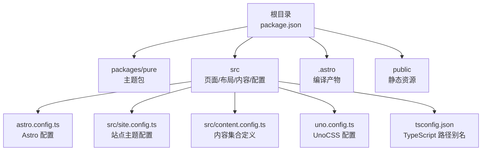
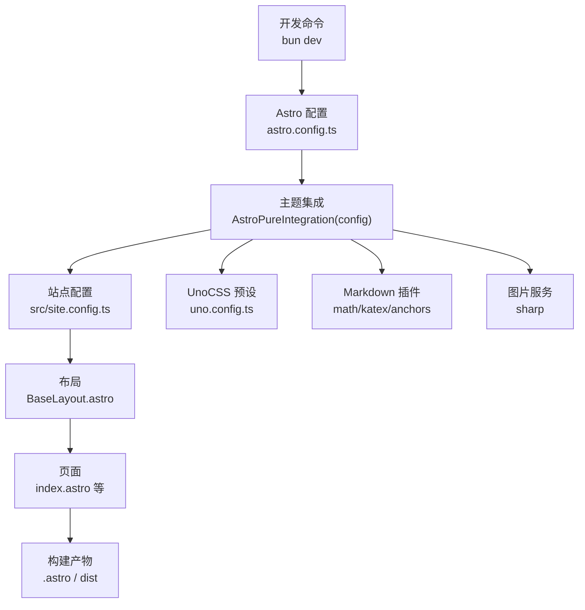
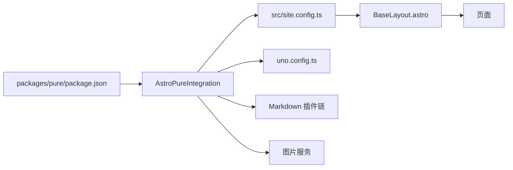

# 快速开始

<cite>
**本文引用的文件**
- [README.md](file://README.md)
- [README-zh-CN.md](file://README-zh-CN.md)
- [package.json](file://package.json)
- [astro.config.ts](file://astro.config.ts)
- [src/site.config.ts](file://src/site.config.ts)
- [src/content.config.ts](file://src/content.config.ts)
- [tsconfig.json](file://tsconfig.json)
- [uno.config.ts](file://uno.config.ts)
- [packages/pure/package.json](file://packages/pure/package.json)
- [packages/pure/README.md](file://packages/pure/README.md)
- [src/layouts/BaseLayout.astro](file://src/layouts/BaseLayout.astro)
- [src/pages/index.astro](file://src/pages/index.astro)
- [.nvmrc](file://.nvmrc)
</cite>

## 目录
1. [简介](#简介)
2. [项目结构](#项目结构)
3. [核心组件](#核心组件)
4. [架构总览](#架构总览)
5. [详细组件分析](#详细组件分析)
6. [依赖关系分析](#依赖关系分析)
7. [性能注意事项](#性能注意事项)
8. [故障排查指南](#故障排查指南)
9. [结论](#结论)
10. [附录](#附录)

## 简介
本指南面向首次接触 Astro 主题 Pure 的用户，帮助你在最短时间内完成环境准备、项目克隆、依赖安装、本地开发与构建预览，并对项目结构与关键配置文件进行基础解读。你将学会：
- 准备 Node.js 18+ 环境（推荐使用 nvm 或直接安装）
- 使用 bun 作为包管理器进行安装与开发
- 启动本地开发服务器并了解常用命令
- 理解站点配置、内容集合与 UnoCSS 配置的作用
- 首次运行后的基本验证步骤与常见问题排查

## 项目结构
该项目采用 Astro 官方推荐的分层组织方式，结合主题包 astro-pure 提供的集成能力，形成“主题模板 + 主题包”的工作空间结构。核心目录与职责概览如下：
- packages/pure：主题包源码与导出，提供组件、工具、类型与 CLI
- src：页面、布局、内容、样式与站点配置
- .astro：Astro 编译产物与中间状态
- public：静态资源（图标、图片、脚本等）
- 配置文件：astro.config.ts、tsconfig.json、uno.config.ts、src/site.config.ts、src/content.config.ts

图表来源
- [package.json](file://package.json#L1-L45)
- [astro.config.ts](file://astro.config.ts#L1-L133)
- [src/site.config.ts](file://src/site.config.ts#L1-L207)
- [src/content.config.ts](file://src/content.config.ts#L1-L77)
- [uno.config.ts](file://uno.config.ts#L1-L193)
- [tsconfig.json](file://tsconfig.json#L1-L31)

章节来源
- [package.json](file://package.json#L1-L45)
- [astro.config.ts](file://astro.config.ts#L1-L133)
- [src/site.config.ts](file://src/site.config.ts#L1-L207)
- [src/content.config.ts](file://src/content.config.ts#L1-L77)
- [uno.config.ts](file://uno.config.ts#L1-L193)
- [tsconfig.json](file://tsconfig.json#L1-L31)

## 核心组件
- 主题包 astro-pure：提供主题集成、组件库、工具函数与 CLI（如创建新文章），并自动注入 sitemap、MDX、UnoCSS 等能力
- 内容系统：通过 src/content.config.ts 定义 blog、docs、process 等集合，支持 Markdown/MDX
- 站点配置：通过 src/site.config.ts 集中管理标题、作者、语言、页眉菜单、页脚、评论、搜索、排版等
- 构建与适配：astro.config.ts 配置站点地址、输出模式、适配器（Vercel）、图片服务、Markdown 插件与实验特性
- 样式与排版：uno.config.ts 基于 presetMini 与 presetTypography，结合站点配置实现主题色与排版优化

章节来源
- [packages/pure/package.json](file://packages/pure/package.json#L1-L51)
- [packages/pure/README.md](file://packages/pure/README.md#L1-L59)
- [src/content.config.ts](file://src/content.config.ts#L1-L77)
- [src/site.config.ts](file://src/site.config.ts#L1-L207)
- [astro.config.ts](file://astro.config.ts#L1-L133)
- [uno.config.ts](file://uno.config.ts#L1-L193)

## 架构总览
下图展示了从开发命令到页面渲染的关键路径，以及主题包与站点配置如何协同工作。

图表来源
- [astro.config.ts](file://astro.config.ts#L1-L133)
- [src/site.config.ts](file://src/site.config.ts#L1-L207)
- [uno.config.ts](file://uno.config.ts#L1-L193)
- [src/layouts/BaseLayout.astro](file://src/layouts/BaseLayout.astro#L1-L92)
- [src/pages/index.astro](file://src/pages/index.astro#L1-L128)

章节来源
- [astro.config.ts](file://astro.config.ts#L1-L133)
- [src/site.config.ts](file://src/site.config.ts#L1-L207)
- [uno.config.ts](file://uno.config.ts#L1-L193)
- [src/layouts/BaseLayout.astro](file://src/layouts/BaseLayout.astro#L1-L92)
- [src/pages/index.astro](file://src/pages/index.astro#L1-L128)

## 详细组件分析

### 环境与安装准备
- Node.js 版本要求：18.0.0+（推荐使用 nvm 管理版本）
- 包管理器：bun（官方文档与脚本均以 bun 为主）
- 工作区：项目使用 npm workspaces，主题包位于 packages/pure

建议步骤
- 安装 Node.js 18+（或使用 nvm 指定版本）
- 克隆仓库并进入目录
- 使用 bun 安装依赖
- 启动开发服务器

章节来源
- [README.md](file://README.md#L55-L81)
- [README-zh-CN.md](file://README-zh-CN.md#L55-L81)
- [.nvmrc](file://.nvmrc#L1-L1)
- [package.json](file://package.json#L1-L45)

### 本地开发与常用命令
- 开发：bun dev
- 检查与开发联启：bun dev:check
- 构建：bun run build
- 预览：bun preview
- 同步：bun sync
- 类型检查：bun check
- 代码格式化：bun format
- 代码质量：bun lint
- 清理缓存：bun clean
- 创建新文章：bun pure new

章节来源
- [package.json](file://package.json#L8-L21)
- [README.md](file://README.md#L68-L81)
- [packages/pure/README.md](file://packages/pure/README.md#L45-L54)

### 项目结构与关键配置文件
- astro.config.ts：站点地址、输出模式、适配器、图片服务、Markdown 插件、Shiki 配置、实验特性
- src/site.config.ts：站点元信息、语言、Logo、页眉菜单、页脚、内容策略、评论、搜索、排版、灯箱等
- src/content.config.ts：定义 blog、docs、process 等内容集合及字段校验
- uno.config.ts：UnoCSS 预设、主题色、排版样式扩展、安全列表
- tsconfig.json：路径别名（@/assets、@/components、@/layouts、@/utils、@/pages、@/types、@/site-config）

章节来源
- [astro.config.ts](file://astro.config.ts#L1-L133)
- [src/site.config.ts](file://src/site.config.ts#L1-L207)
- [src/content.config.ts](file://src/content.config.ts#L1-L77)
- [uno.config.ts](file://uno.config.ts#L1-L193)
- [tsconfig.json](file://tsconfig.json#L1-L31)

### 页面与布局示例
- BaseLayout.astro：统一 HTML 结构、国际化语言、全局样式引入、主题提供者、Header/Footer 容器
- index.astro：首页布局，调用主题包组件与服务函数，展示文章列表、技能标签、随机语录等

章节来源
- [src/layouts/BaseLayout.astro](file://src/layouts/BaseLayout.astro#L1-L92)
- [src/pages/index.astro](file://src/pages/index.astro#L1-L128)

### 主题包与 CLI
- 主题包导出：组件、工具、类型、服务端函数与 CLI
- CLI：提供帮助、信息查询与创建新文章的能力

章节来源
- [packages/pure/package.json](file://packages/pure/package.json#L22-L38)
- [packages/pure/README.md](file://packages/pure/README.md#L45-L54)

## 依赖关系分析
- 主题包 astro-pure 作为核心集成，依赖 Astro、MDX、sitemap、pagefind、UnoCSS 等
- 项目通过 astro.config.ts 引入 AstroPureIntegration 并传入站点配置
- UnoCSS 通过 uno.config.ts 与站点配置联动，实现主题色与排版定制
- 内容系统通过 src/content.config.ts 定义集合，配合 Markdown 插件与 Shiki 实现语法高亮与增强

图表来源
- [packages/pure/package.json](file://packages/pure/package.json#L1-L51)
- [astro.config.ts](file://astro.config.ts#L99-L104)
- [src/site.config.ts](file://src/site.config.ts#L1-L207)
- [uno.config.ts](file://uno.config.ts#L1-L193)

章节来源
- [packages/pure/package.json](file://packages/pure/package.json#L1-L51)
- [astro.config.ts](file://astro.config.ts#L99-L104)
- [src/site.config.ts](file://src/site.config.ts#L1-L207)
- [uno.config.ts](file://uno.config.ts#L1-L193)

## 性能注意事项
- 图片响应式与服务端优化：启用响应式样式与 sharp 图片服务
- 字体预加载与优化：开启字体实验特性，按需加载字体
- 语法高亮与复制按钮：合理设置复制超时与折叠阈值，避免过度渲染
- 预渲染与搜索：保持预渲染开启以支持 pagefind 搜索
- UnoCSS 安全列表：仅添加必要类名，减少样式体积

章节来源
- [astro.config.ts](file://astro.config.ts#L45-L50)
- [astro.config.ts](file://astro.config.ts#L115-L129)
- [astro.config.ts](file://astro.config.ts#L68-L95)
- [src/site.config.ts](file://src/site.config.ts#L34-L35)
- [uno.config.ts](file://uno.config.ts#L184-L191)

## 故障排查指南
- Node.js 版本不匹配
  - 现象：安装或运行时报错
  - 处理：升级至 18.0.0+，或使用 nvm 切换版本
  - 参考：环境要求与 .nvmrc
- bun 安装失败或依赖冲突
  - 现象：bun install 报错
  - 处理：清理缓存后重试，或更换镜像源；确认工作区与主题包版本兼容
- 开发服务器无法访问
  - 现象：localhost 无法打开
  - 处理：检查 server.host 配置、端口占用、防火墙；确保网络代理未拦截
- 构建失败或预览异常
  - 现象：bun run build 或 bun preview 报错
  - 处理：先执行类型检查与格式化，再尝试构建；检查 astro.config.ts 与内容集合定义
- 语法高亮或数学公式显示异常
  - 现象：代码块无高亮或公式不渲染
  - 处理：确认 Shiki 与 KaTeX 插件配置；检查主题包版本与 Astro 版本兼容性
- UnoCSS 样式未生效
  - 现象：排版或颜色不正确
  - 处理：确认 uno.config.ts 预设与站点配置联动；检查安全列表与类名拼写

章节来源
- [README.md](file://README.md#L57-L60)
- [.nvmrc](file://.nvmrc#L1-L1)
- [package.json](file://package.json#L8-L21)
- [astro.config.ts](file://astro.config.ts#L26-L42)
- [astro.config.ts](file://astro.config.ts#L53-L95)
- [uno.config.ts](file://uno.config.ts#L174-L192)

## 结论
通过本指南，你可以快速完成环境准备、克隆与安装、启动开发服务器，并对主题包、内容系统与样式体系有初步认识。建议在本地成功运行后，逐步探索站点配置与内容集合，以满足你的博客/文档需求。

## 附录

### 常用命令清单
- 安装依赖：bun install
- 启动开发：bun dev
- 类型检查与开发联启：bun dev:check
- 构建项目：bun run build
- 预览构建：bun preview
- 同步：bun sync
- 类型检查：bun check
- 代码格式化：bun format
- 代码质量：bun lint
- 清理缓存：bun clean
- 创建新文章：bun pure new

章节来源
- [package.json](file://package.json#L8-L21)
- [README.md](file://README.md#L68-L81)
- [packages/pure/README.md](file://packages/pure/README.md#L45-L54)