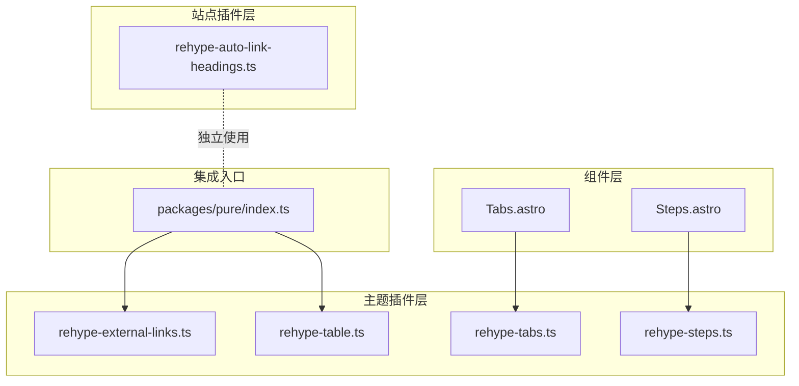
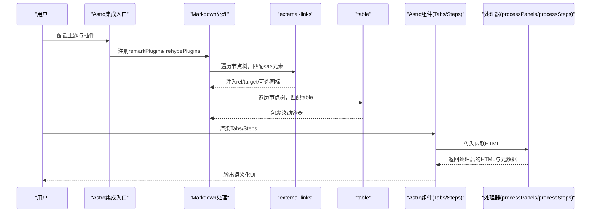
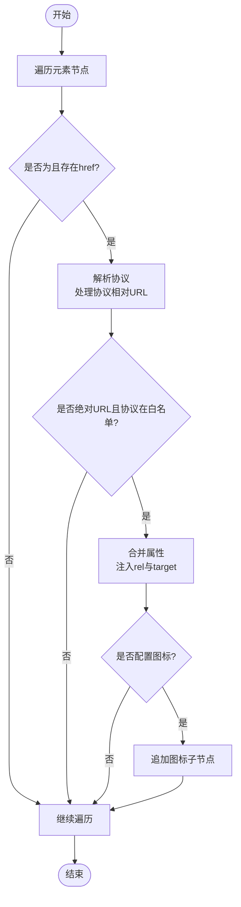
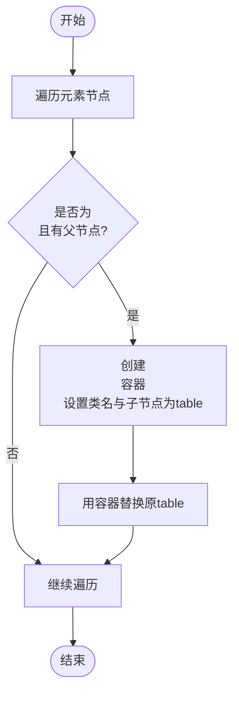
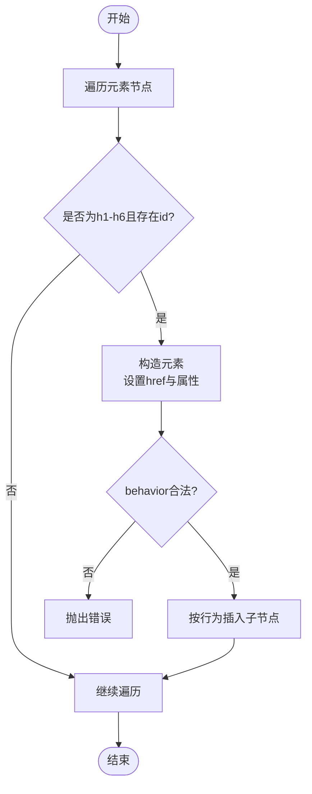
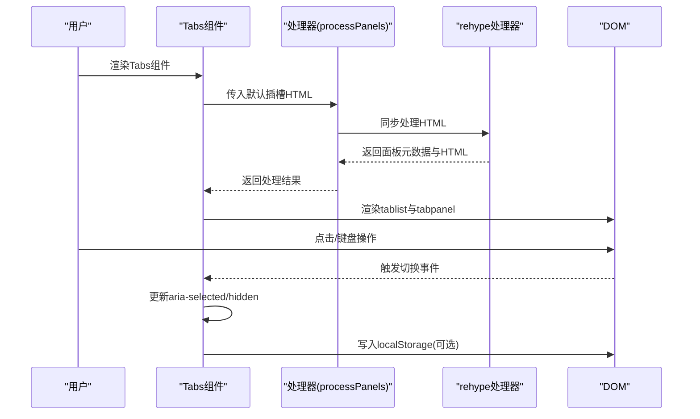
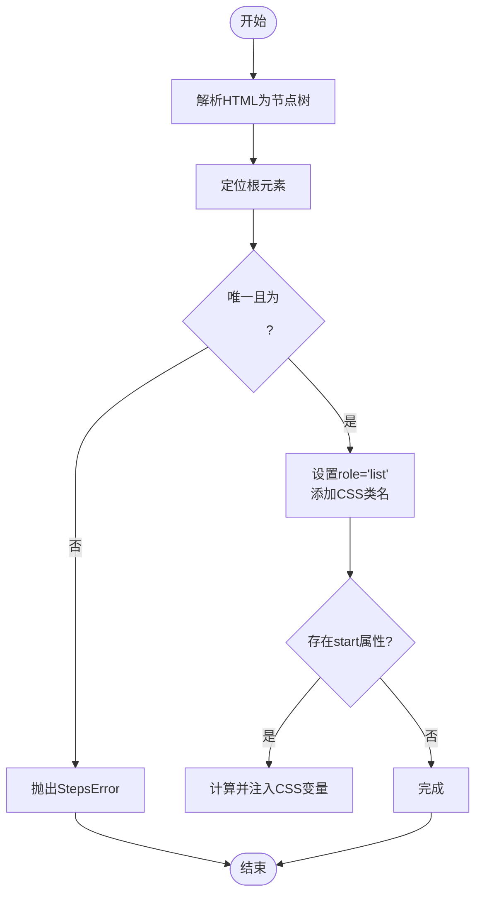
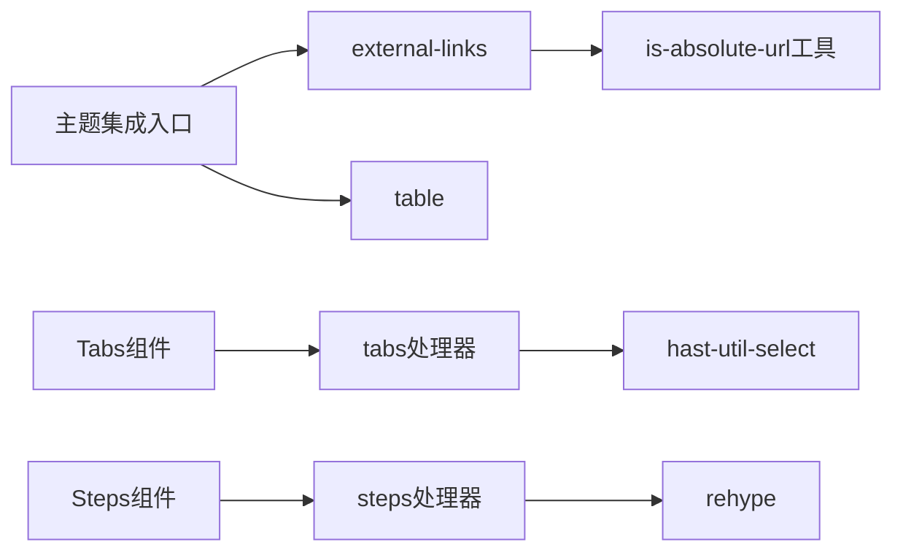

# HTML插件

<cite>
**本文引用的文件**
- [packages/pure/plugins/rehype-external-links.ts](file://packages/pure/plugins/rehype-external-links.ts)
- [packages/pure/plugins/rehype-table.ts](file://packages/pure/plugins/rehype-table.ts)
- [packages/pure/plugins/rehype-tabs.ts](file://packages/pure/plugins/rehype-tabs.ts)
- [packages/pure/plugins/rehype-steps.ts](file://packages/pure/plugins/rehype-steps.ts)
- [src/plugins/rehype-auto-link-headings.ts](file://src/plugins/rehype-auto-link-headings.ts)
- [packages/pure/index.ts](file://packages/pure/index.ts)
- [packages/pure/components/user/Tabs.astro](file://packages/pure/components/user/Tabs.astro)
- [packages/pure/components/user/Steps.astro](file://packages/pure/components/user/Steps.astro)
- [packages/pure/types/theme-config.ts](file://packages/pure/types/theme-config.ts)
- [packages/pure/types/integrations-config.ts](file://packages/pure/types/integrations-config.ts)
- [packages/pure/utils/is-absolute-url.ts](file://packages/pure/utils/is-absolute-url.ts)
</cite>

## 目录
1. [简介](#简介)
2. [项目结构](#项目结构)
3. [核心组件](#核心组件)
4. [架构总览](#架构总览)
5. [详细组件分析](#详细组件分析)
6. [依赖关系分析](#依赖关系分析)
7. [性能考量](#性能考量)
8. [故障排查指南](#故障排查指南)
9. [结论](#结论)
10. [附录](#附录)

## 简介
本文件面向Astro主题Pure的HTML插件体系，聚焦于Rehype插件的开发与配置，系统讲解HTML节点树的遍历与修改机制，并深入解析以下插件：
- auto-link-headings：标题锚点生成与导航增强
- external-links：外链处理与安全策略
- table：表格美化与响应式滚动
- tabs与steps：组件化实现与用户交互设计

同时提供插件开发指南、事件处理与DOM操作技巧、性能优化与内存管理策略，以及实际使用示例与自定义插件开发最佳实践。

## 项目结构
Pure主题在packages/pure/plugins中集中存放HTML处理插件，在src/plugins中存放站点级插件；组件层通过Astro组件调用插件进行内容渲染。

**图表来源**
- [packages/pure/plugins/rehype-external-links.ts](file://packages/pure/plugins/rehype-external-links.ts#L1-L75)
- [packages/pure/plugins/rehype-table.ts](file://packages/pure/plugins/rehype-table.ts#L1-L38)
- [packages/pure/plugins/rehype-tabs.ts](file://packages/pure/plugins/rehype-tabs.ts#L1-L113)
- [packages/pure/plugins/rehype-steps.ts](file://packages/pure/plugins/rehype-steps.ts#L1-L83)
- [src/plugins/rehype-auto-link-headings.ts](file://src/plugins/rehype-auto-link-headings.ts#L1-L43)
- [packages/pure/index.ts](file://packages/pure/index.ts#L19-L96)
- [packages/pure/components/user/Tabs.astro](file://packages/pure/components/user/Tabs.astro#L1-L270)
- [packages/pure/components/user/Steps.astro](file://packages/pure/components/user/Steps.astro#L1-L85)

**章节来源**
- [packages/pure/index.ts](file://packages/pure/index.ts#L19-L96)

## 核心组件
- 外链处理插件（external-links）：识别绝对链接并注入rel、target等属性，可选追加图标提示，保障安全性与可访问性。
- 表格滚动插件（table）：为#content下的table包裹可横向滚动容器，提升移动端可读性。
- 标题自动链接插件（auto-link-headings）：为带id的标题生成锚点链接，支持前置、后置或包裹三种行为。
- Tabs组件与处理器（tabs）：将自定义标签项转换为语义化的tablist与tabpanel结构，支持键盘导航与同步切换。
- Steps组件与处理器（steps）：校验并规范化有序列表为步骤组件，保留语义并注入样式与计数器变量。

**章节来源**
- [packages/pure/plugins/rehype-external-links.ts](file://packages/pure/plugins/rehype-external-links.ts#L37-L74)
- [packages/pure/plugins/rehype-table.ts](file://packages/pure/plugins/rehype-table.ts#L8-L35)
- [src/plugins/rehype-auto-link-headings.ts](file://src/plugins/rehype-auto-link-headings.ts#L7-L42)
- [packages/pure/plugins/rehype-tabs.ts](file://packages/pure/plugins/rehype-tabs.ts#L51-L112)
- [packages/pure/plugins/rehype-steps.ts](file://packages/pure/plugins/rehype-steps.ts#L13-L71)

## 架构总览
插件通过Astro集成入口统一注册到markdown处理流水线中，外部组件在渲染时调用对应处理器对内联HTML进行预处理，再注入到组件模板中。

**图表来源**
- [packages/pure/index.ts](file://packages/pure/index.ts#L57-L66)
- [packages/pure/plugins/rehype-external-links.ts](file://packages/pure/plugins/rehype-external-links.ts#L40-L73)
- [packages/pure/plugins/rehype-table.ts](file://packages/pure/plugins/rehype-table.ts#L9-L34)
- [packages/pure/components/user/Tabs.astro](file://packages/pure/components/user/Tabs.astro#L10-L11)
- [packages/pure/components/user/Steps.astro](file://packages/pure/components/user/Steps.astro#L5-L6)
- [packages/pure/plugins/rehype-tabs.ts](file://packages/pure/plugins/rehype-tabs.ts#L104-L112)
- [packages/pure/plugins/rehype-steps.ts](file://packages/pure/plugins/rehype-steps.ts#L68-L71)

## 详细组件分析

### 外链处理插件（external-links）
- 功能要点
  - 识别绝对URL与协议相对URL，按协议白名单注入rel与target，确保安全与可访问性。
  - 可选在链接末尾追加图标提示，支持自定义属性与类名。
- 节点遍历与修改
  - 使用visit遍历元素节点，筛选a标签并解析href协议。
  - 对满足条件的链接合并属性并追加子节点。
- 安全策略
  - 默认协议白名单包含http与https。
  - 强制rel包含nofollow noopener noreferrer，避免新窗口安全风险。
- 配置来源
  - 主题配置中的content.externalLinks决定图标文本与属性。

**图表来源**
- [packages/pure/plugins/rehype-external-links.ts](file://packages/pure/plugins/rehype-external-links.ts#L40-L73)
- [packages/pure/utils/is-absolute-url.ts](file://packages/pure/utils/is-absolute-url.ts#L27-L35)
- [packages/pure/types/theme-config.ts](file://packages/pure/types/theme-config.ts#L172-L181)

**章节来源**
- [packages/pure/plugins/rehype-external-links.ts](file://packages/pure/plugins/rehype-external-links.ts#L37-L74)
- [packages/pure/utils/is-absolute-url.ts](file://packages/pure/utils/is-absolute-url.ts#L1-L36)
- [packages/pure/types/theme-config.ts](file://packages/pure/types/theme-config.ts#L172-L181)

### 表格滚动插件（table）
- 功能要点
  - 将直接位于#content下的table包裹在可横向滚动的div容器中，解决小屏溢出问题。
- 节点遍历与修改
  - 使用visit定位table元素及其父节点，构造div容器并替换原table位置。
- 样式与布局
  - 容器类名提供水平滚动与居中布局，保证视觉一致性。

**图表来源**
- [packages/pure/plugins/rehype-table.ts](file://packages/pure/plugins/rehype-table.ts#L9-L34)

**章节来源**
- [packages/pure/plugins/rehype-table.ts](file://packages/pure/plugins/rehype-table.ts#L8-L37)

### 标题自动链接插件（auto-link-headings）
- 功能要点
  - 为带id的标题生成锚点链接，支持prepend、append、wrap三种行为。
  - 可配置链接属性与内容，确保可访问性与一致性。
- 节点遍历与修改
  - 使用visit遍历元素，匹配h1-h6且存在id的节点，构造a元素并插入到指定位置。
- 错误处理
  - 对非法behavior抛出错误，避免运行期异常。

**图表来源**
- [src/plugins/rehype-auto-link-headings.ts](file://src/plugins/rehype-auto-link-headings.ts#L12-L41)

**章节来源**
- [src/plugins/rehype-auto-link-headings.ts](file://src/plugins/rehype-auto-link-headings.ts#L7-L42)

### Tabs组件与处理器（tabs）
- 组件职责
  - 接收默认插槽HTML，调用处理器提取面板元数据并格式化为语义化结构。
  - 提供内联脚本与自定义元素，实现同步切换、键盘导航与持久化。
- 处理器逻辑
  - 使用rehype处理器收集面板信息，将自定义标签项转换为div并设置role、id、aria-labelledby等。
  - 自动为首个面板外的其他面板隐藏，必要时为无焦点元素的面板添加tabindex以纳入页面焦点序列。
- 交互设计
  - 支持左右箭头、Home/End键导航；点击与键盘切换均同步到localStorage，跨页面恢复状态。

**图表来源**
- [packages/pure/components/user/Tabs.astro](file://packages/pure/components/user/Tabs.astro#L10-L11)
- [packages/pure/plugins/rehype-tabs.ts](file://packages/pure/plugins/rehype-tabs.ts#L51-L97)
- [packages/pure/plugins/rehype-tabs.ts](file://packages/pure/plugins/rehype-tabs.ts#L104-L112)

**章节来源**
- [packages/pure/components/user/Tabs.astro](file://packages/pure/components/user/Tabs.astro#L1-L270)
- [packages/pure/plugins/rehype-tabs.ts](file://packages/pure/plugins/rehype-tabs.ts#L51-L112)

### Steps组件与处理器（steps）
- 组件职责
  - 接收默认插槽HTML，调用处理器校验并规范化为有序列表步骤组件。
- 处理器逻辑
  - 校验根元素必须为单个ol，否则抛出自定义错误。
  - 设置role="list"与CSS类名，注入起始计数的CSS变量，保留原有样式与类名。
- 错误处理
  - 基于AstroError扩展，提供友好提示与完整HTML上下文，便于调试。

**图表来源**
- [packages/pure/plugins/rehype-steps.ts](file://packages/pure/plugins/rehype-steps.ts#L16-L62)
- [packages/pure/plugins/rehype-steps.ts](file://packages/pure/plugins/rehype-steps.ts#L68-L71)

**章节来源**
- [packages/pure/components/user/Steps.astro](file://packages/pure/components/user/Steps.astro#L1-L85)
- [packages/pure/plugins/rehype-steps.ts](file://packages/pure/plugins/rehype-steps.ts#L13-L83)

## 依赖关系分析
- 插件注册
  - 主题集成入口统一注册remark与rehype插件，外部链接与表格插件在此处启用。
- 组件与插件耦合
  - Tabs与Steps组件通过process函数对接处理器，实现“声明式内容 + 编译期/渲染期处理”的模式。
- 外部依赖
  - 外链插件依赖URL判断工具；处理器内部使用rehype与选择器库；组件层依赖浏览器自定义元素与本地存储API。

**图表来源**
- [packages/pure/index.ts](file://packages/pure/index.ts#L57-L66)
- [packages/pure/plugins/rehype-external-links.ts](file://packages/pure/plugins/rehype-external-links.ts#L3-L6)
- [packages/pure/plugins/rehype-tabs.ts](file://packages/pure/plugins/rehype-tabs.ts#L1-L4)
- [packages/pure/plugins/rehype-steps.ts](file://packages/pure/plugins/rehype-steps.ts#L3-L6)
- [packages/pure/utils/is-absolute-url.ts](file://packages/pure/utils/is-absolute-url.ts#L1-L36)

**章节来源**
- [packages/pure/index.ts](file://packages/pure/index.ts#L19-L96)

## 性能考量
- 遍历效率
  - 使用unist-util-visit进行深度优先遍历，时间复杂度O(N)，建议仅在必要节点上做分支判断。
- DOM操作最小化
  - 处理器尽量在节点树层面修改，避免多次回流重绘；容器替换采用原地替换策略。
- 内存管理
  - 避免在循环中累积大对象；处理器返回字符串与轻量元数据，减少闭包捕获。
- 可访问性与SEO
  - 外链强制rel与target，标题锚点保持语义化结构，有助于SEO与可访问性评分。
- 构建期与运行期
  - 组件内联脚本仅在需要时注入，避免不必要的客户端代码加载。

[本节为通用指导，无需特定文件来源]

## 故障排查指南
- 外链插件未生效
  - 检查协议白名单与URL格式；确认a标签存在href且非协议相对URL时需为绝对URL。
  - 查看是否正确注入rel与target，以及图标是否被追加。
- 表格未滚动
  - 确认table是否直接位于#content下；检查容器类名是否正确应用。
- 标题锚点不显示
  - 确保标题具备id属性；检查behavior参数是否合法；核对链接属性与内容配置。
- Tabs无法切换或状态不同步
  - 检查自定义元素定义与内联脚本是否正确注入；确认localStorage可用且syncKey一致。
- Steps报错
  - 确认根元素为单个ol；检查start属性与role设置；查看错误提示中的完整HTML上下文。

**章节来源**
- [packages/pure/plugins/rehype-external-links.ts](file://packages/pure/plugins/rehype-external-links.ts#L40-L73)
- [packages/pure/plugins/rehype-table.ts](file://packages/pure/plugins/rehype-table.ts#L9-L34)
- [src/plugins/rehype-auto-link-headings.ts](file://src/plugins/rehype-auto-link-headings.ts#L12-L41)
- [packages/pure/plugins/rehype-tabs.ts](file://packages/pure/plugins/rehype-tabs.ts#L51-L97)
- [packages/pure/plugins/rehype-steps.ts](file://packages/pure/plugins/rehype-steps.ts#L73-L82)

## 结论
Pure主题的HTML插件体系以统一的Astro集成入口为核心，结合节点树遍历与语义化改造，实现了外链安全、表格响应、标题导航、组件化Tabs与Steps等能力。通过清晰的配置与处理器分离，既保证了易用性，也兼顾了可维护性与性能。

[本节为总结，无需特定文件来源]

## 附录

### 开发指南：插件架构与最佳实践
- 插件架构
  - 使用unified生态的transformer模式，接收Root节点，返回相同类型，避免副作用扩散。
  - 在transformer内部使用visit进行节点遍历，按需修改properties与children。
- 事件处理与DOM操作
  - 优先在服务端处理节点树，减少客户端DOM操作；如需客户端交互，采用内联脚本与自定义元素。
- 安全与可访问性
  - 外链强制rel与target；为无焦点元素的面板补充tabindex；为图标提供无障碍描述。
- 性能优化
  - 控制遍历范围与条件判断；避免重复创建节点；合理使用容器替换而非深拷贝。
- 配置与可扩展性
  - 通过主题配置传递插件参数；为处理器提供可选参数与默认值，降低使用者心智负担。

[本节为通用指导，无需特定文件来源]

### 实际使用示例与配置要点
- 外链插件
  - 在主题配置中设置content.externalLinks.content与properties，即可为所有外链追加图标与属性。
- 表格插件
  - 无需额外配置，自动为#content下的table包裹滚动容器。
- 标题锚点插件
  - 在站点插件中启用，配置properties与behavior，确保标题具备id。
- Tabs组件
  - 使用自定义标签项作为插槽内容，处理器会自动提取标签与生成语义化结构。
- Steps组件
  - 传入单个ol作为插槽内容，处理器会校验并规范化为步骤组件。

**章节来源**
- [packages/pure/types/theme-config.ts](file://packages/pure/types/theme-config.ts#L172-L181)
- [packages/pure/index.ts](file://packages/pure/index.ts#L57-L66)
- [src/plugins/rehype-auto-link-headings.ts](file://src/plugins/rehype-auto-link-headings.ts#L7-L11)
- [packages/pure/components/user/Tabs.astro](file://packages/pure/components/user/Tabs.astro#L10-L11)
- [packages/pure/components/user/Steps.astro](file://packages/pure/components/user/Steps.astro#L5-L6)